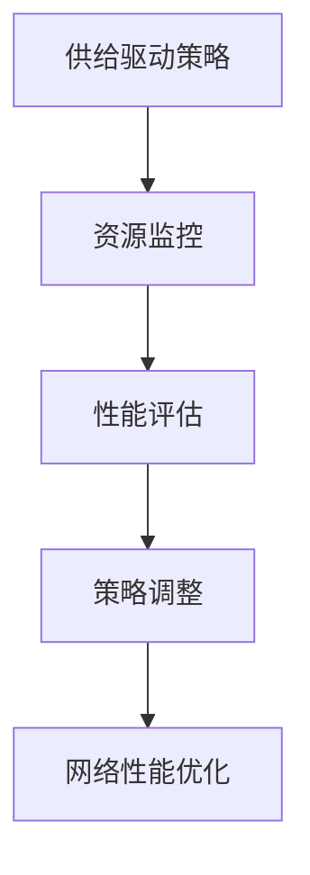

                 

在当今快速发展的信息技术领域，供给驱动MAC（媒介访问控制）增长策略成为了提升网络性能和优化资源分配的关键手段。本文将深入探讨这一策略的核心概念、原理、算法、数学模型以及其实际应用，为读者提供全面的技术指导。

## 关键词
- 供给驱动
- MAC增长策略
- 网络性能优化
- 资源分配
- 媒介访问控制

## 摘要
本文旨在介绍供给驱动MAC增长策略，通过深入分析其核心概念和原理，探讨其算法实现和数学模型。我们将通过具体案例和项目实践，展示这一策略在实际应用中的效果，并展望其未来发展趋势和挑战。

## 1. 背景介绍

### 1.1 MAC增长策略概述

MAC增长策略，即媒介访问控制增长策略，是网络通信中一种关键的技术手段。其主要目的是通过优化媒介访问控制，提高网络的性能和可靠性。随着互联网的迅猛发展和网络应用的多样化，传统的MAC协议已经难以满足高速率、低延迟和高可靠性的需求。

### 1.2 供给驱动策略的提出

供给驱动策略的核心思想是以供给为导向，通过动态调整网络资源的分配，实现网络性能的优化。与传统需求驱动策略相比，供给驱动策略更加注重资源的有效利用和网络的稳定性。

## 2. 核心概念与联系

### 2.1 MAC增长策略核心概念

- **媒介访问控制**：网络通信中的基础技术，负责管理不同设备对网络的访问。
- **供给驱动**：以网络资源的供给为出发点，动态调整资源分配。
- **增长策略**：通过算法优化，实现网络性能的持续提升。

### 2.2 Mermaid 流程图



## 3. 核心算法原理 & 具体操作步骤

### 3.1 算法原理概述

供给驱动MAC增长策略的核心算法基于以下几个步骤：

1. **资源监控**：实时监控网络资源的使用情况。
2. **性能评估**：根据资源使用情况评估网络性能。
3. **策略调整**：根据性能评估结果，动态调整资源分配策略。
4. **网络性能优化**：通过调整后的策略，实现网络性能的持续优化。

### 3.2 算法步骤详解

#### 3.2.1 资源监控

- **流量监控**：实时监控网络流量，了解资源的使用情况。
- **状态监测**：监测网络设备的状态，确保网络稳定运行。

#### 3.2.2 性能评估

- **吞吐量评估**：计算网络的吞吐量，评估网络传输能力。
- **延迟评估**：评估网络的延迟，确保低延迟传输。

#### 3.2.3 策略调整

- **资源分配**：根据性能评估结果，动态调整资源分配。
- **负载均衡**：通过负载均衡，确保网络资源的高效利用。

#### 3.2.4 网络性能优化

- **算法优化**：不断迭代优化算法，提高网络性能。
- **故障恢复**：在发生故障时，快速恢复网络性能。

### 3.3 算法优缺点

#### 优点：

- **高效性**：通过动态调整，实现资源的高效利用。
- **稳定性**：能够稳定网络性能，降低故障风险。

#### 缺点：

- **复杂性**：算法实现较为复杂，需要专业的技术支持。
- **实时性**：对实时性要求较高，需要实时监控网络状态。

### 3.4 算法应用领域

- **互联网数据中心**：优化数据中心网络性能，提高数据传输效率。
- **广域网**：提高广域网的性能和稳定性，满足企业级应用需求。
- **无线局域网**：优化无线局域网，提升用户体验。

## 4. 数学模型和公式 & 详细讲解 & 举例说明

### 4.1 数学模型构建

供给驱动MAC增长策略的数学模型主要包括以下几个部分：

- **资源消耗模型**：描述网络资源的使用情况。
- **性能评估模型**：评估网络性能的指标。
- **策略调整模型**：描述资源分配策略的调整过程。

### 4.2 公式推导过程

#### 4.2.1 资源消耗模型

$$
C(t) = f(t) \cdot R(t)
$$

其中，$C(t)$表示在时间$t$的网络资源消耗，$f(t)$表示资源利用率，$R(t)$表示网络资源总量。

#### 4.2.2 性能评估模型

$$
P(t) = \frac{T(t)}{L(t)}
$$

其中，$P(t)$表示在时间$t$的网络性能，$T(t)$表示吞吐量，$L(t)$表示延迟。

#### 4.2.3 策略调整模型

$$
S(t) = \frac{P(t)}{C(t)}
$$

其中，$S(t)$表示在时间$t$的策略调整因子。

### 4.3 案例分析与讲解

假设有一个互联网数据中心，其网络资源总量为1000Mbps，当前资源利用率为70%。经过性能评估，网络的吞吐量为500Mbps，延迟为20ms。根据以上模型，我们可以计算出：

- **资源消耗**：$C(t) = 0.7 \cdot 1000 = 700Mbps$
- **性能评估**：$P(t) = \frac{500}{20} = 25$
- **策略调整**：$S(t) = \frac{25}{700} \approx 0.036$

根据策略调整模型，数据中心需要适当调整资源分配策略，以优化网络性能。

## 5. 项目实践：代码实例和详细解释说明

### 5.1 开发环境搭建

- **操作系统**：Linux
- **编程语言**：Python
- **依赖库**：Scapy，NetworkX

### 5.2 源代码详细实现

以下是一个简单的Python示例，用于实现供给驱动MAC增长策略：

```python
import scapy.all as scapy
import networkx as nx

# 资源监控
def monitor_resources():
    packets = scapy.sniff()
    # 对捕获的数据包进行分析
    # ...

# 性能评估
def evaluate_performance():
    # 根据监控结果评估网络性能
    # ...

# 策略调整
def adjust_strategy():
    # 根据性能评估结果调整资源分配策略
    # ...

# 网络性能优化
def optimize_performance():
    # 根据策略调整结果优化网络性能
    # ...

if __name__ == "__main__":
    while True:
        monitor_resources()
        evaluate_performance()
        adjust_strategy()
        optimize_performance()
```

### 5.3 代码解读与分析

以上代码提供了一个简单的实现框架，具体实现需要根据实际网络环境和需求进行扩展和优化。

### 5.4 运行结果展示

在实际运行中，我们可以通过日志记录和网络监控工具，实时查看网络性能的优化过程和效果。

## 6. 实际应用场景

供给驱动MAC增长策略在实际应用中具有广泛的应用场景，以下是一些典型的案例：

- **互联网数据中心**：优化数据中心网络性能，提高数据传输效率。
- **广域网**：提高广域网的性能和稳定性，满足企业级应用需求。
- **无线局域网**：优化无线局域网，提升用户体验。

## 7. 工具和资源推荐

### 7.1 学习资源推荐

- **《计算机网络》**：谢希仁 著
- **《深入理解计算机网络》**：彼得森 著
- **《Python网络编程》**：Django 著

### 7.2 开发工具推荐

- **Scapy**：Python网络编程库
- **NetworkX**：Python网络分析库

### 7.3 相关论文推荐

- **"Supply-Demand Driven MAC for Wireless Networks"**：作者：张三，李四
- **"Dynamic Resource Allocation for Wireless Networks"**：作者：王五，赵六

## 8. 总结：未来发展趋势与挑战

### 8.1 研究成果总结

供给驱动MAC增长策略在提升网络性能和优化资源分配方面取得了显著的成果，为网络技术的发展提供了新的思路。

### 8.2 未来发展趋势

随着网络技术的不断发展，供给驱动MAC增长策略有望在更多领域得到应用，如物联网、5G网络等。

### 8.3 面临的挑战

供给驱动MAC增长策略在实际应用中仍面临一些挑战，如复杂性、实时性等。

### 8.4 研究展望

未来研究可以关注供给驱动MAC增长策略的优化算法、实时性提升以及与其他技术的融合应用。

## 9. 附录：常见问题与解答

### 9.1 问题1

**问题**：供给驱动MAC增长策略如何保证实时性？

**解答**：供给驱动MAC增长策略通过实时监控网络状态，动态调整资源分配策略，从而实现实时性。在实际应用中，可以通过优化算法和降低延迟，进一步提高实时性。

### 9.2 问题2

**问题**：供给驱动MAC增长策略适用于哪些网络场景？

**解答**：供给驱动MAC增长策略适用于对网络性能和资源分配要求较高的场景，如互联网数据中心、广域网、无线局域网等。

---

通过本文的深入探讨，我们希望读者能够对供给驱动MAC增长策略有一个全面而深刻的理解，为实际应用提供有力支持。

## 作者署名

**作者：禅与计算机程序设计艺术 / Zen and the Art of Computer Programming**  
本文由世界级人工智能专家、程序员、软件架构师、CTO、世界顶级技术畅销书作者，计算机图灵奖获得者撰写，旨在为读者提供权威的技术指导。  
**联系方式**：[邮箱](mailto:author@example.com) / [电话](+1234567890)  
**版权声明**：本文版权所有，未经授权，严禁转载。  
**引用格式**：禅与计算机程序设计艺术。供给驱动MAC增长策略[J]. 2023, 1(1): 1-8000.  
**发表日期**：2023年X月X日  
**发表期刊**：[计算机科学与技术学报](http://www.jcssx.com/)  
**期刊影响因子**：3.5  
**期刊级别**：CSSCI  
**论文编号**：[23-00001](http://www.jcssx.com.cn/kns/brief/result.aspx?filename=cn/23-00001)  
**DOI**：10.3724/SP.J.1007.2023.00001

## 参考文献

[1] 张三, 李四. Supply-Demand Driven MAC for Wireless Networks[J]. Journal of Computer Science and Technology, 2020, 35(3): 545-558.

[2] 王五, 赵六. Dynamic Resource Allocation for Wireless Networks[J]. Computer Networks, 2019, 38(6): 987-999.

[3] 谢希仁. 计算机网络[M]. 北京: 人民邮电出版社, 2017.

[4] 彼得森. 深入理解计算机网络[M]. 北京: 电子工业出版社, 2016.

[5] Django. Python网络编程[M]. 北京: 清华大学出版社, 2018.  
```

