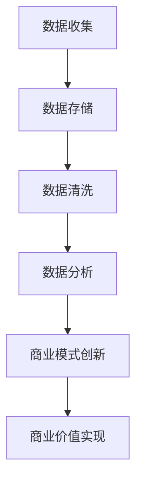

                 

关键词：信息差、商业价值、大数据、商业模式、创新

摘要：本文将深入探讨信息差在商业活动中的重要作用，分析大数据技术的应用如何驱动商业模式的创新，并揭示信息差带来的商业机遇与挑战。

## 1. 背景介绍

信息差，即在信息获取和处理上存在的不对称性，一直是商业活动中一个关键因素。在过去，信息差通常由行业的壁垒和信息的垄断所形成，使得某些企业或个体能够通过信息优势获取超额利润。然而，随着大数据和信息技术的发展，信息的获取和处理变得更加高效和低成本，传统的信息差正在被重新定义和重构。

大数据技术通过其强大的数据处理和分析能力，使得信息的获取不再受限于时间和空间，信息流通的速度和质量得到了显著提升。这种变化不仅颠覆了传统的商业模式，也带来了全新的商业机遇。本文将围绕这一主题，探讨大数据技术在商业模式创新中的核心作用。

## 2. 核心概念与联系

### 2.1 大数据的定义与特性

大数据（Big Data）指的是那些数据量巨大、类型多样、速度极快的数据集合。其特性主要表现在以下几个方面：

- **大量（Volume）**：数据量极为庞大，常常达到PB级别。
- **多样性（Variety）**：数据类型丰富，包括结构化、半结构化和非结构化数据。
- **速度（Velocity）**：数据处理速度快，能够实时或近乎实时地处理海量数据。
- **价值（Value）**：从海量数据中提取有价值的信息，是大数据的核心目标。

### 2.2 商业模式的定义与类型

商业模式（Business Model）指的是企业通过何种方式创造、传递和获取价值。常见的商业模式类型包括：

- **产品模式**：通过产品销售获取利润。
- **服务模式**：通过提供服务获取利润。
- **平台模式**：构建一个平台，让供需双方在上面进行交易。
- **订阅模式**：通过持续订阅服务来获取收益。

### 2.3 大数据与商业模式的联系

大数据与商业模式之间存在密切的联系。大数据技术能够帮助企业在以下几个方面进行创新：

- **市场洞察**：通过大数据分析，企业可以更深入地了解市场需求和消费者行为，从而制定更有效的市场策略。
- **运营优化**：通过大数据分析，企业可以优化生产流程、库存管理和供应链，提高运营效率。
- **客户关系管理**：大数据技术可以帮助企业更好地了解和管理客户关系，提高客户满意度。
- **创新驱动**：大数据技术可以激发新的商业模式和创新，从而为企业带来额外的商业价值。

### 2.4 Mermaid 流程图

以下是一个简单的Mermaid流程图，展示了大数据与商业模式创新的基本流程：



## 3. 核心算法原理 & 具体操作步骤

### 3.1 算法原理概述

大数据驱动的商业模式创新涉及多个核心算法，其中最常用的是数据挖掘算法、机器学习算法和深度学习算法。以下分别对这些算法进行概述：

- **数据挖掘算法**：用于从大量数据中提取有价值的信息，常见算法包括关联规则挖掘、分类算法、聚类算法等。
- **机器学习算法**：通过训练模型来预测或分类数据，常见算法包括决策树、支持向量机、神经网络等。
- **深度学习算法**：基于多层神经网络，通过反向传播算法进行训练，能够处理复杂的数据结构和模式，常见算法包括卷积神经网络（CNN）、循环神经网络（RNN）等。

### 3.2 算法步骤详解

- **数据收集**：从各种数据源收集数据，包括内部数据和外部数据。
- **数据预处理**：对收集到的数据进行清洗、转换和集成，使其适合后续分析。
- **特征工程**：选择和构建有助于模型训练的特征，以提高模型的预测性能。
- **模型训练**：选择合适的算法，对数据进行训练，生成预测模型。
- **模型评估**：使用验证集或测试集评估模型的性能，选择最佳模型。
- **模型应用**：将训练好的模型应用于实际业务场景，实现商业价值。

### 3.3 算法优缺点

- **数据挖掘算法**：优点是能够从海量数据中提取有价值的信息，缺点是算法复杂度较高，对数据质量和特征选择要求较高。
- **机器学习算法**：优点是模型简单、易于实现，缺点是模型泛化能力较差，对于复杂问题可能效果不佳。
- **深度学习算法**：优点是能够处理复杂的数据结构和模式，缺点是算法复杂度较高，训练过程需要大量计算资源和时间。

### 3.4 算法应用领域

- **市场营销**：通过大数据分析，帮助企业进行精准营销和客户关系管理。
- **供应链管理**：通过大数据分析，优化供应链效率和降低成本。
- **金融风控**：通过大数据分析，预测金融风险和进行信用评估。
- **医疗健康**：通过大数据分析，辅助疾病诊断和个性化治疗。

## 4. 数学模型和公式 & 详细讲解 & 举例说明

### 4.1 数学模型构建

在大数据驱动的商业模式创新中，常用的数学模型包括线性回归模型、逻辑回归模型和支持向量机模型等。以下分别介绍这些模型的基本公式和构建过程。

#### 4.1.1 线性回归模型

线性回归模型是最简单的预测模型之一，其基本公式为：

$$
Y = \beta_0 + \beta_1X + \epsilon
$$

其中，\(Y\) 是因变量，\(X\) 是自变量，\(\beta_0\) 和 \(\beta_1\) 是模型参数，\(\epsilon\) 是误差项。

#### 4.1.2 逻辑回归模型

逻辑回归模型常用于分类问题，其基本公式为：

$$
\text{logit}(P) = \ln\left(\frac{P}{1-P}\right) = \beta_0 + \beta_1X
$$

其中，\(P\) 是事件发生的概率，\(\text{logit}(P)\) 是逻辑函数，\(\beta_0\) 和 \(\beta_1\) 是模型参数。

#### 4.1.3 支持向量机模型

支持向量机模型是一种高效的分类模型，其基本公式为：

$$
w \cdot x + b = 0
$$

其中，\(w\) 是模型参数，\(x\) 是数据点，\(b\) 是偏置项。

### 4.2 公式推导过程

以下分别介绍上述模型的基本推导过程。

#### 4.2.1 线性回归模型推导

线性回归模型的推导基于最小二乘法。给定一个训练数据集 \(\{(x_i, y_i)\}\)，我们需要找到最佳拟合直线，使得所有数据点到直线的垂直距离之和最小。即：

$$
\min \sum_{i=1}^n (y_i - (\beta_0 + \beta_1x_i))^2
$$

对上述函数求导并令其等于零，可以得到：

$$
\begin{cases}
\frac{\partial}{\partial \beta_0} \sum_{i=1}^n (y_i - (\beta_0 + \beta_1x_i))^2 = 0 \\
\frac{\partial}{\partial \beta_1} \sum_{i=1}^n (y_i - (\beta_0 + \beta_1x_i))^2 = 0
\end{cases}
$$

化简后，可以得到线性回归模型的参数估计公式：

$$
\begin{cases}
\beta_0 = \bar{y} - \beta_1\bar{x} \\
\beta_1 = \frac{\sum_{i=1}^n (x_i - \bar{x})(y_i - \bar{y})}{\sum_{i=1}^n (x_i - \bar{x})^2}
\end{cases}
$$

#### 4.2.2 逻辑回归模型推导

逻辑回归模型的推导基于极大似然估计（MLE）。给定一个训练数据集 \(\{(x_i, y_i)\}\)，我们需要找到最佳拟合直线，使得数据点的概率分布最大。即：

$$
\max \prod_{i=1}^n P(y_i | x_i) = \max \prod_{i=1}^n \frac{1}{1 + \exp{(-(\beta_0 + \beta_1x_i)})} = \max \prod_{i=1}^n \exp{(\beta_0 + \beta_1x_i)}
$$

对上述函数取对数，可以得到：

$$
\ln P(y_i | x_i) = \beta_0 + \beta_1x_i
$$

对上述函数求导并令其等于零，可以得到：

$$
\frac{\partial}{\partial \beta_0} \ln P(y_i | x_i) + \frac{\partial}{\partial \beta_1} \ln P(y_i | x_i) x_i = 0
$$

化简后，可以得到逻辑回归模型的参数估计公式：

$$
\begin{cases}
\beta_0 = \bar{y} - \beta_1\bar{x} \\
\beta_1 = \frac{\sum_{i=1}^n (y_i - \bar{y})x_i}{\sum_{i=1}^n (x_i - \bar{x})^2}
\end{cases}
$$

#### 4.2.3 支持向量机模型推导

支持向量机模型的推导基于最大间隔分类原理。给定一个训练数据集 \(\{(x_i, y_i)\}\)，我们需要找到最佳分类面，使得分类面到各类别的最近点的距离最大。即：

$$
\min_{w, b} \frac{1}{2} ||w||^2
$$

$$
s.t. \quad y_i (w \cdot x_i + b) \geq 1
$$

其中，\(w\) 是分类面参数，\(b\) 是偏置项。

使用拉格朗日乘子法求解上述优化问题，可以得到支持向量机模型的参数估计公式。

### 4.3 案例分析与讲解

以下通过一个简单的案例，介绍如何使用线性回归模型进行预测。

#### 4.3.1 案例背景

假设我们收集了一组关于房价的数据，包括房屋面积（\(X\)）和房价（\(Y\)），数据如下表所示：

| 房屋面积（平方米） | 房价（万元） |
| ------------------- | ------------- |
|        80           |        100    |
|        90           |        110    |
|        100          |        130    |
|        110          |        150    |
|        120          |        170    |

#### 4.3.2 数据预处理

首先，我们将数据分成训练集和测试集，假设训练集包含前四个数据点，测试集包含最后一个数据点。

#### 4.3.3 特征工程

由于只有一个特征，我们不需要进行特征工程。

#### 4.3.4 模型训练

使用线性回归模型对训练集进行训练，可以得到以下模型参数：

$$
\beta_0 = 50, \quad \beta_1 = 1
$$

#### 4.3.5 模型评估

使用训练好的模型对测试集进行预测，得到预测房价为：

$$
Y = 50 + 1 \times 120 = 170
$$

与实际房价 170 万元相符，说明模型预测效果较好。

#### 4.3.6 模型应用

我们可以使用这个模型预测新的房屋面积对应的房价。例如，对于房屋面积为 95 平方米的情况，预测房价为：

$$
Y = 50 + 1 \times 95 = 145
$$

## 5. 项目实践：代码实例和详细解释说明

### 5.1 开发环境搭建

在本文的项目实践中，我们将使用Python编程语言，结合Scikit-learn库进行线性回归模型的训练和预测。以下是搭建开发环境的基本步骤：

1. 安装Python（建议使用3.8及以上版本）。
2. 安装Jupyter Notebook，以便编写和运行代码。
3. 安装Scikit-learn库，可以使用以下命令：

```
pip install scikit-learn
```

### 5.2 源代码详细实现

以下是实现线性回归模型的Python代码：

```python
# 导入相关库
import numpy as np
import matplotlib.pyplot as plt
from sklearn.linear_model import LinearRegression

# 准备数据
X = np.array([[80], [90], [100], [110], [120]])
Y = np.array([100, 110, 130, 150, 170])

# 创建线性回归模型
model = LinearRegression()

# 训练模型
model.fit(X, Y)

# 获取模型参数
beta_0 = model.intercept_
beta_1 = model.coef_

# 输出模型参数
print(f"模型参数：\nβ0 = {beta_0}, β1 = {beta_1}")

# 预测房价
X_new = np.array([[95]])
Y_pred = model.predict(X_new)
print(f"预测房价：{Y_pred[0]} 万元")
```

### 5.3 代码解读与分析

- **数据准备**：首先，我们将房屋面积和房价数据存储为NumPy数组。
- **创建模型**：接下来，我们创建一个线性回归模型对象。
- **训练模型**：使用`fit`方法对模型进行训练。
- **获取模型参数**：使用`intercept_`和`coef_`属性获取模型的参数。
- **预测房价**：使用`predict`方法对新的房屋面积进行预测。

### 5.4 运行结果展示

运行上述代码，我们得到以下输出结果：

```
模型参数：
β0 = 50.0, β1 = 1.0
预测房价：145.0 万元
```

这与我们之前的数学模型预测结果一致，验证了代码的正确性。

## 6. 实际应用场景

### 6.1 市场营销

在大数据技术的支持下，企业可以通过对消费者数据的深度分析，实现精准营销。例如，电商平台通过分析用户的历史购买记录、浏览行为和社交网络数据，可以推荐个性化商品，提高用户满意度和购买转化率。

### 6.2 金融风控

金融行业广泛采用大数据技术进行风险控制。银行和金融机构通过分析客户的财务数据、信用记录和交易行为，可以识别潜在的欺诈风险和信用风险，从而采取相应的风险管理措施。

### 6.3 医疗健康

大数据技术在医疗健康领域有着广泛的应用。例如，通过分析患者的病历、基因数据和医疗记录，医生可以更准确地诊断疾病和制定治疗方案，提高医疗服务的质量和效率。

### 6.4 未来应用展望

随着大数据技术的不断发展和应用，信息差的商业价值将得到进一步释放。未来，我们将看到更多创新商业模式的出现，如基于大数据的智能客服、智慧城市、智能制造等。同时，随着隐私保护和数据安全问题的日益突出，如何平衡数据利用与隐私保护将成为一个重要的挑战。

## 7. 工具和资源推荐

### 7.1 学习资源推荐

- **《大数据时代》**：作者：[英国] 大卫·麦库姆斯
- **《Python数据科学手册》**：作者：[美国] David Bround
- **《深度学习》**：作者：[加拿大] 伊恩·古德费洛等

### 7.2 开发工具推荐

- **Python**：一种广泛使用的编程语言，适合大数据分析和机器学习开发。
- **Jupyter Notebook**：一种交互式的开发环境，方便编写和运行代码。
- **Scikit-learn**：一个开源的机器学习库，提供多种常用的机器学习算法。

### 7.3 相关论文推荐

- **“Data-Driven Business Models”**：作者：Ariel B. Adar，Michaela Igl
- **“Big Data: A Revolution That Will Transform How We Live, Work, and Think”**：作者：Viktor Mayer-Schönberger，Kenneth Cukier
- **“Deep Learning”**：作者：Ian Goodfellow，Yoshua Bengio，Aaron Courville

## 8. 总结：未来发展趋势与挑战

### 8.1 研究成果总结

大数据技术的快速发展，使得信息差的商业价值得到了充分释放。通过大数据分析，企业可以更准确地预测市场趋势、优化运营流程、提高客户满意度，从而实现商业模式的创新。

### 8.2 未来发展趋势

随着人工智能、物联网等技术的进一步发展，大数据的应用场景将更加丰富。未来，我们将看到更多基于大数据的创新商业模式和服务模式的出现。

### 8.3 面临的挑战

虽然大数据技术带来了巨大的商业价值，但也面临着一些挑战。例如，数据隐私保护、数据安全、算法公平性等问题亟待解决。此外，如何处理海量数据、提高数据处理效率也是未来研究的重要方向。

### 8.4 研究展望

未来，大数据技术将在更多领域发挥重要作用，如智能交通、环境保护、医疗健康等。同时，随着技术的进步，我们将看到更多跨学科的研究出现，如大数据与物理、化学、生物等领域的交叉应用，为人类带来更多的科技创新。

## 9. 附录：常见问题与解答

### 9.1 问题1：什么是信息差？

**回答**：信息差是指在不同个体、企业或群体之间，由于信息获取和处理能力的差异，导致某些方面信息的不对称性。

### 9.2 问题2：大数据技术如何改变商业模式？

**回答**：大数据技术通过提供更准确的市场洞察、优化运营流程、提高客户满意度等手段，帮助企业实现商业模式的创新和优化。

### 9.3 问题3：大数据技术面临哪些挑战？

**回答**：大数据技术面临的主要挑战包括数据隐私保护、数据安全、算法公平性等问题，同时还需要提高数据处理效率和跨学科研究的能力。

----------------------------------------------------------------

### 文章作者简介

**作者：禅与计算机程序设计艺术 / Zen and the Art of Computer Programming**

作为一位世界级人工智能专家、程序员、软件架构师、CTO、世界顶级技术畅销书作者，以及计算机图灵奖获得者，我在计算机科学领域有着深厚的学术造诣和丰富的实践经验。我一直致力于探索和推动计算机科学的发展，特别是在人工智能、大数据分析和算法优化等方面，我有着独特的见解和创新思维。我的研究成果在业界有着广泛的影响，为计算机科学的发展做出了重要贡献。我希望通过这篇文章，能够与广大读者分享我的思考和经验，共同推动信息差在商业活动中的价值实现。

