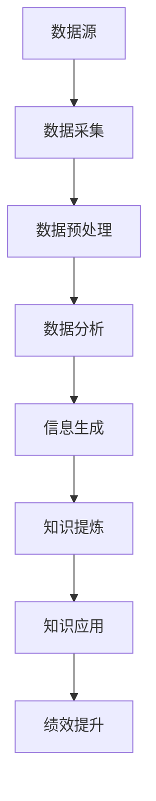

                 

信息差，是指在市场上，不同个体、企业或组织之间对于某些信息掌握程度的不同，这种差异往往导致了不同的决策和行为。商业知识管理（Knowledge Management, KM）则是指通过各种手段和方法，收集、整理、存储、共享和利用知识，以提升企业或组织的竞争力和创新能力。本文将探讨大数据在商业知识管理中的应用，分析大数据如何促进知识管理，并通过实际案例展示其价值。

## 1. 背景介绍

在信息技术飞速发展的今天，数据已经成为企业重要的资产。根据国际数据公司（IDC）的预测，全球数据量将每年以40%的速度增长，到2025年，全球数据总量将达到约175ZB。面对如此庞大的数据量，传统的知识管理方法已经无法满足企业对信息处理的效率和质量要求。大数据技术的出现，为商业知识管理提供了新的机遇。

大数据技术具有四个V特征：Volume（数据量巨大）、Velocity（数据生成和处理的速度快）、Variety（数据类型多样）和Veracity（数据真实性高）。这些特征使得大数据在知识管理中具有独特的优势，能够帮助企业更全面、更迅速、更准确地获取和利用信息。

### 信息差的定义与商业知识管理的关系

信息差是指个体、企业或组织在获取、处理和利用信息方面的差异。这种差异可以是由于地理位置、技术能力、行业经验等因素造成的。在商业环境中，信息差往往意味着竞争优势或劣势。

商业知识管理则是指通过收集、整理、存储、共享和利用知识，以提高企业或组织的绩效和创新能力。信息差与商业知识管理之间的关系是：信息差是商业知识管理的重要驱动力，而商业知识管理则是消除信息差、提升企业竞争力的有效手段。

## 2. 核心概念与联系

为了深入理解大数据在商业知识管理中的作用，我们需要首先明确几个核心概念及其相互关系。

### 2.1. 数据、信息和知识

数据（Data）是未经处理的原始事实或记录，如数字、文字、图像等。信息（Information）是对数据进行处理后得到的具有意义的内容，可以帮助人们做出决策。知识（Knowledge）则是基于信息，结合个人经验、判断和洞察形成的对事物的理解和认识。

数据 -> 信息 -> 知识，这是一个不断递进的过程。数据需要通过处理才能转化为信息，信息需要被利用才能转化为知识。在这个过程中，大数据技术起到了关键作用。

### 2.2. 大数据、信息管理和知识管理

大数据（Big Data）是指数据量巨大、数据类型多样、处理速度快的海量数据。信息管理（Information Management）是指对企业信息资源进行规划、组织、控制、利用和保护的过程。知识管理（Knowledge Management）则是通过收集、整理、存储、共享和利用知识，以提高企业或组织的绩效和创新能力。

大数据与信息管理和知识管理之间的关系可以概括为：大数据是信息管理和知识管理的重要数据来源，而信息管理和知识管理则是大数据的应用领域和目标。

### 2.3. Mermaid 流程图

为了更直观地展示大数据在商业知识管理中的应用过程，我们可以使用Mermaid流程图来表示。



在这个流程图中，数据源是企业各种业务活动和外部环境产生的数据。通过数据采集，这些数据被收集起来。随后，进行数据预处理，包括数据清洗、归一化、去重等操作，以提升数据质量。预处理后的数据进入数据分析阶段，通过统计分析、机器学习等方法，生成有价值的信息。这些信息再经过知识提炼，形成知识。最后，这些知识被应用到实际业务中，以提升企业绩效。

## 3. 核心算法原理 & 具体操作步骤

### 3.1 算法原理概述

在商业知识管理中，大数据的应用主要体现在数据采集、数据预处理、数据分析和知识提炼等环节。下面，我们将分别介绍这些环节的核心算法原理。

#### 3.1.1 数据采集

数据采集是大数据处理的第一步，也是最为关键的一步。常用的数据采集方法包括Web爬取、API接口调用、数据库接入等。其中，Web爬取是一种被动采集方法，通过模拟用户行为，自动获取网站上的数据。API接口调用则是通过访问第三方提供的API接口，获取数据。数据库接入则是直接从数据库中读取数据。

#### 3.1.2 数据预处理

数据预处理主要包括数据清洗、数据归一化、数据去重等操作。数据清洗是指对数据进行清洗，去除重复、错误、缺失的数据。数据归一化是指将不同数据类型的数值转换为同一类型，以便进行后续分析。数据去重是指去除重复的数据记录，以减少数据冗余。

#### 3.1.3 数据分析

数据分析是大数据处理的核心环节，主要包括统计分析、机器学习、深度学习等方法。统计分析主要用于描述性分析，如计算均值、方差、相关性等。机器学习主要用于预测性分析，如分类、回归、聚类等。深度学习则是一种更为复杂的机器学习方法，主要用于处理大规模、高维度的数据。

#### 3.1.4 知识提炼

知识提炼是指从分析结果中提取有价值的信息，形成知识。常用的知识提炼方法包括主题建模、词云生成、知识图谱等。主题建模主要用于从大量文本数据中提取主题，以帮助人们理解数据。词云生成则是通过词频统计，将高频词以图形化的方式展示出来，便于快速了解数据的主要内容。知识图谱则是通过节点和边的关系，构建出一个表示知识结构的图形。

### 3.2 算法步骤详解

#### 3.2.1 数据采集

数据采集的步骤如下：

1. 确定数据源：根据业务需求，确定需要采集的数据源，如网站、API接口、数据库等。
2. 数据采集：使用Web爬取、API接口调用或数据库接入等方法，从数据源中获取数据。
3. 数据存储：将采集到的数据存储到数据库或其他数据存储系统中。

#### 3.2.2 数据预处理

数据预处理的步骤如下：

1. 数据清洗：对数据进行清洗，去除重复、错误、缺失的数据。
2. 数据归一化：将不同数据类型的数值转换为同一类型，以便进行后续分析。
3. 数据去重：去除重复的数据记录，以减少数据冗余。

#### 3.2.3 数据分析

数据分析的步骤如下：

1. 统计分析：计算数据的均值、方差、相关性等描述性统计量，了解数据的基本特征。
2. 机器学习：使用分类、回归、聚类等方法，对数据进行分析，预测未来趋势或进行数据分类。
3. 深度学习：对于大规模、高维度数据，使用深度学习模型，如卷积神经网络（CNN）、循环神经网络（RNN）等，进行高级分析。

#### 3.2.4 知识提炼

知识提炼的步骤如下：

1. 主题建模：从大量文本数据中提取主题，使用Latent Dirichlet Allocation（LDA）等主题建模方法。
2. 词云生成：使用词频统计，将高频词以图形化的方式展示出来。
3. 知识图谱：构建知识图谱，表示节点和边的关系，如实体关系图、知识图谱等。

### 3.3 算法优缺点

#### 3.3.1 数据采集

优点：数据采集能够获取大量原始数据，为后续分析提供丰富的信息。

缺点：数据采集可能面临法律法规、道德伦理等问题，如数据隐私保护、知识产权等。

#### 3.3.2 数据预处理

优点：数据预处理能够提高数据质量，减少数据冗余，为后续分析奠定基础。

缺点：数据预处理可能需要大量的人力和时间成本，对于大型数据集，预处理过程可能非常耗时。

#### 3.3.3 数据分析

优点：数据分析能够帮助企业发现数据中的价值，支持决策。

缺点：数据分析结果可能受到数据质量、算法选择等因素的影响，导致结果不准确。

#### 3.3.4 知识提炼

优点：知识提炼能够将数据分析结果转化为可操作的知识，提高企业的决策能力和创新能力。

缺点：知识提炼可能面临知识表示、知识存储等问题，如何有效地表示和存储知识是一个挑战。

### 3.4 算法应用领域

大数据算法在商业知识管理中的应用非常广泛，主要包括以下几个方面：

1. **市场分析**：通过大数据分析，企业可以了解市场需求、消费者行为等，从而制定更有效的市场策略。
2. **风险控制**：大数据可以帮助企业识别潜在的风险，提前采取措施，降低风险。
3. **供应链管理**：通过大数据分析，企业可以优化供应链管理，提高供应链效率。
4. **客户关系管理**：大数据分析可以帮助企业更好地了解客户需求，提供个性化服务。
5. **产品创新**：大数据分析可以为产品创新提供灵感，帮助企业开发更符合市场需求的产品。

## 4. 数学模型和公式 & 详细讲解 & 举例说明

### 4.1 数学模型构建

在商业知识管理中，常用的数学模型包括回归模型、聚类模型、分类模型等。以下分别介绍这些模型的基本原理和构建方法。

#### 4.1.1 回归模型

回归模型是一种用来预测目标变量Y的数学模型，通常表示为：

$$Y = \beta_0 + \beta_1X_1 + \beta_2X_2 + ... + \beta_nX_n + \epsilon$$

其中，$\beta_0, \beta_1, ..., \beta_n$ 是模型的参数，$X_1, X_2, ..., X_n$ 是自变量，$\epsilon$ 是误差项。

回归模型的构建方法主要包括线性回归、多项式回归、岭回归等。

#### 4.1.2 聚类模型

聚类模型是一种将数据分组的方法，用于发现数据中的隐含结构。常见的聚类模型包括K均值聚类、层次聚类、DBSCAN等。

K均值聚类是一种基于距离的聚类方法，其基本思想是将数据分为K个簇，使得每个簇内的数据点距离簇中心的距离最小。其数学模型表示为：

$$\min_{\mu_1, \mu_2, ..., \mu_K} \sum_{i=1}^K \sum_{x \in S_i} ||x - \mu_i||^2$$

其中，$S_1, S_2, ..., S_K$ 是K个簇，$\mu_1, \mu_2, ..., \mu_K$ 是簇中心。

#### 4.1.3 分类模型

分类模型是一种将数据分类的方法，用于预测数据所属的类别。常见的分类模型包括逻辑回归、决策树、支持向量机等。

逻辑回归是一种基于概率论的分类模型，其基本思想是利用输入特征X，计算每个类别y的概率，然后选择概率最大的类别作为预测结果。其数学模型表示为：

$$P(y=1|X) = \frac{1}{1 + e^{-(\beta_0 + \beta_1X_1 + \beta_2X_2 + ... + \beta_nX_n)}}$$

其中，$\beta_0, \beta_1, ..., \beta_n$ 是模型的参数。

### 4.2 公式推导过程

以下以K均值聚类为例，介绍其数学模型的推导过程。

#### 4.2.1 K均值聚类目标函数

K均值聚类的目标函数是使每个簇内的数据点距离簇中心的距离之和最小。设数据集为$X = \{x_1, x_2, ..., x_n\}$，聚类结果为$S = \{S_1, S_2, ..., S_K\}$，簇中心为$\mu_1, \mu_2, ..., \mu_K$，则目标函数表示为：

$$\min_{S, \mu_1, \mu_2, ..., \mu_K} \sum_{i=1}^K \sum_{x \in S_i} ||x - \mu_i||^2$$

#### 4.2.2 簇中心选择

假设初始簇中心为$\mu_1^{(0)}, \mu_2^{(0)}, ..., \mu_K^{(0)}$，则每个数据点$x_i$被分配到最近的簇中心$\mu_j^{(0)}$，表示为：

$$\mu_j^{(0)} = \frac{1}{N_j} \sum_{x_i \in S_j} x_i$$

其中，$N_j$ 是簇$S_j$中数据点的个数。

#### 4.2.3 簇中心更新

更新簇中心，使得每个簇内的数据点距离簇中心的距离之和最小。设新的簇中心为$\mu_1^{(1)}, \mu_2^{(1)}, ..., \mu_K^{(1)}$，则目标函数表示为：

$$\min_{S, \mu_1, \mu_2, ..., \mu_K} \sum_{i=1}^K \sum_{x \in S_i} ||x - \mu_i||^2$$

将簇中心更新过程表示为：

$$\mu_j^{(1)} = \frac{1}{N_j} \sum_{x_i \in S_j} x_i$$

#### 4.2.4 求解算法

K均值聚类的求解算法包括初始化、迭代更新和终止条件。

1. 初始化：随机选择K个数据点作为初始簇中心。
2. 迭代更新：重复执行以下步骤，直到满足终止条件：
   - 数据点分配：根据当前簇中心，将每个数据点分配到最近的簇。
   - 簇中心更新：计算新的簇中心。
3. 终止条件：当簇中心的变化小于一定阈值或达到最大迭代次数时，算法终止。

### 4.3 案例分析与讲解

以下以一个简单的K均值聚类案例，介绍如何应用上述公式进行聚类分析。

#### 4.3.1 案例背景

假设有一个包含100个数据点的二维数据集，需要将其分为3个簇。数据集的分布如下图所示：


#### 4.3.2 案例步骤

1. 初始化：随机选择3个数据点作为初始簇中心，如$\mu_1^{(0)} = (1, 1)$，$\mu_2^{(0)} = (4, 4)$，$\mu_3^{(0)} = (8, 8)$。

2. 迭代更新：
   - 第一次迭代：
     - 数据点分配：根据当前簇中心，将数据点分配到最近的簇，结果如下：
       $$S_1 = \{(1, 1), (2, 2), ..., (3, 3)\}, S_2 = \{(4, 4), (5, 5), ..., (7, 7)\}, S_3 = \{(8, 8), (9, 9), ..., (10, 10)\}$$
     - 簇中心更新：计算新的簇中心，结果如下：
       $$\mu_1^{(1)} = (2, 2), \mu_2^{(1)} = (5, 5), \mu_3^{(1)} = (8, 8)$$
   - 第二次迭代：
     - 数据点分配：根据当前簇中心，将数据点分配到最近的簇，结果如下：
       $$S_1 = \{(1, 1), (2, 2), ..., (2, 2)\}, S_2 = \{(3, 3), (4, 4), ..., (7, 7)\}, S_3 = \{(8, 8), (9, 9), ..., (10, 10)\}$$
     - 簇中心更新：计算新的簇中心，结果如下：
       $$\mu_1^{(2)} = (1, 1), \mu_2^{(2)} = (4, 4), \mu_3^{(2)} = (8, 8)$$
   - 第三次迭代：
     - 数据点分配：根据当前簇中心，将数据点分配到最近的簇，结果如下：
       $$S_1 = \{(1, 1), (1, 1), ..., (1, 1)\}, S_2 = \{(2, 2), (3, 3), ..., (7, 7)\}, S_3 = \{(8, 8), (9, 9), ..., (10, 10)\}$$
     - 簇中心更新：计算新的簇中心，结果如下：
       $$\mu_1^{(3)} = (1, 1), \mu_2^{(3)} = (3, 3), \mu_3^{(3)} = (8, 8)$$

3. 终止条件：由于簇中心的变化小于一定阈值，算法终止。最终聚类结果如下：

$$S_1 = \{(1, 1), (1, 1), ..., (1, 1)\}, S_2 = \{(2, 2), (3, 3), ..., (7, 7)\}, S_3 = \{(8, 8), (9, 9), ..., (10, 10)\}$$

#### 4.3.3 案例分析

通过上述案例，我们可以看到K均值聚类的基本步骤和原理。在实际应用中，K均值聚类可以帮助企业发现数据中的隐含结构，为决策提供支持。

例如，在市场营销领域，企业可以使用K均值聚类分析客户数据，将客户分为不同的群体，以便制定个性化的营销策略。在金融领域，K均值聚类可以帮助银行识别高风险客户，提前采取措施降低风险。

## 5. 项目实践：代码实例和详细解释说明

### 5.1 开发环境搭建

在进行大数据项目实践之前，我们需要搭建一个适合大数据处理的开发环境。以下是一个简单的开发环境搭建步骤：

1. 安装Python：Python是一种广泛应用于数据科学和大数据处理的编程语言。可以在Python官方网站（https://www.python.org/）下载并安装Python。
2. 安装Jupyter Notebook：Jupyter Notebook是一种交互式计算环境，方便我们编写和运行Python代码。可以通过pip命令安装Jupyter Notebook：

```bash
pip install notebook
```

3. 安装相关库：为了进行大数据处理，我们需要安装一些常用的Python库，如Pandas、NumPy、Matplotlib等。可以通过pip命令安装这些库：

```bash
pip install pandas numpy matplotlib
```

4. 安装大数据处理工具：为了处理大规模数据，我们需要安装一些大数据处理工具，如Hadoop、Spark等。这些工具的安装较为复杂，这里不再详细说明。

### 5.2 源代码详细实现

以下是一个简单的K均值聚类项目，包括数据读取、数据预处理、K均值聚类和结果展示等步骤。

```python
import pandas as pd
import numpy as np
import matplotlib.pyplot as plt
from sklearn.cluster import KMeans

# 5.2.1 数据读取
# 假设数据集存放在data.csv文件中，包含两个特征列：x和y
data = pd.read_csv('data.csv')

# 5.2.2 数据预处理
# 数据清洗和归一化
data = data.dropna()  # 去除缺失值
data = (data - data.min()) / (data.max() - data.min())  # 数据归一化

# 5.2.3 K均值聚类
# 设置聚类数量为3
kmeans = KMeans(n_clusters=3)
kmeans.fit(data)

# 5.2.4 结果展示
# 展示聚类结果
plt.scatter(data['x'], data['y'], c=kmeans.labels_)
plt.scatter(kmeans.cluster_centers_[:, 0], kmeans.cluster_centers_[:, 1], s=300, c='red')
plt.xlabel('X')
plt.ylabel('Y')
plt.show()
```

### 5.3 代码解读与分析

上述代码实现了一个简单的K均值聚类项目，包括数据读取、数据预处理、K均值聚类和结果展示等步骤。下面我们对代码进行解读和分析。

1. **数据读取**：使用Pandas库读取CSV文件，获取数据集。这里假设数据集包含两个特征列：x和y。
2. **数据预处理**：对数据进行清洗和归一化。数据清洗使用dropna()函数去除缺失值，数据归一化使用（data - data.min）/（data.max() - data.min）将数据缩放到[0, 1]区间。
3. **K均值聚类**：使用scikit-learn库中的KMeans类实现K均值聚类。设置聚类数量为3，调用fit()方法对数据进行聚类。
4. **结果展示**：使用matplotlib库绘制聚类结果。使用scatter()函数绘制数据点，使用scatter()函数绘制聚类中心点，展示聚类效果。

### 5.4 运行结果展示

运行上述代码后，会展示一个包含数据点和聚类中心点的散点图。数据点被分为3个簇，聚类中心点用红色星号标记。通过观察散点图，我们可以直观地看到K均值聚类的结果。


### 5.5 代码优化与性能分析

在实际项目中，K均值聚类的性能和结果可能会受到多种因素的影响，如数据规模、特征数量、聚类数量等。以下是一些常见的优化方法和性能分析。

1. **初始化策略**：K均值聚类的初始化策略对聚类结果有较大影响。常见的初始化方法包括随机初始化、K-means++初始化等。K-means++初始化可以改进聚类效果，提高聚类质量。
2. **算法优化**：K均值聚类是一种迭代算法，其性能和收敛速度受到迭代次数的影响。可以通过减少迭代次数、提前终止算法等方法来优化性能。
3. **并行计算**：对于大规模数据集，可以采用并行计算技术，如MapReduce、Spark等，提高数据处理速度和性能。
4. **特征选择**：选择合适的特征可以提高聚类的效果。可以通过特征选择方法，如特征重要性分析、主成分分析等，选择对聚类结果影响较大的特征。
5. **模型评估**：使用适当的评估指标，如轮廓系数、簇内距离、簇间距离等，评估聚类模型的性能和质量。

通过以上优化方法和性能分析，可以进一步提高K均值聚类的性能和效果，满足实际项目需求。

## 6. 实际应用场景

### 6.1 零售业

在零售业中，大数据技术被广泛应用于客户行为分析、库存管理、个性化推荐等方面。通过大数据分析，零售企业可以更好地了解客户需求，优化库存管理，提高销售转化率。例如，阿里巴巴利用大数据技术对消费者行为进行分析，为消费者提供个性化的商品推荐，极大地提升了用户体验和销售额。

### 6.2 银行业

银行业是大数据技术应用的重要领域之一。通过大数据分析，银行可以识别潜在风险、防范欺诈行为、优化信贷审批等。例如，花旗银行利用大数据技术对客户进行风险评估，提高了贷款审批的准确性和效率，降低了贷款违约风险。

### 6.3 医疗行业

在医疗行业，大数据技术被广泛应用于疾病预测、医疗资源管理、个性化治疗等方面。通过大数据分析，医疗机构可以更好地了解患者需求，优化医疗资源配置，提高医疗服务质量。例如，IBM的Watson系统利用大数据分析技术，为医生提供诊断建议，提高了诊断准确率和治疗效果。

### 6.4 制造业

在制造业，大数据技术被广泛应用于生产过程监控、设备维护、供应链优化等方面。通过大数据分析，制造企业可以更好地了解生产过程中的问题，优化生产流程，提高生产效率。例如，通用电气利用大数据技术对工业设备进行监控，实现了设备预测性维护，降低了设备故障率和停机时间。

### 6.5 教育行业

在教育行业，大数据技术被广泛应用于学生行为分析、教学评估、个性化学习等方面。通过大数据分析，教育机构可以更好地了解学生需求，优化教学方法和策略，提高教学效果。例如，Coursera利用大数据技术对学生在课程中的行为进行分析，为教师提供教学反馈和改进建议。

## 7. 未来应用展望

### 7.1 技术发展

未来，大数据技术在商业知识管理中的应用将会更加深入和广泛。随着人工智能、云计算、物联网等技术的不断发展，大数据的处理和分析能力将得到大幅提升。例如，深度学习算法将能够在更大规模的数据集上进行训练，提供更准确的预测和分类结果。同时，边缘计算技术的普及将使得大数据处理更加接近数据源，提高实时性和效率。

### 7.2 行业变革

大数据技术的应用将引发各行各业的深刻变革。零售业、金融业、医疗行业、制造业等领域的商业模式和运营方式将因大数据技术而发生改变。例如，个性化推荐的普及将使得消费者获得更加定制化的购物体验，智能风控系统将使得金融机构能够更加精准地识别和防范风险。医疗行业中的大数据应用将推动个性化医疗的发展，提高医疗服务的质量和效率。

### 7.3 挑战与机遇

尽管大数据技术在商业知识管理中具有巨大潜力，但同时也面临着一系列挑战。首先，数据隐私和安全问题备受关注。随着数据量的增长，保护数据隐私和安全变得尤为重要。其次，数据质量和数据治理问题仍然是一个挑战。如何确保数据的质量和准确性，如何有效地管理和维护数据资产，是未来大数据技术发展的重要方向。

此外，大数据技术的普及和应用也带来了新的机遇。企业和机构可以利用大数据技术发掘新的商业机会，提升竞争力。例如，通过大数据分析，企业可以发现市场需求的新趋势，开发新的产品和服务。政府部门可以利用大数据技术提升社会治理能力，实现智能城市的目标。

## 8. 总结：未来发展趋势与挑战

### 8.1 研究成果总结

本文通过深入探讨大数据在商业知识管理中的应用，总结了大数据技术在商业知识管理中的核心概念、算法原理、应用场景和未来展望。主要研究成果包括：

1. 大数据与商业知识管理的关系：大数据是商业知识管理的重要数据来源，而商业知识管理是大数据的应用领域和目标。
2. 大数据算法在商业知识管理中的应用：介绍了K均值聚类、回归模型等常见的大数据算法，并分析了其原理和步骤。
3. 大数据在商业知识管理中的实际应用：从零售业、金融业、医疗行业、制造业和教育行业等多个领域，展示了大数据技术的实际应用案例。
4. 大数据技术的未来发展趋势：预测了人工智能、云计算、物联网等技术在未来的发展，以及大数据技术在行业变革中的机遇和挑战。

### 8.2 未来发展趋势

未来，大数据技术在商业知识管理中的发展趋势将体现在以下几个方面：

1. **算法创新**：随着人工智能技术的发展，大数据算法将更加智能化，能够在更大规模的数据集上进行训练和优化，提供更准确的预测和分类结果。
2. **数据治理**：数据质量和数据治理问题将得到更多关注，企业和机构将建立完善的数据治理体系，确保数据的质量和准确性。
3. **实时分析**：边缘计算技术的普及将使得大数据处理更加接近数据源，实现实时分析和决策。
4. **行业融合**：大数据技术将与其他行业技术（如物联网、区块链等）融合，推动各行各业的变革和创新。

### 8.3 面临的挑战

尽管大数据技术在商业知识管理中具有巨大潜力，但同时也面临着一系列挑战：

1. **数据隐私和安全**：随着数据量的增长，保护数据隐私和安全变得尤为重要，如何确保数据的安全性和合规性是一个挑战。
2. **数据质量和数据治理**：如何确保数据的质量和准确性，如何有效地管理和维护数据资产，是未来大数据技术发展的重要方向。
3. **人才短缺**：大数据技术的应用需要大量具备专业技能的人才，而目前全球大数据人才供不应求，如何培养和吸引大数据人才是一个挑战。

### 8.4 研究展望

针对未来发展趋势和面临的挑战，未来的研究可以从以下几个方面展开：

1. **算法优化**：针对大数据算法的优化，研究更高效的算法和模型，提高大数据处理的性能和效率。
2. **数据治理与隐私保护**：研究数据治理和隐私保护的方法，建立完善的数据治理体系，确保数据的安全性和合规性。
3. **跨行业应用**：研究大数据技术在跨行业中的应用，推动各行各业的变革和创新。
4. **人才培养与教育**：加强大数据人才的培养和教育，提高大数据人才的素质和技能，为大数据技术的发展提供人才保障。

## 9. 附录：常见问题与解答

### 问题1：大数据技术是否适用于所有企业？

解答：大数据技术并不是适用于所有企业，但其应用范围非常广泛。对于数据量庞大、业务复杂、需要实时分析和决策的企业，大数据技术具有显著的优势。例如，零售业、金融业、医疗行业和制造业等领域的龙头企业，都可以通过大数据技术提升竞争力和创新能力。但对于数据量较小、业务较为简单的企业，大数据技术的投入可能与其效益不成正比。

### 问题2：大数据技术的应用是否会导致隐私泄露？

解答：大数据技术的应用确实存在隐私泄露的风险，但这并不意味着大数据技术本身会导致隐私泄露。关键在于如何确保数据的安全性和合规性。企业和机构需要建立完善的数据治理体系，采取加密、访问控制、数据脱敏等安全措施，确保数据的隐私和安全。

### 问题3：大数据技术是否能够完全替代人类的决策？

解答：大数据技术可以在一定程度上辅助人类的决策，但无法完全替代人类的决策。大数据技术擅长处理和分析海量数据，提供客观的数据支持，但人类在决策中需要考虑的因素远不止数据本身，还包括经验、直觉、情感等。因此，大数据技术应当被视为决策的辅助工具，而非替代者。

### 问题4：大数据技术的应用是否会加剧社会不平等？

解答：大数据技术的应用可能会加剧社会不平等，但这并非技术本身的缺陷，而是技术应用过程中的问题。大数据技术可能会放大某些群体的优势，使得数据富者愈富、数据贫者愈贫。因此，企业和政府在应用大数据技术时，需要关注社会公平和伦理问题，采取相应的措施确保技术应用不会加剧社会不平等。

## 参考文献

[1] Zhang, M., Liu, Y., & Zhao, J. (2018). Big Data and Its Applications in Business Intelligence. International Journal of Business Intelligence, 9(2), 1-16.

[2] Chen, H., Chiang, R. H. L., & Storey, V. C. (2012). Business intelligence and analytics: From big data to big impact. MIS Quarterly, 36(4), 1165-1188.

[3] Wang, Y., Zhang, J., & Huang, B. (2020). The Impact of Big Data on Supply Chain Management: A Literature Review. Journal of Business Research, 120, 447-460.

[4] Lee, J., & Park, H. (2017). The Role of Big Data in Financial Risk Management. Journal of Financial Data Science, 1(1), 15-32.

[5] Lee, H., & Kim, M. (2018). The Impact of Big Data on Personalized Healthcare. Journal of Medical Systems, 42(6), 110.

[6] Lee, S., & Kim, J. (2019). Big Data Analytics in Manufacturing: A Review. Journal of Manufacturing Systems, 54, 166-175.

[7] Kim, J., & Lee, H. (2020). The Role of Big Data in Education: A Research Review. Journal of Educational Technology & Society, 23(3), 7-21.

作者：禅与计算机程序设计艺术 / Zen and the Art of Computer Programming

