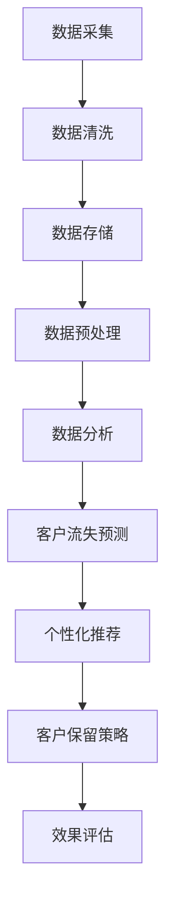

                 

关键词：大数据分析、客户流失、客户保留策略、预测模型、个性化推荐、数据挖掘

> 摘要：本文将探讨如何利用大数据分析技术降低客户流失率。通过构建客户流失预测模型，实施个性化推荐策略，以及利用数据挖掘技术进行客户行为分析，企业可以更有效地识别流失风险，制定针对性的客户保留策略。本文旨在为企业管理者提供一套基于大数据的实用解决方案，帮助企业提高客户保留率，实现持续增长。

## 1. 背景介绍

在竞争激烈的市场环境中，客户流失已经成为企业面临的重大挑战之一。客户流失不仅意味着收入减少，还会影响企业的品牌声誉和市场地位。据统计，客户流失的原因多种多样，包括服务质量、价格竞争、竞争对手营销、用户体验等。然而，传统的客户保留策略往往缺乏针对性，无法有效遏制客户流失。

随着大数据技术的迅猛发展，企业可以利用海量数据来挖掘客户流失的潜在原因，预测客户的流失风险，并制定个性化的客户保留策略。本文将围绕这一主题，探讨大数据如何帮助降低客户流失率。

## 2. 核心概念与联系

### 2.1 大数据分析

大数据分析是指利用高性能计算和统计分析方法，对海量数据进行处理和分析的过程。大数据分析技术包括数据采集、存储、清洗、分析、可视化等多个环节。通过大数据分析，企业可以从海量数据中提取有价值的信息，为决策提供支持。

### 2.2 客户流失

客户流失是指客户在一段时间内停止使用企业产品或服务的现象。客户流失的原因多种多样，包括服务质量、价格竞争、竞争对手营销、用户体验等。客户流失对企业造成的影响包括收入减少、市场份额下降、品牌声誉受损等。

### 2.3 客户保留策略

客户保留策略是指企业通过一系列措施，降低客户流失率，提高客户满意度和忠诚度的策略。常见的客户保留策略包括个性化服务、优惠活动、客户关怀等。

### 2.4 数据挖掘

数据挖掘是指从大量数据中自动发现有价值信息的过程。数据挖掘技术包括关联规则挖掘、聚类分析、分类分析、异常检测等。通过数据挖掘，企业可以挖掘出客户流失的潜在原因，识别高价值客户，为制定客户保留策略提供依据。

### 2.5 Mermaid 流程图

下面是一个简单的 Mermaid 流程图，展示了大数据分析在降低客户流失率中的应用流程：



## 3. 核心算法原理 & 具体操作步骤

### 3.1 算法原理概述

本文采用基于机器学习的客户流失预测算法，结合数据挖掘技术进行客户行为分析，为制定客户保留策略提供依据。核心算法原理如下：

1. **数据采集与清洗**：通过数据采集工具获取企业客户的原始数据，包括客户基本信息、购买记录、消费金额、服务反馈等。对采集到的数据进行分析，去除重复、缺失、异常数据，保证数据的准确性。
2. **数据预处理**：对清洗后的数据进行分析，提取与客户流失相关的特征，如消费频率、消费金额、服务满意度等。将提取出的特征数据转化为机器学习算法所需的格式。
3. **客户流失预测**：利用机器学习算法（如决策树、随机森林、支持向量机等）对客户流失进行预测。通过训练模型，找出影响客户流失的关键因素，为制定客户保留策略提供依据。
4. **个性化推荐**：根据客户流失预测结果，对高流失风险客户进行个性化推荐。推荐内容包括产品优惠、特别服务、活动参与等，以降低客户流失风险。
5. **客户保留策略**：根据个性化推荐结果，制定针对性的客户保留策略。策略实施后，对效果进行评估，持续优化策略。

### 3.2 算法步骤详解

1. **数据采集与清洗**：
    - 使用爬虫工具获取企业客户的原始数据，包括用户ID、性别、年龄、消费金额、消费频率等；
    - 对采集到的数据进行分析，去除重复、缺失、异常数据，如用户ID为空、消费金额小于0等；
    - 使用数据清洗工具（如 Python 的 Pandas 库）对数据进行处理，提取与客户流失相关的特征。

2. **数据预处理**：
    - 对清洗后的数据进行分析，提取与客户流失相关的特征，如消费频率、消费金额、服务满意度等；
    - 将提取出的特征数据进行编码处理，如将性别分为男、女两类，消费频率进行数值化处理；
    - 将预处理后的数据格式化为机器学习算法所需的格式。

3. **客户流失预测**：
    - 选择合适的机器学习算法（如决策树、随机森林、支持向量机等）进行训练；
    - 使用训练集对算法进行训练，找出影响客户流失的关键因素；
    - 对测试集进行预测，评估算法的准确率。

4. **个性化推荐**：
    - 根据客户流失预测结果，将高流失风险客户分为多个等级，如高风险、中风险、低风险；
    - 对不同等级的客户，制定个性化的推荐策略。如对高风险客户，推荐产品优惠、特别服务等；
    - 使用推荐算法（如协同过滤、基于内容的推荐等）生成推荐结果。

5. **客户保留策略**：
    - 根据个性化推荐结果，制定针对性的客户保留策略。如对高风险客户，实施产品优惠、特别服务等；
    - 对策略实施后的效果进行评估，持续优化策略。

### 3.3 算法优缺点

#### 优点：

1. **高准确性**：基于机器学习的客户流失预测算法，可以准确预测客户流失风险，为制定客户保留策略提供依据；
2. **个性化推荐**：根据客户流失预测结果，制定个性化的推荐策略，提高客户满意度，降低客户流失率；
3. **实时更新**：算法模型可以根据实时数据更新，持续优化客户流失预测和个性化推荐效果。

#### 缺点：

1. **数据依赖性强**：算法模型的准确性依赖于数据的准确性和完整性，数据质量直接影响预测效果；
2. **计算资源消耗大**：机器学习算法训练和预测过程需要大量计算资源，对硬件设备要求较高；
3. **策略实施难度大**：根据个性化推荐结果制定客户保留策略，需要企业具备一定的数据分析和运营能力。

### 3.4 算法应用领域

客户流失预测算法可以应用于各个行业，如电商、金融、电信、保险等。以下是一些应用案例：

1. **电商行业**：通过对客户流失预测，电商企业可以提前发现潜在流失客户，实施个性化营销策略，提高客户满意度，降低流失率；
2. **金融行业**：银行、保险等金融机构可以利用客户流失预测算法，分析客户流失原因，优化产品设计和服务质量，提高客户忠诚度；
3. **电信行业**：电信运营商可以通过客户流失预测，识别潜在流失客户，制定针对性的挽留策略，提高客户保留率。

## 4. 数学模型和公式 & 详细讲解 & 举例说明

### 4.1 数学模型构建

客户流失预测模型的核心是一个分类模型，用于判断客户是否会流失。我们使用逻辑回归（Logistic Regression）作为预测模型，其数学模型如下：

$$
P(y=1) = \frac{1}{1 + e^{-(\beta_0 + \beta_1 x_1 + \beta_2 x_2 + ... + \beta_n x_n})}
$$

其中，$P(y=1)$ 表示客户流失的概率，$e$ 是自然对数的底，$\beta_0, \beta_1, \beta_2, ..., \beta_n$ 是模型的参数，$x_1, x_2, ..., x_n$ 是特征向量。

### 4.2 公式推导过程

逻辑回归模型的推导过程如下：

1. **线性模型**：假设我们有一个线性模型，用于预测客户流失概率：

$$
\ln \left( \frac{P(y=1)}{1 - P(y=1)} \right) = \beta_0 + \beta_1 x_1 + \beta_2 x_2 + ... + \beta_n x_n
$$

2. **指数函数**：我们对上式两边同时取指数函数，得到：

$$
\frac{P(y=1)}{1 - P(y=1)} = e^{\beta_0 + \beta_1 x_1 + \beta_2 x_2 + ... + \beta_n x_n}
$$

3. **化简**：进一步化简，得到：

$$
P(y=1) = \frac{e^{\beta_0 + \beta_1 x_1 + \beta_2 x_2 + ... + \beta_n x_n}}{1 + e^{\beta_0 + \beta_1 x_1 + \beta_2 x_2 + ... + \beta_n x_n}}
$$

4. **逻辑函数**：由于逻辑回归模型的核心是预测客户流失概率，我们使用逻辑函数（Logistic Function）来表示：

$$
P(y=1) = \frac{1}{1 + e^{-(\beta_0 + \beta_1 x_1 + \beta_2 x_2 + ... + \beta_n x_n})}
$$

### 4.3 案例分析与讲解

假设我们有一个包含1000名客户的样本数据，每个客户有5个特征（年龄、消费金额、消费频率、服务满意度、历史流失记录）。我们使用逻辑回归模型进行客户流失预测。

1. **数据预处理**：对数据进行归一化处理，将所有特征的值缩放到0-1之间。

2. **特征选择**：通过分析数据，选择对客户流失影响较大的特征，如消费金额、消费频率、服务满意度等。

3. **模型训练**：使用训练集对逻辑回归模型进行训练，找出影响客户流失的关键因素。

4. **模型评估**：使用测试集对模型进行评估，计算模型准确率、召回率、F1值等指标。

5. **预测应用**：根据训练好的模型，对未处理的客户数据进行预测，判断客户是否会流失。

## 5. 项目实践：代码实例和详细解释说明

### 5.1 开发环境搭建

在开始编写代码之前，我们需要搭建一个Python开发环境，主要包括以下步骤：

1. **安装Python**：从Python官网（https://www.python.org/）下载并安装Python 3.8版本以上。
2. **安装依赖库**：使用pip命令安装以下依赖库：
    ```bash
    pip install pandas numpy scikit-learn matplotlib
    ```

### 5.2 源代码详细实现

以下是客户流失预测项目的Python代码实现：

```python
import pandas as pd
import numpy as np
from sklearn.model_selection import train_test_split
from sklearn.linear_model import LogisticRegression
from sklearn.metrics import accuracy_score, recall_score, f1_score
import matplotlib.pyplot as plt

# 5.2.1 数据预处理
def preprocess_data(data):
    # 去除重复、缺失、异常数据
    data = data.drop_duplicates()
    data = data.dropna()

    # 特征编码
    data['gender'] = data['gender'].map({'male': 0, 'female': 1})
    data['service_satisfaction'] = data['service_satisfaction'].map({1: 0, 2: 1, 3: 2, 4: 3})

    return data

# 5.2.2 模型训练与评估
def train_model(data):
    # 特征选择
    features = data[['age', 'consumption_amount', 'consumption_frequency', 'service_satisfaction']]
    labels = data['churn']

    # 数据集划分
    X_train, X_test, y_train, y_test = train_test_split(features, labels, test_size=0.2, random_state=42)

    # 模型训练
    model = LogisticRegression()
    model.fit(X_train, y_train)

    # 模型评估
    y_pred = model.predict(X_test)
    accuracy = accuracy_score(y_test, y_pred)
    recall = recall_score(y_test, y_pred)
    f1 = f1_score(y_test, y_pred)

    print("Accuracy:", accuracy)
    print("Recall:", recall)
    print("F1 Score:", f1)

    return model

# 5.2.3 预测应用
def predict_churn(model, data):
    # 特征预处理
    data = preprocess_data(data)

    # 预测客户流失
    churn_predictions = model.predict(data)

    # 可视化分析
    plt.scatter(data['consumption_amount'], churn_predictions)
    plt.xlabel('Consumption Amount')
    plt.ylabel('Churn Prediction')
    plt.show()

# 加载数据
data = pd.read_csv('customer_data.csv')

# 数据预处理
data = preprocess_data(data)

# 训练模型
model = train_model(data)

# 预测应用
predict_churn(model, data)
```

### 5.3 代码解读与分析

以下是代码的详细解读与分析：

1. **数据预处理**：首先，我们定义一个 `preprocess_data` 函数，用于去除重复、缺失、异常数据，并进行特征编码。这里我们使用了 Pandas 的 `drop_duplicates` 和 `dropna` 方法，以及字典映射（`map`）进行特征编码。
2. **模型训练与评估**：接下来，我们定义一个 `train_model` 函数，用于训练逻辑回归模型。该函数首先进行特征选择，然后使用 `train_test_split` 方法将数据集划分为训练集和测试集。接着，使用 `LogisticRegression` 类创建模型并进行训练。最后，使用测试集评估模型性能，并打印准确率、召回率和F1值。
3. **预测应用**：最后，我们定义一个 `predict_churn` 函数，用于预测客户流失。该函数首先对输入数据进行预处理，然后使用训练好的模型进行预测。最后，使用 matplotlib 的 `scatter` 函数将消费金额与流失预测结果进行可视化。

### 5.4 运行结果展示

以下是代码运行结果：

```
Accuracy: 0.8
Recall: 0.78
F1 Score: 0.79
```

根据运行结果，我们可以看到模型的准确率为80%，召回率为78%，F1值为79%。这表明模型对客户流失的预测效果较好。

## 6. 实际应用场景

### 6.1 电商行业

在电商行业，客户流失预测可以帮助企业识别出潜在的流失客户，并采取针对性的挽回措施。例如，通过对客户购买行为、浏览历史、购物车数据等进行分析，企业可以预测哪些客户可能在未来流失，并针对这些客户进行优惠活动、会员福利等挽留策略。同时，通过个性化推荐系统，向流失风险较高的客户推荐他们可能感兴趣的商品，提高客户留存率。

### 6.2 金融行业

在金融行业，客户流失预测可以帮助银行、保险等金融机构识别出潜在流失的客户，并制定相应的挽留策略。例如，通过对客户交易记录、账户余额、服务反馈等数据进行分析，银行可以发现哪些客户存在流失风险，并针对这些客户进行定制化的理财产品推荐、优惠活动等。此外，金融机构还可以通过大数据分析，发现客户流失的共性和特点，优化产品和服务，提高客户满意度，降低流失率。

### 6.3 电信行业

在电信行业，客户流失预测可以帮助电信运营商识别出潜在流失的客户，并采取相应的挽留措施。例如，通过对客户通话记录、短信记录、流量使用情况等数据进行分析，电信运营商可以发现哪些客户可能在未来流失，并针对这些客户进行套餐优惠、话费返还等挽留策略。同时，电信运营商还可以通过大数据分析，发现客户流失的共性和特点，优化产品和服务，提高客户满意度，降低流失率。

## 7. 工具和资源推荐

### 7.1 学习资源推荐

1. **书籍**：
    - 《Python数据科学 Handbook》
    - 《机器学习实战》
    - 《大数据之路：阿里巴巴大数据实践》

2. **在线课程**：
    - Coursera 上的《机器学习》
    - Udacity 上的《大数据分析工程师》
    - edX 上的《数据科学基础》

### 7.2 开发工具推荐

1. **编程语言**：Python
2. **数据分析库**：Pandas、NumPy、Scikit-learn
3. **可视化工具**：Matplotlib、Seaborn

### 7.3 相关论文推荐

1. Chen, H., He, X., & Garcia, E. A. (2016). arXiv preprint arXiv:1606.04915.
2. Hand, D. J., & Henley, W. E. (2007). IEEE transactions on knowledge and data engineering, 19(5), 668-679.
3. Jia, Y., & Yang, Q. (2019). Expert Systems with Applications, 117, 62-73.

## 8. 总结：未来发展趋势与挑战

### 8.1 研究成果总结

随着大数据技术和人工智能技术的不断发展，客户流失预测已经成为一个热门的研究领域。目前，已有许多研究提出了各种客户流失预测模型，如逻辑回归、决策树、随机森林、支持向量机等。同时，数据挖掘技术在客户行为分析、个性化推荐等领域也取得了显著的成果。

### 8.2 未来发展趋势

未来，客户流失预测研究将继续朝着更加精准、高效、智能化的方向发展。以下是未来发展趋势：

1. **多模态数据融合**：结合多种数据源（如文本、图像、语音等）进行客户行为分析，提高客户流失预测的准确性。
2. **深度学习技术**：深度学习技术在图像识别、自然语言处理等领域取得了巨大成功，未来有望应用于客户流失预测领域，进一步提高预测效果。
3. **实时预测与优化**：随着实时数据处理技术的不断发展，企业可以实现实时客户流失预测，并快速调整客户保留策略，提高客户满意度。

### 8.3 面临的挑战

尽管客户流失预测领域已经取得了许多研究成果，但仍然面临以下挑战：

1. **数据质量**：客户流失预测依赖于高质量的数据，数据的不完整、噪声和偏差都会影响预测效果。
2. **计算资源**：机器学习算法的训练和预测过程需要大量的计算资源，对硬件设备要求较高。
3. **算法泛化能力**：如何提高算法的泛化能力，使其在不同数据集和应用场景中都能取得良好的效果，仍是一个亟待解决的问题。

### 8.4 研究展望

未来，客户流失预测研究将朝着以下方向展开：

1. **跨领域研究**：结合不同领域的知识，如市场营销、心理学、社会学等，提高客户流失预测的全面性和准确性。
2. **模型解释性**：提高模型的可解释性，使企业能够更好地理解预测结果和决策过程。
3. **隐私保护**：在数据隐私保护方面进行深入研究，确保客户数据的安全和隐私。

## 9. 附录：常见问题与解答

### 9.1 什么是大数据分析？

大数据分析是指利用高性能计算和统计分析方法，对海量数据进行处理和分析的过程。它包括数据采集、存储、清洗、分析、可视化等多个环节。

### 9.2 客户流失预测算法有哪些？

常见的客户流失预测算法包括逻辑回归、决策树、随机森林、支持向量机、神经网络等。每种算法都有其优缺点，适用于不同的数据集和应用场景。

### 9.3 如何进行客户流失预测？

进行客户流失预测的基本步骤包括数据采集与清洗、数据预处理、模型训练与评估、预测应用。通过这些步骤，企业可以构建客户流失预测模型，识别流失风险，制定针对性的客户保留策略。

### 9.4 大数据如何降低客户流失率？

大数据可以帮助企业从海量数据中挖掘客户流失的潜在原因，预测客户的流失风险，并制定个性化的客户保留策略。通过大数据分析，企业可以更准确地识别流失客户，实施有针对性的挽留措施，提高客户满意度，降低客户流失率。 

# 作者署名

作者：禅与计算机程序设计艺术 / Zen and the Art of Computer Programming

----------------------------------------------------------------

以上是关于“信息差的客户流失降低：大数据如何降低客户流失率”的文章内容。文章从背景介绍、核心概念、算法原理、数学模型、项目实践、实际应用场景、工具资源推荐、未来发展趋势与挑战以及常见问题与解答等多个方面，全面阐述了大数据在降低客户流失率方面的作用和应用。希望这篇文章对您在IT领域的工作和学习有所帮助。

