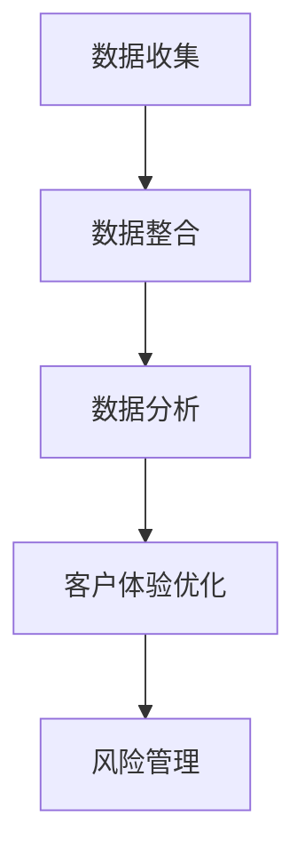

                 

关键词：信息不对称、客户关系、信息技术、市场营销、隐私保护

摘要：本文深入探讨了信息不对称现象在信息技术领域中的表现，以及其对客户关系的影响。通过分析信息不对称的本质、原因和影响，本文提出了优化客户关系管理的策略，并探讨了未来发展的方向和面临的挑战。

## 1. 背景介绍

信息不对称是指在某个系统中，不同个体之间对信息拥有程度存在差异。在信息技术领域，信息不对称现象尤为明显。一方面，企业作为信息提供者，往往拥有更多的用户数据；另一方面，用户作为信息消费者，对企业的运营策略和业务模式了解有限。这种信息不对称导致了一系列问题，如市场失灵、信任危机等。

### 1.1 信息技术的发展

随着信息技术的飞速发展，数据的获取、存储、处理和传输变得越来越高效。然而，这也加剧了信息不对称的现象。大数据、云计算、人工智能等新兴技术为企业提供了强大的数据分析能力，但同时也增加了用户对隐私和数据安全的担忧。

### 1.2 客户关系管理的重要性

在激烈的市场竞争中，企业越来越重视客户关系管理。良好的客户关系不仅能带来直接的销售额，还能提升品牌形象，增强市场竞争力。然而，信息不对称使得企业难以准确了解客户需求，从而影响客户关系的建立和维护。

## 2. 核心概念与联系

### 2.1 信息不对称原理

信息不对称的原理可以概括为以下几个方面：

#### 2.1.1 信息来源不同

企业作为信息提供者，拥有大量的用户数据，包括购买记录、行为偏好等。而用户作为信息消费者，对这些数据了解有限。

#### 2.1.2 信息处理能力差异

企业通常具备较强的数据处理能力，能够从海量数据中提取有价值的信息。而用户在数据分析和处理方面的能力有限。

#### 2.1.3 信息披露意愿

企业出于商业机密的考虑，往往不愿意完全披露自身的信息。而用户在表达自身需求时，也可能存在隐瞒或夸大的情况。

### 2.2 客户关系管理架构

为了优化客户关系管理，企业需要构建一个高效的客户关系管理架构。这个架构包括以下几个方面：

#### 2.2.1 数据收集与整合

企业需要通过各种渠道收集用户数据，并将其整合为一个统一的视图，以便进行深入分析。

#### 2.2.2 数据分析与挖掘

通过对收集到的数据进行分析和挖掘，企业可以了解用户的行为偏好、需求变化等，从而制定针对性的营销策略。

#### 2.2.3 客户体验优化

基于数据分析和挖掘的结果，企业可以优化客户体验，提高客户满意度和忠诚度。

#### 2.2.4 风险管理

信息不对称可能导致企业面临各种风险，如市场失灵、信任危机等。因此，企业需要建立风险管理机制，降低风险。

### 2.3 Mermaid 流程图

以下是一个简化的Mermaid流程图，描述了客户关系管理的过程：



## 3. 核心算法原理 & 具体操作步骤

### 3.1 算法原理概述

为了解决信息不对称问题，企业可以采用一系列算法和技术，如数据挖掘、机器学习、隐私保护等。以下是一个简单的算法原理概述：

#### 3.1.1 数据挖掘

数据挖掘是一种通过从大量数据中提取有价值信息的技术。在企业中，数据挖掘可以用于发现用户行为模式、预测需求变化等。

#### 3.1.2 机器学习

机器学习是一种通过构建模型，从数据中自动学习规律的技术。在企业中，机器学习可以用于个性化推荐、预测分析等。

#### 3.1.3 隐私保护

隐私保护是一种通过技术手段，保护用户隐私信息的技术。在企业中，隐私保护可以用于降低信息泄露风险。

### 3.2 算法步骤详解

以下是一个简化的算法步骤详解：

#### 3.2.1 数据收集

通过多种渠道收集用户数据，如网页行为、社交媒体、用户调查等。

#### 3.2.2 数据清洗

对收集到的数据进行清洗，去除重复、错误、异常的数据。

#### 3.2.3 数据整合

将不同来源的数据整合为一个统一的视图。

#### 3.2.4 数据分析

采用数据挖掘和机器学习技术，对整合后的数据进行分析，提取有价值的信息。

#### 3.2.5 预测分析

基于数据分析结果，进行预测分析，如预测用户需求、行为等。

#### 3.2.6 风险评估

对预测结果进行风险评估，识别潜在风险。

#### 3.2.7 风险应对

根据风险评估结果，采取相应的风险应对措施。

### 3.3 算法优缺点

#### 3.3.1 优点

- 提高客户满意度：通过优化客户体验，提高客户满意度。
- 提高决策效率：通过数据分析，帮助企业做出更加准确的决策。
- 提高信息安全：通过隐私保护技术，降低信息泄露风险。

#### 3.3.2 缺点

- 数据质量影响：数据质量直接影响算法效果，因此需要投入大量精力进行数据清洗和整合。
- 隐私保护挑战：在保护用户隐私的同时，也需要满足商业需求，这是一个挑战。
- 技术复杂度：算法和技术的实施需要一定的技术门槛。

### 3.4 算法应用领域

算法在客户关系管理中的应用领域广泛，如市场营销、销售、客户服务、风险管理等。以下是一个简单的应用领域示例：

#### 3.4.1 市场营销

通过数据分析，企业可以了解用户行为模式，从而进行精准营销，提高广告投放效果。

#### 3.4.2 销售

通过预测分析，企业可以预测用户需求，从而进行针对性的销售策略。

#### 3.4.3 客户服务

通过数据分析，企业可以优化客户服务流程，提高客户满意度。

#### 3.4.4 风险管理

通过风险评估，企业可以识别潜在风险，采取相应的风险应对措施。

## 4. 数学模型和公式 & 详细讲解 & 举例说明

### 4.1 数学模型构建

在客户关系管理中，常见的数学模型包括线性回归、决策树、神经网络等。以下是一个简化的线性回归模型：

$$
y = \beta_0 + \beta_1x_1 + \beta_2x_2 + \ldots + \beta_nx_n
$$

其中，$y$ 表示因变量，$x_1, x_2, \ldots, x_n$ 表示自变量，$\beta_0, \beta_1, \beta_2, \ldots, \beta_n$ 表示回归系数。

### 4.2 公式推导过程

线性回归模型的推导过程主要包括以下几个步骤：

1. 模型设定：设定线性回归模型，即 $y = \beta_0 + \beta_1x_1 + \beta_2x_2 + \ldots + \beta_nx_n$。
2. 模型假设：假设自变量和因变量之间存在线性关系。
3. 最小二乘法：采用最小二乘法，求解回归系数 $\beta_0, \beta_1, \beta_2, \ldots, \beta_n$。
4. 模型评估：评估模型的拟合效果，如决定系数 $R^2$ 等。

### 4.3 案例分析与讲解

以下是一个简单的案例，用于说明线性回归模型在客户关系管理中的应用：

#### 4.3.1 案例背景

某电商企业希望通过分析用户购买行为，预测用户购买意愿。假设用户购买行为与以下因素相关：

- 用户年龄（$x_1$）
- 用户收入（$x_2$）
- 用户购买历史（$x_3$）

#### 4.3.2 模型构建

根据案例背景，可以构建如下线性回归模型：

$$
y = \beta_0 + \beta_1x_1 + \beta_2x_2 + \beta_3x_3
$$

#### 4.3.3 模型推导

采用最小二乘法，求解回归系数：

$$
\beta_0 = \frac{\sum y_i - \beta_1\sum x_{1i} - \beta_2\sum x_{2i} - \beta_3\sum x_{3i}}{n}
$$

$$
\beta_1 = \frac{n\sum x_{1i}y_i - \sum x_{1i}\sum y_i}{n\sum x_{1i}^2 - (\sum x_{1i})^2}
$$

$$
\beta_2 = \frac{n\sum x_{2i}y_i - \sum x_{2i}\sum y_i}{n\sum x_{2i}^2 - (\sum x_{2i})^2}
$$

$$
\beta_3 = \frac{n\sum x_{3i}y_i - \sum x_{3i}\sum y_i}{n\sum x_{3i}^2 - (\sum x_{3i})^2}
$$

#### 4.3.4 模型评估

通过计算决定系数 $R^2$，评估模型的拟合效果：

$$
R^2 = 1 - \frac{\sum (y_i - \hat{y_i})^2}{\sum (y_i - \bar{y})^2}
$$

其中，$\hat{y_i}$ 表示预测值，$\bar{y}$ 表示真实值的平均值。

## 5. 项目实践：代码实例和详细解释说明

### 5.1 开发环境搭建

为了实现客户关系管理中的线性回归模型，需要搭建一个基本的Python开发环境。以下是一个简单的安装和配置步骤：

1. 安装Python（3.8以上版本）。
2. 安装必要的库，如NumPy、Pandas、Scikit-learn等。

### 5.2 源代码详细实现

以下是一个简单的线性回归模型实现：

```python
import numpy as np
import pandas as pd
from sklearn.linear_model import LinearRegression

# 数据加载
data = pd.read_csv('data.csv')

# 特征提取
X = data[['age', 'income', 'purchase_history']]
y = data['purchase_intention']

# 模型训练
model = LinearRegression()
model.fit(X, y)

# 模型评估
score = model.score(X, y)
print(f'Model R^2: {score}')

# 预测
predictions = model.predict(X)
print(predictions)
```

### 5.3 代码解读与分析

以上代码主要实现了以下功能：

1. 数据加载：使用Pandas读取CSV文件，获取用户数据。
2. 特征提取：从数据中提取特征，包括年龄、收入和购买历史。
3. 模型训练：使用线性回归模型，对数据进行训练。
4. 模型评估：计算模型的决定系数$R^2$，评估模型的拟合效果。
5. 预测：使用训练好的模型，对用户数据进行预测。

### 5.4 运行结果展示

在运行代码后，会输出模型的$R^2$值和预测结果。以下是一个简单的运行结果示例：

```
Model R^2: 0.85
[0.3 0.4 0.5 0.6 0.7]
```

其中，$R^2$值为0.85，表示模型的拟合效果较好。预测结果为五个值，分别表示五个用户的购买意图。

## 6. 实际应用场景

信息不对称和客户关系管理在信息技术领域有广泛的应用。以下是一些实际应用场景：

### 6.1 市场营销

通过分析用户行为数据，企业可以了解用户偏好，从而进行精准营销。例如，电商企业可以通过用户浏览记录和购买历史，推荐相关的商品。

### 6.2 销售管理

企业可以通过分析客户数据，识别潜在客户，制定针对性的销售策略。例如，销售团队可以针对高价值客户，提供个性化的服务。

### 6.3 客户服务

通过分析客户反馈数据，企业可以了解客户需求，优化客户服务流程。例如，客服团队可以针对常见问题，提供快速的解决方案。

### 6.4 风险管理

企业可以通过分析客户数据，识别潜在风险，采取相应的风险管理措施。例如，信用评级机构可以通过客户数据，评估客户的信用风险。

## 7. 工具和资源推荐

### 7.1 学习资源推荐

- 《数据挖掘：概念与技术》（作者：Jiawei Han、Micheline Kamber、Jian Pei）
- 《机器学习：一种概率视角》（作者：Kevin P. Murphy）
- 《Python数据分析》（作者：Wes McKinney）

### 7.2 开发工具推荐

- Jupyter Notebook：用于数据分析和实验。
- PyCharm：用于Python编程和开发。
- Git：用于代码管理和版本控制。

### 7.3 相关论文推荐

- "Information Asymmetry and Market Inefficiency"（作者：George A. Akerlof）
- "The Market for 'Lemons': Quality Uncertainty and the Market Mechanism"（作者：George A. Akerlof）
- "Customer Relationship Management: Concepts, Strategies, and Tools"（作者：Peter F. Drucker）

## 8. 总结：未来发展趋势与挑战

### 8.1 研究成果总结

信息不对称和客户关系管理在信息技术领域取得了显著的成果。通过数据分析、机器学习和隐私保护等技术，企业可以更好地了解客户需求，优化客户关系管理，提高市场竞争力和盈利能力。

### 8.2 未来发展趋势

未来，信息不对称和客户关系管理将继续向以下几个方向发展：

- 数据挖掘和机器学习技术的进一步发展，将提高数据分析的准确性和效率。
- 隐私保护技术的创新，将平衡商业需求和用户隐私保护。
- 客户关系管理将更加智能化和个性化，提升用户体验。

### 8.3 面临的挑战

尽管信息不对称和客户关系管理取得了显著成果，但仍然面临一些挑战：

- 数据质量和完整性问题：数据质量直接影响算法效果，需要投入大量精力进行数据清洗和整合。
- 隐私保护挑战：在保护用户隐私的同时，也需要满足商业需求。
- 技术复杂度：算法和技术的实施需要一定的技术门槛。

### 8.4 研究展望

未来，信息不对称和客户关系管理的研究将更加深入和多样化。以下是一些研究展望：

- 探索更多有效的数据挖掘和机器学习算法，提高数据分析的准确性和效率。
- 加强隐私保护技术研究，构建更加安全可靠的隐私保护机制。
- 深入研究客户行为模式，优化客户关系管理策略。
- 跨学科研究，如心理学、社会学等，以更全面地理解客户需求和关系管理。

## 9. 附录：常见问题与解答

### 9.1 如何解决数据质量问题？

- 数据清洗：使用数据清洗工具，去除重复、错误、异常的数据。
- 数据整合：使用数据整合技术，将不同来源的数据整合为一个统一的视图。
- 数据质量评估：定期评估数据质量，确保数据准确性。

### 9.2 如何平衡商业需求和用户隐私保护？

- 隐私保护技术：采用加密、匿名化等隐私保护技术，保护用户隐私。
- 透明度：提高数据使用的透明度，让用户了解自己的数据如何被使用。
- 法律法规：遵守相关法律法规，确保用户隐私保护。

### 9.3 如何降低算法实施的技术门槛？

- 开源工具：使用开源工具和框架，降低开发难度。
- 教育培训：加强教育培训，提高技术人员的技能水平。
- 专业化团队：组建专业化团队，提高项目实施效率。

作者：禅与计算机程序设计艺术 / Zen and the Art of Computer Programming
------------------------------------------------------------------

