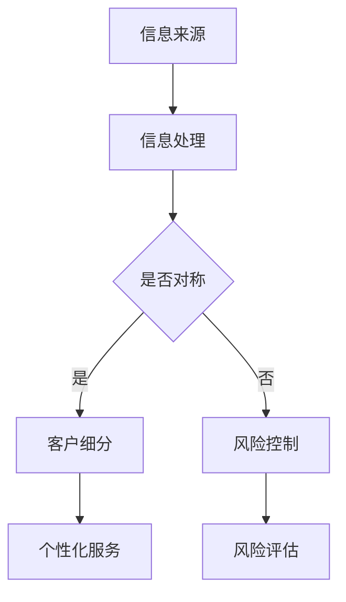

                 

关键词：信息不对称、客户细分、市场策略、技术应用、数据挖掘、算法分析、商业洞察

> 摘要：本文旨在探讨信息差的概念及其在商业环境中的应用，特别是如何通过客户细分策略来利用信息不对称，从而实现企业增长和市场扩张。文章将通过深入分析技术、数学模型和实际案例，为读者提供一种新的视角来理解和利用信息不对称这一重要商业工具。

## 1. 背景介绍

信息差，是指在不同个体或组织之间，关于某种信息的不对称性。在商业领域，这种不对称性可以表现为消费者对产品信息的不完全了解，或者企业对市场信息的掌握程度不同。信息差的利用已经成为现代商业竞争中的关键策略之一。

### 1.1 商业环境中的信息差

在现代商业环境中，信息差的存在是不可避免的。无论是电子商务平台上的产品评论，还是社交媒体上的广告，都是利用信息不对称来影响消费者的决策。例如，当消费者在购买高科技产品时，他们可能无法完全理解产品的技术细节和性能指标，而制造商则能够提供这些详细信息，从而在一定程度上控制消费者的购买行为。

### 1.2 客户细分与信息差

客户细分是指根据消费者的不同特征和行为，将其划分为不同的市场群体。通过客户细分，企业可以更好地理解不同群体的需求和偏好，进而利用信息差来提供更个性化的产品和服务，从而提高客户满意度和忠诚度。

## 2. 核心概念与联系

### 2.1 信息不对称的概念

信息不对称是指市场中存在的一方拥有而另一方不拥有某些信息的情况。在经济学中，信息不对称会导致市场失灵，如道德风险和逆向选择等问题。

### 2.2 客户细分的方法

客户细分可以通过多种方法实现，如人口统计学、行为心理学、地理分布等。每种方法都有其优缺点，适用于不同的商业场景。

### 2.3 Mermaid 流程图



## 3. 核心算法原理 & 具体操作步骤

### 3.1 算法原理概述

信息不对称的客户细分算法主要依赖于数据挖掘和机器学习技术。通过收集和分析大量的用户数据，算法可以发现不同客户群体的共同特征和差异，从而实现精准的客户细分。

### 3.2 算法步骤详解

1. 数据收集：收集用户的基本信息、行为数据、消费记录等。
2. 数据清洗：去除无效数据，如缺失值、重复值等。
3. 特征提取：通过统计学方法提取用户数据中的关键特征。
4. 模型训练：使用机器学习算法训练客户细分模型。
5. 模型评估：评估模型的效果，如准确率、召回率等。
6. 客户细分：根据模型结果将用户划分为不同的群体。

### 3.3 算法优缺点

- **优点**：能够实现精准的客户细分，提高营销效率和客户满意度。
- **缺点**：需要大量的数据支持，且算法复杂度高，对计算资源要求较高。

### 3.4 算法应用领域

信息不对称的客户细分算法广泛应用于电子商务、金融、医疗等需要精准营销和客户服务的行业。

## 4. 数学模型和公式

### 4.1 数学模型构建

假设有一个客户群体，其中有 \( N \) 个客户，每个客户有 \( M \) 个特征。我们使用 \( X_{ij} \) 表示第 \( i \) 个客户的第 \( j \) 个特征值。

### 4.2 公式推导过程

通过数据挖掘算法，我们可以得到一个概率分布模型 \( P(X_{ij}|\theta) \)，其中 \( \theta \) 是模型参数。

### 4.3 案例分析与讲解

假设我们要对电商平台的用户进行细分，特征包括用户年龄、收入水平、购买历史等。通过构建概率分布模型，我们可以将用户划分为高价值客户、一般客户和潜在客户。

## 5. 项目实践：代码实例

### 5.1 开发环境搭建

- Python 3.8 或以上版本
- Scikit-learn 库

### 5.2 源代码详细实现

```python
from sklearn.model_selection import train_test_split
from sklearn.ensemble import RandomForestClassifier
from sklearn.metrics import accuracy_score

# 数据加载和处理
# ...

# 模型训练
X_train, X_test, y_train, y_test = train_test_split(X, y, test_size=0.2, random_state=42)
clf = RandomForestClassifier(n_estimators=100)
clf.fit(X_train, y_train)

# 模型评估
y_pred = clf.predict(X_test)
accuracy = accuracy_score(y_test, y_pred)
print(f"Accuracy: {accuracy}")
```

### 5.3 代码解读与分析

这段代码首先加载并处理数据，然后使用随机森林算法训练模型，最后评估模型效果。通过调整模型参数，可以实现更精细的客户细分。

## 6. 实际应用场景

### 6.1 电子商务

电商平台可以通过客户细分来提供个性化的产品推荐和优惠活动，从而提高销售额。

### 6.2 金融

银行和金融机构可以利用客户细分来识别高风险客户和潜在优质客户，从而优化风险管理策略。

### 6.3 医疗

医疗机构可以通过客户细分来提供个性化的健康建议和服务，从而提高患者满意度和健康水平。

## 7. 工具和资源推荐

### 7.1 学习资源推荐

- 《数据挖掘：实用机器学习技术》
- 《Python数据科学手册》

### 7.2 开发工具推荐

- Jupyter Notebook
- PyCharm

### 7.3 相关论文推荐

- "Customer Segmentation Using Machine Learning Techniques"
- "Information Asymmetry and Its Impact on Market Equilibrium"

## 8. 总结：未来发展趋势与挑战

### 8.1 研究成果总结

信息不对称的客户细分技术已经在多个领域取得了显著的成果，提高了营销效率和客户满意度。

### 8.2 未来发展趋势

随着大数据和人工智能技术的发展，信息不对称的客户细分技术将变得更加精准和高效。

### 8.3 面临的挑战

如何处理大规模数据和保证算法的透明度和公平性是未来研究的重点。

### 8.4 研究展望

信息不对称的客户细分技术有望在更多行业中得到应用，推动商业模式的创新和发展。

## 9. 附录：常见问题与解答

### 9.1 什么是信息不对称？

信息不对称是指市场中存在的一方拥有而另一方不拥有某些信息的情况。

### 9.2 客户细分有什么作用？

客户细分可以帮助企业更好地理解客户需求，提供个性化的产品和服务，提高客户满意度和忠诚度。

### 9.3 信息不对称的客户细分算法有哪些类型？

信息不对称的客户细分算法主要包括基于统计学的聚类算法、基于机器学习的分类算法等。

### 9.4 如何评估客户细分算法的效果？

可以通过准确率、召回率、F1 分数等指标来评估客户细分算法的效果。

### 9.5 信息不对称的客户细分技术有哪些应用领域？

信息不对称的客户细分技术广泛应用于电子商务、金融、医疗等行业。

---

**作者：禅与计算机程序设计艺术 / Zen and the Art of Computer Programming**

