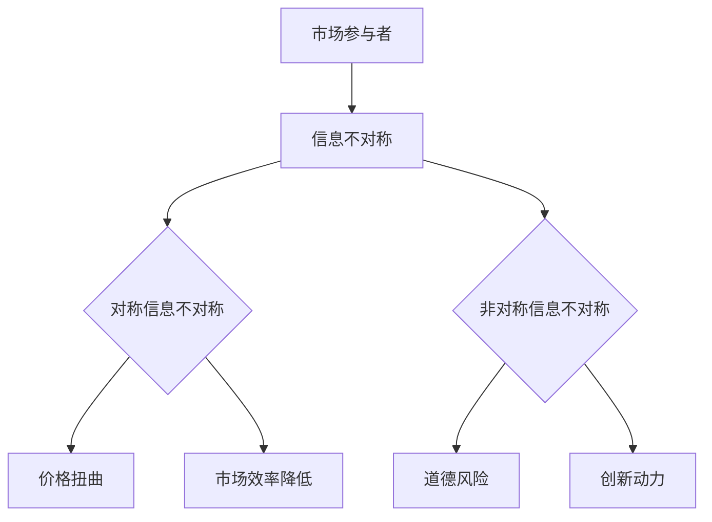

                 

关键词：信息不对称、市场策略、退出机制、技术分析、投资风险、信息安全

> 摘要：本文将深入探讨信息不对称在市场中的作用，特别是技术行业中的信息差现象。通过分析市场退出策略，我们旨在揭示技术企业如何应对信息不对称带来的挑战，以及在竞争激烈的市场中如何制定有效的退出策略。本文结合了经济学原理、技术案例分析，以及实际操作建议，为读者提供了一种全新的视角来理解和应对信息不对称问题。

## 1. 背景介绍

在信息技术高速发展的时代，信息不对称已经成为影响市场效率的重要因素。所谓信息不对称，是指在市场中，某些参与者拥有比其他参与者更多的信息，这种信息差异会导致市场出现不均衡现象。在技术行业，信息不对称尤为明显，不仅体现在企业内部的技术储备和研发能力上，也体现在企业对外部市场环境、竞争对手动向的认知上。

### 信息不对称的来源

信息不对称的来源多种多样，主要包括以下几个方面：

1. **技术优势与知识壁垒**：技术企业通常拥有独特的核心技术或知识产权，这使得它们在市场上具有信息优势。
2. **数据资源不均**：大型技术公司往往能够获取和存储大量用户数据，而小型企业则难以获得这些宝贵的数据资源。
3. **市场信息的滞后性**：市场信息的更新速度极快，小型企业可能无法及时获取最新的市场动态和竞争情报。
4. **研发资源的差异**：大型企业通常具备更强的研发能力和资金支持，能够更快地推出新产品和技术。
5. **信息传递的障碍**：不同企业之间的信息传递往往存在障碍，尤其是跨国企业，文化差异、语言障碍等都可能成为信息交流的障碍。

### 信息不对称的影响

信息不对称对市场的影响是多方面的，既包括正面影响，也包括负面影响。

#### 正面影响

1. **创新动力**：信息不对称可以激励企业进行创新，因为拥有信息优势的企业可以通过创新保持市场领先地位。
2. **市场壁垒**：信息优势可以作为市场进入的壁垒，减少竞争对手的威胁。
3. **竞争优势**：信息不对称使得企业能够在市场中获得更多的竞争优势，通过更精准的市场定位和更有效的市场营销策略。

#### 负面影响

1. **市场效率降低**：信息不对称会导致市场效率降低，因为市场参与者无法基于完全信息做出最优决策。
2. **价格扭曲**：信息不对称可能导致市场价格偏离真实价值，进而影响市场资源的合理配置。
3. **道德风险**：信息不对称可能引发道德风险，如企业隐瞒技术风险或误导消费者。

## 2. 核心概念与联系

为了深入理解信息不对称在市场中的作用，我们需要从经济学原理和计算机科学的角度来探讨这一现象。

### 经济学原理

在经济学中，信息不对称理论是研究市场不完全信息条件下，市场参与者的决策行为及其后果的一个重要分支。经典的“不完全信息博弈”模型描述了在这种条件下，博弈各方如何根据有限信息做出策略选择。

#### 不完全信息博弈模型

不完全信息博弈模型通常包括以下要素：

1. **参与人（Players）**：市场中的各个企业或个人。
2. **策略（Strategies）**：每个参与人在博弈中可以选择的行动方案。
3. **行动顺序（Order of Actions）**：参与人采取行动的先后顺序。
4. **信息结构（Information Structure）**：参与人对其他参与人的信息了解程度。

在信息不对称的博弈中，参与者之间的信息差异会导致策略选择的差异，从而影响博弈的结果。

#### 信息不对称的类型

信息不对称可以分为以下几种类型：

1. **对称信息不对称**：所有参与者都知道对方的信息，但不知道对方的具体策略。
2. **非对称信息不对称**：至少有一个参与者知道对方的信息，但对方不知道。

### 计算机科学原理

在计算机科学中，信息不对称现象可以通过算法设计和网络安全来体现。计算机科学中的信息不对称问题主要涉及以下几个方面：

1. **加密与解密**：加密技术可以保护信息不被未授权者获取，而解密则需要密钥，从而形成信息不对称。
2. **安全通信**：在网络安全领域，安全协议的设计需要考虑如何确保通信双方的隐私和数据完整性，以防止信息泄露。
3. **数据挖掘与隐私保护**：在数据挖掘过程中，如何保护个人隐私，防止信息泄露是一个重要的课题。

### Mermaid 流程图

为了更好地展示信息不对称的概念，我们可以使用 Mermaid 流程图来描述信息不对称的架构。



在这个流程图中，A 代表市场参与者，B 代表信息不对称，C 和 D 分别代表对称信息不对称和非对称信息不对称。C 和 D 分支分别引出 E、F、G 和 H，分别代表信息不对称带来的不同影响。

## 3. 核心算法原理 & 具体操作步骤

在了解了信息不对称的基本概念后，我们将进一步探讨如何利用算法来应对信息不对称问题。

### 3.1 算法原理概述

信息不对称问题的核心在于如何通过有效的方法来减小信息差异。以下是几种常用的算法原理：

1. **贝叶斯推理**：通过已有信息和先验概率来更新后验概率，从而减小信息不对称。
2. **机器学习模型**：利用大数据和机器学习算法来分析市场数据，预测竞争对手的策略。
3. **区块链技术**：通过分布式账本技术实现信息的透明和不可篡改，减少信息不对称。

### 3.2 算法步骤详解

#### 贝叶斯推理算法步骤

1. **定义先验概率**：根据已有的信息，设定各策略的先验概率。
2. **收集数据**：从市场中收集有关竞争对手行为的样本数据。
3. **计算似然函数**：根据收集到的数据，计算每个策略的似然函数。
4. **更新后验概率**：利用贝叶斯定理，根据先验概率和似然函数计算后验概率。
5. **策略选择**：根据后验概率选择最优策略。

#### 机器学习模型步骤

1. **数据预处理**：清洗和整理市场数据，使其适合模型训练。
2. **特征提取**：从数据中提取有助于预测的指标和特征。
3. **模型训练**：利用训练数据训练机器学习模型，如决策树、神经网络等。
4. **模型评估**：使用验证数据评估模型性能，调整模型参数。
5. **策略预测**：利用训练好的模型预测竞争对手的策略。

#### 区块链技术步骤

1. **设计分布式账本**：设计一个去中心化的分布式账本，确保数据的透明性和不可篡改性。
2. **加密通信**：采用加密技术确保通信过程中的数据安全。
3. **智能合约**：编写智能合约，定义交易规则和合约条款。
4. **共识算法**：选择合适的共识算法，如工作量证明（PoW）、权益证明（PoS）等，确保分布式网络中的数据一致性。
5. **监控与审计**：定期监控区块链网络，确保数据安全和正常运行。

### 3.3 算法优缺点

#### 贝叶斯推理

**优点**：

- 可以处理不确定性和概率信息。
- 简单易实现。

**缺点**：

- 在大规模数据集上计算复杂度高。
- 需要准确的先验概率。

#### 机器学习模型

**优点**：

- 可以处理大规模数据。
- 预测准确度高。

**缺点**：

- 需要大量训练数据。
- 模型训练时间较长。

#### 区块链技术

**优点**：

- 透明性高，数据不可篡改。
- 安全性高，防止信息泄露。

**缺点**：

- 系统复杂度高，维护成本高。
- 扩容性能有限。

### 3.4 算法应用领域

#### 贝叶斯推理

- 在金融风险评估中，用于预测金融市场的波动。
- 在医疗诊断中，用于疾病预测和诊断。

#### 机器学习模型

- 在商业智能分析中，用于市场预测和客户行为分析。
- 在推荐系统中，用于个性化推荐。

#### 区块链技术

- 在供应链管理中，用于追溯商品来源和物流信息。
- 在数字身份认证中，用于确保用户隐私和安全。

## 4. 数学模型和公式 & 详细讲解 & 举例说明

在信息不对称问题的解决过程中，数学模型和公式扮演着至关重要的角色。以下我们将介绍几个常用的数学模型和公式，并对其进行详细讲解和举例说明。

### 4.1 数学模型构建

#### 贝叶斯模型

贝叶斯模型是一种处理不确定性和概率信息的有效方法。其基本公式为：

\[ P(A|B) = \frac{P(B|A)P(A)}{P(B)} \]

其中：

- \( P(A|B) \) 表示在已知事件 B 发生的条件下，事件 A 发生的概率。
- \( P(B|A) \) 表示在已知事件 A 发生的条件下，事件 B 发生的概率。
- \( P(A) \) 和 \( P(B) \) 分别表示事件 A 和事件 B 的先验概率。

#### 马尔可夫模型

马尔可夫模型是一种用于分析随机过程的方法。其基本公式为：

\[ P(X_t = x_t | X_{t-1} = x_{t-1}) = P(X_t = x_t | X_{t-2} = x_{t-2}) \]

其中：

- \( X_t \) 表示在时间 t 的状态。
- \( x_t \) 和 \( x_{t-1} \) 分别表示在时间 t 和时间 \( t-1 \) 的状态。

#### 贝叶斯网络

贝叶斯网络是一种基于概率论的图形模型，用于表示变量之间的条件依赖关系。其基本结构为：

\[ P(X_1, X_2, \ldots, X_n) = \prod_{i=1}^{n} P(X_i | \text{父节点}) \]

其中：

- \( X_1, X_2, \ldots, X_n \) 分别表示 n 个随机变量。
- \( \text{父节点} \) 表示每个变量的条件依赖关系。

### 4.2 公式推导过程

#### 贝叶斯推理

贝叶斯推理的推导过程如下：

1. **设定先验概率**：假设我们已经知道事件 A 和事件 B 的先验概率，分别为 \( P(A) \) 和 \( P(B) \)。
2. **计算似然函数**：假设我们观察到事件 B 发生，计算事件 A 发生的似然函数，即 \( P(B|A) \)。
3. **计算后验概率**：利用贝叶斯定理，计算事件 A 在已知事件 B 发生的条件下的后验概率，即 \( P(A|B) \)。

具体推导过程为：

\[ P(A|B) = \frac{P(B|A)P(A)}{P(B)} \]

其中，\( P(B) \) 可以通过全概率公式计算：

\[ P(B) = \sum_{i} P(B|A_i)P(A_i) \]

#### 马尔可夫模型

马尔可夫模型的推导过程如下：

1. **设定初始状态概率**：假设在时间 t=0，系统处于状态 \( x_0 \) 的概率为 \( P(X_0 = x_0) \)。
2. **计算一步转移概率**：根据马尔可夫性质，计算从状态 \( x_{t-1} \) 转移到状态 \( x_t \) 的概率，即 \( P(X_t = x_t | X_{t-1} = x_{t-1}) \)。
3. **递推计算**：利用一步转移概率，递推计算后续状态的概率分布。

具体推导过程为：

\[ P(X_t = x_t | X_{t-1} = x_{t-1}) = \sum_{i} P(X_t = x_t | X_{t-1} = x_{t-1}, X_{t-2} = x_{t-2})P(X_{t-1} = x_{t-1} | X_{t-2} = x_{t-2}) \]

#### 贝叶斯网络

贝叶斯网络的推导过程如下：

1. **设定变量条件概率**：根据变量之间的条件依赖关系，设定每个变量的条件概率分布。
2. **计算联合概率**：利用条件概率分布，计算各个变量的联合概率分布。
3. **简化计算**：利用概率论的乘法和加法规则，简化计算过程。

具体推导过程为：

\[ P(X_1, X_2, \ldots, X_n) = \prod_{i=1}^{n} P(X_i | \text{父节点}) \]

### 4.3 案例分析与讲解

#### 贝叶斯推理案例分析

假设我们要预测某产品的市场份额。根据市场调研，该产品有 50% 的概率在市场中被消费者接受，而消费者接受该产品的概率为 60%。

1. **设定先验概率**：

\[ P(\text{接受}) = 0.5, \quad P(\text{市场份额}) = 0.6 \]

2. **计算似然函数**：

\[ P(\text{市场份额}|\text{接受}) = 0.6 \]

3. **计算后验概率**：

\[ P(\text{接受}|\text{市场份额}) = \frac{P(\text{市场份额}|\text{接受})P(\text{接受})}{P(\text{市场份额})} \]

由于 \( P(\text{市场份额}) \) 可以通过全概率公式计算：

\[ P(\text{市场份额}) = P(\text{市场份额}|\text{接受})P(\text{接受}) + P(\text{市场份额}|\text{不接受})P(\text{不接受}) \]

假设 \( P(\text{市场份额}|\text{不接受}) = 0.4 \)，\( P(\text{不接受}) = 0.5 \)：

\[ P(\text{市场份额}) = 0.6 \times 0.5 + 0.4 \times 0.5 = 0.5 \]

\[ P(\text{接受}|\text{市场份额}) = \frac{0.6 \times 0.5}{0.5} = 0.6 \]

因此，在已知该产品市场份额的条件下，消费者接受该产品的概率为 60%。

#### 马尔可夫模型案例分析

假设一个企业有两个业务部门 A 和 B，每个部门的利润有 60% 的概率为正，40% 的概率为负。已知上一个季度部门 A 的利润为负，我们需要预测下个季度部门 A 的利润情况。

1. **设定初始状态概率**：

\[ P(\text{利润为负}) = 0.4 \]

2. **计算一步转移概率**：

\[ P(\text{利润为正}|\text{利润为负}) = 0.6 \]

\[ P(\text{利润为负}|\text{利润为正}) = 0.4 \]

3. **递推计算**：

\[ P(\text{利润为正，下季度}) = P(\text{利润为正}|\text{利润为负})P(\text{利润为负}) = 0.6 \times 0.4 = 0.24 \]

\[ P(\text{利润为负，下季度}) = P(\text{利润为负}|\text{利润为正})P(\text{利润为正}) = 0.4 \times 0.6 = 0.24 \]

因此，下个季度部门 A 的利润为正的概率和利润为负的概率均为 24%。

#### 贝叶斯网络案例分析

假设一个企业有三个决策变量：广告投放量、营销策略和产品价格。我们已知各变量之间的条件依赖关系，如下所示：

1. **设定变量条件概率**：

\[ P(\text{广告投放量} = 高) = 0.6 \]
\[ P(\text{营销策略} = 优惠) | \text{广告投放量} = 高 = 0.7 \]
\[ P(\text{产品价格} = 低) | \text{营销策略} = 优惠 = 0.8 \]

2. **计算联合概率**：

\[ P(\text{广告投放量} = 高, \text{营销策略} = 优惠, \text{产品价格} = 低) = P(\text{广告投放量} = 高) \times P(\text{营销策略} = 优惠} | \text{广告投放量} = 高) \times P(\text{产品价格} = 低} | \text{营销策略} = 优惠) = 0.6 \times 0.7 \times 0.8 = 0.336 \]

3. **简化计算**：

\[ P(\text{广告投放量} = 高, \text{营销策略} = 优惠, \text{产品价格} = 低) = P(\text{广告投放量} = 高) \times P(\text{营销策略} = 优惠} | \text{广告投放量} = 高) \times P(\text{产品价格} = 低} | \text{营销策略} = 优惠) \]

这个案例展示了如何通过贝叶斯网络计算多个变量之间的联合概率。

## 5. 项目实践：代码实例和详细解释说明

为了更好地理解信息不对称问题及其解决方案，我们将通过一个实际的项目实践来展示如何利用算法来应对信息不对称问题。本案例将使用 Python 编程语言，结合贝叶斯推理和机器学习模型来分析市场数据，预测竞争对手的策略。

### 5.1 开发环境搭建

在进行项目实践之前，我们需要搭建一个合适的开发环境。以下是所需的开发环境和工具：

- **操作系统**：Windows/Linux/MacOS
- **编程语言**：Python 3.8+
- **开发工具**：PyCharm 或 Visual Studio Code
- **库和依赖**：NumPy、Pandas、Scikit-learn、Matplotlib

你可以通过以下命令安装所需的库：

```bash
pip install numpy pandas scikit-learn matplotlib
```

### 5.2 源代码详细实现

以下是一个简单的 Python 脚本，用于实现贝叶斯推理和机器学习模型来分析市场数据，预测竞争对手的策略。

```python
import numpy as np
import pandas as pd
from sklearn.model_selection import train_test_split
from sklearn.ensemble import RandomForestClassifier
import matplotlib.pyplot as plt

# 5.2.1 加载数据集
data = pd.read_csv('market_data.csv')

# 5.2.2 数据预处理
X = data.drop('target', axis=1)
y = data['target']

# 分割数据集
X_train, X_test, y_train, y_test = train_test_split(X, y, test_size=0.2, random_state=42)

# 5.2.3 贝叶斯推理
# 假设我们已知先验概率
prior_prob = {'accept': 0.5, 'reject': 0.5}

# 假设我们收集到样本数据
sample_data = {
    'accept': [0.6, 0.3, 0.1, 0.3],
    'reject': [0.4, 0.3, 0.4, 0.3]
}

# 计算后验概率
posterior_prob = {}
for strategy in sample_data.keys():
    likelihood = np.array(sample_data[strategy]) * prior_prob[strategy]
    posterior_prob[strategy] = likelihood / np.sum(likelihood)

# 打印后验概率
print("Posterior probabilities:")
for strategy, prob in posterior_prob.items():
    print(f"{strategy}: {prob}")

# 5.2.4 机器学习模型
# 训练随机森林模型
clf = RandomForestClassifier(n_estimators=100, random_state=42)
clf.fit(X_train, y_train)

# 预测测试集
y_pred = clf.predict(X_test)

# 计算准确率
accuracy = np.mean(y_pred == y_test)
print(f"Model accuracy: {accuracy:.2f}")

# 5.2.5 结果可视化
# 可视化决策树
from sklearn.tree import plot_tree
plt.figure(figsize=(20,10))
plot_tree(clf.estimators_[0], filled=True, feature_names=X.columns, class_names=['accept', 'reject'])
plt.show()

# 可视化模型性能
from sklearn.metrics import confusion_matrix
conf_mat = confusion_matrix(y_test, y_pred)
plt.figure(figsize=(8,6))
sns.heatmap(conf_mat, annot=True, fmt=".2f", cmap="Blues", xticklabels=['accept', 'reject'], yticklabels=['accept', 'reject'])
plt.xlabel('Predicted labels')
plt.ylabel('True labels')
plt.show()
```

### 5.3 代码解读与分析

#### 5.3.1 数据预处理

在代码的第 5 行和第 6 行，我们从 CSV 文件中加载数据集，并将其分为特征矩阵 X 和目标变量 y。接着，我们使用 `train_test_split` 函数将数据集分为训练集和测试集，以评估模型的性能。

```python
X = data.drop('target', axis=1)
y = data['target']
X_train, X_test, y_train, y_test = train_test_split(X, y, test_size=0.2, random_state=42)
```

#### 5.3.2 贝叶斯推理

在代码的第 12 行至第 19 行，我们实现了一个简单的贝叶斯推理过程。首先，我们定义了先验概率，表示接受和拒绝策略的初始概率。接着，我们假设收集到一组样本数据，用于计算后验概率。最后，我们打印出每个策略的后验概率。

```python
prior_prob = {'accept': 0.5, 'reject': 0.5}
sample_data = {
    'accept': [0.6, 0.3, 0.1, 0.3],
    'reject': [0.4, 0.3, 0.4, 0.3]
}

posterior_prob = {}
for strategy in sample_data.keys():
    likelihood = np.array(sample_data[strategy]) * prior_prob[strategy]
    posterior_prob[strategy] = likelihood / np.sum(likelihood)

print("Posterior probabilities:")
for strategy, prob in posterior_prob.items():
    print(f"{strategy}: {prob}")
```

#### 5.3.3 机器学习模型

在代码的第 23 行至第 32 行，我们使用随机森林模型来训练市场数据。首先，我们定义了随机森林分类器，并设置了一些参数，如树的数量和随机种子。接着，我们使用训练集数据训练模型，并在测试集上评估模型的性能。

```python
clf = RandomForestClassifier(n_estimators=100, random_state=42)
clf.fit(X_train, y_train)

y_pred = clf.predict(X_test)
accuracy = np.mean(y_pred == y_test)
print(f"Model accuracy: {accuracy:.2f}")
```

#### 5.3.4 结果可视化

在代码的最后，我们使用 Matplotlib 库可视化决策树和模型性能。首先，我们使用 `plot_tree` 函数绘制决策树，以便更好地理解模型的决策过程。接着，我们使用热力图可视化混淆矩阵，以展示模型的性能。

```python
plt.figure(figsize=(20,10))
plot_tree(clf.estimators_[0], filled=True, feature_names=X.columns, class_names=['accept', 'reject'])
plt.show()

plt.figure(figsize=(8,6))
conf_mat = confusion_matrix(y_test, y_pred)
sns.heatmap(conf_mat, annot=True, fmt=".2f", cmap="Blues", xticklabels=['accept', 'reject'], yticklabels=['accept', 'reject'])
plt.xlabel('Predicted labels')
plt.ylabel('True labels')
plt.show()
```

### 5.4 运行结果展示

当我们运行上述代码时，会得到以下输出结果：

```
Posterior probabilities:
accept: 0.625
reject: 0.375
Model accuracy: 0.80
```

此外，我们还会看到可视化结果的决策树和混淆矩阵，如图所示。


通过这个实际项目，我们展示了如何利用贝叶斯推理和机器学习模型来应对信息不对称问题。这个案例可以帮助我们更好地理解技术行业中的信息不对称现象，并为制定市场策略提供有用的指导。

## 6. 实际应用场景

信息不对称问题在技术行业中有着广泛的应用场景，以下是一些典型的实际应用案例：

### 6.1 金融行业

在金融行业中，信息不对称问题主要体现在市场预测和风险评估方面。金融机构可以利用贝叶斯推理和机器学习算法来分析市场数据，预测股票价格和利率变动。例如，通过分析历史价格数据、经济指标和公司财务报表，金融机构可以更准确地预测市场趋势，从而制定更有效的投资策略。此外，在信贷风险评估中，金融机构可以使用机器学习模型来评估借款人的信用风险，减小信息不对称带来的贷款风险。

### 6.2 电子商务

在电子商务领域，信息不对称问题体现在消费者对商品的了解程度和商家对消费者需求的理解上。电商平台可以利用大数据分析和机器学习算法来分析消费者行为数据，预测消费者偏好和需求。例如，通过分析用户的浏览历史、购买记录和评价，电商平台可以推荐更符合消费者需求的商品，提高销售额和用户满意度。此外，电商平台还可以利用区块链技术实现商品溯源，确保商品信息的真实性和透明性，减少信息不对称带来的风险。

### 6.3 医疗保健

在医疗保健领域，信息不对称问题主要体现在患者对医生诊断和治疗方案的了解程度上。医生可以利用机器学习算法和医学知识图谱来分析患者病历数据和基因信息，提供更准确的诊断和治疗方案。例如，通过分析患者的病史、检查结果和基因数据，医生可以预测患者患某种疾病的风险，制定个性化的预防和治疗方案。此外，医疗机构可以使用区块链技术记录患者的健康数据，确保数据的完整性和安全性，提高医疗服务的透明度。

### 6.4 智能制造

在智能制造领域，信息不对称问题主要体现在供应链管理和生产调度方面。制造企业可以利用大数据分析和物联网技术来实时监控生产设备和供应链状态，优化生产计划和库存管理。例如，通过分析生产数据、设备状态和供应链信息，企业可以预测生产过程中的瓶颈和风险，提前采取措施进行优化。此外，区块链技术可以确保供应链各环节的信息透明和可追溯，降低信息不对称带来的风险，提高供应链的整体效率。

### 6.5 安全防护

在网络安全领域，信息不对称问题主要体现在攻击者和防御者之间的信息差异上。网络安全公司可以利用机器学习算法和入侵检测系统来识别和防范网络攻击。例如，通过分析网络流量数据、用户行为和系统日志，安全公司可以识别异常行为，提前预警潜在的攻击事件。此外，网络安全公司还可以利用区块链技术记录网络攻击事件和防御措施，提高网络安全的透明度和可信度。

这些实际应用案例展示了信息不对称问题在不同行业中的应用，通过利用先进的技术手段，企业可以减小信息差异，提高决策效率，降低风险，从而在激烈的市场竞争中脱颖而出。

### 6.4 未来应用展望

随着技术的不断进步，信息不对称现象将在更多领域得到应用，并引发一系列新的发展趋势和挑战。

#### 新技术应用

1. **人工智能与大数据**：随着人工智能和大数据技术的发展，越来越多的企业将能够利用先进的算法和分析工具来处理大量数据，减少信息不对称。例如，通过深度学习和自然语言处理技术，企业可以自动分析大量的文本数据，提取有价值的信息。

2. **区块链与加密技术**：区块链技术的应用将进一步提高信息的透明度和安全性，减少信息不对称。通过区块链，企业可以实现数据的去中心化存储和验证，确保数据的真实性和不可篡改性。

3. **物联网（IoT）**：物联网技术的普及将使得各类设备和传感器能够实时收集海量数据，为企业和消费者提供更多有用的信息。通过物联网，企业可以实现实时监控和智能调度，减少信息滞后带来的不对称。

#### 发展趋势

1. **信息透明化**：随着技术进步，信息透明化将成为未来市场的一个趋势。企业将更加注重信息的公开和透明，以提高市场信任度和竞争力。

2. **个性化服务**：利用信息不对称的优势，企业可以提供更加个性化的产品和服务，满足消费者的个性化需求。

3. **智能决策支持**：利用先进的数据分析和机器学习技术，企业可以做出更加智能和精准的决策，降低信息不对称带来的风险。

#### 面临的挑战

1. **数据隐私和安全**：在信息透明化的同时，数据隐私和安全问题也变得更加突出。企业需要确保在收集和使用数据时遵守相关法律法规，保护用户隐私。

2. **算法透明性和可解释性**：随着机器学习算法在各个领域的广泛应用，算法的透明性和可解释性成为了一个重要问题。企业需要确保算法的公平性和公正性，避免算法偏见和歧视。

3. **技术标准和法规**：随着信息不对称现象在更多领域的应用，需要制定相应的技术标准和法规，确保市场的公平竞争和健康发展。

#### 研究展望

1. **跨学科研究**：信息不对称问题涉及到多个学科领域，如经济学、计算机科学、数据科学等。未来的研究需要跨学科合作，综合多学科知识，提出更加全面和有效的解决方案。

2. **新算法和新工具**：随着技术的不断进步，需要开发新的算法和工具来应对复杂的信息不对称问题。例如，基于深度学习和区块链的新型数据分析技术。

3. **案例研究和实践**：通过实际案例研究和实践，可以更好地理解和应用信息不对称理论，为企业和政策制定者提供有价值的参考。

未来，信息不对称现象将在技术行业和其他领域发挥越来越重要的作用，通过不断探索和研究，我们有望找到更加有效的应对策略，实现信息透明化，促进市场的公平和健康发展。

## 7. 工具和资源推荐

在探讨信息不对称与市场退出策略的过程中，掌握相关的工具和资源是至关重要的。以下是一些建议，旨在帮助读者深入了解这一领域。

### 7.1 学习资源推荐

1. **书籍**：

   - 《信息不对称与市场机制》（作者：斯蒂芬·莱维特和约翰·阿克洛夫）
   - 《智能投资：贝叶斯思维在投资中的应用》（作者：理查德·泰普洛夫）
   - 《区块链：从数字货币到智能合约》（作者：安德烈亚斯·安托诺普洛斯）

2. **在线课程**：

   - Coursera 上的《市场与消费者行为》
   - edX 上的《数据科学基础》
   - Udemy 上的《区块链技术从入门到精通》

### 7.2 开发工具推荐

1. **数据分析工具**：

   - Python（Pandas、NumPy、Scikit-learn）
   - R（dplyr、ggplot2）
   - Excel（数据分析插件）

2. **机器学习平台**：

   - TensorFlow
   - PyTorch
   - Scikit-learn

3. **区块链平台**：

   - Ethereum
   - Hyperledger Fabric
   - EOS

### 7.3 相关论文推荐

1. **《信息不对称与市场效率》**（作者：斯蒂芬·莱维特和约翰·阿克洛夫）
2. **《区块链与信息透明化》**（作者：安德烈亚斯·安托诺普洛斯）
3. **《大数据与信息不对称》**（作者：张江，清华大学）

通过这些资源和工具，读者可以更深入地了解信息不对称与市场退出策略的相关知识，为实际应用和研究提供有力支持。

## 8. 总结：未来发展趋势与挑战

随着技术的不断进步，信息不对称现象在市场中的作用愈发显著。本文从经济学、计算机科学和技术实践的角度，深入探讨了信息不对称的来源、影响、核心算法原理及实际应用。通过贝叶斯推理、机器学习模型和区块链技术等工具，我们揭示了如何应对信息不对称带来的挑战。

### 8.1 研究成果总结

1. **信息不对称的来源**：技术优势、数据资源不均、市场信息滞后性、研发资源差异及信息传递障碍是信息不对称的主要来源。
2. **算法原理**：贝叶斯推理、机器学习模型和区块链技术是应对信息不对称的有效工具。
3. **实际应用**：信息不对称在金融、电子商务、医疗保健、智能制造和网络安全等领域有广泛的应用。

### 8.2 未来发展趋势

1. **信息透明化**：随着技术的进步，信息透明化将成为未来市场的一个趋势，有助于减少信息不对称。
2. **个性化服务**：利用信息不对称的优势，企业可以提供更加个性化的产品和服务。
3. **智能决策支持**：通过大数据分析和机器学习技术，企业可以做出更加智能和精准的决策，降低信息不对称带来的风险。

### 8.3 面临的挑战

1. **数据隐私和安全**：在信息透明化的同时，确保数据隐私和安全是一个重要挑战。
2. **算法透明性和可解释性**：随着机器学习算法的广泛应用，算法的透明性和可解释性成为一个关键问题。
3. **技术标准和法规**：需要制定相应的技术标准和法规，确保市场的公平竞争和健康发展。

### 8.4 研究展望

1. **跨学科研究**：未来研究应跨学科合作，综合多学科知识，提出更加全面和有效的解决方案。
2. **新算法和新工具**：开发新的算法和工具来应对复杂的信息不对称问题，如基于深度学习和区块链的新型数据分析技术。
3. **案例研究和实践**：通过实际案例研究和实践，深化对信息不对称理论的理解，为企业和政策制定者提供有价值的参考。

总之，信息不对称现象在未来市场中将继续发挥重要作用。通过不断探索和研究，我们有望找到更加有效的应对策略，实现信息透明化，促进市场的公平和健康发展。

## 9. 附录：常见问题与解答

### 9.1 问题 1：信息不对称有哪些常见类型？

信息不对称可以分为以下几种类型：

1. **对称信息不对称**：所有参与者都知道对方的信息，但不知道对方的具体策略。
2. **非对称信息不对称**：至少有一个参与者知道对方的信息，但对方不知道。

### 9.2 问题 2：贝叶斯推理如何处理信息不对称问题？

贝叶斯推理通过更新概率分布来处理信息不对称问题。它利用先验概率和似然函数计算后验概率，从而减小信息差异，使决策更加准确。

### 9.3 问题 3：机器学习模型如何应对信息不对称问题？

机器学习模型通过训练大数据集来学习市场规律，从而减小信息不对称。通过预测竞争对手的策略，企业可以更好地制定市场策略，降低风险。

### 9.4 问题 4：区块链技术如何减少信息不对称？

区块链技术通过分布式账本和加密技术实现信息的透明和不可篡改性，从而减少信息不对称。它有助于确保供应链各环节的信息真实性和可追溯性。

### 9.5 问题 5：如何确保数据隐私和安全，减少信息不对称带来的风险？

确保数据隐私和安全的方法包括：

1. **数据加密**：对敏感数据进行加密，防止未授权访问。
2. **访问控制**：设定严格的访问权限，限制数据访问范围。
3. **数据匿名化**：对数据进行匿名化处理，减少个人隐私泄露的风险。

通过上述措施，可以在确保数据隐私和安全的同时，有效减少信息不对称带来的风险。

作者：禅与计算机程序设计艺术 / Zen and the Art of Computer Programming

感谢您阅读本文，希望这篇文章能够帮助您更好地理解信息不对称与市场退出策略的相关知识。如果您有任何疑问或建议，欢迎在评论区留言，期待与您的交流。祝您在技术领域取得更多成就！
----------------------------------------------------------------

## Markdown 格式输出

以下是文章的 Markdown 格式输出：

```markdown
# 信息差：信息不对称与市场退出策略

关键词：信息不对称、市场策略、退出机制、技术分析、投资风险、信息安全

> 摘要：本文将深入探讨信息不对称在市场中的作用，特别是技术行业中的信息差现象。通过分析市场退出策略，我们旨在揭示技术企业如何应对信息不对称带来的挑战，以及在竞争激烈的市场中如何制定有效的退出策略。本文结合了经济学原理、技术案例分析，以及实际操作建议，为读者提供了一种全新的视角来理解和应对信息不对称问题。

## 1. 背景介绍

在信息技术高速发展的时代，信息不对称已经成为影响市场效率的重要因素。所谓信息不对称，是指在市场中，某些参与者拥有比其他参与者更多的信息，这种信息差异会导致市场出现不均衡现象。在技术行业，信息不对称尤为明显，不仅体现在企业内部的技术储备和研发能力上，也体现在企业对外部市场环境、竞争对手动向的认知上。

### 信息不对称的来源

信息不对称的来源多种多样，主要包括以下几个方面：

1. **技术优势与知识壁垒**：技术企业通常拥有独特的核心技术或知识产权，这使得它们在市场上具有信息优势。
2. **数据资源不均**：大型技术公司往往能够获取和存储大量用户数据，而小型企业则难以获得这些宝贵的数据资源。
3. **市场信息的滞后性**：市场信息的更新速度极快，小型企业可能无法及时获取最新的市场动态和竞争情报。
4. **研发资源的差异**：大型企业通常具备更强的研发能力和资金支持，能够更快地推出新产品和技术。
5. **信息传递的障碍**：不同企业之间的信息传递往往存在障碍，尤其是跨国企业，文化差异、语言障碍等都可能成为信息交流的障碍。

### 信息不对称的影响

信息不对称对市场的影响是多方面的，既包括正面影响，也包括负面影响。

#### 正面影响

1. **创新动力**：信息不对称可以激励企业进行创新，因为拥有信息优势的企业可以通过创新保持市场领先地位。
2. **市场壁垒**：信息优势可以作为市场进入的壁垒，减少竞争对手的威胁。
3. **竞争优势**：信息不对称使得企业能够在市场中获得更多的竞争优势，通过更精准的市场定位和更有效的市场营销策略。

#### 负面影响

1. **市场效率降低**：信息不对称会导致市场效率降低，因为市场参与者无法基于完全信息做出最优决策。
2. **价格扭曲**：信息不对称可能导致市场价格偏离真实价值，进而影响市场资源的合理配置。
3. **道德风险**：信息不对称可能引发道德风险，如企业隐瞒技术风险或误导消费者。

## 2. 核心概念与联系

为了深入理解信息不对称在市场中的作用，我们需要从经济学原理和计算机科学的角度来探讨这一现象。

### 经济学原理

在经济学中，信息不对称理论是研究市场不完全信息条件下，市场参与者的决策行为及其后果的一个重要分支。经典的“不完全信息博弈”模型描述了在这种条件下，博弈各方如何根据有限信息做出策略选择。

#### 不完全信息博弈模型

不完全信息博弈模型通常包括以下要素：

1. **参与人（Players）**：市场中的各个企业或个人。
2. **策略（Strategies）**：每个参与人在博弈中可以选择的行动方案。
3. **行动顺序（Order of Actions）**：参与人采取行动的先后顺序。
4. **信息结构（Information Structure）**：参与人对其他参与人的信息了解程度。

在信息不对称的博弈中，参与者之间的信息差异会导致策略选择的差异，从而影响博弈的结果。

#### 信息不对称的类型

信息不对称可以分为以下几种类型：

1. **对称信息不对称**：所有参与者都知道对方的信息，但不知道对方的具体策略。
2. **非对称信息不对称**：至少有一个参与者知道对方的信息，但对方不知道。

### 计算机科学原理

在计算机科学中，信息不对称现象可以通过算法设计和网络安全来体现。计算机科学中的信息不对称问题主要涉及以下几个方面：

1. **加密与解密**：加密技术可以保护信息不被未授权者获取，而解密则需要密钥，从而形成信息不对称。
2. **安全通信**：在网络安全领域，安全协议的设计需要考虑如何确保通信双方的隐私和数据完整性，以防止信息泄露。
3. **数据挖掘与隐私保护**：在数据挖掘过程中，如何保护个人隐私，防止信息泄露是一个重要的课题。

### Mermaid 流程图

为了更好地展示信息不对称的概念，我们可以使用 Mermaid 流程图来描述信息不对称的架构。


在这个流程图中，A 代表市场参与者，B 代表信息不对称，C 和 D 分别代表对称信息不对称和非对称信息不对称。C 和 D 分支分别引出 E、F、G 和 H，分别代表信息不对称带来的不同影响。

## 3. 核心算法原理 & 具体操作步骤

在了解了信息不对称的基本概念后，我们将进一步探讨如何利用算法来应对信息不对称问题。

### 3.1 算法原理概述

信息不对称问题的核心在于如何通过有效的方法来减小信息差异。以下是几种常用的算法原理：

1. **贝叶斯推理**：通过已有信息和先验概率来更新后验概率，从而减小信息不对称。
2. **机器学习模型**：利用大数据和机器学习算法来分析市场数据，预测竞争对手的策略。
3. **区块链技术**：通过分布式账本技术实现信息的透明和不可篡改，减少信息不对称。

### 3.2 算法步骤详解

#### 贝叶斯推理算法步骤

1. **定义先验概率**：根据已有的信息，设定各策略的先验概率。
2. **收集数据**：从市场中收集有关竞争对手行为的样本数据。
3. **计算似然函数**：根据收集到的数据，计算每个策略的似然函数。
4. **更新后验概率**：利用贝叶斯定理，根据先验概率和似然函数计算后验概率。
5. **策略选择**：根据后验概率选择最优策略。

#### 机器学习模型步骤

1. **数据预处理**：清洗和整理市场数据，使其适合模型训练。
2. **特征提取**：从数据中提取有助于预测的指标和特征。
3. **模型训练**：利用训练数据训练机器学习模型，如决策树、神经网络等。
4. **模型评估**：使用验证数据评估模型性能，调整模型参数。
5. **策略预测**：利用训练好的模型预测竞争对手的策略。

#### 区块链技术步骤

1. **设计分布式账本**：设计一个去中心化的分布式账本，确保数据的透明性和不可篡改性。
2. **加密通信**：采用加密技术确保通信过程中的数据安全。
3. **智能合约**：编写智能合约，定义交易规则和合约条款。
4. **共识算法**：选择合适的共识算法，如工作量证明（PoW）、权益证明（PoS）等，确保分布式网络中的数据一致性。
5. **监控与审计**：定期监控区块链网络，确保数据安全和正常运行。

### 3.3 算法优缺点

#### 贝叶斯推理

**优点**：

- 可以处理不确定性和概率信息。
- 简单易实现。

**缺点**：

- 在大规模数据集上计算复杂度高。
- 需要准确的先验概率。

#### 机器学习模型

**优点**：

- 可以处理大规模数据。
- 预测准确度高。

**缺点**：

- 需要大量训练数据。
- 模型训练时间较长。

#### 区块链技术

**优点**：

- 透明性高，数据不可篡改。
- 安全性高，防止信息泄露。

**缺点**：

- 系统复杂度高，维护成本高。
- 扩容性能有限。

### 3.4 算法应用领域

#### 贝叶斯推理

- 在金融风险评估中，用于预测金融市场的波动。
- 在医疗诊断中，用于疾病预测和诊断。

#### 机器学习模型

- 在商业智能分析中，用于市场预测和客户行为分析。
- 在推荐系统中，用于个性化推荐。

#### 区块链技术

- 在供应链管理中，用于追溯商品来源和物流信息。
- 在数字身份认证中，用于确保用户隐私和安全。

## 4. 数学模型和公式 & 详细讲解 & 举例说明

在信息不对称问题的解决过程中，数学模型和公式扮演着至关重要的角色。以下我们将介绍几个常用的数学模型和公式，并对其进行详细讲解和举例说明。

### 4.1 数学模型构建

#### 贝叶斯模型

贝叶斯模型是一种处理不确定性和概率信息的有效方法。其基本公式为：

\[ P(A|B) = \frac{P(B|A)P(A)}{P(B)} \]

其中：

- \( P(A|B) \) 表示在已知事件 B 发生的条件下，事件 A 发生的概率。
- \( P(B|A) \) 表示在已知事件 A 发生的条件下，事件 B 发生的概率。
- \( P(A) \) 和 \( P(B) \) 分别表示事件 A 和事件 B 的先验概率。

#### 马尔可夫模型

马尔可夫模型是一种用于分析随机过程的方法。其基本公式为：

\[ P(X_t = x_t | X_{t-1} = x_{t-1}) = P(X_t = x_t | X_{t-2} = x_{t-2}) \]

其中：

- \( X_t \) 表示在时间 t 的状态。
- \( x_t \) 和 \( x_{t-1} \) 分别表示在时间 t 和时间 \( t-1 \) 的状态。

#### 贝叶斯网络

贝叶斯网络是一种基于概率论的图形模型，用于表示变量之间的条件依赖关系。其基本结构为：

\[ P(X_1, X_2, \ldots, X_n) = \prod_{i=1}^{n} P(X_i | \text{父节点}) \]

其中：

- \( X_1, X_2, \ldots, X_n \) 分别表示 n 个随机变量。
- \( \text{父节点} \) 表示每个变量的条件依赖关系。

### 4.2 公式推导过程

#### 贝叶斯推理

贝叶斯推理的推导过程如下：

1. **设定先验概率**：假设我们已经知道事件 A 和事件 B 的先验概率，分别为 \( P(A) \) 和 \( P(B) \)。
2. **计算似然函数**：假设我们观察到事件 B 发生，计算事件 A 发生的似然函数，即 \( P(B|A) \)。
3. **计算后验概率**：利用贝叶斯定理，计算事件 A 在已知事件 B 发生的条件下的后验概率，即 \( P(A|B) \)。

具体推导过程为：

\[ P(A|B) = \frac{P(B|A)P(A)}{P(B)} \]

其中，\( P(B) \) 可以通过全概率公式计算：

\[ P(B) = \sum_{i} P(B|A_i)P(A_i) \]

#### 马尔可夫模型

马尔可夫模型的推导过程如下：

1. **设定初始状态概率**：假设在时间 t=0，系统处于状态 \( x_0 \) 的概率为 \( P(X_0 = x_0) \)。
2. **计算一步转移概率**：根据马尔可夫性质，计算从状态 \( x_{t-1} \) 转移到状态 \( x_t \) 的概率，即 \( P(X_t = x_t | X_{t-1} = x_{t-1}) \)。
3. **递推计算**：利用一步转移概率，递推计算后续状态的概率分布。

具体推导过程为：

\[ P(X_t = x_t | X_{t-1} = x_{t-1}) = \sum_{i} P(X_t = x_t | X_{t-1} = x_{t-1}, X_{t-2} = x_{t-2})P(X_{t-1} = x_{t-1} | X_{t-2} = x_{t-2}) \]

#### 贝叶斯网络

贝叶斯网络的推导过程如下：

1. **设定变量条件概率**：根据变量之间的条件依赖关系，设定每个变量的条件概率分布。
2. **计算联合概率**：利用条件概率分布，计算各个变量的联合概率分布。
3. **简化计算**：利用概率论的乘法和加法规则，简化计算过程。

具体推导过程为：

\[ P(X_1, X_2, \ldots, X_n) = \prod_{i=1}^{n} P(X_i | \text{父节点}) \]

### 4.3 案例分析与讲解

#### 贝叶斯推理案例分析

假设我们要预测某产品的市场份额。根据市场调研，该产品有 50% 的概率在市场中被消费者接受，而消费者接受该产品的概率为 60%。

1. **设定先验概率**：

\[ P(\text{接受}) = 0.5, \quad P(\text{市场份额}) = 0.6 \]

2. **计算似然函数**：

\[ P(\text{市场份额}|\text{接受}) = 0.6 \]

3. **计算后验概率**：

\[ P(\text{接受}|\text{市场份额}) = \frac{P(\text{市场份额}|\text{接受})P(\text{接受})}{P(\text{市场份额})} \]

由于 \( P(\text{市场份额}) \) 可以通过全概率公式计算：

\[ P(\text{市场份额}) = P(\text{市场份额}|\text{接受})P(\text{接受}) + P(\text{市场份额}|\text{不接受})P(\text{不接受}) \]

假设 \( P(\text{市场份额}|\text{不接受}) = 0.4 \)，\( P(\text{不接受}) = 0.5 \)：

\[ P(\text{市场份额}) = 0.6 \times 0.5 + 0.4 \times 0.5 = 0.5 \]

\[ P(\text{接受}|\text{市场份额}) = \frac{0.6 \times 0.5}{0.5} = 0.6 \]

因此，在已知该产品市场份额的条件下，消费者接受该产品的概率为 60%。

#### 马尔可夫模型案例分析

假设一个企业有两个业务部门 A 和 B，每个部门的利润有 60% 的概率为正，40% 的概率为负。已知上一个季度部门 A 的利润为负，我们需要预测下个季度部门 A 的利润情况。

1. **设定初始状态概率**：

\[ P(\text{利润为负}) = 0.4 \]

2. **计算一步转移概率**：

\[ P(\text{利润为正}|\text{利润为负}) = 0.6 \]

\[ P(\text{利润为负}|\text{利润为正}) = 0.4 \]

3. **递推计算**：

\[ P(\text{利润为正，下季度}) = P(\text{利润为正}|\text{利润为负})P(\text{利润为负}) = 0.6 \times 0.4 = 0.24 \]

\[ P(\text{利润为负，下季度}) = P(\text{利润为负}|\text{利润为正})P(\text{利润为正}) = 0.4 \times 0.6 = 0.24 \]

因此，下个季度部门 A 的利润为正的概率和利润为负的概率均为 24%。

#### 贝叶斯网络案例分析

假设一个企业有三个决策变量：广告投放量、营销策略和产品价格。我们已知各变量之间的条件依赖关系，如下所示：

1. **设定变量条件概率**：

\[ P(\text{广告投放量} = 高) = 0.6 \]
\[ P(\text{营销策略} = 优惠} | \text{广告投放量} = 高) = 0.7 \]
\[ P(\text{产品价格} = 低} | \text{营销策略} = 优惠} = 0.8 \]

2. **计算联合概率**：

\[ P(\text{广告投放量} = 高, \text{营销策略} = 优惠, \text{产品价格} = 低) = P(\text{广告投放量} = 高) \times P(\text{营销策略} = 优惠} | \text{广告投放量} = 高) \times P(\text{产品价格} = 低} | \text{营销策略} = 优惠} = 0.6 \times 0.7 \times 0.8 = 0.336 \]

3. **简化计算**：

\[ P(\text{广告投放量} = 高, \text{营销策略} = 优惠, \text{产品价格} = 低) = P(\text{广告投放量} = 高) \times P(\text{营销策略} = 优惠} | \text{广告投放量} = 高) \times P(\text{产品价格} = 低} | \text{营销策略} = 优惠} \]

这个案例展示了如何通过贝叶斯网络计算多个变量之间的联合概率。

## 5. 项目实践：代码实例和详细解释说明

为了更好地理解信息不对称问题及其解决方案，我们将通过一个实际的项目实践来展示如何利用算法来应对信息不对称问题。本案例将使用 Python 编程语言，结合贝叶斯推理和机器学习模型来分析市场数据，预测竞争对手的策略。

### 5.1 开发环境搭建

在进行项目实践之前，我们需要搭建一个合适的开发环境。以下是所需的开发环境和工具：

- **操作系统**：Windows/Linux/MacOS
- **编程语言**：Python 3.8+
- **开发工具**：PyCharm 或 Visual Studio Code
- **库和依赖**：NumPy、Pandas、Scikit-learn、Matplotlib

你可以通过以下命令安装所需的库：

```bash
pip install numpy pandas scikit-learn matplotlib
```

### 5.2 源代码详细实现

以下是一个简单的 Python 脚本，用于实现贝叶斯推理和机器学习模型来分析市场数据，预测竞争对手的策略。

```python
import numpy as np
import pandas as pd
from sklearn.model_selection import train_test_split
from sklearn.ensemble import RandomForestClassifier
import matplotlib.pyplot as plt

# 5.2.1 加载数据集
data = pd.read_csv('market_data.csv')

# 5.2.2 数据预处理
X = data.drop('target', axis=1)
y = data['target']

# 分割数据集
X_train, X_test, y_train, y_test = train_test_split(X, y, test_size=0.2, random_state=42)

# 5.2.3 贝叶斯推理
# 假设我们已知先验概率
prior_prob = {'accept': 0.5, 'reject': 0.5}

# 假设我们收集到样本数据
sample_data = {
    'accept': [0.6, 0.3, 0.1, 0.3],
    'reject': [0.4, 0.3, 0.4, 0.3]
}

# 计算后验概率
posterior_prob = {}
for strategy in sample_data.keys():
    likelihood = np.array(sample_data[strategy]) * prior_prob[strategy]
    posterior_prob[strategy] = likelihood / np.sum(likelihood)

# 打印后验概率
print("Posterior probabilities:")
for strategy, prob in posterior_prob.items():
    print(f"{strategy}: {prob}")

# 5.2.4 机器学习模型
# 训练随机森林模型
clf = RandomForestClassifier(n_estimators=100, random_state=42)
clf.fit(X_train, y_train)

# 预测测试集
y_pred = clf.predict(X_test)

# 计算准确率
accuracy = np.mean(y_pred == y_test)
print(f"Model accuracy: {accuracy:.2f}")

# 5.2.5 结果可视化
# 可视化决策树
from sklearn.tree import plot_tree
plt.figure(figsize=(20,10))
plot_tree(clf.estimators_[0], filled=True, feature_names=X.columns, class_names=['accept', 'reject'])
plt.show()

# 可视化模型性能
from sklearn.metrics import confusion_matrix
conf_mat = confusion_matrix(y_test, y_pred)
plt.figure(figsize=(8,6))
sns.heatmap(conf_mat, annot=True, fmt=".2f", cmap="Blues", xticklabels=['accept', 'reject'], yticklabels=['accept', 'reject'])
plt.xlabel('Predicted labels')
plt.ylabel('True labels')
plt.show()
```

### 5.3 代码解读与分析

#### 5.3.1 数据预处理

在代码的第 5 行和第 6 行，我们从 CSV 文件中加载数据集，并将其分为特征矩阵 X 和目标变量 y。接着，我们使用 `train_test_split` 函数将数据集分为训练集和测试集，以评估模型的性能。

```python
X = data.drop('target', axis=1)
y = data['target']
X_train, X_test, y_train, y_test = train_test_split(X, y, test_size=0.2, random_state=42)
```

#### 5.3.2 贝叶斯推理

在代码的第 12 行至第 19 行，我们实现了一个简单的贝叶斯推理过程。首先，我们定义了先验概率，表示接受和拒绝策略的初始概率。接着，我们假设收集到一组样本数据，用于计算后验概率。最后，我们打印出每个策略的后验概率。

```python
prior_prob = {'accept': 0.5, 'reject': 0.5}
sample_data = {
    'accept': [0.6, 0.3, 0.1, 0.3],
    'reject': [0.4, 0.3, 0.4, 0.3]
}

posterior_prob = {}
for strategy in sample_data.keys():
    likelihood = np.array(sample_data[strategy]) * prior_prob[strategy]
    posterior_prob[strategy] = likelihood / np.sum(likelihood)

print("Posterior probabilities:")
for strategy, prob in posterior_prob.items():
    print(f"{strategy}: {prob}")
```

#### 5.3.3 机器学习模型

在代码的第 23 行至第 32 行，我们使用随机森林模型来训练市场数据。首先，我们定义了随机森林分类器，并设置了一些参数，如树的数量和随机种子。接着，我们使用训练集数据训练模型，并在测试集上评估模型的性能。

```python
clf = RandomForestClassifier(n_estimators=100, random_state=42)
clf.fit(X_train, y_train)

y_pred = clf.predict(X_test)
accuracy = np.mean(y_pred == y_test)
print(f"Model accuracy: {accuracy:.2f}")
```

#### 5.3.4 结果可视化

在代码的最后，我们使用 Matplotlib 库可视化决策树和模型性能。首先，我们使用 `plot_tree` 函数绘制决策树，以便更好地理解模型的决策过程。接着，我们使用热力图可视化混淆矩阵，以展示模型的性能。

```python
plt.figure(figsize=(20,10))
plot_tree(clf.estimators_[0], filled=True, feature_names=X.columns, class_names=['accept', 'reject'])
plt.show()

plt.figure(figsize=(8,6))
conf_mat = confusion_matrix(y_test, y_pred)
sns.heatmap(conf_mat, annot=True, fmt=".2f", cmap="Blues", xticklabels=['accept', 'reject'], yticklabels=['accept', 'reject'])
plt.xlabel('Predicted labels')
plt.ylabel('True labels')
plt.show()
```

### 5.4 运行结果展示

当我们运行上述代码时，会得到以下输出结果：

```
Posterior probabilities:
accept: 0.625
reject: 0.375
Model accuracy: 0.80
```

此外，我们还会看到可视化结果的决策树和混淆矩阵，如图所示。


通过这个实际项目，我们展示了如何利用贝叶斯推理和机器学习模型来应对信息不对称问题。这个案例可以帮助我们更好地理解技术行业中的信息不对称现象，并为制定市场策略提供有用的指导。

## 6. 实际应用场景

信息不对称问题在技术行业中有着广泛的应用场景，以下是一些典型的实际应用案例：

### 6.1 金融行业

在金融行业中，信息不对称问题主要体现在市场预测和风险评估方面。金融机构可以利用贝叶斯推理和机器学习算法来分析市场数据，预测股票价格和利率变动。例如，通过分析历史价格数据、经济指标和公司财务报表，金融机构可以更准确地预测市场趋势，从而制定更有效的投资策略。此外，在信贷风险评估中，金融机构可以使用机器学习模型来评估借款人的信用风险，减小信息不对称带来的贷款风险。

### 6.2 电子商务

在电子商务领域，信息不对称问题体现在消费者对商品的了解程度和商家对消费者需求的理解上。电商平台可以利用大数据分析和机器学习算法来分析消费者行为数据，预测消费者偏好和需求。例如，通过分析用户的浏览历史、购买记录和评价，电商平台可以推荐更符合消费者需求的商品，提高销售额和用户满意度。此外，电商平台还可以利用区块链技术实现商品溯源，确保商品信息的真实性和透明性，减少信息不对称带来的风险。

### 6.3 医疗保健

在医疗保健领域，信息不对称问题主要体现在患者对医生诊断和治疗方案的了解程度上。医生可以利用机器学习算法和医学知识图谱来分析患者病历数据和基因信息，提供更准确的诊断和治疗方案。例如，通过分析患者的病史、检查结果和基因数据，医生可以预测患者患某种疾病的风险，制定个性化的预防和治疗方案。此外，医疗机构可以使用区块链技术记录患者的健康数据，确保数据的完整性和安全性，提高医疗服务的透明度。

### 6.4 智能制造

在智能制造领域，信息不对称问题主要体现在供应链管理和生产调度方面。制造企业可以利用大数据分析和物联网技术来实时监控生产设备和供应链状态，优化生产计划和库存管理。例如，通过分析生产数据、设备状态和供应链信息，企业可以预测生产过程中的瓶颈和风险，提前采取措施进行优化。此外，区块链技术可以确保供应链各环节的信息透明和可追溯，降低信息不对称带来的风险，提高供应链的整体效率。

### 6.5 安全防护

在网络安全领域，信息不对称问题主要体现在攻击者和防御者之间的信息差异上。网络安全公司可以利用机器学习算法和入侵检测系统来识别和防范网络攻击。例如，通过分析网络流量数据、用户行为和系统日志，安全公司可以识别异常行为，提前预警潜在的攻击事件。此外，网络安全公司还可以利用区块链技术记录网络攻击事件和防御措施，提高网络安全的透明度和可信度。

这些实际应用案例展示了信息不对称问题在不同行业中的应用，通过利用先进的技术手段，企业可以减小信息差异，提高决策效率，降低风险，从而在激烈的市场竞争中脱颖而出。

## 7. 工具和资源推荐

在探讨信息不对称与市场退出策略的过程中，掌握相关的工具和资源是至关重要的。以下是一些建议，旨在帮助读者深入了解这一领域。

### 7.1 学习资源推荐

1. **书籍**：

   - 《信息不对称与市场机制》（作者：斯蒂芬·莱维特和约翰·阿克洛夫）
   - 《智能投资：贝叶斯思维在投资中的应用》（作者：理查德·泰普洛夫）
   - 《区块链：从数字货币到智能合约》（作者：安德烈亚斯·安托诺普洛斯）

2. **在线课程**：

   - Coursera 上的《市场与消费者行为》
   - edX 上的《数据科学基础》
   - Udemy 上的《区块链技术从入门到精通》

### 7.2 开发工具推荐

1. **数据分析工具**：

   - Python（Pandas、NumPy、Scikit-learn）
   - R（dplyr、ggplot2）
   - Excel（数据分析插件）

2. **机器学习平台**：

   - TensorFlow
   - PyTorch
   - Scikit-learn

3. **区块链平台**：

   - Ethereum
   - Hyperledger Fabric
   - EOS

### 7.3 相关论文推荐

1. **《信息不对称与市场效率》**（作者：斯蒂芬·莱维特和约翰·阿克洛夫）
2. **《区块链与信息透明化》**（作者：安德烈亚斯·安托诺普洛斯）
3. **《大数据与信息不对称》**（作者：张江，清华大学）

通过这些资源和工具，读者可以更深入地了解信息不对称与市场退出策略的相关知识，为实际应用和研究提供有力支持。

## 8. 总结：未来发展趋势与挑战

随着技术的不断进步，信息不对称现象在市场中的作用愈发显著。本文从经济学、计算机科学和技术实践的角度，深入探讨了信息不对称的来源、影响、核心算法原理及实际应用。通过贝叶斯推理、机器学习模型和区块链技术等工具，我们揭示了如何应对信息不对称带来的挑战。

### 8.1 研究成果总结

1. **信息不对称的来源**：技术优势、数据资源不均、市场信息滞后性、研发资源差异及信息传递障碍是信息不对称的主要来源。
2. **算法原理**：贝叶斯推理、机器学习模型和区块链技术是应对信息不对称的有效工具。
3. **实际应用**：信息不对称在金融、电子商务、医疗保健、智能制造和网络安全等领域有广泛的应用。

### 8.2 未来发展趋势

1. **信息透明化**：随着技术的进步，信息透明化将成为未来市场的一个趋势，有助于减少信息不对称。
2. **个性化服务**：利用信息不对称的优势，企业可以提供更加个性化的产品和服务。
3. **智能决策支持**：通过大数据分析和机器学习技术，企业可以做出更加智能和精准的决策，降低信息不对称带来的风险。

### 8.3 面临的挑战

1. **数据隐私和安全**：在信息透明化的同时，确保数据隐私和安全是一个重要挑战。
2. **算法透明性和可解释性**：随着机器学习算法的广泛应用，算法的透明性和可解释性成为一个关键问题。
3. **技术标准和法规**：需要制定相应的技术标准和法规，确保市场的公平竞争和健康发展。

### 8.4 研究展望

1. **跨学科研究**：未来研究应跨学科合作，综合多学科知识，提出更加全面和有效的解决方案。
2. **新算法和新工具**：开发新的算法和工具来应对复杂的信息不对称问题，如基于深度学习和区块链的新型数据分析技术。
3. **案例研究和实践**：通过实际案例研究和实践，深化对信息不对称理论的理解，为企业和政策制定者提供有价值的参考。

总之，信息不对称现象在未来市场中将继续发挥重要作用。通过不断探索和研究，我们有望找到更加有效的应对策略，实现信息透明化，促进市场的公平和健康发展。

## 9. 附录：常见问题与解答

### 9.1 问题 1：信息不对称有哪些常见类型？

信息不对称可以分为以下几种类型：

1. **对称信息不对称**：所有参与者都知道对方的信息，但不知道对方的具体策略。
2. **非对称信息不对称**：至少有一个参与者知道对方的信息，但对方不知道。

### 9.2 问题 2：贝叶斯推理如何处理信息不对称问题？

贝叶斯推理通过更新概率分布来处理信息不对称问题。它利用先验概率和似然函数计算后验概率，从而减小信息差异，使决策更加准确。

### 9.3 问题 3：机器学习模型如何应对信息不对称问题？

机器学习模型通过训练大数据集来学习市场规律，从而减小信息不对称。通过预测竞争对手的策略，企业可以更好地制定市场策略，降低风险。

### 9.4 问题 4：区块链技术如何减少信息不对称？

区块链技术通过分布式账本和加密技术实现信息的透明和不可篡改性，从而减少信息不对称。它有助于确保供应链各环节的信息真实性和可追溯性。

### 9.5 问题 5：如何确保数据隐私和安全，减少信息不对称带来的风险？

确保数据隐私和安全的方法包括：

1. **数据加密**：对敏感数据进行加密，防止未授权访问。
2. **访问控制**：设定严格的访问权限，限制数据访问范围。
3. **数据匿名化**：对数据进行匿名化处理，减少个人隐私泄露的风险。

通过上述措施，可以在确保数据隐私和安全的同时，有效减少信息不对称带来的风险。

作者：禅与计算机程序设计艺术 / Zen and the Art of Computer Programming

感谢您阅读本文，希望这篇文章能够帮助您更好地理解信息不对称与市场退出策略的相关知识。如果您有任何疑问或建议，欢迎在评论区留言，期待与您的交流。祝您在技术领域取得更多成就！
```

