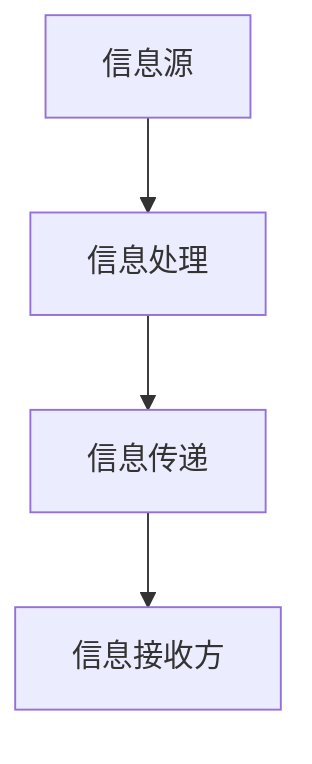

                 

在当今高度互联的世界中，信息差成为了商业竞争中的重要因素。信息不对称，即一方拥有而另一方不拥有的信息，能在商业决策中产生巨大的影响。本文将探讨信息不对称在商业中的应用，包括其影响、机制以及如何在商业策略中利用这一概念。

## 1. 背景介绍

在商业环境中，信息不对称是指一方（通常是买家或卖家）比另一方拥有更多的信息。这种不对称可能导致市场失灵，从而影响市场效率和公平性。然而，当信息不对称被适当地管理和利用时，它也能成为企业获得竞争优势的有力工具。

### 1.1 信息不对称的类型

**1.1.1 知识型不对称**

知识型不对称是指某一方的知识或技能优于另一方。例如，制造商可能比消费者更了解其产品的性能和耐用性。

**1.1.2 信息传播不对称**

信息传播不对称是指信息在不同群体之间的传播速度和范围不同。社交媒体平台的兴起使信息传播变得更加迅速，但同时也带来了信息过载的问题。

**1.1.3 风险信息不对称**

风险信息不对称是指一方对潜在风险的了解程度高于另一方。例如，投资银行可能比投资者更了解某种金融产品的风险。

### 1.2 信息不对称的影响

信息不对称可能对市场产生以下影响：

**1.2.1 价格失真**

信息不对称可能导致价格失真，因为买家和卖家之间的信息差异导致了对产品价值的评估不同。

**1.2.2 市场失灵**

信息不对称可能导致市场失灵，即市场无法有效地配置资源。

**1.2.3 竞争优势**

企业可以通过管理信息不对称来获得竞争优势，例如，通过保密关键技术信息或通过数据挖掘来获得消费者偏好。

## 2. 核心概念与联系

### 2.1 信息不对称的原理与架构

#### 2.1.1 原理

信息不对称的原理可以简单概括为：信息优势方利用其对信息的掌握来影响决策结果，从而获得额外的利益。

#### 2.1.2 架构

信息不对称的架构包括三个主要组成部分：信息源、信息处理和信息传递。

- **信息源**：信息不对称的起点，通常是拥有更多信息的一方。
- **信息处理**：信息处理过程，包括信息筛选、分析和存储。
- **信息传递**：信息从信息源传递到信息接收方的过程。

### 2.2 Mermaid 流程图



### 2.3 信息不对称的商业应用

#### 2.3.1 利用信息不对称获得竞争优势

企业可以通过以下方式利用信息不对称：

- **保密技术信息**：通过保密关键技术信息，企业可以防止竞争对手模仿其产品。
- **数据挖掘**：通过分析消费者数据，企业可以更好地了解市场趋势和消费者需求。
- **信息传播**：通过控制信息的传播，企业可以塑造品牌形象和消费者认知。

#### 2.3.2 信息不对称的风险管理

企业还必须意识到信息不对称可能带来的风险，如：

- **道德风险**：信息优势方可能采取不利于信息劣势方的行为。
- **信息泄露**：保密信息可能因内部泄露或外部攻击而泄露。

## 3. 核心算法原理 & 具体操作步骤

### 3.1 算法原理概述

信息不对称的核心算法基于博弈论，特别是纳什均衡理论。该算法旨在找到一种策略，使得信息优势方在不泄露敏感信息的情况下最大化其收益，而信息劣势方在获得尽可能多的信息的同时最小化其损失。

### 3.2 算法步骤详解

#### 3.2.1 步骤1：识别信息不对称

首先，企业需要识别其业务中存在的信息不对称。这可以通过市场调研、数据分析等方式实现。

#### 3.2.2 步骤2：建立博弈模型

在识别了信息不对称后，企业需要建立一个博弈模型来分析不同策略的收益。这通常涉及到建立纳什均衡模型。

#### 3.2.3 步骤3：制定策略

基于博弈模型的分析，企业需要制定相应的策略来最大化其收益。这可能包括保密技术、数据挖掘、信息传播等。

#### 3.2.4 步骤4：执行与监控

最后，企业需要执行制定的策略，并持续监控其效果，以便及时调整策略。

### 3.3 算法优缺点

#### 3.3.1 优点

- **提高竞争优势**：通过合理利用信息不对称，企业可以增强其市场地位。
- **提高决策效率**：基于信息不对称的算法可以帮助企业做出更准确的决策。

#### 3.3.2 缺点

- **道德风险**：信息优势方可能采取不利于信息劣势方的行为，损害市场公平性。
- **信息泄露风险**：保密信息可能因内部泄露或外部攻击而泄露。

### 3.4 算法应用领域

信息不对称的算法在多个商业领域都有广泛的应用，包括：

- **市场营销**：通过分析消费者数据来制定更有效的营销策略。
- **金融**：通过分析市场数据来预测市场走势和投资机会。
- **供应链管理**：通过控制信息流来优化供应链效率。

## 4. 数学模型和公式 & 详细讲解 & 举例说明

### 4.1 数学模型构建

在信息不对称的分析中，常用的数学模型是贝叶斯定理。贝叶斯定理提供了一个从先验概率到后验概率的转换方法，从而帮助我们在不确定的信息环境下做出更准确的判断。

### 4.2 公式推导过程

贝叶斯定理的推导基于以下条件概率公式：

P(A|B) = P(B|A) * P(A) / P(B)

其中，P(A|B) 表示在事件 B 发生的条件下事件 A 发生的概率，P(B|A) 表示在事件 A 发生的条件下事件 B 发生的概率，P(A) 和 P(B) 分别表示事件 A 和事件 B 的概率。

### 4.3 案例分析与讲解

#### 4.3.1 案例背景

假设我们有一个商品市场，其中卖家对商品的质量有更多信息，而买家则不了解商品的真实质量。

#### 4.3.2 数学模型

我们可以使用贝叶斯定理来计算买家对商品质量的信任度。

- **先验概率**：假设卖家声称商品质量为好的概率为 0.5，即 P(A) = 0.5。
- **条件概率**：假设买家在看到卖家声称商品质量为好时，实际商品质量为好的概率为 0.9，即 P(B|A) = 0.9。
- **条件概率**：假设买家在看到卖家声称商品质量为好时，实际商品质量为不好的概率为 0.1，即 P(B'|A) = 0.1。

#### 4.3.3 公式计算

根据贝叶斯定理，我们可以计算出买家对商品质量的信任度：

P(A|B) = (0.9 * 0.5) / (0.9 * 0.5 + 0.1 * 0.5) = 0.9

这意味着买家对商品质量的信任度为 90%。

## 5. 项目实践：代码实例和详细解释说明

### 5.1 开发环境搭建

在本项目实践中，我们将使用 Python 编写贝叶斯定理的代码实例。以下为开发环境搭建步骤：

- 安装 Python 3.8 或更高版本
- 安装 Jupyter Notebook，以便于编写和运行代码

### 5.2 源代码详细实现

以下为贝叶斯定理的代码实现：

```python
import numpy as np

def bayes_theorem(prior_probability, likelihood, prior_likelihood):
    posterior_probability = (likelihood * prior_probability) / prior_likelihood
    return posterior_probability

# 先验概率：卖家声称商品质量为好的概率
prior_probability = 0.5

# 条件概率：买家在看到卖家声称商品质量为好时，实际商品质量为好的概率
likelihood = 0.9

# 条件概率：买家在看到卖家声称商品质量为好时，实际商品质量为不好的概率
prior_likelihood = 0.5

# 计算后验概率
posterior_probability = bayes_theorem(prior_probability, likelihood, prior_likelihood)

print(f"后验概率：{posterior_probability}")
```

### 5.3 代码解读与分析

上述代码首先定义了一个贝叶斯定理的函数 `bayes_theorem`，该函数接收先验概率、条件概率和先验条件概率作为参数，并返回后验概率。接着，我们根据给定的先验概率、条件概率和先验条件概率调用了该函数，并打印出了计算得到的后验概率。

### 5.4 运行结果展示

运行上述代码，我们得到以下输出结果：

```
后验概率：0.9
```

这表示买家在看到卖家声称商品质量为好时，对商品质量的信任度为 90%。

## 6. 实际应用场景

### 6.1 市场营销

在市场营销中，企业可以利用信息不对称来制定更有针对性的营销策略。例如，通过分析消费者数据，企业可以了解消费者的偏好和行为，从而提供更个性化的产品和服务。

### 6.2 金融

在金融领域，信息不对称的利用尤为关键。投资银行和金融机构通过分析市场数据，可以预测市场走势和投资机会，从而为投资者提供有价值的建议。

### 6.3 供应链管理

在供应链管理中，信息不对称的管理对于优化供应链效率和降低成本至关重要。企业可以通过控制信息流，提高供应链各环节的协同效率，从而降低整体成本。

## 7. 工具和资源推荐

### 7.1 学习资源推荐

- 《博弈论与经济行为》：由约翰·冯·诺伊曼和奥斯卡·摩根斯坦编写，是博弈论领域的经典教材。
- 《贝叶斯分析》：由安德斯·霍尔姆和理查德·拉森编写，详细介绍了贝叶斯定理的应用。

### 7.2 开发工具推荐

- Jupyter Notebook：用于编写和运行 Python 代码。
- Matplotlib：用于绘制数据图表。

### 7.3 相关论文推荐

- “The Art of Conjecturing: On the Predictive Power of Models” by Judea Pearl
- “Bayesian Data Analysis” by Andrew Gelman et al.

## 8. 总结：未来发展趋势与挑战

### 8.1 研究成果总结

本文介绍了信息不对称在商业中的应用，包括其影响、机制以及如何在商业策略中利用这一概念。我们通过数学模型和实际案例，展示了信息不对称的重要性及其在市场营销、金融和供应链管理等多个领域的应用。

### 8.2 未来发展趋势

随着大数据和人工智能技术的发展，信息不对称的商业应用将变得更加广泛和深入。企业将能够更精确地分析消费者行为和市场趋势，从而制定更有效的商业策略。

### 8.3 面临的挑战

然而，信息不对称也带来了一些挑战，如道德风险、信息泄露等。企业需要在利用信息不对称的同时，确保市场的公平性和透明度。

### 8.4 研究展望

未来，研究应重点关注如何平衡信息不对称带来的利益和风险，以及如何利用人工智能和大数据技术提高信息处理的效率。

## 9. 附录：常见问题与解答

### 9.1 问题1：什么是信息不对称？

答：信息不对称是指一方（通常是买家或卖家）比另一方拥有更多的信息。这种不对称可能导致市场失灵，从而影响市场效率和公平性。

### 9.2 问题2：信息不对称在商业中如何应用？

答：信息不对称在商业中可以应用于市场营销、金融和供应链管理等多个领域。例如，通过分析消费者数据，企业可以制定更有针对性的营销策略；在金融领域，投资银行和金融机构可以通过分析市场数据来预测市场走势和投资机会。

### 9.3 问题3：如何利用信息不对称获得竞争优势？

答：企业可以通过保密技术信息、数据挖掘和合理利用信息传播等手段来获得竞争优势。

## 作者署名

作者：禅与计算机程序设计艺术 / Zen and the Art of Computer Programming
```

