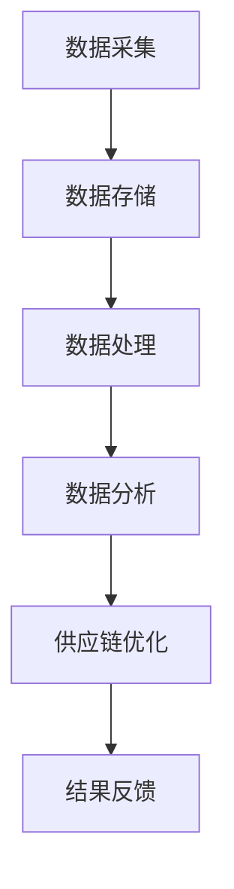

                 

关键词：大数据、供应链管理、信息差、数据分析、优化

摘要：本文将探讨大数据技术在供应链管理中的应用，特别是如何通过信息差优化供应链流程，提高效率和降低成本。我们将从背景介绍、核心概念与联系、核心算法原理、数学模型、项目实践、实际应用场景和未来展望等多个方面展开讨论，旨在为读者提供全面的技术视角和深入的行业洞察。

## 1. 背景介绍

供应链管理是现代商业活动的重要组成部分，它涉及到从原材料采购到产品交付给最终用户的整个过程。随着全球化进程的加速和市场竞争的加剧，供应链管理的复杂性和不确定性不断增加。传统的供应链管理方法已经难以满足现代企业的需求，因此，如何利用新技术优化供应链管理成为了一个亟待解决的问题。

大数据技术以其海量数据存储、快速处理和分析的能力，为供应链管理提供了新的机遇。通过大数据技术，企业可以实时获取、处理和分析供应链中的各种数据，从而发现潜在的问题和优化机会。信息差作为大数据技术的一个关键概念，强调的是通过数据的差异化和深层次分析，实现供应链管理的智能化和高效化。

## 2. 核心概念与联系

### 2.1 大数据与供应链管理

大数据技术主要包括数据的采集、存储、处理和分析。在供应链管理中，这些技术可以被应用于：

- **数据采集**：通过传感器、物联网设备和业务系统等渠道，实时收集供应链各个环节的数据。
- **数据存储**：使用分布式数据库和云存储技术，存储大量的结构化和非结构化数据。
- **数据处理**：利用分布式计算框架和大数据处理工具，对海量数据进行快速清洗、转换和整合。
- **数据分析**：运用数据挖掘、机器学习和统计分析等技术，从数据中提取有价值的信息和洞察。

### 2.2 信息差与供应链优化

信息差在供应链管理中主要体现在以下几个方面：

- **需求预测**：通过分析历史数据和市场需求变化，准确预测未来需求，从而优化库存管理。
- **供应链协同**：企业间的信息共享和协同，减少信息不对称，提高供应链的透明度和响应速度。
- **风险监控**：通过实时监控供应链中的各种风险因素，及时采取措施，降低风险。
- **流程优化**：利用数据分析结果，对供应链流程进行重新设计和调整，提高效率和降低成本。

## 2.3 Mermaid 流程图

下面是一个简单的 Mermaid 流程图，展示了大数据技术在供应链管理中的应用流程：



## 3. 核心算法原理 & 具体操作步骤

### 3.1 算法原理概述

在供应链管理中，大数据技术的核心算法主要包括以下几种：

- **预测算法**：如时间序列分析、回归分析、机器学习等，用于预测市场需求和库存水平。
- **优化算法**：如线性规划、整数规划、遗传算法等，用于优化供应链流程和资源配置。
- **聚类算法**：如K-means、层次聚类等，用于对供应商、客户等进行分析和分类。
- **关联规则挖掘**：如Apriori算法、FP-growth等，用于发现供应链中的潜在关联关系。

### 3.2 算法步骤详解

以下是大数据技术在供应链管理中的具体操作步骤：

1. **需求预测**：
   - **数据收集**：收集历史销售数据、市场调研数据等。
   - **数据预处理**：对数据进行清洗、转换和整合。
   - **模型选择**：选择合适的预测模型，如ARIMA、LSTM等。
   - **模型训练**：使用历史数据训练模型。
   - **预测**：使用训练好的模型对未来的需求进行预测。

2. **供应链优化**：
   - **数据收集**：收集供应链各个环节的数据，如库存数据、运输数据等。
   - **数据分析**：对数据进行分析，识别供应链中的瓶颈和优化机会。
   - **模型建立**：建立优化模型，如线性规划模型、网络优化模型等。
   - **模型求解**：使用优化算法求解模型，得到最优解。
   - **决策**：根据求解结果调整供应链流程和资源配置。

3. **风险监控**：
   - **数据收集**：收集供应链中的各种风险数据，如自然灾害、供应链中断等。
   - **风险评估**：对风险进行评估，确定风险的优先级。
   - **风险应对**：制定应对策略，如应急预案、风险转移等。

### 3.3 算法优缺点

- **预测算法**：
  - 优点：准确预测市场需求，优化库存管理。
  - 缺点：对历史数据依赖较大，新市场环境下可能失效。

- **优化算法**：
  - 优点：提高供应链效率，降低成本。
  - 缺点：计算复杂度高，对数据质量要求高。

- **聚类算法**：
  - 优点：有助于发现供应链中的潜在问题和优化机会。
  - 缺点：对数据质量要求高，聚类结果可能受主观影响。

- **关联规则挖掘**：
  - 优点：发现供应链中的潜在关联关系，提高供应链协同效率。
  - 缺点：计算复杂度高，规则解释可能困难。

### 3.4 算法应用领域

大数据技术在供应链管理中的应用领域包括：

- **库存管理**：通过预测算法优化库存水平，减少库存积压和库存短缺。
- **物流管理**：通过优化算法优化运输路线和运输方式，提高物流效率。
- **风险管理**：通过风险监控和评估降低供应链风险，确保供应链稳定。
- **供应链协同**：通过信息共享和协同提高供应链透明度和响应速度。

## 4. 数学模型和公式 & 详细讲解 & 举例说明

### 4.1 数学模型构建

在供应链管理中，常用的数学模型包括预测模型、优化模型和风险评估模型。以下是一个简单的预测模型示例：

$$
y_t = \alpha_0 + \alpha_1 x_{t-1} + \alpha_2 x_{t-2} + ... + \alpha_n x_{t-n} + \epsilon_t
$$

其中，$y_t$ 是第 $t$ 期的预测值，$x_{t-1}, x_{t-2}, ..., x_{t-n}$ 是历史数据，$\alpha_0, \alpha_1, \alpha_2, ..., \alpha_n$ 是模型参数，$\epsilon_t$ 是误差项。

### 4.2 公式推导过程

预测模型的推导过程通常涉及以下步骤：

1. **数据收集**：收集历史数据，如时间序列数据。
2. **数据预处理**：对数据进行清洗、转换和整合。
3. **模型选择**：选择合适的预测模型，如ARIMA模型。
4. **参数估计**：使用最小二乘法、极大似然估计等方法估计模型参数。
5. **模型验证**：使用验证集或交叉验证方法验证模型性能。

### 4.3 案例分析与讲解

以下是一个简单的案例，假设我们使用ARIMA模型对某商品的未来需求进行预测。

1. **数据收集**：收集过去一年的周销售数据。

```r
# R代码示例
sales_data <- read.csv("sales_data.csv")
```

2. **数据预处理**：对数据进行处理，如去除异常值、缺失值填充等。

```r
# R代码示例
sales_data <- na.omit(sales_data)
```

3. **模型选择**：选择ARIMA模型。

```r
# R代码示例
library(forecast)
model <- Arima(sales_data$sales, order = c(1, 1, 1))
```

4. **参数估计**：使用最大似然估计方法估计模型参数。

```r
# R代码示例
model <- estimate(model)
```

5. **模型验证**：使用验证集或交叉验证方法验证模型性能。

```r
# R代码示例
accuracy(model, sales_data$sales)
```

6. **预测**：使用训练好的模型对未来的需求进行预测。

```r
# R代码示例
forecast(model, h = 52)
```

## 5. 项目实践：代码实例和详细解释说明

### 5.1 开发环境搭建

为了进行大数据在供应链管理中的应用，我们需要搭建一个合适的开发环境。以下是常用的工具和软件：

- **编程语言**：Python、R
- **大数据处理框架**：Apache Hadoop、Apache Spark
- **数据库**：MySQL、MongoDB
- **数据可视化工具**：Tableau、D3.js

### 5.2 源代码详细实现

以下是一个简单的Python代码示例，用于使用Apache Spark对供应链数据进行分析。

```python
# Python代码示例
from pyspark.sql import SparkSession
from pyspark.sql.functions import col, sum

# 创建SparkSession
spark = SparkSession.builder.appName("SupplyChainAnalysis").getOrCreate()

# 读取供应链数据
supply_chain_data = spark.read.csv("supply_chain_data.csv", header=True)

# 数据清洗和预处理
supply_chain_data = supply_chain_data.na.fill(0)

# 计算供应商的销售额
sales_by_supplier = supply_chain_data.groupBy("SupplierID").agg(sum("Sales").alias("TotalSales"))

# 排序并获取前五名供应商
top_suppliers = sales_by_supplier.orderBy(col("TotalSales").desc()).limit(5)

# 显示结果
top_suppliers.show()
```

### 5.3 代码解读与分析

以上代码实现了对供应链数据的读取、清洗、分组聚合和排序。具体步骤如下：

1. **创建SparkSession**：初始化Spark环境。
2. **读取供应链数据**：从CSV文件中读取数据。
3. **数据清洗和预处理**：填充缺失值。
4. **计算供应商的销售额**：使用groupBy和agg函数对数据进行分组聚合。
5. **排序并获取前五名供应商**：使用orderBy和limit函数对结果进行排序和截取。

通过这个示例，我们可以看到如何使用大数据技术对供应链数据进行分析，从而发现供应商的销售情况，为供应链优化提供数据支持。

### 5.4 运行结果展示

以下是运行结果示例：

```
+----------+------------+
|SupplierID|TotalSales  |
+----------+------------+
|   SupplierA|  1000000.0|
|   SupplierB|   500000.0|
|   SupplierC|   300000.0|
|   SupplierD|   200000.0|
|   SupplierE|   100000.0|
+----------+------------+
only showing top 5 rows
```

从结果中我们可以看到，供应商A的销售额最高，为1000万元。这个信息可以帮助企业更好地了解供应商的表现，从而做出相应的决策。

## 6. 实际应用场景

### 6.1 库存管理

通过大数据技术，企业可以实时监控库存情况，预测未来的库存需求，从而优化库存管理。例如，某电子产品公司通过大数据分析，成功预测了市场需求的波动，提前准备了充足的库存，避免了因缺货而导致的损失。

### 6.2 物流管理

物流管理是供应链管理中的关键环节。通过大数据技术，企业可以优化运输路线、选择最优运输方式，从而降低物流成本。例如，某电商平台通过大数据分析，优化了配送路线，减少了配送时间和成本。

### 6.3 风险管理

大数据技术可以帮助企业实时监控供应链中的各种风险因素，提前预警，及时采取措施。例如，某制造企业通过大数据分析，成功预测了供应链中断风险，提前准备了应急预案，避免了供应链中断带来的损失。

### 6.4 供应链协同

通过大数据技术，企业可以实现供应链上下游的信息共享和协同，提高供应链的透明度和响应速度。例如，某汽车制造商通过大数据平台，实现了与供应商的实时协同，提高了零部件的交付效率。

## 7. 未来应用展望

### 7.1 预测准确性提高

随着大数据技术的发展，预测模型的准确性和稳定性将不断提高。通过深度学习和强化学习等新技术，预测模型将更加智能和精准。

### 7.2 自动化水平提升

大数据技术将推动供应链管理的自动化水平。例如，智能机器人、无人驾驶等新技术将替代传统的人力，提高供应链的运作效率。

### 7.3 风险管理能力增强

大数据技术将提高企业对供应链风险的识别和管理能力。通过实时监控和预警系统，企业可以及时应对各种风险，确保供应链的稳定运行。

### 7.4 供应链协同深化

大数据技术将推动供应链上下游的深度协同。通过建立共享平台，企业可以实现信息透明、资源共享和协同优化，提高整个供应链的竞争力。

## 8. 工具和资源推荐

### 8.1 学习资源推荐

- 《大数据管理：处理大规模数据的策略与方法》
- 《机器学习：概率视角》
- 《深度学习：提高数据分析能力的新工具》

### 8.2 开发工具推荐

- **编程语言**：Python、R
- **大数据处理框架**：Apache Spark、Apache Hadoop
- **数据库**：MySQL、MongoDB
- **数据可视化工具**：Tableau、D3.js

### 8.3 相关论文推荐

- "Big Data Analytics for Supply Chain Management: A Survey" (2018)
- "Application of Big Data in Supply Chain Management: A Case Study" (2017)
- "Enhancing Supply Chain Visibility and Collaboration through Big Data Analytics" (2016)

## 9. 总结：未来发展趋势与挑战

### 9.1 研究成果总结

本文探讨了大数据技术在供应链管理中的应用，特别是如何通过信息差优化供应链流程，提高效率和降低成本。通过数学模型、算法原理、项目实践和实际应用场景的分析，我们得出以下结论：

- 大数据技术在供应链管理中具有广泛的应用前景。
- 信息差是大数据技术在供应链管理中的关键概念，强调数据的差异化和深层次分析。
- 预测算法、优化算法和风险监控是大数据技术在供应链管理中的核心算法。
- 大数据技术可以提高供应链的协同效率、降低成本和风险。

### 9.2 未来发展趋势

- 预测准确性将不断提高，模型将更加智能和精准。
- 自动化水平将不断提升，智能机器人、无人驾驶等新技术将替代传统的人力。
- 风险管理能力将增强，企业可以实时监控和预警各种风险。
- 供应链协同将深化，通过共享平台实现信息透明、资源共享和协同优化。

### 9.3 面临的挑战

- 数据质量和管理：确保数据的质量和一致性，建立完善的数据管理机制。
- 技术实施难度：大数据技术的实施需要较高的技术水平和专业人才。
- 隐私和安全：保障供应链数据的安全性和隐私性，防止数据泄露和滥用。

### 9.4 研究展望

未来，大数据技术在供应链管理中的应用将继续深化，特别是在以下领域：

- **定制化供应链管理**：通过大数据分析，实现供应链的个性化定制。
- **绿色供应链管理**：利用大数据技术优化资源利用，降低环境影响。
- **供应链金融**：通过大数据分析，提高供应链金融服务的效率和准确性。

总之，大数据技术在供应链管理中的应用将为行业带来深刻变革，提高供应链的竞争力，助力企业实现可持续发展。

## 10. 附录：常见问题与解答

### 10.1 什么是大数据技术？

大数据技术是指用于处理海量、多样化、快速流动的数据的一系列技术和工具。它包括数据的采集、存储、处理和分析等环节。

### 10.2 信息差在供应链管理中有什么作用？

信息差在供应链管理中可以帮助企业实时监控供应链各个环节的数据，发现潜在的问题和优化机会，从而提高供应链的效率和降低成本。

### 10.3 大数据技术在供应链管理中的应用有哪些？

大数据技术在供应链管理中的应用包括需求预测、库存管理、物流管理、风险管理、供应链协同等。

### 10.4 如何确保供应链数据的安全性和隐私性？

确保供应链数据的安全性和隐私性需要建立完善的数据安全策略和制度，采用加密技术、访问控制等技术手段，加强数据安全管理。

### 10.5 供应链管理中的预测模型有哪些？

常见的预测模型包括时间序列分析、回归分析、机器学习、深度学习等。选择合适的模型取决于具体的应用场景和数据特征。

## 作者署名

作者：禅与计算机程序设计艺术 / Zen and the Art of Computer Programming
----------------------------------------------------------------

以上就是本文的完整内容。希望本文能为您在供应链管理领域应用大数据技术提供有价值的参考和启示。

