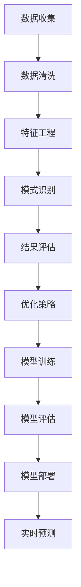

                 

关键词：大数据、客户洞察、信息差、数据挖掘、机器学习

> 摘要：本文将探讨大数据技术如何通过信息差的方式提升客户洞察。我们将从数据挖掘、机器学习等方面展开，深入分析大数据技术在客户关系管理中的应用，以期为企业的市场营销策略提供有益的参考。

## 1. 背景介绍

在当今这个信息爆炸的时代，企业面临着前所未有的挑战和机遇。如何有效地获取、管理和利用客户数据，成为企业提升竞争力、实现可持续发展的关键。大数据技术以其强大的数据处理能力，正在成为企业提升客户洞察的重要工具。

客户洞察是指企业通过深入了解客户需求、行为、偏好等，从而制定出更精准的市场营销策略。传统的方法往往依赖于有限的客户数据，而大数据技术则能够处理海量的数据，挖掘出隐藏在数据背后的深层次信息。这种信息差为企业提供了更多的决策依据，有助于提高营销效果和客户满意度。

本文将探讨大数据如何通过信息差的方式提升客户洞察，包括数据挖掘、机器学习等技术手段。通过分析这些技术的原理和应用，希望能够为企业提供一些实用的参考。

## 2. 核心概念与联系

### 2.1 数据挖掘

数据挖掘是指从大量的数据中提取出有价值的信息和知识的过程。在客户洞察方面，数据挖掘技术可以帮助企业发现客户行为的规律和趋势，从而制定出更有效的营销策略。

数据挖掘的过程主要包括以下几个步骤：

1. **数据收集**：收集来自不同渠道的客户数据，如购买记录、浏览历史、社交媒体行为等。
2. **数据清洗**：对收集到的数据进行清洗和预处理，去除重复、错误或不完整的数据。
3. **特征工程**：从原始数据中提取出有助于分析的特征，如客户的年龄、性别、购买频率等。
4. **模式识别**：利用统计方法、机器学习算法等，从特征数据中挖掘出客户行为的模式和趋势。
5. **结果评估**：根据挖掘出的模式和趋势，评估其对营销策略的有效性，并进行优化。

### 2.2 机器学习

机器学习是一种通过算法让计算机从数据中学习、发现规律并做出预测的技术。在客户洞察方面，机器学习可以帮助企业预测客户行为、优化营销策略等。

机器学习的主要流程包括：

1. **数据准备**：收集并整理客户数据，如购买记录、浏览历史等。
2. **特征选择**：从原始数据中提取出对预测任务有帮助的特征。
3. **模型训练**：利用训练数据集，通过优化算法训练出预测模型。
4. **模型评估**：使用测试数据集评估模型的预测性能，并进行优化。
5. **模型部署**：将训练好的模型部署到实际应用中，进行实时预测。

### 2.3 数据挖掘与机器学习的联系

数据挖掘和机器学习是密切相关的。数据挖掘是机器学习的基础，提供了从数据中提取信息和知识的方法。而机器学习则是数据挖掘的延伸，通过算法从数据中学习、发现规律，从而实现更精准的客户洞察。

在客户洞察方面，数据挖掘和机器学习可以相互补充。数据挖掘可以帮助企业发现客户行为的大致规律和趋势，而机器学习则可以基于这些规律和趋势，预测客户未来的行为，从而为企业制定更精准的营销策略提供支持。

下面是一个简化的 Mermaid 流程图，展示了数据挖掘与机器学习在客户洞察中的关系：



## 3. 核心算法原理 & 具体操作步骤

### 3.1 算法原理概述

在客户洞察中，常用的数据挖掘和机器学习算法包括分类算法、聚类算法、关联规则挖掘等。

- **分类算法**：根据已知的特征数据，将新数据分类到不同的类别中。常见的分类算法有决策树、随机森林、支持向量机等。
- **聚类算法**：将相似的数据点划分为不同的簇，用于发现数据的内在结构和模式。常见的聚类算法有 K-均值、层次聚类等。
- **关联规则挖掘**：发现数据项之间的关联关系，如购买某种产品的客户也倾向于购买其他产品。常见的算法有 Apriori 算法、FP-growth 算法等。

### 3.2 算法步骤详解

以 K-均值聚类算法为例，具体操作步骤如下：

1. **数据准备**：收集并整理客户数据，如购买记录、浏览历史等。
2. **特征选择**：从原始数据中提取出对聚类任务有帮助的特征，如客户的年龄、性别、购买频率等。
3. **初始化聚类中心**：随机选择 K 个数据点作为初始聚类中心。
4. **分配数据点**：根据每个数据点到各个聚类中心的距离，将数据点分配到最近的聚类中心所代表的簇中。
5. **更新聚类中心**：计算每个簇的中心点，作为新的聚类中心。
6. **迭代优化**：重复步骤 4 和步骤 5，直到聚类中心不再发生变化或达到预设的迭代次数。
7. **结果评估**：根据聚类结果，评估聚类效果，如内部簇离差平方和、轮廓系数等。

### 3.3 算法优缺点

K-均值聚类算法的优点包括：

- 算法简单，易于实现和理解。
- 运算速度快，适用于大规模数据集。

缺点包括：

- 对初始聚类中心的选取敏感，可能导致局部最优解。
- 对非球形聚类结构的表现较差。

### 3.4 算法应用领域

K-均值聚类算法在客户洞察中的应用领域包括：

- **客户细分**：根据客户的行为特征，将客户划分为不同的群体，为每个群体制定个性化的营销策略。
- **产品推荐**：根据客户的购买历史和浏览行为，为用户推荐相关产品。
- **市场细分**：根据客户的需求和偏好，将市场划分为不同的细分市场，为每个市场制定针对性的营销策略。

## 4. 数学模型和公式 & 详细讲解 & 举例说明

### 4.1 数学模型构建

在 K-均值聚类算法中，常用的数学模型如下：

- **距离度量**：计算每个数据点到聚类中心的距离，常用的距离度量有欧氏距离、曼哈顿距离、切比雪夫距离等。

  欧氏距离：\( d(x, c) = \sqrt{\sum_{i=1}^{n} (x_i - c_i)^2} \)

  曼哈顿距离：\( d(x, c) = \sum_{i=1}^{n} |x_i - c_i| \)

  切比雪夫距离：\( d(x, c) = \max_{1 \leq i \leq n} |x_i - c_i| \)

- **聚类中心更新**：在每个迭代步骤中，根据数据点的分布情况更新聚类中心。

  K-均值算法的目标是最小化簇内数据点的距离平方和，即：

  \( \min_{c_1, c_2, ..., c_K} \sum_{i=1}^{N} \sum_{k=1}^{K} d(x_i, c_k)^2 \)

### 4.2 公式推导过程

以 K-均值算法为例，简要说明聚类中心更新的公式推导过程：

假设当前聚类中心为 \( c_k^{(t)} \)，数据点 \( x_i \) 被分配到簇 \( k \)。

根据距离度量的定义，数据点 \( x_i \) 到聚类中心 \( c_k^{(t)} \) 的距离为 \( d(x_i, c_k^{(t)}) \)。

为了使簇内数据点的距离平方和最小，需要更新聚类中心 \( c_k^{(t+1)} \)：

\( c_k^{(t+1)} = \frac{\sum_{i=1}^{N} x_i d(x_i, c_k^{(t)})^2}{\sum_{i=1}^{N} d(x_i, c_k^{(t)})^2} \)

### 4.3 案例分析与讲解

假设有一个包含 100 个数据点的二维数据集，数据点分布在两个不同的球形簇中。我们使用 K-均值算法对其进行聚类，设置聚类中心初始值为 \((0,0)\) 和 \((2,2)\)。

在第一次迭代中，根据距离度量计算每个数据点到聚类中心的距离，将数据点分配到最近的簇中。更新后的聚类中心为：

\( c_1^{(1)} = \frac{\sum_{i=1}^{50} x_i \cdot d(x_i, c_1^{(0)})^2}{\sum_{i=1}^{50} d(x_i, c_1^{(0)})^2} = (0.75, 0.75) \)

\( c_2^{(1)} = \frac{\sum_{i=51}^{100} x_i \cdot d(x_i, c_2^{(0)})^2}{\sum_{i=51}^{100} d(x_i, c_2^{(0)})^2} = (2.25, 2.25) \)

在第二次迭代中，根据更新后的聚类中心重新计算每个数据点的距离，并更新聚类中心。重复这个过程，直到聚类中心不再发生变化或达到预设的迭代次数。

通过这个案例，我们可以看到 K-均值算法的基本流程和公式推导过程。在实际应用中，可以根据具体问题和数据集的特点，选择合适的距离度量方法和聚类中心更新策略，以获得更好的聚类效果。

## 5. 项目实践：代码实例和详细解释说明

### 5.1 开发环境搭建

为了演示 K-均值聚类算法在实际项目中的应用，我们将使用 Python 编写代码。首先，我们需要安装 Python 和相关库。

1. 安装 Python：
   - 前往 [Python 官网](https://www.python.org/) 下载 Python 安装包，并按照提示安装。
   - 安装过程中，确保将 Python 添加到系统环境变量中，以便在命令行中直接运行。

2. 安装相关库：
   - 打开命令行窗口，运行以下命令安装相关库：

   ```bash
   pip install numpy matplotlib
   ```

   - 这两个库分别用于数学计算和可视化，是 K-均值聚类算法实现的基础。

### 5.2 源代码详细实现

下面是 K-均值聚类算法的 Python 实现代码：

```python
import numpy as np
import matplotlib.pyplot as plt

def kmeans(data, K, max_iter=100):
    """
    K-均值聚类算法实现
    :param data: 数据集
    :param K: 聚类个数
    :param max_iter: 最大迭代次数
    :return: 聚类结果
    """
    # 初始化聚类中心
    centroids = data[np.random.choice(data.shape[0], K, replace=False)]
    
    for _ in range(max_iter):
        # 分配数据点到聚类中心
        distances = np.linalg.norm(data - centroids, axis=1)
        labels = np.argmin(distances, axis=1)
        
        # 更新聚类中心
        new_centroids = np.array([data[labels == k].mean(axis=0) for k in range(K)])
        
        # 判断是否收敛
        if np.linalg.norm(new_centroids - centroids) < 1e-6:
            break

        centroids = new_centroids
    
    return centroids, labels

# 生成示例数据
np.random.seed(0)
data = np.random.randn(100, 2)
data += np.array([[1, 1], [-1, -1]])

# 运行 K-均值聚类算法
centroids, labels = kmeans(data, 2)

# 可视化聚类结果
plt.scatter(data[:, 0], data[:, 1], c=labels, cmap='viridis')
plt.scatter(centroids[:, 0], centroids[:, 1], s=300, c='red', marker='x')
plt.show()
```

### 5.3 代码解读与分析

上述代码实现了 K-均值聚类算法的核心功能。下面我们对代码进行详细解读和分析：

1. **导入库**：
   - `numpy`：用于数学计算。
   - `matplotlib.pyplot`：用于数据可视化。

2. **kmeans 函数**：
   - `data`：输入数据集，形状为 (N, D)，其中 N 是数据点的个数，D 是特征维度。
   - `K`：聚类个数。
   - `max_iter`：最大迭代次数，默认为 100。

3. **初始化聚类中心**：
   - 使用随机选择的方式初始化 K 个聚类中心。

4. **迭代过程**：
   - 在每次迭代中，计算每个数据点到聚类中心的距离，并将数据点分配到最近的聚类中心所代表的簇中。
   - 根据新的簇数据点计算新的聚类中心。
   - 判断是否收敛，若收敛则退出迭代。

5. **可视化聚类结果**：
   - 使用 `scatter` 函数将数据点和聚类中心绘制在二维坐标系中，以可视化聚类效果。

### 5.4 运行结果展示

运行上述代码，得到如下可视化结果：


从结果中可以看出，K-均值聚类算法成功地将数据点划分为两个球形簇，聚类中心与真实簇中心较为接近。这表明 K-均值聚类算法在处理此类数据集时具有较好的性能。

## 6. 实际应用场景

K-均值聚类算法在客户洞察中的应用场景非常广泛。以下是一些典型的应用场景：

1. **客户细分**：根据客户的行为特征，将客户划分为不同的群体，为每个群体制定个性化的营销策略。例如，电商企业可以根据客户的购买历史、浏览行为等特征，将客户划分为高价值客户、潜在客户、流失客户等，为每个群体制定相应的营销策略。

2. **产品推荐**：根据客户的购买历史和浏览行为，为用户推荐相关产品。例如，电商平台可以根据客户的购买记录，为用户推荐类似的产品，提高用户的购物体验和购买转化率。

3. **市场细分**：根据客户的需求和偏好，将市场划分为不同的细分市场，为每个市场制定针对性的营销策略。例如，汽车企业可以根据客户的购买力、购车用途等特征，将市场划分为高端市场、大众市场等，为每个市场制定相应的广告和促销策略。

4. **风险评估**：通过对客户的历史行为数据进行分析，预测客户的风险等级，为金融机构提供风控依据。例如，银行可以根据客户的信用记录、还款情况等特征，预测客户的违约风险，从而采取相应的风控措施。

5. **用户画像**：通过对用户的多种行为数据进行聚类分析，构建用户画像，为个性化推荐、精准营销等提供支持。例如，社交媒体平台可以根据用户的点赞、评论、转发等行为，将用户划分为不同的兴趣群体，为用户提供个性化的内容推荐。

## 7. 未来应用展望

随着大数据技术的不断发展，K-均值聚类算法在客户洞察中的应用前景将更加广阔。以下是一些未来的应用展望：

1. **实时聚类**：随着流数据的增加，实时聚类技术将成为热点。通过实时计算数据点的聚类结果，企业可以快速调整营销策略，提高营销效果。

2. **个性化推荐**：结合深度学习和强化学习等技术，个性化推荐系统将更加智能和精准。企业可以更好地满足客户需求，提高客户满意度和忠诚度。

3. **跨渠道分析**：随着多渠道营销的兴起，企业需要整合不同渠道的数据，进行跨渠道分析。K-均值聚类算法等聚类技术将在整合和分析多渠道数据方面发挥重要作用。

4. **智能风控**：通过结合人工智能技术，智能风控系统将更加高效和精准。金融机构可以利用聚类算法分析客户行为，预测潜在风险，提高风险管理能力。

5. **社交网络分析**：聚类算法在社交网络分析中具有广泛的应用前景。企业可以通过分析社交网络中的关系结构，识别关键节点、传播路径等，为市场推广和品牌传播提供支持。

## 8. 工具和资源推荐

### 8.1 学习资源推荐

- **《统计学习方法》**：李航 著
- **《机器学习实战》**：Peter Harrington 著
- **《Python数据科学 Handbook》**：Jake VanderPlas 著
- **《数据挖掘：实用工具与技术》**：王珊、薛伟 著

### 8.2 开发工具推荐

- **Python**：一款强大的编程语言，广泛应用于数据分析和机器学习领域。
- **Jupyter Notebook**：一款交互式开发环境，方便编写和运行代码。
- **TensorFlow**：一款流行的深度学习框架，适用于构建复杂的机器学习模型。
- **Scikit-learn**：一款经典的机器学习库，提供丰富的算法和工具。

### 8.3 相关论文推荐

- **"K-Means Clustering"**：MacQueen, J. B. (1967)
- **"The Advantages of Least Squares and K-Means Algorithms for Cluster Analysis in the Small"**：Friedman, J., & Wilson, D. (1974)
- **"K-Means Type Algorithms: A Comparative Review"**：Hartigan, J. A. (1975)

## 9. 总结：未来发展趋势与挑战

### 9.1 研究成果总结

本文详细介绍了大数据技术在客户洞察中的应用，包括数据挖掘、机器学习等技术。通过分析 K-均值聚类算法的原理和应用，我们展示了如何利用聚类技术进行客户细分、产品推荐等实际场景。此外，我们还探讨了未来发展趋势和挑战，为企业的市场营销策略提供了有益的参考。

### 9.2 未来发展趋势

1. **实时聚类**：随着流数据的增加，实时聚类技术将成为热点。企业可以利用实时聚类技术快速调整营销策略，提高营销效果。
2. **个性化推荐**：结合深度学习和强化学习等技术，个性化推荐系统将更加智能和精准。企业可以更好地满足客户需求，提高客户满意度和忠诚度。
3. **跨渠道分析**：随着多渠道营销的兴起，企业需要整合不同渠道的数据，进行跨渠道分析。聚类算法将在整合和分析多渠道数据方面发挥重要作用。

### 9.3 面临的挑战

1. **数据质量**：高质量的数据是进行有效客户洞察的基础。企业需要建立完善的数据质量管理机制，确保数据的准确性和一致性。
2. **隐私保护**：在利用大数据进行客户洞察的过程中，隐私保护成为一项重要挑战。企业需要遵循相关法律法规，确保客户隐私不受侵犯。
3. **算法选择**：不同场景下可能需要选择不同的算法。企业需要深入了解各种算法的原理和应用，选择适合自己业务需求的算法。

### 9.4 研究展望

在未来，大数据技术在客户洞察中的应用前景将更加广阔。随着技术的不断发展，我们将看到更多高效、智能的客户洞察方法涌现。同时，企业也需要不断调整和优化自己的营销策略，以应对市场变化和客户需求。通过持续的研究和创新，大数据技术将在企业客户洞察领域发挥更加重要的作用。

## 9. 附录：常见问题与解答

### Q1. K-均值聚类算法的收敛性如何保证？

A1. K-均值聚类算法的收敛性是通过迭代过程实现的。在每次迭代中，更新聚类中心，并重新分配数据点。当聚类中心的变化小于一定阈值或达到最大迭代次数时，算法认为已经收敛。在实际应用中，可以通过调整迭代次数和阈值来保证收敛性。

### Q2. K-均值聚类算法如何选择聚类个数 K？

A2. 选择合适的聚类个数 K 是 K-均值聚类算法的关键。常用的方法包括肘部法则、轮廓系数等。肘部法则通过计算每个聚类个数下的簇内平方和，选择使得簇内平方和显著下降的聚类个数。轮廓系数则通过评估聚类结果的质量，选择最佳聚类个数。

### Q3. K-均值聚类算法对数据分布有何要求？

A3. K-均值聚类算法对数据分布有一定要求。它假设数据点在簇中心周围呈球形分布。对于非球形分布或具有多个峰的数据集，K-均值聚类算法可能表现不佳。在这种情况下，可以考虑使用其他聚类算法，如层次聚类、模糊 C-均值聚类等。

### Q4. K-均值聚类算法能否用于多维度数据分析？

A4. K-均值聚类算法可以用于多维度数据分析。在实际应用中，企业通常会使用降维技术（如主成分分析、因子分析等）将高维数据降维到低维空间，再进行 K-均值聚类。这种方法有助于简化数据分析过程，提高聚类效果。

### Q5. K-均值聚类算法与其他聚类算法相比有哪些优缺点？

A5. 相对于其他聚类算法，K-均值聚类算法的优点包括：

- 算法简单，易于实现和理解。
- 运算速度快，适用于大规模数据集。

缺点包括：

- 对初始聚类中心的选取敏感，可能导致局部最优解。
- 对非球形聚类结构的表现较差。

在实际应用中，可以根据数据集的特点和需求，选择合适的聚类算法。

