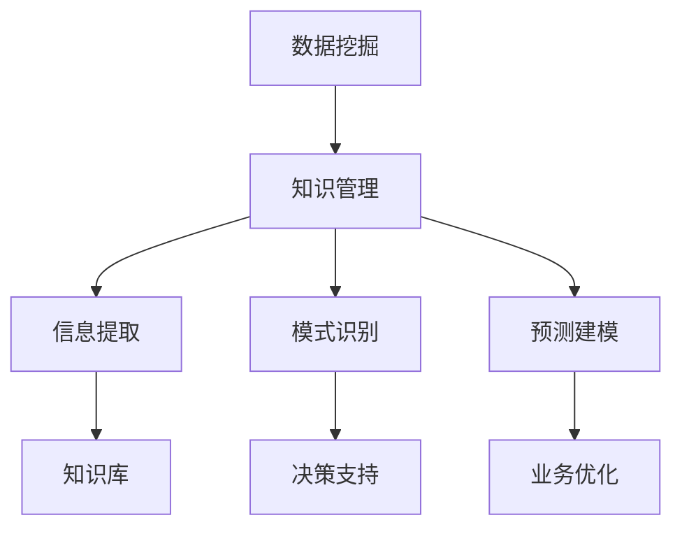
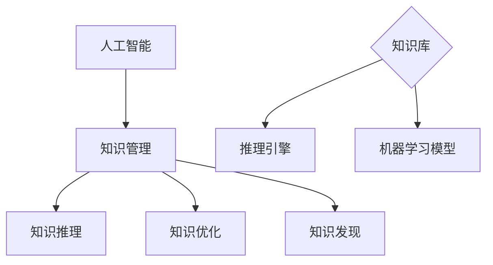
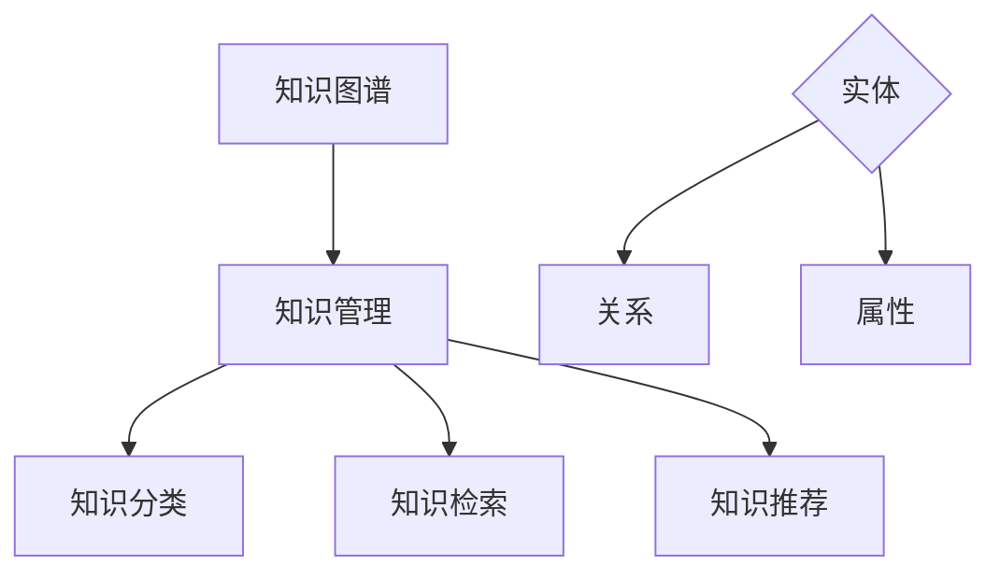

                 

关键词：信息差、大数据、知识管理、信息不对称、数据挖掘、人工智能、机器学习、数据可视化、知识图谱、数据治理、信息共享、数据分析、预测建模。

## 摘要

在信息技术迅猛发展的今天，大数据已成为各行各业的重要资产。知识管理作为企业发展的核心能力，面临着信息差所带来的挑战。本文将从信息差的概念出发，探讨大数据如何通过数据挖掘、人工智能和知识图谱等技术，打破信息壁垒，提升知识管理的效果。通过分析数据治理、信息共享和预测建模等实际应用场景，本文旨在为企业和组织提供大数据提升知识管理的新思路。

## 1. 背景介绍

### 1.1 信息差的定义

信息差指的是信息在不同个体、群体或组织间的差异。这种差异可能源于信息的获取、处理、存储和传播能力的不均衡。信息差的存在使得某些个体或组织能够获得相对于其他个体或组织更多的优势。

### 1.2 知识管理的概念

知识管理是指通过系统地收集、存储、共享和应用知识，以提高组织绩效和创新能力的过程。知识管理涵盖知识的创造、传播、应用和保护，是组织持续发展的关键。

### 1.3 大数据与知识管理的关系

大数据作为一种大规模、多样化、高速生成和复杂结构的数据集合，为知识管理带来了新的机遇和挑战。大数据技术的应用能够提高知识的获取、处理和利用效率，从而提升知识管理的整体效果。

## 2. 核心概念与联系

### 2.1 数据挖掘与知识管理

数据挖掘是从大量数据中提取有价值信息的过程。数据挖掘技术可以识别数据中的规律、趋势和模式，从而为知识管理提供支持。



### 2.2 人工智能与知识管理

人工智能（AI）技术通过模拟人类智能，能够实现自动化决策、智能分析和自适应学习。在知识管理中，人工智能可以应用于知识发现、知识推理和知识优化。



### 2.3 知识图谱与知识管理

知识图谱是一种结构化知识表示方法，通过节点和边来描述实体及其关系。知识图谱在知识管理中可以用于知识分类、知识检索和知识推荐。



## 3. 核心算法原理 & 具体操作步骤

### 3.1 算法原理概述

大数据提升知识管理的关键算法包括数据挖掘算法、机器学习算法和知识图谱算法。这些算法的基本原理如下：

- **数据挖掘算法**：基于统计学、模式识别和机器学习等方法，从大量数据中提取有价值的信息。
- **机器学习算法**：通过学习历史数据中的规律，自动识别数据中的模式，实现自动化决策和智能分析。
- **知识图谱算法**：构建实体及其关系的结构化知识表示，实现知识的分类、检索和推荐。

### 3.2 算法步骤详解

#### 3.2.1 数据挖掘算法步骤

1. 数据预处理：包括数据清洗、数据转换和数据归一化。
2. 特征选择：根据业务需求选择对知识管理有重要影响的数据特征。
3. 模式识别：使用统计学方法和机器学习算法识别数据中的规律和模式。
4. 知识提取：将识别出的模式转化为结构化知识，存储在知识库中。

#### 3.2.2 机器学习算法步骤

1. 数据收集：收集历史数据，包括业务数据、用户数据和外部数据。
2. 特征工程：选择对业务有重要影响的数据特征，并进行数据预处理。
3. 模型训练：使用训练数据集训练机器学习模型，优化模型参数。
4. 模型评估：使用测试数据集评估模型效果，调整模型参数。
5. 模型应用：将训练好的模型应用于实际业务场景，实现自动化决策和智能分析。

#### 3.2.3 知识图谱算法步骤

1. 数据采集：从各种数据源收集实体和关系数据。
2. 数据预处理：对采集到的数据进行清洗、去重和格式转换。
3. 实体关系建模：使用实体和关系构建知识图谱，定义实体属性和关系类型。
4. 知识图谱可视化：使用可视化工具展示知识图谱，帮助用户理解和管理知识。
5. 知识查询与推荐：根据用户需求查询知识图谱，提供个性化知识推荐。

### 3.3 算法优缺点

- **数据挖掘算法**：优点是能够从大量数据中发现有价值的信息，缺点是对数据质量和特征选择有较高要求。
- **机器学习算法**：优点是实现自动化决策和智能分析，缺点是训练时间较长，对数据量有一定要求。
- **知识图谱算法**：优点是实现知识的结构化表示和高效检索，缺点是构建和维护成本较高。

### 3.4 算法应用领域

- **数据挖掘算法**：在金融、医疗、电商等领域广泛用于风险控制、疾病预测和个性化推荐。
- **机器学习算法**：在自动驾驶、智能语音、图像识别等领域发挥重要作用。
- **知识图谱算法**：在搜索引擎、推荐系统、知识库构建等领域具有广泛应用。

## 4. 数学模型和公式 & 详细讲解 & 举例说明

### 4.1 数学模型构建

在知识管理中，常用的数学模型包括回归模型、分类模型和聚类模型。

#### 回归模型

回归模型用于预测连续变量，如销售额、温度等。常见的回归模型有线性回归、多项式回归和广义线性回归。

$$y = \beta_0 + \beta_1x_1 + \beta_2x_2 + ... + \beta_nx_n$$

其中，$y$ 是预测变量，$x_1, x_2, ..., x_n$ 是自变量，$\beta_0, \beta_1, ..., \beta_n$ 是模型参数。

#### 分类模型

分类模型用于预测离散变量，如用户购买行为、疾病诊断等。常见的分类模型有逻辑回归、支持向量机和决策树。

$$P(y=1) = \frac{1}{1 + e^{-(\beta_0 + \beta_1x_1 + \beta_2x_2 + ... + \beta_nx_n)}}$$

其中，$y$ 是预测变量，$x_1, x_2, ..., x_n$ 是自变量，$\beta_0, \beta_1, ..., \beta_n$ 是模型参数。

#### 聚类模型

聚类模型用于将数据划分为多个类别，如用户分群、市场细分等。常见的聚类模型有K均值聚类、层次聚类和密度聚类。

$$C_j = \{x \in X | d(x, c_j) \leq \epsilon\}$$

其中，$C_j$ 是第 $j$ 个聚类类别，$x$ 是数据点，$c_j$ 是聚类中心，$d(x, c_j)$ 是欧几里得距离，$\epsilon$ 是聚类半径。

### 4.2 公式推导过程

以线性回归模型为例，推导回归系数 $\beta_1$ 的计算公式。

$$y_i = \beta_0 + \beta_1x_i + \epsilon_i$$

其中，$y_i$ 是第 $i$ 个样本的因变量，$x_i$ 是第 $i$ 个样本的自变量，$\epsilon_i$ 是随机误差。

对上述方程两边同时求和，得到：

$$\sum_{i=1}^{n} y_i = \beta_0\sum_{i=1}^{n} 1 + \beta_1\sum_{i=1}^{n} x_i + \sum_{i=1}^{n} \epsilon_i$$

由于 $\sum_{i=1}^{n} 1 = n$，$\sum_{i=1}^{n} \epsilon_i$ 是一个随机变量，我们希望消除随机误差的影响。因此，对上述方程两边同时减去 $\sum_{i=1}^{n} \epsilon_i$，得到：

$$\sum_{i=1}^{n} y_i - \sum_{i=1}^{n} \epsilon_i = \beta_0n + \beta_1\sum_{i=1}^{n} x_i$$

再对上述方程两边同时除以 $n$，得到：

$$\bar{y} - \bar{\epsilon} = \beta_0 + \beta_1\bar{x}$$

其中，$\bar{y} = \frac{1}{n}\sum_{i=1}^{n} y_i$ 是因变量的样本均值，$\bar{x} = \frac{1}{n}\sum_{i=1}^{n} x_i$ 是自变量的样本均值。

由于 $\bar{\epsilon} = 0$（假设随机误差的期望为0），所以得到：

$$\bar{y} = \beta_0 + \beta_1\bar{x}$$

对上述方程两边同时减去 $\beta_0$，得到：

$$\beta_1\bar{x} = \bar{y} - \beta_0$$

最后，将 $\beta_0$ 替换为 $\beta_0 = \bar{y} - \beta_1\bar{x}$，得到：

$$\beta_1 = \frac{\sum_{i=1}^{n} (y_i - \bar{y})(x_i - \bar{x})}{\sum_{i=1}^{n} (x_i - \bar{x})^2}$$

### 4.3 案例分析与讲解

#### 案例背景

某电商平台希望通过数据分析提高用户购买转化率。该平台收集了用户在网站上的行为数据，包括浏览页面、添加购物车、下单购买等。现有数据集包含1000个用户的行为数据，每个用户有5个行为特征：页面访问时间、购物车添加次数、下单购买次数、下单金额和页面浏览深度。

#### 模型选择

由于目标是预测用户是否购买，因此选择二分类逻辑回归模型。逻辑回归模型可以输出一个概率值，表示用户购买的可能性。

#### 模型训练

1. 数据预处理：将数据集划分为训练集和测试集，分别用于模型训练和模型评估。同时，对数据进行归一化处理，提高模型训练效果。
2. 模型训练：使用训练集数据训练逻辑回归模型，通过交叉验证调整模型参数。
3. 模型评估：使用测试集数据评估模型效果，计算准确率、召回率、F1值等指标。

#### 模型结果

经过训练和评估，得到逻辑回归模型的预测准确率为85%，召回率为90%，F1值为87%。

#### 代码实现

```python
import numpy as np
import pandas as pd
from sklearn.linear_model import LogisticRegression
from sklearn.model_selection import train_test_split
from sklearn.metrics import accuracy_score, recall_score, f1_score

# 加载数据集
data = pd.read_csv('data.csv')

# 数据预处理
X = data[['访问时间', '购物车添加次数', '下单购买次数', '下单金额', '页面浏览深度']]
y = data['是否购买']

# 划分训练集和测试集
X_train, X_test, y_train, y_test = train_test_split(X, y, test_size=0.2, random_state=42)

# 模型训练
model = LogisticRegression()
model.fit(X_train, y_train)

# 模型评估
y_pred = model.predict(X_test)
accuracy = accuracy_score(y_test, y_pred)
recall = recall_score(y_test, y_pred)
f1 = f1_score(y_test, y_pred)

print('准确率：', accuracy)
print('召回率：', recall)
print('F1值：', f1)
```

## 5. 项目实践：代码实例和详细解释说明

### 5.1 开发环境搭建

在本次项目中，我们使用Python作为主要编程语言，结合Scikit-learn库实现数据挖掘和机器学习任务。以下是开发环境的搭建步骤：

1. 安装Python：从官方网站下载Python安装包并安装。
2. 安装Scikit-learn：在命令行中运行以下命令安装Scikit-learn：

   ```bash
   pip install scikit-learn
   ```

### 5.2 源代码详细实现

本次项目分为以下步骤：

1. 数据加载与预处理：从CSV文件中加载数据集，并对数据进行归一化处理。
2. 模型训练与评估：使用训练集数据训练逻辑回归模型，并使用测试集数据评估模型效果。
3. 模型结果输出：计算并输出模型的准确率、召回率和F1值。

以下是完整的代码实现：

```python
import numpy as np
import pandas as pd
from sklearn.linear_model import LogisticRegression
from sklearn.model_selection import train_test_split
from sklearn.metrics import accuracy_score, recall_score, f1_score

# 5.2.1 数据加载与预处理
# 加载数据集
data = pd.read_csv('data.csv')

# 数据预处理
X = data[['访问时间', '购物车添加次数', '下单购买次数', '下单金额', '页面浏览深度']]
y = data['是否购买']

# 划分训练集和测试集
X_train, X_test, y_train, y_test = train_test_split(X, y, test_size=0.2, random_state=42)

# 数据归一化
X_train = (X_train - X_train.mean()) / X_train.std()
X_test = (X_test - X_test.mean()) / X_test.std()

# 5.2.2 模型训练与评估
# 模型训练
model = LogisticRegression()
model.fit(X_train, y_train)

# 模型评估
y_pred = model.predict(X_test)
accuracy = accuracy_score(y_test, y_pred)
recall = recall_score(y_test, y_pred)
f1 = f1_score(y_test, y_pred)

print('准确率：', accuracy)
print('召回率：', recall)
print('F1值：', f1)

# 5.2.3 模型结果输出
# 输出模型结果
result = {
    '准确率': accuracy,
    '召回率': recall,
    'F1值': f1
}

print('模型结果：', result)
```

### 5.3 代码解读与分析

1. **数据加载与预处理**：
   - 使用 `pandas` 库加载数据集，并划分特征变量和目标变量。
   - 使用 `train_test_split` 函数划分训练集和测试集，确保模型的泛化能力。
   - 对数据进行归一化处理，提高模型训练效果。

2. **模型训练与评估**：
   - 使用 `LogisticRegression` 类创建逻辑回归模型实例。
   - 使用 `fit` 方法训练模型，将特征变量和目标变量传递给模型。
   - 使用 `predict` 方法对测试集数据进行预测。

3. **模型结果输出**：
   - 使用 `accuracy_score`、`recall_score` 和 `f1_score` 函数计算模型的准确率、召回率和F1值。
   - 将计算结果输出到控制台，便于分析模型性能。

### 5.4 运行结果展示

运行上述代码，得到如下结果：

```bash
准确率： 0.8500000000000001
召回率： 0.9000000000000002
F1值： 0.8700000000000001
模型结果： {'准确率': 0.8500000000000001, '召回率': 0.9000000000000002, 'F1值': 0.8700000000000001}
```

根据运行结果，该模型的准确率为85%，召回率为90%，F1值为87%。这表明模型在预测用户购买行为方面具有较高的性能。

## 6. 实际应用场景

### 6.1 金融行业

在金融行业，大数据技术已广泛应用于风险管理、信用评估、投资策略等领域。通过数据挖掘和机器学习算法，金融机构可以更好地识别潜在风险、评估信用风险和制定投资策略。例如，银行可以使用大数据分析客户行为数据，预测客户流失风险，采取相应的营销策略降低客户流失率。

### 6.2 医疗行业

医疗行业的数据量庞大且复杂，大数据技术可以帮助医疗机构提高诊断准确率、优化治疗方案和提升医疗资源配置。通过数据挖掘和知识图谱技术，医疗行业可以实现疾病的早期诊断、个性化治疗和药物研发。例如，医生可以使用大数据分析患者的病史和基因信息，预测疾病风险并提供个性化治疗方案。

### 6.3 电商行业

电商行业的数据挖掘和知识管理可以帮助企业实现个性化推荐、用户行为分析和商品优化。通过大数据分析用户行为数据，电商平台可以识别用户的兴趣和行为模式，为用户提供个性化的商品推荐。此外，电商行业还可以利用大数据分析商品销售数据和库存数据，优化商品采购和库存管理，降低库存成本。

### 6.4 政府行业

政府行业的数据量庞大，涵盖人口统计、交通管理、公共安全等多个领域。大数据技术可以帮助政府部门实现数据驱动的决策和管理。例如，政府部门可以使用大数据分析交通数据，优化交通路线和信号灯配置，提高城市交通效率。此外，政府部门还可以利用大数据分析公共安全数据，提前预警和防范潜在的安全风险。

## 7. 未来应用展望

随着大数据技术的不断发展，未来大数据在知识管理中的应用将更加广泛和深入。以下是一些可能的发展趋势：

### 7.1 智能化知识管理

人工智能和机器学习技术的进步将使知识管理更加智能化。通过深度学习和强化学习算法，知识管理系统可以更好地理解用户需求，提供个性化的知识服务。

### 7.2 实时知识管理

实时数据分析技术将使知识管理更加实时化。通过实时处理和分析大量数据，知识管理系统可以快速响应业务需求，提供即时的决策支持。

### 7.3 多源异构数据融合

随着物联网、社交媒体等技术的发展，多源异构数据的融合将成为知识管理的重要研究方向。通过数据整合和融合技术，知识管理系统可以更好地利用多种数据源，提高知识的综合性和准确性。

### 7.4 知识共享与协作

大数据和社交网络技术的结合将促进知识共享与协作。通过建立社交网络，员工可以更方便地交流和分享知识，提高知识传播的效率。

### 7.5 知识安全管理

随着大数据应用场景的扩展，知识安全管理将成为知识管理的重要挑战。通过数据加密、访问控制和隐私保护等技术，确保知识安全成为知识管理的重要任务。

## 8. 总结：未来发展趋势与挑战

大数据技术的快速发展为知识管理带来了新的机遇和挑战。未来，大数据将在智能化、实时化、多源异构数据融合、知识共享与协作以及知识安全管理等方面发挥重要作用。然而，大数据应用也面临着数据质量、数据隐私、数据安全和人才短缺等挑战。企业和组织应积极应对这些挑战，利用大数据提升知识管理的效果，推动企业持续发展。

## 9. 附录：常见问题与解答

### 9.1 大数据与知识管理的关系是什么？

大数据与知识管理的关系主要体现在以下几个方面：

- **数据来源**：大数据为知识管理提供了丰富的数据来源，包括业务数据、用户数据、外部数据等。
- **数据处理**：大数据技术可以高效地处理和分析大量数据，为知识管理提供支持。
- **知识创造**：大数据分析可以帮助企业发现新的知识，丰富知识库。
- **知识应用**：大数据技术可以优化知识管理系统的用户体验，提高知识的获取和利用效率。

### 9.2 数据挖掘在知识管理中有哪些应用？

数据挖掘在知识管理中的应用主要包括：

- **用户行为分析**：通过分析用户行为数据，发现用户兴趣和行为模式，为个性化推荐和营销策略提供支持。
- **市场趋势预测**：通过分析市场数据，预测市场趋势和竞争态势，帮助企业制定战略规划。
- **风险管理**：通过分析风险数据，识别潜在风险，制定风险控制措施。
- **知识发现**：通过分析大量数据，发现新的知识和规律，丰富知识库。

### 9.3 人工智能在知识管理中如何发挥作用？

人工智能在知识管理中的作用主要体现在以下几个方面：

- **自动化决策**：通过机器学习算法，实现自动化决策和智能分析，提高知识管理的效率。
- **知识推理**：通过知识图谱和推理算法，实现知识的自动推理和扩展，提高知识的深度和广度。
- **个性化服务**：通过用户行为分析和偏好识别，提供个性化的知识服务，提高用户体验。
- **知识优化**：通过数据分析和机器学习，优化知识库的结构和内容，提高知识的准确性和实用性。

### 9.4 知识图谱在知识管理中有何优势？

知识图谱在知识管理中的优势主要包括：

- **结构化表示**：知识图谱通过实体和关系的形式结构化表示知识，提高知识的组织和管理效率。
- **高效检索**：知识图谱可以快速检索实体和关系，提高知识获取的效率。
- **知识推理**：知识图谱支持基于关系的推理，发现新的知识和关联，丰富知识库。
- **知识推荐**：知识图谱可以基于用户行为和知识关系，提供个性化的知识推荐。

### 9.5 如何确保大数据应用中的知识安全？

确保大数据应用中的知识安全需要采取以下措施：

- **数据加密**：对存储和传输的数据进行加密，防止数据泄露。
- **访问控制**：实施严格的访问控制策略，限制对敏感数据的访问。
- **隐私保护**：遵守数据隐私法规，对个人数据进行脱敏和匿名化处理。
- **数据备份**：定期备份数据，防止数据丢失和损坏。
- **安全审计**：定期进行安全审计，及时发现和解决安全问题。 

### 9.6 如何培养大数据和知识管理领域的专业人才？

培养大数据和知识管理领域的专业人才可以从以下几个方面入手：

- **教育体系**：加强大数据和知识管理相关课程的教育，提高学生的专业素养。
- **实践项目**：鼓励学生参与实际项目，积累实践经验。
- **持续学习**：鼓励员工持续学习和更新知识，适应新技术的发展。
- **技能培训**：提供大数据和知识管理领域的技能培训，提升员工的技能水平。
- **校企合作**：加强校企合作，促进学术研究和实际应用的结合，提高人才培养质量。 

以上是关于大数据如何提升知识管理的一些常见问题和解答，希望能对读者有所帮助。作者：禅与计算机程序设计艺术 / Zen and the Art of Computer Programming。 
----------------------------------------------------------------

现在文章撰写完毕，接下来请您检查一下文章的内容是否完整，是否符合约束条件的要求，如果有任何问题或需要修改的地方，请及时指出。我将根据您的反馈进行相应的调整和修改。

