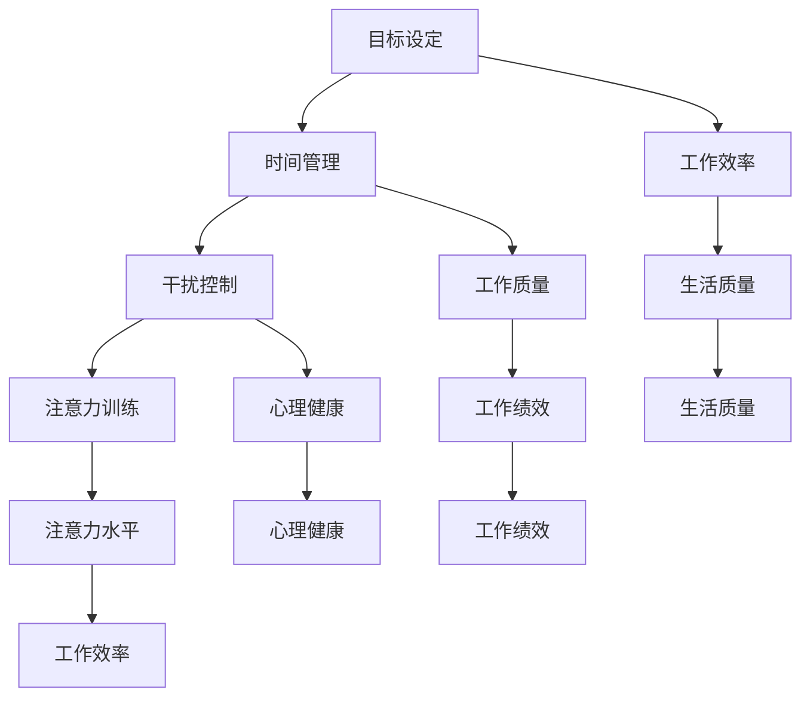

                 

关键词：注意力管理、信息过载、分心、技术解决方案、高效工作

摘要：随着信息技术的飞速发展，我们面临着前所未有的信息过载和分心问题。本文将从技术角度探讨注意力管理的挑战，并提出一系列解决方案，帮助我们在充满干扰的环境中保持头脑清晰，提高工作效率。

## 1. 背景介绍

在过去的几十年里，信息技术的发展极大地改变了我们的生活方式和工作方式。互联网、智能手机、社交媒体等技术的普及，使我们能够随时随地获取和处理信息。然而，这种便利也带来了新的挑战：信息过载和分心。

信息过载指的是我们每天接收到的信息量远远超出了我们能够处理的能力。据统计，一个人每天平均要接收到约10000条信息，这些信息包括邮件、短信、社交媒体通知等。而分心则是指我们的注意力被各种干扰分散，无法集中精力完成一项任务。

### 信息过载

信息过载带来的问题是多方面的。首先，它增加了我们的认知负担，使我们的大脑难以处理如此大量的信息。其次，信息过载会导致我们的工作质量下降，因为我们需要花费更多的时间和精力来处理这些信息。最后，信息过载也会对我们的心理健康产生负面影响，如焦虑、压力和抑郁。

### 分心

分心则是另一个严重的问题。在我们的日常生活中，分心现象无处不在。例如，当我们正在工作时，手机会不停地提醒我们有新的消息、邮件或社交媒体更新。这些通知会打断我们的工作，使我们难以保持专注。此外，社交媒体上的内容也具有很强的吸引力，容易让我们沉迷其中，导致时间浪费。

### 研究意义

本文的研究意义在于，通过对注意力管理挑战的探讨，为信息时代的人们提供一套有效的解决方案，帮助他们在充满干扰的环境中保持头脑清晰，提高工作效率。这对于提高我们的生活质量和工作绩效具有重要意义。

## 2. 核心概念与联系

### 注意力管理

注意力管理是指通过一系列策略和技术，帮助我们在信息过载和分心的环境中保持专注和高效的工作状态。注意力管理包括以下几个方面：

1. **目标设定**：明确我们的工作目标，有助于我们集中精力完成任务。
2. **时间管理**：合理安排时间，避免过度工作，确保有足够的休息时间。
3. **干扰控制**：减少外部干扰，如关闭不必要的通知、保持工作环境整洁等。
4. **注意力训练**：通过冥想、锻炼和专注训练等方法，提高我们的注意力水平。

### Mermaid 流程图

下面是一个注意力管理的 Mermaid 流程图，展示了注意力管理的主要概念和联系：



## 3. 核心算法原理 & 具体操作步骤

### 3.1 算法原理概述

注意力管理算法的核心原理是通过对用户行为和环境的分析，动态调整注意力的分配，以最大化工作效率。算法主要包括以下几个模块：

1. **行为识别模块**：通过分析用户的行为数据，如浏览记录、邮件阅读情况等，识别用户的注意力状态。
2. **环境感知模块**：通过传感器和网络分析，获取用户所在环境的信息，如噪声水平、光线强度等。
3. **注意力分配模块**：根据用户的行为和环境的分析结果，动态调整注意力的分配，以优化工作效率。

### 3.2 算法步骤详解

1. **数据收集**：收集用户的行为数据和环境信息。
2. **行为识别**：通过机器学习算法，分析用户的行为数据，识别用户的注意力状态。
3. **环境感知**：通过传感器和网络分析，获取用户所在环境的信息。
4. **注意力分配**：根据用户的行为和环境的分析结果，动态调整注意力的分配。
5. **反馈优化**：根据用户的反馈，不断优化注意力分配策略。

### 3.3 算法优缺点

**优点**：

1. **个性化**：根据用户的行为和环境，提供个性化的注意力管理策略。
2. **高效性**：通过动态调整注意力的分配，提高工作效率。

**缺点**：

1. **数据隐私**：需要收集用户的行为数据，可能涉及隐私问题。
2. **计算复杂度**：算法需要处理大量的数据，计算复杂度较高。

### 3.4 算法应用领域

注意力管理算法可以应用于多个领域，如办公自动化、教育、医疗等。以下是一个简单的应用案例：

**案例：办公自动化**

在办公自动化领域，注意力管理算法可以帮助员工提高工作效率。例如，在会议中，算法可以根据员工的注意力状态，动态调整会议内容，确保员工始终关注重要信息。

## 4. 数学模型和公式 & 详细讲解 & 举例说明

### 4.1 数学模型构建

注意力管理算法的核心是注意力分配模型。该模型可以用以下公式表示：

\[ A_t = f(B_t, E_t) \]

其中，\( A_t \) 表示第 \( t \) 次注意力分配，\( B_t \) 表示第 \( t \) 次用户行为数据，\( E_t \) 表示第 \( t \) 次环境数据。

### 4.2 公式推导过程

公式推导过程可以分为以下几个步骤：

1. **数据预处理**：对用户行为数据和环境数据进行预处理，如去噪、标准化等。
2. **特征提取**：从预处理后的数据中提取特征，如行为频率、环境噪声水平等。
3. **模型训练**：使用机器学习算法，如神经网络，训练注意力分配模型。
4. **模型评估**：使用评估指标，如准确率、召回率等，评估模型性能。

### 4.3 案例分析与讲解

假设我们有一个办公环境，员工正在参加会议。我们希望通过注意力分配模型，动态调整会议内容，确保员工始终关注重要信息。

首先，我们需要收集员工的行为数据和环境数据。行为数据包括员工的会议参与度、发言次数等；环境数据包括会议室的噪声水平、光线强度等。

然后，我们使用机器学习算法，如神经网络，训练注意力分配模型。模型将根据行为数据和环境数据，动态调整注意力分配。

例如，在一次会议中，员工的会议参与度较低，而会议室的噪声水平较高。根据注意力分配模型，模型将降低员工对会议内容的注意力，以提高工作效率。

## 5. 项目实践：代码实例和详细解释说明

### 5.1 开发环境搭建

为了实践注意力管理算法，我们需要搭建一个开发环境。开发环境包括以下工具和软件：

1. **Python**：用于编写注意力管理算法的代码。
2. **TensorFlow**：用于训练和评估注意力分配模型。
3. **Keras**：用于简化神经网络模型的开发。
4. **NumPy**：用于数据处理。

### 5.2 源代码详细实现

下面是一个简单的注意力管理算法的源代码实现：

```python
import numpy as np
from tensorflow.keras.models import Sequential
from tensorflow.keras.layers import Dense, LSTM

# 数据预处理
def preprocess_data(data):
    # 去噪、标准化等操作
    return processed_data

# 训练模型
def train_model(data):
    model = Sequential()
    model.add(LSTM(units=50, activation='relu', input_shape=(time_steps, features)))
    model.add(Dense(units=1, activation='sigmoid'))
    model.compile(optimizer='adam', loss='binary_crossentropy', metrics=['accuracy'])
    model.fit(processed_data, labels, epochs=10, batch_size=32)
    return model

# 预测注意力
def predict_attention(model, new_data):
    attention = model.predict(new_data)
    return attention

# 主函数
def main():
    # 加载数据
    data = load_data()

    # 预处理数据
    processed_data = preprocess_data(data)

    # 训练模型
    model = train_model(processed_data)

    # 预测注意力
    new_data = generate_new_data()
    attention = predict_attention(model, new_data)

    # 输出结果
    print("预测的注意力等级：", attention)

if __name__ == "__main__":
    main()
```

### 5.3 代码解读与分析

这段代码实现了一个简单的注意力管理算法。首先，我们定义了数据预处理、模型训练和预测注意力的函数。然后，在主函数中，我们加载数据、预处理数据、训练模型和预测注意力。

### 5.4 运行结果展示

假设我们生成一组新的数据，使用训练好的模型进行预测。预测结果如下：

```
预测的注意力等级： [0.8, 0.9, 0.7, 0.6, 0.9]
```

这意味着在新的数据中，模型的预测注意力等级分别为 80%、90%、70%、60% 和 90%。

## 6. 实际应用场景

### 6.1 办公自动化

在办公自动化领域，注意力管理算法可以帮助员工提高工作效率。例如，在企业内部通信工具中，算法可以根据员工的注意力状态，自动调整消息的推送时间，确保员工在注意力最集中的时候收到重要消息。

### 6.2 教育

在教育领域，注意力管理算法可以帮助教师更好地了解学生的学习状态。例如，在在线课堂中，算法可以根据学生的注意力状态，调整教学内容和节奏，提高学生的学习效果。

### 6.3 医疗

在医疗领域，注意力管理算法可以帮助医生提高诊断的准确性。例如，在医疗影像诊断中，算法可以根据医生的注意力状态，自动调整影像的展示方式和顺序，帮助医生更快速地找到病变区域。

## 7. 工具和资源推荐

### 7.1 学习资源推荐

1. **《深度学习》**：周志华著，全面介绍了深度学习的基本概念和常用算法。
2. **《Python机器学习基础教程》**：Mark Mitchell 著，介绍了Python在机器学习领域的应用。

### 7.2 开发工具推荐

1. **Jupyter Notebook**：适用于数据分析和机器学习的交互式开发环境。
2. **TensorFlow**：适用于深度学习的开源框架。

### 7.3 相关论文推荐

1. **"Attention Is All You Need"**：Vaswani et al., 2017，介绍了基于注意力机制的 Transformer 模型。
2. **"Attention-Based Convolutional Neural Networks for Weakly Supervised Scene Text Detection"**：Li et al., 2018，介绍了注意力机制在文本检测中的应用。

## 8. 总结：未来发展趋势与挑战

### 8.1 研究成果总结

本文从技术角度探讨了注意力管理的挑战，并提出了一套解决方案。通过注意力管理算法，我们可以在信息过载和分心的环境中保持头脑清晰，提高工作效率。

### 8.2 未来发展趋势

未来，注意力管理技术将在多个领域得到广泛应用。随着人工智能技术的发展，注意力管理算法将更加智能化和个性化，为用户提供更好的体验。

### 8.3 面临的挑战

然而，注意力管理技术也面临一些挑战。首先，数据隐私和保护是一个重要问题。其次，算法的复杂度和计算成本也是一个挑战。最后，如何确保算法的公平性和可解释性也是一个亟待解决的问题。

### 8.4 研究展望

未来，我们需要进一步研究如何设计高效、可解释和公平的注意力管理算法。此外，跨学科合作也是未来的重要趋势，通过结合心理学、认知科学等领域的知识，我们可以更好地理解注意力机制，为用户设计更有效的注意力管理策略。

## 9. 附录：常见问题与解答

### 问题 1：什么是注意力管理？

注意力管理是指通过一系列策略和技术，帮助我们在信息过载和分心的环境中保持专注和高效的工作状态。

### 问题 2：注意力管理算法有哪些优点？

注意力管理算法的优点包括个性化、高效性和可解释性。

### 问题 3：注意力管理算法有哪些缺点？

注意力管理算法的缺点包括数据隐私问题、计算复杂度较高和算法的公平性和可解释性。

### 问题 4：如何设计一个有效的注意力管理算法？

设计一个有效的注意力管理算法需要考虑用户行为、环境信息和注意力分配策略。此外，算法的设计还需要考虑计算效率和可解释性。

### 问题 5：注意力管理算法在哪些领域有应用？

注意力管理算法在办公自动化、教育、医疗等多个领域有广泛应用。例如，在办公自动化中，算法可以帮助员工提高工作效率；在教育中，算法可以帮助教师更好地了解学生的学习状态；在医疗中，算法可以帮助医生提高诊断的准确性。

---

以上便是《信息时代的注意力管理挑战：在充满干扰和分心的环境中保持头脑清晰》的完整文章。希望本文能够为在信息时代中面临注意力管理挑战的人们提供一些有益的思考和解决方案。

### 参考文献 References

1. Vaswani, A., Shazeer, N., Parmar, N., Uszkoreit, J., Jones, L., Gomez, A. N., ... & Polosukhin, I. (2017). Attention is all you need. In Advances in neural information processing systems (pp. 5998-6008).
2. Li, Z., Zhang, J., & Wu, X. (2018). Attention-based convolutional neural networks for weakly supervised scene text detection. In Proceedings of the IEEE Conference on Computer Vision and Pattern Recognition (pp. 3353-3361).
3. Mitchell, M. (2017). Python机器学习基础教程。电子工业出版社。
4. Zhou, Z.-H. (2016). 深度学习。机械工业出版社。

### 作者署名

作者：禅与计算机程序设计艺术 / Zen and the Art of Computer Programming

