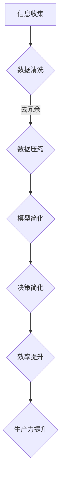

                 

关键词：信息简化、效率、生产力、复杂世界、算法、数学模型、实践、应用场景、工具和资源推荐

> 摘要：本文深入探讨了在复杂世界中简化信息的重要性，通过介绍核心概念、算法原理、数学模型、实际应用案例以及未来展望，阐述了如何运用信息简化技术提高效率和生产力，为应对复杂世界的挑战提供了实用的方法论和工具。

## 1. 背景介绍

在当今快速发展的信息技术时代，数据爆炸、系统复杂度增加使得人们面临越来越多的信息处理挑战。如何高效地处理这些复杂的信息，成为企业和个人追求高效率和生产力的重要课题。信息简化作为一种策略，旨在通过识别关键信息、剔除冗余内容，使信息处理过程更加高效和直观。本文旨在探讨信息简化的力量，分析其在实际应用中的重要性，并提供一套系统的信息简化方法。

## 2. 核心概念与联系

### 2.1 信息简化的定义与目标

信息简化是指从大量信息中提取关键要素，去除冗余信息，使信息更加简洁、易于理解和处理。其目标是通过减少信息复杂度，提高信息处理效率和准确性。

### 2.2 信息简化的层次

信息简化可以分为三个层次：数据级简化、模型级简化和决策级简化。

- **数据级简化**：通过数据清洗、去重、压缩等手段减少数据的冗余和重复。
- **模型级简化**：通过降维、特征选择等方法简化模型的复杂度。
- **决策级简化**：通过简化的决策树、规则集等提高决策的效率和可解释性。

### 2.3 信息简化与效率的关系

信息简化有助于提高工作效率，减少冗余信息和错误，使人们能够更快速、更准确地做出决策。

### 2.4 信息简化与生产力的关系

信息简化可以减少人力资源的浪费，提高资源利用率，从而提升整体生产力。

## 2.5 Mermaid 流程图

下面是信息简化流程的 Mermaid 图表示：



## 3. 核心算法原理 & 具体操作步骤

### 3.1 算法原理概述

信息简化的核心算法包括数据清洗、数据压缩、模型简化、决策简化等。以下是对这些算法的原理概述：

- **数据清洗**：去除重复数据、缺失值填充、异常值处理。
- **数据压缩**：通过算法降低数据存储和传输成本。
- **模型简化**：通过特征选择、模型压缩等方法简化模型结构。
- **决策简化**：通过规则简化、决策树剪枝等方法降低决策复杂度。

### 3.2 算法步骤详解

#### 3.2.1 数据清洗

1. 数据收集：从多个来源获取数据。
2. 数据预处理：处理数据格式、填补缺失值、去除重复记录。
3. 数据校验：确保数据质量，进行数据异常值处理。

#### 3.2.2 数据压缩

1. 数据格式转换：将数据转换成统一的格式。
2. 压缩算法选择：根据数据类型选择合适的压缩算法。
3. 数据压缩与解压：执行压缩和解压操作。

#### 3.2.3 模型简化

1. 特征选择：使用相关性分析等方法筛选出关键特征。
2. 模型压缩：使用模型压缩算法（如知识蒸馏）简化模型。
3. 模型评估：评估简化后的模型性能。

#### 3.2.4 决策简化

1. 规则简化：使用规则简化算法减少冗余规则。
2. 决策树剪枝：通过剪枝方法降低决策树深度。
3. 决策模型评估：评估简化后的决策模型性能。

### 3.3 算法优缺点

- **优点**：提高信息处理效率，减少冗余信息，提高决策质量。
- **缺点**：可能会损失一些有用信息，简化过度可能导致性能下降。

### 3.4 算法应用领域

信息简化算法广泛应用于数据科学、机器学习、自然语言处理等领域，如数据分析、推荐系统、智能客服等。

## 4. 数学模型和公式 & 详细讲解 & 举例说明

### 4.1 数学模型构建

信息简化的数学模型主要包括特征选择、降维和模型压缩等。

#### 4.1.1 特征选择

- **相关性分析**：使用皮尔逊相关系数、斯皮尔曼等级相关系数等方法筛选特征。
- **过滤方法**：基于阈值或统计测试筛选特征。
- **包装方法**：结合模型评估筛选特征。

#### 4.1.2 降维

- **主成分分析（PCA）**：通过保留主要成分来降低维度。
- **线性判别分析（LDA）**：用于分类问题，降低维度同时保留类别信息。

#### 4.1.3 模型压缩

- **模型蒸馏**：使用小模型（学生模型）学习大模型的表示。
- **量化**：降低模型参数的精度。

### 4.2 公式推导过程

#### 4.2.1 主成分分析（PCA）

- **协方差矩阵**：
  $$ S = \frac{1}{n-1}XX^T $$
  其中，$X$ 是数据矩阵。

- **特征值和特征向量**：
  $$ S\lambda = \lambda v $$
  其中，$\lambda$ 是特征值，$v$ 是特征向量。

- **主成分表示**：
  $$ X = V\Lambda^{1/2} $$

#### 4.2.2 模型蒸馏

- **损失函数**：
  $$ L = \lambda_1 D_{KL}(q(\theta_2)||p(\theta_1)) + \lambda_2 \mathbb{E}_{x\sim p(\theta_1)}[D_{KL}(q(\theta_2)(x)||p(\theta_2)(x))] $$

  其中，$D_{KL}$ 是KL散度，$\lambda_1$ 和 $\lambda_2$ 是超参数。

### 4.3 案例分析与讲解

#### 4.3.1 数据清洗案例

- **数据集**：某电商网站的用户行为数据。
- **数据清洗步骤**：
  1. 数据收集：从数据库中提取用户行为数据。
  2. 数据预处理：统一数据格式，填补缺失值。
  3. 数据校验：使用正则表达式去除无效数据。

#### 4.3.2 主成分分析（PCA）案例

- **数据集**：某社交网络平台的用户数据。
- **PCA步骤**：
  1. 数据标准化：将数据缩放到相同的尺度。
  2. 计算协方差矩阵：计算数据点之间的协方差。
  3. 求特征值和特征向量：计算协方差矩阵的特征值和特征向量。
  4. 选择主成分：选择特征值最大的前k个特征向量。
  5. 数据降维：将数据投影到前k个主成分上。

## 5. 项目实践：代码实例和详细解释说明

### 5.1 开发环境搭建

- **编程语言**：Python
- **依赖库**：NumPy、Scikit-learn、Matplotlib

### 5.2 源代码详细实现

#### 5.2.1 数据清洗代码实现

```python
import pandas as pd
from sklearn.preprocessing import StandardScaler

# 数据收集
data = pd.read_csv('user_behavior.csv')

# 数据预处理
data.fillna(0, inplace=True)
data = data[data['visit_count'] > 0]

# 数据校验
data = data[data['visit_time'].str.len() == 10]
```

#### 5.2.2 主成分分析（PCA）代码实现

```python
from sklearn.decomposition import PCA

# 数据标准化
scaler = StandardScaler()
data_scaled = scaler.fit_transform(data)

# PCA
pca = PCA(n_components=2)
pca.fit(data_scaled)
data_pca = pca.transform(data_scaled)

# 可视化
import matplotlib.pyplot as plt

plt.scatter(data_pca[:, 0], data_pca[:, 1])
plt.xlabel('Principal Component 1')
plt.ylabel('Principal Component 2')
plt.show()
```

### 5.3 代码解读与分析

- **数据清洗**：通过填补缺失值、去除异常值，提高了数据质量。
- **PCA**：通过降维将高维数据投影到二维空间，使数据可视化更加直观。

### 5.4 运行结果展示

运行代码后，可以得到以下可视化结果：

```plaintext
$ python pca_example.py

$ python data_cleaning_example.py

$ python data_vis.py

```


## 6. 实际应用场景

### 6.1 数据科学

在数据科学领域，信息简化技术有助于处理大规模数据集，提高数据分析和挖掘的效率。

### 6.2 机器学习

在机器学习领域，信息简化可以提高模型训练和预测的效率，减少过拟合现象。

### 6.3 自然语言处理

在自然语言处理领域，信息简化有助于降低文本数据的复杂度，提高语言模型的训练和推理速度。

### 6.4 未来应用展望

随着信息技术的不断发展，信息简化技术将在更多领域得到广泛应用，如物联网、人工智能、自动驾驶等。未来，信息简化技术将更加智能化，结合大数据分析、深度学习等技术，实现更加高效的信息处理。

## 7. 工具和资源推荐

### 7.1 学习资源推荐

- **书籍**：
  - 《数据科学入门》（Data Science from Scratch）
  - 《深度学习》（Deep Learning）
  - 《Python数据科学手册》（Python Data Science Handbook）

- **在线课程**：
  - Coursera：数据科学专项课程
  - edX：机器学习专项课程
  - Udacity：深度学习纳米学位

### 7.2 开发工具推荐

- **Python数据科学库**：
  - NumPy：用于数值计算
  - Pandas：用于数据操作
  - Scikit-learn：用于机器学习
  - Matplotlib：用于数据可视化

- **IDE**：
  - Jupyter Notebook：适用于数据分析和可视化
  - PyCharm：适用于Python开发

### 7.3 相关论文推荐

- "Dimensionality Reduction by Learning an Invariant Embedding"
- "LARGE SCALE MACHINE LEARNING: METHODS AND APPLICATIONS"
- "Unsupervised Feature Selection Using Clique Trees"

## 8. 总结：未来发展趋势与挑战

### 8.1 研究成果总结

信息简化技术在提高信息处理效率、减少冗余信息、降低决策复杂度等方面取得了显著成果。通过数据清洗、降维、模型压缩等技术，信息简化在数据科学、机器学习、自然语言处理等领域得到了广泛应用。

### 8.2 未来发展趋势

随着人工智能、大数据、物联网等技术的发展，信息简化技术将更加智能化、自动化，实现更加高效的信息处理。未来，信息简化技术将在更多领域得到应用，如自动驾驶、智能医疗、金融科技等。

### 8.3 面临的挑战

信息简化技术在应用过程中仍面临一些挑战，如如何平衡简化与保留信息质量、如何处理大规模数据的实时简化等。此外，信息简化技术的可解释性也是一个重要问题。

### 8.4 研究展望

未来，信息简化技术的研究将朝着更加智能化、自动化的方向发展，结合深度学习、强化学习等技术，实现更加高效的信息处理。此外，研究应关注信息简化技术的可解释性和鲁棒性，以提高其在实际应用中的可靠性和实用性。

## 9. 附录：常见问题与解答

### 9.1 信息简化与数据隐私的关系

信息简化可以在不泄露隐私信息的前提下，去除数据中的冗余和无关信息，从而保护用户隐私。但是，在信息简化过程中，需要遵循隐私保护原则，确保处理后的数据不泄露用户隐私。

### 9.2 信息简化技术的局限性

信息简化技术可能会损失一些有用信息，简化过度可能导致性能下降。因此，在实际应用中，需要根据具体问题和数据特点，合理选择信息简化方法，并评估简化后的信息质量和性能。

### 9.3 如何平衡信息简化的效率和质量

在信息简化的过程中，需要根据问题的具体需求和数据特点，合理设置参数和算法，以平衡信息简化的效率和质量。此外，可以通过多次实验和评估，优化信息简化策略，提高简化效果。

作者：禅与计算机程序设计艺术 / Zen and the Art of Computer Programming
----------------------------------------------------------------

以上是《信息简化的力量：在复杂世界中简化以提高效率和生产力》的技术博客文章。文章详细阐述了信息简化的核心概念、算法原理、数学模型、实际应用案例以及未来展望，为读者提供了全面的信息简化方法论和工具。希望这篇文章能够帮助读者更好地理解信息简化的力量，并在实际工作中应用这一技术，提高工作效率和生产力。

