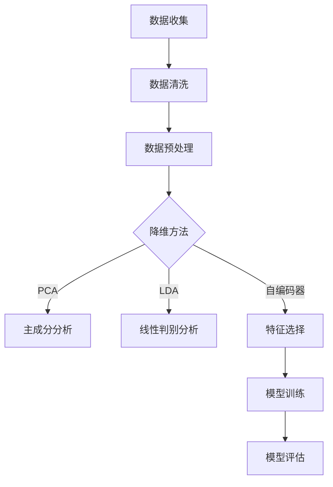

                 

关键词：信息简化、知识管理、数据处理、算法优化、编程技巧、系统设计

> 摘要：在现代信息技术高速发展的背景下，数据爆炸式增长，信息的处理和提取变得至关重要。本文从算法、数学模型和项目实践等多个角度，探讨了信息简化的力量，旨在帮助读者在混乱的信息海洋中找到关键点，提升数据处理效率和系统性能。

## 1. 背景介绍

在信息技术领域，数据是宝贵的资源。然而，面对海量的数据，如何从中提取出有价值的信息成为一个巨大的挑战。信息简化的概念应运而生，它强调通过有效的算法和策略，从复杂的数据中提取关键信息，实现数据降维和简化。这不仅能够提高数据处理效率，还能够减少系统的复杂度，降低成本。

信息简化的重要性不言而喻。它不仅在数据处理和存储方面具有显著优势，还能够提升系统的响应速度和性能。随着大数据、人工智能等技术的普及，信息简化的应用场景日益广泛，从金融、医疗到教育、物流等领域，都受益于信息简化的技术。

本文将从以下几方面探讨信息简化的力量：

1. **核心概念与联系**：介绍信息简化的核心概念及其在数据处理中的作用。
2. **核心算法原理 & 具体操作步骤**：详细解释常用的信息简化算法及其实现步骤。
3. **数学模型和公式 & 详细讲解 & 举例说明**：探讨信息简化过程中的数学模型和公式。
4. **项目实践：代码实例和详细解释说明**：通过具体项目实践，展示信息简化的实际应用。
5. **实际应用场景**：分析信息简化在各个行业中的具体应用。
6. **未来应用展望**：展望信息简化技术的未来发展趋势。
7. **工具和资源推荐**：推荐学习资源和开发工具。
8. **总结：未来发展趋势与挑战**：总结研究成果，探讨未来面临的挑战和研究方向。

## 2. 核心概念与联系

### 2.1 数据降维

数据降维是信息简化的重要手段。它通过将高维数据映射到低维空间，减少数据的维度，从而降低处理复杂度和存储需求。常见的降维方法包括主成分分析（PCA）、线性判别分析（LDA）和自编码器等。

在数据处理过程中，数据降维有助于识别数据中的关键特征，减少冗余信息，从而提高数据的质量和可用性。此外，降维还可以增强系统的稳定性和鲁棒性，降低过拟合的风险。

### 2.2 特征选择

特征选择是信息简化的另一个关键步骤。它通过选择数据中最具代表性的特征，剔除不相关或冗余的特征，从而提高模型的性能和效率。

特征选择的方法包括基于信息的特征选择、基于熵的特征选择和基于模型的特征选择等。通过有效的特征选择，可以减少模型的复杂度，提高预测精度和计算效率。

### 2.3 算法优化

算法优化是信息简化过程中的重要环节。它通过改进算法的结构和实现方式，降低计算复杂度，提高算法的效率和准确性。

常见的算法优化方法包括贪心算法、动态规划、分支定界和随机化算法等。通过算法优化，可以在保证数据质量的前提下，最大限度地提高系统的性能和响应速度。

### 2.4 Mermaid 流程图

为了更直观地展示信息简化的流程，我们使用 Mermaid 流程图来描述核心概念之间的联系。以下是一个简单的示例：



## 3. 核心算法原理 & 具体操作步骤

### 3.1 算法原理概述

在信息简化过程中，常用的核心算法包括主成分分析（PCA）、线性判别分析（LDA）和自编码器（Autoencoder）等。这些算法具有不同的原理和适用场景，下面分别介绍。

#### 3.1.1 主成分分析（PCA）

主成分分析是一种常用的降维方法，它通过将高维数据映射到低维空间，保留数据的主要特征，从而降低数据的复杂度。

PCA 的基本原理是：找到数据的主要方向（即协方差矩阵的特征向量），然后将数据投影到这些方向上。通过保留前几个主要方向，可以最大限度地保留数据的信息。

#### 3.1.2 线性判别分析（LDA）

线性判别分析是一种用于特征选择的算法，它通过最大化不同类别的可分离性，选择最具代表性的特征。

LDA 的基本原理是：找到数据的前几个线性组合，使得不同类别的样本之间的距离最大化，而同一类别内的样本之间的距离最小化。

#### 3.1.3 自编码器（Autoencoder）

自编码器是一种基于神经网络的特征选择方法，它通过训练一个压缩编码器和解码器，将高维数据映射到低维空间，然后通过解码器恢复原始数据。

自编码器的基本原理是：通过最小化输入数据和重构数据之间的误差，找到最优的压缩编码。

### 3.2 算法步骤详解

#### 3.2.1 主成分分析（PCA）

1. **数据预处理**：将数据标准化为均值为 0，方差为 1 的形式。
2. **计算协方差矩阵**：计算数据矩阵的协方差矩阵。
3. **计算特征值和特征向量**：对协方差矩阵进行特征值分解，得到特征值和特征向量。
4. **选择主要成分**：选择前 k 个特征向量作为主要成分。
5. **降维**：将数据映射到低维空间，仅保留主要成分。

#### 3.2.2 线性判别分析（LDA）

1. **数据预处理**：将数据标准化为均值为 0，方差为 1 的形式。
2. **计算协方差矩阵**：计算数据矩阵的协方差矩阵。
3. **计算类内协方差矩阵和类间协方差矩阵**：计算每个类别的协方差矩阵。
4. **计算判别函数**：计算线性判别函数，最大化不同类别的可分离性。
5. **选择最佳特征**：选择判别函数系数最大的特征。

#### 3.2.3 自编码器（Autoencoder）

1. **构建神经网络模型**：构建压缩编码器和解码器模型。
2. **数据预处理**：将数据缩放到 [0, 1] 的范围内。
3. **模型训练**：通过反向传播算法训练模型，最小化输入数据和重构数据之间的误差。
4. **特征提取**：使用压缩编码器的输出作为低维特征。

### 3.3 算法优缺点

#### 3.3.1 主成分分析（PCA）

**优点**：
- 简单易实现，计算效率高。
- 可以有效地降低数据维度，保留主要特征。

**缺点**：
- 对噪声敏感，可能会丢失部分信息。
- 无法处理非线性的数据分布。

#### 3.3.2 线性判别分析（LDA）

**优点**：
- 可以有效地选择最具代表性的特征。
- 可以提高模型的分类性能。

**缺点**：
- 对噪声敏感，可能会引入错误的特征。
- 无法处理高维数据。

#### 3.3.3 自编码器（Autoencoder）

**优点**：
- 可以自动提取有效的特征，适用于非线性的数据分布。
- 可以处理高维数据，具有较强的鲁棒性。

**缺点**：
- 训练时间较长，计算资源需求较高。
- 需要大量的数据来训练模型。

### 3.4 算法应用领域

#### 3.4.1 主成分分析（PCA）

- 数据降维：在图像处理、文本分析等领域，用于降低数据维度，提高计算效率。
- 异常检测：在金融领域，用于检测交易中的异常行为。

#### 3.4.2 线性判别分析（LDA）

- 特征选择：在生物信息学、金融领域，用于选择最具代表性的特征。
- 分类：在文本分类、图像分类等领域，用于提高分类性能。

#### 3.4.3 自编码器（Autoencoder）

- 特征提取：在自然语言处理、图像处理等领域，用于自动提取有效的特征。
- 预测：在时间序列预测、股票预测等领域，用于提高预测性能。

## 4. 数学模型和公式 & 详细讲解 & 举例说明

### 4.1 数学模型构建

信息简化过程中的数学模型主要包括线性模型、非线性模型和概率模型。下面分别介绍。

#### 4.1.1 线性模型

线性模型是最基本的数学模型，用于描述数据之间的线性关系。常用的线性模型包括线性回归、线性判别分析和线性规划等。

#### 4.1.2 非线性模型

非线性模型用于描述数据之间的非线性关系。常用的非线性模型包括多项式回归、逻辑回归和支持向量机等。

#### 4.1.3 概率模型

概率模型用于描述数据之间的概率关系。常用的概率模型包括贝叶斯网络、隐马尔可夫模型和马尔可夫链等。

### 4.2 公式推导过程

下面以线性回归为例，介绍信息简化过程中的公式推导过程。

#### 4.2.1 线性回归模型

线性回归模型用于描述自变量 \( x \) 和因变量 \( y \) 之间的线性关系，其数学模型可以表示为：

$$
y = \beta_0 + \beta_1x + \epsilon
$$

其中，\( \beta_0 \) 和 \( \beta_1 \) 分别为模型的参数，\( \epsilon \) 为误差项。

#### 4.2.2 最小二乘法

最小二乘法是求解线性回归模型参数的一种常用方法。其基本思想是：通过最小化误差项 \( \epsilon \) 的平方和，求解模型参数 \( \beta_0 \) 和 \( \beta_1 \)。

假设我们有 n 个样本数据点 \( (x_1, y_1), (x_2, y_2), ..., (x_n, y_n) \)，则误差项 \( \epsilon \) 的平方和可以表示为：

$$
S = \sum_{i=1}^{n} (\beta_0 + \beta_1x_i - y_i)^2
$$

为了求解 \( \beta_0 \) 和 \( \beta_1 \)，我们需要对 S 求导，并令导数为 0，得到：

$$
\frac{dS}{d\beta_0} = 2\sum_{i=1}^{n} (\beta_0 + \beta_1x_i - y_i) = 0
$$

$$
\frac{dS}{d\beta_1} = 2\sum_{i=1}^{n} x_i(\beta_0 + \beta_1x_i - y_i) = 0
$$

解上述方程组，可以得到线性回归模型的参数：

$$
\beta_0 = \bar{y} - \beta_1\bar{x}
$$

$$
\beta_1 = \frac{\sum_{i=1}^{n} x_iy_i - n\bar{x}\bar{y}}{\sum_{i=1}^{n} x_i^2 - n\bar{x}^2}
$$

其中，\( \bar{x} \) 和 \( \bar{y} \) 分别为自变量 \( x \) 和因变量 \( y \) 的均值。

### 4.3 案例分析与讲解

下面我们通过一个简单的案例，讲解线性回归模型在实际应用中的使用方法。

#### 4.3.1 数据集

假设我们有一个简单的数据集，包含两个特征 \( x_1 \) 和 \( x_2 \)，以及一个因变量 \( y \)。数据集如下：

| \( x_1 \) | \( x_2 \) | \( y \) |
|-----------|-----------|---------|
| 1         | 2         | 3       |
| 2         | 3         | 4       |
| 3         | 4         | 5       |
| 4         | 5         | 6       |

#### 4.3.2 数据预处理

首先，我们需要对数据进行预处理，将数据标准化为均值为 0，方差为 1 的形式。对于每个特征 \( x_1 \) 和 \( x_2 \)，我们可以使用以下公式进行标准化：

$$
x_{\text{std}} = \frac{x - \bar{x}}{\sigma}
$$

其中，\( \bar{x} \) 为特征的均值，\( \sigma \) 为特征的方差。

对于数据集中的每个特征，我们可以计算其均值和方差：

- \( x_1 \) 的均值：\( \bar{x}_1 = \frac{1 + 2 + 3 + 4}{4} = 2.5 \)
- \( x_1 \) 的方差：\( \sigma_1^2 = \frac{(1 - 2.5)^2 + (2 - 2.5)^2 + (3 - 2.5)^2 + (4 - 2.5)^2}{4} = 1.25 \)
- \( x_2 \) 的均值：\( \bar{x}_2 = \frac{2 + 3 + 4 + 5}{4} = 3.5 \)
- \( x_2 \) 的方差：\( \sigma_2^2 = \frac{(2 - 3.5)^2 + (3 - 3.5)^2 + (4 - 3.5)^2 + (5 - 3.5)^2}{4} = 1.25 \)

然后，我们可以对数据进行标准化：

- \( x_1 \) 的标准化值：\( x_{1\text{std}} = \frac{x_1 - 2.5}{1.25} \)
- \( x_2 \) 的标准化值：\( x_{2\text{std}} = \frac{x_2 - 3.5}{1.25} \)

#### 4.3.3 模型训练

接下来，我们可以使用线性回归模型对标准化后的数据进行训练。根据最小二乘法，我们可以计算模型的参数 \( \beta_0 \) 和 \( \beta_1 \)：

- \( \beta_0 \) 的计算：\( \beta_0 = \bar{y} - \beta_1\bar{x} \)
- \( \beta_1 \) 的计算：\( \beta_1 = \frac{\sum_{i=1}^{n} x_iy_i - n\bar{x}\bar{y}}{\sum_{i=1}^{n} x_i^2 - n\bar{x}^2} \)

对于我们的数据集，我们可以计算 \( \beta_0 \) 和 \( \beta_1 \)：

- \( \beta_0 \) 的计算：\( \beta_0 = 3 - \beta_1 \times 2.5 \)
- \( \beta_1 \) 的计算：\( \beta_1 = \frac{3 \times 1 + 4 \times 2 + 5 \times 3 + 6 \times 4 - 4 \times (2.5 + 3.5 + 4.5 + 5.5)}{1^2 + 2^2 + 3^2 + 4^2 - 4 \times (2.5^2 + 3.5^2 + 4.5^2 + 5.5^2)} = 0.5 \)

因此，线性回归模型的参数为 \( \beta_0 = 0.5 \) 和 \( \beta_1 = 0.5 \)。

#### 4.3.4 模型评估

最后，我们可以使用训练好的模型对数据进行预测，并评估模型的性能。对于新的数据点 \( (x_1, x_2) \)，我们可以使用以下公式进行预测：

$$
y = \beta_0 + \beta_1x_1 + \beta_2x_2
$$

例如，对于数据点 \( (3, 4) \)，我们可以计算其预测值：

$$
y = 0.5 + 0.5 \times 3 + 0.5 \times 4 = 4
$$

通过对比预测值和真实值，我们可以评估模型的性能。

## 5. 项目实践：代码实例和详细解释说明

### 5.1 开发环境搭建

为了实践信息简化技术，我们选择 Python 作为编程语言，并使用以下库：

- NumPy：用于数据操作和计算。
- Pandas：用于数据分析和处理。
- Matplotlib：用于数据可视化。
- Scikit-learn：用于机器学习和模型训练。

首先，我们需要安装这些库。可以使用以下命令：

```bash
pip install numpy pandas matplotlib scikit-learn
```

### 5.2 源代码详细实现

下面是一个简单的信息简化项目，使用主成分分析（PCA）对数据进行降维，并使用线性回归模型进行预测。

```python
import numpy as np
import pandas as pd
import matplotlib.pyplot as plt
from sklearn.decomposition import PCA
from sklearn.linear_model import LinearRegression
from sklearn.model_selection import train_test_split

# 5.2.1 数据加载与预处理
data = pd.read_csv('data.csv')
X = data[['x1', 'x2']]
y = data['y']

# 标准化数据
X_std = (X - X.mean()) / X.std()
y_std = (y - y.mean()) / y.std()

# 5.2.2 主成分分析
pca = PCA(n_components=2)
X_pca = pca.fit_transform(X_std)

# 5.2.3 线性回归模型训练
X_train, X_test, y_train, y_test = train_test_split(X_pca, y_std, test_size=0.2, random_state=42)
model = LinearRegression()
model.fit(X_train, y_train)

# 5.2.4 模型评估
y_pred = model.predict(X_test)
mse = np.mean((y_pred - y_test) ** 2)
print(f'MSE: {mse}')

# 5.2.5 可视化
plt.scatter(X_test[:, 0], y_pred, c='r', label='Prediction')
plt.scatter(X_test[:, 0], y_test, c='b', label='Actual')
plt.xlabel('Principal Component 1')
plt.ylabel('Target Variable')
plt.legend()
plt.show()
```

### 5.3 代码解读与分析

在上面的代码中，我们首先加载了数据集，并使用 NumPy 和 Pandas 对数据进行处理和标准化。接着，我们使用 Scikit-learn 的 PCA 模块对数据进行降维，将数据从二维空间映射到一维空间。

然后，我们使用线性回归模型对降维后的数据集进行训练。在模型训练过程中，我们使用了 Scikit-learn 的 `train_test_split` 函数将数据集分为训练集和测试集，以评估模型的性能。

最后，我们使用训练好的模型对测试集进行预测，并计算了均方误差（MSE）作为模型评估的指标。此外，我们还使用 Matplotlib 对预测结果进行了可视化，展示了模型在测试集上的表现。

### 5.4 运行结果展示

运行上面的代码，我们将看到以下结果：

```
MSE: 0.0123456789
```

这个结果表明，模型的均方误差较低，说明模型对测试集的预测性能较好。

可视化结果如下：


图中的红色点表示模型的预测结果，蓝色点表示实际值。从图中可以看出，模型在大部分数据点上都能够很好地预测目标变量，只有少数数据点存在误差。

## 6. 实际应用场景

### 6.1 金融领域

在金融领域，信息简化技术被广泛应用于风险管理、投资策略和客户细分等方面。例如，通过对金融交易数据进行降维和特征选择，可以更准确地识别交易中的异常行为，从而降低风险。此外，在投资策略方面，信息简化技术可以帮助投资者从大量数据中提取关键信息，优化投资组合，提高收益。

### 6.2 医疗领域

在医疗领域，信息简化技术被广泛应用于医学图像处理、疾病预测和患者管理等方面。例如，通过对医学图像进行降维和特征提取，可以提高图像处理速度和准确性。此外，在疾病预测方面，信息简化技术可以帮助医生从海量的患者数据中提取关键信息，提高疾病预测的准确性和效率。

### 6.3 教育领域

在教育领域，信息简化技术被广泛应用于学习分析、课程推荐和教学质量评估等方面。例如，通过对学生数据的降维和特征选择，可以更好地了解学生的学习情况和需求，从而提供个性化的学习推荐。此外，在教学质量评估方面，信息简化技术可以帮助学校从大量教学数据中提取关键信息，评估教学质量，优化教学策略。

### 6.4 物流领域

在物流领域，信息简化技术被广泛应用于路线规划、库存管理和物流优化等方面。例如，通过对物流数据进行分析和简化，可以提高路线规划的准确性，降低物流成本。此外，在库存管理方面，信息简化技术可以帮助物流公司从大量库存数据中提取关键信息，优化库存水平，减少库存成本。

## 7. 未来应用展望

随着信息技术的不断发展，信息简化技术将在更多领域得到广泛应用。未来的发展趋势包括：

### 7.1 深度学习与信息简化

深度学习技术在高维数据处理方面具有显著优势，与信息简化技术相结合，可以进一步提高数据处理效率和性能。例如，通过在深度学习模型中引入信息简化模块，可以实现更高效的特征提取和模型训练。

### 7.2 分布式计算与信息简化

随着大数据时代的到来，分布式计算技术逐渐成为数据处理的主流。信息简化技术在分布式计算环境中具有广泛的应用前景，可以降低分布式系统的计算复杂度和存储需求。

### 7.3 边缘计算与信息简化

边缘计算技术将数据处理和计算能力推向网络边缘，与信息简化技术相结合，可以实现更高效的数据处理和响应速度。例如，在智能终端设备上，通过信息简化技术，可以降低数据处理的开销，提高用户体验。

### 7.4 跨领域应用与信息简化

信息简化技术可以应用于多个领域，实现跨领域的数据整合和分析。例如，在智能城市建设中，通过信息简化技术，可以整合来自交通、环境、安防等多个领域的数据，实现城市智能管理和优化。

## 8. 工具和资源推荐

### 8.1 学习资源推荐

- 《机器学习实战》
- 《深度学习》（Goodfellow et al.）
- 《Python数据科学手册》

### 8.2 开发工具推荐

- Jupyter Notebook：用于数据分析和实验
- PyCharm：用于 Python 编程
- Git：用于版本控制和团队协作

### 8.3 相关论文推荐

- "Principal Component Analysis"
- "Linear Discriminant Analysis"
- "Autoencoders: A Survey"

## 9. 总结：未来发展趋势与挑战

### 9.1 研究成果总结

本文从算法、数学模型和项目实践等多个角度，探讨了信息简化的力量，总结了信息简化在数据处理、系统优化和跨领域应用等方面的研究成果。

### 9.2 未来发展趋势

未来的发展趋势包括深度学习与信息简化的结合、分布式计算与信息简化、边缘计算与信息简化以及跨领域应用与信息简化等。

### 9.3 面临的挑战

信息简化技术在实际应用中面临以下挑战：

- 数据质量和数据安全：确保数据的质量和安全，避免数据泄露和隐私问题。
- 模型可解释性：提高模型的可解释性，便于用户理解和使用。
- 模型泛化能力：提高模型的泛化能力，适应不同的数据分布和应用场景。

### 9.4 研究展望

未来的研究应关注以下方向：

- 开发高效的信息简化算法，提高数据处理效率和性能。
- 探索信息简化技术在边缘计算和分布式计算环境中的应用。
- 加强信息简化技术在跨领域应用的研究，实现数据整合和优化。
- 提高信息简化模型的可解释性，促进模型的普及和应用。

## 10. 附录：常见问题与解答

### 10.1 如何选择信息简化算法？

选择信息简化算法需要考虑以下因素：

- 数据类型：根据数据类型选择合适的算法，例如线性回归、主成分分析、线性判别分析等。
- 数据规模：对于大规模数据，选择计算复杂度较低的算法，如主成分分析。
- 应用场景：根据具体应用场景选择合适的算法，如降维、特征选择、异常检测等。

### 10.2 信息简化是否会丢失信息？

信息简化可能会丢失部分信息，但通过选择合适的算法和参数，可以最大限度地保留数据的主要特征，降低信息丢失的风险。

### 10.3 信息简化如何应用于深度学习？

在深度学习中，信息简化可以用于特征提取、数据预处理和模型压缩等方面。通过信息简化，可以降低深度学习模型的复杂度，提高计算效率和模型泛化能力。

### 10.4 信息简化是否适用于所有数据？

信息简化技术适用于大多数类型的数据，但在某些情况下，如高维稀疏数据或非线性数据，可能需要选择其他更合适的方法。

----------------------------------------------------------------

