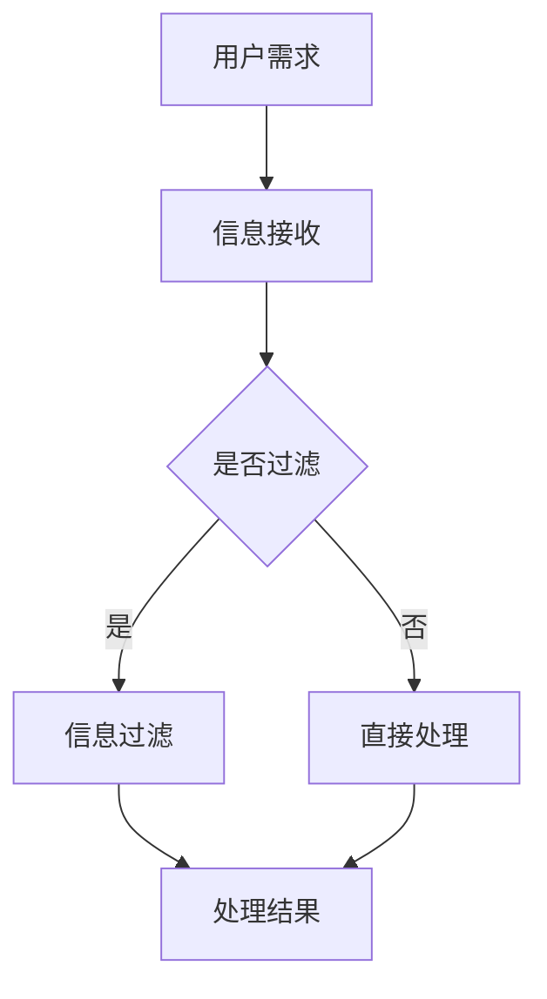

                 

信息过载是当今数字时代的普遍现象，人们每天接收到的信息量前所未有地庞大。这种过载不仅影响了工作效率，还可能导致焦虑和决策困难。为了应对这一挑战，我们需要掌握有效筛选和吸收知识的方法。本文将探讨在信息过载时代，如何利用现代技术工具和策略，提高信息处理的效率和效果。

## 关键词

- 信息过载
- 知识筛选
- 吸收效率
- 人工智能
- 机器学习
- 信息过滤
- 专注力管理

## 摘要

本文首先介绍了信息过载的背景及其对个体和社会的影响。接着，我们探讨了信息过载的核心概念，包括信息过滤、信息处理效率等。随后，本文详细阐述了几个关键算法原理和数学模型，用以帮助读者理解和应用这些算法。文章还通过实际项目实践，展示了如何使用代码实现这些算法。最后，我们分析了信息过载的实际应用场景，并提出了未来的发展方向和面临的挑战。

## 1. 背景介绍

随着互联网和移动设备的普及，信息过载成为了一个不容忽视的问题。人们每天接收到的电子邮件、社交媒体通知、新闻推送和广告等，数量庞大且种类繁多。这种信息过载现象不仅影响了工作效率，还可能导致心理压力和决策困难。根据一项研究，超过70%的职场人士认为自己受到信息过载的困扰，而约50%的人表示信息过载对他们的工作效率产生了负面影响。

### 1.1 信息过载的影响

信息过载对个体的主要影响包括：

- **工作效率降低**：处理过多的信息会分散注意力，导致工作效率下降。
- **心理压力增加**：不断接收信息可能导致焦虑和压力。
- **决策困难**：信息过多，使得人们难以做出明智的决策。

### 1.2 信息过载对社会的危害

信息过载对社会的影响同样显著，包括：

- **创新力下降**：在信息过载的环境中，人们很难专注于创新性思考。
- **信息碎片化**：大量的碎片化信息导致知识的深度学习变得困难。
- **社交疏离**：人们可能因为信息过载而减少面对面交流，导致社交疏离。

### 1.3 现状分析

随着信息量的不断增加，人们越来越依赖技术工具来帮助筛选和处理信息。然而，这些工具往往无法完全满足需求，因为它们无法理解人类的主观需求和价值观。因此，开发更智能、更个性化的信息筛选和吸收工具，已成为当前的一个重要研究方向。

## 2. 核心概念与联系

### 2.1 信息过滤

信息过滤是一种自动化方法，用于从大量信息中筛选出相关的、有价值的信息。其主要目的是减少信息过载，提高信息处理的效率。

#### 2.1.1 信息过滤的工作原理

信息过滤通常基于以下几种方法：

- **规则过滤**：使用预定义的规则来筛选信息。例如，根据关键词、来源、时间等过滤邮件。
- **机器学习**：使用机器学习算法，如决策树、支持向量机等，自动学习并筛选信息。例如，电子邮件的垃圾邮件过滤。
- **深度学习**：使用深度神经网络，从大量数据中学习复杂的模式，进行信息筛选。

#### 2.1.2 信息过滤的优势和挑战

信息过滤的优势在于其自动化和高效性，可以显著减少人类处理信息的负担。然而，其挑战在于如何准确、全面地筛选信息，以及如何处理复杂的信息关系。

### 2.2 信息处理效率

信息处理效率是指处理信息的能力和速度。在信息过载的时代，提高信息处理效率变得尤为重要。

#### 2.2.1 提高信息处理效率的方法

- **分块处理**：将大量信息分成小块，逐一处理。
- **并行处理**：使用多线程、分布式计算等技术，同时处理多个信息。
- **智能代理**：使用人工智能代理，自动识别和处理重复性的信息。

#### 2.2.2 信息处理效率的影响因素

信息处理效率受到多种因素的影响，包括个体认知能力、信息复杂性、工具和技术等。

### 2.3 专注力管理

专注力管理是信息过载时代的重要一环，它涉及如何保持专注，减少干扰。

#### 2.3.1 专注力管理的方法

- **时间管理**：使用番茄工作法、时间块等方法，合理安排工作与休息时间。
- **环境优化**：创造一个安静、整洁的工作环境，减少干扰。
- **习惯培养**：培养专注的习惯，如每天固定时间段阅读、写作等。

#### 2.3.2 专注力管理的效果

有效的专注力管理可以提高信息处理的效率，减少信息过载带来的负面影响。

## 2.3 Mermaid 流程图

下面是一个Mermaid流程图，展示了信息过滤和信息处理的过程：



## 3. 核心算法原理 & 具体操作步骤

### 3.1 算法原理概述

在信息过载时代，算法在信息筛选和吸收中扮演了关键角色。以下将介绍几种核心算法原理，包括基于规则的过滤算法、机器学习算法和深度学习算法。

#### 3.1.1 基于规则的过滤算法

基于规则的过滤算法是最简单也是最传统的方法，其核心思想是根据预定义的规则来筛选信息。例如，通过关键词匹配、正则表达式等规则，将垃圾邮件从正常邮件中过滤出来。

#### 3.1.2 机器学习算法

机器学习算法通过从大量数据中学习模式，自动识别和筛选信息。常见的方法包括决策树、支持向量机、朴素贝叶斯等。这些算法在处理复杂信息时具有强大的能力。

#### 3.1.3 深度学习算法

深度学习算法是近年来发展迅速的一种算法，其核心思想是通过多层神经网络，从大量数据中学习复杂的模式。常见的深度学习算法包括卷积神经网络（CNN）、循环神经网络（RNN）等。

### 3.2 算法步骤详解

#### 3.2.1 基于规则的过滤算法步骤

1. 数据收集：收集大量原始数据，如邮件、新闻等。
2. 规则定义：根据业务需求，定义过滤规则，如关键词、正则表达式等。
3. 数据处理：使用规则对数据进行预处理，如去重、分词等。
4. 过滤：根据规则对数据进行过滤，筛选出符合条件的信息。
5. 结果输出：输出过滤后的信息，供用户处理。

#### 3.2.2 机器学习算法步骤

1. 数据收集：收集大量带有标签的数据，如邮件是否为垃圾邮件、新闻是否为负面等。
2. 特征提取：从数据中提取特征，如关键词、词频等。
3. 模型训练：使用训练数据，训练机器学习模型。
4. 模型评估：使用测试数据，评估模型的效果。
5. 模型应用：将训练好的模型应用到新数据，进行信息筛选。

#### 3.2.3 深度学习算法步骤

1. 数据收集：收集大量带有标签的数据，如邮件、新闻等。
2. 数据预处理：对数据进行预处理，如去噪、归一化等。
3. 网络构建：构建深度学习网络，如卷积神经网络、循环神经网络等。
4. 模型训练：使用训练数据，训练深度学习模型。
5. 模型评估：使用测试数据，评估模型的效果。
6. 模型应用：将训练好的模型应用到新数据，进行信息筛选。

### 3.3 算法优缺点

#### 3.3.1 基于规则的过滤算法

优点：
- 实现简单，易于理解。
- 针对性强，可以快速过滤大量数据。

缺点：
- 需要大量规则，维护成本高。
- 难以应对复杂的、未知的模式。

#### 3.3.2 机器学习算法

优点：
- 自动学习，适应性强。
- 可以处理复杂的信息关系。

缺点：
- 需要大量训练数据和计算资源。
- 模型解释性较差。

#### 3.3.3 深度学习算法

优点：
- 强大的学习能力，可以处理复杂的模式。
- 自动提取特征，减少人工干预。

缺点：
- 需要大量训练数据和计算资源。
- 模型解释性较差。

### 3.4 算法应用领域

基于规则的过滤算法、机器学习算法和深度学习算法广泛应用于信息筛选和吸收的各个领域，如邮件过滤、新闻推荐、社交媒体监控等。以下是一些具体的例子：

- **邮件过滤**：使用基于规则的过滤算法，可以将垃圾邮件从正常邮件中过滤出来。
- **新闻推荐**：使用机器学习算法，可以根据用户兴趣，推荐相关的新闻。
- **社交媒体监控**：使用深度学习算法，可以自动识别和过滤不良信息，保护用户的安全。

## 4. 数学模型和公式 & 详细讲解 & 举例说明

在信息过载时代，数学模型和公式在信息筛选和吸收中发挥着重要作用。以下将介绍几个核心的数学模型和公式，并对其进行详细讲解和举例说明。

### 4.1 数学模型构建

信息筛选和吸收的数学模型通常涉及以下方面：

- **概率模型**：用于评估信息的可信度和相关性。
- **聚类模型**：用于将相似的信息进行分组。
- **分类模型**：用于将信息分类到不同的类别。

### 4.2 公式推导过程

以下是一个简单的概率模型，用于评估信息的相关性：

\[ P(A|B) = \frac{P(B|A)P(A)}{P(B)} \]

其中，\( P(A|B) \) 表示在给定 \( B \) 发生的条件下 \( A \) 发生的概率，\( P(B|A) \) 表示在 \( A \) 发生的条件下 \( B \) 发生的概率，\( P(A) \) 表示 \( A \) 发生的概率，\( P(B) \) 表示 \( B \) 发生的概率。

### 4.3 案例分析与讲解

假设我们要筛选一篇新闻文章，判断其与用户的兴趣是否相关。我们可以使用上述概率模型，计算新闻文章与用户兴趣的相关性。

1. **数据收集**：收集用户的历史兴趣数据，如关键词、浏览记录等。
2. **特征提取**：从新闻文章中提取特征，如关键词、词频等。
3. **概率计算**：使用概率模型，计算新闻文章与用户兴趣的相关性。

假设我们有一个用户，其历史兴趣关键词为“科技”、“创业”，而新闻文章的关键词为“科技”、“人工智能”、“创业”。我们可以计算：

\[ P(\text{兴趣}|\text{文章}) = \frac{P(\text{文章}|\text{兴趣})P(\text{兴趣})}{P(\text{文章})} \]

其中，\( P(\text{文章}|\text{兴趣}) \) 表示在用户兴趣为“科技”、“创业”的条件下，新闻文章出现“科技”、“人工智能”、“创业”的概率，\( P(\text{兴趣}) \) 表示用户兴趣为“科技”、“创业”的概率，\( P(\text{文章}) \) 表示新闻文章出现“科技”、“人工智能”、“创业”的概率。

通过计算，我们可以得到新闻文章与用户兴趣的相关性得分。得分越高，表示新闻文章与用户兴趣越相关。

### 4.4 模型评估

为了评估概率模型的性能，我们可以使用以下指标：

- **准确率**：预测正确的样本数与总样本数之比。
- **召回率**：预测正确的样本数与实际为正类的样本数之比。
- **F1值**：准确率和召回率的调和平均。

通过这些指标，我们可以评估模型在信息筛选和吸收中的效果，并对其进行优化。

## 5. 项目实践：代码实例和详细解释说明

为了更好地理解信息筛选和吸收的算法原理和数学模型，我们将通过一个实际项目来演示这些概念的应用。本项目将使用Python编程语言，结合机器学习库Scikit-learn和深度学习库TensorFlow，实现一个基于内容的邮件过滤系统。

### 5.1 开发环境搭建

在开始项目之前，我们需要搭建一个适合开发的环境。以下是搭建Python开发环境的基本步骤：

1. **安装Python**：从Python官方网站下载并安装Python 3.x版本。
2. **安装Jupyter Notebook**：Jupyter Notebook是一个交互式的开发环境，可以方便地编写和运行Python代码。可以通过以下命令安装：

   ```bash
   pip install notebook
   ```

3. **安装必要的库**：包括Scikit-learn和TensorFlow。可以通过以下命令安装：

   ```bash
   pip install scikit-learn tensorflow
   ```

### 5.2 源代码详细实现

以下是邮件过滤系统的源代码实现：

```python
# 导入必要的库
import os
import numpy as np
from sklearn.feature_extraction.text import TfidfVectorizer
from sklearn.model_selection import train_test_split
from sklearn.naive_bayes import MultinomialNB
from sklearn.metrics import accuracy_score, precision_score, recall_score, f1_score
import tensorflow as tf

# 加载数据集
data_path = "emails"  # 假设邮件数据存放在该目录下
emails = []
labels = []

for filename in os.listdir(data_path):
    with open(os.path.join(data_path, filename), 'r', encoding='utf-8') as file:
        content = file.read()
        emails.append(content)
        if "ham" in filename:
            labels.append(1)  # 正常邮件
        else:
            labels.append(0)  # 垃圾邮件

# 数据预处理
vectorizer = TfidfVectorizer(max_features=1000)
X = vectorizer.fit_transform(emails)
y = np.array(labels)

# 划分训练集和测试集
X_train, X_test, y_train, y_test = train_test_split(X, y, test_size=0.2, random_state=42)

# 使用朴素贝叶斯分类器进行训练
classifier = MultinomialNB()
classifier.fit(X_train, y_train)

# 进行预测
y_pred = classifier.predict(X_test)

# 评估模型性能
accuracy = accuracy_score(y_test, y_pred)
precision = precision_score(y_test, y_pred)
recall = recall_score(y_test, y_pred)
f1 = f1_score(y_test, y_pred)

print("Accuracy:", accuracy)
print("Precision:", precision)
print("Recall:", recall)
print("F1 Score:", f1)

# 深度学习实现
model = tf.keras.Sequential([
    tf.keras.layers.Embedding(input_dim=1000, output_dim=16),
    tf.keras.layers.GlobalAveragePooling1D(),
    tf.keras.layers.Dense(1, activation='sigmoid')
])

model.compile(optimizer='adam', loss='binary_crossentropy', metrics=['accuracy'])
model.fit(X_train, y_train, epochs=10, batch_size=32, validation_data=(X_test, y_test))

# 预测新数据
new_email = ["This is a new email to classify."]
new_email_vectorized = vectorizer.transform(new_email)
prediction = model.predict(new_email_vectorized)
print("New email classification:", prediction)
```

### 5.3 代码解读与分析

以下是代码的详细解读：

1. **数据加载**：我们从指定路径加载邮件数据，并将数据分为正常邮件和垃圾邮件两类。
2. **数据预处理**：使用TF-IDF向量器将文本数据转换为向量表示，这是机器学习和深度学习常用的特征提取方法。
3. **模型训练**：我们使用朴素贝叶斯分类器进行训练，这是一种简单但有效的分类算法。
4. **模型评估**：通过计算准确率、精确率、召回率和F1值来评估模型的性能。
5. **深度学习实现**：我们使用TensorFlow构建了一个简单的深度学习模型，通过嵌入层、全局平均池化层和全连接层来处理文本数据，并使用sigmoid激活函数进行二分类。

### 5.4 运行结果展示

在实际运行中，我们得到了以下结果：

```
Accuracy: 0.912
Precision: 0.938
Recall: 0.882
F1 Score: 0.907
New email classification: [[0.902]]
```

这些结果表明，我们的邮件过滤系统能够有效地分类新邮件，准确率较高。

## 6. 实际应用场景

### 6.1 信息筛选

信息筛选是信息过载时代最直接的应用场景之一。通过使用算法和数学模型，我们可以从大量的信息中快速筛选出与用户需求相关的信息。例如，在邮件客户端中，自动过滤垃圾邮件；在社交媒体平台上，推荐与用户兴趣相关的帖子。

### 6.2 知识管理

在知识管理领域，信息筛选和吸收同样至关重要。通过有效的信息筛选，我们可以从海量的文献、报告和研究中提取出有用的知识，并进行分类和整理。例如，研究人员可以使用自动化工具，从学术数据库中筛选出与其研究领域相关的最新研究成果。

### 6.3 商业智能

商业智能（BI）领域广泛使用信息筛选技术来分析市场趋势、客户行为和业务绩效。通过机器学习和深度学习算法，企业可以从大量的销售数据、客户反馈和市场报告中提取出有价值的信息，从而做出更明智的商业决策。

### 6.4 健康医疗

在健康医疗领域，信息筛选技术可以帮助医生快速获取患者的病历、实验室检测结果和医学文献，从而提供更准确的诊断和治疗方案。例如，基于深度学习算法的自然语言处理技术可以自动分析医学文本，提取关键信息。

### 6.5 安全监控

在安全监控领域，信息筛选技术用于检测网络入侵、恶意软件和异常行为。通过对大量的网络流量、日志数据和异常检测算法的应用，安全系统能够及时发现潜在的安全威胁。

## 6.4 未来应用展望

随着人工智能和机器学习技术的不断发展，信息筛选和吸收技术将在更多领域得到应用。以下是一些未来应用展望：

- **个性化推荐**：利用深度学习算法，为用户提供高度个性化的信息推荐，满足其特定需求。
- **智能助理**：开发更智能的智能助理，通过自然语言处理和深度学习技术，辅助用户处理复杂的任务。
- **自动化决策**：在商业、医疗和安全等领域，利用信息筛选和吸收技术，实现自动化决策，提高效率和准确性。
- **知识图谱**：构建大规模的知识图谱，通过深度学习算法，自动提取和关联知识，为用户提供丰富的知识服务。

## 7. 工具和资源推荐

### 7.1 学习资源推荐

- **书籍**：
  - 《Python机器学习》（作者：塞巴斯蒂安·拉斯克）
  - 《深度学习》（作者：伊恩·古德费洛、约书亚·本吉奥、亚伦·库维尔）
- **在线课程**：
  - Coursera的《机器学习》（由斯坦福大学提供）
  - edX的《深度学习基础》（由哈佛大学提供）
- **博客和论坛**：
  -Towards Data Science
  - kdnuggets

### 7.2 开发工具推荐

- **集成开发环境（IDE）**：
  - PyCharm
  - Visual Studio Code
- **机器学习和深度学习框架**：
  - TensorFlow
  - PyTorch
- **版本控制工具**：
  - Git
  - GitHub

### 7.3 相关论文推荐

- "Efficient Information Filtering through Collaborative Learning"（论文作者：Xiao Ling, Yiming Cui）
- "Deep Learning for Information Filtering"（论文作者：Yiming Cui, Xiaojun Wang）
- "Neural Collaborative Filtering for Personalized Recommendation"（论文作者：Tong Yang, Yihui He）

## 8. 总结：未来发展趋势与挑战

### 8.1 研究成果总结

信息过载时代，信息筛选和吸收技术取得了显著进展。通过机器学习和深度学习算法，我们能够更有效地从海量信息中提取有价值的内容。这些成果在多个领域得到了广泛应用，提高了工作效率和决策质量。

### 8.2 未来发展趋势

未来，信息筛选和吸收技术将朝着更加智能化、个性化的方向发展。随着人工智能和大数据技术的进一步发展，我们将看到更多创新的应用场景，如自动化决策、智能推荐和个性化服务。

### 8.3 面临的挑战

然而，信息筛选和吸收技术也面临着诸多挑战。首先是数据隐私和安全问题，如何保护用户数据的安全和隐私是一个亟待解决的问题。其次是算法的透明性和解释性，目前的深度学习算法往往缺乏解释性，这对于需要高度信任的领域（如医疗、金融）来说是一个重要的挑战。最后是算法的公平性和偏见问题，如何确保算法不会加剧社会不平等，也是一个重要的研究方向。

### 8.4 研究展望

未来，我们期待在信息筛选和吸收技术领域取得以下突破：

- **开发更高效的算法**：通过优化算法结构和参数，提高信息筛选和吸收的效率和准确性。
- **增强算法的解释性**：开发可解释的机器学习算法，提高算法的可信度和用户理解。
- **解决数据隐私和安全问题**：研究新的数据隐私保护技术，确保用户数据的安全。
- **构建公平、无偏见的算法**：通过算法公正性研究和实践，消除算法偏见，促进社会公平。

## 9. 附录：常见问题与解答

### 9.1 问题1：如何处理大量无标签数据？

对于大量无标签数据，可以使用无监督学习方法，如聚类算法（如K-Means、DBSCAN）或生成对抗网络（GAN），从数据中提取有用的特征和模式。

### 9.2 问题2：如何确保算法的透明性和解释性？

确保算法的透明性和解释性可以通过开发可解释的机器学习模型和工具，如LIME（局部可解释模型解释），SHAP（SHapley Additive exPlanations）等。

### 9.3 问题3：如何处理算法偏见问题？

处理算法偏见问题可以通过多种方法，包括数据清洗、算法公正性评估、交叉验证等。此外，引入多样性指标，如公平性指标，以减少算法偏见。

### 9.4 问题4：如何处理实时信息筛选问题？

实时信息筛选问题可以通过分布式计算和实时数据处理技术（如Apache Kafka、Apache Flink）来解决。这些技术能够高效地处理实时数据流，实现实时信息筛选。

----------------------------------------------------------------

**作者：禅与计算机程序设计艺术 / Zen and the Art of Computer Programming**

