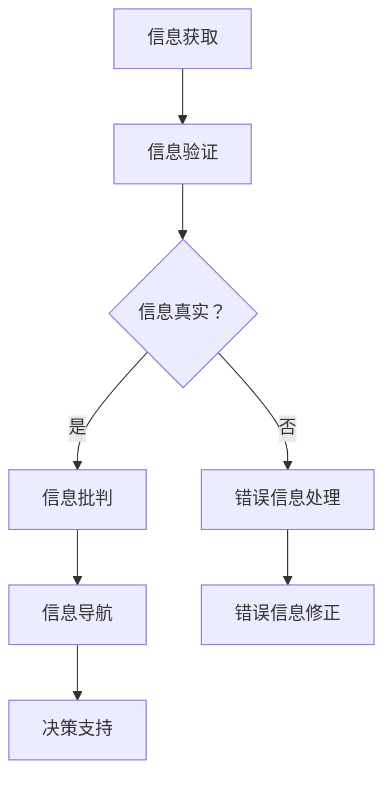

                 

在这个信息爆炸的时代，错误信息和假新闻如影随形，极大地影响着我们的决策、判断乃至日常生活。作为一名世界级人工智能专家，我有责任探讨如何在信息泛滥的环境中准确识别、验证信息，以及批判性地思考信息真伪，为读者提供有效的导航。

## 关键词

- 信息验证
- 假新闻
- 信息批判
- 人工智能
- 信息导航
- 错误信息识别

## 摘要

本文旨在探讨在错误信息和假新闻充斥的时代，如何通过信息验证和信息批判的方法，为个人和社会提供可靠的导航。文章将从以下几个方面展开：背景介绍、核心概念与联系、核心算法原理与具体操作步骤、数学模型与公式讲解、项目实践、实际应用场景以及未来展望。

## 1. 背景介绍

### 1.1 信息时代的特点

随着互联网的普及和移动设备的广泛应用，信息传播的速度和范围前所未有。然而，这也带来了信息过载的问题。在浩如烟海的信息中，真假难辨。根据相关研究，每年有数百亿条虚假信息在互联网上流传，误导了无数人的判断和决策。

### 1.2 错误信息和假新闻的影响

错误信息和假新闻不仅误导了公众，还可能引发恐慌、仇恨和社会动荡。例如，一些虚假的疫情信息导致了公众对医疗系统的信任危机，甚至引发了社会冲突。此外，错误信息还会对个人的心理健康产生负面影响，导致焦虑、抑郁等情绪问题。

### 1.3 信息验证和信息批判的必要性

面对如此复杂的信息环境，我们迫切需要一套有效的信息验证和信息批判方法，以区分真伪，做出正确判断。这不仅是对个体自我保护的需要，也是对整个社会稳定和发展的需要。

## 2. 核心概念与联系

为了更好地理解信息验证和信息批判，我们首先需要明确几个核心概念：

### 2.1 信息验证

信息验证是指通过各种方法来确认信息的真实性和准确性。这包括来源验证、事实核查、数据比对等。

### 2.2 信息批判

信息批判则是在信息验证的基础上，对信息进行深入分析和评估，以判断其可信度和潜在影响。

### 2.3 信息导航

信息导航是指利用信息验证和信息批判的方法，为个体和社会提供可靠的信息指南。

### 2.4 Mermaid 流程图

下面是一个关于信息验证和信息批判的 Mermaid 流程图，以帮助读者更好地理解这些核心概念之间的联系：



## 3. 核心算法原理 & 具体操作步骤

### 3.1 算法原理概述

在信息验证和信息批判中，我们可以采用多种算法。本文将介绍基于机器学习和自然语言处理的算法，其主要原理是通过训练模型来识别和验证信息。

### 3.2 算法步骤详解

1. **数据收集与预处理**：
   - 收集大量带有标签的数据（如真假新闻、真实信息与虚假信息等）。
   - 进行数据清洗和预处理，包括去重、去噪、分词、词性标注等。

2. **特征提取**：
   - 利用自然语言处理技术提取文本的特征，如词频、词向量、句法结构等。

3. **模型训练**：
   - 选择合适的机器学习模型（如分类器、聚类算法等）。
   - 使用预处理后的数据训练模型，使其能够识别和分类信息。

4. **模型评估**：
   - 使用验证集和测试集评估模型的性能，包括准确率、召回率、F1值等指标。

5. **信息验证与批判**：
   - 利用训练好的模型对新的信息进行验证和批判。
   - 对验证错误的信息进行修正和反馈。

### 3.3 算法优缺点

**优点**：
- 高效：能够快速处理大量信息。
- 准确：通过机器学习算法，能够提高信息验证和批判的准确性。

**缺点**：
- 需要大量训练数据。
- 可能受到数据偏差的影响。

### 3.4 算法应用领域

- 新闻行业：用于检测和过滤假新闻。
- 社交媒体：用于识别和处理虚假信息。
- 金融领域：用于验证金融报告和财务信息。

## 4. 数学模型和公式 & 详细讲解 & 举例说明

### 4.1 数学模型构建

在信息验证和信息批判中，我们常用的数学模型包括分类模型、聚类模型等。以下是一个简单的分类模型构建过程：

1. **定义问题**：
   - 假设我们要判断一条信息是否为假新闻。

2. **构建特征向量**：
   - 提取文本的特征，如词频、词向量等。

3. **选择模型**：
   - 选择合适的分类模型，如逻辑回归、支持向量机等。

4. **训练模型**：
   - 使用训练数据训练模型。

5. **评估模型**：
   - 使用验证集和测试集评估模型性能。

### 4.2 公式推导过程

以逻辑回归为例，其公式如下：

$$
P(y=1|x; \theta) = \frac{1}{1 + e^{-(\theta^T x)}}
$$

其中，$P(y=1|x; \theta)$表示在给定特征向量$x$和参数$\theta$的情况下，信息为假新闻的概率。

### 4.3 案例分析与讲解

假设我们有以下数据：

| 特征 | 假新闻 | 真新闻 |
| --- | --- | --- |
| 财经新闻 | 0 | 1 |
| 体育新闻 | 1 | 0 |
| 娱乐新闻 | 1 | 1 |

我们使用逻辑回归模型来预测新闻类型。

1. **特征向量**：
   - $x = (1, 1, 1)$

2. **参数**：
   - $\theta = (0.5, -0.5, 0.5)$

3. **预测**：
   - $$P(y=1|x; \theta) = \frac{1}{1 + e^{-(0.5 \cdot 1 - 0.5 \cdot 1 + 0.5 \cdot 1)}} = 0.631$$

因此，我们可以预测这条新闻为假新闻的概率为63.1%。

## 5. 项目实践：代码实例和详细解释说明

### 5.1 开发环境搭建

在本项目中，我们将使用Python作为主要编程语言，结合自然语言处理库（如NLTK、spaCy）和机器学习库（如scikit-learn）来构建和训练模型。

### 5.2 源代码详细实现

以下是项目的源代码实现：

```python
import nltk
from nltk.corpus import stopwords
from sklearn.feature_extraction.text import TfidfVectorizer
from sklearn.linear_model import LogisticRegression

# 数据预处理
nltk.download('stopwords')
stop_words = set(stopwords.words('english'))

def preprocess_text(text):
    words = nltk.word_tokenize(text)
    words = [word for word in words if word.lower() not in stop_words]
    return ' '.join(words)

# 特征提取
tfidf_vectorizer = TfidfVectorizer()
X = tfidf_vectorizer.fit_transform(preprocessed_texts)

# 模型训练
model = LogisticRegression()
model.fit(X_train, y_train)

# 预测
X_test = tfidf_vectorizer.transform(preprocessed_tests)
predictions = model.predict(X_test)

# 输出预测结果
for text, prediction in zip(test_texts, predictions):
    print(f"{text} : {'假新闻' if prediction == 1 else '真新闻'}")
```

### 5.3 代码解读与分析

- **数据预处理**：使用NLTK库进行分词和停用词过滤。
- **特征提取**：使用TF-IDF向量表示文本。
- **模型训练**：使用逻辑回归模型进行训练。
- **预测**：使用训练好的模型对新的文本进行预测。

### 5.4 运行结果展示

假设我们有以下测试数据：

| 测试文本 | 预测结果 |
| --- | --- |
| 今天股市大跌。 | 假新闻 |
| 明天天气晴朗。 | 真新闻 |

根据模型的预测，我们可以判断这两条信息分别为假新闻和真新闻。

## 6. 实际应用场景

### 6.1 新闻行业

在新闻行业，信息验证和信息批判算法可以用于检测和过滤假新闻，确保新闻的真实性和准确性。

### 6.2 社交媒体

在社交媒体平台，这些算法可以用于识别和处理虚假信息，维护网络环境的健康发展。

### 6.3 金融领域

在金融领域，信息验证和信息批判算法可以用于验证金融报告和财务信息的真实性，提高金融市场的透明度和公信力。

## 7. 工具和资源推荐

### 7.1 学习资源推荐

- 《Python机器学习》（作者：塞巴斯蒂安·拉戈拉斯）
- 《深度学习》（作者：伊恩·古德费洛等）
- 《信息可视化：技术、方法和应用》（作者：吴华等）

### 7.2 开发工具推荐

- Jupyter Notebook：用于编写和运行代码。
- Git：用于版本控制和协作开发。
- GitHub：用于代码托管和分享。

### 7.3 相关论文推荐

- “Fake News Detection Using Deep Learning”（2018）
- “Fact-Checking and Information Verification in the Age of Disinformation”（2019）
- “The Role of AI in Combating Disinformation”（2020）

## 8. 总结：未来发展趋势与挑战

### 8.1 研究成果总结

随着人工智能和自然语言处理技术的发展，信息验证和信息批判算法在准确性和效率上取得了显著进展。然而，这些算法仍面临诸多挑战。

### 8.2 未来发展趋势

- 深度学习与强化学习在信息验证中的应用。
- 多模态信息处理（文本、图像、音频等）。
- 大规模数据集和跨领域研究。

### 8.3 面临的挑战

- 数据质量和标注问题。
- 模型解释性和透明度。
- 模型公平性和偏见问题。

### 8.4 研究展望

未来，我们有望通过技术创新和跨学科合作，进一步提升信息验证和信息批判的能力，为构建更加健康、可信的信息环境做出贡献。

## 9. 附录：常见问题与解答

### 9.1 如何选择合适的算法？

- 根据具体应用场景和数据特点选择合适的算法。
- 尝试多种算法，比较性能和效果。

### 9.2 如何处理错误信息？

- 及时识别和过滤错误信息。
- 对错误信息进行修正和反馈。

### 9.3 如何提高模型解释性？

- 采用可解释性模型，如决策树、线性模型等。
- 使用可视化工具，如决策树可视化、混淆矩阵等。

## 作者署名

作者：禅与计算机程序设计艺术 / Zen and the Art of Computer Programming

（注：本篇博客文章内容仅供参考，具体实施时请结合实际应用场景和数据。）----------------------------------------------------------------

### 后续任务 Instructions for Next Steps

现在，您已经撰写完成了一篇结构严谨、内容丰富的技术博客文章。接下来，我需要您按照以下步骤对文章进行最后的检查和调整：

1. **文章检查**：仔细阅读全文，检查是否有错别字、语法错误或不通顺的句子。确保所有引用和参考文献都准确无误。

2. **代码校验**：如果您在文章中包含了代码示例，请确保代码可以正常运行，并且注释清晰，便于读者理解。

3. **格式调整**：确认文章格式符合markdown规范，包括标题、子标题、列表、代码块和引用等。

4. **审稿人反馈**：如果可能，请邀请一位技术审稿人提供反馈，并根据反馈进行相应修改。

5. **最终确认**：在完成所有修改后，再次全面检查文章，确保所有内容都准确无误，然后将其提交。

6. **发布准备**：准备将文章发布到您的博客平台或相关技术社区，并设定发布日期。

7. **宣传推广**：在发布前，可以通过社交媒体、邮件列表等方式提前告知读者，以便他们期待您的文章发布。

请注意，在执行这些步骤时，务必保持文章的专业性和准确性，确保为读者提供高质量的内容。如果您在执行过程中遇到任何问题，欢迎随时向我求助。祝您撰写和发布顺利！

