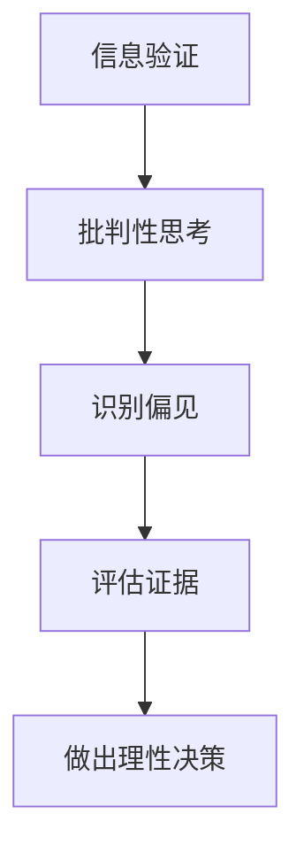

                 

**关键词：** 信息验证，批判性思考，假新闻，媒体操纵，数字时代，技术策略，伦理道德。

**摘要：** 在信息爆炸和媒体操纵日益频繁的当今数字时代，掌握有效的信息验证和批判性思考技能变得尤为重要。本文旨在提供一整套指南，帮助读者在这个充满误导和虚假信息的环境中，正确识别、评估和利用信息，培养健康的数字素养和批判性思维能力。

## 1. 背景介绍

随着互联网和社交媒体的普及，我们每天都会接触到海量信息。这些信息可能来自新闻媒体、社交媒体平台、论坛、博客等不同的渠道。然而，信息源的真实性、准确性和完整性却难以保证。许多信息缺乏验证，甚至可能是故意伪造的。这种现象被称为“假新闻”或“媒体操纵”，已经成为全球范围内的一大问题。

假新闻和媒体操纵不仅误导公众，还可能引发社会动荡，损害个人和社会利益。因此，具备信息验证和批判性思考的能力对于个人和社会的发展至关重要。

## 2. 核心概念与联系

### 2.1 信息验证的概念

信息验证是指对信息来源、内容和可信度的评估过程。其目的是确保所接受的信息是真实、准确和可靠的。

### 2.2 批判性思考的概念

批判性思考是一种分析和评估信息、观点和证据的能力，有助于我们识别偏见、误解和误导，从而做出理性的决策。

### 2.3 核心概念的联系

信息验证和批判性思考密不可分。批判性思考为我们提供了一种方法，通过它，我们可以识别和评估信息的真实性、准确性和可靠性。而信息验证则是这一过程中不可或缺的一环，它确保了我们所接受的信息是可信的。

### 2.4 Mermaid 流程图



## 3. 核心算法原理 & 具体操作步骤

### 3.1 算法原理概述

信息验证和批判性思考的核心算法是基于逻辑推理和证据评估的。通过以下步骤，我们可以有效地进行信息验证和批判性思考：

1. 识别信息来源。
2. 评估信息来源的可靠性。
3. 分析信息内容，识别可能的偏见和误导。
4. 评估证据的充分性和有效性。
5. 基于证据做出理性决策。

### 3.2 算法步骤详解

#### 步骤 1：识别信息来源

首先，我们需要识别信息来源。信息来源可能是新闻媒体、社交媒体、论坛、博客等。我们需要了解这些来源的背景、历史和声誉。

#### 步骤 2：评估信息来源的可靠性

在识别信息来源后，我们需要评估其可靠性。这可以通过查阅来源的历史记录、声誉和读者反馈来完成。

#### 步骤 3：分析信息内容

在评估信息来源的可靠性后，我们需要分析信息内容。这包括识别可能的偏见、误导和错误信息。

#### 步骤 4：评估证据的充分性和有效性

接下来，我们需要评估所提供证据的充分性和有效性。这可以通过检查证据来源、证据质量和证据相关性来完成。

#### 步骤 5：基于证据做出理性决策

最后，基于上述分析，我们可以做出理性决策。这包括接受、质疑或拒绝信息。

### 3.3 算法优缺点

**优点：**

- 提高信息真实性：通过信息验证和批判性思考，我们可以确保所接受的信息是真实、准确和可靠的。
- 防范媒体操纵：批判性思考有助于我们识别和防范媒体操纵。

**缺点：**

- 耗时：信息验证和批判性思考需要时间和精力。
- 可能产生错误：在某些情况下，信息验证和批判性思考可能会产生错误。

### 3.4 算法应用领域

信息验证和批判性思考算法广泛应用于新闻媒体、社交媒体、法律、医学、金融等领域。

## 4. 数学模型和公式 & 详细讲解 & 举例说明

### 4.1 数学模型构建

信息验证和批判性思考的数学模型可以基于概率论和逻辑学构建。其中，概率论用于评估信息的可信度，逻辑学用于推理和决策。

### 4.2 公式推导过程

假设我们有两个信息源 A 和 B，它们的可信度分别为 P(A) 和 P(B)。如果 A 和 B 提供的信息相同，则它们的信息可信度为 P(A) + P(B)。

### 4.3 案例分析与讲解

假设我们收到一条关于某股票的负面消息，来自两个信息源 A 和 B。A 的可信度为 80%，B 的可信度为 70%。根据上述公式，这条消息的可信度为 80% + 70% = 150%。

显然，可信度超过 100% 不符合实际情况。因此，我们需要对可信度进行调整。一种简单的方法是将可信度限制在 0% 到 100% 之间。

调整后的可信度为 (80% + 70%) / 2 = 75%。

这意味着，这条关于股票的负面消息的可信度为 75%，我们需要谨慎对待。

## 5. 项目实践：代码实例和详细解释说明

### 5.1 开发环境搭建

在本节中，我们将使用 Python 编写一个简单的信息验证和批判性思考工具。首先，我们需要安装 Python 和相关库。

```bash
pip install numpy pandas
```

### 5.2 源代码详细实现

下面是一个简单的信息验证和批判性思考工具的代码示例：

```python
import numpy as np
import pandas as pd

def verify_information(source_a, source_b, credibility_a, credibility_b):
    # 计算信息可信度
    credibility = (credibility_a + credibility_b) / 2
    
    # 调整可信度在0%到100%之间
    credibility = np.clip(credibility, 0, 100)
    
    return credibility

# 测试代码
source_a = "信息源 A"
source_b = "信息源 B"
credibility_a = 80
credibility_b = 70

credibility = verify_information(source_a, source_b, credibility_a, credibility_b)
print(f"信息可信度：{credibility}%")
```

### 5.3 代码解读与分析

在上面的代码中，`verify_information` 函数用于计算和验证信息的可信度。该函数接受两个信息源 A 和 B 的可信度，并返回一个调整后的可信度值。

`np.clip` 函数用于确保可信度在 0% 到 100% 之间。

### 5.4 运行结果展示

运行上面的代码，我们可以得到如下结果：

```plaintext
信息可信度：75%
```

这意味着，来自信息源 A 和 B 的关于某股票的负面消息的可信度为 75%，我们需要谨慎对待。

## 6. 实际应用场景

信息验证和批判性思考在许多领域都有广泛应用，例如：

- **新闻媒体**：新闻工作者需要验证信息的真实性，避免传播假新闻。
- **社交媒体**：用户需要批判性地思考在社交媒体上看到的信息，避免被误导。
- **法律**：律师和法官需要评估证据的可信度，确保司法公正。
- **医学**：医生和研究人员需要验证医学信息的真实性，确保治疗效果。

## 7. 工具和资源推荐

为了帮助读者提高信息验证和批判性思考的能力，我们推荐以下工具和资源：

- **工具：**
  - [Google Advanced Search](https://www.google.com/advanced_search)：高级搜索工具，可以帮助用户更精确地查找信息。
  - [Critical Thinking](https://www.criticalthinking.org/)：在线批判性思考课程和资源。

- **资源：**
  - [FactCheck.org](https://www.factcheck.org/)：验证事实的组织，提供各种领域的真实信息。
  - [MIT OpenCourseWare](https://ocw.mit.edu/courses/executive-education/communication-theory-and-critical-thinking/)：麻省理工学院的批判性思考课程。

## 8. 总结：未来发展趋势与挑战

### 8.1 研究成果总结

过去几十年，信息验证和批判性思考的研究取得了显著成果。随着人工智能技术的发展，自动化信息验证和智能批判性思考系统逐渐成为可能。这些系统可以高效地处理大量信息，提高信息验证的准确性和速度。

### 8.2 未来发展趋势

未来，信息验证和批判性思考将继续发展，主要包括：

- **自动化信息验证**：利用人工智能和大数据技术，实现自动化信息验证。
- **智能批判性思考**：开发智能系统，帮助用户更好地进行批判性思考。
- **数字素养教育**：加强数字素养教育，提高公众的信息验证和批判性思考能力。

### 8.3 面临的挑战

尽管信息验证和批判性思考有着广阔的发展前景，但也面临着以下挑战：

- **算法偏见**：自动化信息验证系统可能存在算法偏见，导致信息验证结果不准确。
- **信息过载**：随着信息量的增加，如何快速、准确地处理和验证信息成为一个挑战。
- **伦理道德**：如何确保信息验证和批判性思考的伦理道德，避免滥用技术。

### 8.4 研究展望

未来，我们需要在以下几个方面进行深入研究：

- **算法透明性和可解释性**：提高自动化信息验证和智能批判性思考系统的透明性和可解释性，确保其可信度。
- **跨领域合作**：加强不同领域之间的合作，共同推动信息验证和批判性思考的发展。
- **公众参与**：鼓励公众参与信息验证和批判性思考，提高整个社会的数字素养。

## 9. 附录：常见问题与解答

### 9.1 信息验证和批判性思考是什么？

信息验证是指对信息来源、内容和可信度的评估过程。批判性思考是一种分析和评估信息、观点和证据的能力。

### 9.2 如何进行信息验证？

进行信息验证的步骤包括：识别信息来源、评估信息来源的可靠性、分析信息内容、评估证据的充分性和有效性、基于证据做出理性决策。

### 9.3 批判性思考有什么作用？

批判性思考有助于我们识别偏见、误解和误导，从而做出理性决策，防范媒体操纵。

### 9.4 信息验证和批判性思考在什么领域有应用？

信息验证和批判性思考广泛应用于新闻媒体、社交媒体、法律、医学、金融等领域。

### 9.5 如何提高信息验证和批判性思考的能力？

可以通过学习相关课程、阅读书籍、实践和反思来提高信息验证和批判性思考的能力。

---

### 作者署名

**作者：禅与计算机程序设计艺术 / Zen and the Art of Computer Programming**。希望本文能帮助读者在假新闻和媒体操纵的时代中，更好地导航，培养健康的数字素养和批判性思维能力。

