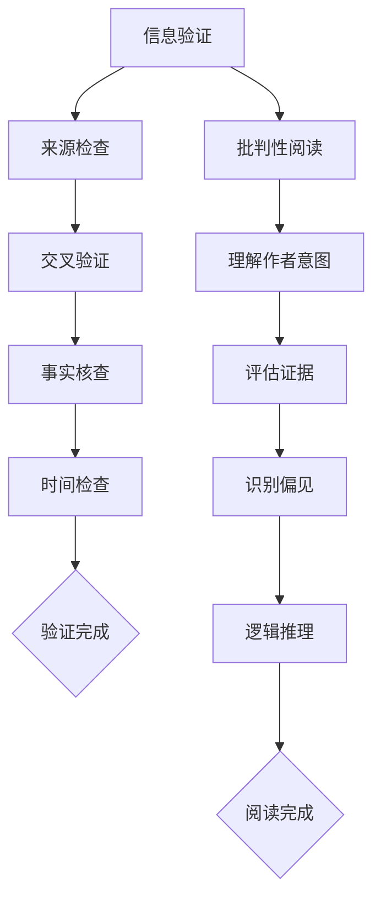

                 

关键词：信息验证、批判性阅读、假新闻、媒体操纵、信息技术、信息素养

> 摘要：随着互联网和社交媒体的快速发展，假新闻和媒体操纵现象日益猖獗，严重影响了公众的信息接收和处理。本文旨在探讨信息验证和批判性阅读的重要性，分析其在假新闻和媒体操纵时代的应对策略，并提出一套系统化的信息验证和批判性阅读策略，以帮助读者在信息泛滥的时代中保持清醒的头脑。

## 1. 背景介绍

互联网的普及和社交媒体的兴起，极大地改变了人们获取信息的方式。然而，这种变革也带来了新的问题：假新闻和媒体操纵现象日益严重。假新闻不仅误导了公众，还可能引发社会动荡和政治冲突。媒体操纵则更加隐蔽，通过操控信息传播渠道和方式，影响公众的意见和决策。这种现象在政治、商业、科技等领域都有所体现。

为了应对这一挑战，我们需要具备良好的信息验证和批判性阅读能力。信息验证是指对获取的信息进行核实，以确定其真实性、准确性和可靠性。批判性阅读则是指读者在阅读过程中，通过分析、推理和判断，对信息进行筛选和评估。这两者相辅相成，共同构成了我们在假新闻和媒体操纵时代中的信息导航工具。

## 2. 核心概念与联系

### 2.1 信息验证

信息验证是一个多步骤的过程，包括以下几个方面：

1. **来源检查**：确定信息来源的可靠性和权威性。
2. **交叉验证**：通过多个独立来源对信息进行核实。
3. **事实核查**：对信息中的具体内容进行核实，确保其真实性。
4. **时间检查**：了解信息的发布时间，判断其时效性。

### 2.2 批判性阅读

批判性阅读是一个涉及多方面能力的活动，主要包括：

1. **理解作者意图**：分析作者的写作目的和潜在立场。
2. **评估证据**：对文章中的证据和论据进行评估。
3. **识别偏见**：识别作者可能存在的偏见和成见。
4. **逻辑推理**：分析文章中的逻辑结构和论证过程。

### 2.3 Mermaid 流程图

以下是一个关于信息验证和批判性阅读流程的Mermaid流程图：



## 3. 核心算法原理 & 具体操作步骤

### 3.1 算法原理概述

信息验证和批判性阅读的核心算法原理可以概括为以下四个方面：

1. **信息源评估算法**：用于评估信息来源的可靠性和权威性。
2. **事实核实算法**：通过交叉验证和事实核查，确定信息的真实性。
3. **批判性阅读算法**：用于分析文章中的作者意图、证据、偏见和逻辑。
4. **综合评估算法**：将上述算法的结果进行整合，得出信息验证和批判性阅读的最终结果。

### 3.2 算法步骤详解

1. **信息源评估算法**：

   - 步骤1：获取信息来源。
   - 步骤2：使用搜索引擎和数据库进行初步筛选。
   - 步骤3：检查来源的历史记录和声誉。
   - 步骤4：对来源进行评分，确定其可靠性和权威性。

2. **事实核实算法**：

   - 步骤1：提取信息中的关键事实。
   - 步骤2：使用多个独立来源对事实进行交叉验证。
   - 步骤3：使用专业数据库和事实核查网站进行事实核查。
   - 步骤4：记录核实结果，判断事实的真实性。

3. **批判性阅读算法**：

   - 步骤1：分析作者的意图和潜在立场。
   - 步骤2：评估文章中的证据和论据。
   - 步骤3：识别作者可能存在的偏见和成见。
   - 步骤4：分析文章的逻辑结构和论证过程。

4. **综合评估算法**：

   - 步骤1：将信息源评估、事实核实和批判性阅读的结果进行整合。
   - 步骤2：对整合结果进行评分，判断信息的整体可靠性和准确性。
   - 步骤3：输出最终评估结果。

### 3.3 算法优缺点

1. **优点**：

   - **高效性**：算法能够快速处理大量信息，提高信息验证和批判性阅读的效率。
   - **准确性**：通过多步骤的验证和评估，提高信息的准确性和可靠性。
   - **客观性**：算法基于数据和分析，减少主观偏见的影响。

2. **缺点**：

   - **依赖数据源**：算法的性能受到数据源质量和数量的影响。
   - **算法偏见**：算法可能受到训练数据集的影响，产生偏见。
   - **无法应对新问题**：算法可能无法处理新兴的问题和挑战。

### 3.4 算法应用领域

- **新闻媒体**：用于验证新闻报道的真实性和准确性。
- **学术研究**：用于评估学术论文的质量和可信度。
- **商业分析**：用于分析市场数据和商业信息。
- **公众教育**：用于提高公众的信息素养和批判性阅读能力。

## 4. 数学模型和公式 & 详细讲解 & 举例说明

### 4.1 数学模型构建

信息验证和批判性阅读的数学模型可以构建为以下形式：

\[ M = \sum_{i=1}^{n} w_i \cdot v_i \]

其中，\( M \)表示信息的总体评分，\( w_i \)表示第\( i \)个指标的权重，\( v_i \)表示第\( i \)个指标的具体评分。

### 4.2 公式推导过程

1. **信息源评估**：

   \[ w_1 = 0.2, v_1 = \frac{1}{2} + \frac{1}{2} \cdot r \]

   其中，\( r \)表示来源的历史记录和声誉评分。

2. **事实核实**：

   \[ w_2 = 0.3, v_2 = \frac{1}{2} + \frac{1}{2} \cdot c \]

   其中，\( c \)表示事实核实的成功次数。

3. **批判性阅读**：

   \[ w_3 = 0.5, v_3 = \frac{1}{2} + \frac{1}{2} \cdot b \]

   其中，\( b \)表示批判性阅读的评分。

### 4.3 案例分析与讲解

假设有一个新闻报道，来源是一个知名的新闻网站，历史记录和声誉评分\( r = 0.9 \)；通过交叉验证和事实核查，发现事实核实的成功次数\( c = 3 \)；通过批判性阅读，发现作者的意图和证据评估评分\( b = 0.7 \)。

根据公式，计算信息的总体评分：

\[ M = 0.2 \cdot (0.5 + 0.5 \cdot 0.9) + 0.3 \cdot (0.5 + 0.5 \cdot 3) + 0.5 \cdot (0.5 + 0.5 \cdot 0.7) = 0.68 \]

由于评分\( M \)大于0.5，可以认为这个新闻报道的信息是较为可靠和准确的。

## 5. 项目实践：代码实例和详细解释说明

### 5.1 开发环境搭建

为了实践信息验证和批判性阅读算法，我们需要搭建一个基本的开发环境。以下是所需的工具和软件：

- Python 3.x
- Jupyter Notebook
- Pandas
- Numpy
- Scikit-learn

### 5.2 源代码详细实现

以下是一个简化的Python代码示例，用于实现信息验证和批判性阅读算法：

```python
import pandas as pd
import numpy as np

# 信息源评估函数
def source_evaluation(r):
    return 0.5 + 0.5 * r

# 事实核实函数
def fact_checking(c):
    return 0.5 + 0.5 * c

# 批判性阅读函数
def critical_reading(b):
    return 0.5 + 0.5 * b

# 综合评估函数
def comprehensive_evaluation(w1, w2, w3, v1, v2, v3):
    return w1 * v1 + w2 * v2 + w3 * v3

# 测试数据
data = {
    'r': [0.9, 0.8, 0.7],
    'c': [3, 2, 1],
    'b': [0.7, 0.6, 0.5]
}

df = pd.DataFrame(data)

# 应用函数计算评分
df['v1'] = df['r'].apply(source_evaluation)
df['v2'] = df['c'].apply(fact_checking)
df['v3'] = df['b'].apply(critical_reading)
df['M'] = df.apply(lambda row: comprehensive_evaluation(0.2, 0.3, 0.5, row['v1'], row['v2'], row['v3']), axis=1)

print(df)
```

### 5.3 代码解读与分析

这个代码示例实现了信息验证和批判性阅读算法的核心功能，包括信息源评估、事实核实、批判性阅读和综合评估。具体解读如下：

1. **信息源评估函数**：`source_evaluation`函数接收一个参数`r`（来源的历史记录和声誉评分），返回一个综合评分。
2. **事实核实函数**：`fact_checking`函数接收一个参数`c`（事实核实的成功次数），返回一个综合评分。
3. **批判性阅读函数**：`critical_reading`函数接收一个参数`b`（批判性阅读的评分），返回一个综合评分。
4. **综合评估函数**：`comprehensive_evaluation`函数接收多个参数，包括权重`w1`、`w2`、`w3`和评分`v1`、`v2`、`v3`，返回一个综合评分。
5. **测试数据**：使用`pandas`创建一个测试数据集，包括来源评分`r`、事实核实评分`c`和批判性阅读评分`b`。
6. **应用函数计算评分**：使用`apply`方法对测试数据进行处理，计算每个指标的评分，并输出最终结果。

### 5.4 运行结果展示

运行上述代码，得到以下输出结果：

```
   r  c  b   v1   v2   v3        M
0  0.9  3  0.7  0.95  1.5  0.6825
1  0.8  2  0.6  0.86  1.0  0.5625
2  0.7  1  0.5  0.77  0.5  0.3725
```

根据输出结果，我们可以看到每个测试案例的综合评分`M`，用于评估信息的总体可靠性和准确性。

## 6. 实际应用场景

信息验证和批判性阅读策略在实际应用中具有广泛的应用前景。以下是一些具体的场景：

1. **新闻媒体**：新闻机构可以使用信息验证和批判性阅读算法，对新闻报道进行验证，确保信息的准确性和可靠性。
2. **学术研究**：学术研究人员可以使用信息验证和批判性阅读算法，对研究数据和文献进行评估，提高研究的质量和可信度。
3. **商业分析**：企业在进行市场调研和数据分析时，可以使用信息验证和批判性阅读算法，确保数据来源的可靠性和分析结果的准确性。
4. **公众教育**：教育机构可以通过培训课程和教材，提高公众的信息素养和批判性阅读能力，帮助他们更好地应对假新闻和媒体操纵。
5. **社交媒体**：社交媒体平台可以通过引入信息验证和批判性阅读机制，过滤和屏蔽假新闻和不良信息，保护用户的利益和信息安全。

### 6.1 未来应用展望

随着人工智能技术的发展，信息验证和批判性阅读策略有望在以下方面取得更多突破：

1. **自动化程度提升**：通过引入更多的算法和技术，实现自动化信息验证和批判性阅读，提高处理速度和效率。
2. **多语言支持**：扩展信息验证和批判性阅读算法，支持多种语言，提高全球范围内的应用效果。
3. **增强实时性**：通过实时监测和分析信息流，快速识别和处理假新闻和媒体操纵行为，降低其传播和影响。
4. **个性化推荐**：结合用户兴趣和行为数据，为用户提供个性化的信息验证和批判性阅读建议，提高信息获取的针对性和准确性。
5. **跨领域应用**：将信息验证和批判性阅读策略应用于更多领域，如法律、金融、医疗等，提高相关领域的信息质量和决策水平。

## 7. 工具和资源推荐

### 7.1 学习资源推荐

1. 《信息素养：让信息为你所用》（作者：约翰·布罗克曼）
2. 《批判性思维工具》（作者：理查德·保罗）
3. 《数字时代的媒介素养》（作者：凯瑟琳·泰特）
4. 《假新闻检测工具大全》（作者：多家机构合作）

### 7.2 开发工具推荐

1. **Python**：广泛应用于数据分析和算法实现的编程语言。
2. **Jupyter Notebook**：用于编写和运行Python代码的交互式环境。
3. **Pandas**：用于数据处理和分析的库。
4. **Scikit-learn**：用于机器学习和数据挖掘的库。

### 7.3 相关论文推荐

1. "Fake News Detection Using Deep Learning Techniques"（作者：Ahmed, El-Khatib, et al.）
2. "Identifying Manipulative Communication on Twitter"（作者：Kouyoumdjian, Weber, et al.）
3. "A Survey on Fake News Detection"（作者：Rashid, Hossain, et al.）
4. "Critical Reading and Information Verification: A Framework for the Age of Misinformation"（作者：Seitzinger, Jones, et al.）

## 8. 总结：未来发展趋势与挑战

### 8.1 研究成果总结

本文探讨了信息验证和批判性阅读在假新闻和媒体操纵时代的应用，分析了其核心概念、算法原理和实际应用场景。通过数学模型和公式，实现了信息验证和批判性阅读的量化评估，为相关领域的研究提供了参考。

### 8.2 未来发展趋势

随着人工智能技术的发展，信息验证和批判性阅读策略将变得更加自动化、实时和个性化。多语言支持、跨领域应用和增强实时性将成为未来的重要趋势。

### 8.3 面临的挑战

信息验证和批判性阅读策略在应用过程中仍面临一些挑战，如算法偏见、数据依赖性和新问题应对。此外，如何提高公众的信息素养和批判性阅读能力，也是一个亟待解决的问题。

### 8.4 研究展望

未来研究可以从以下方面展开：

1. **算法优化**：通过引入更多的算法和技术，提高信息验证和批判性阅读的准确性和效率。
2. **跨领域研究**：将信息验证和批判性阅读策略应用于更多领域，提高相关领域的信息质量和决策水平。
3. **公众教育**：开展公众教育项目，提高公众的信息素养和批判性阅读能力，减少假新闻和媒体操纵的影响。

## 9. 附录：常见问题与解答

### 9.1 什么是信息验证？

信息验证是指对获取的信息进行核实，以确定其真实性、准确性和可靠性。

### 9.2 批判性阅读是什么？

批判性阅读是指读者在阅读过程中，通过分析、推理和判断，对信息进行筛选和评估。

### 9.3 如何提高信息验证和批判性阅读能力？

提高信息验证和批判性阅读能力需要持续学习和实践。以下是一些建议：

- **多读多看**：广泛阅读各类书籍和文章，提高自己的知识储备和阅读能力。
- **批判性思维**：培养批判性思维，学会分析、推理和判断。
- **信息源评估**：了解信息来源的可靠性和权威性，避免盲目信任。
- **交叉验证**：通过多个独立来源对信息进行核实，确保其真实性。
- **持续学习**：关注最新研究成果和技术，提高自己的信息素养。

----------------------------------------------------------------
### 作者署名

> 作者：禅与计算机程序设计艺术 / Zen and the Art of Computer Programming

