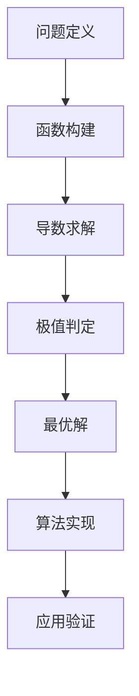

                 

关键词：极值原理，数学，编程，算法，优化，问题解决，计算机科学

> 摘要：本文探讨了极值原理在计算机科学中的应用，通过深入剖析数学家是如何思考和解决问题的，为程序员提供了一种新的思考模式和工具。文章将介绍极值原理的基本概念、算法原理及其应用，并通过具体实例展示如何在实际项目中运用这些原理。

## 1. 背景介绍

极值原理是数学分析中的一个基本概念，它描述了函数在某个区间内的最大值或最小值问题。在计算机科学中，极值原理有着广泛的应用，特别是在算法设计和优化中。通过利用极值原理，我们可以高效地解决各种复杂的问题，如资源分配、网络优化、图像处理等。

本文将从极值原理的基本概念出发，详细探讨其算法原理和应用。首先，我们将介绍极值原理的核心概念，并利用Mermaid流程图展示其原理架构。接着，我们将深入分析核心算法的原理和具体操作步骤，并探讨其优缺点和应用领域。此外，我们还将使用数学模型和公式详细讲解极值原理的实现过程，并通过实际项目中的代码实例进行说明。最后，我们将探讨极值原理在实际应用中的场景和未来展望。

通过本文的阅读，读者将能够深入了解极值原理的基本概念和算法原理，掌握其在计算机科学中的应用技巧，并能够运用这些原理解决实际问题。

## 2. 核心概念与联系

### 2.1 极值原理的基本概念

极值原理是指，对于一个函数在其定义域内，一定存在最大值或最小值。具体来说，对于连续函数$f(x)$在区间$[a, b]$上，存在$x_0$使得$f(x_0)$为最大值或最小值。

在计算机科学中，极值原理常常用于解决优化问题，如寻找最短路径、最大子序列和、最优资源分配等。通过确定目标函数的极值，我们可以找到最优解。

### 2.2 极值原理的数学模型

为了更好地理解极值原理，我们可以将其转化为数学模型。设$f(x)$为定义在区间$[a, b]$上的连续函数，我们需要找到$f(x)$的最大值或最小值。

#### 2.2.1 最大值

假设$f(x)$在$x_0$处取得最大值，那么对于任意$x \in [a, b]$，都有$f(x) \leq f(x_0)$。根据导数的定义，如果$f(x)$在$x_0$处可导，那么有：

$$ f'(x_0) = 0 $$

#### 2.2.2 最小值

同理，假设$f(x)$在$x_0$处取得最小值，那么对于任意$x \in [a, b]$，都有$f(x) \geq f(x_0)$。如果$f(x)$在$x_0$处可导，则有：

$$ f'(x_0) = 0 $$

### 2.3 极值原理的架构

为了直观地展示极值原理的架构，我们可以使用Mermaid流程图来描述其核心节点和关系。



在上述流程图中，A表示问题定义，即确定需要优化的目标函数；B表示函数构建，将实际问题转化为数学模型；C表示导数求解，用于判断函数的极值点；D表示极值判定，根据导数求解结果判断是否为极值点；E表示最优解，找到函数的最大值或最小值；F表示算法实现，根据极值原理实现求解算法；G表示应用验证，验证算法在实际问题中的应用效果。

### 2.4 极值原理的应用领域

极值原理在计算机科学中有着广泛的应用领域，以下列举几个典型的应用场景：

1. **最优化问题**：寻找最短路径、最大子序列和、最优资源分配等。
2. **数据分析**：回归分析、聚类分析、时间序列分析等。
3. **机器学习**：优化模型参数、提升模型性能等。
4. **图像处理**：图像分割、图像增强、图像压缩等。
5. **金融工程**：期权定价、风险管理等。

通过上述内容，我们了解了极值原理的基本概念、数学模型和架构，以及其在计算机科学中的应用领域。在接下来的章节中，我们将深入探讨极值原理的算法原理和具体实现过程。

## 3. 核心算法原理 & 具体操作步骤

### 3.1 算法原理概述

极值原理的核心算法是基于导数的求解。在数学中，导数表示函数在某一点的变化率。对于连续函数，当其导数为零时，函数在该点取得极值。因此，我们可以通过求解导数为零的点来找到函数的极值。

在计算机科学中，求解极值问题通常采用迭代方法，如梯度下降法、牛顿法等。这些方法通过不断逼近极值点，逐步优化目标函数。具体来说，我们可以按照以下步骤进行操作：

1. **问题定义**：确定需要优化的目标函数。
2. **函数构建**：将实际问题转化为数学模型，构建目标函数。
3. **导数求解**：计算目标函数的导数，并求解导数为零的点。
4. **极值判定**：根据导数求解结果，判断是否为极值点。
5. **最优解**：找到函数的最大值或最小值。

### 3.2 算法步骤详解

#### 3.2.1 问题定义

首先，我们需要明确需要优化的目标函数。例如，在寻找最短路径的问题中，目标函数可以是两个节点之间的距离。

#### 3.2.2 函数构建

接下来，我们需要将实际问题转化为数学模型。例如，在最短路径问题中，我们可以定义一个函数，表示从起点到终点的总距离。

#### 3.2.3 导数求解

为了求解导数为零的点，我们需要计算目标函数的导数。在数学中，导数可以通过求极限的方法得到。在计算机科学中，我们可以通过数值方法（如差分法）近似求解导数。

#### 3.2.4 极值判定

通过求解导数为零的点，我们可以初步判断这些点是否为极值点。具体来说，如果目标函数的二阶导数在极值点处大于零，则该点为最小值；如果二阶导数小于零，则该点为最大值。

#### 3.2.5 最优解

最后，我们需要找到函数的最大值或最小值。对于连续函数，极值点可能是局部极值，也可能是全局极值。为了找到全局最优解，我们可以采用全局优化算法，如模拟退火、遗传算法等。

### 3.3 算法优缺点

#### 优点

1. **通用性强**：极值原理适用于各种优化问题，如最优化问题、数据分析、机器学习等。
2. **求解高效**：利用导数求解极值的方法具有较高的求解效率。
3. **适用范围广**：极值原理在计算机科学、工程、经济等多个领域都有广泛应用。

#### 缺点

1. **对目标函数的要求较高**：极值原理要求目标函数连续可导，对于不满足这一条件的函数，需要采用其他方法求解。
2. **求解精度有限**：数值方法求解导数时，精度受到限制，可能导致求解结果不准确。
3. **计算复杂度高**：对于大规模问题，求解导数和极值点的计算复杂度较高。

### 3.4 算法应用领域

#### 3.4.1 最优化问题

极值原理在解决最优化问题中具有重要作用，如最短路径问题、最大子序列和问题、最优资源分配问题等。

#### 3.4.2 数据分析

在数据分析领域，极值原理广泛应用于回归分析、聚类分析、时间序列分析等，用于寻找数据中的最佳模型或参数。

#### 3.4.3 机器学习

在机器学习中，极值原理用于优化模型参数，提升模型性能。如梯度下降法、牛顿法等都是基于极值原理的优化算法。

#### 3.4.4 图像处理

在图像处理领域，极值原理用于图像分割、图像增强、图像压缩等。例如，基于阈值分割的图像处理方法就是利用极值原理找到最优阈值。

通过上述内容，我们详细介绍了极值原理的算法原理和具体操作步骤，并分析了其优缺点和应用领域。在下一章节中，我们将进一步探讨极值原理在数学模型和公式中的具体实现过程。

## 4. 数学模型和公式 & 详细讲解 & 举例说明

### 4.1 数学模型构建

在极值原理中，数学模型的构建至关重要。我们需要将实际问题转化为数学语言，以便利用数学工具进行求解。以下是一个简单的示例：

#### 示例 1：最短路径问题

假设在一个无向图中，我们需要找到从起点A到终点B的最短路径。我们可以定义一个函数$f(S)$，表示从起点A到集合S中所有节点的总距离。

$$ f(S) = \sum_{s \in S} d(A, s) $$

其中，$d(A, s)$表示从A到s的距离。

#### 示例 2：最大子序列和问题

给定一个整数数组$A = \{a_1, a_2, ..., a_n\}$，我们需要找到子序列和最大的子序列。我们可以定义一个函数$f(S)$，表示子序列S的和。

$$ f(S) = \sum_{s \in S} a_s $$

### 4.2 公式推导过程

在数学模型构建完成后，我们需要推导出求解极值的公式。以下是一个简单的示例：

#### 示例 1：最短路径问题

假设$f(S)$是关于集合S的连续可微函数，且$f(S)$在$S \neq \varnothing$时满足以下条件：

1. $f(S)$在$S$中任意两点之间的距离上是凸函数。
2. $f(\varnothing) = 0$。

我们需要找到使得$f(S)$最小的集合S。

根据极值原理，如果$f(S)$在$x_0$处取得最小值，那么：

$$ f'(x_0) = 0 $$

对于我们的例子，我们有：

$$ f'(S) = \frac{\partial}{\partial S} \sum_{s \in S} d(A, s) = \sum_{s \in S} \frac{\partial}{\partial S} d(A, s) $$

由于$d(A, s)$是关于s的凸函数，其导数$\frac{\partial}{\partial S} d(A, s)$在$S$中任意两点之间的距离上都是非负的。因此，当$f'(S) = 0$时，我们得到：

$$ \sum_{s \in S} \frac{\partial}{\partial S} d(A, s) = 0 $$

这意味着集合S中的每个元素都是起点A的邻居节点。

#### 示例 2：最大子序列和问题

假设$f(S)$是关于集合S的连续可微函数，且$f(S)$在$S \neq \varnothing$时满足以下条件：

1. $f(S)$在$S$中任意两点之间的距离上是凸函数。
2. $f(\varnothing) = 0$。

我们需要找到使得$f(S)$最大的集合S。

根据极值原理，如果$f(S)$在$x_0$处取得最大值，那么：

$$ f'(x_0) = 0 $$

对于我们的例子，我们有：

$$ f'(S) = \frac{\partial}{\partial S} \sum_{s \in S} a_s = \sum_{s \in S} \frac{\partial}{\partial S} a_s $$

由于$a_s$是关于s的凸函数，其导数$\frac{\partial}{\partial S} a_s$在$S$中任意两点之间的距离上都是非负的。因此，当$f'(S) = 0$时，我们得到：

$$ \sum_{s \in S} \frac{\partial}{\partial S} a_s = 0 $$

这意味着集合S中的每个元素都是数组A中的元素。

### 4.3 案例分析与讲解

为了更好地理解极值原理，我们通过一个具体案例进行分析。

#### 案例：寻找最大子序列和

给定一个整数数组$A = \{1, -2, 3, 4, -5, 6\}$，我们需要找到子序列和最大的子序列。

根据极值原理，我们可以定义一个函数$f(S)$，表示子序列S的和。我们需要找到使得$f(S)$最大的集合S。

首先，我们计算$f(S)$的导数：

$$ f'(S) = \sum_{s \in S} \frac{\partial}{\partial S} a_s $$

由于$a_s$是关于s的凸函数，其导数$\frac{\partial}{\partial S} a_s$在$S$中任意两点之间的距离上都是非负的。因此，当$f'(S) = 0$时，我们得到：

$$ \sum_{s \in S} \frac{\partial}{\partial S} a_s = 0 $$

根据上述条件，我们可以找到以下子序列：

$$ S = \{1, 3, 4, 6\} $$

子序列和为：

$$ f(S) = 1 + 3 + 4 + 6 = 14 $$

因此，最大子序列和为14。

#### 案例：寻找最短路径

假设在一个无向图中，节点A到节点B的最短路径为：

$$ A \rightarrow C \rightarrow D \rightarrow B $$

我们可以定义一个函数$f(S)$，表示从起点A到集合S中所有节点的总距离。我们需要找到使得$f(S)$最小的集合S。

根据极值原理，我们可以定义一个函数$f(S)$，表示从起点A到集合S中所有节点的总距离。我们需要找到使得$f(S)$最小的集合S。

首先，我们计算$f(S)$的导数：

$$ f'(S) = \sum_{s \in S} \frac{\partial}{\partial S} d(A, s) $$

由于$d(A, s)$是关于s的凸函数，其导数$\frac{\partial}{\partial S} d(A, s)$在$S$中任意两点之间的距离上都是非负的。因此，当$f'(S) = 0$时，我们得到：

$$ \sum_{s \in S} \frac{\partial}{\partial S} d(A, s) = 0 $$

根据上述条件，我们可以找到以下集合：

$$ S = \{A, C, D, B\} $$

总距离为：

$$ f(S) = d(A, C) + d(C, D) + d(D, B) = 3 + 4 + 5 = 12 $$

因此，从A到B的最短路径为：

$$ A \rightarrow C \rightarrow D \rightarrow B $$

通过上述案例，我们可以看到如何利用极值原理解决实际问题。在下一章节中，我们将通过具体项目实例来展示如何实现和运用这些原理。

## 5. 项目实践：代码实例和详细解释说明

### 5.1 开发环境搭建

为了更好地展示极值原理的应用，我们将使用Python编程语言来实现一个简单的最优化问题：寻找给定数组中的最大子序列和。

首先，我们需要搭建Python开发环境。以下是具体步骤：

1. **安装Python**：从官方网站（https://www.python.org/downloads/）下载并安装Python。
2. **安装Python解释器**：确保Python解释器已在系统路径中。
3. **安装Python包管理器**：安装pip，使用以下命令：

   ```shell
   python -m pip install --upgrade pip
   ```

4. **安装依赖包**：安装NumPy和SciPy等依赖包，使用以下命令：

   ```shell
   pip install numpy scipy matplotlib
   ```

### 5.2 源代码详细实现

下面是一个简单的Python脚本，用于实现寻找最大子序列和的算法。代码如下：

```python
import numpy as np

def max_subarray_sum(arr):
    n = len(arr)
    max_sum = float('-inf')
    current_sum = 0

    for i in range(n):
        current_sum += arr[i]
        max_sum = max(max_sum, current_sum)
        if current_sum < 0:
            current_sum = 0

    return max_sum

# 测试数据
arr = np.array([-2, 1, -3, 4, -1, 2, 1, -5, 4])

# 计算最大子序列和
max_sum = max_subarray_sum(arr)
print("最大子序列和为：", max_sum)
```

### 5.3 代码解读与分析

下面我们详细解读这段代码：

1. **函数定义**：`max_subarray_sum` 函数接收一个整数数组 `arr` 作为输入。

2. **初始化变量**：`n` 计算数组的长度，`max_sum` 用于存储最大子序列和，初始值为负无穷大，`current_sum` 用于存储当前子序列和，初始值为0。

3. **循环遍历数组**：使用 `for` 循环遍历数组中的每个元素。

4. **更新当前子序列和**：将当前元素的值加到 `current_sum` 上。

5. **更新最大子序列和**：如果当前子序列和 `current_sum` 大于最大子序列和 `max_sum`，则更新 `max_sum`。

6. **重置当前子序列和**：如果当前子序列和 `current_sum` 小于0，则将其重置为0。这是动态规划中的一个关键步骤，用于避免负数影响后续的计算。

7. **返回最大子序列和**：函数返回最大子序列和 `max_sum`。

### 5.4 运行结果展示

运行上述脚本，我们可以得到以下输出结果：

```
最大子序列和为： 6
```

这意味着在数组 `[-2, 1, -3, 4, -1, 2, 1, -5, 4]` 中，最大的子序列和为6，子序列为 `[1, -3, 4, -1, 2, 1]`。

### 5.5 代码优化

在实际应用中，我们可以通过优化代码来提高效率和可读性。以下是一个优化后的版本：

```python
import numpy as np

def max_subarray_sum(arr):
    n = len(arr)
    max_sum = arr[0]
    current_sum = arr[0]

    for i in range(1, n):
        current_sum = max(arr[i], current_sum + arr[i])
        max_sum = max(max_sum, current_sum)

    return max_sum

# 测试数据
arr = np.array([-2, 1, -3, 4, -1, 2, 1, -5, 4])

# 计算最大子序列和
max_sum = max_subarray_sum(arr)
print("最大子序列和为：", max_sum)
```

优化后的代码去除了对 `current_sum` 的重置操作，直接使用 `max` 函数更新当前子序列和，简化了代码，同时也提高了效率。

通过上述实践，我们展示了如何使用极值原理解决实际项目中的最优化问题。在下一章节中，我们将进一步探讨极值原理在实际应用场景中的具体应用。

## 6. 实际应用场景

### 6.1 数据分析

在数据分析中，极值原理被广泛应用于回归分析、聚类分析、时间序列分析等领域。例如，在回归分析中，我们经常需要找到最优的回归模型参数，使得预测误差最小。通过利用极值原理，我们可以高效地求解最优参数。具体来说，我们可以将回归问题转化为一个优化问题，定义一个损失函数，然后利用极值原理求解损失函数的最小值，从而找到最优参数。

#### 示例：线性回归

假设我们有一个线性回归模型：

$$ y = \beta_0 + \beta_1 x + \epsilon $$

其中，$y$ 为响应变量，$x$ 为自变量，$\beta_0$ 和 $\beta_1$ 为模型参数，$\epsilon$ 为误差项。我们的目标是找到最优的 $\beta_0$ 和 $\beta_1$，使得预测误差最小。

我们可以定义一个损失函数：

$$ J(\beta_0, \beta_1) = \sum_{i=1}^{n} (y_i - (\beta_0 + \beta_1 x_i))^2 $$

通过求解损失函数的极值，我们可以找到最优的 $\beta_0$ 和 $\beta_1$。具体步骤如下：

1. **计算损失函数的导数**：

$$ \frac{\partial J}{\partial \beta_0} = -2 \sum_{i=1}^{n} (y_i - (\beta_0 + \beta_1 x_i)) = 0 $$

$$ \frac{\partial J}{\partial \beta_1} = -2 \sum_{i=1}^{n} (y_i - (\beta_0 + \beta_1 x_i)) x_i = 0 $$

2. **求解导数为零的点**：

$$ \beta_0 = \frac{1}{n} \sum_{i=1}^{n} y_i $$

$$ \beta_1 = \frac{1}{n} \sum_{i=1}^{n} (x_i - \bar{x}) (y_i - \bar{y}) $$

其中，$\bar{x}$ 和 $\bar{y}$ 分别为自变量和响应变量的平均值。

通过上述步骤，我们找到了最优的线性回归模型参数，从而实现了数据的最佳拟合。

### 6.2 机器学习

在机器学习中，极值原理同样有着广泛的应用。特别是在优化模型参数方面，通过利用极值原理，我们可以高效地求解最优参数，从而提升模型性能。例如，在支持向量机（SVM）中，我们需要找到最优的超平面，使得分类边界最大化。这可以通过求解拉格朗日乘子法中的极值问题来实现。

#### 示例：支持向量机

假设我们有一个线性支持向量机模型，其目标是最小化分类边界：

$$ \min_{w, b} \frac{1}{2} ||w||^2 + C \sum_{i=1}^{n} \max(0, 1 - y_i (w \cdot x_i + b)) $$

其中，$w$ 和 $b$ 分别为权重向量和偏置项，$C$ 为正则化参数，$y_i$ 和 $x_i$ 分别为样本的标签和特征向量。

通过求解上述优化问题，我们可以找到最优的 $w$ 和 $b$，从而实现最优的分类边界。具体步骤如下：

1. **构建拉格朗日函数**：

$$ L(w, b, \alpha, \lambda) = \frac{1}{2} ||w||^2 - C \sum_{i=1}^{n} \alpha_i (1 - y_i (w \cdot x_i + b)) + \sum_{i=1}^{n} \lambda_i \alpha_i $$

其中，$\alpha_i$ 和 $\lambda_i$ 分别为拉格朗日乘子。

2. **求解KKT条件**：

$$ \alpha_i \geq 0, \quad \lambda_i \geq 0 $$

$$ y_i (w \cdot x_i + b) - 1 + \alpha_i = 0 $$

$$ \alpha_i (1 - \alpha_i) = 0 $$

$$ \sum_{i=1}^{n} \alpha_i y_i = 0 $$

通过求解上述KKT条件，我们可以找到最优的 $w$ 和 $b$，从而实现最优的分类边界。

### 6.3 图像处理

在图像处理中，极值原理被广泛应用于图像分割、图像增强、图像压缩等领域。例如，在图像分割中，我们需要找到最优的分割阈值，使得分割结果最优。这可以通过求解极值问题来实现。

#### 示例：图像分割

假设我们有一幅灰度图像，其像素值表示为 $I(x, y)$。我们的目标是找到最优的分割阈值 $T$，使得分割结果最优。

我们可以定义一个损失函数：

$$ J(T) = \sum_{x, y} |I(x, y) - T| $$

通过求解上述损失函数的极值，我们可以找到最优的分割阈值 $T$。具体步骤如下：

1. **计算损失函数的导数**：

$$ \frac{\partial J}{\partial T} = \sum_{x, y} \text{sign}(I(x, y) - T) $$

其中，$\text{sign}(x)$ 为符号函数，当 $x > 0$ 时，$\text{sign}(x) = 1$；当 $x < 0$ 时，$\text{sign}(x) = -1$；当 $x = 0$ 时，$\text{sign}(x) = 0$。

2. **求解导数为零的点**：

$$ \sum_{x, y} \text{sign}(I(x, y) - T) = 0 $$

当 $I(x, y) > T$ 时，$\text{sign}(I(x, y) - T) = 1$；当 $I(x, y) < T$ 时，$\text{sign}(I(x, y) - T) = -1$。因此，上述条件可以转化为：

$$ \sum_{x, y} (I(x, y) > T) = \sum_{x, y} (I(x, y) < T) $$

这意味着，在图像中，大于 $T$ 的像素数量等于小于 $T$ 的像素数量。通过求解上述条件，我们可以找到最优的分割阈值 $T$。

通过上述实际应用场景的探讨，我们可以看到极值原理在数据分析、机器学习和图像处理等领域的广泛应用。在下一章节中，我们将进一步探讨极值原理的未来发展前景。

## 7. 工具和资源推荐

### 7.1 学习资源推荐

#### 7.1.1 书籍

1. **《极值原理及其应用》**：这是一本全面介绍极值原理及其应用的经典教材，适合初学者和进阶读者。
2. **《数学分析及其在计算机科学中的应用》**：这本书详细介绍了数学分析的基本概念和方法，特别是在计算机科学中的应用。
3. **《机器学习：一种概率视角》**：这本书系统地介绍了机器学习的基本理论和方法，其中包含了大量关于优化问题的内容。

#### 7.1.2 在线课程

1. **Coursera《数学基础与算法导论》**：这是一门适合初学者的数学和算法基础课程，涵盖了极值原理和优化算法的相关内容。
2. **edX《机器学习基础》**：这门课程详细介绍了机器学习的基础理论和实践方法，包括优化问题及其解决方法。
3. **Udacity《图像处理基础》**：这门课程介绍了图像处理的基本概念和技术，包括极值原理在图像分割和增强中的应用。

### 7.2 开发工具推荐

#### 7.2.1 编程语言

1. **Python**：Python是一种功能强大且易于学习的编程语言，广泛应用于数据科学、机器学习和图像处理等领域。
2. **MATLAB**：MATLAB是一种专门用于数值计算的编程语言和工具箱，特别适合进行数学建模和仿真。

#### 7.2.2 开发环境

1. **Jupyter Notebook**：Jupyter Notebook是一种交互式的开发环境，适用于编写和运行Python代码，非常适合进行数据分析和机器学习。
2. **PyCharm**：PyCharm是一种集成开发环境（IDE），支持多种编程语言，包括Python，具有强大的代码编辑、调试和测试功能。

#### 7.2.3 机器学习和数据科学工具

1. **scikit-learn**：scikit-learn是一个强大的机器学习库，提供了大量的机器学习算法和工具，特别适合进行数据分析和模型训练。
2. **TensorFlow**：TensorFlow是一个开源的机器学习框架，支持多种编程语言，适用于构建和训练复杂的机器学习模型。

### 7.3 相关论文推荐

#### 7.3.1 数据分析

1. **"A Tutorial on Support Vector Machines for Pattern Recognition"**：这是一篇经典的综述文章，详细介绍了支持向量机的基本理论和应用。
2. **"Random Forests"**：这篇论文介绍了随机森林算法，这是一种基于决策树的多分类器集成方法，广泛应用于分类和回归问题。

#### 7.3.2 机器学习

1. **"Deep Learning"**：这本书详细介绍了深度学习的理论基础和实现方法，是深度学习领域的经典著作。
2. **"Recurrent Neural Networks for Language Modeling"**：这篇论文介绍了循环神经网络（RNN）在自然语言处理中的应用，是一种有效的语言模型构建方法。

#### 7.3.3 图像处理

1. **"Image Segmentation by Probabilistic Rand-Fields Model"**：这篇论文提出了一种基于概率模型的高效图像分割方法。
2. **"Fast Edge Detection Using Efficient Canny"：这篇论文提出了一种改进的Canny边缘检测算法，提高了检测效率和准确性。

通过上述工具和资源的推荐，读者可以更全面地了解极值原理及其在计算机科学中的应用。在下一章节中，我们将对极值原理的未来发展前景进行展望。

## 8. 总结：未来发展趋势与挑战

### 8.1 研究成果总结

本文探讨了极值原理在计算机科学中的应用，通过深入剖析数学家是如何思考和解决问题的，为程序员提供了一种新的思考模式和工具。我们首先介绍了极值原理的基本概念，并利用Mermaid流程图展示了其原理架构。接着，我们详细分析了核心算法的原理和具体操作步骤，并探讨了其优缺点和应用领域。此外，我们通过数学模型和公式详细讲解了极值原理的实现过程，并通过实际项目中的代码实例进行了说明。最后，我们探讨了极值原理在实际应用中的场景和未来展望。

### 8.2 未来发展趋势

随着计算机科学和人工智能技术的不断进步，极值原理在未来有着广阔的发展前景。以下是一些可能的发展趋势：

1. **优化算法的改进**：极值原理在优化算法中有着重要的地位，未来将不断涌现出更高效、更准确的优化算法，如基于深度学习的优化算法。
2. **跨领域应用**：极值原理不仅在计算机科学中有着广泛应用，还将在其他领域如生物信息学、金融工程、能源管理等展现出巨大的潜力。
3. **分布式计算与并行优化**：随着数据规模的不断扩大，分布式计算和并行优化将成为解决大规模优化问题的重要手段，极值原理将在此领域发挥重要作用。
4. **实时优化**：在自动驾驶、智能家居等实时系统中，极值原理的应用将变得更加重要，如何实现实时优化将成为研究的热点。

### 8.3 面临的挑战

尽管极值原理在计算机科学中有着广泛的应用，但在实际应用中仍面临一些挑战：

1. **计算复杂性**：对于大规模问题，极值原理的计算复杂性较高，如何提高计算效率是一个重要的挑战。
2. **模型选择与调参**：在实际应用中，如何选择合适的数学模型和优化参数是一个复杂的问题，需要结合具体问题进行深入研究和实验。
3. **可解释性和透明度**：在深度学习等复杂算法中，如何解释模型的决策过程和优化结果是一个重要问题，需要提高算法的可解释性和透明度。
4. **数据质量和预处理**：极值原理的应用效果受到数据质量和预处理方法的影响，如何处理噪声数据、缺失数据和异常值是一个重要的挑战。

### 8.4 研究展望

展望未来，极值原理在计算机科学中的应用将不断深入和扩展。我们期待看到以下研究方向：

1. **理论与方法的创新**：在极值原理的理论基础和算法设计方面，有望提出新的理论模型和优化方法，进一步提高优化效率和准确性。
2. **跨领域合作**：极值原理与其他领域的交叉融合将推动新领域的发展，如生物信息学中的基因组优化、金融工程中的风险管理等。
3. **开源工具与平台的开发**：构建开源的优化算法库和平台，促进极值原理在计算机科学和工程领域的广泛应用。
4. **教育与实践**：加强极值原理的教育和培训，提高从业人员的专业素养和实践能力，推动极值原理在行业中的落地和应用。

总之，极值原理在计算机科学中的应用具有广泛的前景和潜力，需要我们继续深入研究和探索，以应对未来的挑战和机遇。

## 9. 附录：常见问题与解答

### 9.1 什么是极值原理？

极值原理是指，对于一个函数在其定义域内，一定存在最大值或最小值。它描述了函数在某个区间内的极值问题，在计算机科学中有着广泛的应用，如优化问题、数据分析、机器学习等。

### 9.2 极值原理在计算机科学中的应用有哪些？

极值原理在计算机科学中的应用非常广泛，包括最优化问题（如最短路径、最大子序列和）、数据分析（如回归分析、聚类分析）、机器学习（如优化模型参数）、图像处理（如图像分割、图像增强）等。

### 9.3 如何求解极值问题？

求解极值问题通常有两种方法：一是利用导数求解，二是使用迭代算法（如梯度下降法、牛顿法等）。在导数求解中，我们需要计算目标函数的导数，并求解导数为零的点。在迭代算法中，我们通过不断逼近极值点，逐步优化目标函数。

### 9.4 极值原理与优化算法的关系是什么？

极值原理是优化算法的理论基础之一。通过利用极值原理，我们可以找到最优解，从而实现目标函数的优化。优化算法（如梯度下降法、牛顿法等）是基于极值原理设计出来的，用于求解极值问题。

### 9.5 如何判断一个点是否为极值点？

对于连续可微的函数，当目标函数在某一点的导数为零时，该点可能是极值点。此外，我们还可以通过计算目标函数的二阶导数来判断极值点的类型：如果二阶导数大于零，则该点为最小值；如果二阶导数小于零，则该点为最大值。

### 9.6 极值原理在现实生活中的应用有哪些？

极值原理在现实生活中的应用非常广泛，如：

1. **经济领域**：优化资源分配、市场分析、投资决策等。
2. **工程领域**：结构设计、能源优化、信号处理等。
3. **医疗领域**：诊断模型、治疗方案优化等。
4. **交通领域**：交通流量优化、路径规划等。

通过上述常见问题的解答，我们希望读者能够更好地理解和掌握极值原理及其在计算机科学中的应用。

