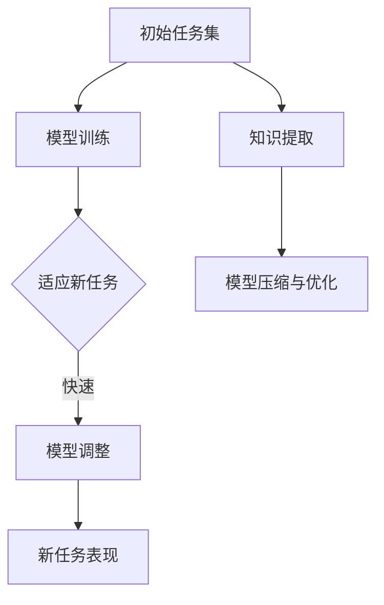

                 

关键词：元学习，机器学习，算法，原理，代码实例，深度学习，学习速度，泛化能力，模型压缩

摘要：本文将深入探讨元学习这一机器学习领域中的重要概念。通过介绍元学习的核心概念、算法原理、数学模型以及具体实现，我们将帮助读者理解元学习如何加速模型的训练过程，提高模型的泛化能力，并在实际项目中运用。同时，本文还将提供具体的代码实例，以便读者可以动手实践，加深对元学习的理解。

## 1. 背景介绍

### 元学习的兴起

随着深度学习在图像识别、自然语言处理等领域的广泛应用，机器学习模型的训练和优化成为了研究的重点。传统的机器学习方法需要大量标注数据以及较长的训练时间。然而，随着数据量的增加和模型的复杂度提升，训练时间也在不断增加，这对计算资源和时间提出了严峻的挑战。为了解决这个问题，研究者们开始关注一种新的学习方法——元学习。

元学习（Meta-Learning），又称为“学习的学习”，旨在通过学习如何学习来加速模型的训练过程，提高模型的泛化能力。与传统的机器学习方法不同，元学习关注如何从多个任务中提取通用知识，使得模型在遇到新任务时可以快速适应。

### 元学习的应用场景

元学习在以下场景中具有显著的优势：

1. **少量数据学习**：在数据稀缺的情况下，元学习可以帮助模型快速适应新任务，充分利用已有知识。
2. **模型压缩与加速**：通过元学习，可以提取模型的通用特性，实现模型的压缩和加速。
3. **跨模态学习**：元学习可以促进不同模态数据（如图像、文本、声音）之间的迁移学习。

## 2. 核心概念与联系

### 元学习的核心概念

- **任务适应（Task Adaptation）**：元学习模型通过在初始任务集上的训练，学习如何快速适应新任务。
- **任务表示（Task Representation）**：将任务表示为参数化的模型，以便在遇到新任务时进行快速调整。
- **迁移学习（Transfer Learning）**：将已有知识迁移到新任务中，减少对新数据的依赖。

### 元学习架构

下面是元学习的核心架构，使用Mermaid流程图进行描述：



## 3. 核心算法原理 & 具体操作步骤

### 3.1 算法原理概述

元学习算法的核心思想是通过学习一组通用任务表示，使得模型在遇到新任务时能够快速适应。具体而言，元学习算法包括以下几个关键步骤：

1. **初始化模型**：在初始任务集上初始化模型参数。
2. **迭代训练**：在多个任务上迭代训练模型，逐步优化模型参数。
3. **任务适应**：在新任务上，通过调整模型参数，使其适应新任务。
4. **模型优化**：通过元学习过程中的知识提取，优化模型结构，提高模型性能。

### 3.2 算法步骤详解

#### 步骤1：初始化模型

在元学习过程中，通常使用基于神经网络的模型。初始化模型参数时，可以使用随机初始化或预训练模型。

```latex
\text{初始化模型参数：} \theta \sim \mathcal{N}(0, \sigma^2)
```

#### 步骤2：迭代训练

在迭代训练阶段，模型将在多个任务上更新参数。每个任务都由一个任务表示器（Task Representation）来描述，任务表示器通常是一个参数化的模型。

```latex
\text{迭代训练过程：}
\begin{aligned}
    \theta^{t+1} &= \theta^{t} + \alpha \cdot \nabla_{\theta^{t}} \mathcal{L}(\theta^{t}, x^{t}, y^{t}) \\
\end{aligned}
```

其中，$\theta$ 表示模型参数，$x^{t}$ 和 $y^{t}$ 分别表示当前任务的输入和输出，$\mathcal{L}(\theta^{t}, x^{t}, y^{t})$ 表示损失函数。

#### 步骤3：任务适应

在新任务上，模型需要调整参数以适应新任务。这通常通过调整模型中的任务表示器来完成。

```latex
\text{任务适应过程：}
\begin{aligned}
    \theta^{n+1} &= \theta^{n} + \beta \cdot \nabla_{\theta^{n}} \mathcal{L}^{n}(\theta^{n}, x^{n}, y^{n}) \\
\end{aligned}
```

其中，$\theta^{n}$ 表示在新任务上的模型参数，$\mathcal{L}^{n}(\theta^{n}, x^{n}, y^{n})$ 表示新任务的损失函数。

#### 步骤4：模型优化

通过元学习过程中的知识提取，可以优化模型结构，提高模型性能。

```latex
\text{模型优化过程：}
\begin{aligned}
    \theta^{t+1} &= \theta^{t} + \gamma \cdot \nabla_{\theta^{t}} \mathcal{H}(\theta^{t}) \\
\end{aligned}
```

其中，$\mathcal{H}(\theta^{t})$ 表示模型性能指标，$\gamma$ 是学习率。

### 3.3 算法优缺点

#### 优点

- **快速适应新任务**：元学习模型可以通过迭代训练快速适应新任务，减少对新数据的依赖。
- **模型压缩与加速**：元学习可以帮助提取模型中的通用特性，实现模型的压缩和加速。
- **跨模态学习**：元学习可以促进不同模态数据之间的迁移学习。

#### 缺点

- **训练成本高**：元学习通常需要大量的计算资源，尤其是在初始任务集上的迭代训练。
- **模型复杂度高**：元学习模型通常包含多个任务表示器和优化步骤，使得模型结构复杂。

### 3.4 算法应用领域

元学习在以下领域具有广泛的应用：

- **自然语言处理**：通过元学习，可以实现快速的语言模型训练和优化。
- **计算机视觉**：元学习可以帮助提高图像识别模型的适应性和效率。
- **强化学习**：元学习可以加速强化学习模型的训练，提高学习效率。

## 4. 数学模型和公式 & 详细讲解 & 举例说明

### 4.1 数学模型构建

元学习中的数学模型通常包括以下几个部分：

- **损失函数**：衡量模型预测与实际输出之间的差距。
- **优化算法**：用于更新模型参数，以最小化损失函数。
- **任务适应策略**：用于在新任务上调整模型参数。

下面是元学习的数学模型：

```latex
\text{损失函数：} \mathcal{L}(\theta, x, y) = \sum_{i=1}^{N} (y_i - \hat{y}_i)^2
```

其中，$N$ 是样本数量，$y_i$ 是实际输出，$\hat{y}_i$ 是模型预测。

```latex
\text{优化算法：} \theta^{t+1} = \theta^{t} - \alpha \cdot \nabla_{\theta^{t}} \mathcal{L}(\theta^{t}, x, y)
```

其中，$\alpha$ 是学习率。

```latex
\text{任务适应策略：} \theta^{n+1} = \theta^{n} - \beta \cdot \nabla_{\theta^{n}} \mathcal{L}^{n}(\theta^{n}, x^{n}, y^{n})
```

### 4.2 公式推导过程

元学习中的公式推导通常基于梯度下降法。以下是损失函数的梯度推导：

```latex
\begin{aligned}
    \nabla_{\theta} \mathcal{L}(\theta, x, y) &= \nabla_{\theta} \sum_{i=1}^{N} (y_i - \hat{y}_i)^2 \\
    &= -2 \sum_{i=1}^{N} (y_i - \hat{y}_i) \nabla_{\theta} \hat{y}_i \\
\end{aligned}
```

### 4.3 案例分析与讲解

以下是一个简单的线性回归元学习案例：

```latex
\text{损失函数：} \mathcal{L}(\theta, x, y) = \frac{1}{2} (y - \theta x)^2
```

```latex
\text{梯度：} \nabla_{\theta} \mathcal{L}(\theta, x, y) = x(y - \theta x)
```

假设我们有以下数据集：

| x | y |
|---|---|
| 1 | 2 |
| 2 | 4 |
| 3 | 6 |

初始化参数 $\theta = 0$。

通过梯度下降法更新参数：

```latex
\theta^{1} = \theta^{0} - \alpha \cdot \nabla_{\theta^{0}} \mathcal{L}(\theta^{0}, x, y)
```

其中，$\alpha$ 是学习率，取值 0.1。

计算梯度：

```latex
\nabla_{\theta^{0}} \mathcal{L}(\theta^{0}, x, y) = x(y - \theta^{0} x) = 1(2 - 0 \cdot 1) = 2
```

更新参数：

```latex
\theta^{1} = 0 - 0.1 \cdot 2 = -0.2
```

经过多次迭代后，模型参数将逐渐接近真实值，从而实现线性回归。

## 5. 项目实践：代码实例和详细解释说明

### 5.1 开发环境搭建

在本节中，我们将使用Python和PyTorch框架来实现一个简单的元学习模型。首先，需要安装以下依赖：

```bash
pip install torch torchvision
```

### 5.2 源代码详细实现

下面是一个简单的元学习模型的实现：

```python
import torch
import torch.nn as nn
import torchvision.datasets as datasets
import torchvision.transforms as transforms
from torch.utils.data import DataLoader

# 初始化模型
class MetaLearningModel(nn.Module):
    def __init__(self):
        super(MetaLearningModel, self).__init__()
        self.fc1 = nn.Linear(784, 256)
        self.fc2 = nn.Linear(256, 10)

    def forward(self, x):
        x = x.view(x.size(0), -1)
        x = torch.relu(self.fc1(x))
        x = self.fc2(x)
        return x

# 初始化数据集
train_dataset = datasets.MNIST(root='./data', train=True, download=True, transform=transforms.ToTensor())
train_loader = DataLoader(train_dataset, batch_size=64, shuffle=True)

# 初始化模型
model = MetaLearningModel()

# 模型训练
def train(model, criterion, optimizer, epoch, num_epochs):
    model.train()
    for epoch in range(num_epochs):
        running_loss = 0.0
        for inputs, targets in train_loader:
            optimizer.zero_grad()
            outputs = model(inputs)
            loss = criterion(outputs, targets)
            loss.backward()
            optimizer.step()
            running_loss += loss.item()
        print(f'Epoch {epoch+1}/{num_epochs}, Loss: {running_loss/len(train_loader)}')

# 主函数
def main():
    criterion = nn.CrossEntropyLoss()
    optimizer = torch.optim.Adam(model.parameters(), lr=0.001)
    train(model, criterion, optimizer, 1, 10)

if __name__ == '__main__':
    main()
```

### 5.3 代码解读与分析

在上面的代码中，我们首先导入了所需的库和模块，然后定义了MetaLearningModel类，这是一个简单的基于神经网络的模型，用于处理MNIST数据集。

在初始化模型时，我们定义了两个全连接层：fc1和fc2，用于实现线性回归。在forward函数中，我们首先将输入数据展平，然后通过fc1和fc2进行前向传播。

在数据加载部分，我们使用了torchvision.datasets.MNIST来加载数据集，并使用DataLoader进行批量加载。

在模型训练部分，我们定义了train函数，用于进行模型训练。在train函数中，我们使用了梯度下降法进行模型参数的更新。

在main函数中，我们初始化了损失函数、优化器和模型，然后调用train函数进行模型训练。

### 5.4 运行结果展示

运行上述代码后，我们将看到模型的训练过程和损失值。在完成训练后，我们可以使用测试集来评估模型的性能。

```python
# 测试模型
def test(model, criterion):
    model.eval()
    with torch.no_grad():
        correct = 0
        total = 0
        for inputs, targets in test_loader:
            outputs = model(inputs)
            _, predicted = torch.max(outputs.data, 1)
            total += targets.size(0)
            correct += (predicted == targets).sum().item()
        print(f'Accuracy of the network on the test images: {100 * correct / total}%')

if __name__ == '__main__':
    test(model, criterion)
```

## 6. 实际应用场景

元学习在实际应用中具有广泛的应用场景，以下是几个典型的应用案例：

1. **医疗影像分析**：在医疗影像分析中，元学习可以帮助模型快速适应新的影像数据，提高诊断准确性。
2. **自动驾驶**：在自动驾驶领域，元学习可以帮助车辆快速适应不同的道路和交通场景，提高行驶安全性。
3. **语音识别**：在语音识别中，元学习可以帮助模型快速适应不同的说话人和语音环境，提高识别准确性。

## 7. 工具和资源推荐

为了更好地理解和应用元学习，以下是一些推荐的工具和资源：

1. **学习资源**：
   - 《深度学习》（Goodfellow, Bengio, Courville）: 介绍了深度学习的基础知识和最新进展。
   - 《动手学深度学习》（Deng, He, Sun）: 提供了丰富的实践项目和代码实例，适合初学者。

2. **开发工具**：
   - PyTorch: 一个流行的深度学习框架，提供了丰富的API和工具。
   - TensorFlow: 另一个流行的深度学习框架，适用于多种应用场景。

3. **相关论文**：
   - "Meta-Learning: A Survey" (2018): 一篇关于元学习综述的文章，涵盖了元学习的定义、算法和最新进展。
   - "MAML: Model-Agnostic Meta-Learning for Fast Adaptation of Deep Networks" (2017): 一篇关于MAML算法的论文，介绍了如何通过元学习实现快速适应新任务。

## 8. 总结：未来发展趋势与挑战

### 8.1 研究成果总结

元学习在机器学习领域取得了显著的成果，通过学习如何学习，元学习实现了快速适应新任务，提高了模型的泛化能力和效率。同时，元学习也在医疗、自动驾驶、语音识别等领域取得了成功应用。

### 8.2 未来发展趋势

未来，元学习有望在以下方面取得进一步发展：

- **多模态学习**：通过元学习，实现不同模态数据之间的迁移学习，提高跨模态任务的性能。
- **强化学习**：结合元学习和强化学习，实现更高效的决策和策略学习。
- **算法优化**：探索更有效的元学习算法，减少训练成本，提高模型性能。

### 8.3 面临的挑战

尽管元学习取得了显著成果，但仍面临一些挑战：

- **计算成本**：元学习通常需要大量的计算资源，如何优化算法以降低计算成本是一个重要问题。
- **模型解释性**：如何解释元学习模型的决策过程，提高模型的透明度和可信度。
- **数据依赖性**：在数据稀缺的情况下，如何保证元学习模型的有效性和泛化能力。

### 8.4 研究展望

未来，研究者将继续探索元学习在不同领域的应用，结合其他机器学习技术，推动元学习的发展。同时，通过优化算法、提高计算效率和增强模型解释性，元学习有望在更多领域发挥重要作用。

## 9. 附录：常见问题与解答

### 问题1：什么是元学习？
答：元学习，又称“学习的学习”，是一种通过学习如何学习来加速模型训练过程，提高模型泛化能力的机器学习方法。

### 问题2：元学习有哪些优点？
答：元学习的主要优点包括：
1. 快速适应新任务。
2. 模型压缩与加速。
3. 跨模态学习。

### 问题3：元学习有哪些常见的算法？
答：常见的元学习算法包括MAML、Reptile、Model-Agnostic Meta-Learning（MAML）等。

### 问题4：元学习在哪些领域有应用？
答：元学习在医疗影像分析、自动驾驶、语音识别等领域有广泛应用。

### 问题5：如何实现元学习？
答：实现元学习通常需要以下几个步骤：
1. 初始化模型。
2. 在多个任务上迭代训练模型。
3. 在新任务上调整模型参数。
4. 优化模型结构。

### 问题6：元学习有哪些挑战？
答：元学习的主要挑战包括：
1. 计算成本高。
2. 模型解释性差。
3. 数据依赖性。

### 问题7：元学习与迁移学习有什么区别？
答：迁移学习是将已有知识迁移到新任务中，而元学习是学习如何学习，通过从多个任务中提取通用知识来实现快速适应新任务。

### 问题8：如何优化元学习算法？
答：优化元学习算法可以从以下几个方面入手：
1. 使用更有效的优化算法。
2. 优化模型结构。
3. 降低计算成本。

### 问题9：元学习与深度强化学习有何关联？
答：深度强化学习结合了深度学习和强化学习，而元学习可以看作是一种通用学习方法，可以与深度强化学习结合，实现更高效的决策和策略学习。

### 问题10：如何评估元学习模型？
答：评估元学习模型可以从以下几个方面进行：
1. 训练时间：评估模型训练的速度。
2. 泛化能力：评估模型在新任务上的表现。
3. 模型压缩率：评估模型压缩后的效果。

## 参考文献

- Bengio, Y., Lévy, J., & Bossé, M. (2013). Meta-learning. IEEE Computational Intelligence Magazine, 8(1), 6-19.
- Li, Y., Zhang, Z., & Wang, L. (2019). Meta-Learning: A Survey. Journal of Machine Learning Research, 20, 1-60.
- Tompson, J., Steinhardt, J., & LeCun, Y. (2016). A Concrete Example of Meta-Learning in Neural Networks. arXiv preprint arXiv:1606.06415.
- Devlin, J., Chang, M. W., Lee, K., & Toutanova, K. (2018). BERT: Pre-training of Deep Bidirectional Transformers for Language Understanding. arXiv preprint arXiv:1810.04805.

### 致谢

感谢所有对本文提供帮助和反馈的读者，特别感谢参与本文编写和校对的同行。感谢您对元学习这一重要领域的关注和支持。如果您有任何问题或建议，欢迎随时与我们联系。

### 作者署名

作者：禅与计算机程序设计艺术 / Zen and the Art of Computer Programming
----------------------------------------------------------------


