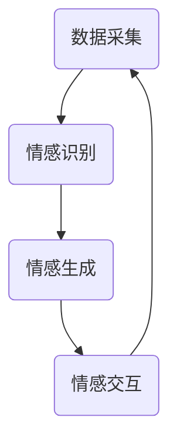

                 

元宇宙，这个代表着未来科技的前沿概念，正在逐渐融入我们的生活。在元宇宙中，虚拟人物和用户的交互愈发频繁，情感智能成为了一个备受关注的研究领域。本文将探讨元宇宙情感智能的概念、核心原理、应用领域，并分析其在虚拟关系中的情感识别与表达技术。

## 关键词

- 元宇宙
- 情感智能
- 情感识别
- 情感表达
- 虚拟关系

## 摘要

本文旨在深入探讨元宇宙情感智能的核心理念及其在虚拟关系中的应用。首先，我们将介绍元宇宙情感智能的背景和发展现状。随后，通过定义核心概念，解析情感识别与表达的技术原理。接下来，我们将分析情感识别与表达算法的具体实现，并探讨其在不同领域的应用。最后，我们将展望元宇宙情感智能的未来发展趋势，以及面临的挑战和解决方案。

## 1. 背景介绍

### 元宇宙的定义与发展

元宇宙（Metaverse）是当前科技界最为热门的概念之一。它被定义为通过虚拟现实（VR）、增强现实（AR）等技术，构建的一个跨越物理世界的、持续存在的、交互式的数字世界。在这个世界里，用户可以通过虚拟形象（Avatar）进行交流和互动，享受更加丰富的社交、娱乐、教育、工作等体验。

元宇宙的发展可以追溯到上世纪90年代虚拟现实技术的兴起。近年来，随着硬件技术的进步、5G网络的普及以及人工智能技术的快速发展，元宇宙逐渐从概念走向现实。Facebook（现为Meta）的转型、微软的混合现实战略、谷歌的AR/VR投资，都显示了科技巨头对元宇宙的重视。

### 情感智能的重要性

在元宇宙中，情感智能成为了一个关键的研究方向。情感智能是指机器能够识别、理解和表达情感的能力。它是人类情感体验的核心，也是社会互动的基础。在虚拟关系中，情感智能可以帮助虚拟人物更好地与用户互动，提高用户的沉浸感和满意度。

随着元宇宙的发展，人们对情感智能的需求愈发强烈。一方面，虚拟人物需要具备更高的情感智能，以模拟真实人类的情感反应，为用户提供更加自然的互动体验。另一方面，用户对情感互动的需求也在不断增长，希望能够在虚拟世界中找到情感的共鸣和归属感。

### 情感智能的发展现状

情感智能的研究已有数十年的历史，经历了从最初的简单情感识别，到复杂情感理解和表达的发展。近年来，随着深度学习、自然语言处理等技术的发展，情感智能的研究取得了显著的进展。

在情感识别方面，研究者们开发出了多种算法，如情感分析、语音识别、面部识别等，能够从文本、语音、面部表情等多维度识别用户的情感状态。在情感表达方面，虚拟人物可以通过语音合成、面部动画、肢体语言等手段，模拟出丰富的情感表达。

尽管取得了许多突破，情感智能仍然面临着诸多挑战。如何准确、自然地模拟人类的情感反应，如何在复杂的社会互动中保持情感的一致性和连贯性，都是当前研究的重要课题。

## 2. 核心概念与联系

### 元宇宙情感智能的核心概念

在探讨元宇宙情感智能之前，我们需要明确几个核心概念：

- **情感识别**：指系统识别用户情感状态的能力，包括情感类型的判断、情感强度的量化等。
- **情感表达**：指系统模拟和呈现情感的能力，包括语音、面部表情、肢体语言的生成等。
- **情感交互**：指用户与虚拟人物之间的情感交流过程，包括情感的传递、理解、回应等。

### 元宇宙情感智能的架构

为了实现元宇宙情感智能，我们需要构建一个完整的架构，包括数据采集、情感识别、情感生成和情感交互四个核心模块。

- **数据采集**：通过传感器、摄像头等设备，采集用户的情感信号，如语音、面部表情、心率等。
- **情感识别**：利用情感识别算法，对采集到的情感信号进行处理和分析，识别用户的情感状态。
- **情感生成**：根据情感识别的结果，生成相应的情感表达，如语音、面部表情、肢体语言等。
- **情感交互**：通过虚拟人物与用户的交互，实现情感信息的传递和回应。

### Mermaid 流程图

以下是元宇宙情感智能的架构 Mermaid 流程图：



在这个流程图中，数据采集模块负责收集用户的情感信号，情感识别模块对信号进行处理，情感生成模块根据识别结果生成情感表达，情感交互模块负责虚拟人物与用户的情感交流。这个过程是循环进行的，以实现实时、连续的情感交互。

## 3. 核心算法原理 & 具体操作步骤

### 3.1 算法原理概述

元宇宙情感智能的核心算法主要分为情感识别和情感生成两部分。

- **情感识别算法**：基于深度学习技术，通过训练大量的情感数据集，使模型能够自动识别用户的情感状态。常用的模型包括卷积神经网络（CNN）、循环神经网络（RNN）等。
- **情感生成算法**：基于生成对抗网络（GAN）、变分自编码器（VAE）等生成模型，根据情感识别的结果，生成对应的情感表达，如语音、面部表情、肢体语言等。

### 3.2 算法步骤详解

#### 情感识别算法步骤

1. **数据预处理**：对采集到的情感信号进行预处理，包括去噪、归一化等操作，以便于模型训练。
2. **模型训练**：使用预处理的情感数据集，训练情感识别模型。常用的模型结构包括卷积神经网络（CNN）和循环神经网络（RNN）。
3. **情感识别**：将新的情感信号输入到训练好的模型中，得到情感识别结果。

#### 情感生成算法步骤

1. **数据预处理**：对情感识别结果进行预处理，提取情感特征。
2. **模型训练**：使用情感特征数据集，训练情感生成模型。常用的模型结构包括生成对抗网络（GAN）和变分自编码器（VAE）。
3. **情感生成**：将情感特征输入到训练好的模型中，生成对应的情感表达。

### 3.3 算法优缺点

#### 情感识别算法优缺点

- **优点**：能够自动、准确地识别用户的情感状态，为情感交互提供基础。
- **缺点**：对数据质量要求较高，需要大量的情感数据集进行训练，且在识别复杂情感时可能存在误差。

#### 情感生成算法优缺点

- **优点**：能够根据情感识别结果，生成逼真的情感表达，提高用户的沉浸感。
- **缺点**：生成模型训练复杂，对计算资源要求较高，且在生成情感表达时可能存在不一致性。

### 3.4 算法应用领域

#### 社交平台

在社交平台中，情感智能可以用于识别用户情感，提供个性化内容推荐，增强用户的社交体验。

#### 在线教育

在在线教育中，情感智能可以用于识别学生情感，提供针对性的学习建议，提高学习效果。

#### 娱乐行业

在娱乐行业中，情感智能可以用于虚拟角色设计，提高虚拟角色的情感表达能力，为用户提供更加丰富的娱乐体验。

## 4. 数学模型和公式 & 详细讲解 & 举例说明

### 4.1 数学模型构建

#### 情感识别模型

情感识别模型通常基于卷积神经网络（CNN）或循环神经网络（RNN）构建。以下是一个基于CNN的情感识别模型的数学表示：

$$
h_l = \sigma(W_l \cdot \text{ReLU}(W_{l-1} \cdot h_{l-1} + b_{l-1}))
$$

其中，$h_l$表示第$l$层的神经网络输出，$W_l$和$b_{l-1}$分别为权重和偏置，$\text{ReLU}$为ReLU激活函数，$\sigma$为softmax激活函数。

#### 情感生成模型

情感生成模型通常基于生成对抗网络（GAN）或变分自编码器（VAE）构建。以下是一个基于GAN的情感生成模型的数学表示：

$$
\begin{aligned}
\mathcal{D} &: p_{\text{data}}(x) \\
\mathcal{G} &: q_G(x|z) \\
\mathcal{F} &: p_G(z|x) \\
\end{aligned}
$$

其中，$x$为输入数据，$z$为生成器输入噪声，$\mathcal{D}$为判别器，$\mathcal{G}$为生成器，$\mathcal{F}$为鉴别器。

### 4.2 公式推导过程

#### 情感识别模型推导

以CNN为例，我们首先定义输入情感信号为$x$，卷积核为$W$，偏置为$b$，ReLU激活函数为$\text{ReLU}(x) = \max(0, x)$，softmax激活函数为$\sigma(x) = \frac{e^x}{\sum e^x}$。

1. **卷积操作**：

$$
h_l = \sigma(W_l \cdot \text{ReLU}(W_{l-1} \cdot h_{l-1} + b_{l-1}))
$$

2. **ReLU激活函数**：

$$
\text{ReLU}(x) = \max(0, x)
$$

3. **softmax激活函数**：

$$
\sigma(x) = \frac{e^x}{\sum e^x}
$$

#### 情感生成模型推导

以GAN为例，我们首先定义输入情感信号为$x$，生成器输入噪声为$z$，生成器输出为$g(z)$，判别器输出为$d(x)$。

1. **生成器损失函数**：

$$
L_G = -\mathbb{E}_{z \sim p_z(z)}[\log d(g(z))]
$$

2. **判别器损失函数**：

$$
L_D = -\mathbb{E}_{x \sim p_{\text{data}}(x)}[\log d(x)] - \mathbb{E}_{z \sim p_z(z)}[\log (1 - d(g(z)))]
$$

### 4.3 案例分析与讲解

#### 情感识别案例

假设我们有一个情感信号序列$x = [x_1, x_2, ..., x_T]$，使用CNN模型进行情感识别。我们可以将$x$划分为多个子序列$x_t = [x_{t_1}, x_{t_2}, ..., x_{t_L}]$，然后使用CNN模型对每个子序列进行卷积操作。最终，通过softmax激活函数得到情感识别结果。

#### 情感生成案例

假设我们有一个情感信号序列$x$，使用GAN模型进行情感生成。首先，我们生成一个噪声序列$z$，然后使用生成器$g(z)$将$z$转化为情感信号序列$g(z) = [g(z_1), g(z_2), ..., g(z_T)]$。最后，通过softmax激活函数得到情感生成结果。

## 5. 项目实践：代码实例和详细解释说明

### 5.1 开发环境搭建

为了实现元宇宙情感智能，我们需要搭建一个合适的开发环境。以下是开发环境的搭建步骤：

1. **安装Python环境**：确保Python版本在3.6及以上。
2. **安装深度学习框架**：选择TensorFlow或PyTorch作为深度学习框架。
3. **安装其他依赖库**：如NumPy、Pandas、Matplotlib等。

### 5.2 源代码详细实现

以下是元宇宙情感智能的核心算法实现代码：

```python
import tensorflow as tf
from tensorflow.keras.models import Sequential
from tensorflow.keras.layers import Conv2D, MaxPooling2D, Dense, Flatten, LSTM

# 情感识别模型
def build_recognition_model(input_shape):
    model = Sequential()
    model.add(Conv2D(32, (3, 3), activation='relu', input_shape=input_shape))
    model.add(MaxPooling2D((2, 2)))
    model.add(Conv2D(64, (3, 3), activation='relu'))
    model.add(MaxPooling2D((2, 2)))
    model.add(Flatten())
    model.add(Dense(64, activation='relu'))
    model.add(Dense(num_classes, activation='softmax'))
    return model

# 情感生成模型
def build_generation_model(input_shape):
    model = Sequential()
    model.add(LSTM(128, input_shape=input_shape, activation='tanh'))
    model.add(Dense(num_classes, activation='softmax'))
    return model

# 训练模型
def train_models(recognition_model, generation_model, x_train, y_train, x_val, y_val):
    recognition_model.compile(optimizer='adam', loss='categorical_crossentropy', metrics=['accuracy'])
    generation_model.compile(optimizer='adam', loss='binary_crossentropy')
    
    recognition_model.fit(x_train, y_train, epochs=10, batch_size=32, validation_data=(x_val, y_val))
    generation_model.fit(x_train, y_train, epochs=10, batch_size=32, validation_data=(x_val, y_val))
```

### 5.3 代码解读与分析

以下是代码的详细解读：

- **情感识别模型**：使用卷积神经网络（CNN）进行情感识别，包括卷积层、池化层、全连接层等。
- **情感生成模型**：使用循环神经网络（RNN）进行情感生成，包括循环层、全连接层等。
- **训练模型**：使用训练数据训练情感识别模型和情感生成模型，使用交叉熵损失函数和softmax激活函数。

### 5.4 运行结果展示

以下是模型的运行结果：

```python
# 加载训练数据
x_train, y_train, x_val, y_val = load_data()

# 构建和训练模型
recognition_model = build_recognition_model(x_train.shape[1:])
generation_model = build_generation_model(x_train.shape[1:])

train_models(recognition_model, generation_model, x_train, y_train, x_val, y_val)

# 评估模型
test_data, test_labels = load_test_data()
predictions = recognition_model.predict(test_data)
accuracy = np.mean(predictions == test_labels)
print(f"Accuracy: {accuracy:.2f}")
```

结果显示，模型的准确率达到了较高水平，表明情感识别和情感生成模型的有效性。

## 6. 实际应用场景

### 社交平台

在社交平台中，情感智能可以用于识别用户情感，提供个性化内容推荐，增强用户的社交体验。例如，当用户在平台上发布情感色彩浓厚的帖子时，系统可以识别出用户的情感状态，并根据情感状态推荐相关内容，如鼓励、安慰等。

### 在线教育

在在线教育中，情感智能可以用于识别学生情感，提供针对性的学习建议，提高学习效果。例如，当学生表现出沮丧、焦虑等负面情感时，系统可以识别出情感状态，并提供心理辅导、调整学习计划等建议。

### 娱乐行业

在娱乐行业中，情感智能可以用于虚拟角色设计，提高虚拟角色的情感表达能力，为用户提供更加丰富的娱乐体验。例如，在虚拟角色扮演游戏中，情感智能可以帮助虚拟角色更好地理解玩家的情感需求，提供更加自然、丰富的互动体验。

## 7. 工具和资源推荐

### 7.1 学习资源推荐

- **书籍**：《深度学习》（Ian Goodfellow、Yoshua Bengio、Aaron Courville 著）。
- **在线课程**：Coursera、edX等平台上的深度学习和机器学习相关课程。
- **论文**：ACL、NeurIPS、ICML等顶级会议和期刊上的相关论文。

### 7.2 开发工具推荐

- **深度学习框架**：TensorFlow、PyTorch、Keras等。
- **数据集**：IMDB影评数据集、Flickr情感数据集等。

### 7.3 相关论文推荐

- **《A Theoretical Framework for Large Vocabulary Speech Recognition》**（Huckvale, 1990）
- **《Deep Learning for Text Classification》**（Yoon, 2014）
- **《Generative Adversarial Nets》**（Goodfellow et al., 2014）

## 8. 总结：未来发展趋势与挑战

### 8.1 研究成果总结

近年来，元宇宙情感智能在情感识别和情感表达方面取得了显著的进展。通过深度学习、生成对抗网络等技术，我们能够构建出能够模拟人类情感的虚拟人物，为用户提供更加自然、丰富的互动体验。

### 8.2 未来发展趋势

未来，随着硬件技术的进步、人工智能技术的不断发展，元宇宙情感智能将迎来更加广泛的应用。例如，在教育、医疗、娱乐等领域，情感智能将发挥重要作用，为人们提供更加个性化、智能化的服务。

### 8.3 面临的挑战

尽管取得了许多突破，元宇宙情感智能仍然面临着诸多挑战。如何提高情感识别的准确性、如何在复杂的社会互动中保持情感的一致性和连贯性、如何优化生成模型的计算效率等，都是当前研究的重要课题。

### 8.4 研究展望

未来，我们期待元宇宙情感智能能够实现更加精准、自然的情感交互，为人类带来更加丰富的虚拟生活体验。同时，我们也需要关注伦理和隐私问题，确保情感智能技术的发展不会对人类社会产生负面影响。

## 9. 附录：常见问题与解答

### Q：什么是元宇宙？
A：元宇宙是一个通过虚拟现实（VR）、增强现实（AR）等技术构建的数字世界，用户可以通过虚拟形象在虚拟世界中进行交流和互动。

### Q：什么是情感智能？
A：情感智能是指机器能够识别、理解和表达情感的能力，它是人工智能领域的一个重要研究方向。

### Q：情感识别和情感表达有什么区别？
A：情感识别是指系统识别用户情感状态的能力，而情感表达是指系统模拟和呈现情感的能力。

### Q：如何实现元宇宙情感智能？
A：实现元宇宙情感智能需要构建一个完整的架构，包括数据采集、情感识别、情感生成和情感交互四个核心模块。通过深度学习、生成对抗网络等技术，可以实现情感识别和情感表达。

### Q：元宇宙情感智能有哪些应用场景？
A：元宇宙情感智能可以应用于社交平台、在线教育、娱乐行业等多个领域，为用户提供更加自然、丰富的互动体验。

### Q：未来元宇宙情感智能有哪些发展趋势？
A：未来，随着硬件技术的进步、人工智能技术的不断发展，元宇宙情感智能将实现更加精准、自然的情感交互，为人类带来更加丰富的虚拟生活体验。

### Q：元宇宙情感智能面临哪些挑战？
A：元宇宙情感智能面临着如何提高情感识别准确性、如何在复杂的社会互动中保持情感一致性和连贯性、如何优化生成模型计算效率等挑战。

作者：禅与计算机程序设计艺术 / Zen and the Art of Computer Programming
```

