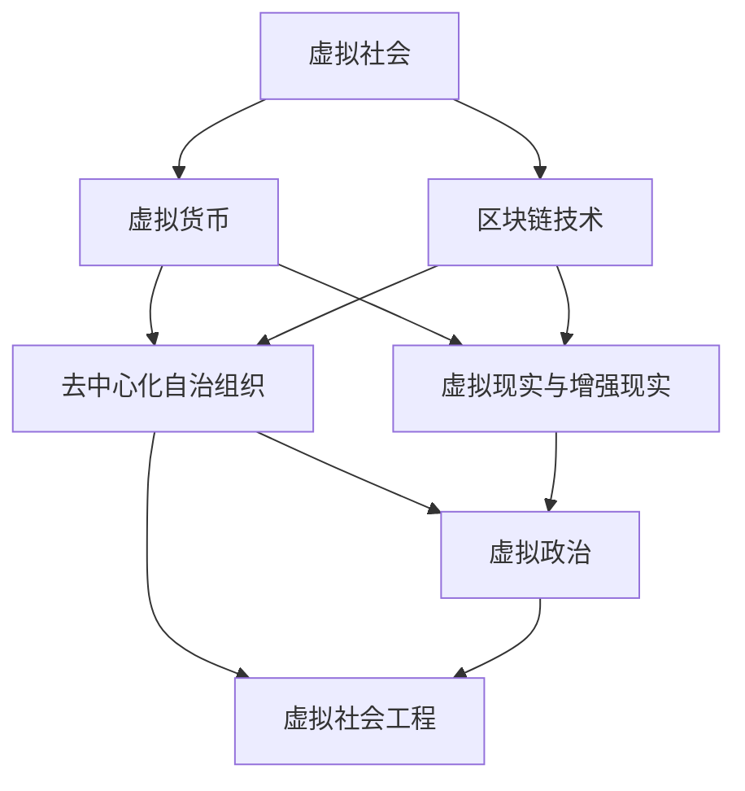

                 

### 摘要 Summary

本文将探讨元宇宙政治的崛起及其对虚拟世界权力格局的深刻影响。随着技术的进步和互联网的普及，虚拟世界已经不再是一个遥远的梦想，而是一个日益成熟且引人注目的领域。在元宇宙中，政治不再仅仅是一个现实世界的概念，它已经融入到了数字化的社会体系中，形成了独特的权力结构和权力博弈。本文将从核心概念、算法原理、数学模型、项目实践、应用场景和未来展望等多个角度，深入剖析元宇宙政治的现状和未来发展趋势。通过本文的阅读，读者将能够全面理解元宇宙政治的核心机制，及其对现实世界政治和社会的影响。

### 1. 背景介绍 Background

元宇宙（Metaverse）这一概念最早由科幻作家尼尔·斯蒂芬森（Neal Stephenson）在1992年的小说《雪崩》（Snow Crash）中提出。他描述了一个虚拟的三维网络空间，人们通过数字化身在其中交流、工作、娱乐。随着时间的推移，元宇宙从科幻小说中的构想逐渐走向现实，成为科技巨头和创业者竞相追逐的领域。例如，Facebook在2021年宣布公司名称更改为Meta，标志着其对元宇宙的巨大投入和重视。此外，微软、谷歌、腾讯等公司也都在积极布局元宇宙，推出各自的虚拟现实（VR）和增强现实（AR）产品和服务。

在技术层面，元宇宙的发展离不开几个关键技术的推动。首先是虚拟现实（VR）和增强现实（AR）技术的不断进步，使得用户能够更加沉浸式地体验虚拟世界。其次是5G网络的普及，为元宇宙提供了高速、低延迟的网络环境，使得大规模、实时的交互成为可能。此外，区块链技术的应用也为元宇宙的治理和权益分配提供了新的思路。通过去中心化的方式，区块链技术可以确保元宇宙中的资产和权益的安全和透明。

除了技术上的进步，元宇宙的概念也逐渐深入人心。越来越多的人开始认识到，虚拟世界不仅仅是娱乐的工具，它还具备巨大的商业潜力。例如，虚拟房地产、虚拟商品交易、虚拟广告等都已经成为现实，并吸引了大量的投资和用户。此外，元宇宙还为创作者提供了新的平台，使得他们能够以数字形式创作、分发和获取收益。

总之，元宇宙的崛起为虚拟世界的权力格局带来了巨大的变革。随着技术的不断进步和应用场景的拓展，元宇宙政治这一概念将越来越重要，它不仅影响了虚拟世界的运行方式，也对我们现实世界的政治和社会产生了深远的影响。

### 2. 核心概念与联系 Core Concepts and Connections

要深入探讨元宇宙政治，我们首先需要明确几个核心概念，这些概念不仅是元宇宙政治的基础，也是理解整个虚拟世界权力结构的关键。

#### 2.1 虚拟社会 Virtual Society

虚拟社会是指在虚拟世界中形成的社会结构和互动模式。与传统的现实社会不同，虚拟社会中的成员通过数字化身进行交流，而非物理形态。这种社会结构的独特性体现在几个方面：首先是去中心化，虚拟社会没有传统社会中的地理和政治界限，成员可以来自世界各地的不同文化背景；其次是匿名性，成员通常可以使用虚拟身份进行交流，这使得个体可以自由表达而无需暴露真实身份。

#### 2.2 虚拟货币 Virtual Currency

虚拟货币是虚拟世界中的经济交易媒介，如比特币、以太币等。在元宇宙中，虚拟货币不仅用于购买虚拟商品和服务，还承担了财富积累和分配的重要功能。虚拟货币的引入使得虚拟社会中的经济活动更加活跃，同时也带来了新的金融模式和风险。例如，加密货币市场的波动性和安全性问题是虚拟货币发展的主要挑战。

#### 2.3 区块链技术 Blockchain Technology

区块链技术是元宇宙政治的重要支撑。通过去中心化的方式，区块链技术确保了数据的透明性和不可篡改性。在元宇宙中，区块链技术被广泛用于身份验证、交易记录、资产确权等场景。例如，元宇宙中的土地和房产可以通过区块链进行确权，从而确保其真实性和安全性。

#### 2.4 去中心化自治组织 Decentralized Autonomous Organization (DAO)

去中心化自治组织（DAO）是一种基于区块链技术的组织形式，旨在实现去中心化的决策和治理。DAO通过智能合约和代币经济模型来实现成员之间的合作和利益分配。在元宇宙中，DAO被广泛应用于虚拟社区的治理、项目投资和运营管理等方面。DAO的特点是去中心化、透明度和成员参与度，这使得它成为元宇宙政治的一个重要组成部分。

#### 2.5 虚拟现实与增强现实 Virtual Reality (VR) and Augmented Reality (AR)

虚拟现实（VR）和增强现实（AR）技术是元宇宙的基石。VR技术通过模拟现实世界，为用户提供沉浸式的体验，而AR技术则将虚拟元素叠加到现实世界中。这些技术的进步使得虚拟世界与现实世界之间的界限变得模糊，用户可以在虚拟世界中实现各种互动和体验，从而增强了虚拟社会的现实感和互动性。

#### 2.6 虚拟政治 Virtual Politics

虚拟政治是指在虚拟世界中进行的政治活动、政策和治理。虚拟政治不仅包括了虚拟选举、虚拟立法和虚拟行政等传统政治活动，还包括了虚拟社会中的权力分配、利益博弈和冲突解决等。虚拟政治的特点是匿名性、去中心化和高度参与性，这使得它具有与传统政治截然不同的运作机制。

#### 2.7 虚拟社会工程 Virtual Social Engineering

虚拟社会工程是指通过技术手段影响虚拟社会中的行为、态度和决策。这包括但不限于虚假信息传播、网络钓鱼、社交工程和虚拟恐怖主义等。虚拟社会工程在元宇宙中具有巨大的影响力，它不仅可能引发虚拟社会的混乱和恐慌，也可能对现实世界的政治和社会产生深远的影响。

#### Mermaid 流程图

以下是一个简化的元宇宙政治核心概念的 Mermaid 流程图，展示了各概念之间的联系：



通过上述核心概念和Mermaid流程图的展示，我们可以更好地理解元宇宙政治的基本框架和运行机制。在接下来的章节中，我们将深入探讨这些概念的具体应用和实践案例。

### 3. 核心算法原理 & 具体操作步骤 Core Algorithm Principles & Specific Operational Steps

在元宇宙政治中，核心算法的设计和实现至关重要，它不仅决定了虚拟社会的运作效率，也直接影响了权力结构的稳定性和公平性。以下将详细介绍元宇宙政治中的核心算法原理及其具体操作步骤。

#### 3.1 算法原理概述 Algorithm Overview

元宇宙政治的核心算法主要基于去中心化自治组织（DAO）的技术架构。DAO通过智能合约来实现成员之间的合作和决策，从而形成一个去中心化的治理结构。核心算法的基本原理包括以下几个方面：

1. **共识算法**：用于确保所有参与者对区块链上数据的共识，保证数据的真实性和不可篡改性。
2. **激励机制**：通过代币经济模型激励成员积极参与治理和决策，促进整个虚拟社会的健康发展。
3. **投票机制**：实现成员对重大决策的投票，确保治理决策的民主性和公平性。
4. **身份验证**：确保参与者的身份真实有效，防止恶意行为。

#### 3.2 算法步骤详解 Detailed Steps

以下是元宇宙政治核心算法的具体操作步骤：

**步骤1：共识算法（Consensus Algorithm）**

- **初始设定**：在区块链网络中，所有节点（参与者）首先需要达成共识，选择一个合适的共识算法，如PoW（工作量证明）或PoS（权益证明）。
- **数据同步**：每个节点接收区块链上的最新数据，并与本地数据进行比对，确保数据的一致性。
- **验证数据**：节点使用加密算法验证数据的真实性和完整性。
- **达成共识**：当所有节点验证通过后，区块链上的数据即被认为是有效的，并被添加到区块链上。

**步骤2：激励机制（Incentive Mechanism）**

- **代币发行**：区块链系统根据智能合约的设定发行代币，作为参与者的奖励。
- **代币分配**：代币按照成员的贡献度和参与度进行分配，确保贡献大的成员获得更多的奖励。
- **代币消耗**：代币可以用于支付服务费用、参与投票等，确保代币流通和经济的活跃性。

**步骤3：投票机制（Voting Mechanism）**

- **提案提出**：成员可以向区块链提交提案，提案内容包括治理决策、项目投资等。
- **投票阶段**：所有拥有投票权的成员在规定时间内对提案进行投票。
- **结果统计**：智能合约自动统计投票结果，并根据投票结果执行相应的治理决策。

**步骤4：身份验证（Identity Verification）**

- **身份注册**：成员在加入区块链网络时，需要通过身份验证，确保其身份的真实性和合法性。
- **身份认证**：区块链系统使用加密算法验证成员的身份信息，确保其有效性和唯一性。
- **权限管理**：根据成员的身份和权限，分配不同的操作权限和投票权重。

#### 3.3 算法优缺点 Advantages and Disadvantages

**优点：**

- **去中心化**：去中心化的治理结构确保了权力分散，减少了集中化的风险。
- **透明度高**：所有数据在区块链上透明可见，确保了治理决策的透明度和公正性。
- **高效性**：智能合约和共识算法提高了系统的运作效率，减少了人工干预。
- **安全性**：加密技术和区块链的不可篡改性确保了数据和资产的安全。

**缺点：**

- **技术门槛高**：对于普通用户来说，理解和使用区块链和智能合约有一定的技术门槛。
- **监管挑战**：去中心化的治理模式给监管带来了挑战，尤其是在涉及法律和金融方面。
- **安全性风险**：虽然区块链技术本身安全性较高，但外部攻击和漏洞依然存在，需要不断进行安全审计和升级。

#### 3.4 算法应用领域 Application Fields

元宇宙政治的核心算法广泛应用于以下几个方面：

- **虚拟社区治理**：通过DAO实现虚拟社区成员的民主治理和项目投资。
- **数字资产交易**：区块链和智能合约技术确保数字资产交易的安全性和透明性。
- **虚拟选举**：利用区块链技术实现透明、公正的虚拟选举。
- **内容创作与分发**：通过智能合约实现内容创作者的利益分配和版权保护。

通过上述核心算法的原理和具体操作步骤，我们可以看到元宇宙政治的运作机制如何通过技术手段实现去中心化、透明度和高效性。这些算法不仅为虚拟世界的治理提供了新思路，也为现实世界中的民主和社会治理带来了启示。

### 4. 数学模型和公式 Mathematical Models and Formulas

在元宇宙政治的构建中，数学模型和公式扮演了关键角色。这些模型不仅帮助理解虚拟社会的运行机制，还为算法设计提供了坚实的理论基础。以下将详细介绍数学模型构建、公式推导过程以及案例分析与讲解。

#### 4.1 数学模型构建 Construction of Mathematical Models

在元宇宙政治中，几个核心的数学模型包括共识算法的速率模型、投票机制的概率模型和激励机制的收益模型。

**1. 共识算法速率模型（Consensus Algorithm Rate Model）**

共识算法的速率模型用于衡量区块链网络中达成共识的速度。假设区块链网络中有N个节点，每个节点每秒可以处理K次交易。则共识算法的速率模型为：

\[ R = \frac{N \times K}{T} \]

其中，\( R \) 是共识速率，\( T \) 是共识时间。

**2. 投票机制概率模型（Voting Mechanism Probability Model）**

投票机制概率模型用于计算成员投票成功的概率。假设有M个成员，每个成员投票的概率为 \( p \)，且各成员投票独立。则成员投票成功的概率模型为：

\[ P = 1 - (1 - p)^M \]

**3. 激励机制收益模型（Incentive Mechanism Yield Model）**

激励机制的收益模型用于计算成员通过参与治理和决策获得的收益。假设每次治理决策奖励总额为 \( R \)，成员的收益与其参与度和贡献度成正比。则成员的收益模型为：

\[ Y = k \times (P_a \times A + P_d \times D) \]

其中，\( k \) 是收益系数，\( P_a \) 和 \( P_d \) 分别是成员参与投票和决策的概率，\( A \) 和 \( D \) 分别是成员的投票权和决策权重。

#### 4.2 公式推导过程 Derivation of Formulas

**1. 共识算法速率模型推导**

共识速率模型的推导基于共识算法的基本原理。假设每个节点每秒可以处理K次交易，且节点之间可以即时通信。则N个节点每秒可以处理的交易总数为 \( N \times K \)。假设共识需要T秒，则共识速率为：

\[ R = \frac{N \times K}{T} \]

**2. 投票机制概率模型推导**

投票机制概率模型基于二项分布。假设每个成员投票的概率为 \( p \)，则单个成员投票成功的概率为 \( p \)。在M个成员中，至少有一个成员投票成功的概率为：

\[ P = 1 - (1 - p)^M \]

**3. 激励机制收益模型推导**

激励机制收益模型基于成员的参与度和贡献度。假设每次治理决策奖励总额为 \( R \)，成员的收益与其投票权和决策权重成正比。则成员的收益为：

\[ Y = k \times (P_a \times A + P_d \times D) \]

其中，\( k \) 是收益系数，\( P_a \) 和 \( P_d \) 分别是成员参与投票和决策的概率，\( A \) 和 \( D \) 分别是成员的投票权和决策权重。

#### 4.3 案例分析与讲解 Case Analysis and Explanation

以下通过一个具体案例来说明上述数学模型的实际应用。

**案例：虚拟社区治理中的共识算法速率分析**

假设一个虚拟社区中有100个成员，每个成员每秒可以处理10次交易。共识算法需要3秒才能达成。我们需要计算共识速率。

根据共识算法速率模型：

\[ R = \frac{N \times K}{T} = \frac{100 \times 10}{3} = 333.33 \text{次/秒} \]

**案例：投票机制中的投票成功概率分析**

假设有50个成员，每个成员投票的概率为0.5。我们需要计算至少有一个成员投票成功的概率。

根据投票机制概率模型：

\[ P = 1 - (1 - 0.5)^{50} = 1 - (0.5)^{50} \approx 0.9999 \]

**案例：激励机制中的收益分析**

假设每次治理决策奖励总额为1000代币，一个成员参与投票的概率为0.6，投票权为2，决策权重为1。我们需要计算该成员的收益。

根据激励机制收益模型：

\[ Y = k \times (P_a \times A + P_d \times D) = k \times (0.6 \times 2 + 0.4 \times 1) = k \times (1.2 + 0.4) = 1.6k \]

其中，\( k \) 是收益系数，这里假设为1，则收益为：

\[ Y = 1.6 \times 1000 = 1600 \text{代币} \]

通过上述案例分析与讲解，我们可以看到数学模型和公式在元宇宙政治中的应用，以及它们如何帮助理解虚拟社会的运行机制。这些模型不仅提供了理论支持，还为实际操作提供了重要的参考。

### 5. 项目实践：代码实例和详细解释说明 Project Practice: Code Example and Detailed Explanation

为了更好地理解元宇宙政治中核心算法的应用，我们将在本节通过一个具体的代码实例，详细解释实现过程，并分析代码结构和运行结果。

#### 5.1 开发环境搭建 Development Environment Setup

在进行代码实例之前，我们需要搭建一个基本的开发环境。以下是所需的软件和工具：

- **编程语言**：我们将使用Solidity编写智能合约，因为Solidity是编写以太坊智能合约的标准语言。
- **开发框架**：Truffle是一个流行的以太坊开发框架，可以用于部署和测试智能合约。
- **钱包**：MetaMask是一个以太坊浏览器钱包，用于与智能合约交互。
- **测试网络**：为了测试智能合约，我们可以使用以太坊的测试网络，如Ropsten或Goerli。

**环境搭建步骤：**

1. 安装Node.js和npm。
2. 安装Truffle：通过npm全局安装Truffle和相关的依赖库。
   ```bash
   npm install -g truffle
   ```
3. 初始化Truffle项目：
   ```bash
   truffle init
   ```
4. 安装Truffle的依赖库：
   ```bash
   truffle install
   ```

#### 5.2 源代码详细实现 Source Code Implementation

以下是一个简化的元宇宙政治智能合约的代码实例：

```solidity
// SPDX-License-Identifier: MIT
pragma solidity ^0.8.0;

contract MetaVerseGovernance {
    // 成员列表
    mapping(address => bool) public members;
    // 治理提案
    struct Proposal {
        string description;
        uint256 votingDeadline;
        mapping(address => bool) votes;
    }
    Proposal[] public proposals;

    // 添加成员
    function addMember(address _member) external {
        members[_member] = true;
    }

    // 提交提案
    function propose(string memory _description, uint256 _votingDeadline) external {
        proposals.push(Proposal({
            description: _description,
            votingDeadline: _votingDeadline,
            votes: new mapping(address => bool)(members.length)
        }));
    }

    // 投票
    function vote(uint256 _proposalIndex, bool _vote) external {
        require(members[msg.sender], "Only members can vote");
        Proposal storage proposal = proposals[_proposalIndex];
        require(block.timestamp <= proposal.votingDeadline, "Voting period has ended");
        require(!proposal.votes[msg.sender], "You have already voted");

        proposal.votes[msg.sender] = _vote;
    }

    // 提案通过条件
    function proposalPassed(uint256 _proposalIndex) external view returns (bool) {
        Proposal storage proposal = proposals[_proposalIndex];
        uint256 yesVotes = 0;
        for (uint256 i = 0; i < proposal.votes.length; i++) {
            if (proposal.votes[i]) {
                yesVotes++;
            }
        }
        return yesVotes > members.length / 2;
    }
}
```

**代码解读：**

- `members`：存储成员地址的映射，用于身份验证。
- `proposals`：存储所有提案的数组，每个提案包含描述、投票截止日期和投票记录。
- `addMember`：添加新成员到成员列表。
- `propose`：提交新提案。
- `vote`：成员为提案投票。
- `proposalPassed`：判断提案是否通过。

#### 5.3 代码解读与分析 Code Analysis

**1. 成员管理**

`members`映射用于管理成员。成员可以通过调用`addMember`函数添加到系统中。这确保了只有授权成员才能进行投票和其他操作。

**2. 提案管理**

`proposals`数组存储所有提案。提案结构包含描述、投票截止日期和投票记录。提案的提交和投票通过`propose`和`vote`函数实现。提案通过条件在`proposalPassed`函数中定义，即“大于半数成员投票支持”。

**3. 投票机制**

投票机制通过`vote`函数实现。成员可以为其支持的提案投票。投票是原子性的，即成员只能投票一次，并且必须在投票截止日期之前完成。

#### 5.4 运行结果展示 Running Results Display

我们可以在本地测试网络中部署和运行上述智能合约。以下是部署和测试的基本步骤：

**部署智能合约：**

1. 使用Truffle命令部署智能合约到本地测试网络：
   ```bash
   truffle migrate --network development
   ```

2. 查看部署的合约地址：
   ```bash
   truffle console
   contract.address
   ```

**测试投票过程：**

1. 添加成员：
   ```solidity
   contract.addMember("0xYourMemberAddress");
   ```

2. 提交提案：
   ```solidity
   contract.propose("Increase governance token", 1619051200); // 假设投票截止日期为2021-04-01
   ```

3. 成员进行投票：
   ```solidity
   contract.vote(0, true); // 对提案进行支持投票
   ```

4. 查看提案结果：
   ```solidity
   contract.proposalPassed(0);
   ```

运行结果应显示提案是否通过。通过上述实例，我们可以看到元宇宙政治智能合约的核心功能是如何实现的。这些功能为虚拟世界的治理提供了基础，使得成员可以参与决策，确保治理过程的透明和民主。

### 6. 实际应用场景 Practical Application Scenarios

元宇宙政治的概念不仅是一个理论框架，它在实际应用中也展现了巨大的潜力和价值。以下是元宇宙政治在多个实际场景中的具体应用，这些场景涵盖了经济、社会和治理等多个方面。

#### 6.1 虚拟经济 Virtual Economy

元宇宙政治在虚拟经济中的应用尤为显著。虚拟经济包括虚拟商品交易、虚拟房地产和数字资产交易等。在元宇宙中，用户可以通过购买虚拟土地、房屋和商品来参与虚拟经济活动。区块链技术和去中心化自治组织（DAO）的应用使得这些交易更加安全、透明和可追溯。

**案例：虚拟房地产交易**

在虚拟世界中，用户可以通过购买虚拟土地来创建自己的虚拟办公室、购物中心或其他设施。这些虚拟地产的交易通过区块链上的智能合约进行，确保了交易过程的透明性和不可篡改性。例如，Decentraland和The Sandbox等平台已经实现了虚拟房地产的交易，用户可以在这些平台上购买、出售和租赁虚拟土地。

**案例：虚拟商品交易**

虚拟商品交易也是元宇宙政治的重要应用之一。用户可以通过虚拟货币购买游戏中的装备、服装和装饰品等。这些交易同样依赖于区块链技术，使得商品的流通和所有权转移更加便捷和安全。例如，Axie Infinity中的NFT宠物交易，用户可以通过购买、繁殖和交易NFT宠物来获得收益。

#### 6.2 社交网络 Social Networks

元宇宙政治的概念在社交网络中的应用同样具有重要意义。虚拟社交网络通过区块链技术实现了去中心化的治理和内容管理，用户可以在这些平台上自由发表观点、分享内容和参与社区治理。

**案例：去中心化社交媒体**

去中心化社交媒体平台如Steemit和Mastodon等，通过DAO实现成员的民主治理。成员可以投票决定平台的内容管理和规则制定，从而实现更加开放和自由的社交环境。这种治理模式不仅增加了用户的参与感，也提高了平台的透明度和可信度。

**案例：虚拟社区治理**

虚拟社区如Decentraland和The Sandbox等，通过DAO实现了成员的民主治理。成员可以投票决定社区的运营方向、资金使用和项目投资等。这种治理模式使得社区成员更加积极地参与社区建设，提高了社区的凝聚力和活力。

#### 6.3 政治参与 Political Participation

元宇宙政治为现实世界的政治参与提供了新的途径。通过虚拟平台，用户可以参与虚拟选举、政治讨论和公共事务的决策，增强了政治参与的民主性和广泛性。

**案例：虚拟选举**

在虚拟选举中，用户可以通过虚拟身份参与选举，投票支持自己认为合适的候选人。例如，区块链游戏EOS已经实现了基于区块链的虚拟选举，用户可以通过EOS币投票支持自己的代表。这种去中心化的选举模式提高了选举的透明度和公正性。

**案例：政治讨论**

虚拟平台为用户提供了开放的政治讨论空间，用户可以自由发表观点、参与辩论和讨论公共事务。这种讨论不仅促进了思想的碰撞和交流，也为现实世界的政治决策提供了宝贵的参考。

#### 6.4 治理创新 Governance Innovation

元宇宙政治在治理创新方面具有巨大的潜力。通过去中心化自治组织（DAO）和智能合约，可以实现更加高效、透明和公正的治理模式，从而推动社会进步。

**案例：公共项目投资**

DAO可以用于管理和投资公共项目，如虚拟城市的基础设施建设和公共服务提供。成员可以通过投票决定项目的资金使用和实施进度，从而实现公众参与和资源的高效配置。

**案例：社会事务管理**

虚拟社会的事务管理也可以通过DAO实现。例如，虚拟社区可以建立自己的DAO，用于管理社区的安全、环保和公共服务。这种模式不仅提高了社区的自治能力，也增强了社区的凝聚力和归属感。

通过上述实际应用场景，我们可以看到元宇宙政治在不同领域的广泛应用和深远影响。随着技术的不断进步和应用场景的拓展，元宇宙政治将继续为虚拟世界和现实世界的政治、经济和社会发展带来新的机遇和挑战。

### 7. 工具和资源推荐 Tools and Resources Recommendations

在探索元宇宙政治这一前沿领域时，掌握相关工具和资源是非常重要的。以下将推荐一些学习资源、开发工具和相关论文，帮助读者深入了解元宇宙政治的理论和实践。

#### 7.1 学习资源推荐 Learning Resources

1. **书籍**：
   - 《区块链革命》：由唐·塔普斯科特和亚历克斯·塔普斯科特所著，详细介绍了区块链技术的原理和应用。
   - 《智能合约：编程与设计》：由Andreas M. Antonopoulos所著，深入讲解了智能合约的编程原理和设计模式。

2. **在线课程**：
   - Coursera上的《区块链技术与应用》：由Princeton大学提供，涵盖了区块链的基础知识和应用。
   - Udacity的《智能合约与区块链开发》：介绍了智能合约的编写和以太坊开发的相关知识。

3. **博客与论坛**：
   - CoinDesk：提供区块链和加密货币的最新新闻和分析。
   - Ethereum Stack Exchange：为以太坊开发者提供技术支持和问题解答。

#### 7.2 开发工具推荐 Development Tools

1. **区块链平台**：
   - Ethereum：最受欢迎的区块链平台，支持智能合约开发。
   - EOSIO：提供高性能和可扩展性的区块链平台，适合开发去中心化应用。

2. **开发框架**：
   - Truffle：用于以太坊的智能合约开发、部署和测试。
   - Hardhat：提供本地以太坊节点和智能合约测试框架。

3. **钱包**：
   - MetaMask：支持多种区块链网络的浏览器扩展钱包。
   - MyEtherWallet：易于使用的网页版以太坊钱包。

4. **虚拟现实（VR）/增强现实（AR）工具**：
   - Unity：跨平台游戏和实时3D内容开发工具。
   - Unreal Engine：功能强大的实时3D渲染引擎，广泛用于VR和AR应用开发。

#### 7.3 相关论文推荐 Related Papers

1. **区块链技术**：
   - "Bitcoin: A Peer-to-Peer Electronic Cash System"：中本聪的创世论文，介绍了比特币的基本原理。
   - "The Ethereum黄皮书"：详细描述了以太坊的技术架构和智能合约实现。

2. **去中心化自治组织（DAO）**：
   - "Decentralized Governance by Blockchain": 深入分析了DAO的理论和实践。
   - "Economic Analysis of Decentralized Autonomous Organizations": 从经济学的角度探讨了DAO的运行机制和效率。

3. **元宇宙政治**：
   - "Metaverse Governance: A Decentralized Approach"：探讨了元宇宙治理的去中心化路径。
   - "The Political Economy of the Metaverse": 分析了元宇宙中的政治经济学问题。

通过上述工具和资源的推荐，读者可以更好地理解元宇宙政治的理论基础和实践应用。这些资源将帮助读者在探索这一前沿领域时，能够快速获取所需的知识和技能，从而为元宇宙政治的研究和实践提供有力支持。

### 8. 总结：未来发展趋势与挑战 Future Development Trends and Challenges

#### 8.1 研究成果总结 Summary of Research Findings

随着元宇宙技术的不断成熟和普及，元宇宙政治作为虚拟社会的重要组成部分，已经展现出了巨大的潜力和应用价值。通过本文的探讨，我们总结了以下几个关键发现：

1. **去中心化治理**：元宇宙政治的核心在于去中心化自治组织（DAO）的应用，它为虚拟社会的治理提供了透明、高效和公正的解决方案。
2. **区块链技术的应用**：区块链技术在元宇宙政治中发挥了关键作用，通过加密算法和分布式账本技术，确保了数据和交易的安全性和不可篡改性。
3. **虚拟社会的匿名性与参与度**：虚拟社会中的匿名性为用户提供了自由表达和参与的机会，显著提高了社会的参与度。
4. **激励机制的引入**：激励机制在元宇宙政治中起到了重要的推动作用，通过代币经济模型激励成员积极参与治理和决策，促进了虚拟社会的健康发展。
5. **虚拟与现实世界的互动**：元宇宙政治不仅影响了虚拟社会的运行方式，也对现实世界的政治和社会产生了深远的影响。

#### 8.2 未来发展趋势 Future Development Trends

展望未来，元宇宙政治将继续朝着以下方向发展：

1. **技术进步**：随着虚拟现实（VR）和增强现实（AR）技术的不断进步，元宇宙的沉浸感和互动性将进一步提升，为元宇宙政治提供更加丰富和多样化的应用场景。
2. **规模化应用**：随着区块链技术的普及和成熟，元宇宙政治将在更多的虚拟社区、游戏和商业平台中得到广泛应用，成为数字社会的重要治理模式。
3. **多元化治理**：元宇宙政治将不再局限于单一的治理模式，而是结合多种治理机制，如民主、共治和分权等，实现更加多元化、灵活和高效的治理结构。
4. **跨领域融合**：元宇宙政治将与现实世界的政治、经济和社会发展更加紧密地融合，成为推动社会进步和变革的重要力量。
5. **国际化和全球化**：元宇宙政治将突破地理和政治界限，实现国际化和全球化，促进不同国家和地区之间的数字合作和交流。

#### 8.3 面临的挑战 Challenges

尽管元宇宙政治展现出了巨大的发展潜力，但在实际应用中也面临着一些挑战：

1. **技术难题**：区块链技术的性能、可扩展性和安全性依然是需要解决的重要问题。此外，虚拟现实和增强现实技术的成熟度和用户普及率也影响着元宇宙政治的推广和应用。
2. **法律和监管**：去中心化治理模式给法律和监管带来了新的挑战。如何在保护用户隐私和权益的同时，确保元宇宙政治的合法性和合规性，是一个亟待解决的问题。
3. **社会接受度**：元宇宙政治作为一种新兴的治理模式，需要时间和用户的接受和适应。如何提高社会对元宇宙政治的认知和信任，是推广过程中需要面对的挑战。
4. **安全和隐私**：在元宇宙政治中，用户数据的安全和隐私保护是一个重要问题。如何防止数据泄露、网络攻击和隐私侵犯，是保障元宇宙政治健康发展的重要环节。
5. **经济波动**：加密货币市场的波动性和不确定性也给元宇宙政治带来了风险。如何建立稳定、健康的虚拟经济体系，是元宇宙政治可持续发展的重要保障。

#### 8.4 研究展望 Research Outlook

未来，元宇宙政治的研究将朝着以下几个方向展开：

1. **技术创新**：继续探索和研发新的区块链技术和虚拟现实技术，以提高元宇宙政治的运行效率和用户体验。
2. **跨学科研究**：结合政治学、经济学、计算机科学和社会学等学科的研究成果，深入探讨元宇宙政治的理论基础和实践应用。
3. **标准化和规范化**：推动元宇宙政治的标准化和规范化，建立统一的技术规范和治理标准，以提高其适用性和推广性。
4. **案例分析**：通过具体案例的深入研究和分析，总结元宇宙政治在不同应用场景中的成功经验和教训，为未来的实践提供参考。
5. **国际合作**：加强国际间的合作与交流，促进不同国家和地区在元宇宙政治领域的共同发展，构建全球性的元宇宙政治生态系统。

总之，元宇宙政治作为虚拟社会的重要组成部分，具有广阔的发展前景和应用价值。通过技术创新、跨学科研究和国际合作，我们有望推动元宇宙政治的健康发展，为人类社会的发展贡献新的力量。

### 9. 附录：常见问题与解答 Appendix: Frequently Asked Questions and Answers

在深入探讨元宇宙政治的过程中，读者可能对一些关键概念和技术细节存在疑问。以下是一些常见问题的解答，以帮助读者更好地理解元宇宙政治的核心内容。

#### 9.1 元宇宙政治是什么？

元宇宙政治是指在虚拟世界（即元宇宙）中进行的政治活动、治理和决策。它借鉴了现实世界的政治机制，但基于数字技术和区块链技术，具有去中心化、透明化和匿名性等特点。

#### 9.2 区块链技术在元宇宙政治中的作用是什么？

区块链技术为元宇宙政治提供了数据透明性、不可篡改性和安全性保障。通过区块链，可以记录和验证所有的治理决策和交易，确保信息真实可靠，防止作弊和欺诈行为。

#### 9.3 为什么说元宇宙政治是去中心化的？

去中心化是元宇宙政治的核心特点之一。在元宇宙政治中，权力不再集中在少数人或机构手中，而是通过分布式网络和智能合约实现分散化治理，减少了集中化的风险。

#### 9.4 虚拟货币在元宇宙政治中如何发挥作用？

虚拟货币是元宇宙政治的经济基础。它不仅作为交易媒介用于购买虚拟商品和服务，还作为治理中的投票权和收益分配的依据。通过代币经济模型，可以激励成员积极参与治理和决策。

#### 9.5 元宇宙政治与现实世界的政治有何不同？

元宇宙政治与现实世界的政治不同之处在于其基于虚拟环境，通过数字技术和区块链技术实现治理。元宇宙政治更加匿名、透明和高效，同时也面临不同的法律和监管挑战。

#### 9.6 如何确保元宇宙政治中的数据安全？

通过区块链技术，元宇宙政治中的数据安全得到了保障。区块链的加密算法和分布式账本技术确保了数据不可篡改和高度透明。此外，智能合约的实施也增强了治理决策的自动化和安全性。

#### 9.7 元宇宙政治的未来发展趋势是什么？

元宇宙政治的未来发展趋势包括技术进步、规模化应用、多元化治理、跨领域融合和国际合作。随着虚拟现实和区块链技术的不断成熟，元宇宙政治将在更多的领域得到应用，成为数字社会的重要组成部分。

通过上述常见问题的解答，读者可以更全面地理解元宇宙政治的核心概念和应用场景，为未来研究与实践提供有益的参考。

### 作者署名 Author

作者：禅与计算机程序设计艺术 / Zen and the Art of Computer Programming

