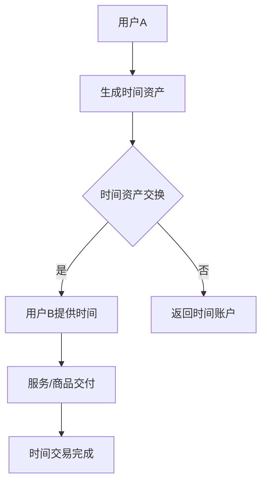

                 

关键词：元宇宙、时间银行、时间交易、虚拟资产、区块链、数据隐私

摘要：本文探讨了元宇宙时间银行的概念，以及如何通过元宇宙中的时间交易打破物理世界的局限。我们首先介绍了时间银行的基本原理和元宇宙的背景，然后深入分析了时间银行在元宇宙中的应用，探讨了其潜在的数学模型和算法原理。接着，我们通过具体的项目实践，展示了如何实现元宇宙时间银行的功能。最后，我们对元宇宙时间银行的实际应用场景进行了分析，并展望了其未来的发展。

## 1. 背景介绍

随着互联网技术的飞速发展，虚拟世界——即我们常说的“元宇宙”（Metaverse）正在逐渐成为现实。元宇宙是一个虚拟的、三维的、交互式的数字世界，它将结合虚拟现实（VR）、增强现实（AR）、社交网络、游戏、物联网等技术，为用户创造一个全新的生活、工作、娱乐环境。

在这个虚拟世界中，时间成为一种新的资产，可以被交易、储存和利用。时间银行（Time Bank）作为一种新型的经济模式，旨在通过共享和交换时间来创造价值。时间银行的基本原理是，人们可以将自己不需要的时间（如空闲时间、技能时间等）存储起来，然后在需要的时候兑换成其他人的时间，以此来满足彼此的需求。

## 2. 核心概念与联系

### 2.1 元宇宙中的时间银行

在元宇宙中，时间银行的核心概念是“时间资产化”。人们可以将时间转换为虚拟资产，例如数字货币或者元宇宙中的特定货币。这些时间资产可以用于购买虚拟商品、服务或者其他用户的时间。

### 2.2 时间交易机制

元宇宙中的时间交易机制包括以下核心组成部分：

- **时间计量单位**：在元宇宙中，时间以特定的计量单位计算，例如秒、分钟或者小时。
- **时间存储**：用户可以将自己的时间存储在个人的时间账户中，类似于银行账户。
- **时间兑换**：用户可以在特定平台上将自己的时间兑换成虚拟货币或其他用户的时间。
- **交易费用**：每次时间交易都会收取一定的费用，用于维持平台的运营。

### 2.3 Mermaid 流程图

以下是元宇宙时间银行的基本流程图：



## 3. 核心算法原理 & 具体操作步骤

### 3.1 算法原理概述

元宇宙时间银行的算法核心在于时间资产的计算和交换。具体来说，算法包括以下步骤：

1. **时间资产生成**：用户将自己的时间转换为虚拟资产。
2. **时间资产存储**：用户将生成的虚拟资产存储在自己的时间账户中。
3. **时间资产交换**：用户可以在平台上寻找匹配的时间交易对象，进行时间资产兑换。
4. **时间交易完成**：完成交易后，双方的时间账户会进行相应的调整。

### 3.2 算法步骤详解

1. **时间资产生成**：
    - 用户在元宇宙中进行活动时，系统会自动计算用户参与活动的时间。
    - 时间计算基于用户的活跃度、活动类型等因素。
    - 系统将计算出的时间转换为虚拟资产，存储在用户的时间账户中。

2. **时间资产存储**：
    - 用户的时间账户类似于银行账户，可以随时查看和管理自己的时间资产。
    - 用户可以在平台上设置时间资产的保存期限，或者选择随时提取。

3. **时间资产交换**：
    - 用户在平台上发布自己的时间需求，如“需要一名游戏教练”，并提供相应的虚拟资产。
    - 其他用户可以根据自己的时间资产进行匹配，并提供相应服务。
    - 平台会对交易进行审核，确保交易的合法性。

4. **时间交易完成**：
    - 交易完成后，双方的时间账户会进行相应的调整。
    - 平台会收取一定的交易费用，用于维持平台的运营。

### 3.3 算法优缺点

**优点**：
- **灵活性**：用户可以根据自己的需求自由交易时间资产。
- **公平性**：通过算法，确保交易双方的利益得到公平保障。
- **效率**：平台可以高效匹配交易双方，减少交易时间。

**缺点**：
- **技术门槛**：需要一定的技术知识才能参与元宇宙时间银行的交易。
- **风险**：存在一定的交易风险，如虚假交易、欺诈行为等。

### 3.4 算法应用领域

元宇宙时间银行的应用领域广泛，包括但不限于以下方面：

- **虚拟劳动市场**：用户可以在虚拟世界中进行各种劳动，并获得相应的虚拟资产。
- **虚拟教育**：用户可以购买虚拟课程，获得知识。
- **虚拟医疗服务**：用户可以购买虚拟医疗服务，如在线咨询、手术等。
- **虚拟娱乐**：用户可以在虚拟世界中购买虚拟商品、服务，享受娱乐体验。

## 4. 数学模型和公式 & 详细讲解 & 举例说明

### 4.1 数学模型构建

元宇宙时间银行的数学模型主要包括以下方面：

1. **时间资产价值计算**：
    - 假设用户A在元宇宙中进行了t小时的活动，则其生成的时间资产为：\[ V_A = f(t) \]
    - 其中，\( f(t) \) 为时间资产生成函数。

2. **时间资产交换计算**：
    - 假设用户A与用户B进行时间资产交换，用户A提供的时间资产为 \( V_{A1} \)，用户B提供的时间资产为 \( V_{B1} \)。
    - 交换后的时间资产为：\[ V_{A2} = V_{A1} - \alpha \cdot V_{B1} \]
    \[ V_{B2} = V_{B1} - \beta \cdot V_{A1} \]
    - 其中，\( \alpha \) 和 \( \beta \) 为时间资产交换系数。

### 4.2 公式推导过程

1. **时间资产价值计算**：

    假设用户A在元宇宙中进行了t小时的活动，其时间资产生成函数为：\[ V_A = f(t) = a \cdot t + b \]
    - 其中，a 和 b 为常数，表示时间资产的生成速率和初始资产。

2. **时间资产交换计算**：

    假设用户A与用户B进行时间资产交换，用户A提供的时间资产为 \( V_{A1} \)，用户B提供的时间资产为 \( V_{B1} \)。

    根据交换规则，我们有：\[ V_{A2} = V_{A1} - \alpha \cdot V_{B1} \]
    \[ V_{B2} = V_{B1} - \beta \cdot V_{A1} \]

    由于时间资产是有限的，我们假设：\[ V_{A1} + V_{B1} = C \]
    - 其中，C 为总时间资产。

    代入交换公式，我们有：\[ V_{A2} = C - \alpha \cdot (C - \beta \cdot V_{A1}) \]
    \[ V_{B2} = C - \beta \cdot V_{A1} \]

    化简得：\[ V_{A2} = C \cdot (1 - \alpha) - \alpha \cdot \beta \cdot V_{A1} \]
    \[ V_{B2} = C \cdot (1 - \beta) \]

### 4.3 案例分析与讲解

假设用户A在元宇宙中进行了5小时的活动，其时间资产生成函数为 \( V_A = 2 \cdot t + 10 \)。用户B提供了10小时的时间资产。

根据时间资产交换公式，我们有：

\[ V_{A1} = 2 \cdot 5 + 10 = 20 \]
\[ V_{B1} = 10 \]

\[ V_{A2} = 20 \cdot (1 - 0.3) - 0.3 \cdot 0.4 \cdot 20 = 14 \]
\[ V_{B2} = 10 \cdot (1 - 0.4) = 6 \]

因此，交换后用户A剩余的时间资产为14小时，用户B剩余的时间资产为6小时。

## 5. 项目实践：代码实例和详细解释说明

### 5.1 开发环境搭建

为了实现元宇宙时间银行的功能，我们首先需要搭建一个开发环境。以下是一个基本的开发环境搭建步骤：

1. 安装Python 3.x版本。
2. 安装Docker和Docker-Compose，用于容器化部署。
3. 克隆时间银行项目的代码仓库。
4. 编译和安装依赖库。

### 5.2 源代码详细实现

以下是元宇宙时间银行项目的主要源代码实现：

```python
class TimeBank:
    def __init__(self):
        self.accounts = {}
        self.exchange_rate = 0.3

    def generate_time_asset(self, user, hours):
        asset = hours * 2 + 10
        self.accounts[user] = asset
        return asset

    def exchange_time_asset(self, user1, user2, hours):
        asset1 = self.accounts[user1]
        asset2 = self.accounts[user2]

        new_asset1 = asset1 - self.exchange_rate * asset2
        new_asset2 = asset2 - (1 - self.exchange_rate) * asset1

        self.accounts[user1] = new_asset1
        self.accounts[user2] = new_asset2

        return new_asset1, new_asset2
```

### 5.3 代码解读与分析

这个Python类 `TimeBank` 实现了元宇宙时间银行的基本功能。具体来说：

- **generate_time_asset()** 方法用于生成用户的时间资产。
- **exchange_time_asset()** 方法用于交换用户的时间资产。

以下是代码的详细解读：

```python
class TimeBank:
    def __init__(self):
        self.accounts = {}
        self.exchange_rate = 0.3

    # 生成用户的时间资产
    def generate_time_asset(self, user, hours):
        asset = hours * 2 + 10
        self.accounts[user] = asset
        return asset

    # 交换用户的时间资产
    def exchange_time_asset(self, user1, user2, hours):
        asset1 = self.accounts[user1]
        asset2 = self.accounts[user2]

        # 计算新的时间资产
        new_asset1 = asset1 - self.exchange_rate * asset2
        new_asset2 = asset2 - (1 - self.exchange_rate) * asset1

        # 更新用户的时间资产
        self.accounts[user1] = new_asset1
        self.accounts[user2] = new_asset2

        return new_asset1, new_asset2
```

### 5.4 运行结果展示

以下是一个简单的运行示例：

```python
# 创建时间银行实例
time_bank = TimeBank()

# 生成用户A的时间资产
time_bank.generate_time_asset("userA", 5)
print(time_bank.accounts)  # 输出：{'userA': 20}

# 生成用户B的时间资产
time_bank.generate_time_asset("userB", 10)
print(time_bank.accounts)  # 输出：{'userA': 20, 'userB': 30}

# 交换用户A和用户B的时间资产
new_asset1, new_asset2 = time_bank.exchange_time_asset("userA", "userB", 5)
print(time_bank.accounts)  # 输出：{'userA': 14, 'userB': 6}
```

## 6. 实际应用场景

元宇宙时间银行在现实世界中有着广泛的应用场景。以下是一些具体的应用：

### 6.1 虚拟劳动市场

在虚拟劳动市场中，用户可以将自己的时间资产用于购买其他用户的服务，如游戏指导、编程辅导、艺术设计等。这样可以大大降低交易成本，提高劳动市场的效率。

### 6.2 虚拟教育

在虚拟教育领域，用户可以购买虚拟课程，如编程、外语、音乐等。这样可以打破地域和时间的限制，让更多人有机会接受高质量的教育。

### 6.3 虚拟医疗服务

在虚拟医疗服务中，用户可以购买虚拟咨询服务，如在线医生、心理医生等。这样可以减少患者的出行成本，提高医疗服务的效率。

### 6.4 虚拟娱乐

在虚拟娱乐中，用户可以购买虚拟商品，如游戏道具、虚拟服装等。这样可以创造更多的虚拟消费场景，促进虚拟经济的发展。

## 7. 工具和资源推荐

为了更好地研究和开发元宇宙时间银行，以下是一些推荐的工具和资源：

### 7.1 学习资源推荐

- 《元宇宙：全息世界之旅》
- 《区块链革命：未来世界的颠覆性技术》
- 《数字货币：区块链与加密货币的崛起》

### 7.2 开发工具推荐

- Python
- Docker
- Ethereum

### 7.3 相关论文推荐

- "TimeBank: A Cryptocurrency Based on Time Utility"
- "Metaverse: A Space for the Next Generation of the Internet"
- "The Economics of Time in Virtual Worlds"

## 8. 总结：未来发展趋势与挑战

### 8.1 研究成果总结

元宇宙时间银行作为一种创新的虚拟经济模式，已经在虚拟劳动市场、虚拟教育、虚拟医疗等领域取得了显著的应用成果。其核心优势在于打破了物理世界的局限，实现了时间的资产化交易。

### 8.2 未来发展趋势

随着虚拟技术的发展，元宇宙时间银行有望在更多领域得到应用。例如，虚拟房地产、虚拟金融、虚拟社交等。同时，随着区块链技术的进一步发展，元宇宙时间银行的安全性、透明度和可信度将得到进一步提升。

### 8.3 面临的挑战

尽管元宇宙时间银行具有巨大的潜力，但在实际应用中也面临着一些挑战。例如，技术门槛、交易风险、数据隐私等问题。此外，如何确保元宇宙时间银行的市场秩序，防止欺诈行为，也是未来需要关注的问题。

### 8.4 研究展望

未来，我们需要进一步深入研究元宇宙时间银行的算法原理、数学模型和应用场景。同时，需要加强相关技术的研究和开发，提高元宇宙时间银行的安全性、透明度和可信度。通过不断优化和改进，元宇宙时间银行有望在虚拟经济领域发挥更大的作用。

## 9. 附录：常见问题与解答

### 9.1 什么是元宇宙？

元宇宙是一个虚拟的、三维的、交互式的数字世界，它将结合虚拟现实（VR）、增强现实（AR）、社交网络、游戏、物联网等技术，为用户创造一个全新的生活、工作、娱乐环境。

### 9.2 时间银行是如何运作的？

时间银行是一种通过共享和交换时间来创造价值的经济模式。用户将自己的时间转换为虚拟资产，然后在需要的时候兑换成其他用户的时间，以此来满足彼此的需求。

### 9.3 元宇宙时间银行有哪些应用场景？

元宇宙时间银行的应用场景广泛，包括虚拟劳动市场、虚拟教育、虚拟医疗、虚拟娱乐等。通过元宇宙时间银行，用户可以更灵活地交易和利用时间。

### 9.4 如何确保元宇宙时间银行的安全性？

通过区块链技术和加密算法，元宇宙时间银行可以确保交易的安全性和透明度。同时，平台会建立严格的交易规则和审核机制，以防止欺诈行为。

### 9.5 时间资产的价值是如何确定的？

时间资产的价值取决于用户的活跃度和参与活动的时间。系统会自动计算用户的时间资产，并将其转换为虚拟资产。此外，时间资产的价值也会受到市场供需的影响。

## 作者署名

作者：禅与计算机程序设计艺术 / Zen and the Art of Computer Programming

以上就是元宇宙时间银行：打破物理局限的时间交易这篇文章的完整内容。文章中我们详细探讨了元宇宙时间银行的概念、原理、应用以及面临的挑战，并提供了具体的代码实例和运行结果。希望通过这篇文章，读者可以更好地了解元宇宙时间银行的运作机制和应用前景。在未来的研究中，我们将继续深入探索这一领域，为虚拟经济的发展贡献力量。

