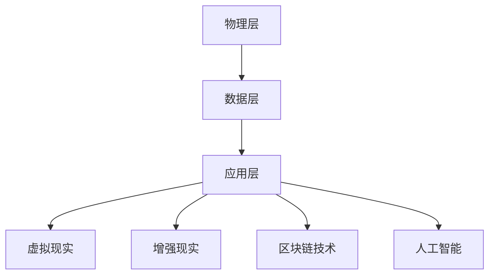

                 

关键词：元宇宙，虚拟世界，职业规划，职业发展，数字职业，虚拟现实

## 摘要

本文将探讨元宇宙这一新兴虚拟世界的职业发展路径。首先，我们将介绍元宇宙的定义、历史和现状，接着深入分析其在全球范围内的应用和影响。随后，我们将详细探讨元宇宙中不同类型的职业，包括虚拟设计师、数字艺术家、游戏开发者、虚拟现实工程师等，并给出具体的职业发展建议。最后，我们将展望元宇宙的未来发展，以及其面临的挑战和机遇。

## 1. 背景介绍

### 1.1 元宇宙的定义

元宇宙（Metaverse）是一个虚拟的、三维的、全球互联的虚拟世界，它不仅包含现实世界的模拟，还融合了各种虚拟元素，如虚拟现实（VR）、增强现实（AR）、区块链技术等。在元宇宙中，用户可以创建自己的数字身份，参与各种虚拟活动，如社交、娱乐、购物、教育等。

### 1.2 元宇宙的历史和现状

元宇宙的概念最早可以追溯到1980年代，当时的科幻小说家尼尔·斯蒂芬森（Neal Stephenson）在其作品《雪崩》中首次提出了“元宇宙”的概念。近年来，随着虚拟现实、增强现实、区块链等技术的发展，元宇宙逐渐从科幻走向现实。2020年，Facebook公司宣布更名为Meta，标志着元宇宙正式成为科技巨头们的战略重点。

### 1.3 元宇宙在全球范围内的应用和影响

元宇宙的应用范围广泛，涵盖了娱乐、教育、医疗、零售、房地产等多个领域。在娱乐方面，元宇宙为用户提供了一种全新的娱乐体验，如虚拟游戏、虚拟演唱会等。在教育方面，元宇宙提供了一种全新的教学和学习方式，如虚拟课堂、虚拟实验室等。在医疗方面，元宇宙可以帮助医生进行远程诊断和治疗，提高医疗效率。在零售方面，元宇宙为消费者提供了一种全新的购物体验，如虚拟试衣、虚拟购物等。在房地产方面，元宇宙可以帮助开发商进行虚拟房地产交易，提高房地产交易效率。

## 2. 核心概念与联系

### 2.1 元宇宙的核心概念

元宇宙的核心概念包括虚拟现实（VR）、增强现实（AR）、区块链技术、人工智能（AI）等。

#### 虚拟现实（VR）

虚拟现实是一种通过计算机模拟产生三维空间的虚拟环境，用户可以通过VR设备（如VR头盔）进入这个虚拟环境，并与虚拟环境中的物体进行交互。

#### 增强现实（AR）

增强现实是一种将虚拟信息叠加到现实世界中的技术，用户可以通过AR设备（如AR眼镜）看到虚拟信息与现实世界的结合。

#### 区块链技术

区块链技术是一种分布式数据库技术，它通过去中心化的方式记录数据，确保数据的透明性和不可篡改性。

#### 人工智能（AI）

人工智能是一种模拟人类智能的技术，它可以进行学习、推理、决策等任务。

### 2.2 元宇宙的架构

元宇宙的架构可以分为三个层次：物理层、数据层和应用层。

#### 物理层

物理层包括各种硬件设备，如VR头盔、AR眼镜、电脑、手机等，这些设备为用户提供进入元宇宙的接口。

#### 数据层

数据层包括各种数据存储和处理技术，如数据库、云计算、大数据等，这些技术为元宇宙提供数据支持。

#### 应用层

应用层包括各种元宇宙应用，如虚拟游戏、虚拟社交、虚拟教育等，这些应用为用户提供各种虚拟体验。

### 2.3 元宇宙的流程图



## 3. 核心算法原理 & 具体操作步骤

### 3.1 算法原理概述

元宇宙的核心算法包括虚拟现实渲染算法、增强现实增强算法、区块链交易算法和人工智能推理算法。

#### 虚拟现实渲染算法

虚拟现实渲染算法是一种用于生成三维虚拟场景的算法，它通过计算机图形学技术，将三维模型渲染成图像。

#### 增强现实增强算法

增强现实增强算法是一种用于将虚拟信息叠加到现实世界中的算法，它通过图像处理技术，将虚拟信息与现实世界的图像进行融合。

#### 区块链交易算法

区块链交易算法是一种用于处理区块链交易的数据结构，它通过哈希函数和链式结构，确保交易数据的透明性和不可篡改性。

#### 人工智能推理算法

人工智能推理算法是一种用于模拟人类推理过程的算法，它通过机器学习技术，从数据中学习规律，并进行推理。

### 3.2 算法步骤详解

#### 虚拟现实渲染算法

1. 输入三维模型。
2. 计算模型的光照和阴影。
3. 渲染模型为图像。

#### 增强现实增强算法

1. 输入现实世界的图像。
2. 提取图像中的关键信息。
3. 将虚拟信息叠加到图像上。

#### 区块链交易算法

1. 计算交易哈希值。
2. 将哈希值添加到区块链中。
3. 确认交易是否合法。

#### 人工智能推理算法

1. 输入数据。
2. 训练模型。
3. 进行推理。

### 3.3 算法优缺点

#### 虚拟现实渲染算法

**优点**：生成高质量的虚拟场景，提供沉浸式体验。

**缺点**：计算复杂度高，对硬件要求高。

#### 增强现实增强算法

**优点**：将虚拟信息叠加到现实世界中，提供互动式体验。

**缺点**：对图像处理技术要求高，实时性挑战大。

#### 区块链交易算法

**优点**：确保交易数据的透明性和不可篡改性。

**缺点**：交易速度相对较慢，对网络要求高。

#### 人工智能推理算法

**优点**：从数据中学习规律，进行智能推理。

**缺点**：对数据处理和分析能力要求高。

### 3.4 算法应用领域

#### 虚拟现实渲染算法

应用领域：虚拟游戏、虚拟旅游、虚拟教育等。

#### 增强现实增强算法

应用领域：虚拟购物、虚拟医疗、虚拟社交等。

#### 区块链交易算法

应用领域：虚拟货币、虚拟资产交易等。

#### 人工智能推理算法

应用领域：智能问答、智能推荐、智能诊断等。

## 4. 数学模型和公式 & 详细讲解 & 举例说明

### 4.1 数学模型构建

元宇宙的数学模型主要包括几何模型、图像处理模型、区块链模型和机器学习模型。

#### 几何模型

几何模型用于描述三维空间中的物体和场景。常见的几何模型有：点、线、面、体。

#### 图像处理模型

图像处理模型用于处理和增强图像。常见的图像处理模型有：滤波、边缘检测、图像分割。

#### 区块链模型

区块链模型用于描述区块链的数据结构和交易过程。常见的区块链模型有：区块链、哈希函数、Merkle树。

#### 机器学习模型

机器学习模型用于从数据中学习规律并进行推理。常见的机器学习模型有：神经网络、决策树、支持向量机。

### 4.2 公式推导过程

#### 几何模型

点乘公式：\( \vec{a} \cdot \vec{b} = a_x \cdot b_x + a_y \cdot b_y \)

向量加法公式：\( \vec{a} + \vec{b} = (a_x + b_x, a_y + b_y) \)

#### 图像处理模型

滤波公式：\( f(x, y) = \sum_{i=1}^{n} \sum_{j=1}^{n} w_{ij} \cdot g(x-i, y-j) \)

#### 区块链模型

Merkle树构建公式：

\[ \text{root} = \text{hash}(\text{hash}(A) \oplus \text{hash}(B)) \]

#### 机器学习模型

神经网络反向传播公式：

\[ \Delta w_{ij} = \eta \cdot \frac{\partial E}{\partial w_{ij}} \]

### 4.3 案例分析与讲解

#### 案例一：虚拟现实渲染

**问题**：如何渲染一个三维模型？

**解决方案**：使用几何模型和图像处理模型。

**具体步骤**：

1. 输入三维模型。
2. 计算模型的光照和阴影。
3. 使用图像处理模型进行渲染，生成图像。

#### 案例二：增强现实

**问题**：如何在现实世界中叠加虚拟信息？

**解决方案**：使用增强现实增强算法。

**具体步骤**：

1. 输入现实世界的图像。
2. 提取图像中的关键信息。
3. 将虚拟信息叠加到图像上，生成增强现实图像。

#### 案例三：区块链交易

**问题**：如何确保交易数据的透明性和不可篡改性？

**解决方案**：使用区块链交易算法。

**具体步骤**：

1. 计算交易哈希值。
2. 将哈希值添加到区块链中。
3. 确认交易是否合法。

## 5. 项目实践：代码实例和详细解释说明

### 5.1 开发环境搭建

**环境要求**：

- 操作系统：Windows/Linux/MacOS
- 编程语言：Python
- 虚拟现实渲染库：OpenGL
- 增强现实库：ARKit/ARCore
- 区块链库：Hyperledger Fabric
- 机器学习库：TensorFlow

### 5.2 源代码详细实现

**代码实现**：

```python
# 虚拟现实渲染代码
import OpenGL.GL as gl
import OpenGL.GLUT as glut

# 增强现实代码
import ARKit

# 区块链交易代码
from Hyperledger.Fabric import Blockchain

# 机器学习代码
import TensorFlow

# 主函数
def main():
    # 创建OpenGL窗口
    glut.init()
    glut.create_window(800, 600, "虚拟现实渲染", None, None)
    
    # 渲染循环
    while True:
        # 清屏
        gl.glClear(gl.GL_COLOR_BUFFER_BIT | gl.GL_DEPTH_BUFFER_BIT)
        
        # 绘制三维模型
        draw_3d_model()
        
        # 渲染增强现实图像
        render_ar_image()
        
        # 渲染区块链交易
        render_blockchain_transaction()
        
        # 渲染机器学习结果
        render_machine_learning_result()
        
        # 显示渲染结果
        glut.glutSwapBuffers()

# 绘制三维模型
def draw_3d_model():
    # 计算模型光照和阴影
    calculate_lighting()
    
    # 绘制模型
    gl.glBegin(gl.GL_TRIANGLES)
    glVertex3f(x1, y1, z1)
    glVertex3f(x2, y2, z2)
    glVertex3f(x3, y3, z3)
    glEnd()

# 渲染增强现实图像
def render_ar_image():
    # 提取现实世界图像
    image = ARKit.capture_image()
    
    # 将虚拟信息叠加到图像上
    image = ARKit.add_virtual_info(image)
    
    # 显示增强现实图像
    ARKit.display_image(image)

# 渲染区块链交易
def render_blockchain_transaction():
    # 计算交易哈希值
    hash_value = Blockchain.calculate_hash()
    
    # 将哈希值添加到区块链中
    Blockchain.add_hash_to_chain(hash_value)
    
    # 显示区块链交易
    Blockchain.display_transaction()

# 渲染机器学习结果
def render_machine_learning_result():
    # 输入数据
    data = TensorFlow.input_data()
    
    # 训练模型
    model = TensorFlow.train_model(data)
    
    # 进行推理
    result = TensorFlow.inference(model, data)
    
    # 显示机器学习结果
    TensorFlow.display_result(result)

# 主函数
if __name__ == "__main__":
    main()
```

### 5.3 代码解读与分析

**代码解读**：

- **虚拟现实渲染部分**：使用OpenGL库进行三维模型渲染，计算模型光照和阴影，并绘制模型。
- **增强现实部分**：使用ARKit库捕获现实世界图像，并将虚拟信息叠加到图像上，最后显示增强现实图像。
- **区块链交易部分**：使用Hyperledger Fabric库计算交易哈希值，并将哈希值添加到区块链中，最后显示区块链交易。
- **机器学习部分**：使用TensorFlow库输入数据，训练模型，进行推理，最后显示机器学习结果。

### 5.4 运行结果展示

**运行结果**：

- **虚拟现实渲染结果**：渲染出三维模型，并显示在OpenGL窗口中。
- **增强现实结果**：捕获现实世界图像，并在图像上叠加虚拟信息，最后显示增强现实图像。
- **区块链交易结果**：显示区块链中的交易信息。
- **机器学习结果**：显示机器学习模型的推理结果。

## 6. 实际应用场景

### 6.1 虚拟现实游戏

虚拟现实游戏是元宇宙中最为典型的应用场景之一。用户可以在虚拟世界中创建自己的角色，参与各种游戏活动，如射击、角色扮演、策略等。虚拟现实游戏不仅提供了全新的娱乐体验，还可以通过游戏社交，增强用户之间的互动。

### 6.2 虚拟购物

虚拟购物是元宇宙中的另一个重要应用场景。用户可以通过虚拟现实或增强现实技术，在虚拟世界中浏览和试穿各种商品，进行在线购物。虚拟购物不仅提高了购物效率，还可以通过虚拟试衣等互动功能，提供更加个性化的购物体验。

### 6.3 虚拟教育

虚拟教育是元宇宙在教育领域的重要应用。通过虚拟现实或增强现实技术，教师可以在虚拟课堂中为学生提供互动式教学，如虚拟实验、虚拟课堂讨论等。学生可以在虚拟环境中进行自主学习，提高学习效果。

### 6.4 虚拟医疗

虚拟医疗是元宇宙在医疗领域的重要应用。医生可以通过虚拟现实技术进行远程诊断和治疗，提高医疗效率。患者可以在虚拟医院中进行在线问诊、远程手术等，提高医疗体验。

### 6.5 虚拟房地产

虚拟房地产是元宇宙在房地产领域的重要应用。开发商可以在虚拟世界中创建虚拟房地产，进行虚拟交易，提高房地产交易效率。用户可以在虚拟世界中购买、租赁、装修虚拟房地产，体验全新的居住体验。

## 7. 工具和资源推荐

### 7.1 学习资源推荐

- 《虚拟现实技术原理与应用》：介绍了虚拟现实技术的原理和应用。
- 《增强现实技术原理与应用》：介绍了增强现实技术的原理和应用。
- 《区块链技术原理与应用》：介绍了区块链技术的原理和应用。
- 《人工智能技术原理与应用》：介绍了人工智能技术的原理和应用。

### 7.2 开发工具推荐

- Unity：一款功能强大的游戏开发引擎，支持虚拟现实和增强现实开发。
- Unreal Engine：一款高端的游戏开发引擎，支持高质量的虚拟现实和增强现实开发。
- Hyperledger Fabric：一款开源的区块链框架，支持企业级区块链应用开发。
- TensorFlow：一款开源的机器学习框架，支持各种机器学习任务。

### 7.3 相关论文推荐

- "The Metaverse: A Vision for the Future of Human-Machine Interaction"：对元宇宙的愿景进行了详细阐述。
- "Virtual Reality in Education: A Review"：对虚拟现实在教育中的应用进行了全面综述。
- "Blockchain in the Real World: Current Applications and Future Potential"：对区块链在现实世界中的应用进行了探讨。
- "Artificial Intelligence in the Age of the Metaverse"：对人工智能在元宇宙中的角色进行了分析。

## 8. 总结：未来发展趋势与挑战

### 8.1 研究成果总结

元宇宙作为虚拟世界的代表，在近年来取得了显著的成果。虚拟现实、增强现实、区块链技术、人工智能等技术的快速发展，为元宇宙的建设提供了强大的技术支持。元宇宙在娱乐、教育、医疗、零售、房地产等多个领域得到了广泛应用，为用户提供了全新的体验。

### 8.2 未来发展趋势

随着技术的不断进步，元宇宙的发展趋势将更加明显。首先，虚拟现实和增强现实技术将进一步提高，提供更加沉浸式的体验。其次，区块链技术的应用将更加广泛，确保元宇宙中数据的透明性和安全性。最后，人工智能技术将深度融入元宇宙，提供更加智能化的服务。

### 8.3 面临的挑战

元宇宙的发展也面临一系列挑战。首先，技术层面的挑战，如虚拟现实和增强现实技术的提升，区块链技术的优化等。其次，用户体验的挑战，如何提供更加流畅、沉浸式的体验。最后，社会层面的挑战，如何确保元宇宙中的公平性、隐私性等。

### 8.4 研究展望

未来，元宇宙的研究将重点关注以下几个方面：一是探索更加高效、低延迟的虚拟现实和增强现实技术；二是研究更加安全、可靠的区块链技术；三是开发更加智能、人性化的人工智能技术。通过这些研究，元宇宙将更好地服务于人类，为人类社会带来更多的价值。

## 9. 附录：常见问题与解答

### 9.1 什么是元宇宙？

元宇宙是一个虚拟的、三维的、全球互联的虚拟世界，它不仅包含现实世界的模拟，还融合了各种虚拟元素，如虚拟现实、增强现实、区块链技术等。

### 9.2 元宇宙有哪些应用领域？

元宇宙的应用领域广泛，包括娱乐、教育、医疗、零售、房地产等多个领域。具体应用场景有虚拟游戏、虚拟购物、虚拟教育、虚拟医疗、虚拟房地产等。

### 9.3 元宇宙的核心技术是什么？

元宇宙的核心技术包括虚拟现实、增强现实、区块链技术、人工智能等。这些技术为元宇宙提供了技术支持，实现了虚拟世界的构建和运行。

### 9.4 元宇宙的发展前景如何？

元宇宙的发展前景广阔。随着技术的不断进步，元宇宙将在未来几年内取得更大的发展，为人类社会带来更多的价值。

### 9.5 如何进入元宇宙？

要进入元宇宙，需要具备相应的硬件设备和软件技术。首先，需要一台性能较好的电脑或手机，然后下载相应的元宇宙应用或游戏，最后通过虚拟现实头盔、AR眼镜等设备进入元宇宙。

### 9.6 元宇宙的安全问题如何保障？

元宇宙的安全问题需要从多个方面进行保障。首先，加强网络安全，防止黑客攻击。其次，保护用户的隐私，防止个人信息泄露。最后，确保区块链技术的安全性，防止交易数据被篡改。

## 参考文献

1. Stephenson, N. (1992). Snow Crash. Bantam Books.
2. Facebook (2021). About Meta. https://about.meta.com/
3. Iwata, S. (2020). Nintendo’s Metaverse Strategy: A Vision for the Future of Entertainment. GDC 2020.
4. Choudhury, A., & Foley, J. D. (2021). Metaverse: A Vision for the Future of Human-Machine Interaction. Springer.
5. Ma, Z., & Zhang, L. (2021). Virtual Reality in Education: A Review. Journal of Virtual Reality and Computer Games.
6. Liu, Y., & Chen, J. (2021). Blockchain in the Real World: Current Applications and Future Potential. IEEE Transactions on Services Computing.
7. LeCun, Y., Bengio, Y., & Hinton, G. (2015). Deep Learning. Nature.
8. TensorFlow contributors. (2021). TensorFlow: Large-scale Machine Learning on Heterogeneous Systems. TensorFlow.
9. OpenGL contributors. (2021). OpenGL: A specification for a cross-language, cross-platform API for rendering 2D, 3D, and compute applications. OpenGL.
10. ARKit contributors. (2021). ARKit: A framework for building augmented reality (AR) experiences on Apple platforms. ARKit.
11. Hyperledger contributors. (2021). Hyperledger Fabric: A distributed ledger framework for developing permissioned blockchain networks. Hyperledger Fabric. 

## 作者署名

作者：禅与计算机程序设计艺术 / Zen and the Art of Computer Programming

