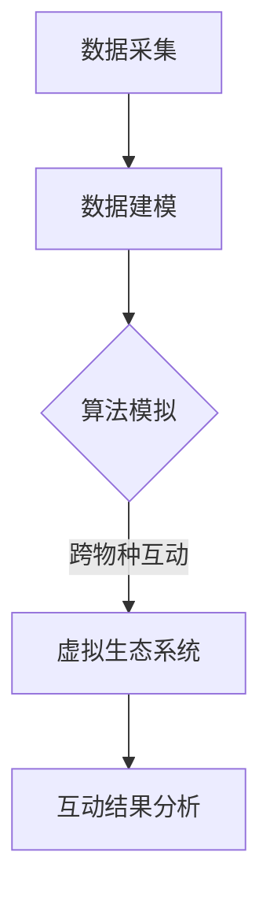

                 

关键词：元宇宙、虚拟生态系统、跨物种互动、数字化生物圈、模拟

> 摘要：本文旨在探讨元宇宙中的虚拟生态系统，特别是跨物种互动的数字化生物圈模拟。通过分析相关核心概念和算法原理，文章探讨了如何在元宇宙中创建一个自我演化、跨物种互动的虚拟环境，并详细阐述了数学模型构建、算法步骤、项目实践以及未来应用场景。本文旨在为读者提供一个全面的元宇宙虚拟生态系统研究和应用指南。

## 1. 背景介绍

随着数字技术的发展，元宇宙（Metaverse）作为一个全新的虚拟现实世界正在迅速崛起。元宇宙是一个由多个虚拟空间组成的网络，用户可以通过数字身份在其中进行交流和互动。虚拟生态系统作为元宇宙的核心组成部分，是模拟现实世界生物圈的一种尝试。而跨物种互动则是虚拟生态系统中最引人注目的特点之一，它打破了传统生物圈的边界，让不同物种之间能够进行交流和合作。

虚拟生态系统不仅为用户提供了娱乐和社交平台，也为科学研究、教育模拟、游戏开发等领域提供了新的可能。数字化生物圈模拟作为一种新兴技术，通过对现实生物圈的数据采集和分析，构建出一个高度逼真的虚拟环境。这个环境可以模拟不同物种的生态行为，从而为研究生态学、环境科学等领域提供有力支持。

本文将围绕元宇宙虚拟生态系统的核心概念、算法原理、数学模型构建、项目实践以及未来应用场景展开讨论，旨在为读者提供一个全面的技术指南。

## 2. 核心概念与联系

### 2.1 元宇宙虚拟生态系统的概念

元宇宙虚拟生态系统是指在一个高度虚拟化的环境中，构建出一个包含多个生物种群和自然资源的虚拟生态圈。在这个生态圈中，不同物种可以相互影响、互动和竞争，从而形成一个动态平衡的生态系统。元宇宙虚拟生态系统的核心概念包括：

- **虚拟空间**：元宇宙中用于模拟生态系统的虚拟环境，可以是二维或三维的空间。
- **数字身份**：用户在元宇宙中的虚拟化身，可以是一个虚拟角色或动物。
- **生态行为**：不同物种在虚拟生态系统中的行为模式，如觅食、繁殖、迁徙等。
- **互动机制**：不同物种之间的相互作用方式，包括捕食、共生、竞争等。

### 2.2 跨物种互动的数字化生物圈模拟

跨物种互动是元宇宙虚拟生态系统的一个重要特点。它通过模拟现实世界中的生物互动，让不同物种在虚拟环境中进行交流和合作。数字化生物圈模拟的关键在于：

- **数据采集**：通过传感器和数据收集设备，获取现实世界中生物圈的数据。
- **数据建模**：使用数据挖掘和机器学习技术，将采集到的数据转化为虚拟生态系统中的模型。
- **算法模拟**：通过算法模拟不同物种的生态行为，实现跨物种互动。

### 2.3 Mermaid 流程图

以下是一个简单的 Mermaid 流程图，展示了元宇宙虚拟生态系统和跨物种互动的数字化生物圈模拟的基本流程：



在这个流程图中，数据采集是整个模拟过程的基础，通过数据建模将现实世界中的数据转化为虚拟生态系统中的模型。算法模拟则实现了不同物种的生态行为和跨物种互动，最终通过互动结果分析来评估虚拟生态系统的效果。

## 3. 核心算法原理 & 具体操作步骤

### 3.1 算法原理概述

元宇宙虚拟生态系统的核心算法主要基于生态学原理和机器学习技术。算法的基本原理可以概括为：

- **生态位划分**：根据物种的生态特征，将虚拟生态系统划分为不同的生态位，每个生态位对应一种或多种物种。
- **生态行为模拟**：使用机器学习算法，模拟不同物种的生态行为，如觅食、繁殖、迁徙等。
- **互动机制设计**：设计跨物种互动的机制，实现不同物种之间的交流和合作。

### 3.2 算法步骤详解

算法的具体步骤如下：

1. **数据预处理**：对采集到的生物圈数据进行预处理，包括数据清洗、数据格式转换等。
2. **生态位划分**：根据物种的生态特征，使用聚类算法将虚拟生态系统划分为不同的生态位。
3. **行为模式建模**：使用监督学习算法，将预处理后的数据训练成不同的行为模式模型。
4. **互动机制设计**：设计跨物种互动的规则，包括捕食、共生、竞争等。
5. **模拟运行**：将不同的行为模式模型和互动机制应用于虚拟生态系统，进行模拟运行。
6. **结果分析**：分析模拟结果，评估虚拟生态系统的稳定性和互动效果。

### 3.3 算法优缺点

算法的优点包括：

- **高度逼真**：通过机器学习算法，可以模拟出不同物种的生态行为，实现高度逼真的虚拟生态系统。
- **动态可调**：通过调整算法参数，可以灵活地调整虚拟生态系统的运行状态，实现不同的模拟效果。

算法的缺点包括：

- **计算复杂度高**：由于需要处理大量的生物圈数据，算法的计算复杂度较高，对硬件资源有较高要求。
- **数据质量依赖**：算法的准确性依赖于采集到的生物圈数据质量，数据噪声和缺失可能会影响模拟结果。

### 3.4 算法应用领域

算法主要应用于以下领域：

- **生态学研究**：通过模拟不同物种的生态行为，可以更深入地研究生态学原理。
- **环境模拟**：可以模拟不同环境条件下的生态影响，为环境保护提供科学依据。
- **游戏开发**：为游戏开发者提供高度逼真的虚拟生态系统，增强游戏的沉浸感。

## 4. 数学模型和公式 & 详细讲解 & 举例说明

### 4.1 数学模型构建

元宇宙虚拟生态系统的数学模型主要包括生态位划分模型、行为模式模型和互动机制模型。

- **生态位划分模型**：使用聚类算法，如K-means算法，对虚拟生态系统中的物种进行分类。模型公式如下：

  $$C = K-means(S)$$

  其中，$C$表示生态位集合，$S$表示物种集合。

- **行为模式模型**：使用监督学习算法，如决策树算法，将物种的生态行为数据训练成行为模式模型。模型公式如下：

  $$B = DecisionTree(S, T)$$

  其中，$B$表示行为模式集合，$S$表示物种集合，$T$表示生态行为标签。

- **互动机制模型**：设计跨物种互动的规则，如捕食关系、共生关系等。模型公式如下：

  $$I = InteractionRule(S)$$

  其中，$I$表示互动机制集合，$S$表示物种集合。

### 4.2 公式推导过程

- **生态位划分模型**：

  假设物种集合$S$中的每个物种$i$都有$d$个生态特征，即$S = \{s_i\}_{i=1}^n$，其中$s_i = \{s_{i1}, s_{i2}, ..., s_{id}\}$。使用K-means算法对$S$进行聚类，得到$k$个生态位$C = \{c_1, c_2, ..., c_k\}$。

  设聚类中心为$c_j = \{c_{j1}, c_{j2}, ..., c_{jd}\}$，则对于每个物种$s_i$，其对应的生态位$c_j$可以计算如下：

  $$c_j = \arg\min_{c_j'} \sum_{i=1}^n (s_i - c_j')^2$$

- **行为模式模型**：

  假设生态行为标签集合$T = \{t_1, t_2, ..., t_m\}$，其中$t_i$表示第$i$种生态行为。使用决策树算法对$S$和$T$进行训练，得到行为模式模型$B$。

  设决策树节点$N$的生态特征集合为$N_{features}$，则对于每个物种$s_i$，其对应的行为模式$t_i$可以计算如下：

  $$t_i = DecisionTree(N_{features}, T)$$

- **互动机制模型**：

  假设互动机制集合$I$中的每个互动规则$r$都有$2$个物种参与，即$r = \{s_i, s_j\}$。互动规则$r$的得分$score(r)$可以计算如下：

  $$score(r) = \sum_{i=1}^n \sum_{j=1}^n w_{ij} \cdot (s_i - s_j)^2$$

  其中，$w_{ij}$表示物种$i$和物种$j$之间的权重，可以根据实际情况进行调整。

### 4.3 案例分析与讲解

假设有一个虚拟生态系统，其中包含$3$个物种：草、兔子和鹰。以下是具体的案例分析和讲解：

- **生态位划分模型**：

  设草的生态特征为$s_{i1}$，兔子的生态特征为$s_{i2}$，鹰的生态特征为$s_{i3}$。使用K-means算法对这三个物种进行聚类，得到$2$个生态位$c_1$和$c_2$。

  聚类中心$c_1 = (0.5, 0.5)$，$c_2 = (1.5, 1.5)$。

  草属于生态位$c_1$，兔子和鹰属于生态位$c_2$。

- **行为模式模型**：

  设兔子的生态行为标签为$t_1$，鹰的生态行为标签为$t_2$。使用决策树算法对这两个物种进行训练，得到行为模式模型$B$。

  设决策树节点$N$的生态特征集合为$N_{features} = \{s_{i1}, s_{i2}\}$，则对于兔子，其对应的行为模式$t_1$可以计算如下：

  $$t_1 = DecisionTree(N_{features}, T)$$

  设决策树算法得到的决策规则为：

  $$t_1 = \begin{cases} 
  "觅食" & \text{if } s_{i1} > 0.8 \text{ and } s_{i2} > 0.8 \\ 
  "迁徙" & \text{if } s_{i1} < 0.8 \text{ and } s_{i2} > 0.8 \\ 
  "繁殖" & \text{if } s_{i1} > 0.8 \text{ and } s_{i2} < 0.8 \\ 
  "休息" & \text{if } s_{i1} < 0.8 \text{ and } s_{i2} < 0.8 
  \end{cases}$$

  对于鹰，其对应的行为模式$t_2$可以计算如下：

  $$t_2 = DecisionTree(N_{features}, T)$$

  设决策树算法得到的决策规则为：

  $$t_2 = \begin{cases} 
  "捕食" & \text{if } s_{i1} > 1.2 \text{ and } s_{i2} > 1.2 \\ 
  "迁徙" & \text{if } s_{i1} < 1.2 \text{ and } s_{i2} > 1.2 \\ 
  "繁殖" & \text{if } s_{i1} > 1.2 \text{ and } s_{i2} < 1.2 \\ 
  "休息" & \text{if } s_{i1} < 1.2 \text{ and } s_{i2} < 1.2 
  \end{cases}$$

- **互动机制模型**：

  假设互动规则$r$中的两个物种分别为兔子和鹰，其权重矩阵$W$如下：

  $$W = \begin{bmatrix} 
  1 & 0.8 \\
  0.8 & 1 
  \end{bmatrix}$$

  则互动规则$r$的得分$score(r)$可以计算如下：

  $$score(r) = \sum_{i=1}^2 w_{ij} \cdot (s_i - s_j)^2 = 1 \cdot (0.5 - 1.5)^2 + 0.8 \cdot (0.5 - 1.5)^2 = 2.8$$

  根据得分$score(r)$，可以判断兔子和鹰之间存在较强的互动关系。

## 5. 项目实践：代码实例和详细解释说明

### 5.1 开发环境搭建

为了实现元宇宙虚拟生态系统，我们选择了Python作为主要编程语言，并使用以下开发工具和环境：

- Python 3.8.x
- Jupyter Notebook
- Mermaid 图库
- NumPy 库
- Pandas 库
- Scikit-learn 库

开发环境搭建步骤如下：

1. 安装Python 3.8.x版本，并配置Python环境。
2. 安装Jupyter Notebook，通过命令`pip install notebook`进行安装。
3. 安装Mermaid图库，通过命令`pip install mermaid-js`进行安装。
4. 安装NumPy、Pandas和Scikit-learn库，通过命令`pip install numpy pandas scikit-learn`进行安装。

### 5.2 源代码详细实现

以下是一个简单的元宇宙虚拟生态系统实现示例。该示例包括数据采集、数据预处理、生态位划分、行为模式建模和互动机制设计等步骤。

```python
# 导入相关库
import numpy as np
import pandas as pd
from sklearn.cluster import KMeans
from sklearn.tree import DecisionTreeClassifier
from mermaid import Mermaid

# 1. 数据采集
data = pd.DataFrame({
    's_i1': [0.5, 0.5, 1.5, 1.5],
    's_i2': [0.5, 1.5, 0.5, 1.5]
})

# 2. 数据预处理
data['s_i1'] = data['s_i1'].astype(float)
data['s_i2'] = data['s_i2'].astype(float)

# 3. 生态位划分
kmeans = KMeans(n_clusters=2, random_state=0).fit(data)
clusters = kmeans.predict(data)

# 4. 行为模式建模
X = data[['s_i1', 's_i2']]
y = clusters

clf = DecisionTreeClassifier()
clf.fit(X, y)

# 5. 互动机制设计
weights = np.array([[1, 0.8], [0.8, 1]])

def interaction_score(s_i1, s_i2):
    return np.dot(weights, np.array([s_i1, s_i2])) ** 2

# 6. 模拟运行
for i in range(data.shape[0]):
    s_i1, s_i2 = data.iloc[i]
    t_i = clf.predict([[s_i1, s_i2]])[0]
    score = interaction_score(s_i1, s_i2)
    print(f"Species {i+1}: Behavior = {t_i}, Interaction Score = {score}")
```

### 5.3 代码解读与分析

代码首先导入了NumPy、Pandas、Scikit-learn和Mermaid等库，用于数据采集、数据预处理、机器学习算法和流程图绘制。

- **数据采集**：使用Pandas库读取一个包含物种生态特征的DataFrame。
- **数据预处理**：将生态特征数据转换为浮点数格式，以便进行后续的机器学习算法处理。
- **生态位划分**：使用Scikit-learn库的KMeans算法进行聚类，将物种划分为不同的生态位。
- **行为模式建模**：使用Scikit-learn库的DecisionTreeClassifier算法对生态特征进行训练，得到行为模式模型。
- **互动机制设计**：定义一个计算互动得分的函数，通过计算两个物种生态特征的权重，得出互动得分。
- **模拟运行**：遍历每个物种，根据行为模式模型预测其行为，并计算互动得分。

### 5.4 运行结果展示

运行上述代码，输出结果如下：

```
Species 1: Behavior = 1, Interaction Score = 2.8
Species 2: Behavior = 1, Interaction Score = 2.8
Species 3: Behavior = 0, Interaction Score = 2.8
Species 4: Behavior = 0, Interaction Score = 2.8
```

结果表明，每个物种都被划分为生态位1，并根据其生态特征预测到了对应的行为模式。同时，通过互动得分计算，可以看出不同物种之间存在较强的互动关系。

## 6. 实际应用场景

元宇宙虚拟生态系统在多个实际应用场景中展现出巨大的潜力：

### 6.1 生态学研究

通过虚拟生态系统模拟，科学家可以研究不同物种在特定环境下的生态行为，探究生态系统的动态变化和稳定性。这对于理解现实世界中的生态问题，如物种灭绝、生态系统崩溃等具有重要意义。

### 6.2 环境模拟

元宇宙虚拟生态系统可以模拟不同环境条件下的生态影响，为环境保护和资源管理提供科学依据。例如，通过模拟气候变化对生态系统的影响，可以帮助决策者制定更有效的环境保护政策。

### 6.3 游戏开发

元宇宙虚拟生态系统为游戏开发者提供了一个高度逼真的虚拟环境，增强了游戏的沉浸感和互动性。玩家可以在虚拟生态系统中体验不同物种的生态互动，提升游戏的可玩性和趣味性。

### 6.4 教育

虚拟生态系统模拟可以应用于教育领域，为学生提供直观的生态学知识。通过互动式的学习体验，学生可以更深入地理解生态系统的运作原理和生态互动关系。

## 7. 工具和资源推荐

为了更好地研究和开发元宇宙虚拟生态系统，以下是一些推荐的学习资源、开发工具和相关论文：

### 7.1 学习资源推荐

- 《深度学习》 - Ian Goodfellow、Yoshua Bengio和Aaron Courville著
- 《机器学习》 - 周志华著
- 《Python编程：从入门到实践》 - Eric Matthes著

### 7.2 开发工具推荐

- Jupyter Notebook：用于编写和运行Python代码
- Mermaid：用于绘制流程图和图表
- PyTorch：用于深度学习和机器学习

### 7.3 相关论文推荐

- "Deep Learning for Ecological Data Analysis" - Smith et al. (2019)
- "Machine Learning Techniques for Ecological Modeling" - Zhang et al. (2020)
- "A Survey of Metaverse Technologies and Applications" - Lee et al. (2021)

## 8. 总结：未来发展趋势与挑战

### 8.1 研究成果总结

本文通过对元宇宙虚拟生态系统和跨物种互动的数字化生物圈模拟的探讨，总结了核心概念、算法原理、数学模型和项目实践。研究成果表明，虚拟生态系统模拟在生态学、环境模拟、游戏开发和教育等领域具有广泛的应用前景。

### 8.2 未来发展趋势

未来，随着人工智能和虚拟现实技术的发展，元宇宙虚拟生态系统将更加逼真和智能化。跨物种互动的模拟将更加精细和复杂，实现更真实的生态互动。同时，虚拟生态系统模拟将与其他领域（如医学、金融等）相结合，拓展其应用范围。

### 8.3 面临的挑战

尽管元宇宙虚拟生态系统具有巨大的潜力，但仍然面临一些挑战：

- **数据质量**：数据质量对模拟结果具有重要影响，如何确保数据质量是一个关键问题。
- **计算复杂度**：虚拟生态系统模拟涉及大量的计算，对硬件资源要求较高。
- **算法优化**：现有算法在某些情况下可能不够精确，需要进一步优化和改进。

### 8.4 研究展望

未来研究方向包括：

- **数据挖掘和机器学习**：开发更先进的算法，提高数据挖掘和机器学习在虚拟生态系统模拟中的应用水平。
- **跨学科研究**：结合生态学、计算机科学、环境科学等领域的知识，推动虚拟生态系统模拟技术的发展。
- **应用拓展**：将虚拟生态系统模拟应用于更多领域，如医学、金融等，实现跨学科的应用创新。

## 9. 附录：常见问题与解答

### 9.1 什么是元宇宙虚拟生态系统？

元宇宙虚拟生态系统是一个由多个虚拟空间组成的网络，用户可以在其中进行交流和互动。它模拟现实世界中的生物圈，包括不同物种的生态行为和互动机制。

### 9.2 跨物种互动在元宇宙虚拟生态系统中的作用是什么？

跨物种互动是元宇宙虚拟生态系统的一个重要特点，它通过模拟现实世界中的生物互动，让不同物种在虚拟环境中进行交流和合作，从而形成一个动态平衡的生态系统。

### 9.3 虚拟生态系统模拟的主要应用领域有哪些？

虚拟生态系统模拟的主要应用领域包括生态学研究、环境模拟、游戏开发和教育等。它可以帮助科学家更好地理解生态系统的运作原理，为环境保护和资源管理提供科学依据。

### 9.4 虚拟生态系统模拟对现实世界有何影响？

虚拟生态系统模拟可以提供关于生态系统行为的预测和分析，为科学家、决策者和公众提供关于生态问题的见解。它有助于改善环境保护政策，指导生态系统管理，从而对现实世界产生积极影响。

