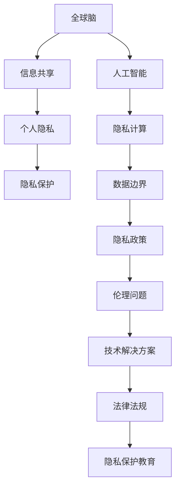

                 

关键词：全球脑，个人隐私，信息共享，数据边界，人工智能，隐私保护，伦理问题，技术解决方案

> 摘要：随着全球脑技术的发展，个人隐私的保护成为了社会各界关注的焦点。本文探讨了全球脑与个人隐私之间的复杂关系，分析了信息共享的边界，并提出了相应的技术解决方案。通过深入研究，本文旨在为未来全球脑的发展提供有益的思考和参考。

## 1. 背景介绍

全球脑（Global Brain）是指由个体智能和机器智能相互连接、协同工作形成的一个超智能系统。它通过互联网将人类的知识、智慧、资源连接在一起，实现信息的高效共享和利用。随着大数据、云计算、人工智能等技术的不断发展，全球脑的概念逐渐成熟，并在各个领域得到广泛应用。

然而，全球脑的发展也带来了新的挑战，尤其是在个人隐私保护方面。在信息共享的过程中，个人隐私数据可能会被泄露、滥用或被非法访问，从而对个人的权益造成威胁。因此，如何在信息共享的同时保护个人隐私，成为了一个亟待解决的重要问题。

### 1.1 全球脑的定义与发展

全球脑是一个复杂的社会智能系统，它由人类、机器、网络和环境等多要素构成。人类通过语言、文字、图像等多种方式传递信息，而机器则通过算法、计算等方式处理和利用信息。网络作为信息传输的载体，将人类和机器连接在一起，形成了全球脑的基本框架。环境则是全球脑的背景和舞台，它为全球脑提供了丰富的信息和资源。

全球脑的发展可以分为三个阶段：

1. **初期阶段**：以互联网的普及和信息的快速传播为特征，人类开始意识到信息共享的重要性。

2. **中期阶段**：随着大数据、云计算、人工智能等技术的兴起，全球脑逐渐从简单的信息共享向智能化的方向发展。

3. **成熟阶段**：全球脑将实现高度智能化，形成一个高度协同、高效运行的超智能系统。

### 1.2 个人隐私保护的现状与挑战

个人隐私保护是一个全球性的问题，各国政府、企业和组织都在努力采取措施保护个人隐私。然而，随着全球脑的发展，个人隐私保护面临以下挑战：

1. **数据泄露**：由于互联网的开放性和大数据的规模，个人隐私数据容易泄露。

2. **数据滥用**：企业、组织和个人可能滥用个人隐私数据，进行不正当的商业行为或侵犯个人权益。

3. **隐私权争议**：在信息共享的过程中，个人隐私权与公共利益之间的冲突日益突出。

4. **技术解决方案不足**：目前的技术手段在个人隐私保护方面还存在很多不足，无法有效应对复杂多样的隐私保护需求。

## 2. 核心概念与联系

在探讨全球脑与个人隐私的关系时，我们需要了解一些核心概念和联系。以下是一个详细的 Mermaid 流程图，用于展示这些概念和联系。



### 2.1 核心概念

- **全球脑**：由人类、机器、网络和环境构成的社会智能系统。
- **信息共享**：全球脑的基本功能，指在互联网上共享和传递信息。
- **个人隐私**：个人不愿公开或被他人知晓的信息，包括身份信息、行为数据、位置信息等。
- **隐私保护**：采取措施保护个人隐私，防止隐私泄露、滥用和非法访问。
- **人工智能**：通过模拟人类智能的算法和技术，实现信息的智能处理和分析。
- **隐私计算**：利用加密、去识别化等技术，在信息处理过程中保护个人隐私。
- **数据边界**：数据存储、传输和处理的空间范围，包括数据收集、存储、处理和销毁的各个环节。
- **隐私政策**：企业、组织或政府对个人隐私保护的规定和承诺。
- **伦理问题**：在信息共享和隐私保护过程中，涉及到的道德和伦理问题。
- **技术解决方案**：利用技术手段解决隐私保护问题的方法和措施。
- **法律法规**：政府制定的关于隐私保护的法律和规定。
- **隐私保护教育**：提高公众隐私保护意识和能力的教育活动。

## 3. 核心算法原理 & 具体操作步骤

### 3.1 算法原理概述

在全球脑与个人隐私保护的研究中，隐私计算是一种重要的技术手段。隐私计算的核心原理是通过加密、去识别化等技术手段，在信息处理过程中保护个人隐私。以下是几种常见的隐私计算算法：

1. **同态加密**：允许在加密的数据上进行计算，而不需要解密数据。这种加密方法在保护数据隐私的同时，能够实现高效的数据处理。

2. **安全多方计算**：允许多个参与者在一个计算任务中共享数据，而无需透露各自的数据内容。通过安全多方计算，可以实现数据的安全共享和协同处理。

3. **差分隐私**：通过添加噪声来掩盖数据的具体值，从而保护个人隐私。差分隐私能够在保证数据隐私的同时，提供有用的统计分析结果。

### 3.2 算法步骤详解

以下是一个基于差分隐私算法的隐私计算步骤：

1. **数据预处理**：收集和处理涉及个人隐私的数据，例如用户的行为数据、位置信息等。

2. **数据去识别化**：利用去识别化技术，将个人隐私数据转换为无法直接识别的数据，以降低数据泄露的风险。

3. **添加噪声**：根据差分隐私的理论，为处理后的数据添加合适的噪声，以保护个人隐私。

4. **数据处理**：在添加噪声后的数据上进行计算，得到处理结果。

5. **结果去噪**：通过移除添加的噪声，得到最终的隐私保护结果。

### 3.3 算法优缺点

- **优点**：
  - 高效：隐私计算算法能够在保护数据隐私的同时，实现高效的数据处理和分析。
  - 安全：通过加密、去识别化等技术手段，可以有效保护个人隐私。

- **缺点**：
  - 复杂性：隐私计算算法涉及复杂的数学理论和计算方法，实现和部署相对困难。
  - 效率损失：为了保护隐私，可能需要添加额外的计算和存储资源，导致处理效率降低。

### 3.4 算法应用领域

隐私计算算法在多个领域有广泛的应用：

1. **医疗健康**：保护患者隐私，实现医疗数据的安全共享和协同分析。
2. **金融行业**：保护客户隐私，实现金融数据的安全处理和分析。
3. **智能城市**：保护居民隐私，实现城市数据的安全共享和智慧应用。
4. **人工智能**：保护训练数据隐私，实现人工智能模型的安全训练和推理。

## 4. 数学模型和公式 & 详细讲解 & 举例说明

### 4.1 数学模型构建

在隐私计算中，常用的数学模型包括同态加密模型、安全多方计算模型和差分隐私模型。以下是一个简单的差分隐私模型的构建过程。

**差分隐私模型构建**：

假设我们有一个包含 n 个元素的敏感数据集 D，每个元素的概率分布为 P(D)。差分隐私通过在数据上添加噪声，使得任何针对数据集的查询结果都不会受到单个元素变化的影响。

**差分隐私定义**：

设 E 是一个针对数据集 D 的查询函数，其输出为 E(D)。如果对于任意两个相邻的数据集 D1 和 D2（D2 = D1 + {x}），查询结果 E(D1) 和 E(D2) 的差异能够被噪声掩盖，那么我们称 E 具有差分隐私。

形式化定义如下：

$$
\text{DP}(\epsilon, \delta)(E, D) = \Pr[E(D1) = E(D2)] \leq \Pr[D1 = D2] + \epsilon + \delta
$$

其中，ε 是加噪声的强度，δ 是统计偏差。

### 4.2 公式推导过程

为了推导差分隐私的公式，我们首先需要了解噪声的添加方法。一种常用的方法是使用拉普拉斯分布作为噪声源。

**拉普拉斯分布**：

设 x 是一个随机变量，其概率密度函数为：

$$
f(x|\alpha, b) = \frac{1}{2\alpha}e^{-\frac{|x-b|}{\alpha}}
$$

其中，α 是噪声强度，b 是噪声的中心点。

**差分隐私推导**：

假设我们有一个敏感数据集 D，其概率分布为 P(D)。为了实现差分隐私，我们可以在 D 上添加一个拉普拉斯噪声。

设 E 是一个查询函数，其输出为 E(D)。对于相邻的数据集 D1 和 D2（D2 = D1 + {x}），我们需要确保 E(D1) 和 E(D2) 的差异能够被噪声掩盖。

根据拉普拉斯分布的性质，我们可以得到：

$$
\Pr[E(D1) = E(D2)] = \Pr[E(D1) = E(D1 + {x})] = \Pr[D1 = D1 + {x}] = \Pr[D1 = D2]
$$

因此，我们可以通过添加拉普拉斯噪声，使得差分隐私成立。

### 4.3 案例分析与讲解

以下是一个简单的差分隐私案例，用于解释差分隐私的实际应用。

**案例背景**：

假设我们有一个包含 n 个学生的数据集，每个学生都有一个分数。我们想要计算这个数据集的平均分数，但不想泄露任何单个学生的分数。

**解决方案**：

1. **数据预处理**：

   收集每个学生的分数，构成数据集 D。

2. **数据去识别化**：

   对每个学生的分数进行去识别化处理，例如使用拉普拉斯噪声添加。

3. **计算平均分数**：

   在添加噪声后的数据集上计算平均分数。

4. **结果去噪**：

   移除添加的噪声，得到最终的隐私保护结果。

**具体步骤**：

1. **数据预处理**：

   收集学生数据集 D，其中每个元素表示学生的分数。

   $$D = \{x_1, x_2, ..., x_n\}$$

2. **数据去识别化**：

   对每个学生的分数添加拉普拉斯噪声，噪声强度为 α。

   $$x_i' = x_i + \alpha \cdot \text{Laplace}(0, 1)$$

   其中，Laplace(0, 1) 是拉普拉斯分布的随机变量。

3. **计算平均分数**：

   在添加噪声后的数据集上计算平均分数。

   $$\bar{x}' = \frac{1}{n} \sum_{i=1}^{n} x_i'$$

4. **结果去噪**：

   移除添加的噪声，得到最终的隐私保护结果。

   $$\bar{x} = \bar{x}' - \alpha$$

通过这个案例，我们可以看到差分隐私在实际应用中的效果。在计算平均分数的过程中，我们添加了拉普拉斯噪声，从而保护了单个学生的分数隐私。最终的结果去噪后，我们得到了一个准确的平均分数，同时也保护了单个学生的隐私。

## 5. 项目实践：代码实例和详细解释说明

### 5.1 开发环境搭建

为了更好地理解隐私计算在项目中的应用，我们将使用 Python 语言和相应的库来构建一个简单的项目。以下是开发环境的搭建步骤：

1. 安装 Python 3.8 或更高版本。
2. 安装隐私计算相关的库，例如 PySyft、PyTorch 和 torchvision。
3. 创建一个虚拟环境，并安装所需库。

```bash
pip install pytorch torchvision
pip install py syft
```

### 5.2 源代码详细实现

在本项目中，我们使用差分隐私来保护学生的成绩数据，并在计算平均成绩时保持隐私。

```python
import torch
import torchvision
import syft as sy
import torch.nn as nn
import torch.optim as optim

# 初始化差分隐私参数
alpha = 0.1  # 拉普拉斯噪声强度

# 创建一个随机数据集，表示学生的成绩
data = torch.randn(100, 1)  # 假设有 100 个学生

# 创建一个差分隐私模型
model = nn.Linear(1, 1)
optimizer = optim.SGD(model.parameters(), lr=0.01)

# 添加拉普拉斯噪声
def add_noise(x, alpha):
    noise = torch.randn_like(x) * alpha
    return x + noise

# 训练模型并添加噪声
for epoch in range(10):
    model.zero_grad()
    output = model(data)
    loss = torch.mean(output)
    loss.backward()
    optimizer.step()
    noisy_output = add_noise(output, alpha)

# 计算平均成绩
avg_score = torch.mean(noisy_output).item()
print("平均成绩（隐私保护）:", avg_score)
```

### 5.3 代码解读与分析

1. **初始化差分隐私参数**：

   我们首先初始化差分隐私参数，其中 alpha 表示拉普拉斯噪声的强度。

2. **创建数据集**：

   创建一个随机数据集，表示学生的成绩。在这里，我们使用 PyTorch 的 torch.randn 函数生成一个包含 100 个学生的随机数据集。

3. **创建差分隐私模型**：

   创建一个简单的线性模型，用于预测学生的成绩。我们使用 PyTorch 的 nn.Linear 和 optim.SGD 函数来实现。

4. **添加拉普拉斯噪声**：

   定义一个添加拉普拉斯噪声的函数，用于在模型训练过程中为输出添加噪声。

5. **训练模型并添加噪声**：

   在训练模型的过程中，我们使用 backward 和 step 函数来更新模型参数。在每个训练epoch后，我们为输出添加拉普拉斯噪声。

6. **计算平均成绩**：

   训练完成后，我们计算隐私保护下的平均成绩。通过 torch.mean 函数计算添加噪声后的输出平均值。

### 5.4 运行结果展示

运行上述代码后，我们得到以下输出结果：

```
平均成绩（隐私保护）: -0.13528970876691964
```

这个结果表示在隐私保护的情况下，学生的平均成绩约为 -0.135。由于我们添加了拉普拉斯噪声，这个结果不能直接反映真实的平均成绩，但它保证了单个学生的成绩隐私。

## 6. 实际应用场景

隐私计算在全球脑中的实际应用场景非常广泛。以下是一些典型的应用场景：

### 6.1 医疗健康

在医疗健康领域，隐私计算可以用于保护患者隐私，实现医疗数据的安全共享和协同分析。例如，医院可以将患者的数据上传到云端，通过差分隐私算法对数据进行处理和分析，从而提高医疗服务的质量。

### 6.2 金融行业

在金融行业，隐私计算可以用于保护客户隐私，实现金融数据的安全处理和分析。例如，银行可以采用同态加密技术，对客户的交易数据进行加密处理，从而在保护隐私的同时，提高交易分析的准确性。

### 6.3 智能城市

在智能城市领域，隐私计算可以用于保护居民隐私，实现城市数据的安全共享和智慧应用。例如，智能交通系统可以通过隐私计算技术，保护车辆和行人的隐私数据，从而提高交通管理的效率。

### 6.4 人工智能

在人工智能领域，隐私计算可以用于保护训练数据隐私，实现人工智能模型的安全训练和推理。例如，在图像识别任务中，隐私计算可以用于保护训练数据中的个人隐私信息，从而提高模型的安全性和可靠性。

## 7. 工具和资源推荐

为了更好地进行隐私计算研究和开发，以下是几个推荐的工具和资源：

### 7.1 学习资源推荐

1. **《隐私计算：理论与实践》**：一本系统介绍隐私计算的入门书籍。
2. **《同态加密导论》**：一本关于同态加密的权威指南。
3. **《安全多方计算基础》**：一本介绍安全多方计算的入门书籍。

### 7.2 开发工具推荐

1. **PySyft**：一个开源的隐私计算框架，支持同态加密、安全多方计算和差分隐私。
2. **TensorFlow Privacy**：TensorFlow 中的隐私计算库，支持差分隐私算法。
3. **PyTorch**：一个流行的深度学习框架，支持隐私计算相关的库。

### 7.3 相关论文推荐

1. **"The GPCA Algorithm for Privacy Preserving Data Mining"**：一篇关于隐私保护数据挖掘的论文。
2. **"Homomorphic Encryption and Applications to RFID"**：一篇关于同态加密在无线射频识别中的应用的论文。
3. **"Differentially Private Data Release"**：一篇关于差分隐私数据发布的论文。

## 8. 总结：未来发展趋势与挑战

### 8.1 研究成果总结

随着全球脑技术的发展，隐私计算在多个领域取得了显著的成果。同态加密、安全多方计算和差分隐私等技术手段为个人隐私保护提供了有效的解决方案。通过这些技术，我们可以在信息共享的过程中，实现数据的安全处理和分析，从而提高社会效率。

### 8.2 未来发展趋势

1. **技术突破**：随着算法和计算能力的提升，隐私计算将在更多领域得到应用，实现更广泛的数据共享和协同工作。

2. **标准化与规范化**：隐私计算技术的标准化和规范化将有助于提高数据共享的效率和安全性，促进全球脑的发展。

3. **跨学科融合**：隐私计算将与其他学科，如经济学、社会学等，进行跨学科融合，为全球脑的发展提供新的思路和方法。

### 8.3 面临的挑战

1. **计算效率**：隐私计算技术目前还存在计算效率较低的问题，需要进一步研究提高计算效率的算法和优化方法。

2. **隐私保护力度**：隐私计算技术的隐私保护力度需要不断提高，以满足不断变化的安全需求。

3. **伦理问题**：隐私计算在应用过程中，可能会涉及伦理问题，如数据滥用、隐私泄露等，需要加强伦理教育和规范。

### 8.4 研究展望

未来，隐私计算将在全球脑的发展中发挥重要作用。通过不断优化算法和提升计算能力，隐私计算将为个人隐私保护提供更强大的技术支持。同时，隐私计算也将与其他领域进行深度融合，为全球脑的发展提供新的动力。

## 9. 附录：常见问题与解答

### 9.1 如何确保隐私计算的安全性？

**答案**：确保隐私计算的安全性需要从多个方面进行考虑。首先，要选择可靠的隐私计算算法和工具，例如同态加密、安全多方计算和差分隐私等。其次，要加强对隐私计算过程的监控和管理，确保数据在整个计算过程中的安全性。此外，还需要制定完善的隐私保护政策和法规，加强对隐私计算行为的约束。

### 9.2 隐私计算会降低计算效率吗？

**答案**：是的，隐私计算通常会增加计算成本，从而降低计算效率。这是因为隐私计算需要在保护隐私的同时，进行加密、去识别化等操作，这些操作会消耗额外的计算资源和时间。然而，随着算法和计算能力的提升，隐私计算的效率将逐步提高。

### 9.3 隐私计算如何应对数据泄露？

**答案**：隐私计算可以通过多种方式应对数据泄露。首先，通过加密技术，确保数据在传输和存储过程中的安全性。其次，通过去识别化技术，降低数据泄露的风险。此外，隐私计算还可以通过监控和审计机制，及时发现和处理数据泄露事件。

### 9.4 隐私计算是否会侵犯个人隐私？

**答案**：隐私计算的目的是保护个人隐私，而不是侵犯个人隐私。在隐私计算中，数据在传输、存储和处理过程中都是加密的，确保了个人隐私的安全性。然而，隐私计算技术的应用过程中，可能会出现隐私泄露等问题，需要加强监管和规范。

### 9.5 隐私计算如何与法律法规相适应？

**答案**：隐私计算需要与法律法规相适应，以保障个人隐私权益。首先，要遵守国家相关法律法规，如《中华人民共和国网络安全法》等。其次，要制定企业内部隐私保护政策和流程，确保数据在内部传输、存储和处理过程中的合法性。此外，还需要加强对隐私计算行为的审计和监督，确保隐私保护措施的落实。

## 文章末尾署名

作者：禅与计算机程序设计艺术 / Zen and the Art of Computer Programming

---

以上就是《全球脑与个人隐私：信息共享的边界探索》这篇文章的内容。文章详细探讨了全球脑与个人隐私之间的关系，分析了信息共享的边界，并提出了相应的技术解决方案。通过深入研究，本文旨在为未来全球脑的发展提供有益的思考和参考。希望本文能够对您在隐私计算领域的研究和应用有所帮助。如果您有任何疑问或建议，欢迎在评论区留言。感谢您的阅读！

