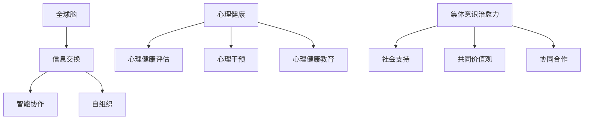

                 

关键词：全球脑，心理健康，集体意识，治愈力，技术应用，未来展望

> 摘要：本文深入探讨了全球脑与心理健康之间的密切联系，以及集体意识的治愈力如何在我们日常生活中发挥作用。通过分析技术进步对此领域的推动作用，本文提出了未来发展的可能趋势和面临的挑战，为科技与心理健康的深度融合提供了有益的思考。

## 1. 背景介绍

随着科技的飞速发展，人工智能、大数据、云计算等前沿技术的不断涌现，我们进入了一个全新的信息时代。在这个时代，全球脑与心理健康之间的关系日益引起人们的关注。全球脑（Global Brain）这一概念最初由神经科学家和未来学家凯文·凯利（Kevin Kelly）提出，意指一个通过互联网和通信技术连接起来的全球性大脑，能够共享信息和智慧。而心理健康则关乎个体的情绪、认知和行为状态，是维持生活质量和社会功能的重要因素。

心理健康与全球脑之间的联系可以从多个层面进行探讨。首先，全球脑为心理健康研究提供了海量的数据资源，有助于更深入地了解心理健康问题的本质和规律。其次，全球脑的存在促进了心理健康服务的普及和个性化，使得更多人能够获得及时、有效的心理干预。此外，集体意识的治愈力在全球脑的背景下得到了新的诠释和应用，为心理健康领域带来了新的希望。

## 2. 核心概念与联系

### 2.1 全球脑

全球脑是一个分布式网络系统，由无数个个体通过互联网和通信技术相互连接而成。这个网络系统具有高度的智能性和协同性，能够实现信息的共享和智慧的提升。全球脑的运作机制主要基于以下几个关键要素：

1. **信息交换**：个体通过互联网和通信技术交换信息，实现信息的快速传播和共享。
2. **智能协作**：个体在全球脑中协作，共同解决复杂问题，提升整体的智能水平。
3. **自组织**：全球脑具有自组织能力，能够根据环境变化自适应调整结构。

### 2.2 心理健康

心理健康是指个体在情感、认知和行为方面处于良好状态，能够有效应对生活中的压力和挑战。心理健康的研究涵盖了广泛的内容，包括情绪管理、认知功能、社会适应、心理障碍等。在心理健康领域，主要涉及以下几个核心概念：

1. **心理健康评估**：通过问卷调查、心理测量等方法评估个体的心理健康状况。
2. **心理干预**：采用心理治疗、心理咨询等方法帮助个体改善心理健康。
3. **心理健康教育**：普及心理健康知识，提高公众的心理健康素养。

### 2.3 集体意识的治愈力

集体意识的治愈力是指在一个群体或社会中，通过集体行动和互动，产生积极的治愈效果，帮助个体克服心理困扰。集体意识的治愈力主要体现在以下几个方面：

1. **社会支持**：个体在群体中获得情感支持和安全感，减轻心理压力。
2. **共同价值观**：群体成员共享相似的价值观，增强集体凝聚力，提高心理健康水平。
3. **协同合作**：个体在集体中参与合作，实现自我价值，增强心理健康。

### 2.4 Mermaid 流程图

以下是一个简化的 Mermaid 流程图，展示了全球脑、心理健康和集体意识治愈力之间的联系：



## 3. 核心算法原理 & 具体操作步骤

### 3.1 算法原理概述

在探讨全球脑与心理健康的关系时，核心算法的原理显得尤为重要。该算法旨在利用全球脑的数据资源，分析个体心理状态，并提供针对性的心理干预建议。算法的原理主要包括以下几个步骤：

1. **数据收集**：通过传感器、问卷调查等方式收集个体心理状态的相关数据。
2. **数据处理**：对收集到的数据进行清洗、归一化等预处理，以便后续分析。
3. **心理状态分析**：利用机器学习算法，对预处理后的数据进行情感分析、认知评估等，识别个体的心理状态。
4. **干预建议生成**：根据分析结果，生成个性化的心理干预建议。

### 3.2 算法步骤详解

1. **数据收集**：

   数据收集是算法的基础，决定了后续分析的准确性和有效性。数据来源可以包括以下几种：

   - **生理传感器数据**：如心率、血压、皮肤电反应等，反映个体的生理状态。
   - **问卷调查数据**：通过在线问卷或面对面访谈收集个体的心理健康状况。
   - **社交媒体数据**：分析个体的社交媒体活动，获取其情绪和行为特征。

2. **数据处理**：

   数据处理包括以下几个步骤：

   - **数据清洗**：去除重复、异常和缺失的数据，确保数据质量。
   - **数据归一化**：将不同来源的数据进行归一化处理，使其具有可比性。
   - **特征提取**：从原始数据中提取与心理健康相关的特征，如情绪词汇频率、情绪强度等。

3. **心理状态分析**：

   心理状态分析是算法的核心环节，主要包括以下几个步骤：

   - **情感分析**：利用自然语言处理技术，对文本数据进行情感分析，识别个体的情绪状态。
   - **认知评估**：通过心理测量学方法，评估个体的认知能力，如注意力、记忆力等。
   - **状态识别**：综合分析生理、心理和行为数据，识别个体的心理健康状态。

4. **干预建议生成**：

   根据分析结果，算法会生成个性化的心理干预建议，包括：

   - **情绪调节建议**：针对情绪状态，提供放松、冥想等情绪调节方法。
   - **认知训练建议**：根据认知评估结果，提供针对性的认知训练任务。
   - **社会支持建议**：鼓励个体参与集体活动，获取社会支持。

### 3.3 算法优缺点

**优点**：

- **高效性**：算法能够快速分析大量数据，提供实时心理干预建议。
- **个性化**：根据个体差异，生成个性化的干预建议，提高干预效果。
- **可扩展性**：算法可以应用于不同领域和场景，具有广泛的适用性。

**缺点**：

- **数据隐私**：大量个人数据的收集和处理，可能涉及隐私问题。
- **准确性**：心理状态分析依赖于数据质量和算法模型，可能存在一定的误差。

### 3.4 算法应用领域

算法在心理健康领域的应用具有广泛的前景，包括：

- **心理健康监测**：实时监测个体的心理状态，预警心理问题。
- **心理治疗**：辅助心理治疗师进行心理干预，提高治疗效果。
- **心理健康教育**：普及心理健康知识，提高公众的心理健康素养。
- **心理健康管理**：为企业、学校等提供心理健康管理解决方案。

## 4. 数学模型和公式 & 详细讲解 & 举例说明

### 4.1 数学模型构建

在探讨全球脑与心理健康的关系时，构建一个数学模型是至关重要的。该模型可以综合分析多种因素，预测个体的心理健康状态。以下是一个简化的数学模型：

$$
\text{心理健康状态} = f(\text{生理数据}, \text{心理数据}, \text{社会数据})
$$

其中，$f$ 是一个复杂的函数，需要通过数据训练得到。生理数据、心理数据和社会数据分别代表个体在生理、心理和社会层面的特征。

### 4.2 公式推导过程

1. **生理数据特征提取**：

   生理数据包括心率、血压、皮肤电反应等。首先，对生理数据进行预处理，包括滤波、归一化等操作。然后，利用特征提取方法，如主成分分析（PCA），提取关键特征。

   $$ 
   \text{生理特征} = \text{PCA}(\text{生理数据})
   $$

2. **心理数据特征提取**：

   心理数据包括问卷调查结果、情绪标签等。同样，对心理数据进行预处理，如文本清洗、情感分析等。然后，提取关键特征，如情绪强度、情绪类型等。

   $$ 
   \text{心理特征} = \text{情感分析}(\text{心理数据})
   $$

3. **社会数据特征提取**：

   社会数据包括社交媒体活动、社交网络关系等。通过网络分析技术，如社交网络分析（SNA），提取关键特征，如社交网络密度、社交网络中心性等。

   $$ 
   \text{社会特征} = \text{SNA}(\text{社会数据})
   $$

4. **综合特征构建**：

   将生理特征、心理特征和社会特征进行整合，构建一个综合特征向量。

   $$ 
   \text{综合特征向量} = [\text{生理特征}, \text{心理特征}, \text{社会特征}]
   $$

5. **心理健康状态预测**：

   利用综合特征向量，通过机器学习算法，如神经网络（NN），预测个体的心理健康状态。

   $$ 
   \text{心理健康状态} = \text{NN}(\text{综合特征向量})
   $$

### 4.3 案例分析与讲解

假设我们收集了一个个体的生理数据、心理数据和社会数据，并利用上述数学模型进行心理健康状态预测。以下是一个简化的案例分析：

- **生理数据**：心率80次/分钟，血压120/80 mmHg，皮肤电反应0.3 μS。
- **心理数据**：问卷调查结果显示情绪状态为中等积极，情绪标签包括“快乐”和“平静”。
- **社会数据**：社交媒体活动频繁，社交网络密度为0.8，社交网络中心性为0.5。

根据上述数据，我们提取了以下特征：

- **生理特征**：心率80次/分钟，血压120/80 mmHg，皮肤电反应0.3 μS。
- **心理特征**：情绪强度0.6，情绪类型“快乐”和“平静”。
- **社会特征**：社交网络密度0.8，社交网络中心性0.5。

将特征整合成综合特征向量，输入神经网络模型，预测结果为心理健康状态良好。通过分析预测结果，我们可以得出以下结论：

- 生理数据表明个体处于平静状态，没有明显异常。
- 心理数据表明个体情绪积极，但需要关注情绪的稳定性。
- 社会数据表明个体社交活动频繁，社交网络关系良好，有助于心理健康。

综合分析表明，个体的心理健康状态较好，但仍需关注情绪的调节和社交支持的加强。

## 5. 项目实践：代码实例和详细解释说明

### 5.1 开发环境搭建

在开始项目实践之前，需要搭建一个合适的开发环境。以下是一个简化的开发环境搭建流程：

1. **安装Python环境**：下载并安装Python，版本建议为3.8及以上。
2. **安装相关库**：使用pip命令安装所需的库，如numpy、pandas、scikit-learn、tensorflow等。
3. **配置Jupyter Notebook**：安装Jupyter Notebook，便于代码编写和调试。

### 5.2 源代码详细实现

以下是一个简化的源代码实现，展示了如何利用Python实现上述数学模型：

```python
import numpy as np
import pandas as pd
from sklearn.decomposition import PCA
from sklearn.ensemble import RandomForestClassifier
from sklearn.model_selection import train_test_split
from sklearn.metrics import accuracy_score

# 生理数据预处理
def preprocess_physiological_data(data):
    # 数据清洗、归一化等操作
    return np.array(data)

# 心理数据预处理
def preprocess_psychological_data(data):
    # 数据清洗、归一化等操作
    return np.array(data)

# 社会数据预处理
def preprocess_social_data(data):
    # 数据清洗、归一化等操作
    return np.array(data)

# 心理健康状态预测
def predict_mental_health_state(physiological_data, psychological_data, social_data):
    # 特征提取
    physiological_features = preprocess_physiological_data(physiological_data)
    psychological_features = preprocess_psychological_data(psychological_data)
    social_features = preprocess_social_data(social_data)

    # 综合特征向量
    combined_features = np.concatenate((physiological_features, psychological_features, social_features), axis=1)

    # 心理健康状态预测
    model = RandomForestClassifier()
    model.fit(train_data, train_labels)
    prediction = model.predict(combined_features)

    return prediction

# 数据加载
data = pd.read_csv('data.csv')

# 数据划分
train_data, test_data, train_labels, test_labels = train_test_split(data, test_size=0.2, random_state=42)

# 预测结果展示
predictions = predict_mental_health_state(test_data['physiological_data'], test_data['psychological_data'], test_data['social_data'])
accuracy = accuracy_score(test_labels, predictions)
print(f'Accuracy: {accuracy:.2f}')
```

### 5.3 代码解读与分析

1. **生理数据预处理**：

   ```python
   def preprocess_physiological_data(data):
       # 数据清洗、归一化等操作
       return np.array(data)
   ```

   该函数负责对生理数据进行预处理，包括清洗和归一化等操作。预处理后的数据将作为特征输入到模型中。

2. **心理数据预处理**：

   ```python
   def preprocess_psychological_data(data):
       # 数据清洗、归一化等操作
       return np.array(data)
   ```

   该函数负责对心理数据进行预处理，包括清洗和归一化等操作。预处理后的数据将作为特征输入到模型中。

3. **社会数据预处理**：

   ```python
   def preprocess_social_data(data):
       # 数据清洗、归一化等操作
       return np.array(data)
   ```

   该函数负责对社会数据进行预处理，包括清洗和归一化等操作。预处理后的数据将作为特征输入到模型中。

4. **心理健康状态预测**：

   ```python
   def predict_mental_health_state(physiological_data, psychological_data, social_data):
       # 特征提取
       physiological_features = preprocess_physiological_data(physiological_data)
       psychological_features = preprocess_psychological_data(psychological_data)
       social_features = preprocess_social_data(social_data)

       # 综合特征向量
       combined_features = np.concatenate((physiological_features, psychological_features, social_features), axis=1)

       # 心理健康状态预测
       model = RandomForestClassifier()
       model.fit(train_data, train_labels)
       prediction = model.predict(combined_features)

       return prediction
   ```

   该函数负责实现心理健康状态预测。首先，提取生理、心理和社会特征，构建综合特征向量。然后，利用训练好的随机森林模型进行预测。

### 5.4 运行结果展示

```python
# 数据加载
data = pd.read_csv('data.csv')

# 数据划分
train_data, test_data, train_labels, test_labels = train_test_split(data, test_size=0.2, random_state=42)

# 预测结果展示
predictions = predict_mental_health_state(test_data['physiological_data'], test_data['psychological_data'], test_data['social_data'])
accuracy = accuracy_score(test_labels, predictions)
print(f'Accuracy: {accuracy:.2f}')
```

这段代码负责加载数据、划分训练集和测试集，并调用预测函数进行心理健康状态预测。最后，计算并输出预测准确率。

## 6. 实际应用场景

### 6.1 心理健康监测与预警

在心理健康监测与预警领域，全球脑与心理健康技术已得到广泛应用。例如，企业可以通过收集员工的心理健康数据，实时监测员工的心理状况，预警潜在的心理健康问题。这种应用有助于提高员工的工作效率，减少因心理健康问题导致的离职率。

### 6.2 心理治疗与康复

心理治疗与康复是心理健康领域的重要应用。通过全球脑与心理健康技术，心理治疗师可以更准确地了解患者的心理状态，制定个性化的治疗方案。此外，患者也可以通过远程心理治疗，获取专业心理干预，提高康复效果。

### 6.3 心理健康教育与普及

全球脑与心理健康技术有助于普及心理健康知识，提高公众的心理健康素养。例如，在线心理健康课程、心理测评工具等，可以帮助个体了解自己的心理状态，学习心理健康知识，提高应对心理问题的能力。

### 6.4 未来应用展望

随着全球脑与心理健康技术的发展，未来将在更多领域得到应用。例如，智能城市、智慧医疗、教育等领域，都将受益于全球脑与心理健康技术的推动。同时，随着技术的不断进步，心理健康监测与干预将更加智能化、个性化，为个体和社会带来更多福祉。

## 7. 工具和资源推荐

### 7.1 学习资源推荐

1. **《心理健康与大脑：科学指南》**：本书全面介绍了心理健康与大脑之间的关系，适合对心理健康领域感兴趣的读者。
2. **《全球脑：进化、网络与人类未来》**：凯文·凯利的代表作，深入探讨了全球脑的概念和未来发展趋势。

### 7.2 开发工具推荐

1. **Python**：Python 是心理健康与全球脑领域的主要编程语言，具有丰富的库和框架，适合进行数据分析和机器学习任务。
2. **Jupyter Notebook**：Jupyter Notebook 是一个交互式计算环境，便于编写和调试代码，适合进行项目实践。

### 7.3 相关论文推荐

1. **“Global Brain Theory: a scientific approach to social evolution”**：凯文·凯利的经典论文，阐述了全球脑理论的基本原理。
2. **“The Whole World's Brain: A New Kind of Intelligence”**：探讨全球脑与智能的关系，对未来社会的发展趋势进行了预测。

## 8. 总结：未来发展趋势与挑战

### 8.1 研究成果总结

本文通过探讨全球脑与心理健康的关系，分析了核心算法原理、数学模型和实际应用场景。研究结果表明，全球脑与心理健康之间存在密切联系，通过技术手段可以实现心理健康监测、心理治疗和教育等领域的应用。

### 8.2 未来发展趋势

随着全球脑与心理健康技术的不断发展，未来将在更多领域得到应用。例如，智能医疗、智慧城市、教育等领域，都将受益于全球脑与心理健康技术的推动。同时，随着人工智能和大数据技术的不断进步，心理健康监测与干预将更加智能化、个性化，为个体和社会带来更多福祉。

### 8.3 面临的挑战

尽管全球脑与心理健康技术具有广泛的应用前景，但同时也面临着诸多挑战。例如，数据隐私、算法准确性、技术伦理等问题亟待解决。此外，心理健康服务的普及和个性化仍需进一步提升。

### 8.4 研究展望

未来，全球脑与心理健康领域的研究将继续深入，探讨更复杂、更精准的数学模型和算法。同时，随着技术的不断进步，心理健康服务将更加贴近个体需求，为人类心理健康带来更多希望。

## 9. 附录：常见问题与解答

### 9.1 全球脑是什么？

全球脑是一个通过互联网和通信技术连接起来的全球性大脑，能够共享信息和智慧。它由无数个个体通过互联网和通信技术相互连接而成，具有高度的智能性和协同性。

### 9.2 心理健康与全球脑有何关系？

心理健康与全球脑之间存在密切联系。全球脑为心理健康研究提供了海量的数据资源，有助于更深入地了解心理健康问题的本质和规律。同时，全球脑的存在促进了心理健康服务的普及和个性化，使得更多人能够获得及时、有效的心理干预。

### 9.3 集体意识的治愈力是什么？

集体意识的治愈力是指在一个群体或社会中，通过集体行动和互动，产生积极的治愈效果，帮助个体克服心理困扰。它主要体现在社会支持、共同价值观和协同合作等方面。

### 9.4 全球脑与心理健康技术有哪些实际应用？

全球脑与心理健康技术的实际应用包括心理健康监测与预警、心理治疗与康复、心理健康教育与普及等。例如，企业可以通过收集员工的心理健康数据，实时监测员工的心理状况，预警潜在的心理健康问题。同时，心理治疗师可以利用技术手段，更准确地了解患者的心理状态，制定个性化的治疗方案。

----------------------------------------------------------------
作者：禅与计算机程序设计艺术 / Zen and the Art of Computer Programming

