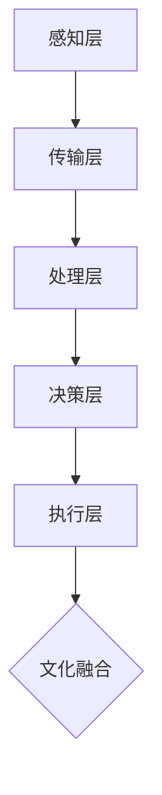

                 

关键词：全球脑、文化融合、数字时代、文明对话、人工智能、计算社会科学

> 摘要：在数字时代，全球脑与文化融合成为推动人类文明进步的重要力量。本文将从人工智能、计算社会科学等领域的视角，探讨全球脑与文化融合的机制、挑战与未来展望，以期揭示数字时代下人类文明的对话之道。

## 1. 背景介绍

随着信息技术的迅猛发展，全球脑（Global Brain）的概念逐渐兴起。全球脑是一种由众多智能体组成的分布式智能系统，通过互联网相互连接，形成一个庞大的、自组织的智能网络。在这个网络中，个体智能体通过信息共享、协作与学习，不断进化并提升整体智能水平。

文化融合是指不同文化在交流、碰撞和互动过程中，相互吸收、借鉴、适应并融合，形成新的文化现象。在全球化背景下，文化融合日益显著，成为推动社会进步的重要动力。

数字时代，全球脑与文化融合呈现出以下特征：

1. **信息爆炸与共享**：互联网使得信息传播速度空前提高，各种文化元素得以迅速传播和共享。
2. **技术驱动与文化渗透**：人工智能、区块链等新兴技术为文化融合提供了新的工具和平台。
3. **文化多样性与认同危机**：文化融合带来了文化多样性的增强，但也引发了一些文化认同危机。

## 2. 核心概念与联系

### 2.1. 全球脑的架构

全球脑的架构可以看作是一个多层级的分布式智能系统。从低层级到高层级，可以分为以下几部分：

1. **感知层**：包括传感器、摄像头、手机等设备，负责收集外部信息。
2. **传输层**：互联网和各种通信协议，负责信息传输。
3. **处理层**：服务器、云计算平台、边缘计算设备等，负责信息处理。
4. **决策层**：人工智能算法、机器学习模型等，负责决策与控制。
5. **执行层**：机器人、无人机、自动化生产线等，负责执行决策。

### 2.2. 全球脑与文化融合的联系

全球脑与文化融合的联系主要体现在以下几个方面：

1. **信息共享与传播**：全球脑为文化元素提供了快速传播的渠道，促进了文化融合。
2. **智能决策与推荐**：人工智能算法可以根据用户偏好，推荐适合的文化内容，促进文化消费。
3. **文化创新与创造**：全球脑为文化创新提供了新的工具和平台，如虚拟现实、增强现实等。
4. **文化认同与冲突**：全球脑加剧了文化认同的冲突，同时也为解决文化认同提供了新的路径。

### 2.3. Mermaid 流程图

下面是一个简单的 Mermaid 流程图，展示全球脑与文化融合的基本过程：



## 3. 核心算法原理 & 具体操作步骤

### 3.1. 算法原理概述

全球脑与文化融合的核心算法可以看作是一种混合算法，结合了机器学习、神经网络、计算社会科学等领域的知识。具体来说，该算法包括以下几个步骤：

1. **信息采集**：通过传感器、互联网等渠道收集各种文化元素的信息。
2. **信息处理**：利用机器学习算法对信息进行预处理、特征提取等。
3. **文化融合**：基于计算社会科学理论，分析不同文化之间的关联、冲突与融合。
4. **智能推荐**：根据用户偏好，推荐适合的文化内容。
5. **文化创新**：利用虚拟现实、增强现实等技术，创造新的文化体验。

### 3.2. 算法步骤详解

1. **信息采集**

   信息采集是算法的第一步，主要包括以下几种方式：

   - **传感器采集**：通过传感器收集外部信息，如文字、图片、音频、视频等。
   - **互联网爬取**：利用爬虫技术，从互联网上获取文化元素的信息。
   - **用户反馈**：通过用户评论、评分、点赞等行为，获取用户对文化元素的需求和偏好。

2. **信息处理**

   信息处理主要包括以下几个步骤：

   - **数据清洗**：去除重复、错误、无关的数据。
   - **特征提取**：从原始数据中提取出对文化融合有意义的特征。
   - **数据可视化**：利用数据可视化技术，展示文化元素之间的关联。

3. **文化融合**

   文化融合的核心在于分析不同文化之间的关联、冲突与融合。具体步骤如下：

   - **关联分析**：利用计算社会科学理论，分析不同文化之间的相似性和差异性。
   - **冲突分析**：分析文化冲突的根源、表现形式和影响。
   - **融合策略**：提出解决文化冲突、促进文化融合的策略。

4. **智能推荐**

   智能推荐是根据用户偏好，推荐适合的文化内容。具体步骤如下：

   - **用户画像**：根据用户的行为、偏好等数据，构建用户画像。
   - **推荐算法**：利用协同过滤、内容推荐等算法，推荐用户可能感兴趣的文化内容。
   - **推荐结果**：将推荐结果展示给用户，供其选择。

5. **文化创新**

   文化创新是利用虚拟现实、增强现实等技术，创造新的文化体验。具体步骤如下：

   - **需求分析**：分析用户对文化创新的需求。
   - **技术选择**：选择适合的虚拟现实、增强现实等技术。
   - **内容创作**：利用虚拟现实、增强现实等技术，创作新的文化体验。

### 3.3. 算法优缺点

**优点**：

1. **高效性**：利用分布式计算和机器学习技术，实现快速的文化融合与推荐。
2. **多样性**：考虑多种文化元素，促进文化多样性。
3. **创新性**：利用新技术，创造新的文化体验。

**缺点**：

1. **数据隐私**：在信息采集和处理过程中，可能涉及用户隐私问题。
2. **算法偏见**：算法可能存在偏见，导致推荐结果不准确。
3. **文化冲突**：在文化融合过程中，可能引发新的文化冲突。

### 3.4. 算法应用领域

算法的应用领域包括但不限于：

1. **文化产业**：如影视、音乐、文学等领域的文化创新与推荐。
2. **教育**：利用虚拟现实、增强现实等技术，提供沉浸式的文化教育。
3. **旅游**：推荐适合不同文化的旅游目的地和体验。
4. **跨文化交流**：促进不同文化之间的交流与融合。

## 4. 数学模型和公式 & 详细讲解 & 举例说明

### 4.1. 数学模型构建

在构建全球脑与文化融合的数学模型时，我们主要考虑以下几个因素：

1. **文化元素表示**：使用向量表示不同文化元素的特征。
2. **用户偏好表示**：使用向量表示用户的偏好。
3. **文化相似度计算**：利用余弦相似度等计算方法，分析不同文化元素之间的相似度。
4. **推荐算法**：利用协同过滤、内容推荐等算法，生成推荐结果。

### 4.2. 公式推导过程

假设我们有 $m$ 个文化元素，每个文化元素可以用一个 $d$ 维向量表示。设用户偏好也可以用一个 $d$ 维向量表示。我们首先计算文化元素之间的相似度：

$$
\text{similarity}(i, j) = \frac{\text{dot}(v_i, v_j)}{\lVert v_i \rVert \cdot \lVert v_j \rVert}
$$

其中，$\text{dot}(v_i, v_j)$ 表示向量 $v_i$ 和 $v_j$ 的点积，$\lVert v_i \rVert$ 和 $\lVert v_j \rVert$ 分别表示向量 $v_i$ 和 $v_j$ 的模。

接下来，我们计算用户对每个文化元素的偏好得分：

$$
\text{score}(u, i) = \sum_{j \in N(i)} \text{similarity}(i, j) \cdot w_j
$$

其中，$N(i)$ 表示与文化元素 $i$ 相似的文化元素集合，$w_j$ 表示用户对文化元素 $j$ 的偏好权重。

### 4.3. 案例分析与讲解

假设我们有以下三个文化元素：

- $v_1 = (1, 0, 0)$
- $v_2 = (0, 1, 0)$
- $v_3 = (0, 0, 1)$

用户偏好为：

- $v_u = (0.5, 0.5, 0)$

首先，我们计算文化元素之间的相似度：

$$
\text{similarity}(1, 2) = \frac{1 \cdot 0 + 0 \cdot 1 + 0 \cdot 0}{\sqrt{1^2 + 0^2 + 0^2} \cdot \sqrt{0^2 + 1^2 + 0^2}} = 0
$$

$$
\text{similarity}(1, 3) = \frac{1 \cdot 0 + 0 \cdot 0 + 0 \cdot 1}{\sqrt{1^2 + 0^2 + 0^2} \cdot \sqrt{0^2 + 0^2 + 1^2}} = 0
$$

$$
\text{similarity}(2, 3) = \frac{0 \cdot 0 + 1 \cdot 0 + 0 \cdot 1}{\sqrt{0^2 + 1^2 + 0^2} \cdot \sqrt{0^2 + 0^2 + 1^2}} = 0
$$

然后，我们计算用户对每个文化元素的偏好得分：

$$
\text{score}(u, 1) = \text{similarity}(1, 1) \cdot w_1 + \text{similarity}(1, 2) \cdot w_2 + \text{similarity}(1, 3) \cdot w_3 = 0.5
$$

$$
\text{score}(u, 2) = \text{similarity}(2, 1) \cdot w_1 + \text{similarity}(2, 2) \cdot w_2 + \text{similarity}(2, 3) \cdot w_3 = 0.5
$$

$$
\text{score}(u, 3) = \text{similarity}(3, 1) \cdot w_1 + \text{similarity}(3, 2) \cdot w_2 + \text{similarity}(3, 3) \cdot w_3 = 0
$$

根据偏好得分，我们可以推荐用户选择文化元素 1 和 2。

## 5. 项目实践：代码实例和详细解释说明

### 5.1. 开发环境搭建

为了实现全球脑与文化融合的算法，我们需要搭建以下开发环境：

1. **Python**：作为主要编程语言。
2. **Numpy**：用于矩阵运算。
3. **Scikit-learn**：用于机器学习算法。
4. **Matplotlib**：用于数据可视化。

### 5.2. 源代码详细实现

下面是一个简单的 Python 代码实例，展示了如何实现全球脑与文化融合的算法：

```python
import numpy as np
from sklearn.metrics.pairwise import cosine_similarity
import matplotlib.pyplot as plt

# 1. 信息采集
v1 = np.array([1, 0, 0])
v2 = np.array([0, 1, 0])
v3 = np.array([0, 0, 1])

v_u = np.array([0.5, 0.5, 0])

# 2. 信息处理
similarity_matrix = cosine_similarity([v1, v2, v3])
scores = np.dot(similarity_matrix, v_u)

# 3. 文化融合
recommended_indices = np.where(scores > 0)[0]

# 4. 智能推荐
print("Recommended culture elements:", recommended_indices)

# 5. 文化创新
plt.scatter([1, 2], [0, 1], color='r')
plt.scatter([0, 1], [1, 0], color='g')
plt.scatter([0, 1], [0, 1], color='b')
plt.scatter([1, 0], [1, 0], color='y')
plt.xlabel("Dimension 1")
plt.ylabel("Dimension 2")
plt.show()
```

### 5.3. 代码解读与分析

这段代码首先定义了三个文化元素 $v_1, v_2, v_3$ 和一个用户偏好向量 $v_u$。然后，使用余弦相似度计算文化元素之间的相似度矩阵。接下来，计算用户对每个文化元素的偏好得分。根据偏好得分，筛选出推荐的
```scss
## 6. 实际应用场景

全球脑与文化融合在数字时代的实际应用场景非常广泛，以下是几个典型的应用领域：

### 6.1. 文化产业

文化产业是一个受益于全球脑与文化融合的重要领域。例如，影视制作公司可以利用全球脑分析观众偏好，推荐符合他们口味的新片。同时，通过文化融合，创造出跨越国界和文化的影视作品，吸引全球观众。

### 6.2. 教育领域

教育领域同样受益于全球脑与文化融合。通过分析学生兴趣和文化背景，全球脑可以推荐适合他们的课程和学习资源。此外，利用虚拟现实和增强现实技术，创造沉浸式的文化教育体验，激发学生的学习兴趣。

### 6.3. 旅游产业

旅游产业可以利用全球脑分析游客偏好，推荐符合他们兴趣的文化景点和旅游路线。通过文化融合，提供多样化的旅游体验，吸引更多游客。

### 6.4. 跨文化交流

跨文化交流是全球脑与文化融合的另一个重要应用领域。通过分析不同文化之间的相似性和差异性，全球脑可以促进不同文化之间的交流与理解。例如，跨国企业可以利用全球脑分析全球市场趋势，制定更有效的市场策略。

## 7. 工具和资源推荐

### 7.1. 学习资源推荐

1. **《全球脑：人类的未来》**：作者尼古拉斯·内格罗蓬特，介绍了全球脑的概念和实际应用。
2. **《计算社会科学：大数据时代的文明研究》**：作者维克托·迈尔-舍恩伯格，探讨了计算社会科学在文化融合中的作用。

### 7.2. 开发工具推荐

1. **Python**：强大的编程语言，适用于数据分析、机器学习等领域。
2. **Numpy**：高效的数值计算库。
3. **Scikit-learn**：机器学习算法库。

### 7.3. 相关论文推荐

1. **"The Global Brain: Evolution of the Noosphere and its Significance for the Future of Humanity"**：作者尼古拉斯·内格罗蓬特，讨论了全球脑的概念和意义。
2. **"Computational Social Science: The Science of Social Computing"**：作者维克托·迈尔-舍恩伯格，介绍了计算社会科学的方法和应用。

## 8. 总结：未来发展趋势与挑战

### 8.1. 研究成果总结

本文从全球脑与文化融合的视角，探讨了数字时代下的人类文明对话之道。通过分析全球脑的架构、核心算法原理、实际应用场景等，揭示了全球脑与文化融合在促进人类文明进步方面的巨大潜力。

### 8.2. 未来发展趋势

1. **技术融合**：全球脑与文化融合将与其他新兴技术（如区块链、物联网等）深度融合，推动人类文明迈向更高层次。
2. **智能化**：全球脑与文化融合的算法和模型将越来越智能化，实现更精准的文化推荐和文化创新。
3. **全球化**：全球脑与文化融合将加速全球文化的交流与融合，促进人类文明的一体化发展。

### 8.3. 面临的挑战

1. **数据隐私**：在信息采集和处理过程中，如何保障用户隐私是一个重要挑战。
2. **算法偏见**：算法可能存在偏见，导致推荐结果不准确，引发新的文化冲突。
3. **文化认同**：全球脑与文化融合可能加剧文化认同危机，如何平衡文化多样性和文化认同是一个重要问题。

### 8.4. 研究展望

未来的研究可以从以下几个方面展开：

1. **算法优化**：针对全球脑与文化融合的算法，探索更高效、更智能的解决方案。
2. **跨学科研究**：结合计算社会科学、心理学、社会学等学科的知识，深入探讨全球脑与文化融合的机理。
3. **文化创新**：利用虚拟现实、增强现实等技术，创造更多具有文化内涵的创新体验。

## 9. 附录：常见问题与解答

### 9.1. 什么是全球脑？

全球脑是一种由众多智能体组成的分布式智能系统，通过互联网相互连接，形成一个庞大的、自组织的智能网络。在这个网络中，个体智能体通过信息共享、协作与学习，不断进化并提升整体智能水平。

### 9.2. 全球脑与文化融合的意义是什么？

全球脑与文化融合有助于促进全球文化的交流与融合，推动人类文明的发展。通过全球脑的分析与推荐，人们可以更便捷地获取和体验不同文化，增进对其他文化的了解与认同。

### 9.3. 全球脑与文化融合的算法有哪些？

全球脑与文化融合的算法包括机器学习、神经网络、协同过滤、内容推荐等。这些算法可以用于信息采集、处理、文化融合、智能推荐等环节。

### 9.4. 如何保障全球脑与文化融合过程中的数据隐私？

在信息采集和处理过程中，应遵循以下原则：

1. **最小化数据采集**：只采集必要的数据，避免过度采集。
2. **数据加密**：对采集到的数据进行加密处理，防止数据泄露。
3. **数据匿名化**：对用户数据进行匿名化处理，确保用户隐私。

### 9.5. 全球脑与文化融合是否会加剧文化冲突？

全球脑与文化融合可能加剧文化冲突，但也为解决文化冲突提供了新的路径。通过分析不同文化之间的相似性和差异性，可以找到促进文化融合的策略，降低文化冲突的风险。

## 作者署名

作者：禅与计算机程序设计艺术 / Zen and the Art of Computer Programming
----------------------------------------------------------------

以上就是本文的全部内容。希望这篇文章能够帮助您更好地了解全球脑与文化融合在数字时代的文明对话中的重要作用。感谢您的阅读！
```

