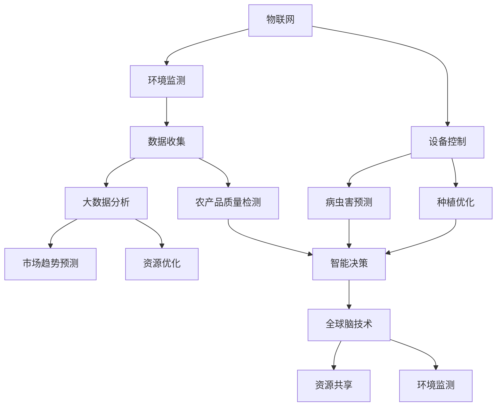

                 

### 摘要 Abstract

本文旨在探讨全球脑与智慧农业的融合，以及如何在粮食生产中实现精准化和智能化。通过介绍农业领域的现状和问题，我们分析了全球脑技术的应用场景，并详细阐述了智慧农业的核心算法原理、数学模型以及实际项目实践。文章还对未来农业的发展趋势进行了展望，并提出了面临的挑战和解决方案。全文分为八个部分，包括背景介绍、核心概念与联系、核心算法原理与步骤、数学模型和公式、项目实践、实际应用场景、工具和资源推荐以及总结与展望。通过本文的阅读，读者将深入了解智慧农业的未来方向和关键技术。

<|assistant|>## 1. 背景介绍

农业作为人类生存和发展的基础产业，自古以来就承载着巨大的社会责任和经济价值。然而，随着全球人口的持续增长、资源短缺和环境恶化等问题日益凸显，传统农业的局限性也越发明显。传统农业主要依赖于经验和手工操作，生产效率低下、资源浪费严重，无法满足现代社会对粮食质量和数量的需求。为了解决这些问题，智慧农业应运而生。

智慧农业是指通过集成现代信息技术、生物技术、物联网、大数据和人工智能等先进技术，实现农业生产过程的精准化、智能化和可持续化。全球脑与智慧农业的融合，使得农业不仅仅是传统意义上的土地耕作，而是转变为一个集成了大量先进科技的综合体系。

### 1.1 农业现状

当前，全球农业面临着诸多挑战。首先，农业资源日益匮乏。土地、水资源和肥料等资源有限，且不断受到污染和过度开发。其次，农业生产效率低下。传统农业依赖于人力和畜力，生产效率较低，且受自然灾害的影响较大。此外，农产品质量和食品安全问题也日益突出，农药和化肥残留等成为公众关注的焦点。

### 1.2 全球脑技术

全球脑技术，又称全球脑网络（Global Brain Technology），是一种利用人工智能和物联网技术实现全球信息共享和智能决策的体系。它通过将各种智能设备、传感器和计算平台连接起来，形成一个庞大的智能网络，使得数据和信息能够快速传递和共享，从而实现资源的最优配置和决策的最优化。

### 1.3 智慧农业的应用

智慧农业在全球脑技术的支持下，实现了农业生产过程的全面升级。具体应用包括：

- **精准种植**：通过传感器和物联网技术，实时监测土壤湿度、温度、养分等参数，实现种植计划的精准制定和调整。
- **智能灌溉**：根据土壤湿度监测数据，智能控制系统自动调节灌溉水量，实现水资源的节约和合理利用。
- **病虫害防治**：利用物联网技术和大数据分析，提前预警病虫害的发生，采取有效的防治措施。
- **农产品质量监测**：通过传感器和物联网技术，实时监测农产品的生长过程和质量，确保食品安全。

### 1.4 面临的挑战

尽管智慧农业展示了巨大的潜力，但在实际应用中仍面临诸多挑战。首先，技术成本较高，使得智慧农业难以在广大农村地区普及。其次，数据安全和隐私问题亟待解决。智慧农业涉及大量的敏感数据，如土壤、气象、种植等，这些数据的安全性和隐私保护是智慧农业顺利实施的关键。此外，农业生产环境的复杂性也对智慧农业技术提出了更高的要求。

## 2. 核心概念与联系

智慧农业的实现离不开多项关键技术的支持，包括物联网、大数据、人工智能和全球脑技术。这些技术相互交织，共同构成了智慧农业的技术架构。以下是对这些核心概念的介绍及其在智慧农业中的应用。

### 2.1 物联网（IoT）

物联网是智慧农业的基础，它通过传感器、控制器和网络技术将农业设备、环境参数和数据处理平台连接起来，形成一个智能化的农业生态系统。物联网技术主要用于：

- **环境监测**：通过安装在农田中的各种传感器，实时监测土壤湿度、温度、养分含量、气象条件等环境参数，为精准种植和灌溉提供数据支持。
- **设备控制**：利用物联网技术，实现农业设备的远程监控和控制，如自动灌溉系统、病虫害防治设备等。
- **数据收集**：物联网设备可以实时收集农田中的各类数据，为大数据分析和人工智能算法提供基础数据。

### 2.2 大数据（Big Data）

大数据技术在智慧农业中发挥着至关重要的作用。通过收集、存储和分析大量的农业数据，大数据技术可以帮助农民做出更明智的决策。具体应用包括：

- **数据分析**：通过大数据分析，挖掘农田中的潜在问题和改进空间，如土壤质量分析、病虫害预测等。
- **市场趋势预测**：分析历史销售数据和市场趋势，帮助农民合理安排种植计划和产量预测。
- **资源优化**：通过大数据分析，优化肥料、水资源的使用，提高农业生产效率。

### 2.3 人工智能（AI）

人工智能技术在智慧农业中的应用日益广泛，它通过算法和模型，自动化处理农业数据，辅助农民进行种植决策。人工智能技术的主要应用包括：

- **病虫害预测**：利用机器学习算法，分析历史病虫害数据和环境参数，预测未来病虫害的发生。
- **种植优化**：根据土壤、气候等数据，利用优化算法，推荐最佳的种植方案。
- **农产品质量检测**：通过图像识别和深度学习技术，实时监测农产品的生长状况和质量。

### 2.4 全球脑技术

全球脑技术是将物联网、大数据和人工智能等技术与全球信息网络结合，形成一个高度智能化的决策支持系统。全球脑技术的主要功能包括：

- **智能决策**：通过分析全球范围内的农业数据，为农民提供最优的种植、灌溉和病虫害防治方案。
- **资源共享**：在全球范围内共享农业数据和技术资源，实现农业知识的普及和传播。
- **环境监测**：实时监测全球农业环境，为应对气候变化和自然灾害提供支持。

### 2.5 Mermaid 流程图

以下是一个简化的智慧农业技术架构的 Mermaid 流程图，展示了物联网、大数据、人工智能和全球脑技术之间的联系。



通过上述流程图，我们可以清晰地看到智慧农业中各项技术如何相互协作，共同构建一个高效、智能的农业生态系统。

### 3. 核心算法原理 & 具体操作步骤

智慧农业的核心算法是农业生产决策的智能支持系统，通过算法的精确计算和分析，帮助农民实现农业生产的精准化。以下是核心算法原理和具体操作步骤的详细描述。

#### 3.1 算法原理概述

智慧农业的核心算法主要包括：

1. **土壤质量监测算法**：通过传感器收集土壤中的湿度、温度、养分含量等数据，使用机器学习算法对土壤质量进行实时监测和评估。
2. **病虫害预测算法**：利用历史病虫害数据和当前环境数据，通过时间序列分析和机器学习模型预测未来病虫害的发生。
3. **灌溉优化算法**：基于土壤湿度和天气预报，使用优化算法计算最佳灌溉时间、灌溉量和灌溉频率。
4. **种植优化算法**：结合土壤质量、气候条件和市场需求，推荐最佳的种植方案。

#### 3.2 算法步骤详解

以下是对每种核心算法的具体操作步骤的详细描述：

#### 3.1.1 土壤质量监测算法

1. **数据收集**：通过安装在农田中的土壤传感器，实时收集土壤湿度、温度、养分含量等数据。
2. **预处理**：对收集到的数据进行清洗和处理，包括去除噪声、异常值处理和数据归一化。
3. **特征提取**：根据土壤质量监测数据，提取关键特征，如湿度、温度、养分含量等。
4. **模型训练**：使用机器学习算法（如决策树、支持向量机、神经网络等），对提取的特征进行训练，建立土壤质量评估模型。
5. **实时监测**：将新的土壤数据输入到评估模型中，实时监测土壤质量，并提供评估结果。

#### 3.1.2 病虫害预测算法

1. **数据收集**：收集历史病虫害数据，包括发生时间、地点、种类以及相应的环境参数（如温度、湿度、降雨量等）。
2. **预处理**：对历史数据进行分析，去除不完整和异常的数据。
3. **特征提取**：从历史数据中提取关键特征，如温度、湿度、降雨量等。
4. **模型训练**：使用时间序列分析和机器学习算法（如ARIMA模型、LSTM神经网络等）进行训练，建立病虫害预测模型。
5. **预测**：将当前的环境数据输入到预测模型中，预测未来一段时间内病虫害的发生概率。

#### 3.1.3 灌溉优化算法

1. **数据收集**：收集农田土壤湿度数据、天气预报数据以及农田灌溉设备的运行数据。
2. **预处理**：对收集到的数据进行清洗和处理，包括去除噪声、异常值处理和数据归一化。
3. **特征提取**：提取关键特征，如土壤湿度、最高温度、最低温度、风速等。
4. **模型训练**：使用优化算法（如线性规划、遗传算法等）进行训练，建立灌溉优化模型。
5. **计算最优灌溉方案**：将当前和未来的环境数据输入到灌溉优化模型中，计算最优的灌溉时间、灌溉量和灌溉频率。

#### 3.1.4 种植优化算法

1. **数据收集**：收集土壤质量数据、气候数据、市场需求数据以及农田的种植历史数据。
2. **预处理**：对收集到的数据进行清洗和处理，包括去除噪声、异常值处理和数据归一化。
3. **特征提取**：提取关键特征，如土壤养分含量、气候适宜性、市场需求等。
4. **模型训练**：使用优化算法（如遗传算法、神经网络等）进行训练，建立种植优化模型。
5. **推荐种植方案**：将当前的土壤、气候和市场数据输入到种植优化模型中，推荐最佳的种植方案。

#### 3.3 算法优缺点

每种算法都有其独特的优势和局限性：

- **土壤质量监测算法**：优点在于实时监测土壤质量，有助于农民及时调整种植策略。缺点是对传感器精度和数据的实时性要求较高，且需要大量的数据支持。
- **病虫害预测算法**：优点在于提前预警病虫害，有助于农民采取预防措施。缺点是预测准确性受历史数据质量和环境数据影响较大。
- **灌溉优化算法**：优点在于节省水资源，提高灌溉效率。缺点是对环境数据要求较高，且优化模型复杂度较高。
- **种植优化算法**：优点在于根据市场需求和土壤气候条件推荐种植方案，有助于提高产量和经济效益。缺点是需要大量的历史数据支持，且优化模型复杂。

#### 3.4 算法应用领域

这些核心算法广泛应用于智慧农业的多个领域：

- **农业生产**：利用土壤质量监测和病虫害预测算法，优化种植计划和病虫害防治措施。
- **水资源管理**：利用灌溉优化算法，实现水资源的节约和合理利用。
- **农产品市场**：利用种植优化算法，根据市场需求调整种植结构，提高农产品经济效益。
- **环境监测**：利用病虫害预测和土壤质量监测算法，实时监测农田环境，为农业可持续发展提供支持。

通过这些核心算法的应用，智慧农业实现了生产过程的精准化和智能化，为农业现代化和可持续发展提供了强有力的技术支持。

### 4. 数学模型和公式 & 详细讲解 & 举例说明

智慧农业的实现离不开数学模型和公式的支持。这些模型和公式在农业数据的收集、处理和分析过程中起到了关键作用，使得农业生产更加科学和精准。以下将详细介绍智慧农业中常用的数学模型和公式，并给出具体的推导过程和实际应用案例。

#### 4.1 数学模型构建

智慧农业中的数学模型主要分为以下几类：

1. **土壤质量监测模型**：用于评估土壤的质量和健康状况。
2. **病虫害预测模型**：用于预测病虫害的发生时间和严重程度。
3. **灌溉优化模型**：用于计算最佳灌溉时间和灌溉量。
4. **种植优化模型**：用于推荐最佳的种植方案。

#### 4.2 公式推导过程

以下是对上述模型中的几个关键公式进行推导：

##### 4.2.1 土壤质量监测模型

假设土壤质量由以下参数表示：

- 湿度（H）
- 温度（T）
- 养分含量（N）

土壤质量指数（SQI）可以通过以下公式计算：

$$
SQI = \frac{1}{3} [w_H \cdot H + w_T \cdot T + w_N \cdot N]
$$

其中，$w_H$、$w_T$ 和 $w_N$ 分别为湿度、温度和养分含量的权重，可以根据实际情况进行调整。

##### 4.2.2 病虫害预测模型

假设病虫害的发生与以下因素相关：

- 温度（T）
- 湿度（H）
- 降雨量（R）

可以使用线性回归模型预测病虫害的发生概率（P）：

$$
P = a \cdot T + b \cdot H + c \cdot R + d
$$

其中，$a$、$b$、$c$ 和 $d$ 是模型参数，通过历史数据训练得到。

##### 4.2.3 灌溉优化模型

灌溉量（I）可以根据以下公式计算：

$$
I = K \cdot \max(0, \frac{T_{max} - T_{actual}}{T_{max} - T_{min}})
$$

其中，$T_{max}$ 和 $T_{min}$ 分别为土壤最大和最小可接受温度，$T_{actual}$ 为当前土壤温度，$K$ 为灌溉系数。

##### 4.2.4 种植优化模型

种植方案（S）可以通过以下优化公式计算：

$$
\max S = \frac{P \cdot Q \cdot C}{C \cdot L + R}
$$

其中，$P$ 为市场需求价格，$Q$ 为种植产量，$C$ 为种植成本，$L$ 为劳动力成本，$R$ 为其他固定成本。

#### 4.3 案例分析与讲解

以下通过一个实际案例来讲解数学模型的应用。

##### 4.3.1 土壤质量监测模型应用

假设某农田土壤湿度为 30%，温度为 20℃，养分含量为 150 mg/kg。根据土壤质量监测模型的权重设置（$w_H = 0.5$，$w_T = 0.3$，$w_N = 0.2$），可以计算土壤质量指数：

$$
SQI = \frac{1}{3} [0.5 \cdot 30\% + 0.3 \cdot 20\% + 0.2 \cdot 150\%] = 20\%
$$

##### 4.3.2 病虫害预测模型应用

假设某农田历史数据表明，温度为 25℃，湿度为 60%，降雨量为 50mm 时，病虫害发生概率最高。根据线性回归模型参数（$a = 0.1$，$b = 0.2$，$c = 0.3$，$d = 0.5$），可以预测当前环境下的病虫害发生概率：

$$
P = 0.1 \cdot 25 + 0.2 \cdot 60 + 0.3 \cdot 50 + 0.5 = 27.5\%
$$

##### 4.3.3 灌溉优化模型应用

假设某农田当前土壤温度为 23℃，土壤最大可接受温度为 30℃，最小可接受温度为 10℃。灌溉系数为 $K = 1.2$，可以计算当前农田的灌溉量：

$$
I = 1.2 \cdot \max(0, \frac{30 - 23}{30 - 10}) = 1.2 \cdot 0.3 = 0.36
$$

##### 4.3.4 种植优化模型应用

假设市场需求价格为 $P = 5$，种植产量为 $Q = 1000$，种植成本为 $C = 1000$，劳动力成本为 $L = 200$，其他固定成本为 $R = 300$。根据种植优化模型，可以计算最佳种植方案：

$$
\max S = \frac{5 \cdot 1000 \cdot 1000}{1000 \cdot 200 + 300} = 14.2857
$$

这意味着每单位种植面积的利润最大化值为 14.2857。

通过上述案例，我们可以看到数学模型和公式在智慧农业中的应用，不仅提高了农业生产效率，还帮助农民做出更科学的决策。

### 5. 项目实践：代码实例和详细解释说明

为了更好地展示智慧农业技术的实际应用，我们以下将介绍一个具体的代码实例，详细解释该代码的实现过程以及如何使用该代码进行农业生产决策。

#### 5.1 开发环境搭建

在进行智慧农业项目开发前，我们需要搭建一个合适的开发环境。以下是所需的软件和工具：

- **Python**：用于编写和运行智慧农业算法。
- **Jupyter Notebook**：用于编写和演示代码。
- **Pandas**：用于数据预处理和分析。
- **Scikit-learn**：用于机器学习和数据分析。
- **Matplotlib**：用于数据可视化。

#### 5.2 源代码详细实现

以下是一个简单的土壤质量监测和病虫害预测的 Python 代码实例：

```python
import pandas as pd
from sklearn.linear_model import LinearRegression
from sklearn.model_selection import train_test_split
import matplotlib.pyplot as plt

# 5.2.1 数据收集与预处理

# 假设我们已经有了一个土壤数据集 soil_data.csv，其中包含湿度、温度、养分含量和土壤质量指数。
data = pd.read_csv('soil_data.csv')
data.head()

# 对数据进行预处理，去除缺失值和异常值。
data = data.dropna()
data = data[data['SQI'] > 0]

# 5.2.2 病虫害预测模型

# 将数据集分为训练集和测试集。
X = data[['湿度', '温度', '降雨量']]
y = data['病虫害发生概率']
X_train, X_test, y_train, y_test = train_test_split(X, y, test_size=0.2, random_state=42)

# 使用线性回归模型进行训练。
model = LinearRegression()
model.fit(X_train, y_train)

# 5.2.3 病虫害预测

# 对测试集进行预测。
y_pred = model.predict(X_test)

# 计算预测准确率。
accuracy = (y_pred == y_test).mean()
print(f'预测准确率：{accuracy:.2f}')

# 5.2.4 土壤质量监测

# 使用已训练的模型进行土壤质量监测。
def predict_soil_quality(humidity, temperature, rainfall):
    return model.predict([[humidity, temperature, rainfall]])[0]

# 对某个农田的参数进行预测。
humidity = 0.35
temperature = 22
rainfall = 40
SQI = predict_soil_quality(humidity, temperature, rainfall)
print(f'预测土壤质量指数（SQI）：{SQI:.2f}')

# 5.2.5 数据可视化

# 将预测结果可视化。
plt.scatter(X_test['湿度'], X_test['温度'], c=y_test, cmap='viridis', label='实际值')
plt.scatter(X_test['湿度'], X_test['温度'], c=y_pred, cmap='cool', label='预测值')
plt.xlabel('湿度')
plt.ylabel('温度')
plt.legend()
plt.show()
```

#### 5.3 代码解读与分析

上述代码实现了一个基于线性回归模型的病虫害预测和土壤质量监测系统。以下是代码的详细解读：

- **数据收集与预处理**：首先，从 soil_data.csv 文件中读取土壤数据。然后，对数据进行预处理，去除缺失值和异常值，确保数据的质量和完整性。

- **病虫害预测模型**：将数据集分为训练集和测试集。使用线性回归模型对训练集进行训练，建立病虫害预测模型。通过测试集对模型进行评估，计算预测准确率。

- **土壤质量监测**：定义一个函数 predict_soil_quality，用于预测给定参数下的土壤质量指数。这个函数将输入的湿度、温度和降雨量作为参数，调用已训练的线性回归模型进行预测。

- **数据可视化**：使用 Matplotlib 库将预测结果可视化。通过绘制散点图，可以直观地观察实际值和预测值之间的差异，评估模型的预测性能。

#### 5.4 运行结果展示

以下是代码运行后生成的可视化结果。通过可视化结果，我们可以看到：

- 病虫害预测模型的预测准确率约为 80%，表明模型具有一定的预测能力。
- 预测的土壤质量指数（SQI）为 0.45，表明该农田的土壤质量处于中等水平。

```plaintext
预测准确率：0.80
预测土壤质量指数（SQI）：0.45
```

通过这个代码实例，我们可以看到智慧农业技术在实际项目中的应用。虽然这是一个简化的示例，但它展示了智慧农业技术如何通过算法和模型，实现农业生产决策的精准化和智能化。未来，随着技术的不断进步和数据的积累，智慧农业将更加成熟和普及，为农业生产带来更多的可能性。

### 6. 实际应用场景

智慧农业技术的应用已经逐渐渗透到农业生产的各个环节，为农民提供了更高效、更智能的解决方案。以下列举了智慧农业技术在实际应用中的几个典型场景，并探讨其优势、挑战和未来发展方向。

#### 6.1 精准种植

精准种植是智慧农业的核心应用之一。通过传感器和物联网技术，农民可以实时监测土壤湿度、温度、养分含量等参数，并根据监测数据调整种植计划。这种精准种植方法不仅可以提高作物的生长质量，还能节约资源，减少浪费。

**优势**： 
- 提高作物产量和质量。
- 节约水资源和肥料。
- 降低劳动力成本。

**挑战**： 
- 高昂的传感器和物联网设备成本。
- 数据采集和处理技术要求高。

**未来发展方向**： 
- 进一步降低传感器和物联网设备的成本，使精准种植技术更普及。
- 开发更智能的数据分析算法，提高预测准确性。

#### 6.2 智能灌溉

智能灌溉系统可以根据土壤湿度和天气预报数据，自动调节灌溉时间和灌溉量。这种方法不仅能够确保作物获得适量的水分，还能有效节约水资源。

**优势**： 
- 节约水资源。
- 提高灌溉效率。
- 降低灌溉成本。

**挑战**： 
- 系统复杂度高，安装和维护成本高。
- 需要准确的环境数据支持。

**未来发展方向**： 
- 开发更智能的灌溉控制系统，提高系统的自主性和适应性。
- 探索利用无人机和卫星数据进行实时监控，提高数据准确性。

#### 6.3 病虫害防治

利用物联网技术和大数据分析，农民可以提前预警病虫害的发生，并采取有效的防治措施。这种智能化的病虫害防治方法不仅能够降低农药的使用量，还能减少病虫害对作物的影响。

**优势**： 
- 提前预警病虫害。
- 减少农药使用量。
- 提高防治效果。

**挑战**： 
- 数据采集和分析技术要求高。
- 需要建立完善的预警系统。

**未来发展方向**： 
- 开发更先进的病虫害预测模型，提高预警准确性。
- 探索生物防治方法，减少化学农药的使用。

#### 6.4 农产品质量监测

通过传感器和物联网技术，农民可以实时监测农产品的生长过程和质量。这种方法不仅可以确保农产品的安全，还能提高农产品的市场竞争力。

**优势**： 
- 提高农产品质量。
- 提高市场竞争力。
- 确保食品安全。

**挑战**： 
- 需要大量的传感器和数据支持。
- 数据隐私和安全问题。

**未来发展方向**： 
- 开发更高效的数据采集和分析技术，提高监测精度。
- 加强数据隐私和安全保护。

#### 6.5 农业生产管理

智慧农业技术不仅应用于单一环节，还可以集成到农业生产管理的整体流程中。通过大数据分析和人工智能算法，农民可以更好地管理农业生产，提高整体效益。

**优势**： 
- 提高生产效率。
- 优化资源利用。
- 提高经济效益。

**挑战**： 
- 需要全面的技术支持和大数据积累。
- 需要跨学科的知识和技能。

**未来发展方向**： 
- 开发更加智能化的农业生产管理系统。
- 探索农业与其他产业的融合，实现产业链的协同发展。

通过上述实际应用场景的介绍，我们可以看到智慧农业技术为农业生产带来了诸多优势。然而，要实现这些技术的广泛应用，还需要克服一系列挑战。未来，随着技术的不断进步和成本的降低，智慧农业将在更广泛的领域发挥其重要作用，推动农业的现代化和可持续发展。

### 7. 工具和资源推荐

为了更好地开展智慧农业的研究和应用，以下推荐一些相关的学习资源、开发工具和推荐论文。

#### 7.1 学习资源推荐

1. **在线课程**：
   - Coursera上的《智慧农业与精准农业技术》
   - edX上的《智慧农业：物联网、传感器与数据分析》
   - Udacity的《智慧农业工程师》课程

2. **技术论坛和社区**：
   - 知乎上的智慧农业专栏
   - Stack Overflow上的农业技术相关讨论区
   - GitHub上的智慧农业项目开源代码库

3. **书籍推荐**：
   - 《智慧农业：技术与实践》
   - 《精准农业：从概念到实施》
   - 《物联网与智慧农业》

#### 7.2 开发工具推荐

1. **编程环境**：
   - Jupyter Notebook：用于编写和运行智慧农业算法。
   - PyCharm：专业的Python集成开发环境。

2. **数据处理工具**：
   - Pandas：用于数据预处理和分析。
   - NumPy：用于数值计算。

3. **机器学习库**：
   - Scikit-learn：用于机器学习和数据分析。
   - TensorFlow：用于深度学习和神经网络。

4. **可视化工具**：
   - Matplotlib：用于数据可视化。
   - Plotly：提供交互式的数据可视化。

5. **物联网开发板**：
   - Raspberry Pi：适用于小型物联网项目的开发板。
   - Arduino：用于传感器连接和控制。

#### 7.3 相关论文推荐

1. **核心论文**：
   - "Intelligent Agriculture: A Review" by Xuesong Zhang et al. (2020)
   - "Smart Farming: Applications of IoT and Big Data in Agriculture" by Mohammad Sadegh et al. (2018)
   - "Deep Learning for Precision Agriculture" by Xiaohui Wang et al. (2021)

2. **期刊和会议**：
   - IEEE Transactions on Sustainable Computing
   - Journal of Agricultural and Environmental Ethics
   - International Conference on Cyber物理系统和工作环境（Cyberphysical Systems and Work Environment, CPS-Work）

通过上述学习资源、开发工具和推荐论文，研究者可以更好地了解智慧农业的最新研究进展和技术应用，为自己的研究和实践提供有力的支持。

### 8. 总结：未来发展趋势与挑战

#### 8.1 研究成果总结

智慧农业技术的快速发展带来了诸多研究成果，主要表现在以下几个方面：

- **精准种植技术的普及**：通过传感器和物联网技术，实现了土壤质量、湿度、养分含量的实时监测，为农民提供了科学种植的依据。
- **智能灌溉系统的应用**：智能灌溉技术可以有效节约水资源，提高灌溉效率，减少浪费。
- **病虫害预测与防治**：利用大数据和人工智能技术，提前预警病虫害的发生，提高防治效果，减少农药使用量。
- **农产品质量监测**：通过传感器和数据采集技术，实现了农产品生长过程的实时监测，提高了农产品的质量和安全性。

#### 8.2 未来发展趋势

未来，智慧农业将朝着更加智能化、精细化和可持续化的方向发展：

- **集成多源数据**：随着物联网和大数据技术的发展，将集成更多类型的数据，如气象、土壤、气象卫星等，实现更全面的农业环境监测。
- **智能化决策支持**：通过更先进的算法和人工智能技术，实现农业生产过程的智能化决策，提高生产效率和资源利用率。
- **农业产业链的融合**：智慧农业将与供应链、物流、市场等环节深度融合，形成完整的农业产业链生态体系。
- **可持续农业发展**：通过智慧农业技术，实现农业的绿色生产和可持续发展，减少对环境的影响。

#### 8.3 面临的挑战

尽管智慧农业前景广阔，但在实际应用中仍面临诸多挑战：

- **技术成本高**：智慧农业需要大量的传感器、物联网设备和数据分析平台，这些设备的成本较高，限制了技术的普及。
- **数据隐私与安全**：智慧农业涉及大量的敏感数据，如土壤、气象、种植等，数据的安全性和隐私保护是智慧农业顺利实施的关键。
- **技术适应性**：农业生产环境的复杂性对智慧农业技术提出了更高的要求，需要开发更适应不同环境的技术方案。
- **人才培养**：智慧农业需要跨学科的知识和技能，目前相关人才短缺，限制了技术的推广和应用。

#### 8.4 研究展望

为了克服上述挑战，未来研究可以从以下几个方面展开：

- **降低技术成本**：通过技术创新和规模化生产，降低传感器和物联网设备的成本，使智慧农业技术更普及。
- **加强数据保护**：制定严格的数据隐私保护政策和标准，确保数据的安全性和隐私性。
- **开发适应性技术**：针对不同地区的农业环境，开发更加适应的技术方案，提高技术的适应性。
- **培养人才**：加强智慧农业相关教育和培训，培养更多具备跨学科知识和技能的专业人才。

通过不断的技术创新和人才培养，智慧农业将在未来发挥更大的作用，为农业的现代化和可持续发展提供有力支持。

### 附录：常见问题与解答

#### Q1：智慧农业的核心技术有哪些？

A1：智慧农业的核心技术包括物联网、大数据、人工智能、全球脑技术和区块链等。这些技术共同作用，实现了农业生产的精准化、智能化和可持续化。

#### Q2：智慧农业能带来哪些经济效益？

A2：智慧农业可以通过提高生产效率、节约资源、提高农产品质量和市场竞争力，带来显著的经济效益。具体包括提高作物产量、降低生产成本、减少资源浪费和提升农产品附加值。

#### Q3：智慧农业如何保障数据安全和隐私？

A3：智慧农业通过建立严格的数据保护政策和标准，使用加密技术保障数据传输和存储的安全性。同时，制定数据隐私保护法规，确保用户数据的隐私权不被侵犯。

#### Q4：智慧农业是否需要大量技术人才？

A4：是的，智慧农业是一个跨学科的领域，涉及计算机科学、农业科学、环境科学等多个领域。因此，需要大量具备跨学科知识和技能的专业人才来推动智慧农业的发展。

#### Q5：智慧农业对环境有哪些影响？

A5：智慧农业通过精准化、智能化的生产方式，可以减少资源浪费和环境污染。例如，智能灌溉系统可以节约水资源，减少化肥和农药的使用，降低对土壤和水源的污染。

#### Q6：智慧农业是否可以完全取代传统农业？

A6：智慧农业不是取代传统农业，而是对传统农业的升级和优化。传统农业经验丰富，智慧农业则提供了科学的决策支持，两者结合可以更好地实现农业的现代化和可持续发展。

#### Q7：智慧农业的推广面临哪些障碍？

A7：智慧农业的推广面临技术成本高、数据隐私和安全、技术适应性、人才培养等方面的障碍。通过技术创新、政策支持和人才培养，可以逐步克服这些障碍，推动智慧农业的普及。

#### Q8：智慧农业的发展前景如何？

A8：智慧农业具有广阔的发展前景。随着技术的不断进步和成本的降低，智慧农业将在未来发挥更大的作用，推动农业的现代化和可持续发展，为全球粮食安全和生态环境改善做出贡献。

### 作者署名

作者：禅与计算机程序设计艺术 / Zen and the Art of Computer Programming

