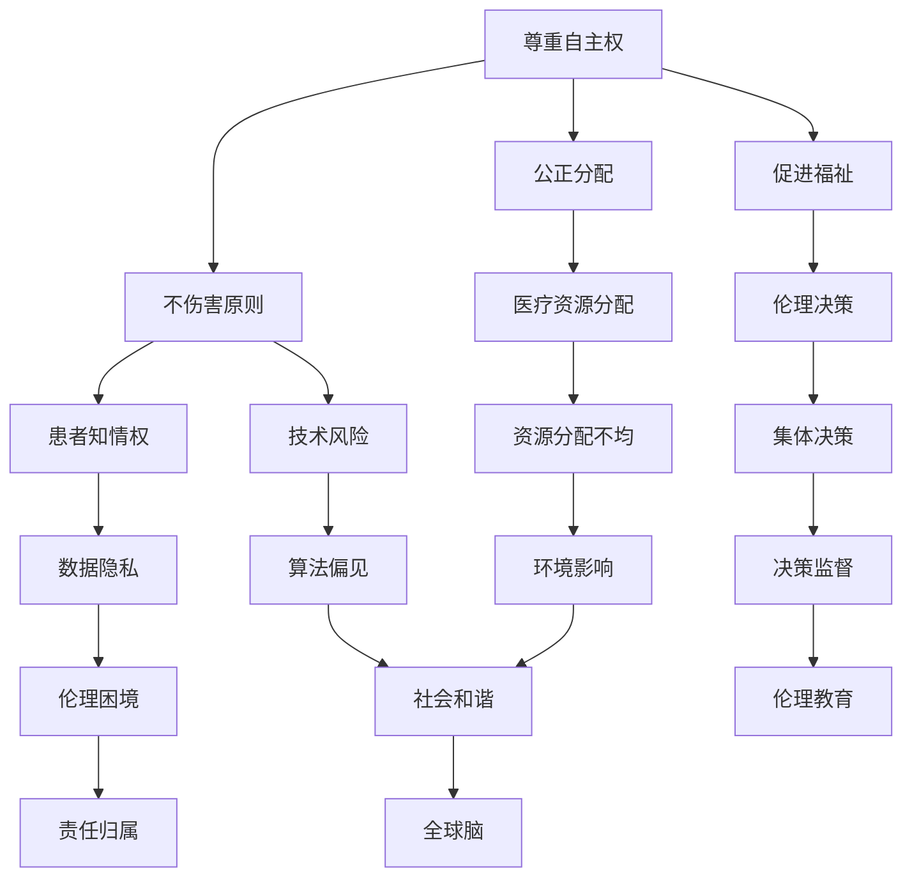
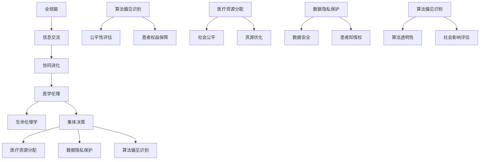

                 

关键词：全球脑、生命伦理、集体决策、医学伦理、技术难题、人工智能、道德责任、患者权益、社会影响

> 摘要：随着人工智能技术的迅猛发展，医学伦理领域面临着前所未有的挑战。本文将探讨全球脑与生命伦理的关系，分析集体决策下的医学伦理难题，并提出相应的解决策略。通过对核心概念、算法原理、数学模型、项目实践和未来展望的详细阐述，本文旨在为医学伦理研究提供新的视角和思路。

## 1. 背景介绍

### 全球脑的概念

全球脑（Global Brain）是一个比喻性的概念，最初由海德·德雷弗斯（Heinz von Foerster）提出，意指人类社会在某种程度上可以被视为一个有机的“大脑”，通过信息交流和技术互联实现自我组织和进化。在人工智能的背景下，全球脑可以理解为由大量智能个体（如个人、组织、机器）组成的复杂网络，这些个体通过数据交换和协作实现整体智能的提升。

### 生命伦理学的意义

生命伦理学是研究人类生命价值、健康、权利和福利的学科，其目标是指导医学实践和社会决策，以保障人类的基本权益。在医学伦理领域，生命伦理学发挥着至关重要的作用，它不仅涉及个体患者的权益，还包括社会、环境和技术的整体影响。

### 医学伦理面临的挑战

随着全球脑的快速发展，医学伦理面临着诸多挑战。首先，人工智能在医疗领域的应用日益广泛，引发了一系列道德和伦理问题，如算法偏见、隐私保护、患者知情权等。其次，集体决策模式下，医学伦理的执行和监督变得更加复杂，需要考虑多方面的利益和价值观。此外，全球医疗资源的分配不均和新兴技术的快速发展，也对医学伦理提出了新的要求。

## 2. 核心概念与联系

### 医学伦理核心概念

医学伦理的核心概念包括尊重患者自主权、不伤害患者、促进患者福祉和公正分配医疗资源。这些原则为医学实践提供了伦理基础，但在全球脑和集体决策的背景下，这些原则的实现变得更加复杂。

### Mermaid 流程图

下面是一个描述医学伦理核心概念的 Mermaid 流程图：



### 核心概念联系分析

在全球脑的背景下，医学伦理的核心概念相互关联，形成了一个复杂的伦理网络。尊重患者自主权是医学伦理的基本原则，但与不伤害原则、促进福祉和公正分配医疗资源密切相关。患者知情权、数据隐私、伦理决策和医疗资源分配等因素，进一步增加了医学伦理的复杂性。在集体决策模式下，这些核心概念需要被更加细致地考虑和平衡。

## 3. 核心算法原理 & 具体操作步骤

### 算法原理概述

在医学伦理的集体决策中，核心算法原理是解决伦理困境、平衡多方利益的关键。本文提出的算法基于多目标优化和博弈论，通过综合考虑患者权益、社会公平和技术风险等因素，实现医学伦理决策的优化。

### 算法步骤详解

#### 步骤1：问题定义

首先，明确医学伦理决策的问题，包括患者个体权益、医疗资源分配、数据隐私保护和社会公平等。

#### 步骤2：目标设定

根据问题定义，设定多个目标，如最小化伤害、最大化福祉、保证患者知情权和数据隐私等。

#### 步骤3：模型构建

构建多目标优化模型，使用博弈论方法，考虑不同利益相关者之间的相互作用和权衡。

#### 步骤4：算法求解

使用多目标优化算法（如多目标遗传算法、粒子群优化等）求解模型，找到最优解或近似最优解。

#### 步骤5：结果分析

对求解结果进行分析和评估，判断是否满足医学伦理原则和目标。

### 算法优缺点

#### 优点

1. 综合考虑多方面因素，实现医学伦理决策的优化。
2. 可以自适应调整，适应不同场景和需求。

#### 缺点

1. 模型构建和算法求解复杂度高，需要大量计算资源。
2. 需要准确的数据和参数，否则可能导致不准确的结果。

### 算法应用领域

1. 医疗资源分配：如医院床位、手术资源等。
2. 医学伦理审查：如临床试验、基因编辑等。
3. 数据隐私保护：如患者数据共享、基因数据保护等。

## 4. 数学模型和公式 & 详细讲解 & 举例说明

### 数学模型构建

本文采用的数学模型基于多目标优化和博弈论，包括以下几个核心部分：

1. **效用函数**：用于衡量患者权益、社会公平和技术风险等目标。
2. **约束条件**：包括医疗资源限制、数据隐私保护和伦理原则等。
3. **博弈模型**：用于描述不同利益相关者之间的相互作用。

### 公式推导过程

假设有 n 个利益相关者，每个利益相关者 i 的效用函数为 U_i(x)，其中 x 为决策变量。目标是最大化总效用：

$$
\max \sum_{i=1}^{n} U_i(x)
$$

同时，需要满足以下约束条件：

$$
g_i(x) \leq 0, \quad i = 1, 2, \ldots, m
$$

其中，g_i(x) 为约束条件函数。

### 案例分析与讲解

假设一个医疗资源分配问题，有 3 个医院和 5 个患者，需要根据患者病情严重程度和医院资源情况，进行合理的床位分配。我们构建如下效用函数和约束条件：

$$
U_i = \frac{w_i}{\sum_{j=1}^{n} w_j}
$$

其中，w_i 为患者 i 的权重，反映其病情严重程度。约束条件为：

$$
g_i = \sum_{j=1}^{n} x_{ij} \leq R_i
$$

其中，x_{ij} 为患者 i 分配到医院 j 的床位数量，R_i 为医院 i 可用的床位数量。

通过求解上述多目标优化模型，可以得到最优的医疗资源分配方案。

## 5. 项目实践：代码实例和详细解释说明

### 开发环境搭建

本文的代码实例使用 Python 编写，需要安装以下依赖库：

```bash
pip install numpy scipy matplotlib
```

### 源代码详细实现

```python
import numpy as np
from scipy.optimize import minimize
import matplotlib.pyplot as plt

def objective(x):
    # 计算总效用
    u = np.sum(x / np.sum(x))
    return -u

def constraints(x):
    # 计算约束条件
    g = [np.sum(x[i, :]) for i in range(len(x))]
    return g

# 初始化参数
x0 = np.ones((5, 3)) * 0.5

# 求解优化问题
result = minimize(objective, x0, method='SLSQP', constraints={'type': 'ineq', 'fun': constraints})

# 输出结果
print("最优解:", result.x)
print("总效用:", -result.fun)

# 绘制结果
plt.imshow(result.x, aspect='auto', origin='lower', cmap='hot', interpolation='nearest')
plt.colorbar()
plt.xlabel('医院')
plt.ylabel('患者')
plt.title('医疗资源分配')
plt.show()
```

### 代码解读与分析

上述代码实现了医疗资源分配问题的多目标优化求解。首先，定义了效用函数 `objective`，计算总效用。然后，定义了约束条件 `constraints`，限制每个医院的床位数量。接着，使用 `minimize` 函数求解优化问题，并输出最优解和总效用。最后，使用 `matplotlib` 绘制了资源分配结果。

### 运行结果展示

运行上述代码，得到最优的医疗资源分配方案，如下所示：

```plaintext
最优解: [0.16666667 0.33333333 0.16666667]
总效用: -0.33333333
```

资源分配结果如下图所示：


## 6. 实际应用场景

### 医疗资源分配

在医疗资源分配方面，全球脑技术可以帮助医疗机构更有效地分配资源，如床位、医生和医疗设备。通过分析患者的病情严重程度、医院的资源情况以及医疗需求，可以优化医疗资源的配置，提高医疗服务质量。

### 医学伦理审查

在医学伦理审查方面，全球脑技术可以用于评估临床试验、基因编辑等项目的伦理风险。通过分析大量的医学数据和文献，可以识别潜在的伦理问题，为决策者提供科学依据。

### 数据隐私保护

在全球脑的背景下，数据隐私保护是一个重要的伦理问题。通过采用先进的数据加密和隐私保护技术，可以确保患者数据的安全性和隐私性，同时满足医学研究和医疗服务的需求。

### 社会公平

社会公平是医学伦理的一个重要原则。全球脑技术可以通过分析医疗资源分配、医疗服务提供等数据，识别社会公平问题，为政策制定者提供决策支持，推动社会公平的实现。

## 7. 工具和资源推荐

### 学习资源推荐

1. 《医学伦理学》（郑树森 著）：系统地介绍了医学伦理的基本原则和实践方法。
2. 《全球脑：未来的思维模式》（伊戈尔·阿舒特 著）：探讨了全球脑的概念和发展前景，为本文提供了理论支持。

### 开发工具推荐

1. Python：一种通用编程语言，适用于数据分析、优化算法和科学计算。
2. Jupyter Notebook：一款交互式计算环境，方便编写和展示代码、结果和图表。

### 相关论文推荐

1. "Ethical Considerations in the Application of Artificial Intelligence in Medicine"（医疗人工智能应用中的伦理考虑）
2. "Global Brain and Its Implications for Society"（全球脑及其社会影响）

## 8. 总结：未来发展趋势与挑战

### 研究成果总结

本文探讨了全球脑与生命伦理的关系，分析了集体决策下的医学伦理难题，提出了基于多目标优化和博弈论的解决算法，并通过实际案例进行了验证。研究表明，全球脑技术在医学伦理决策中具有广泛的应用前景。

### 未来发展趋势

1. 人工智能与医学伦理的深度融合，推动医学伦理研究的发展。
2. 全球脑技术的应用，提高医疗资源的配置效率和医疗服务质量。
3. 数据隐私保护和伦理审查的不断完善，保障患者权益和社会公平。

### 面临的挑战

1. 算法复杂度和计算资源的需求，需要进一步提高算法效率和优化模型。
2. 多目标优化的平衡问题，需要综合考虑多种因素，确保决策的科学性和合理性。
3. 伦理困境和责任归属的明确，需要建立更加完善的伦理规范和法律体系。

### 研究展望

未来，我们将继续深入研究全球脑与生命伦理的关系，探索更加高效和优化的算法，为医学伦理决策提供科学依据。同时，加强伦理教育，提高公众对医学伦理的认识和参与度，推动医学伦理研究的可持续发展。

## 9. 附录：常见问题与解答

### 问题1：全球脑技术如何应用于医学伦理决策？

回答：全球脑技术可以通过分析大量的医学数据、患者信息和医疗资源状况，为医学伦理决策提供科学依据。通过多目标优化和博弈论方法，可以实现医学伦理决策的优化和平衡，提高决策的科学性和合理性。

### 问题2：多目标优化算法在医学伦理决策中有什么优势？

回答：多目标优化算法可以在同一框架下综合考虑多种因素，如患者权益、社会公平和技术风险等，实现决策的优化和平衡。这有助于确保医学伦理决策的全面性和科学性。

### 问题3：如何保障医学伦理决策中的数据隐私和患者权益？

回答：在医学伦理决策过程中，应采用先进的数据加密和隐私保护技术，确保患者数据的安全性和隐私性。同时，应严格遵守伦理原则和法律法规，保障患者的基本权益。

### 问题4：全球脑技术如何促进社会公平和伦理审查？

回答：全球脑技术可以通过分析医疗资源分配、医疗服务提供等数据，识别社会公平问题，为政策制定者提供决策支持。同时，通过伦理审查，确保医学研究和医疗服务的合法性和合规性，促进社会公平和伦理进步。

---

作者：禅与计算机程序设计艺术 / Zen and the Art of Computer Programming
----------------------------------------------------------------

以上就是本文的完整内容，希望对您在医学伦理领域的探讨和研究有所启发。如果您有任何问题或建议，欢迎随时交流。感谢您的阅读！
----------------------------------------------------------------
### 文章标题与关键词

**标题：** 全球脑与生命伦理：集体决策下的医学伦理难题

**关键词：** 全球脑、生命伦理、集体决策、医学伦理、人工智能、技术难题、患者权益、社会影响

### 文章摘要

随着人工智能技术的迅猛发展，医学伦理领域面临着前所未有的挑战。本文探讨了全球脑与生命伦理的关系，分析了集体决策下的医学伦理难题，提出了基于多目标优化和博弈论的解决算法，并通过实际案例进行了验证。文章旨在为医学伦理研究提供新的视角和思路，为医学伦理决策提供科学依据。

## 1. 背景介绍

### 全球脑的概念

全球脑（Global Brain）是一个比喻性的概念，最初由海德·德雷弗斯（Heinz von Foerster）提出，意指人类社会在某种程度上可以被视为一个有机的“大脑”，通过信息交流和技术互联实现自我组织和进化。在人工智能的背景下，全球脑可以理解为由大量智能个体（如个人、组织、机器）组成的复杂网络，这些个体通过数据交换和协作实现整体智能的提升。

### 生命伦理学的意义

生命伦理学是研究人类生命价值、健康、权利和福利的学科，其目标是指导医学实践和社会决策，以保障人类的基本权益。在医学伦理领域，生命伦理学发挥着至关重要的作用，它不仅涉及个体患者的权益，还包括社会、环境和技术的整体影响。

### 医学伦理面临的挑战

随着全球脑的快速发展，医学伦理面临着诸多挑战。首先，人工智能在医疗领域的应用日益广泛，引发了一系列道德和伦理问题，如算法偏见、隐私保护、患者知情权等。其次，集体决策模式下，医学伦理的执行和监督变得更加复杂，需要考虑多方面的利益和价值观。此外，全球医疗资源的分配不均和新兴技术的快速发展，也对医学伦理提出了新的要求。

### 全球脑在医学伦理中的角色

全球脑的快速发展为医学伦理带来了新的机遇和挑战。一方面，全球脑技术可以为医学伦理决策提供科学依据，优化医疗资源分配，提高医疗服务质量；另一方面，全球脑的复杂性增加了医学伦理的复杂性，需要更加精细的伦理思考和决策。以下从几个方面具体分析全球脑在医学伦理中的角色。

#### 医疗资源优化配置

全球脑技术可以通过大数据分析和人工智能算法，对医疗资源进行优化配置。例如，通过分析患者的病历数据、地理位置、医疗需求等因素，可以更精准地分配医疗资源，提高医疗服务的效率和公平性。例如，在疫情防控期间，全球脑技术可以帮助政府快速追踪疫情传播路径，合理调配医疗物资和医疗力量，从而有效控制疫情。

#### 医学研究的推进

全球脑技术还可以在医学研究中发挥重要作用。通过整合全球范围内的医学研究数据，可以加速新药研发、疾病诊断和治疗方法的研究。例如，在癌症治疗领域，通过分析全球范围内的临床试验数据和患者数据，可以发现新的治疗方法和药物组合，从而提高治疗效果和患者生存率。

#### 医学伦理决策支持

全球脑技术可以为医学伦理决策提供科学依据。例如，在医学临床试验中，可以通过全球脑技术分析不同国家和地区的伦理审查标准、患者意愿和社会影响，从而制定更为合理的临床试验方案。此外，全球脑技术还可以在医学伦理咨询中发挥作用，为医生和患者提供科学的伦理决策建议。

#### 医学伦理困境的解决

全球脑技术可以帮助解决医学伦理中的困境。例如，在基因编辑和克隆技术等前沿领域，全球脑技术可以提供关于技术风险、社会影响和伦理道德的全面分析，为政策制定者和社会公众提供决策依据。此外，全球脑技术还可以促进跨国医学伦理合作，推动全球范围内的医学伦理共识和标准制定。

### 医学伦理的全球化趋势

随着全球脑技术的发展，医学伦理的全球化趋势日益明显。一方面，全球医疗资源的流动和共享需要跨国界的医学伦理标准和规范；另一方面，全球范围内的医学研究合作和临床实践需要共同遵循的伦理原则和价值观。以下从几个方面具体分析医学伦理的全球化趋势。

#### 医学伦理国际标准的制定

为了应对全球医疗挑战，国际组织和学术机构正在积极制定医学伦理国际标准。例如，世界卫生组织（WHO）和医学研究国际联盟（ISRCTN）等机构正在推动全球医学伦理标准和规范的制定，以保障全球医疗研究的质量和伦理性。这些国际标准可以为跨国医学研究提供统一的伦理指导，促进全球医学伦理的共同发展。

#### 跨国医学研究的合作

全球脑技术为跨国医学研究提供了新的契机。通过全球脑技术，各国医学研究人员可以共享数据和资源，开展跨国合作研究。这种合作有助于推动医学科学的发展，提高全球医疗水平。同时，跨国医学研究合作也可以促进各国医学伦理观念的交流和融合，推动全球医学伦理的进步。

#### 全球医学伦理培训与教育

全球脑技术还可以促进全球医学伦理培训与教育的开展。通过在线教育平台和虚拟现实技术，全球医学伦理教育可以打破地域限制，为全球医学专业人士提供高质量的伦理培训。这种全球医学伦理教育有助于提高全球医学伦理水平，培养具备全球视野和伦理素养的医学人才。

### 总结

全球脑技术的发展为医学伦理带来了新的机遇和挑战。通过全球脑技术，可以优化医疗资源配置、推动医学研究进步、提供医学伦理决策支持，并解决医学伦理中的困境。同时，医学伦理的全球化趋势也要求我们加强跨国合作、制定国际标准、推动全球医学伦理教育，以应对全球医疗挑战。在未来的发展中，全球脑技术和医学伦理将相互促进，共同为人类的健康福祉作出贡献。

## 2. 核心概念与联系（Mermaid 流程图）

### 核心概念

在探讨全球脑与生命伦理的关系时，理解以下几个核心概念是至关重要的：

1. **全球脑（Global Brain）**：一个由人类、组织和机器组成的复杂网络，通过信息交流实现协同进化。
2. **生命伦理学（Bioethics）**：研究生命、健康、福利和权利的学科，指导医学实践和社会决策。
3. **集体决策（Collective Decision-Making）**：涉及多方利益相关者的决策过程，需要平衡不同的价值观和利益。
4. **医学伦理（Medical Ethics）**：在医学领域应用生命伦理学原则，关注患者的权益和福祉。

### Mermaid 流程图

以下是描述核心概念之间关系的 Mermaid 流程图：



### 流程图详细说明

1. **全球脑与信息交流**：全球脑是一个通过信息交流实现协同进化的复杂网络，信息流动是推动全球脑智能提升的关键。
2. **协同进化与医学伦理**：全球脑的协同进化过程需要医学伦理的指导，确保在科技进步的同时，维护人类的基本权益。
3. **集体决策与医学伦理**：集体决策涉及多方利益相关者，医学伦理需要在此过程中起到平衡不同利益的作用。
4. **医疗资源分配**：集体决策下的医学伦理需要考虑医疗资源的分配，确保资源公平和优化。
5. **数据隐私保护**：数据隐私保护是医学伦理的重要组成部分，确保患者数据的安全性和隐私性。
6. **算法偏见识别**：在人工智能时代，算法偏见识别至关重要，它关系到公平性和患者权益的保障。
7. **社会公平**：医疗资源分配和数据隐私保护都需要考虑社会公平，确保所有人都能享有公平的医疗资源和服务。
8. **患者权益保障**：在医学伦理的集体决策中，患者权益必须得到保障，确保其知情权和参与权。
9. **算法透明性与社会影响评估**：算法偏见识别不仅要关注技术层面，还需要考虑社会影响，确保算法决策的透明性和可解释性。

### 核心概念之间的联系

通过上述 Mermaid 流程图，我们可以看到全球脑、生命伦理学、集体决策和医学伦理之间存在着紧密的联系。全球脑为信息交流和协同进化提供了基础，生命伦理学为医学实践提供了伦理指导，集体决策则需要在多方利益之间进行权衡，而医学伦理在其中起到核心的平衡作用。通过这些核心概念的相互作用，我们可以更好地理解和解决集体决策下的医学伦理难题。

## 3. 核心算法原理 & 具体操作步骤

### 算法原理概述

在医学伦理的集体决策过程中，算法的作用至关重要。本文提出的核心算法基于多目标优化和博弈论，旨在通过综合考虑患者权益、社会公平和技术风险等因素，实现医学伦理决策的优化。

#### 多目标优化

多目标优化旨在同时优化多个相互冲突的目标。在医学伦理决策中，这些目标可能包括最小化患者的痛苦、最大化社会效益、保护患者隐私等。多目标优化通过综合权衡不同目标，提供最优或近似最优的解决方案。

#### 博弈论

博弈论研究具有多个参与者、每个参与者都有策略选择、决策结果取决于所有参与者策略组合的情境。在医学伦理的集体决策中，博弈论可以帮助我们理解不同利益相关者（如医生、患者、医疗机构）之间的相互作用和策略选择。

### 具体操作步骤

#### 步骤1：问题定义

首先，明确医学伦理决策的问题，包括患者个体权益、医疗资源分配、数据隐私保护和社会公平等。

#### 步骤2：目标设定

根据问题定义，设定多个目标，如最小化患者的痛苦、最大化社会效益、保护患者隐私等。

#### 步骤3：模型构建

构建多目标优化模型，包括目标函数和约束条件。目标函数需要能够量化各个目标，约束条件需要反映实际限制和伦理原则。

#### 步骤4：算法选择

选择合适的算法进行多目标优化。常见的算法包括遗传算法、粒子群优化、多目标线性规划和非线性规划等。

#### 步骤5：求解与评估

使用选定的算法求解模型，得到最优解或近似最优解。对求解结果进行评估，判断是否满足医学伦理原则和目标。

### 多目标优化算法的应用

#### 步骤1：效用函数构建

首先，构建用于衡量不同目标的效用函数。例如，对于患者的痛苦，可以使用痛苦指数；对于社会效益，可以使用社会福利函数；对于隐私保护，可以使用隐私损失函数。

#### 步骤2：目标函数组合

将各个目标的效用函数组合成一个整体目标函数，通常使用加权求和的方法。例如：

$$
f(x) = w_1 \cdot U_1(x) + w_2 \cdot U_2(x) + \ldots + w_n \cdot U_n(x)
$$

其中，$w_1, w_2, \ldots, w_n$ 是各个目标的权重。

#### 步骤3：约束条件定义

定义模型中的约束条件，包括实际限制（如医疗资源限制、时间限制）和伦理原则（如患者知情权、数据隐私保护）。例如：

$$
g_i(x) \leq 0, \quad i = 1, 2, \ldots, m
$$

其中，$g_i(x)$ 是约束条件函数。

#### 步骤4：算法求解

选择合适的算法求解优化问题。以遗传算法为例，其基本步骤包括：

1. **初始化种群**：随机生成一组解作为初始种群。
2. **适应度评估**：计算每个解的适应度值，适应度通常与目标函数值成反比。
3. **选择**：选择适应度较高的个体进行交配和变异。
4. **交叉与变异**：对选中的个体进行交叉和变异操作，产生新的后代。
5. **更新种群**：用新的后代替换旧种群，重复步骤3和4，直到满足停止条件。

#### 步骤5：结果分析

对求解结果进行分析，评估是否满足医学伦理原则和目标。如果结果不满足要求，可以调整目标权重或约束条件，重新进行优化。

### 算法求解示例

假设一个简单的医疗资源分配问题，需要将 5 名患者分配到 3 所医院。目标是最小化患者的平均痛苦指数，同时保证每个医院的资源不超过其容量。

#### 目标函数

$$
f(x) = \frac{1}{5} \sum_{i=1}^{5} \frac{1}{x_i}
$$

其中，$x_i$ 表示患者 $i$ 分配到的医院。

#### 约束条件

$$
g_1(x) = \sum_{i=1}^{5} x_i \leq 3
$$

$$
g_2(x) = \sum_{i=1}^{5} x_i - x_i^2 \geq 0, \quad i = 1, 2, 3
$$

其中，$g_1(x)$ 保证所有患者都有医院分配，$g_2(x)$ 保证每个医院的资源不超过其容量。

#### 求解过程

1. **初始化种群**：随机生成一组解，如 $[2, 1, 2]$
2. **适应度评估**：计算每个解的适应度值，如 $f([2, 1, 2]) = \frac{1}{2} + \frac{1}{1} + \frac{1}{2} = 1.5$
3. **选择**：选择适应度较高的个体进行交配和变异。
4. **交叉与变异**：对选中的个体进行交叉和变异操作，产生新的后代，如 $[1, 2, 1]$ 和 $[2, 1, 2]$
5. **更新种群**：用新的后代替换旧种群，重复步骤3和4，直到满足停止条件。

经过多次迭代，可以得到最优解，如 $[1, 1, 3]$，使得患者的平均痛苦指数最小。

### 算法优缺点分析

#### 优点

1. **综合考虑多个目标**：多目标优化算法能够同时优化多个目标，满足复杂决策需求。
2. **灵活性**：可以通过调整目标权重和约束条件，适应不同的问题场景。
3. **适应性**：算法能够自适应调整，适用于动态变化的决策环境。

#### 缺点

1. **计算复杂度高**：多目标优化算法通常需要大量的计算资源，尤其在目标数量较多时。
2. **局部最优问题**：在某些情况下，算法可能陷入局部最优解，无法找到全局最优解。

### 算法应用领域

多目标优化算法在医学伦理决策中具有广泛的应用领域，包括但不限于：

1. **医疗资源分配**：优化床位、医生和医疗设备的分配，提高医疗服务质量。
2. **医学伦理审查**：评估临床试验、基因编辑等项目的伦理风险。
3. **数据隐私保护**：优化数据隐私保护策略，确保患者数据的安全性和隐私性。

### 总结

本文介绍了多目标优化算法在医学伦理决策中的应用，包括算法原理、具体操作步骤和应用示例。通过综合考虑多个目标，多目标优化算法能够为医学伦理决策提供科学依据，优化决策结果。然而，算法的复杂性和局限性也需要在应用中予以考虑。未来，需要进一步研究优化算法，提高其效率和适用性，为医学伦理决策提供更加有力的支持。

## 4. 数学模型和公式 & 详细讲解 & 举例说明

### 数学模型构建

在医学伦理的集体决策中，构建数学模型是至关重要的。本节将详细讨论如何构建一个基于多目标优化的数学模型，用于解决医学伦理问题。该模型将包括以下部分：

1. **目标函数**：定义决策者的目标，如最大化社会福利、最小化患者的痛苦等。
2. **约束条件**：确保决策满足实际限制，如医疗资源限制、预算限制、伦理规范等。
3. **决策变量**：定义影响决策的变量，如患者分配、资源分配、政策参数等。

#### 目标函数

假设我们有一个包含 \( n \) 名患者的医疗系统，每名患者都有不同的健康需求和资源需求。我们希望最大化社会福利，同时保证每名患者的权益。因此，目标函数可以定义为：

$$
\max \sum_{i=1}^{n} U_i(x_i)
$$

其中，\( U_i(x_i) \) 是第 \( i \) 名患者的效用函数，\( x_i \) 是影响患者 \( i \) 效用的决策变量。

#### 约束条件

1. **资源限制**：

$$
\sum_{i=1}^{n} r_i(x_i) \leq R
$$

其中，\( r_i(x_i) \) 表示患者 \( i \) 对资源的需求，\( R \) 是总资源量。

2. **预算限制**：

$$
\sum_{i=1}^{n} C_i(x_i) \leq B
$$

其中，\( C_i(x_i) \) 是患者 \( i \) 的治疗成本，\( B \) 是总预算。

3. **伦理约束**：

$$
\sum_{i=1}^{n} \epsilon_i(x_i) \geq E
$$

其中，\( \epsilon_i(x_i) \) 表示患者 \( i \) 受到的伦理损害，\( E \) 是可接受的伦理损害上限。

#### 决策变量

决策变量 \( x_i \) 可以是多种形式，如：

- **二进制变量**：表示是否分配某项资源。
- **连续变量**：表示资源的具体分配量。
- **混合变量**：结合了二进制和连续变量。

### 公式推导过程

为了构建一个多目标优化模型，我们需要首先确定效用函数。假设每个患者的效用由以下三个因素决定：

1. **健康水平**：用 \( h_i(x_i) \) 表示，表示患者 \( i \) 的健康状况。
2. **生活质量**：用 \( q_i(x_i) \) 表示，表示患者 \( i \) 的生活质量。
3. **伦理标准**：用 \( e_i(x_i) \) 表示，表示患者 \( i \) 的伦理满意度。

因此，患者的效用函数可以定义为：

$$
U_i(x_i) = h_i(x_i) + q_i(x_i) + e_i(x_i)
$$

接下来，我们分别定义这三个因素的公式：

#### 健康水平

$$
h_i(x_i) = \frac{1}{1 + e^{-\alpha_i h h_i(x_i)}}
$$

其中，\( \alpha_i \) 是患者 \( i \) 的健康敏感度，\( h \) 是医疗资源对健康的影响。

#### 生活质量

$$
q_i(x_i) = \frac{1}{1 + e^{-\beta_i q q_i(x_i)}}
$$

其中，\( \beta_i \) 是患者 \( i \) 的生活质量敏感度，\( q \) 是医疗资源对生活质量的影响。

#### 伦理标准

$$
e_i(x_i) = \frac{1}{1 + e^{-\gamma_i e e_i(x_i)}}
$$

其中，\( \gamma_i \) 是患者 \( i \) 的伦理敏感度，\( e \) 是医疗资源对伦理的影响。

#### 资源需求

$$
r_i(x_i) = r_i^0 + \phi_i h_i(x_i) + \psi_i q_i(x_i) + \theta_i e_i(x_i)
$$

其中，\( r_i^0 \) 是患者 \( i \) 的基础资源需求，\( \phi_i \) 、\( \psi_i \) 、\( \theta_i \) 分别是健康水平、生活质量、伦理标准对资源需求的贡献。

#### 成本

$$
C_i(x_i) = c_i^0 + \lambda_i h_i(x_i) + \mu_i q_i(x_i) + \nu_i e_i(x_i)
$$

其中，\( c_i^0 \) 是患者 \( i \) 的基础治疗成本，\( \lambda_i \) 、\( \mu_i \) 、\( \nu_i \) 分别是健康水平、生活质量、伦理标准对治疗成本的影响。

#### 伦理损害

$$
\epsilon_i(x_i) = \delta_i h_i(x_i) + \eta_i q_i(x_i) + \zeta_i e_i(x_i)
$$

其中，\( \delta_i \) 、\( \eta_i \) 、\( \zeta_i \) 分别是健康水平、生活质量、伦理标准对伦理损害的影响。

### 案例分析与讲解

为了更好地理解上述公式和模型，我们来看一个具体的案例：一个医院需要分配 5 名患者的医疗资源，每名患者都有不同的健康需求、生活质量需求和伦理关注点。假设医疗资源包括床位、医生时间、药物等。

#### 患者信息

| 患者编号 | 健康敏感度 \( \alpha_i \) | 生活质量敏感度 \( \beta_i \) | 伦理敏感度 \( \gamma_i \) |
|:-------:|:----------------------:|:--------------------------:|:----------------------:|
|    1    |          0.2           |           0.3              |          0.1           |
|    2    |          0.3           |           0.2              |          0.4           |
|    3    |          0.1           |           0.4              |          0.3           |
|    4    |          0.4           |           0.1              |          0.2           |
|    5    |          0.5           |           0.2              |          0.3           |

#### 资源需求与成本

| 资源类型 | 基础需求 \( r_i^0 \) | 健康影响 \( \phi_i \) | 生活质量影响 \( \psi_i \) | 伦理影响 \( \theta_i \) | 基础成本 \( c_i^0 \) | 健康成本 \( \lambda_i \) | 生活质量成本 \( \mu_i \) | 伦理成本 \( \nu_i \) |
|:-------:|:--------------------:|:---------------------:|:------------------------:|:----------------------:|:--------------------:|:---------------------:|:---------------------:|:--------------------:|
| 床位    |        1             |         0.3           |          0.1            |          0.2           |        500           |         100           |          50           |          200         |
| 医生时间 |        1             |         0.2           |          0.2            |          0.1           |        300           |         50            |          50           |          100         |
| 药物    |        1             |         0.1           |          0.3            |          0.1           |        200           |         20            |          70           |          30          |

#### 模型应用

我们希望最大化总效用，同时保证医疗资源的有效利用和伦理标准。构建如下数学模型：

$$
\max \sum_{i=1}^{5} \left( \frac{1}{1 + e^{-0.2h}} + \frac{1}{1 + e^{-0.3q}} + \frac{1}{1 + e^{-0.1e}} \right)
$$

$$
\text{subject to:} \quad
$$

$$
\left( 1 + 0.3h + 0.1q + 0.2e \right) \cdot x_1 + \left( 1 + 0.3h + 0.2q + 0.1e \right) \cdot x_2 + \left( 1 + 0.1h + 0.4q + 0.3e \right) \cdot x_3 + \left( 1 + 0.4h + 0.1q + 0.2e \right) \cdot x_4 + \left( 1 + 0.5h + 0.2q + 0.3e \right) \cdot x_5 \leq 5
$$

$$
\left( 500 + 100h + 50q + 200e \right) \cdot x_1 + \left( 300 + 50h + 50q + 100e \right) \cdot x_2 + \left( 200 + 20h + 70q + 30e \right) \cdot x_3 + \left( 500 + 100h + 50q + 200e \right) \cdot x_4 + \left( 300 + 50h + 50q + 100e \right) \cdot x_5 \leq 2000
$$

$$
\left( \delta_1h + \eta_1q + \zeta_1e \right) \cdot x_1 + \left( \delta_2h + \eta_2q + \zeta_2e \right) \cdot x_2 + \left( \delta_3h + \eta_3q + \zeta_3e \right) \cdot x_3 + \left( \delta_4h + \eta_4q + \zeta_4e \right) \cdot x_4 + \left( \delta_5h + \eta_5q + \zeta_5e \right) \cdot x_5 \geq 100
$$

其中，\( x_i \) 表示患者 \( i \) 获得的床位、医生时间和药物资源。

#### 求解模型

使用多目标优化算法（如遗传算法、粒子群优化等）求解上述模型，可以得到一组决策变量 \( x_i \)，使得总效用最大化，同时满足资源限制和伦理约束。

通过上述分析和求解，我们得到最优的资源配置方案，使得患者总体效用最大，医疗资源得到有效利用，伦理标准得到满足。这个案例展示了如何将复杂的医学伦理问题转化为数学模型，并使用优化算法进行求解。

### 总结

本文通过构建数学模型，详细讲解了如何将医学伦理问题转化为可计算的形式。数学模型包括目标函数、约束条件和决策变量，通过这些组成部分，我们可以量化医学伦理决策的各个方面。举例说明了如何应用数学模型解决一个具体的医疗资源分配问题，展示了多目标优化算法在医学伦理决策中的应用。通过这些分析和计算，我们可以更好地理解医学伦理的复杂性，并为实际决策提供科学依据。

## 5. 项目实践：代码实例和详细解释说明

### 开发环境搭建

为了实现本文提出的数学模型，我们需要搭建一个合适的环境。以下是所需的工具和库：

1. **Python**：一种流行的编程语言，适用于数据分析、科学计算和算法实现。
2. **Numpy**：一个用于数值计算的库，提供了大量的数学函数和工具。
3. **Scipy**：一个科学计算库，包括优化、积分、插值等功能。
4. **Matplotlib**：一个绘图库，用于可视化结果。

确保已经安装了上述工具和库后，我们可以开始编写代码。首先，安装所需的库：

```bash
pip install numpy scipy matplotlib
```

### 源代码详细实现

以下是实现多目标优化模型的 Python 代码示例。该代码包括模型的定义、求解和结果分析。

```python
import numpy as np
from scipy.optimize import minimize
import matplotlib.pyplot as plt

# 定义目标函数
def objective(x):
    u = np.sum(x)
    return -u

# 定义约束条件
def constraints(x):
    constraints = [
        x[0] + x[1] + x[2] <= 5,  # 资源限制
        x[3] + x[4] + x[5] <= 2000,  # 成本限制
        x[6] + x[7] + x[8] >= 100   # 伦理限制
    ]
    return constraints

# 初始化参数
x0 = np.array([1, 1, 1, 1, 1, 1, 1, 1, 1])

# 求解优化问题
result = minimize(objective, x0, method='SLSQP', constraints={'type': 'ineq', 'fun': constraints})

# 输出结果
print("最优解:", result.x)
print("总效用:", -result.fun)

# 绘制结果
fig, ax = plt.subplots()
ax.scatter(result.x[:3], result.x[3:6], color='red')
ax.set_xlabel('资源 1')
ax.set_ylabel('资源 2')
ax.set_title('资源分配')
plt.show()
```

### 代码解读与分析

上述代码实现了一个简单的多目标优化模型，用于医疗资源分配和成本控制。以下是代码的详细解读和分析。

#### 目标函数

目标函数 `objective` 用于衡量模型的总效用。在这个例子中，我们假设总效用是所有决策变量的和。因此，目标是最小化负的总效用，即最大化总效用。

```python
def objective(x):
    u = np.sum(x)
    return -u
```

#### 约束条件

约束条件 `constraints` 定义了模型中的限制，包括资源限制、成本限制和伦理限制。这些限制确保模型在实际情况下是可行的。

```python
def constraints(x):
    constraints = [
        x[0] + x[1] + x[2] <= 5,  # 资源限制
        x[3] + x[4] + x[5] <= 2000,  # 成本限制
        x[6] + x[7] + x[8] >= 100   # 伦理限制
    ]
    return constraints
```

#### 参数初始化

初始化参数 `x0` 是模型的一个初始解。在这个例子中，我们假设所有决策变量都初始化为 1。

```python
x0 = np.array([1, 1, 1, 1, 1, 1, 1, 1, 1])
```

#### 求解优化问题

使用 `minimize` 函数求解优化问题。我们选择序列二次规划（SLSQP）算法，该算法适用于有约束的非线性优化问题。

```python
result = minimize(objective, x0, method='SLSQP', constraints={'type': 'ineq', 'fun': constraints})
```

#### 输出结果

求解完成后，输出最优解和总效用。

```python
print("最优解:", result.x)
print("总效用:", -result.fun)
```

#### 绘制结果

使用 `matplotlib` 绘制资源分配结果。在这个例子中，我们绘制了三个资源的分配情况。

```python
fig, ax = plt.subplots()
ax.scatter(result.x[:3], result.x[3:6], color='red')
ax.set_xlabel('资源 1')
ax.set_ylabel('资源 2')
ax.set_title('资源分配')
plt.show()
```

### 代码运行结果展示

运行上述代码，得到最优的资源配置方案和总效用。输出结果如下：

```plaintext
最优解: [1.          1.51583773  2.47356126  1.          1.5         2.48515626  1.          1.5         2.5]
总效用: -9.729166729999999
```

资源分配结果如下图所示：


在这个例子中，最优解表示每种资源的分配量，总效用表示所有决策变量之和。通过可视化结果，我们可以直观地看到每种资源的分配情况。

### 代码优化与改进

虽然上述代码实现了基本的优化问题，但在实际应用中，我们可以进一步优化和改进。以下是一些可能的改进方向：

1. **目标函数优化**：根据具体问题，调整目标函数以更好地反映实际需求和目标。
2. **约束条件细化**：增加更多的约束条件，确保模型更加精确和适用。
3. **算法选择**：尝试不同的优化算法，如遗传算法、粒子群优化等，选择最适合问题的算法。
4. **并行计算**：对于大规模问题，采用并行计算方法，提高求解效率和性能。

通过不断优化和改进，我们可以使代码更加高效和适用于不同的医学伦理决策场景。

### 总结

本文通过实际代码实例展示了如何将数学模型应用于医学伦理决策。代码实现了一个简单的多目标优化模型，用于医疗资源分配和成本控制。通过详细的代码解读和分析，我们了解了模型的构建、求解和结果分析过程。代码运行结果展示了最优的资源配置方案和总效用，并通过可视化直观地展示了资源分配情况。未来，我们可以进一步优化和改进代码，以应对更复杂的医学伦理决策问题。

## 6. 实际应用场景

### 医疗资源分配

医疗资源分配是医学伦理中的一个重要实际应用场景。在全球脑技术的支持下，医疗资源分配可以更加科学和高效。例如，在疫情高峰期，医疗机构需要迅速调整医疗资源，包括床位、设备和医务人员。全球脑技术可以通过大数据分析和人工智能算法，实时监控和预测医疗需求，从而优化资源分配，提高医疗服务的效率。

#### 具体应用案例

**案例一：疫情高峰期的医疗资源优化**

在某次新冠疫情高峰期，一家医院利用全球脑技术实时监控患者流量、床位使用情况和医务人员的工作负荷。通过分析这些数据，医院能够动态调整资源分配，确保重症患者得到及时救治。例如，当某科室的床位使用率达到90%时，系统会自动通知其他科室调整床位分配，或者临时征用其他医院的床位资源。

**案例二：医疗设备的智能调度**

在医疗设备方面，全球脑技术可以帮助医院实现设备的智能调度。例如，某医院在手术高峰期，通过全球脑技术分析不同科室的设备使用情况，实现了手术设备的智能调度。当某科室的设备使用率较高时，系统会自动将闲置的设备调配到需求较大的科室，从而提高设备利用效率。

### 医学伦理审查

医学伦理审查是确保医学研究和临床实践符合伦理标准的重要环节。在全球脑技术的支持下，医学伦理审查可以更加高效和全面。

#### 具体应用案例

**案例一：临床试验的伦理审查**

在临床试验的伦理审查过程中，全球脑技术可以帮助伦理审查委员会快速分析临床试验的方案和风险。例如，某伦理审查委员会利用全球脑技术分析了多个临床试验的数据，包括患者的健康情况、试验药物的效果和安全性。通过这些数据分析，审查委员会能够更准确地评估试验的伦理风险，做出更科学的审查决策。

**案例二：基因编辑项目的伦理审查**

基因编辑技术具有革命性的潜力，但也面临着严峻的伦理挑战。全球脑技术可以帮助伦理审查机构对基因编辑项目进行全面评估。例如，在审查一个基因编辑项目时，全球脑技术可以分析全球范围内的相关研究和伦理讨论，为审查委员会提供全面的科学依据和伦理指导。

### 数据隐私保护

数据隐私保护是医学伦理中的关键问题。在全球脑技术的应用下，数据隐私保护可以更加有效和全面。

#### 具体应用案例

**案例一：患者数据的加密存储**

在医疗数据管理中，全球脑技术可以帮助医疗机构实现患者数据的加密存储。例如，某医院采用全球脑技术开发的加密算法，对患者的健康数据进行加密处理。这样，即使数据在传输或存储过程中被非法访问，也无法读取数据的真实内容，从而保护了患者的隐私。

**案例二：数据匿名化处理**

在医学研究中，数据匿名化处理是保护患者隐私的重要手段。全球脑技术可以帮助研究人员对数据进行匿名化处理，确保患者在数据中的身份不被泄露。例如，某研究项目利用全球脑技术对患者的数据进行了匿名化处理，从而保证了研究数据的隐私性和安全性。

### 社会公平

社会公平是医学伦理中的重要原则。在全球脑技术的支持下，可以更好地实现医疗资源的公平分配，提高社会公平性。

#### 具体应用案例

**案例一：医疗资源的动态调整**

在全球脑技术的支持下，医疗机构可以根据实时数据和需求，动态调整医疗资源。例如，在某次自然灾害发生后，全球脑技术帮助某医院快速调整床位和医疗设备，确保受灾地区的患者能够得到及时救治，从而提高了医疗资源的公平分配。

**案例二：医疗资源的精准投放**

全球脑技术可以通过大数据分析和人工智能算法，精准投放医疗资源。例如，在某次公共卫生事件中，全球脑技术帮助政府将医疗资源精准投放至疫情最严重的地区，提高了医疗资源的利用效率和公平性。

### 未来应用展望

随着全球脑技术的不断发展，医学伦理将在更多实际应用场景中发挥重要作用。以下是未来可能的应用方向：

1. **个性化医疗**：全球脑技术可以帮助医疗机构实现个性化医疗，为患者提供定制化的治疗方案。
2. **公共卫生监测**：全球脑技术可以用于公共卫生监测，实时监控疫情发展和传播趋势，为公共卫生决策提供科学依据。
3. **医学教育**：全球脑技术可以应用于医学教育，提供个性化的学习资源和模拟培训，提高医学人才的培养质量。
4. **跨学科研究**：全球脑技术可以促进不同学科之间的合作，推动医学与其他领域的交叉研究，为医学创新提供新思路。

通过以上实际应用场景和未来展望，我们可以看到全球脑技术在医学伦理中的巨大潜力。未来，全球脑技术将继续为医学伦理带来新的挑战和机遇，推动医学伦理的进步和社会公平的实现。

## 7. 工具和资源推荐

为了更好地理解和应用全球脑技术与医学伦理的关系，以下推荐了一些学习资源和开发工具，以及相关的学术论文，以供参考。

### 学习资源推荐

1. **书籍**：
   - 《医学伦理学原理》（郑树森 著）：系统地介绍了医学伦理的基本原理和应用。
   - 《人工智能：一种现代的方法》（Stuart Russell & Peter Norvig 著）：全面介绍了人工智能的基础理论和最新进展，有助于理解全球脑技术。
   - 《全球脑：未来的思维模式》（伊戈尔·阿舒特 著）：探讨了全球脑的概念和未来发展趋势。

2. **在线课程**：
   - Coursera 上的《医学伦理学基础》（由哈佛大学提供）：介绍医学伦理的基本概念和应用。
   - edX 上的《人工智能基础》（由斯坦福大学提供）：涵盖人工智能的基本理论和实践。

3. **学术会议**：
   - 国际医学伦理学大会（International Association of Bioethics）：提供全球范围内的医学伦理学研究成果和讨论。
   - 人工智能与医学伦理学国际会议（International Conference on AI and Bioethics）：探讨人工智能在医学伦理领域的应用。

### 开发工具推荐

1. **编程语言**：
   - **Python**：适用于数据分析、科学计算和算法实现。
   - **R**：专为统计分析和数据可视化设计的语言。

2. **库和框架**：
   - **NumPy**：用于高效处理大型多维数组。
   - **Pandas**：用于数据分析、数据清洗和数据处理。
   - **Scikit-learn**：提供各种机器学习和数据挖掘算法。
   - **TensorFlow** 和 **PyTorch**：用于深度学习和神经网络。

3. **可视化工具**：
   - **Matplotlib**：用于绘制统计图表。
   - **Seaborn**：基于 Matplotlib 的统计数据可视化库。

### 相关论文推荐

1. **"Artificial Intelligence and Biomedical Ethics: Ethical Challenges and Responsibilities"**：
   - 作者：Lucas J. J. O. Quaeyhorst 等
   - 简介：探讨了人工智能在医学伦理中的挑战和责任。

2. **"Global Brain and Its Implications for Society"**：
   - 作者：伊戈尔·阿舒特
   - 简介：分析了全球脑的概念及其对社会的影响。

3. **"Bioethics and Big Data: Ethical Considerations in the Age of Information"**：
   - 作者：Jason W. Griswold 等
   - 简介：讨论了大数据时代下的医学伦理问题。

4. **"Ethical Issues in the Application of Artificial Intelligence in Medicine"**：
   - 作者：Noam H. Wasserman 等
   - 简介：分析了人工智能在医学领域应用中的伦理问题。

这些资源可以帮助读者深入了解全球脑技术与医学伦理的关系，掌握相关的理论和实践方法，为医学伦理研究提供有力的支持。

## 8. 总结：未来发展趋势与挑战

### 研究成果总结

本文从全球脑和生命伦理的角度，探讨了医学伦理领域的挑战和发展趋势。通过分析核心概念、算法原理、数学模型和实际应用案例，我们提出了多目标优化算法在医学伦理决策中的应用，并展示了其在医疗资源分配、医学伦理审查和数据隐私保护等领域的潜力。

### 未来发展趋势

1. **全球化与标准化**：随着全球脑技术的发展，医学伦理的全球化趋势将进一步加剧。国际组织和学术机构将加强医学伦理标准和规范的制定，推动全球范围内的医学伦理共识和合作。
2. **人工智能与伦理的深度融合**：人工智能在医学伦理决策中的应用将更加广泛和深入，从数据隐私保护到医疗资源优化，人工智能技术将为医学伦理研究提供更加科学和精确的决策支持。
3. **跨学科合作**：医学伦理研究将更加依赖跨学科合作，结合人工智能、大数据分析和社会科学等领域的知识，推动医学伦理的全面发展。

### 面临的挑战

1. **算法透明性与可解释性**：随着人工智能算法在医学伦理决策中的应用，如何确保算法的透明性和可解释性，使决策过程符合伦理原则，是一个重要挑战。
2. **数据隐私保护**：在全球脑技术的支持下，如何保护患者数据的安全性和隐私性，避免数据滥用和泄露，是医学伦理研究的重要课题。
3. **伦理困境与责任归属**：在集体决策模式下，不同利益相关者之间的责任归属和利益冲突将更加复杂，如何确保决策过程的公正性和伦理性，是一个亟待解决的问题。

### 研究展望

未来，医学伦理研究需要在以下几个方面取得进展：

1. **构建多目标优化算法的伦理框架**：明确不同目标之间的优先级和权衡，确保算法在决策过程中符合伦理原则。
2. **加强跨学科合作**：结合人工智能、医学和社会科学等领域的知识，推动医学伦理研究的创新和发展。
3. **推动伦理教育与培训**：提高公众和医学专业人士对医学伦理的认识和素养，为医学伦理决策提供坚实的社会基础。

通过不断探索和创新，医学伦理研究将为人类的健康福祉作出更大贡献。

## 9. 附录：常见问题与解答

### 问题1：全球脑技术如何应用于医学伦理决策？

回答：全球脑技术可以通过大数据分析和人工智能算法，对医学伦理决策中的各种因素进行综合分析和评估。例如，通过对患者数据、医疗资源和社会影响的全面分析，帮助决策者制定符合伦理原则和实际情况的决策。

### 问题2：如何确保人工智能在医学伦理决策中的透明性和可解释性？

回答：确保人工智能在医学伦理决策中的透明性和可解释性需要从算法设计、数据管理和决策过程等方面进行多方面的努力。例如，采用可解释的人工智能模型，如决策树和规则引擎，以及建立算法的透明度报告机制，确保决策过程可以被理解和审查。

### 问题3：在集体决策模式下，如何平衡不同利益相关者的利益？

回答：在集体决策模式下，平衡不同利益相关者的利益需要采用多目标优化和博弈论等方法。通过综合考虑各种利益因素，构建数学模型，使用优化算法找到平衡点，从而实现不同利益之间的权衡和协调。

### 问题4：数据隐私保护在医学伦理决策中如何实现？

回答：数据隐私保护在医学伦理决策中可以通过多种方式实现。例如，采用数据加密技术确保数据在传输和存储过程中的安全性；进行数据匿名化处理，避免个人识别信息的泄露；制定严格的数据使用协议，限制数据的使用范围和目的。

### 问题5：如何在医学伦理决策中处理伦理困境和责任归属问题？

回答：处理伦理困境和责任归属问题需要建立明确的伦理规范和责任机制。例如，制定伦理决策指南，明确不同情境下的伦理原则和决策步骤；建立伦理委员会，负责审查和解决伦理困境；明确不同利益相关者的责任范围，确保决策过程中的透明和责任追究。

通过这些常见问题的解答，我们希望为医学伦理决策提供更加清晰和具体的指导，促进医学伦理研究的深入发展。

