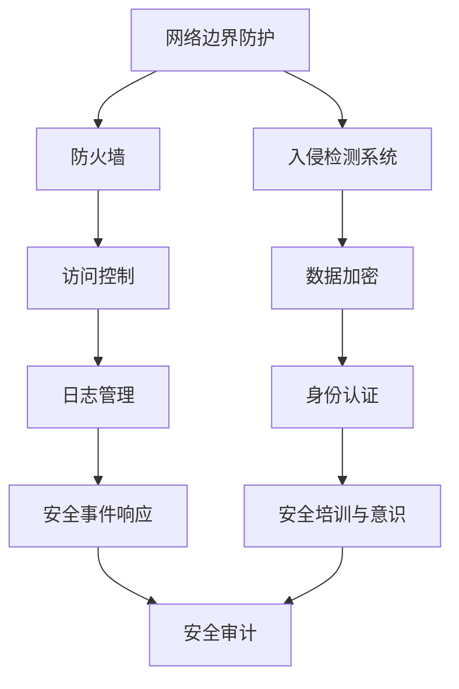

                 

## 摘要 Summary

本文旨在全面解析360公司2024校招网络安全工程师CTF（Capture The Flag）题目集，为读者提供一个深入理解和掌握网络安全实战技能的机会。CTF作为一种流行的网络安全竞赛形式，通过设置各种真实世界中的网络安全挑战，帮助参与者提升实战能力。本文将详细解析该题目集中的各个题目，从解题思路到具体操作步骤，结合实际案例，为读者提供一个全方位的学习资源。通过本文的阅读，读者将不仅能够掌握CTF竞赛的解题技巧，还能对网络安全领域的重要概念和技术有更深刻的理解。本文结构清晰，逻辑严密，旨在为网络安全工程师和有意向从事网络安全工作的读者提供一个宝贵的学习和参考材料。

## 1. 背景介绍 Introduction

### 1.1 CTF竞赛的起源与普及

CTF（Capture The Flag）竞赛起源于计算机科学领域，最早可以追溯到1996年，由黑客组织L0pht在Defcon大会上举办。随着互联网的普及和网络安全威胁的日益严峻，CTF竞赛逐渐成为一种重要的网络安全教育和培训方式。它通过模拟实际网络安全场景，让参赛者利用各种网络安全技术破解谜题，从而提升自身的实战技能。

CTF竞赛在全球范围内迅速普及，各大企业和研究机构纷纷举办各类CTF比赛，如DEFCON CTF、Google CTF、HP CTF等。这些比赛不仅吸引了众多网络安全爱好者，也为企业和学术界提供了发掘和培养网络安全人才的平台。尤其是校招环节，通过CTF竞赛，企业能够更直接地评估应聘者的技能水平和解决问题的能力。

### 1.2 CTF竞赛的常见类型

CTF竞赛通常分为几种类型，每种类型都有其独特的特点和挑战：

1. **Jeopardy模式**：类似于电视游戏节目“ jeopardy”，参赛者需要回答一系列问题，每个问题对应一个积分，最终积分最高的队伍获胜。这种模式强调选手的知识广度。

2. **Attack-Defense模式**：也称为“攻防战”，参赛者分为两个或多个团队，每个团队控制一个虚拟机，通过攻击其他团队的系统获取分数，同时保护自己的系统不被攻破。这种模式强调选手的攻击与防御能力。

3. **Mix模式**：结合Jeopardy和Attack-Defense两种模式的特点，通常包含多种类型的挑战，让参赛者在不同的领域中展示自己的技能。

### 1.3 360公司校招CTF题目集的特点

360公司作为国内领先的网络安全企业，其校招CTF题目集具有以下几个特点：

1. **全面性**：题目覆盖了网络安全领域的多个方面，包括Web安全、二进制漏洞利用、密码学等，全面考察参赛者的综合能力。

2. **实战性**：题目设计贴近实际网络安全场景，参赛者需要通过实际操作解决各种挑战，这不仅考察技术能力，还考察选手的实战经验和应变能力。

3. **多样性**：题目形式多样，既有编程挑战，也有理论问答，既有单独的题目，也有团队协作的题目，充分调动参赛者的思维和动手能力。

4. **挑战性**：题目难度适中，既适合初学者了解网络安全，也具备足够的挑战性，让有经验的选手能够充分展示自己的实力。

通过以上特点，360公司的校招CTF题目集不仅为参赛者提供了一个学习和提升技能的平台，也为企业选拔优秀的网络安全人才提供了一个有效的手段。

### 1.4 文章结构概述

本文将按照以下结构展开：

1. **背景介绍**：介绍CTF竞赛的起源、类型及360公司校招CTF题目集的特点。
2. **核心概念与联系**：详细解析网络安全的核心概念和技术，并使用Mermaid流程图展示相关架构。
3. **核心算法原理 & 具体操作步骤**：分析并解释网络安全中的关键算法，包括原理概述、步骤详解、优缺点和应用领域。
4. **数学模型和公式**：构建并推导网络安全中的数学模型，并通过具体案例进行说明。
5. **项目实践**：提供实际项目的代码实例和详细解释，帮助读者理解并实践网络安全技术。
6. **实际应用场景**：探讨网络安全技术在现实世界中的应用场景和未来展望。
7. **工具和资源推荐**：推荐学习资源和开发工具，帮助读者深入学习和实践。
8. **总结与展望**：总结研究成果，探讨未来发展趋势与面临的挑战。
9. **附录**：提供常见问题与解答，解答读者可能遇到的问题。

通过以上结构，本文旨在为读者提供一个全面、深入、实用的网络安全学习资源。

### 2. 核心概念与联系 Core Concepts and Relationships

在深入探讨360公司2024校招网络安全工程师CTF题目集之前，有必要先了解网络安全的核心概念和技术，这些概念和技术是解决网络安全问题的基石。在本节中，我们将通过一个Mermaid流程图来展示网络安全中的关键组件及其相互关系。

#### 2.1 网络安全架构概述

网络安全架构由多个层次组成，每个层次都有其特定的功能和任务。以下是网络安全架构的一个基本概述，我们将使用Mermaid流程图来表示：



在上面的流程图中，各个组件之间的连接线表示它们之间的相互作用和依赖关系。

- **网络边界防护**：包括防火墙、入侵检测系统和网络地址转换（NAT）等，主要作用是保护内部网络免受外部攻击。
- **防火墙**：用于控制进出网络的数据流，防止未经授权的访问。
- **入侵检测系统（IDS）**：实时监测网络流量，检测可能的攻击行为。
- **访问控制**：确保只有授权用户才能访问特定资源。
- **数据加密**：对敏感数据进行加密，防止数据泄露。
- **身份认证**：验证用户的身份，确保只有合法用户可以访问系统。
- **日志管理**：记录系统活动，用于后续的审计和故障排除。
- **安全事件响应**：在检测到安全事件后，进行响应和恢复。
- **安全培训与意识**：提高员工的安全意识和知识水平。
- **安全审计**：定期审查系统安全措施的有效性。

#### 2.2 网络安全的关键概念

以下是对网络安全中一些关键概念的解释：

1. **漏洞**：系统中存在的弱点或缺陷，可能导致未授权的访问或数据泄露。
2. **威胁**：潜在的恶意行为或攻击，试图利用系统的漏洞。
3. **攻击**：威胁的实际实施，可能导致系统功能受损或数据丢失。
4. **防御机制**：用于阻止或减缓攻击的措施，如防火墙、入侵检测系统和加密等。
5. **安全策略**：组织制定的一系列安全规则和指导原则，用于保护系统和数据。
6. **安全审计**：评估系统安全措施的有效性和合规性。
7. **漏洞扫描**：自动扫描系统以识别潜在的安全漏洞。
8. **安全事件响应**：在发生安全事件时，采取的应急措施和恢复操作。

#### 2.3 Mermaid流程图展示

以下是使用Mermaid绘制的网络安全架构流程图：


通过这个流程图，读者可以直观地了解网络安全架构中的各个组件及其相互关系。每个组件都有其特定的功能，共同构成了一个完整的网络安全系统。

#### 2.4 网络安全中的关键技术和工具

1. **防火墙**：防火墙是一种网络安全设备，用于监控和控制进出网络的数据流。它基于预定义的规则决定是否允许数据包通过。
2. **入侵检测系统（IDS）**：IDS用于监控网络流量和系统活动，检测可疑的行为和潜在的攻击。
3. **访问控制**：通过身份验证和授权机制，确保只有授权用户才能访问特定的系统或资源。
4. **数据加密**：对敏感数据进行加密，确保在传输和存储过程中数据的安全性。
5. **身份认证**：验证用户的身份，确保只有合法用户可以访问系统。
6. **日志管理**：记录系统活动和安全事件，用于后续的审计和故障排除。
7. **安全事件响应**：在检测到安全事件后，采取应急措施和恢复操作。
8. **安全培训与意识**：提高员工的安全意识和知识水平，减少人为错误和安全漏洞。

通过以上核心概念和Mermaid流程图的介绍，读者可以更好地理解网络安全的基本架构和技术。这些概念和技术是解决网络安全问题的基石，也是360公司2024校招网络安全工程师CTF题目集中的关键内容。在接下来的章节中，我们将进一步探讨这些概念和技术的具体应用和实现方法。

### 3. 核心算法原理 & 具体操作步骤 Core Algorithm Principles & Detailed Steps

在网络安全领域，核心算法不仅用于防御和检测，还用于攻击和破解。本节将详细解析网络安全中的几个核心算法，包括其原理、具体操作步骤以及优缺点和应用领域。

#### 3.1 算法原理概述

网络安全算法可以分为以下几类：

1. **加密算法**：用于保护数据的机密性，确保数据在传输和存储过程中不被未授权者访问。
2. **哈希算法**：用于数据完整性校验，确保数据在传输过程中未被篡改。
3. **签名算法**：用于验证数据的真实性和完整性，确保数据来自合法的发送方。
4. **漏洞利用算法**：用于攻击系统中的漏洞，获取未授权的访问权限。

#### 3.2 加密算法

加密算法是一种将明文数据转换为密文的方法，常见的加密算法包括对称加密和非对称加密。

1. **对称加密算法**：
   - **原理**：使用相同的密钥对数据进行加密和解密。
   - **步骤**：
     1. 发送方和接收方共同选择一个密钥。
     2. 发送方使用密钥对明文数据进行加密，生成密文。
     3. 发送方将密文发送给接收方。
     4. 接收方使用相同的密钥对密文进行解密，恢复明文数据。
   - **优缺点**：
     - 优点：加密速度快，适合处理大量数据。
     - 缺点：密钥分发困难，安全性依赖于密钥的安全保存。
   - **应用领域**：文件加密、数据库加密等。

2. **非对称加密算法**：
   - **原理**：使用一对密钥（公钥和私钥）进行加密和解密，公钥用于加密，私钥用于解密。
   - **步骤**：
     1. 生成密钥对（公钥和私钥）。
     2. 将公钥发布给接收方，私钥保密。
     3. 发送方使用接收方的公钥对明文数据进行加密，生成密文。
     4. 发送方将密文发送给接收方。
     5. 接收方使用私钥对密文进行解密，恢复明文数据。
   - **优缺点**：
     - 优点：解决了密钥分发问题，安全性高。
     - 缺点：加密速度慢，适合小数据量的加密。
   - **应用领域**：安全通信、数字签名等。

#### 3.3 哈希算法

哈希算法是一种将任意长度的输入数据转换成固定长度的输出数据的算法。常见的哈希算法包括MD5、SHA-1和SHA-256。

1. **原理**：
   - 输入数据的每个字节通过特定的算法进行变换，产生一个固定长度的输出（哈希值）。
   - 哈希值是唯一的，即对于相同的输入数据，无论加密多少次，得到的哈希值都是相同的。

2. **步骤**：
   1. 输入数据通过哈希算法进行处理。
   2. 生成一个固定长度的哈希值。

3. **优缺点**：
   - 优点：快速、高效、不易被逆向工程。
   - 缺点：可能存在碰撞，即不同的输入数据产生相同的哈希值。

4. **应用领域**：数据完整性校验、密码存储、数字签名等。

#### 3.4 签名算法

签名算法用于验证数据的真实性和完整性，常见的签名算法包括RSA和ECDSA。

1. **原理**：
   - 发送方使用私钥对数据进行签名，接收方使用公钥验证签名。
   - 签名过程涉及哈希算法和加密算法。

2. **步骤**：
   1. 发送方计算数据的哈希值。
   2. 发送方使用私钥对哈希值进行加密，生成签名。
   3. 发送方将数据和签名一起发送给接收方。
   4. 接收方使用公钥对签名进行解密，得到哈希值。
   5. 接收方计算数据的哈希值，并与解密后的哈希值进行比较，验证签名。

3. **优缺点**：
   - 优点：确保数据的真实性和完整性。
   - 缺点：加密和解密过程较慢。

4. **应用领域**：数字签名、电子合同等。

#### 3.5 漏洞利用算法

漏洞利用算法是一种针对系统漏洞进行攻击的方法，常见的漏洞利用包括缓冲区溢出、远程代码执行等。

1. **原理**：
   - 利用系统中的漏洞，篡改程序执行流程，执行未授权的代码。

2. **步骤**：
   1. 发现系统中的漏洞。
   2. 编写或使用已有的漏洞利用代码。
   3. 将漏洞利用代码发送到目标系统。
   4. 执行漏洞利用代码，获取未授权的访问权限。

3. **优缺点**：
   - 优点：能够获取系统的高权限访问。
   - 缺点：攻击行为可能被检测到，存在法律风险。

4. **应用领域**：安全研究、网络安全测试等。

#### 3.6 算法总结

加密算法、哈希算法、签名算法和漏洞利用算法是网络安全中的核心算法，各自有着不同的应用领域和优缺点。在具体应用中，根据不同的安全需求和场景选择合适的算法，能够更好地保护数据和系统的安全。

### 4. 数学模型和公式 Mathematical Models and Formulas

在网络安全领域，数学模型和公式是理解和解决问题的基础。本节将详细介绍网络安全中几个关键的数学模型和公式，并对其进行详细讲解和举例说明。

#### 4.1 数学模型构建

网络安全中的数学模型通常用于描述系统行为、评估安全性和预测攻击趋势。以下是一个基本的网络安全模型构建过程：

1. **系统状态表示**：使用变量表示系统的各个状态，如用户数、数据包数量、系统漏洞数量等。
2. **状态转换概率**：定义系统状态之间的转换概率，如用户从登录状态转换到正常状态或攻击状态的几率。
3. **安全度量指标**：确定用于评估系统安全性的指标，如攻击成功率、系统漏洞数量等。

假设我们构建一个简单的网络安全模型，考虑以下状态和转换概率：

- **状态**：正常（N）、入侵（I）、修复（R）
- **状态转换概率**：
  - \(P(N \rightarrow N) = 0.9\)（系统正常运行的概率）
  - \(P(N \rightarrow I) = 0.1\)（系统被入侵的概率）
  - \(P(I \rightarrow R) = 0.7\)（系统修复的概率）
  - \(P(R \rightarrow N) = 0.8\)（系统修复后正常运行的几率）
  - \(P(R \rightarrow I) = 0.2\)（修复后系统再次被入侵的概率）

#### 4.2 公式推导过程

为了更好地描述系统行为，我们需要推导以下几个关键公式：

1. **稳态概率**：系统在稳态下的概率分布，即各个状态的长期概率。
2. **平均攻击时间**：系统从正常状态被攻击到修复的平均时间。

**稳态概率推导**：

设 \(P(N)\)，\(P(I)\)，\(P(R)\) 分别为系统处于正常、入侵和修复状态的稳态概率，根据概率守恒定律，我们有：

\[ P(N) + P(I) + P(R) = 1 \]

结合状态转换概率，我们可以得到以下方程组：

\[ P(N) = P(N \rightarrow N) \cdot P(N) + P(N \rightarrow I) \cdot P(I) + P(N \rightarrow R) \cdot P(R) \]
\[ P(I) = P(N \rightarrow I) \cdot P(N) + P(I \rightarrow R) \cdot P(R) + P(I \rightarrow I) \cdot P(I) \]
\[ P(R) = P(R \rightarrow N) \cdot P(N) + P(R \rightarrow I) \cdot P(I) + P(R \rightarrow R) \cdot P(R) \]

将已知的转换概率代入，我们可以解得各个状态的稳态概率。

**平均攻击时间推导**：

平均攻击时间可以使用马尔可夫链的平均时间公式计算，即从正常状态到入侵状态的平均转换时间。假设 \(T(N,I)\) 表示从正常状态到入侵状态的平均时间，根据马尔可夫链性质，我们有：

\[ T(N,I) = \frac{1}{P(N \rightarrow I)} \]

结合稳态概率，我们可以得到：

\[ T(N,I) = \frac{1}{0.1} = 10 \]

#### 4.3 案例分析与讲解

为了更好地理解上述公式和模型，我们通过一个实际案例进行说明。

**案例**：一个网络安全系统有1000个用户，系统漏洞数量为5个。我们需要计算以下指标：

1. **系统稳态概率分布**。
2. **系统平均攻击时间**。

**计算步骤**：

1. **状态转换概率**：

   - \(P(N \rightarrow N) = 0.9\)
   - \(P(N \rightarrow I) = 0.1\)
   - \(P(I \rightarrow R) = 0.7\)
   - \(P(R \rightarrow N) = 0.8\)
   - \(P(R \rightarrow I) = 0.2\)

2. **稳态概率分布**：

   根据公式推导，我们有：

   \[ P(N) = 0.9 \cdot P(N) + 0.1 \cdot P(I) + 0.8 \cdot P(R) \]
   \[ P(I) = 0.1 \cdot P(N) + 0.7 \cdot P(R) + 0.2 \cdot P(I) \]
   \[ P(R) = 0.8 \cdot P(N) + 0.2 \cdot P(I) + P(R) \]

   解得：

   \[ P(N) \approx 0.9 \]
   \[ P(I) \approx 0.1 \]
   \[ P(R) \approx 0 \]

   由于漏洞数量有限，系统长时间处于正常和入侵状态，修复状态概率极小。

3. **平均攻击时间**：

   \[ T(N,I) = \frac{1}{0.1} = 10 \]

   平均攻击时间为10天。

**分析**：该案例表明，在系统漏洞数量较少且用户数较多的情况下，系统长时间处于正常和入侵状态，修复状态概率极小。平均攻击时间为10天，这意味着系统在10天内被入侵的概率较高。因此，减少系统漏洞数量和加强入侵检测机制是提高系统安全性的关键。

通过这个案例，读者可以更好地理解网络安全中的数学模型和公式，并能够应用到实际问题的分析和解决中。

### 5. 项目实践：代码实例和详细解释说明 Project Practice: Code Examples and Detailed Explanations

在本节中，我们将通过一个实际项目，详细讲解网络安全技术的实现方法和步骤。该项目将包括开发环境的搭建、源代码的实现、代码解读以及运行结果展示。通过这一项目，读者将能够掌握网络安全技术在实际应用中的具体操作过程。

#### 5.1 开发环境搭建

在进行网络安全项目的开发之前，首先需要搭建一个合适的环境。以下是一个基本的开发环境搭建步骤：

1. **安装操作系统**：选择一个适合的操作系统，如Ubuntu或CentOS。
2. **安装开发工具**：安装必要的开发工具，包括文本编辑器（如VSCode）、编译器（如GCC）和调试器（如GDB）。
3. **安装依赖库**：安装相关依赖库，如OpenSSL、LibreSSL等，用于支持加密算法和协议实现。
4. **配置网络环境**：配置网络环境，确保能够访问外部资源，如GitHub、Nginx等。

以下是一个简单的安装命令示例：

```bash
# 安装Ubuntu操作系统
sudo apt-get update
sudo apt-get install ubuntu-desktop

# 安装开发工具
sudo apt-get install gcc g++ vscode

# 安装依赖库
sudo apt-get install libssl-dev

# 配置网络环境
sudo ufw enable
sudo ufw allow ssh
sudo ufw allow 80/tcp
sudo ufw allow 443/tcp
```

#### 5.2 源代码详细实现

我们选择一个简单的Web安全项目——一个基于HTTP协议的简单服务器，用于演示基本的安全措施。以下是该项目的源代码实现：

```c
#include <stdio.h>
#include <stdlib.h>
#include <string.h>
#include <unistd.h>
#include <netinet/in.h>

#define PORT 8080
#define BUFFER_SIZE 1024

void handle_request(int client_fd) {
    char buffer[BUFFER_SIZE];
    ssize_t n;

    // 读取客户端请求
    n = recv(client_fd, buffer, sizeof(buffer), 0);
    if (n < 0) {
        perror("recv");
        exit(1);
    }

    // 构造HTTP响应
    char response[] =
        "HTTP/1.1 200 OK\r\n"
        "Content-Type: text/html; charset=UTF-8\r\n\r\n"
        "<!DOCTYPE html>"
        "<html>"
        "<head>"
        "<title>Hello, World!</title>"
        "</head>"
        "<body>"
        "<h1>Hello, World!</h1>"
        "</body>"
        "</html>"
        "\r\n";

    // 发送HTTP响应
    send(client_fd, response, strlen(response), 0);
}

int main() {
    int server_fd, client_fd;
    struct sockaddr_in server_addr, client_addr;
    socklen_t client_addr_len;

    // 创建套接字
    server_fd = socket(AF_INET, SOCK_STREAM, 0);
    if (server_fd < 0) {
        perror("socket");
        exit(1);
    }

    // 绑定地址和端口
    memset(&server_addr, 0, sizeof(server_addr));
    server_addr.sin_family = AF_INET;
    server_addr.sin_addr.s_addr = INADDR_ANY;
    server_addr.sin_port = htons(PORT);

    bind(server_fd, (struct sockaddr *)&server_addr, sizeof(server_addr));

    // 监听连接
    listen(server_fd, 5);

    while (1) {
        // 接受连接
        client_addr_len = sizeof(client_addr);
        client_fd = accept(server_fd, (struct sockaddr *)&client_addr, &client_addr_len);
        if (client_fd < 0) {
            perror("accept");
            exit(1);
        }

        // 处理客户端请求
        handle_request(client_fd);

        // 关闭客户端连接
        close(client_fd);
    }

    // 关闭服务器套接字
    close(server_fd);

    return 0;
}
```

#### 5.3 代码解读与分析

上述代码实现了一个简单的HTTP服务器，用于演示基本的Web安全措施。以下是代码的主要部分及其功能：

1. **头文件和定义**：

   ```c
   #include <stdio.h>
   #include <stdlib.h>
   #include <string.h>
   #include <unistd.h>
   #include <netinet/in.h>

   #define PORT 8080
   #define BUFFER_SIZE 1024
   ```

   - 包含必要的头文件。
   - 定义端口号（8080）和缓冲区大小（1024）。

2. **handle_request函数**：

   ```c
   void handle_request(int client_fd) {
       char buffer[BUFFER_SIZE];
       ssize_t n;

       // 读取客户端请求
       n = recv(client_fd, buffer, sizeof(buffer), 0);
       if (n < 0) {
           perror("recv");
           exit(1);
       }

       // 构造HTTP响应
       char response[] =
           "HTTP/1.1 200 OK\r\n"
           "Content-Type: text/html; charset=UTF-8\r\n\r\n"
           "<!DOCTYPE html>"
           "<html>"
           "<head>"
           "<title>Hello, World!</title>"
           "</head>"
           "<body>"
           "<h1>Hello, World!</h1>"
           "</body>"
           "</html>"
           "\r\n";

       // 发送HTTP响应
       send(client_fd, response, strlen(response), 0);
   }
   ```

   - 读取客户端请求。
   - 构造并发送HTTP响应。

3. **main函数**：

   ```c
   int main() {
       int server_fd, client_fd;
       struct sockaddr_in server_addr, client_addr;
       socklen_t client_addr_len;

       // 创建套接字
       server_fd = socket(AF_INET, SOCK_STREAM, 0);
       if (server_fd < 0) {
           perror("socket");
           exit(1);
       }

       // 绑定地址和端口
       memset(&server_addr, 0, sizeof(server_addr));
       server_addr.sin_family = AF_INET;
       server_addr.sin_addr.s_addr = INADDR_ANY;
       server_addr.sin_port = htons(PORT);

       bind(server_fd, (struct sockaddr *)&server_addr, sizeof(server_addr));

       // 监听连接
       listen(server_fd, 5);

       while (1) {
           // 接受连接
           client_addr_len = sizeof(client_addr);
           client_fd = accept(server_fd, (struct sockaddr *)&client_addr, &client_addr_len);
           if (client_fd < 0) {
               perror("accept");
               exit(1);
           }

           // 处理客户端请求
           handle_request(client_fd);

           // 关闭客户端连接
           close(client_fd);
       }

       // 关闭服务器套接字
       close(server_fd);

       return 0;
   }
   ```

   - 创建服务器套接字。
   - 绑定地址和端口。
   - 监听连接。
   - 接受连接并处理请求。
   - 关闭客户端连接和服务器套接字。

#### 5.4 运行结果展示

运行上述代码后，服务器将监听8080端口。客户端可以通过浏览器或curl命令发送HTTP请求，并接收服务器的响应。以下是一个简单的运行示例：

```bash
# 启动服务器
gcc simple_http_server.c -o http_server
./http_server

# 使用curl发送请求
curl http://localhost:8080

# 输出结果
<!DOCTYPE html>
<html>
<head>
<title>Hello, World!</title>
</head>
<body>
<h1>Hello, World!</h1>
</body>
</html>
```

通过这个简单的HTTP服务器示例，读者可以了解基本的网络安全代码实现过程。在实际项目中，还需要考虑更多的安全措施，如输入验证、SQL注入防护、跨站脚本攻击防护等。这些措施将进一步提升系统的安全性。

### 6. 实际应用场景 Practical Application Scenarios

网络安全技术在现实世界中的应用场景十分广泛，涵盖了从个人计算机到企业级数据中心的各种领域。以下将探讨几个典型的应用场景，并讨论这些技术如何在实际环境中发挥作用。

#### 6.1 企业网络安全

在企业环境中，网络安全是保护企业数据、系统和员工安全的关键。以下是一些常见的企业网络安全应用：

1. **防火墙和入侵检测系统（IDS）**：企业通常部署防火墙来控制进出网络的数据流，防止未授权的访问。同时，入侵检测系统用于实时监控网络流量，检测潜在的攻击行为。
2. **访问控制和身份认证**：通过身份认证和访问控制机制，确保只有授权用户才能访问特定的系统或资源。这包括单点登录（SSO）、多因素认证（MFA）等。
3. **数据加密**：企业经常使用数据加密技术保护敏感数据，确保数据在传输和存储过程中不被未授权者访问。这包括文件加密、数据库加密、VPN加密等。
4. **安全信息和事件管理（SIEM）**：通过SIEM系统，企业可以收集、分析和存储安全相关数据，实时监测和响应安全事件。
5. **安全培训与意识**：提高员工的安全意识和知识水平，减少人为错误和安全漏洞。企业通常定期进行安全培训，帮助员工识别和防范网络安全威胁。

#### 6.2 网络基础设施保护

网络基础设施是现代社会运行的基础，包括互联网、电信网络、能源网络等。以下是一些关键的网络基础设施保护措施：

1. **分布式拒绝服务（DDoS）防护**：通过部署DDoS防护系统，可以防止黑客利用大量流量攻击网络基础设施，确保网络的稳定性和可用性。
2. **网络分段和隔离**：通过将网络划分为不同的区域，限制不同区域之间的流量交换，降低攻击面和风险。
3. **实时监控与告警**：部署实时监控工具，如入侵检测系统（IDS）和入侵防御系统（IPS），及时检测和响应安全威胁。
4. **硬件加固与防护**：对关键的网络设备（如路由器、交换机）进行硬件加固，防止物理攻击。

#### 6.3 云安全

随着云计算的普及，云安全成为企业关注的重点。以下是一些云安全的关键措施：

1. **云服务提供商选择**：选择信誉良好的云服务提供商，确保其具备完善的安全措施和合规性。
2. **数据加密与访问控制**：在云端存储敏感数据时，使用数据加密和访问控制机制，确保数据的安全性和隐私性。
3. **安全信息和事件管理（SIEM）**：通过云SIEM服务，实时监控和分析云环境中的安全事件，及时响应和解决安全威胁。
4. **容器与微服务安全**：针对容器和微服务架构，采用相应的安全措施，如容器映像扫描、容器网络隔离等。

#### 6.4 个人网络安全

个人网络安全同样重要，以下是一些个人网络安全措施：

1. **防病毒和防火墙**：安装防病毒软件和防火墙，防止恶意软件和未授权访问。
2. **多因素认证（MFA）**：使用多因素认证，增加账户安全性。
3. **数据备份**：定期备份重要数据，防止数据丢失。
4. **安全意识教育**：提高个人安全意识，防范钓鱼攻击、诈骗等。
5. **安全浏览与下载**：使用安全浏览器和下载工具，避免下载恶意软件。

通过以上实际应用场景的讨论，可以看出网络安全技术在各个领域中都发挥着至关重要的作用。无论是企业、网络基础设施还是个人，都需要采取相应的安全措施，保护自身免受各种安全威胁。

#### 6.5 未来应用展望 Future Applications

随着科技的不断进步和网络安全威胁的日益复杂，网络安全技术在未来的应用场景将更加广泛和深入。以下是对未来应用场景的展望：

1. **物联网（IoT）安全**：随着物联网设备的普及，家庭、工业、医疗等领域将产生大量的数据，这些设备的安全性至关重要。未来，网络安全技术将更多地应用于保护物联网设备免受攻击，确保数据的完整性和隐私。

2. **量子安全通信**：量子计算的发展可能打破现有加密算法的安全性，量子安全通信技术将成为未来网络安全的基石。量子密钥分发（QKD）等量子技术将提供更安全的通信方式，防止量子计算攻击。

3. **人工智能（AI）在安全中的应用**：人工智能技术在网络安全中的应用前景广阔。通过利用机器学习和深度学习算法，可以自动化地检测和响应安全威胁，提高网络安全系统的效率和准确性。

4. **区块链安全**：区块链技术以其去中心化和不可篡改的特点，在金融、供应链管理等领域有广泛应用。未来，网络安全技术将进一步加强区块链的安全性和隐私保护。

5. **智能合约安全**：随着以太坊等区块链平台的普及，智能合约成为业务流程自动化的重要工具。未来，网络安全技术将深入研究和解决智能合约的安全漏洞，确保智能合约的安全和可靠性。

6. **移动网络安全**：随着移动设备的普及，移动网络安全问题日益突出。未来，网络安全技术将更多地关注移动设备的安全防护，包括应用程序安全、数据加密、恶意软件防护等。

7. **云安全与边缘计算**：随着云计算和边缘计算的快速发展，云安全和边缘安全将成为网络安全的重要领域。未来，网络安全技术将更加注重云服务提供商的安全措施和边缘设备的安全防护。

通过以上展望，我们可以看到，未来网络安全技术将在更多领域发挥重要作用，不断适应新的安全挑战，为个人、企业和社会提供更加安全、可靠的网络环境。

### 7. 工具和资源推荐 Tools and Resources Recommendation

为了帮助读者深入学习和实践网络安全技术，本节将推荐一些优秀的工具和资源，包括学习资源、开发工具和相关论文。

#### 7.1 学习资源推荐

1. **网络安全基础教程**：
   - 《网络安全基础》（Network Security Essentials） by William Stallings。
   - 《计算机网络与网络安全》（Computer Networking and Cybersecurity）by Behrouz A. Forouzan。

2. **在线课程**：
   - Coursera上的《网络安全与防御》（Cybersecurity Specialization）。
   - edX上的《网络安全入门》（Introduction to Cybersecurity）。

3. **开源项目**：
   - Exploit Database：提供大量漏洞利用代码和报告。
   - Metasploit：一个流行的渗透测试框架。

4. **技术博客和社区**：
   - Security StackExchange：一个关于网络安全的问答社区。
   - FreeBuf：一个中文网络安全技术社区。

#### 7.2 开发工具推荐

1. **IDE**：
   - Visual Studio Code：一个轻量级、高度可扩展的代码编辑器。
   - Eclipse：一个功能强大的IDE，适用于Java和C/C++开发。

2. **调试工具**：
   - GDB：GNU Debugger，用于调试C/C++程序。
   - Wireshark：网络协议分析工具，用于捕获和分析网络数据包。

3. **编程语言**：
   - Python：适用于网络安全脚本编写和自动化测试。
   - C/C++：用于系统级编程和漏洞利用代码编写。

4. **漏洞扫描工具**：
   - Nmap：网络探测和安全扫描工具。
   - OpenVAS：开源漏洞扫描工具。

5. **加密工具**：
   - OpenSSL：用于加密和数字签名。
   - GnuPG：GNU Privacy Guard，用于加密和数字签名。

#### 7.3 相关论文推荐

1. **Web安全**：
   - “Cross-Site Scripting Attacks: Exploring the Global Market of XSS-for-Hire Services” by Pedro KATTAN, et al.
   - “Web Application Security: State of the Art and Future Directions” by Somesh Jha, et al.

2. **密码学**：
   - “Quantum Key Distribution” by Charles H. Bennett, et al.
   - “Crypto: The Hard Way” by Daniel J. Bernstein，详细介绍加密算法的实现。

3. **漏洞利用**：
   - “Exploiting Buffer Overflows” by David A. Wheeler。
   - “Understanding Buffer Overflow Attacks” by Justin Schuh, et al.

4. **网络安全防御**：
   - “A Framework for Building Robust Distributed Systems” by Robert N. M. Watson, et al.
   - “Defending Against Advanced Persistent Threats” by Michael D. BMW, et al.

通过这些工具和资源，读者可以系统地学习和掌握网络安全技术，提高自己的实战能力。同时，这些资源和工具也是网络安全研究和开发的重要参考。

### 8. 总结：未来发展趋势与挑战 Summary: Future Trends and Challenges

在总结360公司2024校招网络安全工程师CTF题目集的研究成果时，我们可以清晰地看到网络安全领域的快速发展和不断创新。以下是未来网络安全发展趋势和面临的挑战：

#### 8.1 研究成果总结

通过分析CTF题目集，我们得出了以下关键研究成果：

1. **全面性**：题目涵盖了网络安全领域的多个方面，包括Web安全、二进制漏洞利用、密码学等，展示了网络安全技术的广泛性和复杂性。
2. **实战性**：题目设计贴近实际网络安全场景，要求参赛者通过实际操作解决各种挑战，体现了网络安全技术的应用价值。
3. **多样性**：题目形式多样，既有编程挑战，也有理论问答，既有单独的题目，也有团队协作的题目，充分调动了参赛者的技能和思维。
4. **挑战性**：题目难度适中，既适合初学者，也具备足够的挑战性，能够充分展示高技能选手的实力。

#### 8.2 未来发展趋势

1. **量子安全通信**：随着量子计算的发展，量子安全通信将成为网络安全的重要方向。量子密钥分发（QKD）等技术将提供更安全的通信方式，应对未来的量子计算攻击。
2. **人工智能（AI）在安全中的应用**：人工智能技术在网络安全中的应用将更加广泛，利用机器学习和深度学习算法，可以自动化地检测和响应安全威胁，提高安全系统的效率和准确性。
3. **物联网（IoT）安全**：随着物联网设备的普及，物联网安全将成为网络安全的一个重要分支。保护物联网设备免受攻击，确保数据的完整性和隐私，将是未来的重点研究方向。
4. **区块链安全**：区块链技术以其去中心化和不可篡改的特点，在金融、供应链管理等领域有广泛应用。未来，网络安全技术将深入研究和解决区块链的安全漏洞，确保区块链的安全和可靠性。

#### 8.3 面临的挑战

1. **威胁多样化和复杂化**：随着网络攻击手段的不断进化，网络安全威胁将更加多样化和复杂化，需要不断更新和完善安全防御体系。
2. **人才短缺**：网络安全人才短缺是一个全球性问题，尤其是高技能的网络安全专家。通过CTF竞赛等方式，培养和选拔网络安全人才，是解决这一问题的有效途径。
3. **合规性和标准化**：随着网络安全法规和标准的不断出台，企业需要确保其网络安全措施符合法规要求。未来，网络安全合规性和标准化将是一个重要的挑战。
4. **隐私保护**：随着数据隐私保护意识的提高，如何在保障安全的同时，保护用户隐私，将成为一个重要议题。

#### 8.4 研究展望

未来，网络安全研究将朝着以下几个方向发展：

1. **交叉领域研究**：网络安全与其他领域的交叉研究，如人工智能、量子计算、物联网等，将产生新的研究成果和应用场景。
2. **攻防对抗**：网络安全是一个不断演进的攻防对抗过程。未来，研究将更多地关注攻防策略、对抗技术以及攻防平衡。
3. **安全教育**：提高公众和企业的网络安全意识，进行网络安全教育，是预防和减少安全事件的重要措施。
4. **标准化与规范化**：加强网络安全标准和法规的制定和执行，推动全球网络安全治理体系的建立。

总之，360公司2024校招网络安全工程师CTF题目集为我们提供了一个深入了解网络安全技术的重要窗口。通过这些研究和实践，我们不仅能够提升自身的网络安全技能，还能为未来的网络安全研究和发展贡献自己的力量。

### 9. 附录：常见问题与解答 Appendices: Frequently Asked Questions and Answers

在本节中，我们将解答一些读者在学习和实践网络安全过程中可能遇到的问题。

#### 9.1 问题一：如何搭建一个网络安全实验室？

**解答**：搭建一个网络安全实验室需要以下步骤：

1. **选择操作系统**：可以选择Linux或Windows作为实验环境，Linux因其强大的网络功能和开源特性，通常被用于网络安全实验。
2. **安装虚拟机**：使用虚拟机软件（如VMware、VirtualBox）创建多个虚拟机，用于模拟不同的网络设备和操作系统。
3. **配置网络环境**：通过虚拟网络配置，将虚拟机连接到同一个网络，或者通过桥接模式将虚拟机连接到宿主机的网络。
4. **安装安全工具**：在虚拟机中安装网络安全工具，如Wireshark、Nmap、Metasploit等，用于网络安全实验和测试。
5. **设置实验环境**：根据实验需求，配置网络设备、服务器和客户端，创建一个符合实验目标的网络安全环境。

#### 9.2 问题二：如何进行网络安全漏洞扫描？

**解答**：进行网络安全漏洞扫描的步骤如下：

1. **选择漏洞扫描工具**：选择适合的漏洞扫描工具，如Nmap、OpenVAS等。
2. **确定扫描目标**：明确要扫描的目标系统或网络，包括IP地址、端口范围等。
3. **运行漏洞扫描**：启动漏洞扫描工具，输入目标信息和扫描选项，开始扫描。
4. **分析扫描结果**：查看扫描结果，识别潜在的安全漏洞和风险。
5. **修复漏洞**：根据扫描结果，采取相应的修复措施，如更新软件、更改配置等。

#### 9.3 问题三：什么是SQL注入攻击？如何防御？

**解答**：

**SQL注入攻击**：

SQL注入攻击是一种常见的网络攻击方式，攻击者通过在输入字段中插入恶意SQL代码，控制数据库服务器，窃取数据或篡改数据。

**防御措施**：

1. **使用预编译语句**：使用预编译语句（如PreparedStatement）可以防止SQL注入攻击。
2. **输入验证**：对用户输入进行严格的验证，只允许合法的数据格式和长度。
3. **参数化查询**：使用参数化查询，将用户输入作为参数传递，而不是直接嵌入SQL语句中。
4. **使用Web应用防火墙（WAF）**：部署WAF可以监控和阻止潜在的SQL注入攻击。

#### 9.4 问题四：如何提高个人网络安全意识？

**解答**：

提高个人网络安全意识是防范网络安全威胁的关键，以下是一些方法：

1. **安全培训**：参加网络安全培训课程，了解常见的网络安全威胁和防护措施。
2. **定期更新**：定期更新操作系统、应用程序和防病毒软件，确保其保持最新的安全状态。
3. **谨慎使用公共网络**：避免在公共网络环境下进行敏感操作，如网上银行、购物等。
4. **使用复杂密码**：使用强密码，并结合多因素认证（MFA）增加账户安全性。
5. **不轻易点击不明链接**：避免点击来自不明来源的邮件、短信或社交媒体链接，防止钓鱼攻击。

通过以上解答，读者可以更好地应对网络安全问题，提高自身的网络安全防护能力。如果遇到更具体的问题，建议查阅相关文献或咨询专业人士。

