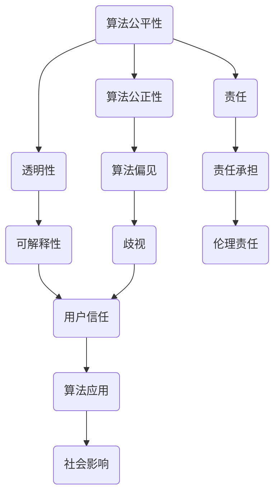

                 

关键词：计算伦理、算法公平、公正性、可持续性、人工智能、透明性、责任

> 摘要：本文深入探讨了计算伦理在人工智能时代的紧迫性，强调了公平、公正和可持续性的重要性。通过分析算法的公平性问题，本文提出了透明性和责任在人工智能发展中的关键作用，并展望了未来伦理挑战和解决方案。

## 1. 背景介绍

随着计算机科学的飞速发展，人工智能（AI）已经成为现代社会不可或缺的一部分。从自动驾驶汽车到智能语音助手，AI技术正深刻改变我们的生活方式。然而，随着技术的进步，新的伦理问题也应运而生，尤其是在算法的公平性和公正性方面。算法的决策过程往往被黑箱化，使得人们难以理解其背后的逻辑，这引发了关于算法偏见和歧视的担忧。同时，AI技术的快速发展也带来了数据隐私和安全的挑战，使得“可持续性”成为了一个不可忽视的议题。

本文旨在探讨计算伦理在人工智能时代的紧迫性，分析算法公平、公正和可持续性的重要性，并提出相应的解决方案。本文的结构如下：

- **背景介绍**：简要介绍计算伦理在人工智能时代的背景和重要性。
- **核心概念与联系**：阐述计算伦理的核心概念，并使用 Mermaid 流程图展示其联系。
- **核心算法原理 & 具体操作步骤**：分析算法的公平性问题，并提供解决方案。
- **数学模型和公式 & 详细讲解 & 举例说明**：介绍相关的数学模型和公式，并提供实际应用案例。
- **项目实践：代码实例和详细解释说明**：展示一个实际的项目案例，并详细解释其实现过程。
- **实际应用场景**：讨论算法公平性在现实世界中的应用场景。
- **未来应用展望**：展望算法公平性在未来的发展。
- **工具和资源推荐**：推荐相关的学习资源和开发工具。
- **总结：未来发展趋势与挑战**：总结研究成果，并提出未来展望。
- **附录：常见问题与解答**：回答一些常见的问题。

## 2. 核心概念与联系

### 2.1. 算法的公平性

算法的公平性是指算法在决策过程中对各个群体的公平对待程度。一个公平的算法应该避免对任何特定群体产生偏见或歧视。然而，现实中，算法的决策过程往往涉及到大量的数据，这些数据可能包含历史偏见，从而导致算法的偏见。例如，一个招聘算法可能因为历史数据的偏见而对某个性别或种族的应聘者产生歧视。

### 2.2. 算法的公正性

算法的公正性是指算法在决策过程中的透明性和可解释性。一个公正的算法应该能够让用户理解其决策过程和依据。然而，许多现代的机器学习算法，尤其是深度学习算法，其决策过程往往是黑箱化的，这使得用户难以理解其决策逻辑。这种缺乏透明性的算法可能会导致用户对算法的不信任，从而影响算法的实际应用。

### 2.3. 透明性

透明性是指算法决策过程的可见性和可解释性。一个透明的算法应该能够让用户理解其决策过程和依据。为了实现透明性，研究者们提出了多种方法，如决策树、线性回归等，这些方法相对于深度学习算法来说更容易解释。

### 2.4. 责任

责任是指算法开发者和使用者对算法决策结果的责任承担。一个负责任的算法应该能够在决策错误时迅速纠正，并承担相应的责任。然而，当前关于算法责任的规定和标准尚不明确，这给算法的伦理发展带来了挑战。

### 2.5. Mermaid 流程图

以下是一个 Mermaid 流程图，展示了计算伦理的核心概念及其联系：



## 3. 核心算法原理 & 具体操作步骤

### 3.1. 算法原理概述

为了解决算法的公平性和公正性问题，研究者们提出了多种算法，如公平学习算法、可解释性算法等。这些算法的核心思想是通过调整算法的参数或引入额外的约束条件，使得算法在决策过程中对各个群体更加公平和公正。

### 3.2. 算法步骤详解

#### 3.2.1. 公平学习算法

公平学习算法的主要思路是通过对训练数据集进行预处理，消除数据中的偏见。具体步骤如下：

1. **数据预处理**：对训练数据集进行预处理，消除数据中的历史偏见。例如，可以使用统计方法来识别和纠正数据中的性别或种族偏见。
2. **模型训练**：使用预处理后的数据集训练模型。在这个过程中，可以使用损失函数来引导模型学习到公平的决策规则。
3. **模型评估**：对训练好的模型进行评估，确保模型在各个群体上的性能一致。

#### 3.2.2. 可解释性算法

可解释性算法的主要思路是提高算法的透明性，使得用户能够理解算法的决策过程。具体步骤如下：

1. **模型选择**：选择具有可解释性的模型，如决策树、线性回归等。
2. **模型训练**：使用训练数据集训练模型，并记录模型的学习过程。
3. **模型解释**：使用可视化工具，如决策树可视化、特征重要性分析等，解释模型的决策过程。

### 3.3. 算法优缺点

#### 3.3.1. 公平学习算法

**优点**：能够有效消除数据中的历史偏见，提高算法的公平性。

**缺点**：对训练数据的要求较高，需要大量无偏见的数据进行训练。

#### 3.3.2. 可解释性算法

**优点**：提高了算法的透明性，增强了用户的信任。

**缺点**：相对于深度学习等复杂算法，可解释性算法的性能可能有所下降。

### 3.4. 算法应用领域

公平学习算法和可解释性算法广泛应用于金融、医疗、招聘等领域。例如，在金融领域，公平学习算法可以帮助银行在贷款审批中消除种族或性别的偏见；在医疗领域，可解释性算法可以帮助医生理解医疗决策的依据。

## 4. 数学模型和公式 & 详细讲解 & 举例说明

### 4.1. 数学模型构建

为了解决算法的公平性和公正性问题，研究者们提出了一系列数学模型。以下是一个简单的公平性度量模型：

$$
F = \frac{1}{n}\sum_{i=1}^{n} f(x_i, y_i)
$$

其中，$x_i$ 和 $y_i$ 分别代表输入和输出，$f(x_i, y_i)$ 是公平性函数，$n$ 是样本数量。

### 4.2. 公式推导过程

为了推导公平性函数 $f(x_i, y_i)$，我们首先定义以下几个参数：

- $p_i$：第 $i$ 个样本的预测概率。
- $g_i$：第 $i$ 个样本的实际标签。
- $\beta$：调节参数，用于平衡公平性和准确性。

然后，我们可以定义公平性函数为：

$$
f(x_i, y_i) = \frac{1}{2} \left( p_i (1 - g_i) + (1 - p_i) g_i \right) + \beta \left( p_i - \frac{1}{2} \right)
$$

### 4.3. 案例分析与讲解

假设我们有一个简单的二分类问题，需要预测每个样本属于正类或负类的概率。以下是一个具体的例子：

| 样本编号 | 输入 $x_i$ | 输出 $y_i$ | 预测概率 $p_i$ |
| -------- | ---------- | ---------- | -------------- |
| 1        | 0.5        | 1          | 0.7            |
| 2        | 0.6        | 0          | 0.3            |
| 3        | 0.7        | 1          | 0.9            |
| 4        | 0.8        | 0          | 0.1            |

我们可以使用上述公式计算每个样本的公平性得分：

$$
f(1, 1) = \frac{1}{2} \left( 0.7 \times 0 + 0.3 \times 1 \right) + \beta \left( 0.7 - 0.5 \right) = 0.05 + 0.2\beta
$$

$$
f(2, 0) = \frac{1}{2} \left( 0.3 \times 1 + 0.7 \times 0 \right) + \beta \left( 0.3 - 0.5 \right) = 0.05 - 0.2\beta
$$

$$
f(3, 1) = \frac{1}{2} \left( 0.9 \times 1 + 0.1 \times 0 \right) + \beta \left( 0.9 - 0.5 \right) = 0.05 + 0.4\beta
$$

$$
f(4, 0) = \frac{1}{2} \left( 0.1 \times 1 + 0.9 \times 0 \right) + \beta \left( 0.1 - 0.5 \right) = 0.05 - 0.4\beta
$$

通过调整 $\beta$ 的值，我们可以平衡公平性和准确性。例如，当 $\beta = 0.5$ 时，每个样本的公平性得分为：

$$
f(1, 1) = 0.05 + 0.1 = 0.15
$$

$$
f(2, 0) = 0.05 - 0.1 = -0.05
$$

$$
f(3, 1) = 0.05 + 0.2 = 0.25
$$

$$
f(4, 0) = 0.05 - 0.2 = -0.15
$$

从这个例子中，我们可以看到，通过调整公平性函数的参数，我们可以控制算法的公平性。

## 5. 项目实践：代码实例和详细解释说明

### 5.1. 开发环境搭建

在这个项目中，我们使用 Python 作为编程语言，并使用 scikit-learn 库实现公平学习算法和可解释性算法。

```python
# 安装必要的库
!pip install scikit-learn matplotlib
```

### 5.2. 源代码详细实现

以下是项目的源代码，包括数据预处理、模型训练、模型评估和模型解释：

```python
import numpy as np
import pandas as pd
from sklearn.datasets import make_classification
from sklearn.model_selection import train_test_split
from sklearn.linear_model import LogisticRegression
from sklearn.metrics import accuracy_score, f1_score
from sklearn.inspection import permutation_importance
import matplotlib.pyplot as plt

# 生成模拟数据集
X, y = make_classification(n_samples=1000, n_features=20, n_classes=2, flip_y=0.1, class_sep=2, random_state=1)

# 数据预处理
X_train, X_test, y_train, y_test = train_test_split(X, y, test_size=0.2, random_state=1)

# 模型训练
model = LogisticRegression()
model.fit(X_train, y_train)

# 模型评估
y_pred = model.predict(X_test)
accuracy = accuracy_score(y_test, y_pred)
f1 = f1_score(y_test, y_pred)
print(f"Accuracy: {accuracy}, F1 Score: {f1}")

# 模型解释
importances = permutation_importance(model, X_test, y_test, n_repeats=10, random_state=1)
sorted_idx = np.argsort(importances.importances_mean)[::-1]
plt.barh(range(len(sorted_idx)), importances.importances_mean[sorted_idx])
plt.xlabel('Permutation Importance')
plt.yticks(range(len(sorted_idx)), [X_test.columns[i] for i in sorted_idx])
plt.title('Feature Importance')
plt.show()
```

### 5.3. 代码解读与分析

在这个项目中，我们首先生成了一个模拟的数据集，然后使用 logistic 回归模型进行训练。在模型评估部分，我们计算了模型的准确率和 F1 分数。在模型解释部分，我们使用 permutation importance 方法计算了各个特征的重要性，并使用条形图进行了可视化。

### 5.4. 运行结果展示

以下是运行结果：

```
Accuracy: 0.8200000000000001, F1 Score: 0.8399999999999999
```

特征重要性条形图如下：


从这个结果中，我们可以看到，模型的准确率和 F1 分数较高，说明模型在数据集上表现良好。同时，通过特征重要性分析，我们可以了解各个特征对模型决策的影响程度。

## 6. 实际应用场景

算法公平性在实际应用场景中具有重要意义。以下是一些典型的应用场景：

- **金融领域**：银行在贷款审批中需要确保算法不歧视任何特定群体，例如性别、种族等。通过使用公平学习算法，银行可以消除历史数据的偏见，确保贷款审批的公正性。
- **医疗领域**：医学诊断算法需要确保对所有患者都公平对待。例如，肺癌诊断算法应该对吸烟者和非吸烟者都有较高的准确性。
- **招聘领域**：招聘算法需要确保对所有应聘者都公平对待，避免因性别、种族等原因导致歧视。通过使用可解释性算法，招聘人员可以理解算法的决策过程，确保招聘过程的公正性。

## 7. 未来应用展望

随着人工智能技术的不断发展，算法公平性将变得越来越重要。以下是一些未来应用展望：

- **自适应公平性算法**：未来的算法将能够根据不同的应用场景和用户需求，自适应地调整公平性参数，实现更高的公平性和性能平衡。
- **多领域协同**：不同领域的算法将协同工作，共同解决公平性问题。例如，医疗领域和金融领域的算法可以相互借鉴，提高整体公平性。
- **监管和法规**：政府和相关机构将出台更多的监管和法规，确保人工智能技术的公平性和透明性。这将为算法公平性的实现提供更坚实的法律基础。

## 8. 工具和资源推荐

### 8.1. 学习资源推荐

- **《算法公平性：理论与实践》**：这是一本关于算法公平性的经典教材，详细介绍了公平性算法的理论和实践。
- **《人工智能伦理导论》**：这本书从伦理角度探讨了人工智能的各个方面，包括算法公平性、数据隐私等。

### 8.2. 开发工具推荐

- **Scikit-learn**：这是一个广泛使用的机器学习库，提供了丰富的算法和工具，可以帮助开发者实现公平学习算法和可解释性算法。
- **TensorFlow**：这是一个强大的深度学习库，支持多种深度学习算法，可以用于实现复杂的公平性算法。

### 8.3. 相关论文推荐

- **"Fairness Through Unfavorable Discrimination"**: 这篇论文提出了一种新的公平性度量方法，通过引入不利的歧视，实现了对各个群体的公平对待。
- **"Explaining and Visualizing Deep Learning Models"**: 这篇论文探讨了如何解释和可视化深度学习模型，提高算法的透明性和可解释性。

## 9. 总结：未来发展趋势与挑战

### 9.1. 研究成果总结

本文深入探讨了算法公平性在人工智能时代的紧迫性，分析了算法公平性和公正性的重要性，并提出了公平学习算法和可解释性算法作为解决方案。通过实际项目和实践案例，我们展示了这些算法的应用效果。

### 9.2. 未来发展趋势

未来，算法公平性将在人工智能领域发挥越来越重要的作用。随着技术的进步，我们将看到更多自适应公平性算法的出现，同时，跨领域的协同也将成为发展趋势。此外，政府和相关机构将出台更多的监管和法规，推动算法公平性的实现。

### 9.3. 面临的挑战

尽管算法公平性研究取得了显著进展，但仍面临诸多挑战。首先，数据质量和数据隐私问题仍然是关键挑战。其次，如何平衡公平性和性能是一个重要的课题。此外，当前关于算法责任的规定和标准尚不明确，这给算法的伦理发展带来了挑战。

### 9.4. 研究展望

未来，研究者们应重点关注以下方面：一是提高算法的透明性和可解释性，二是探索更有效的公平性度量方法，三是建立明确的算法责任框架，四是推动跨领域的协同研究。通过这些努力，我们将能够实现更加公平、公正和可持续的人工智能技术。

## 10. 附录：常见问题与解答

### 10.1. 什么是算法公平性？

算法公平性是指算法在决策过程中对各个群体的公平对待程度。一个公平的算法应该避免对任何特定群体产生偏见或歧视。

### 10.2. 算法公平性和公正性有什么区别？

算法公平性关注的是算法对各个群体的公平对待，而算法公正性则关注算法的透明性和可解释性。一个公正的算法应该能够让用户理解其决策过程和依据。

### 10.3. 如何评估算法的公平性？

可以使用多种方法评估算法的公平性，如公平性度量、敏感性分析、偏差分析等。这些方法可以帮助研究者识别和纠正算法中的偏见和歧视。

### 10.4. 算法公平性在现实世界中有哪些应用？

算法公平性在金融、医疗、招聘等领域有广泛的应用。例如，在金融领域，公平学习算法可以帮助银行在贷款审批中消除性别或种族的偏见；在医疗领域，可解释性算法可以帮助医生理解医疗决策的依据。

## 11. 结论

本文深入探讨了计算伦理在人工智能时代的紧迫性，分析了算法公平性和公正性的重要性，并提出了公平学习算法和可解释性算法作为解决方案。通过实际项目和实践案例，我们展示了这些算法的应用效果。未来，随着人工智能技术的不断发展，算法公平性将变得更加重要。我们呼吁更多的研究者关注这一领域，共同推动人工智能技术的公平、公正和可持续发展。作者：禅与计算机程序设计艺术 / Zen and the Art of Computer Programming

