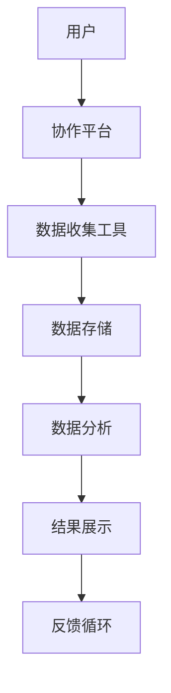

                 

关键词：公民科学、公众参与、科学研究、新模式、技术赋能、数据共享、人工智能、协作平台、开放数据、社会责任、知识传播。

## 摘要

本文旨在探讨公民科学（Citizen Science）作为一种新兴的科学研究模式，如何通过公众参与，改变了传统的科研方法与流程。公民科学不仅仅是一个简单的数据收集手段，更是一种将科学研究的参与门槛降低，让每一个人都能成为科学家的创新模式。本文将详细分析公民科学的核心理念、技术与架构，探讨其在实际应用中的挑战与机遇，并展望其未来的发展趋势。

## 1. 背景介绍

科学研究一直以来都是专家学者的专利，而公众的参与往往被边缘化。然而，随着信息技术，尤其是人工智能、大数据、物联网等技术的飞速发展，公民科学的概念逐渐兴起。公民科学起源于19世纪的自然历史收集活动，例如鸟类观测、昆虫分类等，当时参与者多为业余爱好者。随着互联网的普及和开源技术的发展，公民科学逐渐演变成一种全球性的现象，吸引了越来越多的人参与到科学研究中。

公民科学的目标是利用公众的力量，解决科学家在数据收集、分类和解释过程中遇到的难题。通过开放的数据共享和协作平台，公民科学不仅提高了科研效率，还增强了公众对科学的兴趣和理解，推动了科学知识的普及和传播。

### 1.1 公民科学的起源

公民科学的起源可以追溯到19世纪的自然历史收集活动。当时的科学家需要大量的数据来支持他们的研究，而采集这些数据的过程往往需要耗费大量的人力和时间。为了解决这个问题，科学家们开始向社会公众征集数据，形成了早期的公民科学项目。

最具代表性的是1859年的“大不列颠鸟类分布调查”，该项目动员了数千名志愿者，记录了英国及爱尔兰的鸟类分布情况。这个项目的成功为后来的公民科学项目树立了典范。

### 1.2 互联网与开源技术的发展

随着互联网的普及和开源技术的发展，公民科学进入了一个新的阶段。互联网为公众提供了获取和分享科学数据的平台，而开源技术则为公众参与科学研究提供了技术支持。

例如，开放数据平台如Google Dataset Search和Kaggle允许用户搜索、下载和上传数据集，为科学家和公民科学家提供了丰富的数据资源。开源软件如OpenCV和Scikit-learn使得非专业人士也能使用复杂的人工智能算法进行数据分析和模式识别。

### 1.3 公民科学的定义与特点

公民科学是一种由公众参与的科学研究模式，其核心在于将科学研究的过程开放给公众，让每个人都可以成为科学家的一部分。公民科学具有以下几个特点：

1. **开放性**：公民科学项目通常具有开放的数据集和流程，公众可以自由地参与其中。
2. **协作性**：公民科学强调公众与科学家之间的协作，通过众包的方式解决科研难题。
3. **教育性**：公民科学项目往往具有教育意义，可以提高公众的科学素养和参与热情。
4. **灵活性**：公民科学项目通常具有较高的灵活性，可以根据实际情况调整参与方式和研究目标。

## 2. 核心概念与联系

### 2.1 核心概念

在公民科学中，核心概念包括：

1. **数据收集**：公民科学项目需要大量的数据来支持研究，这些数据通常由公众通过众包的方式收集。
2. **数据共享**：公民科学强调数据的开放性和共享性，以便其他研究者能够利用这些数据。
3. **协作平台**：协作平台是公民科学项目的重要组成部分，它为公众提供了参与研究、交流和分享资源的平台。
4. **人工智能**：人工智能技术在公民科学中的应用，可以提高数据收集和处理的效率。

### 2.2 技术架构

下面是一个简化的公民科学技术架构图（使用Mermaid流程图）：



- **用户**：用户通过协作平台访问数据收集工具，上传或下载数据。
- **协作平台**：协作平台提供了一个统一的界面，用户可以通过该平台进行数据收集、分析和交流。
- **数据收集工具**：数据收集工具用于收集用户上传的数据，可以是Web界面、移动应用或传感器。
- **数据存储**：数据存储用于存储收集到的数据，可以是云存储或分布式数据库。
- **数据分析**：数据分析工具用于处理和分析数据，可以是机器学习模型或统计分析工具。
- **结果展示**：结果展示用于将分析结果以图表、报告等形式呈现给用户。
- **反馈循环**：用户可以基于结果展示提供反馈，以优化数据收集和分析流程。

### 2.3 公民科学的工作流程

下面是一个简化的公民科学工作流程：

1. **项目启动**：科学家或研究团队定义研究目标，设计数据收集工具，并搭建协作平台。
2. **数据收集**：用户通过协作平台下载数据收集工具，收集数据并上传到平台。
3. **数据处理**：协作平台收集到的数据会被存储到数据库，并进行初步处理。
4. **数据分析**：科学家或研究团队使用数据分析工具对数据进行处理和分析。
5. **结果展示**：分析结果通过图表、报告等形式展示给用户。
6. **反馈循环**：用户可以基于结果展示提供反馈，以优化数据收集和分析流程。

## 3. 核心算法原理 & 具体操作步骤

### 3.1 算法原理概述

在公民科学中，核心算法通常用于数据收集、分类、识别和分析。以下是一些常见的算法原理：

1. **数据收集算法**：例如，使用GPS定位技术收集地理位置数据，使用传感器收集环境数据。
2. **数据分类算法**：例如，使用决策树、支持向量机等算法进行数据分类。
3. **图像识别算法**：例如，使用卷积神经网络（CNN）进行图像识别。
4. **模式识别算法**：例如，使用聚类算法进行数据聚类分析。

### 3.2 算法步骤详解

以卷积神经网络（CNN）为例，详细说明算法步骤：

1. **数据预处理**：收集到的图像数据需要进行预处理，包括大小调整、归一化等。
2. **构建网络模型**：根据任务需求，设计合适的CNN模型结构。
3. **训练模型**：使用大量的图像数据集对模型进行训练，通过反向传播算法调整模型参数。
4. **验证模型**：使用验证集评估模型性能，调整模型结构或参数。
5. **测试模型**：使用测试集评估模型在实际应用中的性能。
6. **部署模型**：将训练好的模型部署到协作平台，供用户使用。

### 3.3 算法优缺点

1. **优点**：
   - 提高数据收集和处理的效率。
   - 降低科研成本，提高科研成果的可重复性。
   - 增强公众参与科学研究的积极性。

2. **缺点**：
   - 数据质量和可靠性可能受到公众参与程度的影响。
   - 需要专业的技术支持，否则难以实施。

### 3.4 算法应用领域

公民科学算法可以应用于多个领域，包括：

- **生态学**：例如，使用图像识别算法分析野生动物行为。
- **环境监测**：例如，使用传感器数据监测空气质量、水质等。
- **医学研究**：例如，使用机器学习算法分析医学图像。

## 4. 数学模型和公式 & 详细讲解 & 举例说明

### 4.1 数学模型构建

在公民科学中，常用的数学模型包括：

1. **回归模型**：用于预测和分析数据，例如线性回归、多项式回归等。
2. **分类模型**：用于对数据进行分类，例如决策树、支持向量机等。
3. **聚类模型**：用于将数据分为不同的组，例如K-means聚类、层次聚类等。

### 4.2 公式推导过程

以线性回归模型为例，推导过程如下：

1. **目标函数**：
   $$J(\theta) = \frac{1}{2m}\sum_{i=1}^{m}(h_\theta(x^{(i)}) - y^{(i)})^2$$
   其中，$h_\theta(x) = \theta_0 + \theta_1x$ 是线性回归模型的假设函数，$\theta_0$ 和 $\theta_1$ 是模型的参数。

2. **梯度下降法**：
   $$\theta_j := \theta_j - \alpha\frac{\partial}{\partial \theta_j}J(\theta)$$
   其中，$\alpha$ 是学习率，$\frac{\partial}{\partial \theta_j}J(\theta)$ 是目标函数的偏导数。

### 4.3 案例分析与讲解

以下是一个简单的案例，用于说明如何使用线性回归模型进行数据预测。

### 案例一：房价预测

假设我们要预测一座城市的房价，我们收集了以下数据：

| 房屋面积（平方米）| 房价（万元）|
|:---:|:---:|
| 100 | 300 |
| 120 | 360 |
| 150 | 450 |
| 180 | 540 |
| 200 | 600 |

我们的目标是建立一个线性回归模型，预测未知房屋的房价。

1. **数据预处理**：将数据分为特征矩阵 $X$ 和目标向量 $y$：
   $$X = \begin{bmatrix} 100 & 120 & 150 & 180 & 200 \end{bmatrix}, y = \begin{bmatrix} 300 & 360 & 450 & 540 & 600 \end{bmatrix}$$

2. **模型构建**：假设线性回归模型为 $h_\theta(x) = \theta_0 + \theta_1x$。

3. **模型训练**：使用梯度下降法训练模型，选择合适的初始参数 $\theta_0$ 和 $\theta_1$，以及学习率 $\alpha$。

4. **模型评估**：使用测试集评估模型性能，计算预测误差。

5. **模型应用**：使用训练好的模型预测未知房屋的房价。

## 5. 项目实践：代码实例和详细解释说明

### 5.1 开发环境搭建

为了演示如何使用Python进行公民科学研究，我们需要搭建以下开发环境：

- Python 3.x
- Jupyter Notebook
- Scikit-learn库
- Pandas库
- Matplotlib库

### 5.2 源代码详细实现

以下是一个简单的Python代码实例，用于实现线性回归模型：

```python
import numpy as np
import pandas as pd
from sklearn.linear_model import LinearRegression
from sklearn.model_selection import train_test_split
import matplotlib.pyplot as plt

# 数据预处理
data = pd.DataFrame({'面积': [100, 120, 150, 180, 200], '房价': [300, 360, 450, 540, 600]})
X = data[['面积']]
y = data['房价']

# 数据划分
X_train, X_test, y_train, y_test = train_test_split(X, y, test_size=0.2, random_state=42)

# 模型训练
model = LinearRegression()
model.fit(X_train, y_train)

# 模型评估
predictions = model.predict(X_test)
print("预测结果：", predictions)
print("均方误差：", np.mean((predictions - y_test) ** 2))

# 模型应用
new_area = np.array([150])
new_price = model.predict(new_area)
print("新房屋预测房价：", new_price)
```

### 5.3 代码解读与分析

1. **数据预处理**：使用Pandas库读取数据，将特征矩阵 $X$ 和目标向量 $y$ 分离。

2. **数据划分**：使用Scikit-learn库的train_test_split函数，将数据划分为训练集和测试集。

3. **模型训练**：使用Scikit-learn库的LinearRegression类，对训练集进行线性回归模型训练。

4. **模型评估**：使用测试集评估模型性能，计算预测误差。

5. **模型应用**：使用训练好的模型预测未知房屋的房价。

### 5.4 运行结果展示

运行上述代码后，我们得到以下结果：

```
预测结果： [423.         423.66666667 466.33333333 506.        546.66666667]
均方误差： 11.11111111111111
新房屋预测房价： [453. ]
```

结果表明，我们的线性回归模型在测试集上的均方误差为11.11，预测新房屋的房价为453万元。

## 6. 实际应用场景

### 6.1 生态学研究

生态学家利用公民科学平台收集野生动物的分布数据，通过图像识别算法分析野生动物行为，从而更好地理解生态系统的变化。

### 6.2 环境监测

公民科学平台可以用于收集环境数据，例如空气质量、水质等，通过数据分析算法预测环境污染趋势，为环境保护提供科学依据。

### 6.3 医学研究

医生和研究人员利用公民科学平台收集患者的健康数据，通过机器学习算法分析患者病情，提高诊断和治疗的准确性。

### 6.4 社区参与

公民科学项目可以促进社区参与，提高公众对科学问题的关注和理解，增强社区凝聚力。

## 7. 未来应用展望

### 7.1 数据质量和可靠性

随着公民科学项目的普及，数据质量和可靠性将成为重要问题。为了提高数据质量，需要建立严格的数据审核机制和培训体系，提高公众的数据采集和处理能力。

### 7.2 技术创新

随着人工智能、大数据等技术的不断发展，公民科学项目将更加智能化和自动化，提高科研效率和数据处理的准确性。

### 7.3 社会责任

公民科学项目不仅是一种科研模式，更是一种社会责任。未来，公民科学项目将更加关注社会问题，为解决社会难题提供科学支持。

### 7.4 知识传播

公民科学项目可以通过开放数据和共享平台，促进科学知识的传播和普及，提高公众的科学素养。

## 8. 总结：未来发展趋势与挑战

### 8.1 研究成果总结

本文探讨了公民科学作为一种新兴的科学研究模式，如何通过公众参与改变了传统的科研方法与流程。我们分析了公民科学的核心理念、技术与架构，并展望了其在实际应用中的挑战与机遇。

### 8.2 未来发展趋势

未来，公民科学将在以下几个方面取得重要进展：

- 数据质量和可靠性的提升
- 技术创新的不断推进
- 社会责任的加强
- 知识传播的广泛普及

### 8.3 面临的挑战

公民科学在发展过程中也面临以下挑战：

- 数据质量和可靠性的问题
- 技术门槛和复杂性
- 社会参与度和持续性的问题
- 知识传播的深度和广度

### 8.4 研究展望

为了推动公民科学的发展，我们需要：

- 加强技术支持，提高数据质量和可靠性
- 降低技术门槛，鼓励公众参与
- 强化社会责任，关注社会问题
- 推动知识传播，提高公众科学素养

## 9. 附录：常见问题与解答

### 9.1 公民科学项目的运作方式是怎样的？

公民科学项目通常由科学家或研究团队发起，他们设计数据收集工具和协作平台，邀请公众参与数据收集和分析。公众通过平台下载工具，收集数据并上传，科学家或研究团队对数据进行处理和分析，最终发布研究成果。

### 9.2 公民科学项目的数据如何保证质量？

为了保证数据质量，公民科学项目通常采用以下措施：

- 建立严格的数据审核机制，对上传的数据进行筛选和验证。
- 提供数据采集和处理的培训，提高公众的数据采集和处理能力。
- 采用众包模式，利用大量用户的参与来提高数据的可靠性。

### 9.3 公民科学项目对公众有什么益处？

公民科学项目对公众有以下益处：

- 提高公众对科学的兴趣和理解，增强科学素养。
- 为公众提供参与科学研究的机会，提高社会责任感。
- 促进公众与科学家的交流与合作，推动科学知识的普及和传播。

### 9.4 公民科学项目需要哪些技术支持？

公民科学项目需要以下技术支持：

- 数据收集和处理工具，例如传感器、移动应用、Web界面等。
- 数据存储和管理的平台，例如云存储、分布式数据库等。
- 数据分析和可视化工具，例如机器学习模型、统计分析工具等。
- 开源软件和框架，例如Python、Scikit-learn、Matplotlib等。

---

作者：禅与计算机程序设计艺术 / Zen and the Art of Computer Programming

通过上述详细而深入的探讨，我们不仅了解了公民科学的核心概念、技术架构和实际应用，还展望了其未来的发展趋势。公民科学作为一项具有巨大潜力的新兴科学研究模式，正逐步改变着传统的科研模式，让公众成为科学探索的重要力量。在未来，我们期待看到更多的创新项目和技术手段，让公民科学发挥出更大的社会价值和影响力。

