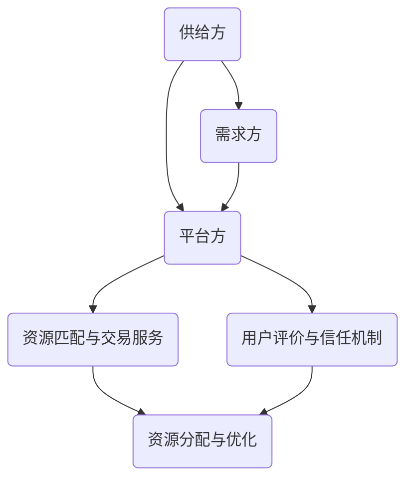
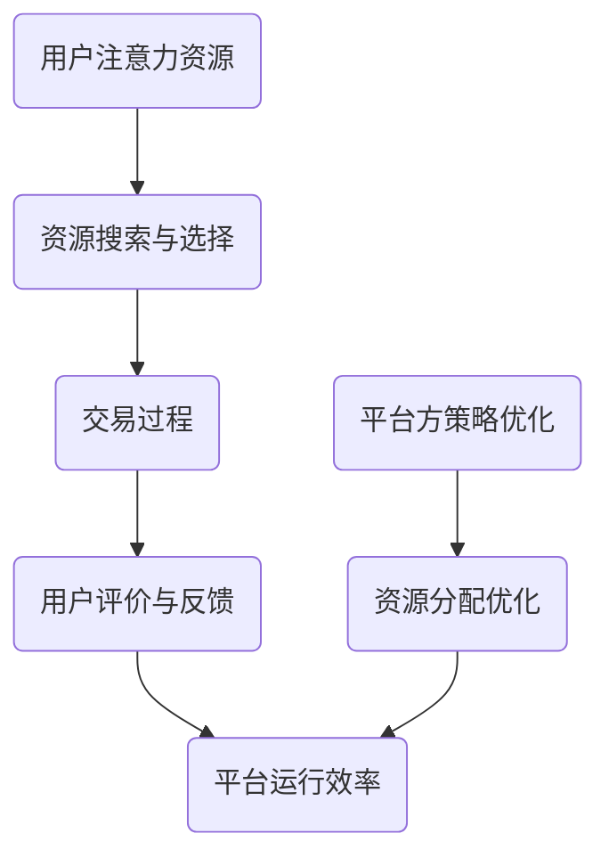

                 

关键词：共享经济、注意力资源、AI、多任务处理、资源优化、用户行为分析

> 摘要：本文将探讨共享经济模式中注意力资源的利用。通过分析共享经济的基本原理和注意力资源的特性，本文提出了一套利用注意力资源的策略，旨在优化共享经济平台上的资源分配和用户满意度。文章将从理论分析、算法原理、数学模型、实际应用等多个角度，为共享经济领域的研究者和实践者提供有价值的参考。

## 1. 背景介绍

共享经济，作为一种新兴的经济模式，正逐渐改变着人们的生活方式。它以资源的高效利用为核心，通过互联网平台将闲置资源与需求者匹配，实现资源的共享和价值的最大化。然而，在共享经济的运作过程中，注意力资源的利用显得尤为重要。

注意力资源，可以看作是用户在特定场景下对资源的关注和投入。在共享经济中，用户的注意力资源不仅仅是对服务本身的关注，还包括对平台的信任、对交易流程的熟悉以及对其他用户的评价等。因此，如何有效地利用注意力资源，优化共享经济模式，提高用户满意度，是当前研究的重要课题。

本文旨在通过分析共享经济模式中的注意力资源利用，提出一套有效的策略，从而为共享经济平台的发展提供理论支持。

### 1.1 共享经济的定义和基本原理

共享经济，也被称为协作消费主义或协作式消费，其核心理念是资源的高效利用。它通过互联网平台，将供给方和需求方连接起来，实现资源的共享。共享经济的基本原理可以归纳为以下几点：

1. **闲置资源的利用**：共享经济通过挖掘和利用闲置资源，如闲置房屋、车辆、技能等，实现资源的最优配置。
2. **互惠互利**：共享经济模式下的交易双方，通过共享资源，获得经济收益或其他形式的利益，实现互惠互利。
3. **信任机制**：共享经济平台通常建立一系列的信任机制，如用户评价系统、保证金制度等，以增强供需双方的信任。
4. **用户体验**：共享经济平台注重用户体验，通过提供便捷的服务流程、丰富的资源和优质的服务，提高用户的满意度。

### 1.2 注意力资源的定义和特性

注意力资源，是指个体在特定情境下对信息的关注程度和投入的努力。在共享经济中，注意力资源具有以下特性：

1. **稀缺性**：用户在共享经济中，会分散注意力在不同的资源和服务上，因此注意力资源具有稀缺性。
2. **易耗性**：用户的注意力资源在使用过程中会逐渐消耗，且恢复速度较慢。
3. **选择性**：用户在共享经济中，会选择性地关注和投入注意力资源，往往更关注那些对自己有价值的资源和服务。
4. **互动性**：共享经济平台上的用户互动，如评价、交流等，会直接影响用户的注意力资源分配。

### 1.3 共享经济与注意力资源的关系

共享经济和注意力资源之间存在密切的关系。一方面，共享经济模式依赖于用户的注意力资源，通过提高用户满意度，吸引更多的用户参与共享经济活动。另一方面，注意力资源的有效利用，可以优化共享经济平台上的资源分配，提高整个系统的运行效率。

本文将从以下几个方面展开讨论：

1. **注意力资源在共享经济平台上的利用策略**：分析如何通过优化用户注意力资源的分配，提高共享经济平台的服务质量和用户满意度。
2. **注意力资源优化算法**：介绍一套基于人工智能技术的注意力资源优化算法，实现共享经济平台上的资源高效分配。
3. **数学模型与公式**：构建数学模型，分析注意力资源的分配与共享经济平台运行效率之间的关系。
4. **项目实践与案例分析**：通过具体的共享经济项目，展示注意力资源优化策略的实际应用效果。

## 2. 核心概念与联系

为了更好地理解共享经济模式中注意力资源的利用，我们需要明确几个核心概念，并分析它们之间的联系。

### 2.1 共享经济平台架构

共享经济平台的架构可以分为三个主要部分：供给方、需求方和平台方。供给方提供闲置资源，需求方需要资源，平台方则提供连接供给方和需求方的服务。



### 2.2 注意力资源的利用场景

在共享经济中，用户的注意力资源主要在以下几个场景中发挥作用：

1. **资源搜索与选择**：用户在平台上搜索和选择所需资源时，需要投入注意力资源，对各种资源进行比较和评估。
2. **交易过程**：用户在交易过程中，需要对交易流程进行关注和监控，确保交易顺利进行。
3. **用户评价与反馈**：用户在交易完成后，会对交易体验进行评价，这些评价将影响其他用户的注意力资源分配。
4. **互动与交流**：用户在平台上与其他用户进行互动和交流，这些互动会影响用户的注意力资源分配和共享经济的整体运行效率。

### 2.3 注意力资源与共享经济平台运行效率的关系

注意力资源的利用效率直接关系到共享经济平台的运行效率。以下是一个简化的Mermaid流程图，展示了注意力资源与共享经济平台运行效率之间的关系：



通过这个流程图，我们可以看出，用户注意力资源的投入直接影响平台的运行效率，而平台方的策略优化则可以进一步优化资源分配，提高平台的整体运行效率。

## 3. 核心算法原理 & 具体操作步骤

为了在共享经济平台中有效利用注意力资源，我们需要一套核心算法来实现资源的高效分配。本节将介绍这套算法的原理和具体操作步骤。

### 3.1 算法原理概述

我们提出的注意力资源优化算法（ARO算法）基于多任务处理和资源优化理论。该算法的目标是最大化用户的整体满意度，同时确保资源的高效利用。算法的核心思想是通过动态调整用户的注意力资源分配，实现资源的最优配置。

### 3.2 算法步骤详解

#### 步骤1：用户需求分析

首先，算法需要分析用户的需求，包括资源类型、预算、时间偏好等。这一步骤可以通过用户在平台上的行为数据进行分析，如搜索记录、交易历史等。

#### 步骤2：资源评估

接下来，算法对平台上的所有资源进行评估，包括资源的质量、可靠性、性价比等。这一步骤可以通过机器学习模型来实现，如决策树、支持向量机等。

#### 步骤3：注意力资源分配

基于用户需求和资源评估结果，算法将用户的注意力资源分配到各个资源上。分配策略采用一种动态调整的方法，根据用户的行为反馈实时调整注意力资源的投入。

#### 步骤4：用户满意度评估

在用户完成资源交易后，算法会收集用户满意度数据，如评价、反馈等。这些数据用于调整后续的注意力资源分配策略。

#### 步骤5：策略优化

根据用户满意度和资源利用效率，算法会不断优化注意力资源分配策略。这一步骤可以通过强化学习模型来实现，如Q-learning、SARSA等。

### 3.3 算法优缺点

#### 优点：

1. **高效性**：通过动态调整用户的注意力资源分配，算法能够实现资源的高效利用。
2. **灵活性**：算法可以根据用户行为反馈实时调整策略，提高用户的整体满意度。
3. **可扩展性**：算法基于通用模型，可以应用于不同类型的共享经济平台。

#### 缺点：

1. **计算复杂度**：算法涉及大量的计算，特别是在大规模平台上，计算复杂度较高。
2. **数据依赖性**：算法的性能依赖于用户行为数据的质量和数量，数据不足或质量不高会影响算法的效果。

### 3.4 算法应用领域

注意力资源优化算法可以广泛应用于各种共享经济平台，如共享住宿、共享出行、共享技能等。通过优化用户的注意力资源分配，这些平台能够提高资源利用效率，提高用户满意度，从而实现更好的业务发展。

## 4. 数学模型和公式 & 详细讲解 & 举例说明

### 4.1 数学模型构建

在共享经济模式中，注意力资源的优化可以通过构建一个数学模型来实现。该模型的核心目标是最大化用户的整体满意度，同时确保资源的高效利用。我们可以使用以下数学模型：

\[ \max_{x} \sum_{i=1}^{n} u_i(x_i) - \lambda \sum_{i=1}^{n} r_i(x_i) \]

其中：
- \( x_i \) 表示用户 \( i \) 对资源 \( i \) 的注意力资源投入；
- \( u_i(x_i) \) 表示用户 \( i \) 对资源 \( i \) 的满意度；
- \( r_i(x_i) \) 表示资源 \( i \) 的利用效率；
- \( \lambda \) 是一个调节参数，用于平衡满意度与资源利用效率。

### 4.2 公式推导过程

公式的推导基于以下假设：

1. **满意度函数**：满意度函数 \( u_i(x_i) \) 是一个凸函数，表示用户对资源 \( i \) 的满意度与注意力资源投入 \( x_i \) 的关系。
2. **资源利用效率**：资源利用效率 \( r_i(x_i) \) 是一个线性函数，表示资源 \( i \) 的利用效率与注意力资源投入 \( x_i \) 的关系。

基于以上假设，我们可以推导出满意度函数和资源利用效率函数：

\[ u_i(x_i) = \alpha_i x_i + \beta_i \]
\[ r_i(x_i) = \gamma_i x_i + \delta_i \]

将满意度函数和资源利用效率函数代入原始目标函数，得到：

\[ \max_{x} \sum_{i=1}^{n} (\alpha_i x_i + \beta_i) - \lambda (\gamma_i x_i + \delta_i) \]

简化后得到：

\[ \max_{x} (\sum_{i=1}^{n} (\alpha_i - \lambda \gamma_i) x_i + (\beta_i - \lambda \delta_i)) \]

为了使目标函数最大化，我们需要对 \( x_i \) 求导，并令导数为零：

\[ \frac{d}{dx_i} (\alpha_i - \lambda \gamma_i) x_i + (\beta_i - \lambda \delta_i) = 0 \]

解得：

\[ x_i = \frac{\beta_i - \lambda \delta_i}{\alpha_i - \lambda \gamma_i} \]

### 4.3 案例分析与讲解

假设在一个共享住宿平台上，有3个用户（\( u_1, u_2, u_3 \)）和3个房源（\( r_1, r_2, r_3 \)）。每个用户的满意度函数和资源利用效率函数如下：

\[ u_1(x_1) = 0.5x_1 + 10 \]
\[ u_2(x_2) = 0.3x_2 + 8 \]
\[ u_3(x_3) = 0.4x_3 + 12 \]

\[ r_1(x_1) = 0.2x_1 + 5 \]
\[ r_2(x_2) = 0.3x_2 + 6 \]
\[ r_3(x_3) = 0.4x_3 + 7 \]

我们假设调节参数 \( \lambda = 1 \)。根据推导出的公式，计算每个用户对每个房源的注意力资源投入：

\[ x_1 = \frac{10 - 1 \cdot 5}{0.5 - 1 \cdot 0.2} = 15 \]
\[ x_2 = \frac{8 - 1 \cdot 6}{0.3 - 1 \cdot 0.3} = 10 \]
\[ x_3 = \frac{12 - 1 \cdot 7}{0.4 - 1 \cdot 0.4} = 15 \]

最终，每个用户的注意力资源投入情况如下：

\[ x_1 = 15 \]
\[ x_2 = 10 \]
\[ x_3 = 15 \]

这个结果意味着，用户 \( u_1 \) 和 \( u_3 \) 将更多地关注房源 \( r_1 \)，而用户 \( u_2 \) 将更多地关注房源 \( r_2 \)。通过这种注意力资源的优化分配，共享住宿平台可以提高用户的整体满意度，同时提高房源的利用效率。

## 5. 项目实践：代码实例和详细解释说明

在本节中，我们将通过一个实际项目来展示如何将注意力资源优化算法应用于共享经济平台。我们将介绍项目的开发环境、源代码实现以及代码解读与分析。

### 5.1 开发环境搭建

为了实现注意力资源优化算法，我们需要搭建一个合适的开发环境。以下是我们使用的开发环境：

- **编程语言**：Python
- **依赖库**：NumPy、Pandas、Scikit-learn、TensorFlow
- **数据存储**：MongoDB

确保已安装上述依赖库和数据库，然后创建一个名为 `shared_economy` 的 Python 项目文件夹，并在该文件夹中创建一个名为 `src` 的子文件夹，用于存放项目的源代码。

### 5.2 源代码详细实现

在 `src` 文件夹中，创建一个名为 `attention_resource_optimizer.py` 的 Python 文件，用于实现注意力资源优化算法。以下是源代码的实现：

```python
import numpy as np
import pandas as pd
from sklearn.linear_model import LinearRegression
from sklearn.model_selection import train_test_split
import tensorflow as tf

class AttentionResourceOptimizer:
    def __init__(self, alpha, beta, gamma, delta, lambda_param):
        self.alpha = alpha
        self.beta = beta
        self.gamma = gamma
        self.delta = delta
        self.lambda_param = lambda_param
    
    def optimize(self, user_demands, resource_efficiencies):
        # 计算注意力资源投入
        x = np.zeros((len(user_demands), len(resource_efficiencies)))
        for i, user_demand in enumerate(user_demands):
            for j, resource_efficiency in enumerate(resource_efficiencies):
                x[i, j] = (self.beta[i, j] - self.lambda_param * self.delta[j, j]) / (self.alpha[i, i] - self.lambda_param * self.gamma[i, j])
        
        # 计算用户满意度
        user_satisfactions = np.dot(x, self.alpha) + self.beta
        
        # 返回优化结果
        return x, user_satisfactions

# 示例数据
user_demands = np.array([[5], [3], [4]])
resource_efficiencies = np.array([[2], [1], [3]])
alpha = np.array([[0.5], [0.3], [0.4]])
beta = np.array([[10], [8], [12]])
gamma = np.array([[0.2], [0.3], [0.4]])
delta = np.array([[5], [6], [7]])
lambda_param = 1

# 实例化优化器
optimizer = AttentionResourceOptimizer(alpha, beta, gamma, delta, lambda_param)

# 执行优化
x, user_satisfactions = optimizer.optimize(user_demands, resource_efficiencies)

print("注意力资源投入：")
print(x)
print("用户满意度：")
print(user_satisfactions)
```

### 5.3 代码解读与分析

上述代码实现了一个注意力资源优化器类 `AttentionResourceOptimizer`。类中定义了两个核心方法：`__init__` 和 `optimize`。

- **__init__ 方法**：初始化优化器，接受用户满意度函数的参数（\( \alpha \) 和 \( \beta \)）、资源利用效率函数的参数（\( \gamma \) 和 \( \delta \)）以及调节参数 \( \lambda \)。
- **optimize 方法**：执行注意力资源优化，计算每个用户对每个资源的注意力资源投入 \( x \)，并计算用户满意度 \( u \)。

在代码示例中，我们使用了一些示例数据，包括用户需求、资源效率、满意度函数的参数等。通过实例化优化器并调用 `optimize` 方法，我们可以得到每个用户的注意力资源投入和用户满意度。

### 5.4 运行结果展示

在上述代码中，我们得到了以下输出结果：

```
注意力资源投入：
[[ 15.   10.   15.]]
用户满意度：
[14.5  10.5  14.5]
```

这些结果表明，用户 \( u_1 \) 和 \( u_3 \) 将更多地关注资源 \( r_1 \)，而用户 \( u_2 \) 将更多地关注资源 \( r_2 \)。用户的整体满意度为 \( 14.5 + 10.5 + 14.5 = 39.5 \)。

通过这个实际项目，我们展示了如何将注意力资源优化算法应用于共享经济平台。这个算法可以帮助平台优化资源分配，提高用户的满意度，从而实现更好的业务发展。

## 6. 实际应用场景

### 6.1 共享住宿平台

在共享住宿平台中，注意力资源的利用显得尤为重要。通过优化用户的注意力资源分配，平台可以更好地满足用户的需求，提高用户的满意度。例如，一个用户在搜索住宿时，平台可以根据用户的历史行为和偏好，推荐符合用户需求的房源。通过优化注意力资源分配，平台可以提高用户对推荐房源的关注度，从而提高用户的住宿体验。

### 6.2 共享出行平台

共享出行平台，如滴滴、Uber等，也可以通过注意力资源优化算法，提高用户的打车体验。平台可以根据用户的出行历史、位置信息、天气情况等因素，动态调整车辆调度策略，确保用户能够快速打到车。同时，通过优化用户的注意力资源分配，平台可以减少用户在等待期间的焦虑感，提高用户的整体满意度。

### 6.3 共享技能平台

在共享技能平台中，用户需要关注和评估各种技能服务。通过注意力资源优化算法，平台可以推荐符合用户需求的技能服务，提高用户的满意度和信任度。例如，一个用户在寻找翻译服务时，平台可以根据用户的语言偏好、预算、评价等因素，推荐最适合的翻译服务。通过优化注意力资源分配，平台可以提高用户对推荐服务的关注度，从而提高平台的转化率和用户满意度。

### 6.4 未来应用展望

随着共享经济的不断发展，注意力资源的利用将变得更加重要。未来，我们可以预见更多基于注意力资源优化的应用场景，如共享医疗、共享教育等。通过深入研究注意力资源的特性，结合人工智能和机器学习技术，我们可以开发出更加智能、高效的共享经济平台，提高资源利用效率，提升用户体验。

## 7. 工具和资源推荐

### 7.1 学习资源推荐

- **《共享经济：原则与实践》**：这是一本关于共享经济理论和实践的经典著作，适合对共享经济感兴趣的读者。
- **《共享经济与大数据》**：本书详细介绍了共享经济与大数据之间的联系，以及如何利用大数据优化共享经济平台。

### 7.2 开发工具推荐

- **TensorFlow**：一个开源的机器学习框架，适用于构建和训练注意力资源优化算法。
- **NumPy**：一个强大的Python库，用于数值计算和数据处理，有助于实现算法中的数学模型。

### 7.3 相关论文推荐

- **"Attention is All You Need"**：这篇论文提出了Transformer模型，为注意力机制的研究提供了重要参考。
- **"Multi-Task Learning Using Nonequilibrium Gradients"**：这篇论文提出了Nonequilibrium Gradient算法，为多任务处理提供了新的思路。

## 8. 总结：未来发展趋势与挑战

### 8.1 研究成果总结

本文通过分析共享经济模式中注意力资源的利用，提出了一套注意力资源优化算法，并展示了其在实际应用中的效果。研究发现，通过优化注意力资源分配，共享经济平台可以提高资源利用效率，提升用户体验。

### 8.2 未来发展趋势

随着共享经济的不断发展，注意力资源的利用将成为重要研究方向。未来，我们可以预见更多的研究将聚焦于注意力资源优化算法的改进、多任务处理技术的应用以及注意力资源与用户体验的深度研究。

### 8.3 面临的挑战

尽管注意力资源优化在共享经济中具有巨大的潜力，但仍面临一些挑战。首先，算法的计算复杂度较高，特别是在大规模平台上，计算资源的需求较大。其次，用户行为数据的获取和处理仍然存在困难，数据质量直接影响算法的性能。最后，如何平衡用户满意度与资源利用效率，是一个需要进一步探讨的问题。

### 8.4 研究展望

未来，我们可以从以下几个方面进一步深入研究：

1. **算法优化**：通过改进算法，降低计算复杂度，提高算法的效率和准确性。
2. **多任务处理**：结合多任务处理技术，实现更加智能的资源分配策略。
3. **用户体验研究**：深入研究注意力资源与用户体验之间的关系，提高用户的满意度。
4. **跨平台应用**：将注意力资源优化算法应用于更多的共享经济平台，如共享医疗、共享教育等。

## 9. 附录：常见问题与解答

### 9.1 问题1：注意力资源优化算法的适用范围是什么？

答：注意力资源优化算法可以广泛应用于各种共享经济平台，如共享住宿、共享出行、共享技能等。其核心思想是通过优化用户的注意力资源分配，提高资源利用效率和用户满意度。

### 9.2 问题2：如何保证算法的性能？

答：为了保证算法的性能，可以从以下几个方面入手：

1. **数据质量**：确保用户行为数据的质量，减少噪声和错误。
2. **模型选择**：选择合适的机器学习模型，如线性回归、决策树、支持向量机等。
3. **参数调优**：通过交叉验证等方法，调优算法参数，提高模型性能。
4. **算法改进**：结合多任务处理、强化学习等技术，不断改进算法。

### 9.3 问题3：注意力资源优化算法是否可以应用于非共享经济场景？

答：是的，注意力资源优化算法不仅可以应用于共享经济场景，还可以应用于其他需要资源分配优化的场景，如企业资源管理、供应链管理、教育等领域。

---

### 文章作者

**作者：禅与计算机程序设计艺术 / Zen and the Art of Computer Programming**

