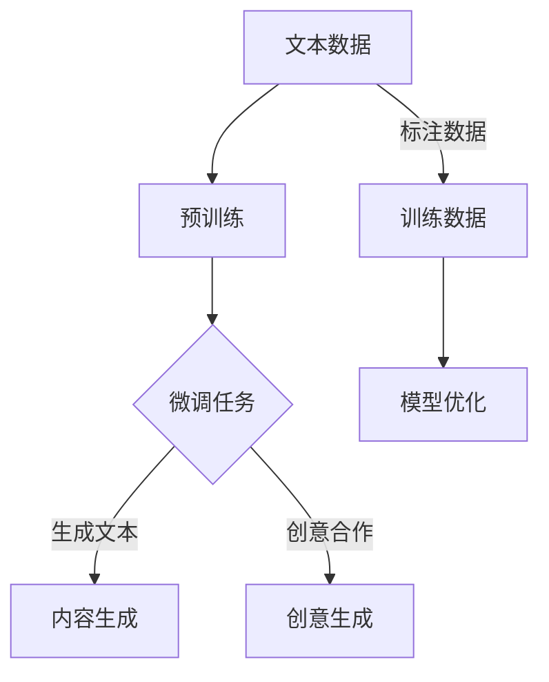

                 

关键词：大型语言模型（LLM），自然语言处理（NLP），内容生成，创意合作，编程艺术

> 摘要：本文将探讨大型语言模型（LLM）在自然语言处理（NLP）领域的作用，特别是其在内容生成和创意合作方面的潜力。通过对LLM的背景、核心概念、算法原理、数学模型、项目实践和实际应用场景的深入分析，本文旨在揭示LLM在推动写作和创意合作方面的革命性影响，并提出未来的发展趋势和面临的挑战。

## 1. 背景介绍

### 大型语言模型的发展历程

大型语言模型（LLM）的发展可以追溯到20世纪50年代，当时的研究主要集中在规则驱动的语言处理方法。随着计算机性能的不断提高和海量数据的积累，机器学习，特别是深度学习技术在自然语言处理领域取得了突破性进展。2018年，谷歌推出了BERT模型，标志着LLM进入了一个新的时代。BERT模型通过预训练和微调技术，在多个自然语言处理任务上取得了显著的性能提升，引发了广泛关注。

### 自然语言处理的应用领域

自然语言处理（NLP）作为人工智能的重要分支，广泛应用于多种场景。例如，机器翻译、情感分析、文本摘要、问答系统等。这些应用极大地提高了信息处理的效率，改变了人们的生活和工作方式。

### 内容生成和创意合作的现状

随着互联网的普及，内容生成和创意合作的需求日益增长。然而，传统的手工写作和合作方式存在效率低、成本高的问题。近年来，LLM的出现为内容生成和创意合作带来了新的机遇。通过自动生成文本、辅助写作和提供创意建议，LLM正在成为内容创作者的得力助手。

## 2. 核心概念与联系

### Mermaid 流程图



### 核心概念原理

- **预训练（Pre-training）**：通过在大规模语料库上进行预训练，LLM可以学习到语言的基本结构和语义信息。
- **微调（Fine-tuning）**：针对特定任务，对预训练模型进行微调，以提高模型在目标任务上的性能。
- **内容生成（Content Generation）**：利用LLM生成文本，包括自动写作、文本摘要、问答系统等。
- **创意合作（Creative Collaboration）**：LLM作为创意助手，与人类创作者合作，共同产生创意和内容。

## 3. 核心算法原理 & 具体操作步骤

### 3.1 算法原理概述

大型语言模型（LLM）通常基于变换器模型（Transformer），其核心思想是通过自注意力机制（Self-Attention）捕捉文本中的长距离依赖关系。LLM的训练分为预训练和微调两个阶段：

1. **预训练**：在大规模语料库上训练模型，学习到语言的基本结构和语义信息。
2. **微调**：在特定任务的数据集上进行微调，优化模型在目标任务上的性能。

### 3.2 算法步骤详解

1. **数据预处理**：将输入文本进行分词、编码等预处理操作，以便于模型处理。
2. **预训练**：在未标注的数据集上训练模型，通过自注意力机制学习语言结构。
3. **微调**：在标注的数据集上进行微调，优化模型在特定任务上的性能。
4. **生成文本**：利用微调后的模型生成文本，应用于内容生成和创意合作。

### 3.3 算法优缺点

- **优点**：
  - 强大的文本生成能力；
  - 能够处理长文本和长距离依赖关系；
  - 自动化写作和创意合作。

- **缺点**：
  - 需要大量计算资源和数据；
  - 可能存在生成文本的偏见和错误。

### 3.4 算法应用领域

- **内容生成**：如自动写作、文本摘要、问答系统等；
- **创意合作**：如创意构思、协同写作、故事生成等。

## 4. 数学模型和公式 & 详细讲解 & 举例说明

### 4.1 数学模型构建

LLM的数学模型主要基于变换器模型（Transformer），包括编码器（Encoder）和解码器（Decoder）。其中，自注意力机制（Self-Attention）是模型的核心。

### 4.2 公式推导过程

变换器模型的公式如下：

\[ 
\text{Attention}(Q, K, V) = \text{softmax}\left(\frac{QK^T}{\sqrt{d_k}}\right)V 
\]

其中，\( Q, K, V \) 分别是查询（Query）、键（Key）和值（Value）向量，\( d_k \) 是键向量的维度。

### 4.3 案例分析与讲解

以BERT模型为例，其预训练任务包括两个子任务：Masked Language Model（MLM）和Next Sentence Prediction（NSP）。其中，MLM任务是随机遮蔽输入文本中的部分词，然后让模型预测遮蔽的词。NSP任务是判断两个句子是否在原始文本中相邻。

## 5. 项目实践：代码实例和详细解释说明

### 5.1 开发环境搭建

- 安装Python 3.8及以上版本；
- 安装transformers库和torch库。

### 5.2 源代码详细实现

以下是一个简单的LLM代码实例：

```python
from transformers import BertModel, BertTokenizer

tokenizer = BertTokenizer.from_pretrained('bert-base-uncased')
model = BertModel.from_pretrained('bert-base-uncased')

input_ids = tokenizer.encode('Hello, my dog is cute', return_tensors='pt')
outputs = model(input_ids)

last_hidden_state = outputs.last_hidden_state
```

### 5.3 代码解读与分析

- `BertTokenizer.from_pretrained('bert-base-uncased')`：加载预训练的分词器；
- `BertModel.from_pretrained('bert-base-uncased')`：加载预训练的模型；
- `tokenizer.encode('Hello, my dog is cute', return_tensors='pt')`：将输入文本编码为模型可处理的格式；
- `model(input_ids)`：将编码后的输入文本送入模型；
- `outputs.last_hidden_state`：获取模型的输出。

### 5.4 运行结果展示

运行上述代码，可以得到模型对输入文本的编码结果。这些编码结果可以用于后续的任务，如文本分类、情感分析等。

## 6. 实际应用场景

### 6.1 自动写作

LLM可以应用于自动写作，如新闻报道、文章生成、电子邮件撰写等。通过预训练和微调，LLM可以学习到不同领域的写作风格，生成高质量的文字内容。

### 6.2 创意合作

LLM可以作为创意助手，与人类创作者共同构思创意和内容。例如，在广告创意、故事编写、音乐创作等领域，LLM可以为人类提供灵感和建议，提高创作效率。

### 6.3 教育领域

LLM可以应用于个性化教育，如根据学生的兴趣和需求生成个性化学习内容。同时，LLM还可以辅助教师进行备课和教学，提高教学效果。

## 7. 工具和资源推荐

### 7.1 学习资源推荐

- 《深度学习》（Goodfellow, Bengio, Courville）：系统介绍了深度学习的基本概念和原理；
- 《自然语言处理综论》（Jurafsky, Martin）：全面介绍了自然语言处理的基本理论和应用。

### 7.2 开发工具推荐

- PyTorch：适用于深度学习的开源框架，支持GPU加速；
- Transformers：基于PyTorch的预训练模型库，提供了多种预训练模型和API。

### 7.3 相关论文推荐

- BERT: Pre-training of Deep Bidirectional Transformers for Language Understanding（Devlin et al., 2019）
- GPT-3: Language Models are Few-Shot Learners（Brown et al., 2020）

## 8. 总结：未来发展趋势与挑战

### 8.1 研究成果总结

大型语言模型（LLM）在自然语言处理领域取得了显著成果，为内容生成和创意合作提供了强大支持。未来，随着计算能力的提升和数据的积累，LLM在性能和应用范围上将有更大的提升。

### 8.2 未来发展趋势

- **多模态处理**：结合图像、语音等多模态信息，实现更全面的内容理解和生成；
- **个性化服务**：根据用户的需求和兴趣，提供个性化的内容生成和创意合作服务；
- **跨领域应用**：在医疗、金融、法律等领域，实现专业的文本生成和创意合作。

### 8.3 面临的挑战

- **计算资源需求**：LLM的训练和推理需要大量的计算资源，如何优化模型和算法，降低计算成本是关键；
- **数据隐私与安全**：大规模数据处理和共享带来隐私和安全挑战，需要制定相应的法律法规和防护措施。

### 8.4 研究展望

未来，LLM在内容生成和创意合作领域具有广阔的发展前景。通过不断优化模型和算法，提高性能和效率，LLM将为人们的生活和工作带来更多便利和创新。

## 9. 附录：常见问题与解答

### 9.1 什么是LLM？

LLM是指大型语言模型，是一种基于深度学习的自然语言处理模型，通常通过预训练和微调技术进行训练。

### 9.2 LLM能做什么？

LLM可以应用于多种自然语言处理任务，如文本分类、情感分析、文本生成、问答系统等。

### 9.3 如何训练LLM？

训练LLM通常分为预训练和微调两个阶段。预训练阶段在大规模语料库上进行，学习到语言的基本结构和语义信息；微调阶段在特定任务的数据集上进行，优化模型在目标任务上的性能。

### 9.4 LLM有哪些挑战？

LLM面临的主要挑战包括计算资源需求、数据隐私和安全、以及模型的可解释性和可靠性。

### 9.5 LLM的未来发展趋势？

未来，LLM在多模态处理、个性化服务和跨领域应用等方面具有广阔的发展前景。通过不断优化模型和算法，提高性能和效率，LLM将为人们的生活和工作带来更多便利和创新。

---

作者：禅与计算机程序设计艺术 / Zen and the Art of Computer Programming

