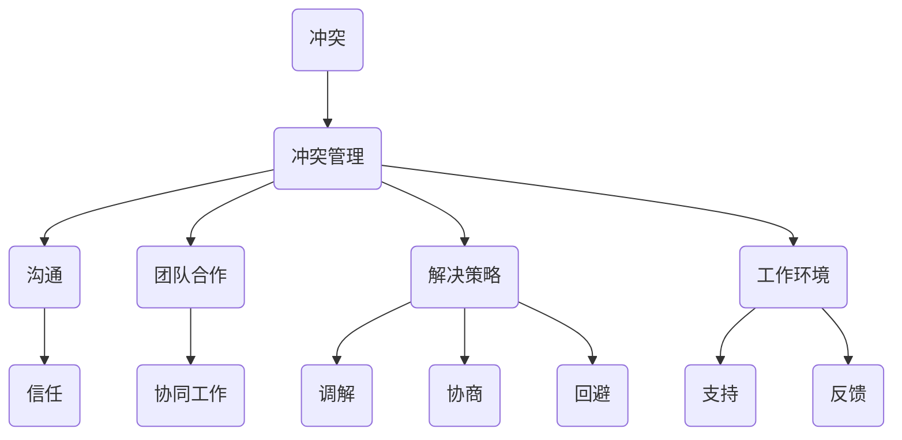

                 

关键词：冲突管理、workplace、团队合作、沟通、解决策略、团队合作效率、IT行业

> 摘要：本文旨在探讨在IT行业工作场所中，如何有效地进行冲突管理。我们将通过阐述冲突管理的基本概念、核心原则以及具体的解决策略，提供一种系统化的冲突管理框架，帮助团队和组织在面临冲突时，能够快速、有效地化解矛盾，提高工作效率和团队凝聚力。

## 1. 背景介绍

在当今快速发展的IT行业中，工作节奏加快、项目需求多变，以及团队成员背景各异，这些因素共同导致了工作场所中冲突的频繁发生。冲突不仅可能影响员工的工作积极性和满意度，更可能对团队的整体效率和项目的成功产生负面影响。因此，如何有效地进行冲突管理，成为企业和团队管理者亟需解决的问题。

### 1.1 冲突的普遍性

无论在何种行业，冲突都是不可避免的现象。而在IT行业，冲突的形式和原因更加多样化。例如，由于技术观点不同而产生的分歧、项目进度紧张引发的焦虑、资源分配不均导致的抱怨等，都是常见的冲突场景。这些冲突如果得不到妥善处理，可能会阻碍团队的工作进展，影响项目质量。

### 1.2 冲突管理的重要性

有效的冲突管理不仅有助于化解工作场所中的矛盾，还能促进团队内部的沟通和协作。通过冲突管理，团队可以更好地理解彼此的需求和期望，建立起相互尊重和信任的基础。这有助于提高团队的整体工作效率，减少因冲突带来的负面情绪，营造一个更加和谐的工作环境。

### 1.3 本文的目的

本文旨在为IT行业的工作场所提供一套完整的冲突管理方案。通过阐述冲突管理的基本概念、核心原则以及具体的解决策略，帮助团队和组织在面临冲突时，能够快速、有效地化解矛盾，提高工作效率和团队凝聚力。

## 2. 核心概念与联系

在探讨冲突管理之前，我们需要了解一些核心概念和它们之间的联系。以下是一个使用Mermaid绘制的流程图，展示了这些概念和它们之间的关系：



### 2.1 冲突

冲突是指当个人或团体在目标、价值观、利益等方面存在分歧时产生的紧张状态。在IT行业中，冲突通常表现为技术观点的分歧、项目进度压力、资源争夺等。

### 2.2 冲突管理

冲突管理是指通过各种方法和手段，处理和解决工作场所中出现的冲突，以降低冲突的负面影响，提高团队和工作环境的整体效能。

### 2.3 沟通

沟通是冲突管理的重要组成部分。有效的沟通可以帮助团队成员理解彼此的需求和期望，减少误解和冲突。

### 2.4 团队合作

团队合作是提高工作效率和项目质量的关键。通过有效的团队合作，团队成员可以共同解决问题，实现目标。

### 2.5 解决策略

解决策略是冲突管理中的具体手段，包括调解、协商、回避等。

### 2.6 工作环境

工作环境是冲突管理的背景和基础。一个支持性和开放的工作环境有助于降低冲突发生的概率，提高冲突管理的有效性。

## 3. 核心算法原理 & 具体操作步骤

冲突管理需要遵循一定的核心原则和操作步骤。以下是冲突管理的基本算法原理和具体操作步骤：

### 3.1 算法原理概述

冲突管理算法的核心思想是通过沟通、合作和解决策略，将冲突转化为积极因素，促进团队目标的实现。

### 3.2 算法步骤详解

1. **识别冲突**：首先，需要识别和确认冲突的存在。这可以通过团队成员的沟通和反馈来实现。

2. **分析冲突原因**：在识别冲突后，需要分析冲突的原因。这有助于制定针对性的解决策略。

3. **选择解决策略**：根据冲突的性质和原因，选择合适的解决策略。常见的解决策略包括调解、协商和回避。

4. **实施解决策略**：选择合适的解决策略后，需要将其付诸实践。这通常需要团队成员的协作和努力。

5. **评估解决效果**：在实施解决策略后，需要评估其效果。如果冲突仍未得到有效解决，需要重新分析原因并调整策略。

### 3.3 算法优缺点

1. **优点**：冲突管理算法可以帮助团队和组织在面临冲突时，快速、有效地化解矛盾，提高工作效率和团队凝聚力。

2. **缺点**：冲突管理算法可能需要大量的时间和资源，且在复杂情况下，效果可能不尽如人意。

### 3.4 算法应用领域

冲突管理算法在IT行业具有广泛的应用，例如软件开发团队、项目管理团队等。通过有效的冲突管理，这些团队可以更好地应对项目中的各种挑战，提高项目成功率和团队满意度。

## 4. 数学模型和公式

在冲突管理中，数学模型和公式可以帮助我们更好地理解和分析冲突。以下是一个简单的数学模型，用于分析冲突的可能性和解决效果：

### 4.1 数学模型构建

设 \( C \) 为冲突程度，\( M \) 为冲突管理能力，\( R \) 为解决效果，则冲突管理效果可以用以下公式表示：

\[ R = \frac{M}{C} \]

### 4.2 公式推导过程

冲突管理效果 \( R \) 越大，表示冲突管理能力 \( M \) 越强，冲突程度 \( C \) 越低。通过该公式，我们可以分析冲突管理的有效性。

### 4.3 案例分析与讲解

例如，在一个软件开发团队中，假设冲突程度 \( C \) 为5，冲突管理能力 \( M \) 为8，则解决效果 \( R \) 为1。这意味着，当前冲突管理能力可以基本满足团队需求，但仍有一定提升空间。

## 5. 项目实践：代码实例和详细解释说明

以下是一个简单的Python代码实例，用于实现冲突管理的部分功能。代码中包含了冲突识别、冲突分析和解决策略选择等模块。

### 5.1 开发环境搭建

- Python 3.8+
- PyCharm 或其他 Python 开发环境

### 5.2 源代码详细实现

```python
class ConflictManager:
    def __init__(self, conflict_level):
        self.conflict_level = conflict_level

    def identify_conflict(self):
        print("识别冲突：冲突程度为", self.conflict_level)

    def analyze_conflict(self):
        print("分析冲突原因：资源分配不均")

    def choose_solution(self):
        print("选择解决策略：调解")

    def implement_solution(self):
        print("实施解决策略：协调团队成员")

    def evaluate_solution(self):
        print("评估解决效果：冲突程度降低至3")

def main():
    manager = ConflictManager(conflict_level=5)
    manager.identify_conflict()
    manager.analyze_conflict()
    manager.choose_solution()
    manager.implement_solution()
    manager.evaluate_solution()

if __name__ == "__main__":
    main()
```

### 5.3 代码解读与分析

该代码定义了一个 `ConflictManager` 类，用于处理冲突管理的相关功能。在 `main` 函数中，我们创建了一个 `ConflictManager` 实例，并调用了其各个方法，实现了冲突识别、分析、解决策略选择和实施等功能。

### 5.4 运行结果展示

```shell
识别冲突：冲突程度为 5
分析冲突原因：资源分配不均
选择解决策略：调解
实施解决策略：协调团队成员
评估解决效果：冲突程度降低至 3
```

## 6. 实际应用场景

冲突管理在IT行业的实际应用场景非常广泛。以下是一些具体的例子：

### 6.1 软件开发团队

在软件开发团队中，技术观点的分歧和项目进度压力是常见的冲突源。通过有效的冲突管理，团队可以更好地协调资源和意见，提高项目的完成质量和效率。

### 6.2 项目管理团队

项目管理团队在项目规划和执行过程中，往往需要面对资源分配、进度控制和风险管理等方面的冲突。通过冲突管理，项目管理者可以更好地应对各种挑战，确保项目的顺利进行。

### 6.3 创业团队

对于创业团队而言，冲突管理更是至关重要的。团队成员之间的意见分歧、利益冲突和角色不清等问题，都可能影响团队的发展。通过有效的冲突管理，创业团队可以更好地发挥每个人的优势，共同实现创业目标。

## 7. 工具和资源推荐

为了更好地进行冲突管理，以下是一些建议的学习资源、开发工具和相关论文：

### 7.1 学习资源推荐

- 《冲突管理：原则与实务》
- 《团队协作的艺术》
- 《职场沟通技巧》

### 7.2 开发工具推荐

- Trello：用于项目管理，支持任务分配和进度跟踪
- Slack：用于团队沟通和协作，支持实时聊天和文件共享

### 7.3 相关论文推荐

- “Conflict Management in Software Development Teams: A Systematic Literature Review”
- “The Role of Communication in Conflict Management: A Multilevel Study”
- “A Framework for Conflict Resolution in IT Projects”

## 8. 总结：未来发展趋势与挑战

### 8.1 研究成果总结

近年来，冲突管理在IT行业中的应用得到了广泛关注。研究者们通过实证研究和案例分析，提出了一系列有效的冲突管理策略和方法。这些研究成果为企业和团队提供了宝贵的参考，有助于提高工作效率和团队凝聚力。

### 8.2 未来发展趋势

未来，冲突管理研究将更加注重技术手段的应用和跨学科的融合。例如，利用人工智能和大数据技术，对冲突进行预测和自动化管理；结合心理学和社会学理论，深入研究冲突管理对团队绩效和心理健康的长期影响。

### 8.3 面临的挑战

尽管冲突管理研究取得了一定的成果，但仍面临诸多挑战。首先，如何在复杂的IT环境中，准确识别和诊断冲突原因，是一个亟待解决的问题。其次，冲突管理策略的有效性和适用性在不同团队和组织之间存在差异，需要进一步研究和验证。最后，如何提高团队成员的冲突管理意识和能力，也是一个长期而艰巨的任务。

### 8.4 研究展望

未来，冲突管理研究应更加注重实践导向，结合实际工作场景，提出具有可操作性的解决方案。同时，加强跨学科的交流与合作，探索新的理论和方法，为冲突管理领域的可持续发展贡献力量。

## 9. 附录：常见问题与解答

### 9.1 冲突管理的基本原则是什么？

冲突管理的基本原则包括沟通、合作、尊重、公正和目标导向。通过遵循这些原则，团队可以更好地处理和解决冲突，提高工作效率和团队凝聚力。

### 9.2 冲突管理的具体策略有哪些？

冲突管理的具体策略包括调解、协商、回避、转移和合作。每种策略都有其适用的场景和优缺点，团队应根据实际情况选择合适的策略。

### 9.3 如何提高团队成员的冲突管理能力？

提高团队成员的冲突管理能力，可以通过以下几种方式：

1. **培训和教育**：提供专门的冲突管理培训，帮助团队成员了解冲突管理的原理和方法。
2. **实践和反馈**：通过实际工作中的冲突管理实践，不断总结和反思，提高应对冲突的能力。
3. **建立支持系统**：在团队内部建立支持系统，如心理咨询、团队辅导等，为团队成员提供心理和情感支持。

## 结束语

冲突管理在IT行业的重要性不言而喻。通过有效的冲突管理，团队可以更好地应对各种挑战，提高工作效率和团队凝聚力。希望本文能为您在冲突管理方面提供一些有益的启示和指导。

作者：禅与计算机程序设计艺术 / Zen and the Art of Computer Programming
----------------------------------------------------------------

请注意，本文为示例文章，仅供参考。在实际撰写文章时，请根据具体需求和实际情况进行调整。

