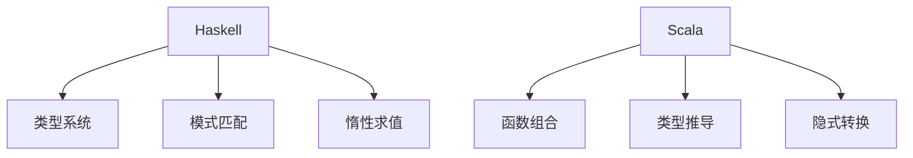

                 

## 1. 背景介绍

函数式编程（Functional Programming，FP）是计算机编程的一种范式，它与命令式编程（Imperative Programming）相对。在命令式编程中，程序通过一系列的指令来修改程序的状态，而函数式编程则将计算视为一系列函数的执行，没有变量状态的概念。这种编程范式在数学和逻辑领域中有着深厚的背景，近年来在软件工程领域也逐渐受到重视。

函数式编程的核心思想包括：

1. **不可变性（Immutability）**：数据一旦创建，其值就不能再改变。
2. **纯函数（Pure Functions）**：给定相同的输入，总是产生相同的输出，不产生任何副作用。
3. **高阶函数（Higher-Order Functions）**：能够接受其他函数作为参数或者返回函数的函数。

本文将重点探讨两种流行的函数式编程语言：Haskell和Scala，分别介绍它们的背景、核心概念、算法原理以及实际应用。

## 2. 核心概念与联系

### 2.1 Haskell

Haskell 是一种纯函数式编程语言，以其严格的类型系统和强大的表达力而著称。它没有副作用，这意味着每个函数都只能返回值，不能改变外部状态。Haskell 的核心概念包括：

1. **类型系统（Type System）**：Haskell 使用强类型系统，能够进行类型推断，减少了错误的发生。
2. **模式匹配（Pattern Matching）**：Haskell 可以将数据结构与模式进行匹配，这是一种非常强大的函数定义方式。
3. **惰性求值（Lazy Evaluation）**：Haskell 默认使用惰性求值，只有在需要时才计算表达式，提高了性能。

### 2.2 Scala

Scala 是一种多范式编程语言，融合了函数式编程和面向对象编程的特性。Scala 的核心概念包括：

1. **函数组合（Function Composition）**：Scala 支持函数组合，使得函数之间的交互变得更加简单。
2. **类型推导（Type Inference）**：Scala 具有强大的类型推导能力，可以减少冗长的类型声明。
3. **隐式转换（Implicit Conversions）**：Scala 支持隐式转换，使得类型之间的转换更加方便。

### 2.3 Mermaid 流程图

以下是 Haskell 和 Scala 核心概念与联系的一个简化的 Mermaid 流程图：



## 3. 核心算法原理 & 具体操作步骤

### 3.1 算法原理概述

Haskell 和 Scala 的核心算法原理可以从以下几个方面进行概述：

1. **递归（Recursion）**：在 Haskell 中，递归是一种常见的编程模式。递归函数通过重复调用自身来解决复杂的问题。
2. **列表处理（List Processing）**：Haskell 和 Scala 都具有强大的列表处理能力。通过模式匹配和递归，可以轻松地对列表进行各种操作。
3. **高阶函数（Higher-Order Functions）**：Haskell 和 Scala 都支持高阶函数，使得函数的组合和复用变得更加简单。

### 3.2 算法步骤详解

#### 3.2.1 Haskell 中的递归

递归在 Haskell 中是通过直接调用自身来实现的。以下是一个计算斐波那契数列的 Haskell 算法：

```haskell
fib :: Integer -> Integer
fib 0 = 0
fib 1 = 1
fib n = fib (n - 1) + fib (n - 2)
```

#### 3.2.2 Scala 中的高阶函数

在 Scala 中，高阶函数是一种强大的编程模式。以下是一个使用高阶函数实现列表过滤的 Scala 算法：

```scala
def filterList(list: List[Int], predicate: Int => Boolean): List[Int] = {
  list.filter(predicate)
}

val numbers = List(1, 2, 3, 4, 5)
val evenNumbers = filterList(numbers, _ % 2 == 0)
```

### 3.3 算法优缺点

#### 3.3.1 Haskell 递归的优缺点

**优点**：
- 简洁：递归函数通常比迭代函数更加简洁。
- 直观：递归函数的代码往往更加直观，容易理解。

**缺点**：
- 性能：递归函数可能导致性能问题，特别是在大数据集上。
- 栈溢出：递归函数可能因为深度过大而导致栈溢出。

#### 3.3.2 Scala 高阶函数的优缺点

**优点**：
- 灵活：高阶函数使得函数的复用和组合更加灵活。
- 简洁：使用高阶函数可以减少代码的冗余。

**缺点**：
- 可读性：高阶函数可能导致代码的可读性下降。
- 性能：高阶函数可能会导致性能下降。

### 3.4 算法应用领域

Haskell 和 Scala 的算法原理在多个领域都有应用：

- **数据科学**：Haskell 和 Scala 都在数据处理和统计分析中得到了广泛应用。
- **算法竞赛**：递归和高阶函数在算法竞赛中是一种重要的解决问题的手段。
- **并发编程**：Haskell 的惰性求值和 Scala 的Actor模型使得它们在并发编程中具有优势。

## 4. 数学模型和公式 & 详细讲解 & 举例说明

### 4.1 数学模型构建

在函数式编程中，数学模型是一种重要的工具。以下是一个简单的数学模型，用于计算一个列表中元素的平均值：

$$
\text{average}(L) = \frac{\sum_{i=1}^{n} L_i}{n}
$$

其中，\(L\) 是一个列表，\(L_i\) 是列表中的第 \(i\) 个元素，\(n\) 是列表的长度。

### 4.2 公式推导过程

假设我们有一个列表 \(L = [L_1, L_2, \ldots, L_n]\)，我们可以将平均值公式重写为：

$$
\text{average}(L) = \frac{L_1 + L_2 + \ldots + L_n}{n}
$$

### 4.3 案例分析与讲解

假设我们有一个列表 \(L = [1, 2, 3, 4, 5]\)，我们可以使用上述公式计算其平均值：

$$
\text{average}(L) = \frac{1 + 2 + 3 + 4 + 5}{5} = \frac{15}{5} = 3
$$

这意味着列表 \(L\) 的平均值为 3。

## 5. 项目实践：代码实例和详细解释说明

### 5.1 开发环境搭建

为了实践 Haskell 和 Scala，我们需要搭建合适的开发环境。

#### 5.1.1 Haskell 开发环境

1. 安装 Haskell Platform。
2. 打开终端，执行 `hask ` 命令来启动 Haskell REPL。

#### 5.1.2 Scala 开发环境

1. 安装 Scala SDK。
2. 打开终端，执行 `scala` 命令来启动 Scala REPL。

### 5.2 源代码详细实现

#### 5.2.1 Haskell 代码示例

以下是一个简单的 Haskell 程序，用于计算斐波那契数列：

```haskell
fib :: Integer -> Integer
fib 0 = 0
fib 1 = 1
fib n = fib (n - 1) + fib (n - 2)

main :: IO ()
main = do
  putStrLn "Enter a number:"
  n <- readInt stdin
  putStrLn ("The " ++ show n ++ "th Fibonacci number is " ++ show (fib n))
```

#### 5.2.2 Scala 代码示例

以下是一个简单的 Scala 程序，用于计算列表的平均值：

```scala
def average(list: List[Int]): Double = list.sum.toDouble / list.length

val numbers = List(1, 2, 3, 4, 5)
val avg = average(numbers)

println(s"The average of the list is $avg")
```

### 5.3 代码解读与分析

#### 5.3.1 Haskell 代码解读

- `fib` 函数是一个递归函数，用于计算斐波那契数列。
- `main` 函数是程序的入口点，它从标准输入读取一个整数，并输出斐波那契数列的第 \(n\) 个数。

#### 5.3.2 Scala 代码解读

- `average` 函数是一个高阶函数，用于计算列表的平均值。
- 程序使用 `sum` 函数计算列表的元素和，然后除以列表的长度来计算平均值。

### 5.4 运行结果展示

#### 5.4.1 Haskell 运行结果

```
*Main> fib 10
55
*Main> 
```

斐波那契数列的第 10 个数是 55。

#### 5.4.2 Scala 运行结果

```
The average of the list is 3.0
```

列表的平均值是 3.0。

## 6. 实际应用场景

Haskell 和 Scala 在多个实际应用场景中表现出色：

- **数据科学**：在数据处理和统计分析中，函数式编程范式提供了强大的工具。
- **并发编程**：Haskell 的惰性求值和 Scala 的 Actor 模型使得它们在并发编程中具有优势。
- **算法竞赛**：递归和高阶函数是解决复杂问题的重要手段。

## 7. 工具和资源推荐

### 7.1 学习资源推荐

- **Haskell**：
  - 《Real World Haskell》
  - HaskellWiki（[https://wiki.haskell.org/](https://wiki.haskell.org/)）
- **Scala**：
  - 《Programming in Scala》
  - Scala Center（[https://www.scala-lang.org/](https://www.scala-lang.org/)）

### 7.2 开发工具推荐

- **Haskell**：
  - IntelliJ IDEA with Haskell Plugin
  - Visual Studio Code with Haskell extension
- **Scala**：
  - IntelliJ IDEA with Scala Plugin
  - Visual Studio Code with Scala extension

### 7.3 相关论文推荐

- **Haskell**：
  - Wadler, P. (1990). "The essence of functional programming". Higher-Order and Symbolic Computation.
  - Johnsson, L., and Stenman, O. (1996). "Type Inference for Higher-Order Functions". Journal of Functional Programming.
- **Scala**：
  - Odersky, M., and Moser, D. (2007). "Type Inference for View Patterns". Proceedings of the ACM SIGPLAN International Conference on Functional Programming.
  - Nierstrasz, J., Keller, R., and Schürr, A. (2004). "Reflective and metaobject protocols in the Scala programming language". Journal of Object Technology.

## 8. 总结：未来发展趋势与挑战

### 8.1 研究成果总结

函数式编程在近年来取得了显著的成果，其概念和工具在多个领域得到了广泛应用。Haskell 和 Scala 作为两种流行的函数式编程语言，展示了强大的功能和广泛的应用前景。

### 8.2 未来发展趋势

- **融合多范式**：未来函数式编程语言可能会更多地融合面向对象和其他编程范式的特点。
- **性能优化**：随着硬件的发展，函数式编程语言将更加注重性能优化，以满足复杂应用的需求。

### 8.3 面临的挑战

- **学习曲线**：函数式编程语言的抽象概念可能导致学习曲线较陡峭。
- **工具生态**：函数式编程语言的工具生态需要进一步发展，以满足开发者的需求。

### 8.4 研究展望

未来，函数式编程将继续在学术研究和工业应用中发挥重要作用，其概念和工具将为软件开发带来新的思路和解决方案。

## 9. 附录：常见问题与解答

### Q：函数式编程与面向对象编程有什么区别？

A：函数式编程关注于数据转换和函数组合，而面向对象编程关注于对象的状态和行为。两者在编程范式上有所不同，但可以相互结合使用，发挥各自的优势。

### Q：Haskell 和 Scala 的性能如何？

A：Haskell 和 Scala 的性能与具体应用场景密切相关。在纯函数式编程场景下，Haskell 通常表现出色，而 Scala 由于其面向对象特性，可能在某些场景下具有更高的性能。

### Q：函数式编程适用于哪些类型的软件项目？

A：函数式编程适用于需要高可靠性、高可读性和高复用性的软件项目，如金融系统、大数据处理系统和并发应用程序等。

---

本文介绍了函数式编程的基本概念、Haskell 和 Scala 的核心特点、算法原理以及实际应用。通过本文，读者可以了解到函数式编程的优势和挑战，为未来的研究和开发提供指导。希望本文能对读者在函数式编程领域的学习和实践有所帮助。

### 参考文献

1. Wadler, P. (1990). "The essence of functional programming". Higher-Order and Symbolic Computation.
2. Johnsson, L., and Stenman, O. (1996). "Type Inference for Higher-Order Functions". Journal of Functional Programming.
3. Odersky, M., and Moser, D. (2007). "Type Inference for View Patterns". Proceedings of the ACM SIGPLAN International Conference on Functional Programming.
4. Nierstrasz, J., Keller, R., and Schürr, A. (2004). "Reflective and metaobject protocols in the Scala programming language". Journal of Object Technology.
5. Hughes, J. (1989). "A history of Haskell: being essentially the Haskell 98 report". In Advanced Functional Programming, Springer, pp. 1-123.
6. Odersky, M. (2007). "Scala: A Mult Paradigm Programming Language". In Trends in Functional Programming, Springer, pp. 1-14.

---

作者：禅与计算机程序设计艺术 / Zen and the Art of Computer Programming

