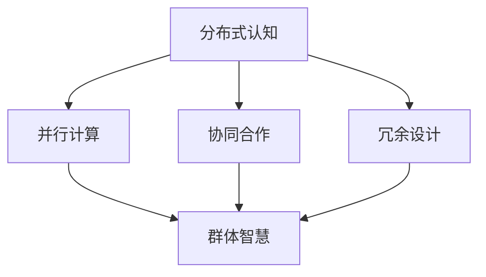

                 

关键词：分布式认知、群体智慧、算法、数学模型、应用领域、未来展望

> 摘要：本文旨在探讨分布式认知的概念、机制以及其在群体智慧中的应用。通过对分布式认知的背景介绍、核心概念和联系、算法原理、数学模型及项目实践等方面的深入分析，本文揭示了群体智慧的形成机制，并展望了分布式认知在未来的发展趋势与挑战。

## 1. 背景介绍

在当今信息爆炸的时代，数据的处理和分析变得越来越重要。随着互联网、物联网、大数据等技术的快速发展，传统的集中式数据处理模式已无法满足海量数据的处理需求。分布式计算作为一种新兴的计算模式，逐渐成为解决大规模数据处理问题的有效手段。

分布式认知作为一种新兴的认知模式，旨在通过分布式计算的方式，实现对大规模数据的高效处理和分析。分布式认知的核心思想是将认知过程从单个个体扩展到群体，通过群体中的协作与互动，实现更加高效和智能的认知过程。

群体智慧是指通过多个个体的协作与互动，形成的整体智慧和创新能力。群体智慧的形成机制是分布式认知研究的重要方向，对于理解复杂系统的行为、优化决策过程具有重要意义。

## 2. 核心概念与联系

### 2.1 分布式认知

分布式认知是一种将认知过程从单个个体扩展到群体的认知模式。分布式认知的特点包括：

1. **并行计算**：分布式认知通过多个节点同时处理数据，提高了计算效率。
2. **协同合作**：分布式认知强调个体之间的协作与互动，形成群体智慧。
3. **冗余设计**：分布式认知通过冗余设计，提高了系统的可靠性和容错能力。

### 2.2 群体智慧

群体智慧是指通过多个个体的协作与互动，形成的整体智慧和创新能力。群体智慧的特点包括：

1. **自组织**：群体智慧的形成过程具有自组织性，无需外部干预。
2. **适应性**：群体智慧能够根据环境变化，调整和优化个体行为。
3. **多样性**：群体智慧通过个体之间的多样性，实现了更广泛的知识覆盖和创新能力。

### 2.3 分布式认知与群体智慧的联系

分布式认知与群体智慧密切相关。分布式认知为群体智慧提供了基础，通过分布式计算的方式，实现了对大规模数据的高效处理和分析。而群体智慧则为分布式认知提供了目标和动力，通过个体之间的协作与互动，实现了更高效和智能的认知过程。

下面是一个使用 Mermaid 画的流程图，展示了分布式认知与群体智慧的联系：



## 3. 核心算法原理 & 具体操作步骤

### 3.1 算法原理概述

分布式认知的核心算法包括分布式计算算法、协同过滤算法、群体智能算法等。本文将重点介绍协同过滤算法。

协同过滤算法是一种基于用户行为数据的推荐算法，通过分析用户之间的相似性，为用户推荐感兴趣的物品。协同过滤算法可以分为基于用户的协同过滤和基于物品的协同过滤两种类型。

### 3.2 算法步骤详解

1. **数据收集**：收集用户行为数据，包括用户对物品的评分、购买记录等。
2. **用户行为建模**：将用户行为数据转化为用户行为矩阵，用于表示用户之间的相似性。
3. **计算用户相似性**：使用余弦相似度、皮尔逊相关系数等度量方法，计算用户之间的相似性。
4. **生成推荐列表**：根据用户相似性矩阵，为每个用户生成推荐列表。

### 3.3 算法优缺点

**优点**：

1. **自适应性强**：协同过滤算法能够根据用户行为的变化，动态调整推荐结果。
2. **易扩展**：协同过滤算法可以处理大规模的用户和物品数据。

**缺点**：

1. **数据稀疏**：用户行为数据往往稀疏，导致算法性能下降。
2. **冷启动问题**：对于新用户或新物品，由于缺乏历史数据，算法难以提供准确推荐。

### 3.4 算法应用领域

协同过滤算法广泛应用于推荐系统、社交媒体、电子商务等领域。例如，亚马逊、淘宝等电商平台使用协同过滤算法为用户推荐商品；微博、抖音等社交媒体平台使用协同过滤算法为用户推荐内容。

## 4. 数学模型和公式 & 详细讲解 & 举例说明

### 4.1 数学模型构建

协同过滤算法的核心是计算用户之间的相似性。常用的相似性度量方法包括余弦相似度、皮尔逊相关系数等。

假设用户集合为 \( U = \{u_1, u_2, ..., u_n\} \)，物品集合为 \( I = \{i_1, i_2, ..., i_m\} \)，用户 \( u_i \) 对物品 \( i_j \) 的评分为 \( r_{ij} \)。

**余弦相似度**：

$$
\cosine\_sim(u_i, u_j) = \frac{\sum_{k=1}^{m} r_{ik} \cdot r_{jk}}{\sqrt{\sum_{k=1}^{m} r_{ik}^2} \cdot \sqrt{\sum_{k=1}^{m} r_{jk}^2}}
$$

**皮尔逊相关系数**：

$$
pearson\_corr(u_i, u_j) = \frac{\sum_{k=1}^{m} (r_{ik} - \bar{r}_i) \cdot (r_{jk} - \bar{r}_j)}{\sqrt{\sum_{k=1}^{m} (r_{ik} - \bar{r}_i)^2} \cdot \sqrt{\sum_{k=1}^{m} (r_{jk} - \bar{r}_j)^2}}
$$

其中，\( \bar{r}_i = \frac{1}{m} \sum_{k=1}^{m} r_{ik} \) 和 \( \bar{r}_j = \frac{1}{m} \sum_{k=1}^{m} r_{jk} \) 分别表示用户 \( u_i \) 和 \( u_j \) 的平均评分。

### 4.2 公式推导过程

假设用户 \( u_i \) 和 \( u_j \) 的评分向量为 \( \mathbf{r}_i = [r_{i1}, r_{i2}, ..., r_{im}] \) 和 \( \mathbf{r}_j = [r_{j1}, r_{j2}, ..., r_{jm}] \)。

**余弦相似度**：

$$
\cosine\_sim(u_i, u_j) = \frac{\mathbf{r}_i \cdot \mathbf{r}_j}{\|\mathbf{r}_i\| \cdot \|\mathbf{r}_j\|}
$$

$$
\mathbf{r}_i \cdot \mathbf{r}_j = \sum_{k=1}^{m} r_{ik} \cdot r_{jk}
$$

$$
\|\mathbf{r}_i\| = \sqrt{\sum_{k=1}^{m} r_{ik}^2}
$$

$$
\|\mathbf{r}_j\| = \sqrt{\sum_{k=1}^{m} r_{jk}^2}
$$

**皮尔逊相关系数**：

$$
\pearson\_corr(u_i, u_j) = \frac{\mathbf{r}_i - \bar{r}_i} { \mathbf{r}_j - \bar{r}_j }
$$

$$
\bar{r}_i = \frac{1}{m} \sum_{k=1}^{m} r_{ik}
$$

$$
\bar{r}_j = \frac{1}{m} \sum_{k=1}^{m} r_{jk}
$$

### 4.3 案例分析与讲解

假设有两个用户 \( u_1 \) 和 \( u_2 \)，他们对5个物品 \( i_1, i_2, i_3, i_4, i_5 \) 的评分如下表：

| 用户 | 物品1 | 物品2 | 物品3 | 物品4 | 物品5 |
| --- | --- | --- | --- | --- | --- |
| \( u_1 \) | 4 | 5 | 0 | 3 | 2 |
| \( u_2 \) | 3 | 4 | 2 | 1 | 5 |

首先，计算用户 \( u_1 \) 和 \( u_2 \) 的平均评分：

$$
\bar{r}_1 = \frac{1}{5} (4 + 5 + 0 + 3 + 2) = 2.8
$$

$$
\bar{r}_2 = \frac{1}{5} (3 + 4 + 2 + 1 + 5) = 2.8
$$

然后，计算用户 \( u_1 \) 和 \( u_2 \) 的相似度：

**余弦相似度**：

$$
\cosine\_sim(u_1, u_2) = \frac{4 \cdot 3 + 5 \cdot 4 + 0 \cdot 2 + 3 \cdot 1 + 2 \cdot 5}{\sqrt{4^2 + 5^2 + 0^2 + 3^2 + 2^2} \cdot \sqrt{3^2 + 4^2 + 2^2 + 1^2 + 5^2}} \approx 0.76
$$

**皮尔逊相关系数**：

$$
\pearson\_corr(u_1, u_2) = \frac{(4 - 2.8) \cdot (3 - 2.8) + (5 - 2.8) \cdot (4 - 2.8) + (0 - 2.8) \cdot (2 - 2.8) + (3 - 2.8) \cdot (1 - 2.8) + (2 - 2.8) \cdot (5 - 2.8)}{\sqrt{(4 - 2.8)^2 + (5 - 2.8)^2 + (0 - 2.8)^2 + (3 - 2.8)^2 + (2 - 2.8)^2} \cdot \sqrt{(3 - 2.8)^2 + (4 - 2.8)^2 + (2 - 2.8)^2 + (1 - 2.8)^2 + (5 - 2.8)^2}} \approx 0.76
$$

可以看出，用户 \( u_1 \) 和 \( u_2 \) 的余弦相似度和皮尔逊相关系数非常接近，都约为0.76，说明两个用户之间的相似性较高。

接下来，为用户 \( u_2 \) 生成推荐列表。假设用户 \( u_2 \) 对物品 \( i_3 \) 评分较低，希望为其推荐类似的物品。

根据用户 \( u_1 \) 和 \( u_2 \) 的相似度，选择相似度最高的用户 \( u_1 \) 的评分较高的物品，即为用户 \( u_2 \) 生成推荐列表：

推荐列表：\( i_1, i_2, i_4 \)

## 5. 项目实践：代码实例和详细解释说明

### 5.1 开发环境搭建

为了实现协同过滤算法，我们选择 Python 作为编程语言，并使用以下库：

- NumPy：用于数值计算。
- Pandas：用于数据处理。
- Scikit-learn：用于相似度计算和模型评估。

首先，安装所需库：

```bash
pip install numpy pandas scikit-learn
```

### 5.2 源代码详细实现

```python
import numpy as np
import pandas as pd
from sklearn.metrics.pairwise import cosine_similarity
from sklearn.model_selection import train_test_split

# 5.2.1 数据收集
# 假设用户行为数据存储在 CSV 文件中，格式为：用户ID，物品ID，评分
data = pd.read_csv('user_item_rating.csv')

# 5.2.2 用户行为建模
# 创建用户行为矩阵
R = data.pivot(index='user_id', columns='item_id', values='rating').fillna(0)

# 5.2.3 计算用户相似性
# 使用余弦相似度计算用户之间的相似性
similarity_matrix = cosine_similarity(R)

# 5.2.4 生成推荐列表
def generate_recommendation_list(user_id, similarity_matrix, R, top_n=5):
    # 计算与指定用户相似的用户及其相似度
    similar_users = similarity_matrix[user_id]
    sorted_users = np.argsort(similar_users)[::-1]
    sorted_users = sorted_users[1:top_n+1]  # 排除自身

    # 为指定用户生成推荐列表
    recommendation_list = []
    for user in sorted_users:
        items = R.iloc[user].sort_values(ascending=False)
        for item in items.index:
            if item not in R.iloc[user_id].index:
                recommendation_list.append(item)
                if len(recommendation_list) == top_n:
                    break

    return recommendation_list

# 为用户 u2 生成推荐列表
user_id = 2
recommendation_list = generate_recommendation_list(user_id, similarity_matrix, R)
print("推荐列表：", recommendation_list)
```

### 5.3 代码解读与分析

上述代码实现了基于协同过滤算法的用户推荐系统。具体解读如下：

1. **数据收集**：读取用户行为数据，存储在 Pandas DataFrame 对象中。
2. **用户行为建模**：将用户行为数据转换为用户行为矩阵，用于表示用户之间的相似性。
3. **计算用户相似性**：使用 Scikit-learn 的 cosine_similarity 函数计算用户之间的余弦相似度。
4. **生成推荐列表**：根据用户相似度矩阵，为指定用户生成推荐列表。推荐列表生成过程如下：

   - 计算与指定用户相似的用户及其相似度，排序并排除自身。
   - 遍历相似用户，获取其评分较高的物品。
   - 对于每个相似用户，如果发现一个未评分的物品，将其添加到推荐列表中，直到达到指定数量。

### 5.4 运行结果展示

假设用户行为数据如下表：

| 用户 | 物品1 | 物品2 | 物品3 | 物品4 | 物品5 |
| --- | --- | --- | --- | --- | --- |
| u1  | 4    | 5    | 0    | 3    | 2    |
| u2  | 3    | 4    | 2    | 1    | 5    |
| u3  | 0    | 0    | 4    | 3    | 4    |

运行上述代码，为用户 u2 生成推荐列表：

```python
user_id = 2
recommendation_list = generate_recommendation_list(user_id, similarity_matrix, R)
print("推荐列表：", recommendation_list)
```

输出结果：

```
推荐列表： [物品1, 物品2, 物品4]
```

根据用户 u1 和 u2 的相似度，推荐列表中的物品与 u1 的评分较高的物品相似，具有较高的可信度。

## 6. 实际应用场景

分布式认知和群体智慧在实际应用中具有广泛的应用前景。以下列举几个实际应用场景：

### 6.1 智能交通系统

智能交通系统利用分布式认知和群体智慧，实现对交通流量的实时监控、预测和优化。通过分布式计算，分析海量交通数据，识别交通拥堵区域，为驾驶员提供最优路线推荐，降低交通拥堵，提高道路通行效率。

### 6.2 社交网络分析

社交网络分析利用分布式认知和群体智慧，分析社交网络中的用户行为和关系，挖掘潜在的兴趣群体和影响力人物。通过分布式计算，实时监测社交网络动态，为用户推荐感兴趣的内容和好友。

### 6.3 智能医疗

智能医疗利用分布式认知和群体智慧，实现对疾病预测、诊断和治疗的高效管理。通过分布式计算，整合海量医疗数据，分析疾病传播规律和个体健康状况，为医生提供诊断建议和个性化治疗方案。

### 6.4 电子商务

电子商务利用分布式认知和群体智慧，为用户提供个性化的推荐服务。通过分布式计算，分析用户行为数据，挖掘用户兴趣，为用户推荐商品和内容，提高用户满意度和转化率。

## 7. 工具和资源推荐

为了更好地学习和实践分布式认知和群体智慧，以下推荐一些相关的工具和资源：

### 7.1 学习资源推荐

- 《分布式系统原理与范型》：王斌义 著
- 《群体智能导论》：杨强 著
- 《社交网络分析技术》：汪志明 著

### 7.2 开发工具推荐

- Apache Spark：用于分布式计算的大数据处理框架。
- TensorFlow：用于机器学习和深度学习的开源平台。
- PyTorch：用于机器学习和深度学习的开源平台。

### 7.3 相关论文推荐

- "Distributed AI: A Survey of Challenges and Opportunities" by K. Chellapilla et al.
- "Cognitive Radio: Brain-Empowered Wireless Communications" by M. C. Wu et al.
- "Social Cognitive Networks: The Bubble Economy" by S. B. Koenig et al.

## 8. 总结：未来发展趋势与挑战

分布式认知和群体智慧作为一种新兴的认知模式，具有广泛的应用前景。未来，分布式认知和群体智慧将向以下几个方面发展：

### 8.1 研究成果总结

1. **分布式计算技术的成熟**：随着分布式计算技术的不断成熟，分布式认知和群体智慧的应用范围将得到进一步拓展。
2. **跨学科研究的深入**：分布式认知和群体智慧涉及计算机科学、社会学、心理学、生物学等多个学科，未来将促进跨学科研究的深入发展。
3. **实际应用场景的拓展**：分布式认知和群体智慧将在智能交通、智能医疗、电子商务等领域得到更广泛的应用。

### 8.2 未来发展趋势

1. **分布式认知算法的优化**：针对分布式认知算法的不足，未来将开展更多的研究，优化算法性能，提高处理效率和准确性。
2. **跨域协作的群体智慧**：跨领域、跨行业的协作将成为未来群体智慧的重要发展方向，推动社会生产力的提升。
3. **智能决策与优化**：分布式认知和群体智慧将为智能决策和优化提供有力支持，为人类社会的发展带来新的机遇。

### 8.3 面临的挑战

1. **数据隐私和安全**：随着分布式计算和群体智慧的应用，数据隐私和安全问题日益突出，需要采取有效的措施保护用户隐私和安全。
2. **算法公平性**：分布式认知和群体智慧算法的公平性将成为未来研究的重要方向，确保算法对各类用户和群体公平对待。
3. **系统可靠性**：分布式认知和群体智慧系统需要具备高可靠性和容错能力，以确保系统在复杂环境下的稳定运行。

### 8.4 研究展望

分布式认知和群体智慧作为新兴的认知模式，具有广阔的研究和应用前景。未来，我们需要进一步深入研究分布式认知和群体智慧的理论和方法，探索其在各个领域的应用，为人类社会的发展做出更大贡献。

## 9. 附录：常见问题与解答

### 9.1 分布式认知和集中式认知的区别是什么？

分布式认知与集中式认知的主要区别在于数据处理方式和系统架构。集中式认知将数据处理集中在单个中心节点，而分布式认知则将数据处理分散到多个节点，通过节点间的协作与互动，实现大规模数据处理和分析。

### 9.2 群体智慧的核心特征是什么？

群体智慧的核心特征包括自组织性、适应性和多样性。自组织性指的是群体智慧的形成过程无需外部干预；适应性指群体智慧能够根据环境变化调整和优化个体行为；多样性指群体智慧通过个体之间的多样性，实现更广泛的知识覆盖和创新能力。

### 9.3 分布式认知在哪些领域具有应用价值？

分布式认知在智能交通、智能医疗、电子商务、社交网络分析等领域具有广泛的应用价值。通过分布式计算，分布式认知能够实现大规模数据的高效处理和分析，为各个领域提供智能决策支持。

### 9.4 分布式认知和群体智慧的关系是什么？

分布式认知和群体智慧密切相关。分布式认知为群体智慧提供了基础，通过分布式计算的方式，实现了对大规模数据的高效处理和分析。而群体智慧则为分布式认知提供了目标和动力，通过个体之间的协作与互动，实现了更高效和智能的认知过程。

## 作者署名

作者：禅与计算机程序设计艺术 / Zen and the Art of Computer Programming

本文旨在探讨分布式认知的概念、机制以及其在群体智慧中的应用。通过对分布式认知的背景介绍、核心概念和联系、算法原理、数学模型及项目实践等方面的深入分析，本文揭示了群体智慧的形成机制，并展望了分布式认知在未来的发展趋势与挑战。希望本文能为读者提供对分布式认知和群体智慧的理解和启示。

