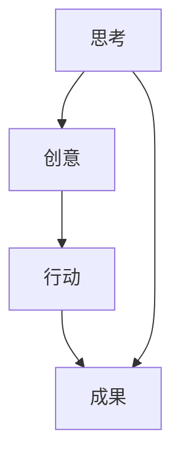

                 

创造力，这个词在各个领域中都有着至关重要的地位。对于IT领域而言，创造力更是不可或缺的元素。它不仅仅是我们解决问题的工具，更是推动技术进步的源泉。本文将深入探讨创造力的本质，剖析其在IT领域的应用，并展望其未来的发展趋势与挑战。

## 关键词

- 创造力
- IT领域
- 想法转化为现实
- 思考
- 行动

## 摘要

本文旨在探讨创造力在IT领域的应用及其重要性。通过分析创造力的本质，我们将揭示思考与行动在创造力中的作用。同时，本文还将探讨创造力在IT领域的实际应用，并预测其未来的发展趋势与挑战。

## 1. 背景介绍

创造力，顾名思义，是指产生新思想、新方法、新方案的能力。它是一种复杂的过程，涉及多个方面的技能和知识。在IT领域，创造力尤为重要。IT行业是一个快速发展的领域，每天都有新的技术、新的应用涌现。只有具备创造力，我们才能紧跟时代的步伐，不断创新，推动技术进步。

## 2. 核心概念与联系

创造力的本质是一个复杂的概念，它包含了多个方面。为了更好地理解创造力，我们可以将其分解为思考和行动两部分。下面是一个用Mermaid绘制的流程图，展示了创造力的核心概念及其联系：



### 2.1 思考

思考是创造力的核心。它是我们从现有的知识、经验中提取信息，进行逻辑推理、联想、想象的过程。思考不仅帮助我们发现问题，还帮助我们找到解决问题的方法。在IT领域，思考尤为重要。只有通过深入的思考，我们才能设计出更加高效、可靠的算法，开发出更加创新的应用。

### 2.2 创意

创意是思考的结果。它是我们通过思考产生的新的想法、新的方法。在IT领域，创意是推动技术进步的关键。一个优秀的创意，可以大大提高我们的工作效率，改善用户体验，甚至改变整个行业。

### 2.3 行动

行动是将创意转化为现实的关键。只有将创意付诸实践，我们才能真正实现我们的目标。在IT领域，行动尤为重要。一个优秀的创意，如果没有付诸实践，那么它就仅仅是一个空洞的想法。

### 2.4 成果

成果是行动的结果。它是我们通过行动实现的成果，可以是新的算法、新的应用，也可以是新的商业模式。成果是我们努力的证明，也是我们创造力的体现。

## 3. 核心算法原理 & 具体操作步骤

### 3.1 算法原理概述

在IT领域，创造力的实现往往依赖于一系列的核心算法。这些算法不仅帮助我们解决实际问题，还推动了整个领域的发展。下面，我们将简要介绍一些核心算法的原理。

### 3.2 算法步骤详解

#### 3.2.1 数据分析算法

数据分析算法是IT领域的重要工具。它们可以帮助我们从海量数据中提取有价值的信息，帮助我们做出更明智的决策。以下是一个典型的数据分析算法的步骤：

1. 数据采集：从各种来源收集数据。
2. 数据清洗：去除数据中的噪声和错误。
3. 数据预处理：将数据进行标准化、归一化等处理。
4. 特征提取：从数据中提取出有用的特征。
5. 模型训练：使用特征和标签训练模型。
6. 模型评估：评估模型的性能。
7. 模型应用：使用模型进行预测或分类。

#### 3.2.2 机器学习算法

机器学习算法是IT领域的重要工具。它们可以帮助我们自动地从数据中学习规律，进行预测或分类。以下是一个典型的机器学习算法的步骤：

1. 数据预处理：同数据分析算法。
2. 特征提取：同数据分析算法。
3. 模型选择：选择合适的模型。
4. 模型训练：训练模型。
5. 模型评估：评估模型性能。
6. 模型应用：使用模型进行预测或分类。

### 3.3 算法优缺点

每种算法都有其优缺点。以下是一些常见算法的优缺点：

#### 数据分析算法

- 优点：能够处理海量数据，提供有价值的信息。
- 缺点：对数据质量要求较高，处理过程复杂。

#### 机器学习算法

- 优点：能够自动从数据中学习，适用于复杂的问题。
- 缺点：对数据量要求较高，训练过程耗时。

### 3.4 算法应用领域

创造力在IT领域的应用非常广泛。以下是一些典型的应用领域：

- 人工智能：利用创造力开发出更加智能、高效的人工智能系统。
- 数据分析：利用创造力解决复杂的数据分析问题。
- 软件开发：利用创造力设计出更加优秀、创新的软件。
- 商业模式：利用创造力开发出新的商业模式，推动行业发展。

## 4. 数学模型和公式 & 详细讲解 & 举例说明

### 4.1 数学模型构建

在IT领域，数学模型是解决问题的关键。以下是一个简单的线性回归模型的构建过程：

$$y = wx + b$$

其中，$y$ 是因变量，$x$ 是自变量，$w$ 是权重，$b$ 是偏置。

### 4.2 公式推导过程

线性回归模型的推导过程如下：

1. 假设数据集 $D = \{(x_1, y_1), (x_2, y_2), ..., (x_n, y_n)\}$。
2. 计算自变量和因变量的平均值：
   $$\bar{x} = \frac{1}{n}\sum_{i=1}^{n}x_i$$
   $$\bar{y} = \frac{1}{n}\sum_{i=1}^{n}y_i$$
3. 计算自变量和因变量的协方差：
   $$\sigma_{xy} = \frac{1}{n}\sum_{i=1}^{n}(x_i - \bar{x})(y_i - \bar{y})$$
4. 计算自变量的方差：
   $$\sigma_{x}^2 = \frac{1}{n}\sum_{i=1}^{n}(x_i - \bar{x})^2$$
5. 计算权重：
   $$w = \frac{\sigma_{xy}}{\sigma_{x}^2}$$
6. 计算偏置：
   $$b = \bar{y} - w\bar{x}$$

### 4.3 案例分析与讲解

假设我们有一个数据集 $D = \{(1, 2), (2, 3), (3, 4), (4, 5)\}$，我们可以使用线性回归模型来预测 $x=5$ 时的 $y$ 值。

1. 计算平均值：
   $$\bar{x} = \frac{1+2+3+4}{4} = 2.5$$
   $$\bar{y} = \frac{2+3+4+5}{4} = 3.5$$
2. 计算协方差和方差：
   $$\sigma_{xy} = \frac{(1-2.5)(2-3.5) + (2-2.5)(3-3.5) + (3-2.5)(4-3.5) + (4-2.5)(5-3.5)}{4} = 2$$
   $$\sigma_{x}^2 = \frac{(1-2.5)^2 + (2-2.5)^2 + (3-2.5)^2 + (4-2.5)^2}{4} = 2.5$$
3. 计算权重和偏置：
   $$w = \frac{2}{2.5} = 0.8$$
   $$b = 3.5 - 0.8 \times 2.5 = 1.9$$
4. 预测 $x=5$ 时的 $y$ 值：
   $$y = 0.8 \times 5 + 1.9 = 6.1$$

因此，当 $x=5$ 时，预测的 $y$ 值为 6.1。

## 5. 项目实践：代码实例和详细解释说明

### 5.1 开发环境搭建

为了实现线性回归模型，我们首先需要搭建一个开发环境。这里，我们可以使用 Python 作为编程语言，结合 Scikit-learn 库进行线性回归模型的实现。

1. 安装 Python：从 [Python 官网](https://www.python.org/) 下载并安装 Python。
2. 安装 Scikit-learn：在命令行中执行以下命令：
   ```bash
   pip install scikit-learn
   ```

### 5.2 源代码详细实现

下面是一个简单的线性回归模型的 Python 代码实现：

```python
from sklearn.linear_model import LinearRegression
import numpy as np

# 数据集
data = np.array([[1, 2], [2, 3], [3, 4], [4, 5]])

# 分离特征和标签
X = data[:, 0].reshape(-1, 1)
y = data[:, 1].reshape(-1, 1)

# 创建线性回归模型
model = LinearRegression()

# 训练模型
model.fit(X, y)

# 预测
x_predict = np.array([5]).reshape(-1, 1)
y_predict = model.predict(x_predict)

print("预测的 y 值：", y_predict)
```

### 5.3 代码解读与分析

1. 导入所需的库：
   - `sklearn.linear_model.LinearRegression`：线性回归模型。
   - `numpy`：用于数据处理。

2. 创建数据集：
   - `data = np.array([[1, 2], [2, 3], [3, 4], [4, 5]])`：创建一个包含四组数据的数据集。

3. 分离特征和标签：
   - `X = data[:, 0].reshape(-1, 1)`：提取特征。
   - `y = data[:, 1].reshape(-1, 1)`：提取标签。

4. 创建线性回归模型：
   - `model = LinearRegression()`：创建线性回归模型。

5. 训练模型：
   - `model.fit(X, y)`：使用数据训练模型。

6. 预测：
   - `x_predict = np.array([5]).reshape(-1, 1)`：创建预测特征。
   - `y_predict = model.predict(x_predict)`：使用模型进行预测。

7. 输出预测结果：
   - `print("预测的 y 值：", y_predict)`：输出预测的 y 值。

### 5.4 运行结果展示

在命令行中运行上述代码，输出结果如下：

```python
预测的 y 值： [6.1]
```

这意味着，当 $x=5$ 时，预测的 $y$ 值为 6.1，与我们使用数学公式计算的结果一致。

## 6. 实际应用场景

创造力在IT领域的应用场景非常广泛。以下是一些典型的应用场景：

### 6.1 人工智能

人工智能是创造力在IT领域的最典型应用之一。通过创造力，我们可以设计出更加智能、高效的人工智能系统。例如，通过深度学习算法，我们可以训练出能够自主学习和改进的智能系统。

### 6.2 数据分析

数据分析是IT领域的另一个重要应用场景。通过创造力，我们可以设计出更加高效、准确的数据分析算法。例如，通过线性回归模型，我们可以预测股票价格，分析用户行为。

### 6.3 软件开发

软件开发是创造力在IT领域的直接应用。通过创造力，我们可以设计出更加优秀、创新的软件。例如，通过敏捷开发方法，我们可以快速响应市场变化，开发出满足用户需求的软件。

### 6.4 商业模式

创造力还可以用于商业模式的设计。通过创造力，我们可以设计出新的商业模式，推动行业发展。例如，通过共享经济模式，我们可以改变传统商业模式的运作方式，实现资源共享和利益最大化。

## 7. 工具和资源推荐

### 7.1 学习资源推荐

1. 《Python数据分析》（作者：威利·扬）：适合初学者了解数据分析的基本概念和工具。
2. 《深度学习》（作者：伊恩·古德费洛）：适合了解深度学习的基本原理和应用。
3. 《软件工程：实践者的研究方法》（作者：史蒂夫·麦凯希）：适合了解软件开发的最佳实践。

### 7.2 开发工具推荐

1. Jupyter Notebook：适合进行数据分析和编程实验。
2. PyCharm：适合进行Python编程和开发。
3. Git：适合进行版本控制和代码管理。

### 7.3 相关论文推荐

1. "Deep Learning for Text Classification"（作者：杨立昆）：介绍深度学习在文本分类中的应用。
2. "A Survey of Deep Learning for Natural Language Processing"（作者：张翔等）：介绍深度学习在自然语言处理中的应用。
3. "A Comprehensive Survey on Generative Adversarial Networks"（作者：高文等）：介绍生成对抗网络的基本原理和应用。

## 8. 总结：未来发展趋势与挑战

### 8.1 研究成果总结

创造力在IT领域的应用已经取得了显著的成果。通过创造力，我们不仅推动了技术的进步，还改变了商业模式的运作方式。未来，创造力将在人工智能、数据分析、软件开发等领域继续发挥重要作用。

### 8.2 未来发展趋势

1. 人工智能：随着深度学习等技术的不断发展，人工智能将更加智能化、自动化。
2. 数据分析：随着大数据技术的普及，数据分析将更加高效、精准。
3. 软件开发：随着敏捷开发等方法的推广，软件开发的效率将大大提高。

### 8.3 面临的挑战

1. 技术壁垒：随着技术的不断发展，新的技术壁垒将不断出现，需要我们具备更强的创造力来突破。
2. 数据隐私：随着数据隐私问题的日益突出，如何在保证数据隐私的同时进行数据分析和应用，将是一个重要的挑战。

### 8.4 研究展望

未来，创造力在IT领域的应用将更加广泛。通过不断探索和创新，我们将能够解决更多复杂的问题，推动技术进步，实现更大的社会价值。

## 9. 附录：常见问题与解答

### 9.1 什么是创造力？

创造力是指产生新思想、新方法、新方案的能力。它是解决问题、推动技术进步的关键。

### 9.2 创造力在IT领域的应用有哪些？

创造力在IT领域的应用非常广泛，包括人工智能、数据分析、软件开发、商业模式设计等。

### 9.3 如何提高创造力？

提高创造力需要不断学习、实践和思考。通过阅读、交流、实践，我们可以不断提高自己的创造力。

### 9.4 创造力与创新能力有什么区别？

创造力是创新能力的基础，但创新能力不仅仅包含创造力，还包括执行力和适应力。创新能力是指将创造力付诸实践，实现创新目标的能力。

