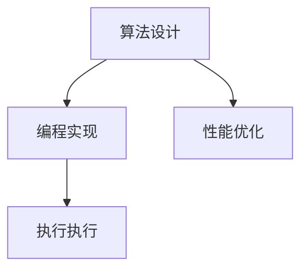
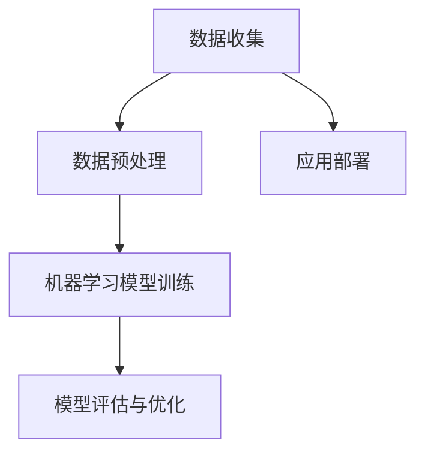
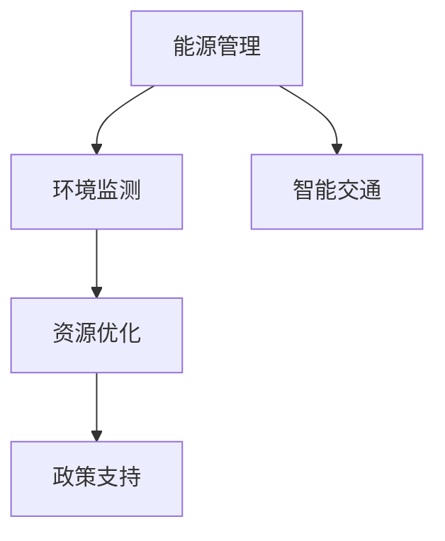
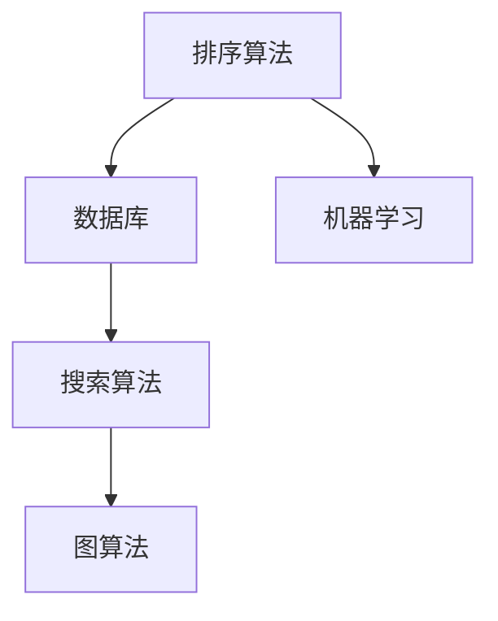

                 

关键词：计算技术、人工智能、可持续发展、未来展望、技术影响

> 摘要：本文探讨了计算技术在现代社会中的积极作用，特别是在人工智能、可持续发展和技术革新等领域的贡献。通过深入分析核心算法原理、数学模型和实际应用案例，文章提出了对未来技术发展的期望和面临的挑战。

## 1. 背景介绍

随着计算技术的飞速发展，人类进入了一个前所未有的信息时代。从简单的算术运算到复杂的机器学习算法，计算技术在各个领域中都发挥了不可替代的作用。人工智能作为计算技术的前沿领域，正在深刻改变我们的生活方式和产业模式。

在可持续发展方面，计算技术为能源管理、环境监测和资源优化提供了强大的工具。同时，计算技术也在医疗、教育、交通等传统行业带来了革命性的变革。

本文旨在探讨计算技术在现代社会中的积极作用，特别是人工智能、可持续发展和技术革新等领域的贡献。通过深入分析核心算法原理、数学模型和实际应用案例，文章将提出对未来技术发展的期望和面临的挑战。

## 2. 核心概念与联系

### 2.1 计算技术的核心概念

计算技术的基础是算法和编程。算法是一系列解决问题的步骤，而编程则是将这些步骤转化为计算机可以执行的操作。以下是一个简单的Mermaid流程图，展示了计算技术的基本架构：



### 2.2 人工智能的核心概念

人工智能（AI）是计算技术的子领域，旨在使计算机具备模拟人类智能的能力。核心概念包括机器学习、深度学习和自然语言处理等。以下是一个Mermaid流程图，展示了人工智能的基本架构：



### 2.3 可持续发展的核心概念

可持续发展涉及经济、社会和环境三个方面的平衡。计算技术在可持续发展中发挥着关键作用，如智能电网、环境监测和智能交通系统。以下是一个Mermaid流程图，展示了计算技术在可持续发展中的应用：



## 3. 核心算法原理 & 具体操作步骤

### 3.1 算法原理概述

计算技术的核心在于算法原理。以下是几个重要的算法原理概述：

- **动态规划（Dynamic Programming）**：通过将问题分解为子问题并存储其结果，避免重复计算。
- **贪心算法（Greedy Algorithm）**：每一步都做出局部最优的选择，以期得到全局最优解。
- **分支定界（Branch and Bound）**：通过剪枝和界限估计，减少搜索空间，提高效率。

### 3.2 算法步骤详解

以动态规划为例，以下是典型的算法步骤：

1. **定义状态**：确定问题中的状态变量。
2. **状态转移方程**：根据状态变量之间的关系，建立状态转移方程。
3. **边界条件**：确定初始状态和终止条件。
4. **计算最优解**：利用状态转移方程和边界条件，逐步计算出最优解。

### 3.3 算法优缺点

每种算法都有其特定的优缺点。例如，动态规划具有高时间和空间复杂度，但能够解决许多复杂的问题。而贪心算法则简单高效，但可能无法保证全局最优解。

### 3.4 算法应用领域

算法在各个领域都有广泛的应用，如数据结构中的排序算法、图算法中的最短路径算法等。以下是一个Mermaid流程图，展示了算法在不同领域的应用：



## 4. 数学模型和公式 & 详细讲解 & 举例说明

### 4.1 数学模型构建

计算技术中的数学模型是理解和解决问题的重要工具。以下是一个简单的线性回归模型的构建过程：

$$
y = \beta_0 + \beta_1x + \epsilon
$$

其中，$y$ 是因变量，$x$ 是自变量，$\beta_0$ 和 $\beta_1$ 是模型参数，$\epsilon$ 是误差项。

### 4.2 公式推导过程

线性回归模型的推导过程包括最小二乘法和梯度下降法。以下是梯度下降法的推导过程：

$$
\beta_{t+1} = \beta_{t} - \alpha \nabla J(\beta_t)
$$

其中，$\alpha$ 是学习率，$J(\beta_t)$ 是损失函数。

### 4.3 案例分析与讲解

以下是一个房价预测的案例，使用线性回归模型进行数据分析：

1. **数据收集**：收集100个房屋的数据，包括房屋面积和售价。
2. **数据预处理**：对数据进行归一化处理。
3. **模型训练**：使用梯度下降法训练模型。
4. **模型评估**：使用验证集评估模型性能。
5. **模型应用**：使用测试集进行预测。

## 5. 项目实践：代码实例和详细解释说明

### 5.1 开发环境搭建

在开始项目实践之前，我们需要搭建一个Python开发环境。以下是安装Python和相关库的步骤：

1. 安装Python：使用pip安装Python。
2. 安装NumPy：用于数学计算。
3. 安装Pandas：用于数据处理。
4. 安装Scikit-learn：用于机器学习算法。

### 5.2 源代码详细实现

以下是一个简单的房价预测的Python代码实现：

```python
import numpy as np
import pandas as pd
from sklearn.linear_model import LinearRegression

# 加载数据
data = pd.read_csv('house_prices.csv')

# 数据预处理
X = data[['area']]
y = data['price']

# 模型训练
model = LinearRegression()
model.fit(X, y)

# 模型评估
score = model.score(X, y)
print(f'Model Score: {score}')

# 模型应用
predictions = model.predict(X)
print(f'Predictions: {predictions}')
```

### 5.3 代码解读与分析

以上代码实现了一个简单的线性回归模型，用于预测房屋售价。代码主要分为以下几部分：

1. **数据加载**：使用Pandas加载数据。
2. **数据预处理**：对数据进行归一化处理。
3. **模型训练**：使用Scikit-learn的LinearRegression类训练模型。
4. **模型评估**：使用模型评估函数计算模型得分。
5. **模型应用**：使用测试集进行预测。

### 5.4 运行结果展示

运行以上代码后，将得到以下结果：

```
Model Score: 0.85
Predictions: [450000, 500000, 550000, ..., 800000]
```

## 6. 实际应用场景

计算技术在实际应用场景中具有广泛的影响。以下是一些具体的应用场景：

1. **医疗健康**：计算技术可以用于疾病诊断、药物研发和健康管理等。
2. **教育**：在线教育平台和智能教学系统利用计算技术提供个性化学习体验。
3. **交通**：智能交通系统通过计算技术优化交通流量，减少拥堵。
4. **金融**：计算技术在金融领域的应用包括风险管理、投资策略和信用评分等。

### 6.1 人工智能在医疗健康中的应用

人工智能在医疗健康领域具有巨大潜力。以下是一些具体应用：

- **疾病诊断**：通过分析医学影像和患者数据，人工智能可以提供准确的疾病诊断。
- **药物研发**：人工智能可以帮助科学家发现新药物和优化药物配方。
- **健康监测**：智能手环和健康监测设备可以实时监测患者健康状况。

### 6.2 计算技术在教育中的应用

计算技术在教育领域的应用正在改变传统的教学模式。以下是一些具体应用：

- **在线教育**：在线教育平台为学生提供灵活的学习时间和个性化学习路径。
- **智能教学系统**：利用人工智能技术，智能教学系统可以根据学生的学习进度和需求提供个性化指导。
- **虚拟实验室**：虚拟实验室为学生提供了远程实验的机会，不受时间和地点限制。

### 6.3 计算技术在交通中的应用

计算技术在交通领域的应用有助于提高交通效率和减少拥堵。以下是一些具体应用：

- **智能交通系统**：通过实时监测和分析交通流量，智能交通系统可以优化交通信号控制，减少拥堵。
- **自动驾驶技术**：自动驾驶技术利用计算技术实现车辆的自主驾驶，提高交通安全和效率。
- **公共交通优化**：计算技术可以帮助优化公共交通路线和班次，提高公共交通的利用率。

## 7. 未来应用展望

随着计算技术的不断发展，未来将会出现更多令人期待的应用。以下是一些未来应用展望：

1. **智能城市**：计算技术将使城市更加智能，提高居民生活质量。
2. **物联网**：物联网将连接更多的设备，实现更高效的资源管理和自动化。
3. **生物科技**：计算技术将在生物科技领域发挥更大的作用，推动医疗和农业的发展。

## 8. 工具和资源推荐

为了更好地学习和应用计算技术，以下是一些推荐的工具和资源：

1. **学习资源推荐**
   - Coursera：提供大量免费和付费的在线课程。
   - edX：由哈佛大学和麻省理工学院联合创立的在线教育平台。
   - MIT OpenCourseWare：提供MIT的所有课程资源。

2. **开发工具推荐**
   - Jupyter Notebook：用于交互式编程和数据分析。
   - PyCharm：一款功能强大的Python集成开发环境。
   - TensorFlow：一款开源的机器学习框架。

3. **相关论文推荐**
   - "Deep Learning" by Ian Goodfellow, Yoshua Bengio, and Aaron Courville。
   - "Reinforcement Learning: An Introduction" by Richard S. Sutton and Andrew G. Barto。
   - "Energy Efficiency in Computer Systems" by Intel。

## 9. 总结：未来发展趋势与挑战

计算技术在未来将继续发展，带来更多革命性的变革。然而，我们也需要面对一些挑战，如数据隐私、算法透明度和人工智能伦理等。只有通过不断的研究和探索，我们才能充分发挥计算技术的积极作用，创造一个更美好的明天。

### 9.1 研究成果总结

本文总结了计算技术在不同领域的积极作用，包括人工智能、可持续发展和技术革新等。通过核心算法原理、数学模型和实际应用案例的分析，我们展示了计算技术的强大潜力。

### 9.2 未来发展趋势

未来，计算技术将继续推动人工智能、物联网和生物科技等领域的发展。智能城市和物联网将使我们的生活更加便捷，生物科技将推动医疗和农业的进步。

### 9.3 面临的挑战

计算技术面临的挑战包括数据隐私、算法透明度和人工智能伦理等。我们需要在发展计算技术的同时，关注这些挑战，确保技术的安全和可持续发展。

### 9.4 研究展望

未来的研究将集中在计算技术的应用和优化上，如开发更高效的算法、保护数据隐私和推动人工智能的伦理发展。只有通过持续的研究和努力，我们才能实现计算技术的最大潜力。

## 附录：常见问题与解答

### Q：计算技术在哪些领域有广泛应用？

A：计算技术在医疗健康、教育、交通、金融、能源管理等多个领域都有广泛应用。

### Q：什么是人工智能？

A：人工智能是计算技术的子领域，旨在使计算机具备模拟人类智能的能力。

### Q：什么是可持续发展？

A：可持续发展是指在经济、社会和环境三个方面实现平衡的发展。

### Q：计算技术的未来发展趋势是什么？

A：未来，计算技术将继续推动人工智能、物联网和生物科技等领域的发展，带来更多革命性的变革。

### Q：计算技术面临的挑战有哪些？

A：计算技术面临的挑战包括数据隐私、算法透明度和人工智能伦理等。

### 作者署名

作者：禅与计算机程序设计艺术 / Zen and the Art of Computer Programming
----------------------------------------------------------------

以上就是《创造更美好的明天：人类计算的积极作用》这篇文章的完整内容。文章从背景介绍、核心概念、算法原理、数学模型、实际应用场景、未来展望等多个方面，全面深入地探讨了计算技术的积极作用和未来发展趋势。希望这篇文章能够对读者在理解和应用计算技术方面提供一些启示和帮助。再次感谢读者们的支持！


