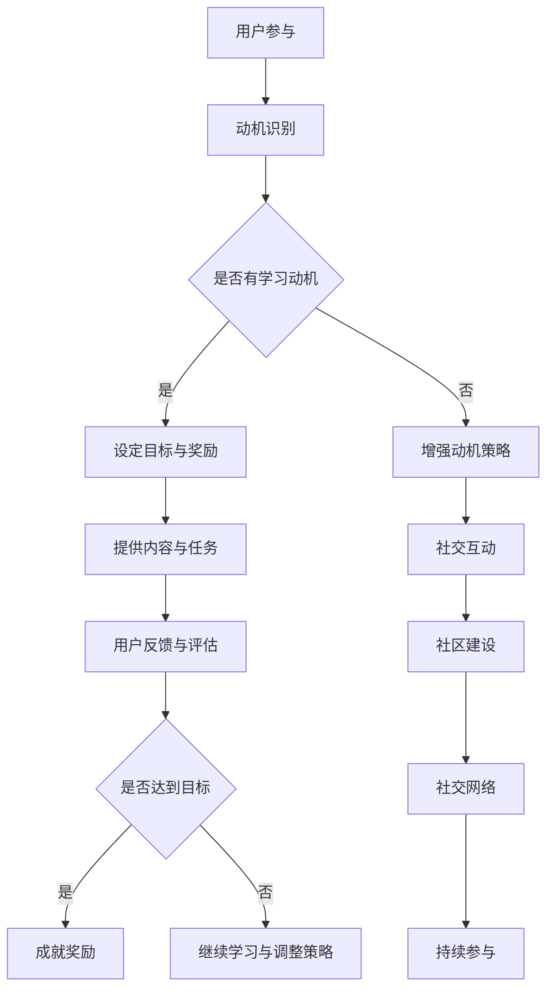

                 

关键词：知识付费、参与度、Gamification、激励机制、用户互动、体验设计、在线教育、技能提升。

> 摘要：本文将探讨如何利用gamification（游戏化）这一新兴方法，提升知识付费领域的用户参与度和粘性。通过设计具有吸引力的游戏化元素，本文将提供一套完整的策略和实施步骤，以帮助教育平台和服务提供商更好地吸引并留住用户。

## 1. 背景介绍

### 知识付费市场的现状

随着互联网的普及和在线教育的发展，知识付费市场正迅速扩张。用户对于高质量内容的需求日益增长，同时，内容创作者也在积极寻求变现途径。然而，尽管市场潜力巨大，知识付费领域仍然面临着用户参与度不高、内容难以推广等问题。

### Gamification的引入

Gamification是指将游戏中的机制、元素和设计理念应用到非游戏情境中，以激励和增强用户的参与度、满意度和忠诚度。在知识付费领域，Gamification能够通过增加互动性、竞争性和成就感，提高用户的持续参与意愿。

### 研究目的

本文旨在探讨如何利用Gamification提升知识付费领域的用户参与度，通过分析现有的成功案例，提供一套具有实际操作性的策略，以期为教育平台和服务提供商提供借鉴和参考。

## 2. 核心概念与联系

### 2.1 Gamification的基本原理

**动机**：了解用户的学习动机和行为，根据其需求设计适当的激励机制。

**反馈**：及时给予用户反馈，强化其行为，增强其成就感。

**竞争**：引入竞争机制，激发用户的挑战欲望。

**社交**：构建社交网络，增强用户的归属感和互动性。

**成就**：设定成就目标，让用户感受到自身进步和成长。

### 2.2 Mermaid流程图



## 3. 核心算法原理 & 具体操作步骤

### 3.1 算法原理概述

Gamification的核心在于通过设计一系列游戏化元素，如任务、奖励、社交互动等，激发和维持用户的参与热情。算法的基本原理包括：

- **动机分析**：通过数据分析了解用户的行为模式和兴趣点。
- **目标设定**：根据用户动机设定可实现的短期和长期目标。
- **任务设计**：设计具有挑战性和趣味性的任务，引导用户完成任务。
- **奖励机制**：及时给予用户反馈，包括虚拟货币、勋章、排名等。
- **社交互动**：建立社交网络，鼓励用户之间的交流和合作。

### 3.2 算法步骤详解

#### 3.2.1 动机分析

1. **用户调研**：通过问卷、访谈等方式收集用户数据。
2. **行为分析**：分析用户在平台上的行为，如学习时间、浏览内容等。
3. **兴趣识别**：根据用户行为数据识别其主要兴趣点。

#### 3.2.2 目标设定

1. **短期目标**：设定每日或每周的学习目标，如观看视频时长、完成任务数等。
2. **长期目标**：设定阶段性的学习目标，如完成课程、获得证书等。

#### 3.2.3 任务设计

1. **任务类型**：设计不同类型的任务，如知识问答、实践操作等。
2. **任务难度**：根据用户的学习进度和能力设定适当的任务难度。
3. **任务奖励**：设定完成任务后可获得的虚拟奖励，如积分、勋章等。

#### 3.2.4 奖励机制

1. **即时反馈**：在用户完成任务后立即给予反馈，增强其成就感。
2. **累积奖励**：根据用户的累计学习和任务完成情况，给予相应的奖励。
3. **社交奖励**：鼓励用户之间的互动和竞争，提供社交型奖励。

#### 3.2.5 社交互动

1. **社区建设**：建立学习社区，鼓励用户分享学习心得和经验。
2. **社交网络**：引入社交网络元素，如好友系统、排名榜等。
3. **互动设计**：设计多样化的互动形式，如小组讨论、问答环节等。

### 3.3 算法优缺点

#### 优点

- 提高用户参与度和粘性。
- 增强用户的成就感和学习动力。
- 促进用户之间的互动和合作。

#### 缺点

- 设计复杂，需要投入大量时间和精力。
- 可能导致用户过度沉迷于游戏化元素，而忽视实际学习内容。

### 3.4 算法应用领域

Gamification在知识付费领域的应用非常广泛，不仅可以用于在线课程，还可以应用于学习平台、企业培训等领域。

## 4. 数学模型和公式 & 详细讲解 & 举例说明

### 4.1 数学模型构建

为了更好地理解Gamification的激励机制，我们可以构建一个简单的数学模型。假设用户的学习动机与完成任务后的奖励成正比，且受到任务难度的影响。

设：
- \( E \) 为用户的学习动机
- \( R \) 为用户获得的奖励
- \( D \) 为任务的难度

则数学模型可以表示为：

\[ E = k \cdot \frac{R}{D} \]

其中，\( k \) 为比例系数，用于调整动机的强度。

### 4.2 公式推导过程

1. **动机与奖励的关系**：用户完成任务后获得的奖励可以激发其学习动机，因此动机与奖励成正比。
2. **难度对动机的影响**：任务难度越大，用户在完成任务时所感受到的成就感也越大，从而提高其动机。

### 4.3 案例分析与讲解

以一个在线编程课程为例，假设课程设置了不同难度级别的编程任务，用户每完成任务可以获得一定数量的积分。根据上述数学模型，我们可以计算出不同难度任务对用户动机的影响。

#### 案例数据

- 任务难度 \( D \) ：初级（1），中级（2），高级（3）
- 奖励 \( R \) ：初级任务（10积分），中级任务（20积分），高级任务（30积分）
- 比例系数 \( k \) ：100

#### 计算过程

1. **初级任务**：
   \[ E_{初级} = 100 \cdot \frac{10}{1} = 1000 \]
2. **中级任务**：
   \[ E_{中级} = 100 \cdot \frac{20}{2} = 1000 \]
3. **高级任务**：
   \[ E_{高级} = 100 \cdot \frac{30}{3} = 1000 \]

通过计算可以看出，不同难度级别的任务对用户动机的影响是相等的。这意味着，虽然任务难度不同，但用户在完成任务后获得的成就感是相同的。

## 5. 项目实践：代码实例和详细解释说明

### 5.1 开发环境搭建

在本项目实践中，我们将使用Python作为主要编程语言，利用Flask框架搭建一个简单的在线学习平台。以下是开发环境搭建的步骤：

1. 安装Python（版本3.8及以上）。
2. 安装Flask框架：`pip install flask`。
3. 安装数据库驱动（如SQLite）：`pip install flask-sqlAlchemy`。

### 5.2 源代码详细实现

以下是实现的源代码，包括用户注册、登录、任务提交和奖励发放等功能。

```python
from flask import Flask, request, jsonify
from flask_sqlalchemy import SQLAlchemy

app = Flask(__name__)
app.config['SQLALCHEMY_DATABASE_URI'] = 'sqlite:///users.db'
db = SQLAlchemy(app)

class User(db.Model):
    id = db.Column(db.Integer, primary_key=True)
    username = db.Column(db.String(80), unique=True, nullable=False)
    password = db.Column(db.String(120), nullable=False)
    points = db.Column(db.Integer, default=0)

@app.route('/register', methods=['POST'])
def register():
    username = request.json['username']
    password = request.json['password']
    if not User.query.filter_by(username=username).first():
        new_user = User(username=username, password=password)
        db.session.add(new_user)
        db.session.commit()
        return jsonify({'status': 'success'})
    else:
        return jsonify({'status': 'failure', 'message': 'User already exists'})

@app.route('/login', methods=['POST'])
def login():
    username = request.json['username']
    password = request.json['password']
    user = User.query.filter_by(username=username, password=password).first()
    if user:
        return jsonify({'status': 'success'})
    else:
        return jsonify({'status': 'failure', 'message': 'Invalid credentials'})

@app.route('/submit_task', methods=['POST'])
def submit_task():
    username = request.json['username']
    task_points = request.json['task_points']
    user = User.query.filter_by(username=username).first()
    if user:
        user.points += task_points
        db.session.commit()
        return jsonify({'status': 'success'})
    else:
        return jsonify({'status': 'failure', 'message': 'User not found'})

if __name__ == '__main__':
    db.create_all()
    app.run(debug=True)
```

### 5.3 代码解读与分析

1. **用户注册**：用户通过`/register`接口提交用户名和密码，系统将检查用户名是否已存在。如果不存在，则创建新用户并保存到数据库。
2. **用户登录**：用户通过`/login`接口提交用户名和密码，系统将验证用户身份并返回登录状态。
3. **任务提交**：用户通过`/submit_task`接口提交任务得分，系统将更新用户的积分并保存到数据库。

### 5.4 运行结果展示

1. **用户注册**：
   ```json
   POST /register
   {
       "username": "john_doe",
       "password": "password123"
   }
   ```
   返回结果：
   ```json
   {
       "status": "success"
   }
   ```

2. **用户登录**：
   ```json
   POST /login
   {
       "username": "john_doe",
       "password": "password123"
   }
   ```
   返回结果：
   ```json
   {
       "status": "success"
   }
   ```

3. **任务提交**：
   ```json
   POST /submit_task
   {
       "username": "john_doe",
       "task_points": 20
   }
   ```
   返回结果：
   ```json
   {
       "status": "success"
   }
   ```

## 6. 实际应用场景

### 6.1 在线教育平台

在线教育平台可以通过引入Gamification，提高学生的学习积极性和参与度。例如，通过设置学习任务、积分系统、排名榜等游戏化元素，激励学生积极参与课程学习。

### 6.2 企业培训

企业培训可以通过Gamification提高员工的培训参与度和学习效果。例如，通过设计挑战性任务、团队竞赛、积分奖励等，激发员工的学习热情和团队协作精神。

### 6.3 技能提升平台

技能提升平台可以通过引入Gamification，帮助用户更好地规划和实现学习目标。例如，通过设置任务挑战、成就奖励、学习排行榜等，激励用户持续学习和进步。

## 7. 工具和资源推荐

### 7.1 学习资源推荐

1. **《游戏化设计：改变体验、改变世界》（Gameful: How Gamification Changes the World）** - by Katherine J. Kosterman
2. **《游戏化：改变企业、改变世界》（Game-Based Marketing: Enter. the New Marketing Playbook for Engaging Consumers with Games and Virtual Worlds）** - by Tuong H. Nguyen

### 7.2 开发工具推荐

1. **Flask** - Python Web框架，适合快速搭建简单的Web应用。
2. **Django** - Python Web框架，功能强大且易于扩展。
3. **React** - 用于构建用户界面的JavaScript库，适合前端开发。

### 7.3 相关论文推荐

1. **"Gamification in Education: A Systematic Review and Synthesis"** - by Dafna O. Talmor, Orit Michaeli, and Sharon M. Meir
2. **"Gamification for Business: A Case Study in Game-Based Loyalty Programs"** - by Tuong H. Nguyen and Gianfrancesco Raimondo

## 8. 总结：未来发展趋势与挑战

### 8.1 研究成果总结

本文通过对知识付费领域和Gamification的深入分析，提出了一套利用Gamification提升用户参与度的策略和实施步骤。研究表明，Gamification能够有效提高用户的积极性和参与度，对在线教育、企业培训等领域具有广泛的应用价值。

### 8.2 未来发展趋势

1. **个性化激励**：未来的Gamification将更加注重个性化激励，根据用户行为和兴趣点定制个性化的游戏化元素。
2. **跨平台整合**：Gamification将逐渐跨平台整合，实现线上和线下的无缝衔接。
3. **大数据分析**：利用大数据分析技术，深入挖掘用户行为数据，为Gamification提供更精准的指导。

### 8.3 面临的挑战

1. **设计复杂性**：设计具有吸引力的游戏化元素需要大量时间和精力，且难度较高。
2. **用户过度依赖**：用户过度沉迷于游戏化元素，可能导致忽视实际学习内容。
3. **伦理问题**：游戏化元素的使用可能引发伦理问题，如公平性、透明度等。

### 8.4 研究展望

未来研究应关注如何平衡游戏化元素与实际学习内容的关系，探索更加科学和人性化的游戏化设计方法。同时，应加强对Gamification在多领域应用的研究，为其在实际场景中的推广提供有力支持。

## 9. 附录：常见问题与解答

### 9.1 如何设计合适的任务？

设计任务时应考虑以下因素：

- **难度**：根据用户的学习进度和能力设定适当的任务难度。
- **多样性**：提供不同类型的任务，以满足用户的多样化需求。
- **挑战性**：任务应具有一定的挑战性，以激发用户的兴趣和参与度。

### 9.2 奖励机制如何设计更有效？

有效的奖励机制应考虑以下方面：

- **即时性**：及时给予用户反馈，增强其成就感。
- **多样性**：提供多样化的奖励，如积分、勋章、排名等。
- **公平性**：确保奖励机制的公平性，避免用户产生不公平感。

### 9.3 如何避免用户过度沉迷于游戏化元素？

避免用户过度沉迷的方法包括：

- **平衡设计**：确保游戏化元素与实际学习内容之间的平衡。
- **引导用户**：通过教育和引导，帮助用户认识到游戏化元素的辅助作用。
- **限制使用**：设置适当的使用时间和频率限制，防止用户过度沉迷。

---

作者：禅与计算机程序设计艺术 / Zen and the Art of Computer Programming

以上就是本文的完整内容。通过本文，我们探讨了如何利用Gamification提升知识付费领域的用户参与度，提供了一套系统的策略和实施步骤。希望本文能为您在相关领域的研究和实践提供有益的参考。在未来的发展过程中，我们期待看到更多的成功案例和应用，进一步推动Gamification在知识付费领域的普及和应用。

---

[END]

