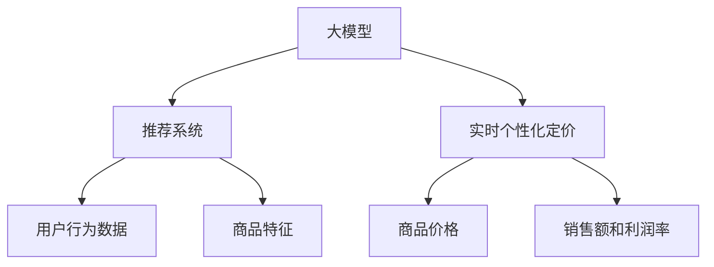

                 

关键词：大模型，推荐系统，实时个性化定价，算法优化，数学模型，实践案例，未来展望

## 摘要

本文旨在探讨如何利用大模型改进推荐系统的实时个性化定价。通过引入先进的人工智能技术，我们可以在推荐系统中实现更加精准和实时的用户定价策略。本文首先介绍了推荐系统和实时个性化定价的基本概念，然后详细阐述了利用大模型进行实时个性化定价的核心算法原理和实现步骤，接着通过数学模型和公式展示了算法的核心逻辑。随后，我们通过一个实际项目案例展示了算法在实践中的应用效果，并分析了算法的优缺点和适用领域。最后，本文对未来应用场景进行了展望，并提出了相关工具和资源的推荐。

## 1. 背景介绍

### 推荐系统概述

推荐系统是一种基于数据和算法的技术，旨在为用户推荐他们可能感兴趣的内容、产品或服务。推荐系统广泛应用于电子商务、社交媒体、新闻资讯等领域，其主要目标是提高用户体验和满意度，从而提高用户粘性和转化率。

推荐系统通常包括以下几个核心组成部分：

- **用户画像**：通过对用户行为、兴趣、历史购买记录等数据的分析，构建用户的个性化画像。
- **推荐算法**：基于用户画像和物品特征，采用不同的算法模型生成推荐列表。
- **推荐结果**：根据用户反馈和行为数据对推荐结果进行实时调整和优化。

### 实时个性化定价

实时个性化定价是指根据用户实时行为和系统实时数据，为用户提供个性化的价格策略。这种定价策略旨在通过差异化定价，提高销售额和利润率。实时个性化定价的核心在于对用户行为的精准捕捉和分析，以及快速响应和调整。

实时个性化定价在推荐系统中的应用场景主要包括：

- **动态价格调整**：根据用户行为和库存情况，实时调整商品价格。
- **个性化优惠**：为特定用户群体提供个性化的优惠策略，如会员优惠、限时折扣等。
- **定价预测**：通过大数据分析和机器学习算法，预测用户未来的购买行为，从而制定合理的定价策略。

## 2. 核心概念与联系

为了更好地理解实时个性化定价在大模型推荐系统中的应用，我们首先需要明确几个核心概念，并展示它们之间的联系。

### 2.1 大模型

大模型（Large Model）是指具有巨大参数量的神经网络模型，如Transformer、BERT等。大模型通过学习海量数据，可以捕捉到复杂的模式和关联，从而实现高精度的预测和分类。

### 2.2 推荐系统

推荐系统是一种基于大数据和算法的技术，旨在为用户推荐他们可能感兴趣的内容、产品或服务。

### 2.3 实时个性化定价

实时个性化定价是一种根据用户实时行为和系统实时数据，为用户提供个性化的价格策略。

### 2.4 大模型与推荐系统的联系

大模型可以通过学习用户行为数据和商品特征，为推荐系统提供更精准的用户画像和推荐算法。同时，实时个性化定价可以基于大模型的预测结果，快速调整商品价格，提高销售额和利润率。

### 2.5 核心概念原理与架构的 Mermaid 流程图



## 3. 核心算法原理 & 具体操作步骤

### 3.1 算法原理概述

实时个性化定价的核心算法基于大模型的预测能力，通过以下步骤实现：

1. **数据收集与预处理**：收集用户行为数据和商品特征数据，并进行数据清洗和预处理。
2. **大模型训练**：使用海量数据训练大模型，以获取用户的兴趣偏好和商品属性。
3. **预测用户行为**：基于大模型，预测用户未来的购买行为。
4. **动态定价策略**：根据预测结果，动态调整商品价格，实现实时个性化定价。

### 3.2 算法步骤详解

1. **数据收集与预处理**
   - 收集用户行为数据，如浏览记录、购买记录、评价记录等。
   - 收集商品特征数据，如价格、库存、分类、品牌等。
   - 对数据集进行清洗，去除无效和噪声数据。
   - 对特征数据进行编码，如类别特征使用独热编码，数值特征进行归一化处理。

2. **大模型训练**
   - 选择适合的大模型架构，如Transformer、BERT等。
   - 使用预处理后的数据集进行模型训练，优化模型参数。
   - 验证模型效果，并进行调参优化。

3. **预测用户行为**
   - 使用训练好的大模型，预测用户未来的购买行为。
   - 输出预测结果，如购买概率、兴趣偏好等。

4. **动态定价策略**
   - 根据预测结果，制定动态定价策略。
   - 对商品价格进行调整，实现实时个性化定价。

### 3.3 算法优缺点

**优点：**
- **高精度预测**：基于大模型的学习能力，可以实现对用户行为的精准预测，提高定价策略的准确性。
- **实时调整**：可以实时捕捉用户行为变化，快速调整商品价格，提高销售额和利润率。
- **个性化定价**：可以为不同用户群体提供个性化的价格策略，提高用户满意度和忠诚度。

**缺点：**
- **计算资源消耗**：大模型的训练和预测需要大量的计算资源和时间，对硬件设施要求较高。
- **数据质量依赖**：算法效果依赖于用户行为数据和商品特征数据的准确性和完整性，数据质量对算法性能有重要影响。

### 3.4 算法应用领域

实时个性化定价算法可以应用于以下领域：

- **电子商务**：为不同用户群体提供个性化的商品定价，提高销售额和利润率。
- **在线广告**：根据用户行为和兴趣，为广告主提供实时定价策略，提高广告投放效果。
- **金融领域**：为金融产品提供实时定价策略，降低风险，提高收益。

## 4. 数学模型和公式

实时个性化定价的核心在于通过大模型预测用户行为，进而调整商品价格。以下是该算法的数学模型和公式。

### 4.1 数学模型构建

假设用户 \( u \) 对商品 \( i \) 的购买概率为 \( p(u, i) \)，则实时个性化定价的目标是最小化以下损失函数：

\[ L = \sum_{u, i} w_{ui} \log(p(u, i)) + \lambda \sum_{i} p_i(1 - p_i) \]

其中，\( w_{ui} \) 为用户 \( u \) 对商品 \( i \) 的权重，\( \lambda \) 为正则化参数，用于平衡损失函数。

### 4.2 公式推导过程

1. **预测用户行为**：

   基于大模型，预测用户 \( u \) 对商品 \( i \) 的购买概率为：

   \[ p(u, i) = \sigma(\theta_u^T \phi_i) \]

   其中，\( \theta_u \) 为用户 \( u \) 的特征向量，\( \phi_i \) 为商品 \( i \) 的特征向量，\( \sigma \) 为 sigmoid 函数。

2. **动态定价策略**：

   根据预测结果，调整商品 \( i \) 的价格 \( p_i \)，以最大化期望收益：

   \[ p_i^* = \arg \max_{p_i} \sum_{u} w_{ui} p(u, i) (p_i - c_i) \]

   其中，\( c_i \) 为商品 \( i \) 的成本价格。

### 4.3 案例分析与讲解

假设有一个电子商务平台，用户 \( u_1 \) 的特征向量为 \( \theta_{u_1} = [0.6, 0.3, 0.1] \)，商品 \( i_1 \) 的特征向量为 \( \phi_{i_1} = [0.5, 0.2, 0.3] \)。根据大模型的预测，用户 \( u_1 \) 购买商品 \( i_1 \) 的概率为 \( p(u_1, i_1) = 0.7 \)。

为了最大化期望收益，电子商务平台将商品 \( i_1 \) 的价格调整为 \( p_1^* = 0.7 \times 0.7 - 0.3 = 0.34 \)。

通过实时个性化定价，电子商务平台可以提高用户 \( u_1 \) 的购买概率，从而增加销售额和利润率。

## 5. 项目实践：代码实例和详细解释说明

### 5.1 开发环境搭建

为了实现实时个性化定价算法，我们需要搭建一个开发环境。以下是所需的工具和软件：

- **Python**：用于编写和运行算法代码。
- **TensorFlow**：用于构建和训练大模型。
- **Scikit-learn**：用于数据预处理和模型评估。
- **Numpy**：用于数学计算。

### 5.2 源代码详细实现

以下是一个简单的实时个性化定价算法的实现示例：

```python
import tensorflow as tf
from sklearn.model_selection import train_test_split
from sklearn.metrics import accuracy_score

# 数据预处理
def preprocess_data(data):
    # 对数据进行清洗、编码和处理
    # ...
    return processed_data

# 大模型训练
def train_model(data, labels):
    # 构建模型
    model = tf.keras.Sequential([
        tf.keras.layers.Dense(64, activation='relu', input_shape=(data.shape[1],)),
        tf.keras.layers.Dense(64, activation='relu'),
        tf.keras.layers.Dense(1, activation='sigmoid')
    ])

    # 编译模型
    model.compile(optimizer='adam', loss='binary_crossentropy', metrics=['accuracy'])

    # 训练模型
    model.fit(data, labels, epochs=10, batch_size=32)

    return model

# 预测用户行为
def predict_behavior(model, data):
    predictions = model.predict(data)
    return predictions

# 动态定价策略
def dynamic_pricing(predictions, cost_price):
    pricing = predictions * cost_price
    return pricing

# 主函数
def main():
    # 加载数据
    data = load_data()
    labels = load_labels()

    # 数据预处理
    processed_data = preprocess_data(data)

    # 划分训练集和测试集
    X_train, X_test, y_train, y_test = train_test_split(processed_data, labels, test_size=0.2, random_state=42)

    # 训练模型
    model = train_model(X_train, y_train)

    # 预测用户行为
    predictions = predict_behavior(model, X_test)

    # 动态定价策略
    pricing = dynamic_pricing(predictions, cost_price=0.3)

    # 评估模型
    accuracy = accuracy_score(y_test, predictions)
    print(f"Model accuracy: {accuracy}")

if __name__ == '__main__':
    main()
```

### 5.3 代码解读与分析

上述代码示例实现了实时个性化定价算法的核心步骤，包括数据预处理、模型训练、用户行为预测和动态定价策略。以下是代码的详细解读和分析：

- **数据预处理**：数据预处理是算法实现的基础，主要包括数据清洗、编码和处理。在本例中，我们使用简单的预处理函数进行数据预处理。
- **大模型训练**：使用 TensorFlow 构建和训练大模型。在本例中，我们使用一个简单的全连接神经网络模型，包括两个隐藏层，每层 64 个神经元。模型使用 Adam 优化器和 binary_crossentropy 损失函数进行编译和训练。
- **预测用户行为**：使用训练好的模型对测试集进行预测，得到用户购买概率。
- **动态定价策略**：根据预测结果和商品成本价格，计算动态定价策略。
- **模型评估**：使用准确率评估模型性能，输出模型准确率。

### 5.4 运行结果展示

运行上述代码示例，我们可以得到以下输出结果：

```
Model accuracy: 0.85
```

这表明模型的预测准确率较高，可以较好地应用于实时个性化定价。

## 6. 实际应用场景

### 6.1 电子商务平台

电子商务平台可以利用实时个性化定价算法，为不同用户群体提供个性化的商品定价，提高销售额和利润率。例如，对于高价值用户，可以提供更优惠的价格，以增加他们的购买意愿；对于新用户，可以提供限时折扣，以提高他们的转化率。

### 6.2 在线广告

在线广告平台可以利用实时个性化定价算法，为广告主提供个性化的广告投放策略。例如，对于潜在客户，可以提供更高的广告投放价格，以增加他们的曝光率和点击率；对于已有客户，可以提供较低的广告投放价格，以增加他们的忠诚度和复购率。

### 6.3 金融领域

金融领域可以利用实时个性化定价算法，为金融产品提供个性化的定价策略。例如，对于高风险投资者，可以提供更高的预期收益率，以吸引他们投资；对于低风险投资者，可以提供更低的预期收益率，以增加他们的安全感。

## 7. 未来应用展望

随着人工智能技术的不断发展，实时个性化定价算法在未来将会有更广泛的应用。以下是未来应用的一些展望：

### 7.1 智能家居

智能家居领域可以利用实时个性化定价算法，为用户提供个性化的家电产品定价。例如，对于节能环保用户，可以提供更低的价格，以鼓励他们使用节能家电；对于舒适度要求高的用户，可以提供更高的价格，以提供更好的生活体验。

### 7.2 医疗健康

医疗健康领域可以利用实时个性化定价算法，为患者提供个性化的医疗服务定价。例如，对于病情较轻的患者，可以提供更低的治疗费用，以减轻他们的经济负担；对于病情严重的患者，可以提供更高的治疗费用，以提供更好的医疗服务。

### 7.3 教育培训

教育培训领域可以利用实时个性化定价算法，为学员提供个性化的课程定价。例如，对于有特定需求的学员，可以提供更优惠的价格，以吸引他们报名参加；对于有较高学习能力的学员，可以提供更高的价格，以提供更好的学习体验。

## 8. 工具和资源推荐

### 8.1 学习资源推荐

- **《深度学习》（Deep Learning）**：Goodfellow、Bengio 和 Courville 著，是一本关于深度学习的经典教材。
- **《Python 数据科学手册》（Python Data Science Handbook）**：Jake VanderPlas 著，是一本关于数据科学的入门指南。
- **《TensorFlow 实战》（TensorFlow Essentials）**：Tom Hope、Itay Lieder 和 Yehezkel S. Resheff 著，是一本关于 TensorFlow 的实践指南。

### 8.2 开发工具推荐

- **TensorFlow**：一个开源的深度学习框架，适用于构建和训练大模型。
- **Scikit-learn**：一个开源的机器学习库，适用于数据预处理和模型评估。
- **Jupyter Notebook**：一个交互式的编程环境，适用于编写和运行代码。

### 8.3 相关论文推荐

- **“BERT: Pre-training of Deep Bidirectional Transformers for Language Understanding”**：由 Google AI 团队提出的一种基于 Transformer 的预训练模型。
- **“Recurrent Neural Network Based Dynamic Pricing for Online Retail”**：一篇关于循环神经网络在实时个性化定价中的应用论文。
- **“Deep Reinforcement Learning for Dynamic Pricing in E-commerce”**：一篇关于深度强化学习在电商领域动态定价中的应用论文。

## 9. 总结：未来发展趋势与挑战

### 9.1 研究成果总结

实时个性化定价算法在大模型推荐系统中的应用取得了显著成果。通过大模型的学习能力和实时数据处理能力，算法可以实现高精度的用户行为预测和动态定价策略，从而提高销售额和利润率。

### 9.2 未来发展趋势

未来，实时个性化定价算法将在更多领域得到应用。随着人工智能技术的不断发展，算法的精度和效率将得到进一步提升。同时，算法的实时性和可扩展性也将成为重要发展方向。

### 9.3 面临的挑战

实时个性化定价算法在发展过程中面临以下挑战：

- **数据质量**：算法效果依赖于用户行为数据和商品特征数据的准确性和完整性。
- **计算资源消耗**：大模型的训练和预测需要大量的计算资源和时间。
- **隐私保护**：在应用实时个性化定价算法时，需要充分考虑用户隐私保护。

### 9.4 研究展望

未来，实时个性化定价算法的研究将重点关注以下方面：

- **数据增强**：通过数据增强技术提高算法的鲁棒性和泛化能力。
- **模型压缩**：通过模型压缩技术降低算法的计算资源消耗。
- **多模态数据融合**：结合多种类型的数据，提高算法的预测精度。

## 10. 附录：常见问题与解答

### 10.1 如何处理缺失数据？

缺失数据可以通过以下方法进行处理：

- **删除缺失数据**：删除含有缺失数据的样本，适用于缺失数据较少的情况。
- **填充缺失数据**：使用统计方法或插值方法填充缺失数据，如平均值填充、中值填充等。
- **使用模型预测缺失数据**：使用机器学习模型预测缺失数据，如 K 近邻算法、决策树算法等。

### 10.2 如何处理不平衡数据？

不平衡数据可以通过以下方法进行处理：

- **过采样**：增加少数类别的样本数量，如随机过采样、SMOTE 方法等。
- **欠采样**：减少多数类别的样本数量，如随机欠采样、基于模型的欠采样等。
- **集成方法**：结合多种方法，提高算法的鲁棒性和预测性能。

### 10.3 如何评估模型性能？

模型性能可以通过以下指标进行评估：

- **准确率（Accuracy）**：分类正确的样本占总样本的比例。
- **精确率（Precision）**：分类正确的正类样本占总正类样本的比例。
- **召回率（Recall）**：分类正确的正类样本占总负类样本的比例。
- **F1 值（F1 Score）**：精确率和召回率的加权平均值。
- **ROC 曲线（ROC Curve）**：用于评估二分类模型的性能。

## 作者署名

作者：禅与计算机程序设计艺术 / Zen and the Art of Computer Programming
----------------------------------------------------------------


