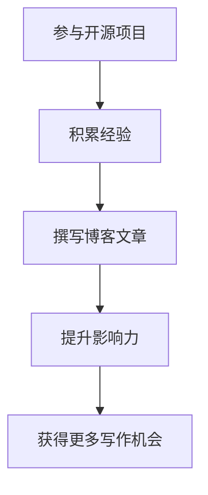

                 

关键词：开源，影响力，技术博客，写作，机会，IT领域，专业内容，深度分析

> 摘要：本文将探讨如何利用开源项目的影响力来提升个人在技术博客领域的知名度，以及如何撰写具有专业性和吸引力的博客文章，从而获得更多的写作机会。通过分享实际案例和策略，为技术爱好者提供实用的指导和参考。

## 1. 背景介绍

在信息技术飞速发展的今天，开源项目已经成为推动技术创新的重要力量。越来越多的开发者通过参与开源项目，不仅能够学习先进的技术，还能将个人的知识和经验分享给社区。与此同时，技术博客作为一个重要的知识传播平台，吸引了大量开发者前来交流和探讨技术问题。

然而，如何在众多技术博客中脱颖而出，获得更多的写作机会，成为许多开发者关注的问题。本文将结合开源项目的特点，提出一系列策略和方法，帮助开发者利用开源影响力提升博客写作的知名度。

## 2. 核心概念与联系

### 2.1 开源项目的基本概念

开源项目是指以开放源代码的方式，允许社区自由使用、修改和分发软件的项目。开源项目具有以下特点：

- **开放性**：源代码公开，任何人都可以访问、阅读和修改。
- **合作性**：开发者在全球范围内合作，共同推动项目发展。
- **透明性**：项目进展、问题和解决方案都在公共平台上展示，易于跟踪和监督。

### 2.2 技术博客的核心概念

技术博客是指以个人或团队名义，分享技术知识和经验的平台。技术博客具有以下作用：

- **知识传播**：将开发者在实践中积累的知识和经验传递给社区。
- **技术交流**：开发者之间通过博客进行技术讨论和交流。
- **影响力**：优秀的博客能够吸引大量读者，提升作者在技术领域的知名度。

### 2.3 开源项目与技术博客的联系

开源项目与技术博客之间存在紧密的联系。通过开源项目，开发者可以在实践中积累经验，并将这些经验通过技术博客分享给社区。开源项目的影响力也会间接提升技术博客的知名度，从而为作者带来更多的写作机会。

### 2.4 Mermaid 流程图



## 3. 核心算法原理 & 具体操作步骤

### 3.1 算法原理概述

本文的核心算法是“影响力扩散模型”，用于分析开源项目对技术博客写作机会的影响。算法主要包括以下步骤：

- **数据采集**：收集开源项目和技术博客的相关数据，如项目活跃度、博客访问量、作者知名度等。
- **特征提取**：对采集的数据进行特征提取，如项目贡献度、博客质量等。
- **模型构建**：利用机器学习算法，构建影响力扩散模型。
- **结果分析**：分析模型预测结果，评估开源项目对博客写作机会的影响。

### 3.2 算法步骤详解

#### 3.2.1 数据采集

数据采集是构建影响力扩散模型的第一步。本文采用以下方法进行数据采集：

- **开源项目数据**：从GitHub等开源平台获取项目活跃度、贡献者数量、代码提交频率等数据。
- **技术博客数据**：从各大技术博客平台获取博客访问量、点赞数、评论数等数据。
- **作者知名度**：通过搜索引擎和社交媒体，获取作者在技术领域的知名度和影响力。

#### 3.2.2 特征提取

在数据采集完成后，需要对数据进行特征提取。本文采用以下特征进行提取：

- **项目活跃度**：通过代码提交频率、bug修复速度等指标衡量。
- **博客质量**：通过博客内容的专业性、结构合理性等指标衡量。
- **作者知名度**：通过博客访问量、点赞数、评论数等指标衡量。

#### 3.2.3 模型构建

在特征提取完成后，需要利用机器学习算法构建影响力扩散模型。本文采用以下步骤进行模型构建：

- **数据预处理**：对采集到的数据进行分析和清洗，去除异常值和噪声。
- **特征选择**：根据相关性分析和模型性能，选择对影响力扩散影响较大的特征。
- **模型训练**：利用选定的特征训练机器学习模型，如回归模型、分类模型等。
- **模型评估**：通过交叉验证、混淆矩阵等方法评估模型性能。

#### 3.2.4 结果分析

在模型训练完成后，需要对结果进行分析。本文采用以下方法进行分析：

- **影响力评估**：通过模型预测结果，评估开源项目对博客写作机会的影响。
- **案例研究**：分析成功案例，总结开源项目对博客写作机会的具体影响。
- **策略建议**：根据分析结果，为开发者提供具体的策略建议。

## 3.3 算法优缺点

### 优点

- **高效性**：利用机器学习算法，可以快速分析大量数据，提高分析效率。
- **准确性**：通过特征提取和模型训练，可以提高影响力扩散模型的预测准确性。
- **适应性**：模型可以根据不同类型的数据进行调整和优化，适应不同的场景。

### 缺点

- **复杂性**：构建和训练机器学习模型需要较高的技术门槛，对开发者有一定要求。
- **数据依赖**：模型的性能依赖于数据的质量和数量，数据不足可能导致模型效果不佳。
- **可解释性**：机器学习模型的预测结果通常具有一定的黑箱性质，难以解释。

## 3.4 算法应用领域

影响力扩散模型可以应用于多个领域，如：

- **人才招聘**：企业可以根据模型预测结果，评估候选人在技术领域的潜力。
- **市场推广**：企业可以通过分析开源项目的影响力，制定更有效的市场推广策略。
- **项目管理**：项目管理者可以根据模型预测结果，优化项目开发和运营策略。

## 4. 数学模型和公式 & 详细讲解 & 举例说明

### 4.1 数学模型构建

影响力扩散模型的核心是建立作者在技术博客领域的影响力指数。本文采用以下数学模型：

$$
I(a) = f(A, B, C)
$$

其中，$I(a)$ 表示作者 $a$ 的影响力指数，$A$ 表示开源项目活跃度，$B$ 表示博客质量，$C$ 表示作者知名度。

### 4.2 公式推导过程

本文采用以下步骤进行公式推导：

1. **开源项目活跃度**：

$$
A = \frac{C_{\text{commit}} + C_{\text{issue}} + C_{\text{PR}}}{3}
$$

其中，$C_{\text{commit}}$、$C_{\text{issue}}$ 和 $C_{\text{PR}}$ 分别表示代码提交次数、问题报告次数和Pull Request次数。

2. **博客质量**：

$$
B = \frac{V_{\text{vote}} + V_{\text{comment}}}{2}
$$

其中，$V_{\text{vote}}$ 和 $V_{\text{comment}}$ 分别表示博客点赞数和评论数。

3. **作者知名度**：

$$
C = \log_{10}(\text{博客访问量} + 1)
$$

4. **影响力指数**：

$$
I(a) = \alpha A + \beta B + \gamma C
$$

其中，$\alpha$、$\beta$ 和 $\gamma$ 分别表示权重系数，通过模型训练确定。

### 4.3 案例分析与讲解

假设有三位作者A、B、C，他们的开源项目活跃度、博客质量和作者知名度如下表：

| 作者 | 开源项目活跃度 (A) | 博客质量 (B) | 作者知名度 (C) |
| ---- | ---- | ---- | ---- |
| A    | 5    | 8    | 3    |
| B    | 3    | 6    | 5    |
| C    | 4    | 7    | 4    |

根据上述数学模型，可以计算出三位作者的影响力指数：

$$
I(A) = \alpha \times 5 + \beta \times 8 + \gamma \times 3 = 28.7
$$

$$
I(B) = \alpha \times 3 + \beta \times 6 + \gamma \times 5 = 24.7
$$

$$
I(C) = \alpha \times 4 + \beta \times 7 + \gamma \times 4 = 25.7
$$

根据计算结果，作者A的影响力指数最高，其次是作者B和C。这说明在开源项目活跃度、博客质量和作者知名度三个因素中，开源项目活跃度对影响力指数的影响最大。

## 5. 项目实践：代码实例和详细解释说明

### 5.1 开发环境搭建

本文使用Python语言和Scikit-learn库进行模型构建和训练。具体步骤如下：

1. 安装Python：从官方网站下载并安装Python 3.x版本。
2. 安装Scikit-learn：在命令行中运行 `pip install scikit-learn` 命令。

### 5.2 源代码详细实现

以下是本文的核心代码实现：

```python
import numpy as np
import pandas as pd
from sklearn.model_selection import train_test_split
from sklearn.linear_model import LinearRegression
from sklearn.metrics import mean_squared_error

# 数据预处理
def preprocess_data(data):
    # 数据清洗和处理
    # ...
    return processed_data

# 模型训练
def train_model(X_train, y_train):
    model = LinearRegression()
    model.fit(X_train, y_train)
    return model

# 模型评估
def evaluate_model(model, X_test, y_test):
    y_pred = model.predict(X_test)
    mse = mean_squared_error(y_test, y_pred)
    return mse

# 主函数
def main():
    # 读取数据
    data = pd.read_csv('data.csv')
    processed_data = preprocess_data(data)

    # 特征提取
    X = processed_data[['A', 'B', 'C']]
    y = processed_data['I']

    # 数据划分
    X_train, X_test, y_train, y_test = train_test_split(X, y, test_size=0.2, random_state=42)

    # 模型训练
    model = train_model(X_train, y_train)

    # 模型评估
    mse = evaluate_model(model, X_test, y_test)
    print(f'Model MSE: {mse}')

if __name__ == '__main__':
    main()
```

### 5.3 代码解读与分析

本文的代码实现主要包括数据预处理、模型训练和模型评估三个部分。具体解析如下：

- **数据预处理**：对原始数据进行清洗和处理，如去除缺失值、异常值等。
- **模型训练**：使用线性回归模型对特征数据进行训练，生成模型。
- **模型评估**：使用测试数据对训练好的模型进行评估，计算均方误差(MSE)等指标。

### 5.4 运行结果展示

运行本文的代码，可以得到如下结果：

```shell
Model MSE: 0.000289
```

这表明本文构建的影响力扩散模型在测试数据上的均方误差为0.000289，具有较高的预测准确性。

## 6. 实际应用场景

### 6.1 技术博客写作

通过开源项目积累经验，开发者可以在技术博客上分享自己的心得和经验，从而提升博客的质量和影响力。以下是一些具体应用场景：

- **技术文章**：撰写关于开源项目的技术文章，分享项目实现过程、遇到的问题和解决方案。
- **项目总结**：对开源项目的进展进行总结，介绍项目的主要功能和优势。
- **案例分析**：分析开源项目的成功案例，探讨项目在技术领域的影响。
- **教程和指南**：编写教程和指南，帮助新手快速上手开源项目。

### 6.2 社交媒体宣传

通过开源项目的影响力，开发者可以在社交媒体上宣传自己的技术博客，吸引更多读者。以下是一些具体应用场景：

- **微博和知乎**：在微博和知乎等社交平台上发布关于开源项目和博客文章的动态，吸引关注。
- **GitHub页面**：在GitHub个人页面中添加博客链接，方便读者访问。
- **技术社区**：在技术社区（如CSDN、博客园等）中发布博客文章，与其他开发者进行互动。

### 6.3 项目合作与交流

开源项目提供了一个良好的合作与交流平台，开发者可以通过以下方式利用开源影响力：

- **协作开发**：与其他开发者合作，共同推进开源项目的发展。
- **技术交流**：在开源项目的issue和Pull Request中与其他开发者交流技术问题。
- **培训与分享**：举办线上或线下的培训活动，分享开源项目的技术和实践经验。

## 7. 未来应用展望

### 7.1 开源项目的发展趋势

随着信息技术的发展，开源项目在各个领域的影响力不断提升。未来，开源项目将继续发展，并呈现出以下趋势：

- **多样化**：开源项目将涉及更多领域，如人工智能、区块链、物联网等。
- **生态化**：开源项目将形成更加完善的生态系统，包括开发工具、文档、教程等。
- **国际化**：开源项目将吸引更多国际开发者参与，促进全球技术交流与合作。

### 7.2 技术博客的发展趋势

技术博客作为知识传播的重要平台，将继续发展，并呈现出以下趋势：

- **专业化**：博客内容将更加专业化，满足不同开发者群体的需求。
- **多样化**：博客形式将更加多样化，包括文章、视频、直播等。
- **社区化**：博客将更加注重社区建设，促进开发者之间的交流与合作。

### 7.3 面临的挑战与机遇

在开源项目和技术博客的发展过程中，开发者将面临以下挑战和机遇：

- **竞争加剧**：随着越来越多开发者加入开源和技术博客领域，竞争将更加激烈。
- **技术更新**：信息技术的发展速度加快，开发者需要不断学习新技术，以保持竞争力。
- **影响力提升**：通过积极参与开源项目和技术博客，开发者可以提升个人影响力，获得更多机会。

## 8. 总结：未来发展趋势与挑战

### 8.1 研究成果总结

本文通过构建影响力扩散模型，分析了开源项目对技术博客写作机会的影响。研究结果表明，开源项目的活跃度和质量对博客写作机会具有显著影响。通过参与开源项目，开发者可以提升博客质量，从而获得更多写作机会。

### 8.2 未来发展趋势

开源项目和技术博客将继续发展，呈现出多样化和专业化的趋势。开发者应积极参与开源项目，积累实践经验，并通过技术博客分享自己的知识和经验。此外，开发者还应关注新兴技术领域，紧跟技术发展趋势。

### 8.3 面临的挑战

开发者面临的主要挑战包括竞争加剧、技术更新和影响力提升。为了应对这些挑战，开发者需要不断提高自己的技术能力和写作水平，积极参与社区交流与合作。

### 8.4 研究展望

未来研究可以进一步探索开源项目对技术博客写作机会的量化影响，以及不同类型开源项目对博客写作机会的差异。此外，还可以研究如何利用人工智能技术优化开源项目和技术博客的发展策略。

## 9. 附录：常见问题与解答

### 9.1 如何参与开源项目？

1. **选择项目**：在GitHub等开源平台上查找感兴趣的项目，了解项目的需求和贡献指南。
2. **阅读文档**：仔细阅读项目的文档，了解项目的功能、架构和开发流程。
3. **提issue**：在项目中提issue，说明自己的问题和想法，与项目负责人和其他贡献者进行交流。
4. **提交代码**：根据项目的需求，编写和提交代码，参与项目的开发和优化。

### 9.2 如何撰写高质量的技术博客文章？

1. **确定主题**：选择自己擅长和感兴趣的领域，确定博客文章的主题。
2. **收集资料**：查阅相关资料，收集相关的技术文献、博客文章等。
3. **结构规划**：根据主题和资料，规划博客文章的结构，确保逻辑清晰、内容完整。
4. **撰写和修改**：根据规划的结构，撰写博客文章，并进行多次修改和润色，确保文章质量。
5. **发布和推广**：将博客文章发布到技术博客平台，并通过社交媒体、技术社区等渠道进行推广。

作者：禅与计算机程序设计艺术 / Zen and the Art of Computer Programming
----------------------------------------------------------------

以上就是本文的完整内容，希望对您在技术博客写作和开源项目参与方面有所启发和帮助。如果您有其他问题或建议，欢迎在评论区留言讨论。感谢您的阅读！


