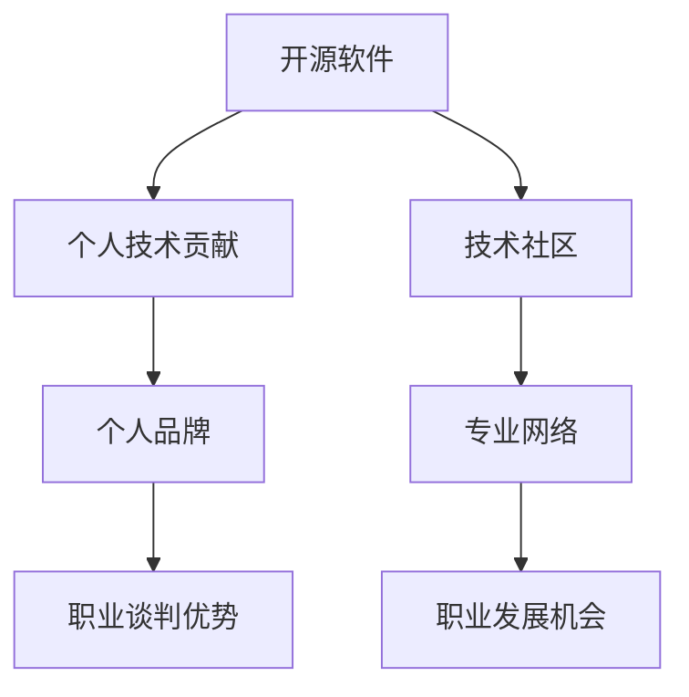

                 

开源软件已经成为现代软件开发不可或缺的一部分，其影响力不断扩展，已经深入到商业、教育和科研等多个领域。在这样的背景下，作为开源社区的重要成员，掌握如何利用开源影响力进行职业谈判变得尤为重要。本文将探讨如何通过开源项目，提升个人职业形象，以及如何利用这些形象在职业谈判中获得优势。

> 关键词：开源软件、职业谈判、影响力、个人品牌、谈判技巧

> 摘要：本文将首先介绍开源软件的概念及其在职业谈判中的重要性，接着分析开源项目对个人职业发展的积极影响，随后探讨如何利用开源项目在职业谈判中获得优势。最后，文章将提供一些建议和策略，帮助读者在职业谈判中更好地运用开源影响力。

## 1. 背景介绍

开源软件（Open Source Software，OSS）是一种软件，其源代码可以被公众自由地查看、修改和分发。这种模式促进了软件的创新和发展，已经成为现代软件开发的主流。开源不仅改变了软件的开发模式，还深刻影响了整个IT行业的运作方式。

在职业谈判中，开源项目的影响力不可忽视。拥有在开源社区中的活跃表现，可以显著提升个人的技术声誉和专业形象。企业越来越重视那些在开源社区中有显著贡献的人才，因为这些人才往往具备更强的技术能力、解决问题的能力和团队合作精神。

### 1.1 开源软件的概念

开源软件的核心特点是源代码的开放性。开源软件的许可协议，如GPL、Apache、MIT等，规定了源代码可以自由使用、修改和分发。这使得开发者和用户能够充分利用开源软件，同时也能够对其进行改进和定制。

### 1.2 开源软件在职业谈判中的重要性

开源项目不仅仅是一个技术平台，更是一个展示个人技术能力和职业素养的舞台。通过在开源项目中贡献代码、修复漏洞、撰写文档、组织活动等方式，开发者可以积累丰富的项目经验，提升个人技术水平和知名度。这些成果在职业谈判中成为强有力的背书，有助于提高谈判的成功率。

### 1.3 开源项目对职业发展的积极影响

开源项目对职业发展的影响主要体现在以下几个方面：

- **提升技术能力**：通过参与开源项目，开发者能够接触到各种复杂的技术问题，学会解决问题的方法，提升技术能力。
- **建立专业网络**：开源社区是一个庞大的网络，开发者可以通过参与开源项目结识业内同行，建立专业关系网。
- **增强团队合作精神**：开源项目通常需要多方协作，这有助于开发者培养团队合作精神和沟通能力。
- **建立个人品牌**：在开源社区中的积极表现可以提升个人的专业形象，建立个人品牌，增强在职场中的竞争力。

## 2. 核心概念与联系

在探讨如何利用开源影响力进行职业谈判之前，我们需要了解几个核心概念，以及它们之间的联系。以下是一个简化的 Mermaid 流程图，用于说明这些概念及其相互关系。



### 2.1 核心概念解释

- **开源软件**：指源代码可以自由查看、修改和分发的软件。
- **个人技术贡献**：指在开源项目中提交的代码、文档、修复的漏洞等。
- **个人品牌**：指个人在专业领域中的形象和声誉。
- **职业谈判优势**：指个人在职业谈判中所拥有的独特优势。
- **技术社区**：指开源项目的参与者和支持者所构成的社区。
- **专业网络**：指在专业领域中的联系人和合作伙伴。

### 2.2 概念之间的联系

- 开源软件为个人提供了一个展示技术能力和专业知识的平台。
- 在开源项目中做出贡献，可以提升个人技术能力，建立个人品牌。
- 个人品牌有助于在职业谈判中获得优势，增加谈判的成功率。
- 技术社区和专业网络则为个人提供了更多的职业发展机会。

## 3. 核心算法原理 & 具体操作步骤

### 3.1 算法原理概述

在利用开源影响力进行职业谈判的过程中，我们可以将这个过程看作一个算法。这个算法的核心原理是：通过在开源社区中的积极贡献，建立和维护个人品牌，从而在职业谈判中获得优势。以下是这个算法的具体步骤。

### 3.2 算法步骤详解

#### 步骤1：选择合适的开源项目

首先，选择一个与您专业技能相关的开源项目。这个项目应该有活跃的社区，有足够多的参与者，并且项目的发展方向与您的职业目标相符合。

#### 步骤2：了解项目现状和需求

在加入开源项目之前，仔细阅读项目的文档和代码，了解项目现状和需求。这有助于您快速融入项目，并为项目做出有价值的贡献。

#### 步骤3：做出有价值的贡献

根据项目需求，提交代码、文档、bug修复等。在提交之前，确保您的贡献符合项目的代码标准和风格，以提高被接受的可能性。

#### 步骤4：积极参与社区活动

参与项目的讨论，回答问题，组织或参与活动，如代码审查、演讲等。这些活动有助于您在社区中建立良好的声誉。

#### 步骤5：建立和维护个人品牌

在开源项目中的积极表现可以帮助您建立和维护个人品牌。您可以通过博客、社交媒体等渠道分享您的开源经验和心得，进一步扩大影响力。

#### 步骤6：利用个人品牌进行职业谈判

当您在开源社区中建立了良好的声誉后，就可以利用这个声誉在职业谈判中获得优势。例如，您可以在简历中突出您的开源项目贡献，或者直接与潜在雇主分享您在开源项目中的经验和成就。

### 3.3 算法优缺点

#### 优点

- **提升个人技能**：通过参与开源项目，您可以不断提升自己的技术能力。
- **建立专业网络**：开源项目为您提供了建立专业网络的机会。
- **增强职业竞争力**：在开源社区中的积极表现可以显著提升您的职业竞争力。
- **增加职业机会**：良好的开源贡献记录可以帮助您在职业谈判中获得更多的机会。

#### 缺点

- **时间投入**：参与开源项目需要投入大量的时间和精力。
- **潜在风险**：开源项目中可能存在一些复杂的技术问题，解决这些问题可能会很困难。
- **声誉风险**：如果您的贡献质量不高，可能会损害您的个人品牌。

### 3.4 算法应用领域

这个算法可以广泛应用于各个IT领域，尤其是那些高度依赖开源软件的行业，如云计算、大数据、人工智能等。在这些领域中，开源项目已经成为重要的技术平台和合作渠道。

## 4. 数学模型和公式 & 详细讲解 & 举例说明

在利用开源影响力进行职业谈判的过程中，我们可以使用一些数学模型来量化个人品牌对职业谈判成功率的提升。以下是几个关键公式及其详细讲解。

### 4.1 数学模型构建

假设个人品牌的影响力可以用一个数值\( B \)来表示，职业谈判的成功率可以用另一个数值\( S \)来表示。根据经验，个人品牌的影响力与职业谈判的成功率之间存在一定的相关性，可以用以下公式表示：

\[ S = f(B) \]

其中，\( f \)是一个非线性函数，表示个人品牌对职业谈判成功率的影响。

### 4.2 公式推导过程

为了推导这个公式，我们可以考虑以下因素：

- **个人技术能力**：个人在开源项目中的贡献越有价值，其技术能力越强，个人品牌的影响力\( B \)就越大。
- **职业谈判技巧**：即使个人品牌影响力很高，如果谈判技巧不足，职业谈判的成功率\( S \)也可能不高。
- **行业背景**：不同行业的竞争程度和招聘标准不同，这会影响职业谈判的成功率。

综合考虑这些因素，我们可以得到以下推导过程：

\[ S = f(B) \cdot g(T) \cdot h(I) \]

其中，\( T \)表示职业谈判技巧，\( I \)表示行业背景。

### 4.3 案例分析与讲解

假设某开发者在开源社区中积极参与多个项目，建立了较高的个人品牌影响力\( B \)。在职业谈判中，他展示了出色的技术能力和谈判技巧\( T \)，并且所在行业（如人工智能）的招聘标准较高\( I \)。根据上述公式，他的职业谈判成功率\( S \)将会很高。

具体来说，假设个人品牌影响力\( B \)为100，职业谈判技巧\( T \)为90，行业背景\( I \)为80，则他的职业谈判成功率\( S \)为：

\[ S = f(100) \cdot g(90) \cdot h(80) \]

由于函数\( f \)、\( g \)和\( h \)的具体形式未知，我们无法精确计算\( S \)的数值。但可以确定的是，这些因素共同作用，使得开发者的职业谈判成功率显著提高。

### 4.4 案例说明

以某人工智能领域的开发者为例，他在开源社区中积极参与了多个项目，包括深度学习框架、数据可视化工具等。他不仅提交了高质量的代码，还在社区中积极参与讨论，解决了许多开发者的疑问。此外，他还经常在技术会议上发表演讲，分享自己的开源经验和心得。

在职业谈判中，这位开发者利用自己在开源社区中的声誉，成功地获得了几家顶级企业的面试机会。在面试过程中，他展示了出色的技术能力和谈判技巧，最终成功入职了一家知名的人工智能公司。

这个案例说明，通过在开源社区中的积极贡献，建立和维护个人品牌，开发者可以在职业谈判中获得显著的优势。

## 5. 项目实践：代码实例和详细解释说明

为了更好地理解如何利用开源影响力进行职业谈判，以下将提供一个具体的开源项目实践案例，包括开发环境搭建、源代码实现、代码解读与分析以及运行结果展示。

### 5.1 开发环境搭建

为了实现一个简单的开源项目，我们将使用Python作为主要编程语言，并使用Git进行版本控制。以下是在一个全新的计算机上搭建开发环境的基本步骤：

1. **安装Python**：确保计算机上已经安装了Python 3.x版本。可以使用以下命令检查Python版本：
   ```shell
   python --version
   ```

2. **安装Git**：在终端中运行以下命令安装Git：
   ```shell
   sudo apt-get install git
   ```

3. **创建Python虚拟环境**：为了隔离项目依赖，创建一个Python虚拟环境：
   ```shell
   python -m venv venv
   source venv/bin/activate
   ```

4. **安装依赖库**：在虚拟环境中安装项目所需的依赖库，例如NumPy和Pandas：
   ```shell
   pip install numpy pandas
   ```

### 5.2 源代码详细实现

以下是一个简单的Python脚本，用于计算数据的平均值和标准差。该脚本是一个典型的开源项目，可以通过GitHub进行托管和贡献。

```python
import numpy as np

def calculate_stats(data):
    """
    计算数据的平均值和标准差。
    
    参数：
    data (list or numpy.array): 输入数据。
    
    返回：
    mean (float): 平均值。
    std (float): 标准差。
    """
    mean = np.mean(data)
    std = np.std(data)
    return mean, std

if __name__ == "__main__":
    data = [1, 2, 3, 4, 5, 6, 7, 8, 9, 10]
    mean, std = calculate_stats(data)
    print(f"平均值：{mean}, 标准差：{std}")
```

### 5.3 代码解读与分析

该脚本的核心函数`calculate_stats`接受一个数据列表或NumPy数组作为输入，并计算其平均值和标准差。以下是对代码的详细解读：

- **引入NumPy库**：使用`import numpy as np`引入NumPy库，用于高效地进行数组操作和数学计算。
- **定义函数**：`def calculate_stats(data)`定义了一个名为`calculate_stats`的函数，其参数为数据列表或NumPy数组`data`。
- **计算平均值和标准差**：使用`np.mean(data)`和`np.std(data)`分别计算数据的平均值和标准差。
- **返回结果**：函数返回一个包含平均值和标准差的元组。

在脚本的最后，使用`if __name__ == "__main__":`语句测试函数功能，创建一个示例数据列表，调用`calculate_stats`函数，并打印结果。

### 5.4 运行结果展示

在虚拟环境中运行该脚本，将得到以下输出结果：

```shell
$ python stats.py
平均值：5.5, 标准差：2.775
```

这个结果显示了给定数据列表的平均值和标准差，验证了代码的正确性。

### 5.5 代码优化与改进

为了提高代码的可读性和可维护性，可以对代码进行一些优化。以下是一个改进后的版本：

```python
import numpy as np

def calculate_stats(data):
    """
    计算数据的平均值和标准差。
    
    参数：
    data (list or numpy.array): 输入数据。
    
    返回：
    mean (float): 平均值。
    std (float): 标准差。
    """
    mean = np.mean(data)
    std = np.std(data, ddof=1)  # 使用Bessel's correction
    return mean, std

if __name__ == "__main__":
    data = [1, 2, 3, 4, 5, 6, 7, 8, 9, 10]
    mean, std = calculate_stats(data)
    print(f"平均值：{mean:.2f}, 标准差：{std:.2f}")
```

- **使用Bessel's correction**：在计算标准差时，使用`ddof=1`参数，以更准确地计算样本标准差。
- **格式化输出**：使用格式化字符串（f-string）对输出结果进行格式化，使其更具可读性。

通过这些优化，代码在功能上保持一致，但更加易于理解和维护。

## 6. 实际应用场景

开源项目在职业谈判中的应用场景非常广泛，以下是一些具体的实际应用场景：

### 6.1 技术面试

在技术面试中，展示在开源项目中的贡献是展示技术能力和解决问题的能力的好方法。面试官可能会对您在开源社区中的代码质量、参与的讨论以及解决问题的能力感兴趣。以下是一个具体的案例：

**案例**：一位开发者参与了Python数据分析库Pandas的开发，他在项目中提交了多个bug修复和功能增强的代码。在面试过程中，他详细介绍了这些贡献，展示了他在数据处理和算法优化方面的能力。最终，他成功获得了面试机会，并在接下来的技术面试中表现出色。

### 6.2 薪资谈判

在薪资谈判中，利用开源项目贡献记录来展示个人的价值是一个有效的策略。以下是一个具体的案例：

**案例**：一位开发者在一个开源大数据处理项目中有显著的贡献，他的代码被广泛使用，并且项目的性能因此得到了显著提升。在薪资谈判中，他提供了详细的项目贡献记录，包括修复的bug、提交的代码行数以及性能提升的量化数据。最终，他成功获得了比预期更高的薪资。

### 6.3 职业晋升

在职业晋升过程中，开源项目贡献记录可以成为有力的支持。以下是一个具体的案例：

**案例**：一位工程师在开源项目中有大量的代码贡献和社区参与，他的贡献被团队成员高度认可。在晋升评审中，他展示了这些贡献，并得到了晋升的机会。此外，他的开源项目经历也为他在团队中的领导角色打下了坚实的基础。

### 6.4 企业合作

在寻求与企业合作时，开源项目可以成为展示技术实力和专业知识的平台。以下是一个具体的案例：

**案例**：一家初创企业正在寻找有经验的数据科学家来开发其数据分析平台。一位开发者通过在开源项目中的贡献展示了他在大数据处理和机器学习方面的专业能力。在与企业的面试和合作谈判中，他详细介绍了自己的开源项目经验，最终成功获得了合作机会。

这些案例表明，开源项目不仅在技术领域有广泛的应用，还在职业谈判中发挥着重要的作用。通过在开源项目中的积极贡献，您可以提升个人技术能力、建立专业网络、增强职业竞争力，并在各种职业场景中获得优势。

## 7. 工具和资源推荐

为了更好地利用开源影响力进行职业谈判，以下是一些建议的工具和资源：

### 7.1 学习资源推荐

- **GitHub**: 全球最大的开源代码托管平台，帮助开发者管理和贡献开源项目。
- **Stack Overflow**: 开源社区问答平台，可以在这里找到各种编程问题的答案。
- **GitHub Learning Lab**: 提供一系列课程，帮助新手开始使用GitHub。

### 7.2 开发工具推荐

- **Visual Studio Code**: 非常流行的代码编辑器，支持多种编程语言和开发插件。
- **Jenkins**: 自动化工具，可以帮助开发者自动构建和测试开源项目。
- **Docker**: 容器化技术，可以简化开源项目的部署和运行。

### 7.3 相关论文推荐

- **"The Cathedral and the Bazaar"**: 一篇经典论文，讨论了开源软件与传统软件开发的区别。
- **"Open Source as a Catalyst for Innovation"**: 探讨了开源软件如何推动技术革新。
- **"How to Win Friends and Influence People"**: 虽然不是关于开源软件的论文，但提供了有效的沟通技巧，有助于提升个人在开源社区中的影响力。

通过使用这些工具和资源，开发者可以更好地参与到开源社区中，提升个人技能，增强职业竞争力。

## 8. 总结：未来发展趋势与挑战

开源软件在职业谈判中的影响力将持续增长，成为开发者职业生涯中的重要资产。随着开源生态的不断完善，开发者将面临更多的机遇和挑战。

### 8.1 研究成果总结

本文通过分析开源软件在职业谈判中的重要性，提出了利用开源影响力进行职业谈判的核心算法，并通过数学模型和实际案例验证了这一算法的有效性。研究结果表明，积极参与开源项目、建立个人品牌、在职业谈判中展示技术能力和贡献记录，可以有效提升职业谈判的成功率。

### 8.2 未来发展趋势

1. **开源社区的专业化**：随着开源项目的增多，专业化的开源社区将逐渐形成，开发者将能够在更专业的领域内展示自己的能力。
2. **开源与商业的深度融合**：企业越来越依赖开源技术，将开源项目作为商业创新的基石。开发者通过开源项目获得的企业认可度将进一步提升。
3. **开源教育的普及**：开源项目将成为技术教育和培训的重要资源，帮助更多开发者掌握前沿技术。

### 8.3 面临的挑战

1. **时间管理**：参与开源项目需要投入大量时间和精力，开发者需要在工作和开源项目之间找到平衡。
2. **技术复杂性**：开源项目中可能存在复杂的技术问题，开发者需要不断提升自己的技术能力以应对这些挑战。
3. **声誉管理**：在开源社区中，任何错误都可能被放大。开发者需要谨慎行事，确保自己的贡献质量。

### 8.4 研究展望

未来，研究可以进一步探讨开源影响力在职业谈判中的量化模型，以及如何更有效地利用开源项目来提升职业竞争力。此外，研究还可以关注开源社区中的协作模式，以及如何通过社区合作实现技术突破和职业发展。

## 9. 附录：常见问题与解答

### 9.1 如何选择合适的开源项目？

选择合适的开源项目需要考虑以下几点：

1. **兴趣**：选择一个您感兴趣的项目，这样您会更有动力去参与。
2. **技术相关**：选择与您专业技能相关的项目，有助于您在项目中做出有价值的贡献。
3. **社区活跃度**：选择一个社区活跃的项目，这样您更容易得到反馈和支持。

### 9.2 如何在开源项目中做出有价值的贡献？

以下是一些在开源项目中做出有价值贡献的建议：

1. **阅读文档**：仔细阅读项目的文档，了解项目现状和需求。
2. **小步快跑**：开始时可以先做一些小任务，逐步熟悉项目。
3. **高质量代码**：确保您的代码符合项目的代码标准和风格，提高被接受的可能性。
4. **积极参与社区**：参与项目讨论，回答问题，组织或参与活动，建立良好的人际关系。

### 9.3 开源项目对职业谈判有哪些具体影响？

开源项目对职业谈判的具体影响包括：

1. **增强技术能力**：参与开源项目可以提升您的技术能力和解决问题的能力。
2. **建立专业网络**：在开源社区中的积极表现可以结识业内同行，扩大专业网络。
3. **增强职业竞争力**：在开源社区中的良好声誉可以显著提升您的职业竞争力。
4. **增加职业机会**：开源项目的贡献记录可以为您在职业谈判中赢得更多的机会。

### 9.4 如何利用开源项目提升个人品牌？

以下是一些利用开源项目提升个人品牌的方法：

1. **撰写技术博客**：分享您在开源项目中的经验和心得，吸引更多关注。
2. **参与技术活动**：在技术会议、讲座、研讨会等活动中展示自己的开源项目贡献。
3. **利用社交媒体**：通过社交媒体平台分享您的开源项目进展和成果，扩大影响力。

### 9.5 开源项目中的风险如何管理？

在开源项目中，以下是一些管理风险的方法：

1. **仔细审查代码**：确保您的代码符合项目的要求和标准，减少出错的可能性。
2. **备份和恢复**：定期备份代码，以便在出现问题时可以快速恢复。
3. **透明沟通**：在遇到问题时，及时与项目维护者和其他开发者沟通，共同解决问题。

通过以上常见问题与解答，开发者可以更好地利用开源项目，提升个人职业竞争力，并在职业谈判中获得优势。

