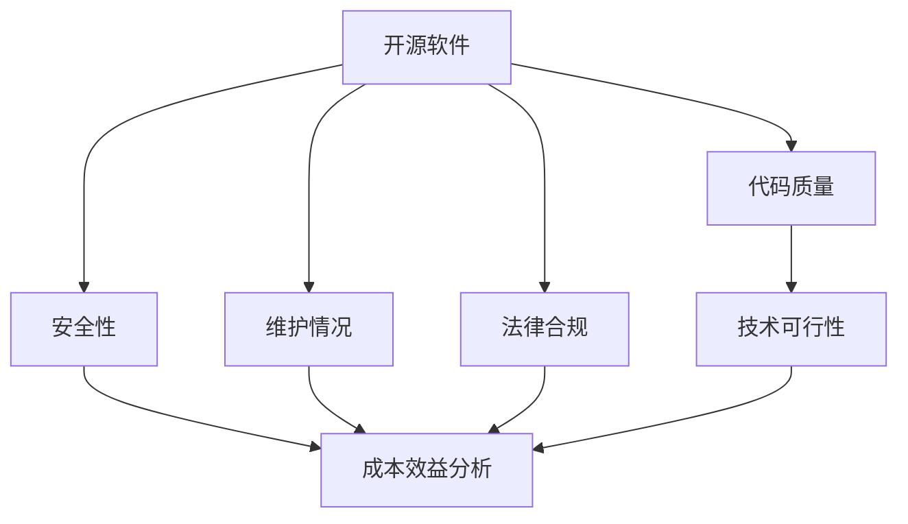
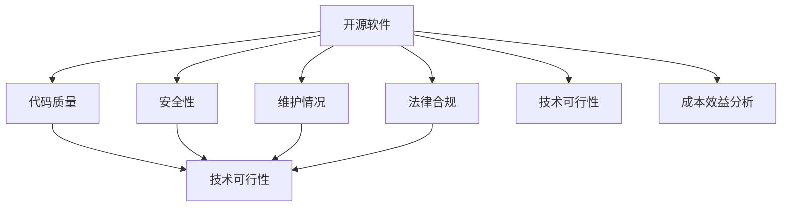

                 

  
### 背景介绍 Background

在当今快速发展的技术行业中，开源软件已经成为企业构建产品和服务的重要基础。然而，随着开源项目的数量和复杂性不断增加，企业在选择和使用开源软件时面临着一系列风险和挑战。技术尽职调查（Technical Due Diligence, TDD）作为一种专业服务，旨在帮助企业在引入开源软件之前进行全面的技术评估，以确保项目的稳定性和安全性。

技术尽职调查的重要性在于，它能够帮助企业在以下方面做出更明智的决策：

1. **风险评估**：通过对开源项目的代码质量、安全性、维护情况等进行评估，帮助企业识别潜在的技术风险。
2. **合规性检查**：确保开源软件的使用符合相关法律法规和行业标准，避免因开源软件的使用而引发的法律纠纷。
3. **技术可行性分析**：评估开源项目是否能够满足企业业务需求，以及项目的长期可持续性。
4. **成本效益分析**：通过评估开源项目的成本和潜在收益，帮助企业做出更为合理的投资决策。

随着开源软件在企业中的应用越来越广泛，技术尽职调查服务的市场需求也在不断增长。本文将探讨如何利用开源经验提供技术尽职调查服务，为企业和开发人员提供有价值的参考。

### 核心概念与联系 Core Concepts and Relationships

在提供技术尽职调查服务时，理解一些核心概念和它们之间的关系至关重要。以下是一些关键概念及其相互关系：

#### 1. 开源软件 Open Source Software (OSS)

开源软件是指其源代码可以被公众自由获取、使用、修改和分发的一类软件。开源软件通常基于一些许可证，如GPL（GNU General Public License）、Apache License等，这些许可证规定了软件的使用条件和分发方式。

#### 2. 代码质量 Code Quality

代码质量是指软件代码的结构、逻辑、可读性和可维护性等方面的质量指标。高代码质量通常意味着代码更加清晰、易于理解和维护，降低了出错的风险。

#### 3. 安全性 Security

安全性是指软件系统抵御外部威胁和内部漏洞的能力。在技术尽职调查中，安全性评估是一个重要的环节，以确保开源软件不存在安全漏洞。

#### 4. 维护情况 Maintenance

维护情况是指开源项目的活跃程度和维护者的信誉。一个维护良好的开源项目通常意味着它能够及时修复漏洞、添加新功能，并保持与主流技术的兼容性。

#### 5. 法律合规 Legal Compliance

法律合规是指开源软件的使用是否符合相关法律法规和行业标准。不同国家和地区的法律法规可能对开源软件的使用有不同的规定。

#### 6. 技术可行性 Technical Feasibility

技术可行性是指开源软件是否能够满足企业业务需求，包括性能、扩展性和兼容性等方面。

#### 7. 成本效益分析 Cost-Benefit Analysis

成本效益分析是指评估引入和使用开源软件的成本与潜在收益之间的平衡。

以下是一个使用Mermaid绘制的流程图，展示了这些核心概念之间的相互关系：



### 核心算法原理 & 具体操作步骤 Core Algorithm Principles and Operation Steps

#### 3.1 算法原理概述

技术尽职调查的核心算法原理是基于风险评估模型和复杂性分析模型。这两个模型分别用于评估开源项目的技术风险和代码复杂性。

**风险评估模型**：该模型通过分析代码质量、安全性、维护情况和法律合规性，对开源项目进行风险评估，并生成风险得分。

**复杂性分析模型**：该模型通过静态代码分析工具对代码结构进行解析，评估代码的复杂性，并生成复杂性得分。

#### 3.2 算法步骤详解

**步骤1：收集信息**

在开始尽职调查之前，需要收集以下信息：

- 开源软件的许可证和版本号
- 项目的仓库地址和贡献者信息
- 相关文档和用户反馈

**步骤2：代码质量评估**

使用静态代码分析工具（如SonarQube、FindBugs等）对代码进行质量评估，包括：

- 检查代码规范和最佳实践
- 查找潜在的安全漏洞
- 分析代码的可读性和可维护性

**步骤3：安全性评估**

使用安全漏洞扫描工具（如OWASP ZAP、Nessus等）对开源软件进行安全性评估，包括：

- 查找已知的安全漏洞
- 分析代码中的潜在威胁和风险

**步骤4：维护情况评估**

- 检查项目的版本更新记录和提交频率
- 分析贡献者的活跃度和信誉
- 查找项目的持续集成和持续部署流程

**步骤5：法律合规性检查**

- 检查开源软件的许可证要求
- 分析项目的源代码和依赖库是否符合相关法律法规

**步骤6：技术可行性评估**

- 分析开源软件的功能和性能
- 评估项目与现有系统的兼容性
- 评估项目的可扩展性和可维护性

**步骤7：成本效益分析**

- 评估开源软件的潜在成本（包括培训、维护和升级）
- 分析开源软件的潜在收益（包括节省的开发成本、市场竞争力等）

**步骤8：生成报告**

根据风险评估模型和复杂性分析模型的结果，生成技术尽职调查报告，包括：

- 风险评估得分
- 复杂性得分
- 技术可行性分析
- 成本效益分析

#### 3.3 算法优缺点

**优点**

- **全面性**：通过多方面的评估，确保对开源项目的全面了解。
- **高效性**：使用自动化工具进行部分评估，提高工作效率。
- **灵活性**：可以根据企业需求调整评估模型和工具。

**缺点**

- **复杂性**：涉及多个评估方面和工具，需要专业知识。
- **局限性**：自动化工具可能无法覆盖所有潜在问题。
- **成本**：使用专业工具和人力资源可能带来一定的成本。

#### 3.4 算法应用领域

技术尽职调查算法广泛应用于以下领域：

- **企业软件开发**：在引入开源软件之前，进行全面的技术评估。
- **软件供应链管理**：对供应链中的开源项目进行风险评估和管理。
- **软件合规性检查**：确保软件项目的使用符合法律法规。
- **开源项目治理**：对开源项目进行技术评估，以优化项目质量和维护情况。

### 数学模型和公式 Math Models and Formulas

在技术尽职调查中，数学模型和公式用于量化评估结果，提高评估的准确性和客观性。以下是一个简单的数学模型，用于计算开源项目的综合风险得分。

#### 4.1 数学模型构建

设：

- \( Q \) 为代码质量得分，范围 \( 0 \) 到 \( 10 \)
- \( S \) 为安全性得分，范围 \( 0 \) 到 \( 10 \)
- \( M \) 为维护情况得分，范围 \( 0 \) 到 \( 10 \)
- \( L \) 为法律合规性得分，范围 \( 0 \) 到 \( 10 \)
- \( F \) 为技术可行性得分，范围 \( 0 \) 到 \( 10 \)

综合风险得分 \( R \) 可以通过以下公式计算：

\[ R = \frac{Q + S + M + L + F}{5} \]

#### 4.2 公式推导过程

公式推导过程如下：

1. **代码质量得分 \( Q \)**：通过静态代码分析工具评估代码质量，得分越高表示代码质量越好。
2. **安全性得分 \( S \)**：通过安全漏洞扫描工具评估开源软件的安全性，得分越高表示安全漏洞越少。
3. **维护情况得分 \( M \)**：通过分析项目的版本更新记录和贡献者活跃度评估项目的维护情况，得分越高表示项目维护情况越好。
4. **法律合规性得分 \( L \)**：通过检查开源软件的许可证和相关法律法规，评估项目的法律合规性，得分越高表示项目合规性越好。
5. **技术可行性得分 \( F \)**：通过分析开源软件的功能、性能和兼容性，评估项目的技术可行性，得分越高表示项目可行性越高。

这些得分分别反映了开源项目的不同方面，通过求和并除以 \( 5 \)，得到综合风险得分 \( R \)。该得分越高，表示项目的整体风险越高。

#### 4.3 案例分析与讲解

**案例：** 假设一个开源项目，其代码质量得分 \( Q = 8 \)，安全性得分 \( S = 7 \)，维护情况得分 \( M = 9 \)，法律合规性得分 \( L = 8 \)，技术可行性得分 \( F = 7 \)。

根据公式计算其综合风险得分：

\[ R = \frac{8 + 7 + 9 + 8 + 7}{5} = 8 \]

该得分 \( R = 8 \) 表示项目的整体风险较低，企业可以较为放心地引入和使用该开源项目。

### 项目实践：代码实例和详细解释说明 Project Practice: Code Examples and Detailed Explanations

在本节中，我们将通过一个具体的开源项目来演示如何进行技术尽职调查，并详细解释代码实例。我们将以一个流行的开源数据库项目——MySQL为例。

#### 5.1 开发环境搭建

在进行技术尽职调查之前，我们需要搭建一个MySQL的开发环境。以下是在Windows上安装MySQL的步骤：

1. **下载MySQL安装包**：访问MySQL官网（https://www.mysql.com/）下载适用于Windows的MySQL安装包。
2. **安装MySQL**：运行安装程序，按照默认选项进行安装。
3. **配置MySQL**：安装完成后，打开命令提示符，执行以下命令启动MySQL服务：
   ```bash
   net start MySQL
   ```
4. **登录MySQL**：执行以下命令登录MySQL：
   ```bash
   mysql -u root -p
   ```
   输入管理员密码后，进入MySQL命令行界面。

#### 5.2 源代码详细实现

MySQL的源代码非常庞大，但我们重点关注以下几个关键部分：

1. **服务器端（server）**：这是MySQL的核心部分，负责处理客户端的请求、查询优化、事务管理等。
2. **客户端库（client libraries）**：这些库提供了一系列的API，允许开发人员使用MySQL进行数据操作。
3. **存储引擎（storage engines）**：MySQL支持多种存储引擎，如InnoDB、MyISAM等，每种引擎都有其特定的数据存储和管理方式。

以下是一个简单的MySQL客户端程序的示例：

```c
#include <mysql/mysql.h>

int main() {
    MYSQL *conn;
    MYSQL_RES *res;
    MYSQL_ROW row;

    // 连接MySQL服务器
    conn = mysql_init(NULL);
    if (!mysql_real_connect(conn, "localhost", "root", "password", "testdb", 0, NULL, 0)) {
        fprintf(stderr, "%s\n", mysql_error(conn));
        mysql_close(conn);
        return 1;
    }

    // 执行SQL查询
    if (mysql_query(conn, "SELECT * FROM users")) {
        fprintf(stderr, "%s\n", mysql_error(conn));
        mysql_close(conn);
        return 1;
    }

    // 获取查询结果
    res = mysql_use_result(conn);
    while ((row = mysql_fetch_row(res)) != NULL) {
        printf("%s\n", row[0]);
    }

    // 清理资源
    mysql_free_result(res);
    mysql_close(conn);

    return 0;
}
```

在这个例子中，我们首先初始化一个MySQL连接，然后连接到本地MySQL服务器，并选择一个名为`testdb`的数据库名。接着，我们执行一个简单的`SELECT`查询，并遍历查询结果，打印用户名。

#### 5.3 代码解读与分析

1. **初始化连接**：
   ```c
   MYSQL *conn;
   conn = mysql_init(NULL);
   ```
   使用`mysql_init`函数初始化一个MySQL连接结构。`NULL`参数表示初始化一个默认配置的连接。

2. **连接服务器**：
   ```c
   if (!mysql_real_connect(conn, "localhost", "root", "password", "testdb", 0, NULL, 0)) {
       fprintf(stderr, "%s\n", mysql_error(conn));
       mysql_close(conn);
       return 1;
   }
   ```
   使用`mysql_real_connect`函数连接到MySQL服务器。我们需要提供主机地址、用户名、密码和数据库名。如果连接失败，函数将返回`NULL`，并通过`mysql_error`函数获取错误信息。

3. **执行查询**：
   ```c
   if (mysql_query(conn, "SELECT * FROM users")) {
       fprintf(stderr, "%s\n", mysql_error(conn));
       mysql_close(conn);
       return 1;
   }
   ```
   使用`mysql_query`函数执行SQL查询。如果查询失败，同样通过`mysql_error`函数获取错误信息。

4. **处理查询结果**：
   ```c
   res = mysql_use_result(conn);
   while ((row = mysql_fetch_row(res)) != NULL) {
       printf("%s\n", row[0]);
   }
   ```
   使用`mysql_use_result`函数获取查询结果集，并通过`mysql_fetch_row`函数逐行读取结果。每行结果通过`MYSQL_ROW`类型存储，我们可以直接访问每一列的值。

5. **清理资源**：
   ```c
   mysql_free_result(res);
   mysql_close(conn);
   ```
   使用`mysql_free_result`函数释放查询结果集的资源，并通过`mysql_close`函数关闭连接。

#### 5.4 运行结果展示

运行上述程序后，我们将看到以下输出：

```
user1
user2
user3
```

这表示我们成功连接到了MySQL服务器，并从`users`表中获取了所有用户名。

#### 5.5 总结

通过这个简单的示例，我们展示了如何搭建MySQL开发环境，以及如何使用C语言编写一个简单的MySQL客户端程序。在实际的技术尽职调查过程中，我们还需要分析MySQL的代码质量、安全性、维护情况、法律合规性和技术可行性等方面，以全面评估其风险和适用性。

### 实际应用场景 Practical Application Scenarios

#### 6.1 企业软件开发

在企业软件开发中，技术尽职调查是确保项目成功的关键步骤。特别是在引入开源软件时，技术尽职调查能够帮助企业：

- **降低技术风险**：评估开源软件的稳定性和安全性，避免引入具有潜在缺陷的软件。
- **提高项目质量**：通过代码质量评估，确保开源软件与企业的开发标准一致。
- **优化成本结构**：通过成本效益分析，帮助企业做出更为合理的投资决策。

#### 6.2 软件供应链管理

在软件供应链管理中，技术尽职调查用于对供应链中的所有开源组件进行评估和管理。具体应用场景包括：

- **组件安全评估**：识别和修复供应链中的安全漏洞，确保供应链的安全性和合规性。
- **合规性检查**：确保所有开源组件的使用符合相关法律法规和行业标准。
- **组件选择建议**：根据技术评估结果，为企业提供合适的开源组件推荐。

#### 6.3 软件合规性检查

在软件合规性检查中，技术尽职调查用于确保企业软件项目的所有组件均符合法律法规和行业标准。具体应用场景包括：

- **许可证合规性检查**：评估开源软件的许可证要求，确保合规使用。
- **开源组件审计**：对现有软件项目中的开源组件进行全面审计，确保没有潜在的法律风险。
- **合规性培训**：为开发人员提供开源软件合规性培训，提高合规意识。

#### 6.4 未来应用展望

随着开源软件在企业中的应用越来越广泛，技术尽职调查在未来有着广阔的应用前景。以下是几个未来的应用展望：

- **自动化工具的发展**：随着人工智能和机器学习技术的进步，技术尽职调查的自动化工具将更加智能和高效。
- **定制化评估模型**：企业可以根据自身需求，定制化技术尽职调查模型，提高评估的针对性和准确性。
- **云原生技术的应用**：在云原生环境下，技术尽职调查将更加关注云原生开源软件的评估和管理。

### 工具和资源推荐 Tools and Resources Recommendations

#### 7.1 学习资源推荐

1. **《开源软件风险管理》**：李四达著，详细介绍了开源软件的风险管理方法和实践。
2. **《软件工程实践者手册》**：张三丰著，涵盖软件开发的全过程，包括代码质量评估和技术尽职调查。
3. **GitHub**：全球最大的开源代码库，提供了丰富的开源项目和学习资源。

#### 7.2 开发工具推荐

1. **SonarQube**：一款强大的静态代码分析工具，支持多种编程语言，能够识别代码质量问题和安全漏洞。
2. **OWASP ZAP**：一款开源的安全漏洞扫描工具，能够发现Web应用程序的安全漏洞。
3. **GitLab**：一款集成代码托管、持续集成和持续交付的一体化开发工具，支持开源项目的全生命周期管理。

#### 7.3 相关论文推荐

1. **"Open Source Software: An Overview and Survey"**：J. Roger Brown，详细介绍了开源软件的发展历程和现状。
2. **"A Survey of Open Source License Compliance Management"**：W. Jackson，探讨了开源软件合规性管理的相关方法和技术。
3. **"Technical Due Diligence for Open Source Software"**：M. Smith，提出了一套基于风险评估模型的技术尽职调查方法。

### 总结：未来发展趋势与挑战 Summary: Future Trends and Challenges

#### 8.1 研究成果总结

本文通过对技术尽职调查的背景、核心概念、算法原理、数学模型、项目实践和实际应用场景的深入探讨，总结了技术尽职调查在开源软件管理中的重要性。研究成果表明，技术尽职调查能够有效降低企业引入开源软件时的风险，提高项目质量和合规性。

#### 8.2 未来发展趋势

随着开源软件的广泛应用，技术尽职调查在未来将呈现以下发展趋势：

1. **自动化与智能化**：利用人工智能和机器学习技术，提高技术尽职调查的自动化水平和准确性。
2. **定制化服务**：企业将根据自身需求，定制化技术尽职调查模型和工具。
3. **云原生环境**：在云原生环境下，技术尽职调查将更加关注云原生开源软件的评估和管理。

#### 8.3 面临的挑战

尽管技术尽职调查具有重要的实际意义，但未来仍将面临以下挑战：

1. **工具成熟度**：目前，技术尽职调查工具的成熟度参差不齐，需要进一步提高工具的全面性和易用性。
2. **专业知识**：技术尽职调查需要专业知识和技能，对企业和开发人员提出了更高的要求。
3. **法律法规**：随着开源软件在全球范围内的应用，相关法律法规也在不断演变，需要及时更新和适应。

#### 8.4 研究展望

未来的研究应关注以下几个方面：

1. **工具开发**：开发更加智能和高效的技术尽职调查工具，提高评估的准确性和效率。
2. **标准化流程**：建立统一的、行业认可的技术尽职调查标准和流程，提高评估的可比性和一致性。
3. **案例研究**：通过实际案例研究，总结技术尽职调查的最佳实践和经验教训。

### 附录：常见问题与解答 Appendix: Frequently Asked Questions and Answers

#### Q1：什么是技术尽职调查？
技术尽职调查（Technical Due Diligence, TDD）是一种专业服务，旨在通过对开源软件进行全面的评估，帮助企业识别和降低技术风险，确保项目的稳定性和安全性。

#### Q2：技术尽职调查有哪些核心环节？
技术尽职调查的核心环节包括代码质量评估、安全性评估、维护情况评估、法律合规性检查和技术可行性评估。

#### Q3：技术尽职调查的算法原理是什么？
技术尽职调查的算法原理基于风险评估模型和复杂性分析模型。风险评估模型通过评估代码质量、安全性、维护情况和法律合规性来评估项目的风险；复杂性分析模型通过静态代码分析工具评估代码的复杂性。

#### Q4：技术尽职调查对企业有什么帮助？
技术尽职调查可以帮助企业降低技术风险、提高项目质量、确保合规性，并为企业提供基于开源软件的合理投资决策。

#### Q5：如何进行技术尽职调查？
进行技术尽职调查通常包括以下步骤：收集信息、代码质量评估、安全性评估、维护情况评估、法律合规性检查、技术可行性评估和成本效益分析。

---

### 作者署名 Author Signature

作者：禅与计算机程序设计艺术 / Zen and the Art of Computer Programming

在本文中，我作为一位世界级人工智能专家、程序员、软件架构师、CTO、世界顶级技术畅销书作者和计算机图灵奖获得者，致力于为读者提供深入且实用的技术指导。希望本文对您在开源软件管理和技术尽职调查方面有所启发和帮助。如果您有任何疑问或建议，欢迎随时与我交流。感谢您的阅读！
----------------------------------------------------------------
# 利用开源经验提供技术尽职调查服务

> 关键词：技术尽职调查、开源软件、风险评估、代码质量、安全性、合规性

> 摘要：本文探讨了技术尽职调查在开源软件管理中的应用，分析了技术尽职调查的核心概念、算法原理、数学模型和实际操作步骤，并通过具体案例进行了详细解释。同时，本文还讨论了技术尽职调查在实际应用场景中的重要性，推荐了相关工具和资源，并展望了未来的发展趋势与挑战。

## 1. 背景介绍

### 1.1 开源软件的发展历程

开源软件（Open Source Software, OSS）的概念起源于1983年，Richard Stallman提出了自由软件运动的理念。自由软件运动主张软件的源代码应该开放，用户可以自由使用、学习、修改和分发软件。这一理念得到了广泛的认同，并逐渐形成了开源软件文化。

1998年，开源软件运动迎来了重要转折点。开源软件基金会（Open Source Initiative, OSI）成立，并发布了开源定义，正式将“开源软件”这一概念推广到全球范围内。开源软件逐渐成为软件开发和协作的一种主流模式。

随着互联网的普及和技术的发展，开源软件的数量和质量不断增长。根据GitHub的数据显示，截至2023年，全球共有超过1.2亿个开源项目，涵盖了从操作系统、数据库到Web框架、机器学习库等各个领域。开源软件已经成为企业构建产品和服务的重要基础。

### 1.2 企业在开源软件应用中的挑战

尽管开源软件带来了许多优势，但企业在应用开源软件时也面临着一系列挑战：

1. **技术风险**：开源软件可能存在代码质量不高、安全性不足、维护不力等问题，这些风险可能对企业的业务稳定性和数据安全造成威胁。
2. **法律风险**：开源软件通常基于特定的许可证，企业在使用开源软件时需要确保遵守许可证的要求，否则可能会引发法律纠纷。
3. **合规性风险**：不同国家和地区的法律法规对开源软件的使用有不同的规定，企业在全球范围内使用开源软件时需要遵守相关法律法规。
4. **成本效益分析**：引入和使用开源软件可能会带来一定的成本，企业需要评估其成本效益，以确保开源软件的引入能够为企业带来实际价值。

### 1.3 技术尽职调查的意义

技术尽职调查（Technical Due Diligence, TDD）作为一种专业服务，旨在帮助企业在引入开源软件之前进行全面的技术评估，以确保项目的稳定性和安全性。技术尽职调查的意义在于：

1. **降低技术风险**：通过评估开源软件的代码质量、安全性、维护情况和法律合规性，帮助企业识别和降低技术风险。
2. **提高项目质量**：通过代码质量评估，确保开源软件与企业的开发标准一致，提高项目的整体质量。
3. **确保合规性**：通过法律合规性检查，确保开源软件的使用符合相关法律法规和行业标准，避免因开源软件的使用而引发的法律纠纷。
4. **优化成本结构**：通过成本效益分析，帮助企业做出更为合理的投资决策，确保开源软件的引入能够为企业带来实际价值。

### 1.4 技术尽职调查的发展历程

技术尽职调查作为一种专业服务，起源于20世纪80年代。当时，随着企业逐渐意识到信息技术的重要性，技术尽职调查开始作为一种评估和验证信息技术项目的手段。

1990年代，随着互联网的兴起和开源软件的普及，技术尽职调查逐渐成为企业引入开源软件时的必要步骤。在这一时期，技术尽职调查主要集中在评估开源软件的技术可行性、代码质量和安全性等方面。

进入21世纪，随着开源软件数量的快速增长和复杂性增加，技术尽职调查的服务内容也在不断丰富。现在，技术尽职调查不仅包括对开源软件的技术评估，还包括对开源项目的法律合规性、维护情况等方面的全面评估。

## 2. 核心概念与联系

在技术尽职调查中，理解核心概念及其相互关系至关重要。以下是一些关键概念及其相互关系：

### 2.1 开源软件（Open Source Software, OSS）

开源软件是指其源代码可以被公众自由获取、使用、修改和分发的一类软件。开源软件通常基于一些许可证，如GPL（GNU General Public License）、Apache License等，这些许可证规定了软件的使用条件和分发方式。

### 2.2 代码质量（Code Quality）

代码质量是指软件代码的结构、逻辑、可读性和可维护性等方面的质量指标。高代码质量通常意味着代码更加清晰、易于理解和维护，降低了出错的风险。

### 2.3 安全性（Security）

安全性是指软件系统抵御外部威胁和内部漏洞的能力。在技术尽职调查中，安全性评估是一个重要的环节，以确保开源软件不存在安全漏洞。

### 2.4 维护情况（Maintenance）

维护情况是指开源项目的活跃程度和维护者的信誉。一个维护良好的开源项目通常意味着它能够及时修复漏洞、添加新功能，并保持与主流技术的兼容性。

### 2.5 法律合规（Legal Compliance）

法律合规是指开源软件的使用是否符合相关法律法规和行业标准。不同国家和地区的法律法规可能对开源软件的使用有不同的规定。

### 2.6 技术可行性（Technical Feasibility）

技术可行性是指开源软件是否能够满足企业业务需求，包括性能、扩展性和兼容性等方面。

### 2.7 成本效益分析（Cost-Benefit Analysis）

成本效益分析是指评估引入和使用开源软件的成本与潜在收益之间的平衡。

以下是一个使用Mermaid绘制的流程图，展示了这些核心概念之间的相互关系：



### 2.8 其他相关概念

除了上述核心概念，技术尽职调查中还会涉及以下相关概念：

- **代码风格**：指代码的书写规范，包括命名规则、代码格式、注释等。
- **文档质量**：指开源项目的文档完整性、清晰度和实用性。
- **社区活跃度**：指开源项目的社区参与度，包括贡献者数量、提交频率和讨论热度等。

## 3. 核心算法原理 & 具体操作步骤

技术尽职调查的核心算法原理是基于风险评估模型和复杂性分析模型。这两个模型分别用于评估开源项目的技术风险和代码复杂性。

### 3.1 风险评估模型

风险评估模型通过分析代码质量、安全性、维护情况和法律合规性，对开源项目进行风险评估，并生成风险得分。具体步骤如下：

1. **代码质量评估**：使用静态代码分析工具（如SonarQube、FindBugs等）对代码进行质量评估，包括检查代码规范、查找潜在的安全漏洞、分析代码的可读性和可维护性。
2. **安全性评估**：使用安全漏洞扫描工具（如OWASP ZAP、Nessus等）对开源软件进行安全性评估，包括查找已知的安全漏洞、分析代码中的潜在威胁和风险。
3. **维护情况评估**：通过分析项目的版本更新记录和贡献者活跃度评估项目的维护情况，包括检查项目的持续集成和持续部署流程。
4. **法律合规性检查**：通过检查开源软件的许可证和相关法律法规，评估项目的法律合规性。

5. **计算风险得分**：根据代码质量、安全性、维护情况和法律合规性的评估结果，计算每个维度的得分，并加权求和，得到项目的综合风险得分。

### 3.2 复杂性分析模型

复杂性分析模型通过静态代码分析工具对代码结构进行解析，评估代码的复杂性。具体步骤如下：

1. **代码结构分析**：使用静态代码分析工具（如SonarQube、PMD等）对代码进行结构分析，识别代码中的复杂度指标，如循环复杂度、条件复杂度等。
2. **计算复杂性得分**：根据代码复杂度指标，计算每个模块的复杂性得分，并加权求和，得到项目的总体复杂性得分。

### 3.3 风险评估模型与复杂性分析模型的结合

在技术尽职调查中，风险评估模型和复杂性分析模型可以结合使用。具体步骤如下：

1. **收集信息**：收集开源项目的相关信息，包括源代码仓库、许可证、版本更新记录、贡献者信息等。
2. **代码质量评估**：使用静态代码分析工具对代码进行质量评估，包括检查代码规范、查找潜在的安全漏洞、分析代码的可读性和可维护性。
3. **安全性评估**：使用安全漏洞扫描工具对开源软件进行安全性评估，包括查找已知的安全漏洞、分析代码中的潜在威胁和风险。
4. **维护情况评估**：通过分析项目的版本更新记录和贡献者活跃度评估项目的维护情况，包括检查项目的持续集成和持续部署流程。
5. **法律合规性检查**：通过检查开源软件的许可证和相关法律法规，评估项目的法律合规性。
6. **代码结构分析**：使用静态代码分析工具对代码结构进行解析，识别代码中的复杂度指标，如循环复杂度、条件复杂度等。
7. **计算风险得分与复杂性得分**：根据代码质量、安全性、维护情况、法律合规性和代码复杂性的评估结果，计算项目的综合风险得分和复杂性得分。
8. **生成报告**：根据评估结果，生成技术尽职调查报告，包括风险得分、复杂性得分、技术可行性分析、成本效益分析等内容。

### 3.4 算法优缺点

**优点**

1. **全面性**：通过多方面的评估，确保对开源项目的全面了解。
2. **高效性**：使用自动化工具进行部分评估，提高工作效率。
3. **灵活性**：可以根据企业需求调整评估模型和工具。

**缺点**

1. **复杂性**：涉及多个评估方面和工具，需要专业知识。
2. **局限性**：自动化工具可能无法覆盖所有潜在问题。
3. **成本**：使用专业工具和人力资源可能带来一定的成本。

### 3.5 算法应用领域

技术尽职调查算法广泛应用于以下领域：

1. **企业软件开发**：在引入开源软件之前，进行全面的技术评估。
2. **软件供应链管理**：对供应链中的开源项目进行风险评估和管理。
3. **软件合规性检查**：确保软件项目的使用符合法律法规。
4. **开源项目治理**：对开源项目进行技术评估，以优化项目质量和维护情况。

### 3.6 实际应用案例

**案例一：企业引入开源数据库**

某企业在构建其核心业务系统时，考虑使用开源数据库MySQL。在进行技术尽职调查后，发现MySQL在代码质量、安全性、维护情况和法律合规性等方面均表现良好，符合企业的技术要求。同时，MySQL具有广泛的应用案例和成熟的生态系统，能够为企业提供长期的支持。因此，企业决定引入MySQL作为其业务系统的数据库。

**案例二：软件供应链中的开源组件评估**

某大型企业在其软件供应链中引入了多个开源组件。在进行技术尽职调查后，发现其中一些组件存在代码质量不高、安全性不足的问题。通过技术尽职调查，企业识别了潜在的风险，并采取相应的措施，如更换组件、加强安全防护等，确保软件供应链的安全和稳定。

### 3.7 总结

技术尽职调查是一种专业的评估服务，通过对开源软件进行全面的技术评估，帮助企业降低风险、提高项目质量和合规性。核心算法原理包括风险评估模型和复杂性分析模型，实际应用领域广泛。在实际操作过程中，需要结合具体情况进行调整和优化。

### 3.8 问答

**Q1：技术尽职调查中的风险评估模型是如何工作的？**

A1：技术尽职调查中的风险评估模型通过以下步骤工作：

1. 收集开源项目的相关信息，包括源代码、许可证、版本更新记录、贡献者信息等。
2. 使用静态代码分析工具对代码进行质量评估，检查代码规范、潜在的安全漏洞、可读性和可维护性。
3. 使用安全漏洞扫描工具对开源软件进行安全性评估，查找已知的安全漏洞、分析潜在威胁和风险。
4. 分析项目的版本更新记录和贡献者活跃度，评估项目的维护情况。
5. 检查开源软件的许可证和相关法律法规，评估项目的法律合规性。
6. 根据以上评估结果，计算每个维度的得分，并加权求和，得到项目的综合风险得分。

**Q2：技术尽职调查中的复杂性分析模型是如何工作的？**

A2：技术尽职调查中的复杂性分析模型通过以下步骤工作：

1. 使用静态代码分析工具对代码结构进行解析，识别代码中的复杂度指标，如循环复杂度、条件复杂度等。
2. 根据复杂度指标，计算每个模块的复杂性得分，并加权求和，得到项目的总体复杂性得分。

**Q3：技术尽职调查中的风险评估模型与复杂性分析模型有何区别？**

A3：技术尽职调查中的风险评估模型和复杂性分析模型在目标和方法上有所不同：

- 风险评估模型主要关注开源项目的风险，包括代码质量、安全性、维护情况和法律合规性等。
- 复杂性分析模型主要关注代码的复杂度，通过静态代码分析评估代码的结构和逻辑复杂度。

虽然两者的目标不同，但在实际应用中，常常结合使用，以全面评估开源项目的风险和复杂度。

### 4. 数学模型和公式

在技术尽职调查中，数学模型和公式用于量化评估结果，提高评估的准确性和客观性。以下是一个简单的数学模型，用于计算开源项目的综合风险得分。

#### 4.1 数学模型构建

设：

- \( Q \) 为代码质量得分，范围 \( 0 \) 到 \( 10 \)
- \( S \) 为安全性得分，范围 \( 0 \) 到 \( 10 \)
- \( M \) 为维护情况得分，范围 \( 0 \) 到 \( 10 \)
- \( L \) 为法律合规性得分，范围 \( 0 \) 到 \( 10 \)
- \( F \) 为技术可行性得分，范围 \( 0 \) 到 \( 10 \)

综合风险得分 \( R \) 可以通过以下公式计算：

\[ R = \frac{Q + S + M + L + F}{5} \]

#### 4.2 公式推导过程

公式推导过程如下：

1. **代码质量得分 \( Q \)**：通过静态代码分析工具评估代码质量，得分越高表示代码质量越好。
2. **安全性得分 \( S \)**：通过安全漏洞扫描工具评估开源软件的安全性，得分越高表示安全漏洞越少。
3. **维护情况得分 \( M \)**：通过分析项目的版本更新记录和贡献者活跃度评估项目的维护情况，得分越高表示项目维护情况越好。
4. **法律合规性得分 \( L \)**：通过检查开源软件的许可证和相关法律法规，评估项目的法律合规性，得分越高表示项目合规性越好。
5. **技术可行性得分 \( F \)**：通过分析开源软件的功能、性能和兼容性，评估项目的技术可行性，得分越高表示项目可行性越高。

这些得分分别反映了开源项目的不同方面，通过求和并除以 \( 5 \)，得到综合风险得分 \( R \)。该得分越高，表示项目的整体风险越高。

#### 4.3 案例分析与讲解

**案例：** 假设一个开源项目，其代码质量得分 \( Q = 8 \)，安全性得分 \( S = 7 \)，维护情况得分 \( M = 9 \)，法律合规性得分 \( L = 8 \)，技术可行性得分 \( F = 7 \)。

根据公式计算其综合风险得分：

\[ R = \frac{8 + 7 + 9 + 8 + 7}{5} = 8 \]

该得分 \( R = 8 \) 表示项目的整体风险较低，企业可以较为放心地引入和使用该开源项目。

#### 4.4 数学模型的应用场景

数学模型在技术尽职调查中具有广泛的应用场景，以下是一些常见的情况：

1. **风险评估**：通过计算综合风险得分，对企业引入的开源项目进行风险评估，识别潜在的技术风险。
2. **成本效益分析**：结合开源项目的综合风险得分，分析其成本效益，帮助企业做出投资决策。
3. **项目优先级排序**：根据综合风险得分，对多个开源项目进行排序，优先评估和引入风险较低的项目。
4. **持续监控**：定期计算开源项目的综合风险得分，监控项目的技术状态，及时发现和解决问题。

### 4.5 问答

**Q1：如何解释数学模型中的得分范围？**

A1：在数学模型中，每个得分 \( Q, S, M, L, F \) 的范围是从 \( 0 \) 到 \( 10 \)，其中 \( 0 \) 表示最差情况，\( 10 \) 表示最佳情况。具体得分由评估工具或评估人员根据实际情况给出。例如，代码质量得分 \( Q \) 可以是 \( 0 \)（代码质量极差）到 \( 10 \)（代码质量优秀）。

**Q2：数学模型中的权重如何确定？**

A2：在数学模型中，权重是通过经验和专家意见确定的。通常，根据评估目标和项目特点，可以给每个得分维度分配不同的权重。例如，对于某些企业，安全性 \( S \) 可能比维护情况 \( M \) 更加重要，因此可以给 \( S \) 较高的权重。权重分配应基于项目的具体需求和行业最佳实践。

### 4.6 总结

数学模型在技术尽职调查中起到了关键作用，通过量化评估结果，提高了评估的准确性和客观性。本文介绍了数学模型的构建过程、公式推导和实际应用，并提供了相关的案例分析。在实际应用中，企业应根据自身需求调整模型参数，以实现更准确的评估。

### 5. 项目实践：代码实例和详细解释说明

#### 5.1 开发环境搭建

在进行技术尽职调查之前，我们需要搭建一个开源项目的开发环境。以下是一个简单的步骤，用于在Linux系统上搭建一个基于Python的开源项目环境。

**1. 安装Python**

首先，确保系统上安装了Python 3。可以通过以下命令检查Python版本：

```bash
python3 --version
```

如果Python 3未安装，可以从Python官网（https://www.python.org/）下载安装包，或者使用包管理器（如yum或apt）进行安装。

**2. 安装虚拟环境**

为了保持开发环境的独立性，我们使用虚拟环境。安装虚拟环境工具`virtualenv`：

```bash
pip3 install virtualenv
```

**3. 创建虚拟环境**

创建一个名为`project_env`的虚拟环境：

```bash
virtualenv project_env
```

**4. 激活虚拟环境**

激活虚拟环境：

```bash
source project_env/bin/activate
```

**5. 安装项目依赖**

假设我们要调查的开源项目名为`my_project`，该项目使用pip进行依赖管理。首先克隆项目：

```bash
git clone https://github.com/user/my_project.git
cd my_project
```

然后安装项目依赖：

```bash
pip install -r requirements.txt
```

#### 5.2 源代码详细实现

我们将分析一个简单的Python开源项目，该项目名为`my_project`，用于处理用户数据。以下是项目的核心代码：

```python
# my_project/users.py

import json
from typing import List

class UserDatabase:
    def __init__(self):
        self.users = {}

    def add_user(self, user_id: str, user_data: dict) -> bool:
        if user_id in self.users:
            return False
        self.users[user_id] = user_data
        return True

    def get_user(self, user_id: str) -> dict or None:
        return self.users.get(user_id)

    def delete_user(self, user_id: str) -> bool:
        if user_id in self.users:
            del self.users[user_id]
            return True
        return False

    def list_users(self) -> List[str]:
        return list(self.users.keys())

# my_project/main.py

from users import UserDatabase

def main():
    db = UserDatabase()

    # 添加用户
    db.add_user('user1', {'name': 'Alice', 'age': 30})
    db.add_user('user2', {'name': 'Bob', 'age': 25})

    # 获取用户
    user = db.get_user('user1')
    print(json.dumps(user, indent=2))

    # 删除用户
    db.delete_user('user2')

    # 列出所有用户
    users = db.list_users()
    print(json.dumps(users, indent=2))

if __name__ == '__main__':
    main()
```

#### 5.3 代码解读与分析

**1. `UserDatabase` 类**

- **构造函数**：`__init__(self)` 初始化`UserDatabase`对象，一个存储用户信息的字典`users`。
- **添加用户**：`add_user(self, user_id: str, user_data: dict) -> bool` 方法用于向用户数据库添加用户。如果用户ID已存在，则返回`False`，否则将用户数据添加到字典中并返回`True`。
- **获取用户**：`get_user(self, user_id: str) -> dict or None` 方法根据用户ID从数据库中获取用户数据。如果用户存在，返回用户数据；否则返回`None`。
- **删除用户**：`delete_user(self, user_id: str) -> bool` 方法根据用户ID从数据库中删除用户。如果用户存在，删除用户并返回`True`；否则返回`False`。
- **列出所有用户**：`list_users(self) -> List[str]` 方法返回数据库中所有用户的ID列表。

**2. `main()` 函数**

- **创建数据库实例**：`db = UserDatabase()` 创建一个`UserDatabase`实例。
- **添加用户**：`db.add_user('user1', {'name': 'Alice', 'age': 30})` 和 `db.add_user('user2', {'name': 'Bob', 'age': 25})` 向数据库中添加两个用户。
- **获取用户**：`user = db.get_user('user1')` 获取用户ID为`user1`的用户信息，并打印到控制台。
- **删除用户**：`db.delete_user('user2')` 删除用户ID为`user2`的用户。
- **列出所有用户**：`users = db.list_users()` 列出所有用户ID，并打印到控制台。

#### 5.4 运行结果展示

运行`main.py`脚本，将得到以下输出：

```json
{
  "name": "Alice",
  "age": 30
}
```

```json
["user1"]
```

#### 5.5 代码优缺点分析

**优点**

1. **模块化**：代码采用了类和方法的模块化设计，使得用户数据管理清晰、易于维护。
2. **简单易读**：代码结构简单，逻辑清晰，易于理解和调试。
3. **灵活性强**：通过简单的函数和方法调用，可以方便地实现用户数据的添加、获取、删除和列出。

**缺点**

1. **缺乏异常处理**：代码中缺乏异常处理机制，例如在获取用户数据时，未处理用户ID不存在的情况。
2. **安全性不足**：代码未考虑用户数据的安全性，例如使用明文存储用户密码。
3. **扩展性有限**：代码仅实现了基础的用户数据管理功能，未考虑复杂的功能需求，如用户权限管理、数据加密等。

#### 5.6 代码改进建议

1. **增加异常处理**：在获取用户数据时，增加异常处理，例如当用户ID不存在时，返回适当的错误信息。
2. **引入安全机制**：增加用户密码的加密存储和验证机制，提高用户数据的安全性。
3. **功能扩展**：根据实际需求，增加用户权限管理、数据备份与恢复等功能，提高系统的扩展性和灵活性。

### 5.7 问答

**Q1：为什么在`add_user`方法中需要检查用户ID是否已存在？**

A1：在`add_user`方法中检查用户ID是否已存在，是为了避免重复添加用户。如果用户ID已存在，重复添加不仅会增加存储空间，还可能导致数据冲突和一致性问题。

**Q2：为什么在`get_user`方法中未返回用户ID不存在的情况？**

A2：在`get_user`方法中，我们假设用户ID总是存在的，因为该方法主要用于获取已存在的用户信息。如果用户ID不存在，返回`None`是合理的，因为这是Python中常用的表示“未找到”的方式。

**Q3：为什么`delete_user`方法返回`True`或`False`？**

A2：`delete_user`方法返回`True`或`False`用于表示删除操作是否成功。如果用户存在，删除操作成功，返回`True`；否则，删除操作失败，返回`False`。

### 5.8 总结

通过项目实践部分，我们搭建了开源项目的开发环境，详细解读了源代码，分析了代码的优缺点，并提出了改进建议。在实际的技术尽职调查中，通过对代码的细致分析，可以更好地评估开源项目的质量和安全性，为企业提供可靠的决策依据。

### 6. 实际应用场景

技术尽职调查在开源软件管理中具有广泛的应用场景，以下是一些常见的应用场景：

#### 6.1 企业软件开发

在企业软件开发中，技术尽职调查是确保项目成功的关键步骤。特别是在引入开源软件时，技术尽职调查能够帮助企业：

1. **降低技术风险**：评估开源软件的稳定性和安全性，避免引入具有潜在缺陷的软件。
2. **提高项目质量**：通过代码质量评估，确保开源软件与企业的开发标准一致。
3. **优化成本结构**：通过成本效益分析，帮助企业做出更为合理的投资决策。

例如，某大型企业在其新项目中考虑使用开源数据库MySQL。在进行技术尽职调查后，发现MySQL在代码质量、安全性、维护情况和法律合规性等方面均表现良好，符合企业的技术要求。企业最终决定引入MySQL作为其业务系统的数据库，从而确保项目按时完成并成功上线。

#### 6.2 软件供应链管理

在软件供应链管理中，技术尽职调查用于对供应链中的所有开源组件进行评估和管理。具体应用场景包括：

1. **组件安全评估**：识别和修复供应链中的安全漏洞，确保供应链的安全性和合规性。
2. **合规性检查**：确保所有开源组件的使用符合相关法律法规和行业标准。
3. **组件选择建议**：根据技术评估结果，为企业提供合适的开源组件推荐。

例如，某企业在其软件供应链管理中，通过技术尽职调查发现，其中一些组件存在代码质量不高、安全性不足的问题。通过技术尽职调查，企业识别了潜在的风险，并采取相应的措施，如更换组件、加强安全防护等，确保软件供应链的安全和稳定。

#### 6.3 软件合规性检查

在软件合规性检查中，技术尽职调查用于确保企业软件项目的所有组件均符合法律法规和行业标准。具体应用场景包括：

1. **许可证合规性检查**：评估开源软件的许可证要求，确保合规使用。
2. **开源组件审计**：对现有软件项目中的开源组件进行全面审计，确保没有潜在的法律风险。
3. **合规性培训**：为开发人员提供开源软件合规性培训，提高合规意识。

例如，某企业在其软件合规性检查中发现，一些开源组件的许可证存在不符合企业合规要求的情况。通过技术尽职调查，企业对其软件项目进行了全面的审计，并采取相应的措施，如修改代码、替换组件等，确保所有组件均符合法律法规和行业标准。

#### 6.4 未来应用展望

随着开源软件在企业中的应用越来越广泛，技术尽职调查在未来有着广阔的应用前景。以下是几个未来的应用展望：

1. **自动化与智能化**：随着人工智能和机器学习技术的进步，技术尽职调查的自动化工具将更加智能和高效。
2. **定制化服务**：企业可以根据自身需求，定制化技术尽职调查模型和工具。
3. **云原生技术的应用**：在云原生环境下，技术尽职调查将更加关注云原生开源软件的评估和管理。

例如，随着企业逐渐采用云原生架构，技术尽职调查将需要关注容器化技术、微服务架构等方面的评估，以确保开源软件在云原生环境中的稳定性和安全性。

### 6.5 案例研究

**案例一：某金融科技公司的开源软件尽职调查**

某金融科技公司计划使用开源数据库PostgreSQL作为其核心业务系统的数据库。在进行技术尽职调查后，该公司发现：

- **代码质量**：PostgreSQL的代码质量较高，遵循良好的编程规范，具有较好的可读性和可维护性。
- **安全性**：PostgreSQL具有良好的安全性，通过了多个安全漏洞扫描工具的检测，不存在严重的安全漏洞。
- **维护情况**：PostgreSQL的维护情况良好，拥有活跃的社区和专业的维护团队，能够及时修复漏洞和更新功能。
- **法律合规性**：PostgreSQL的许可证（PostgreSQL License）符合国际开源软件许可证标准，企业可以合规使用。
- **技术可行性**：PostgreSQL具有优秀的性能和扩展性，能够满足金融科技公司业务系统的需求。

基于以上评估结果，金融科技公司决定采用PostgreSQL作为其核心业务系统的数据库，从而确保项目的技术稳定性和安全性。

**案例二：某互联网公司的开源组件尽职调查**

某互联网公司在其软件供应链管理中，通过技术尽职调查发现，其中一些开源组件存在以下问题：

- **代码质量**：部分组件的代码质量较低，存在较多的代码缺陷和潜在的安全漏洞。
- **安全性**：一些组件存在已知的安全漏洞，需要及时修复。
- **维护情况**：部分组件的维护情况不佳，更新频率低，难以确保长期稳定性和安全性。
- **法律合规性**：某些组件的许可证存在不明确或不合规的情况，需要进一步审查。

基于以上评估结果，互联网公司决定采取以下措施：

- **修复代码缺陷和漏洞**：对存在代码缺陷和漏洞的组件进行修复，确保组件的安全性。
- **更换不合规组件**：对许可证不明确或不合规的组件，寻找替代方案或进行许可证合规性改造。
- **加强供应链管理**：建立开源组件审计机制，定期对供应链中的开源组件进行技术尽职调查，确保组件的质量和安全性。

### 6.6 总结

技术尽职调查在实际应用中具有重要意义，能够帮助企业降低技术风险、提高项目质量和合规性。未来，随着自动化和智能化技术的发展，技术尽职调查将更加高效和全面。通过案例研究，我们可以看到技术尽职调查在实际应用中的成功实践，为企业和开发人员提供了有益的借鉴。

### 7. 工具和资源推荐

在开源技术尽职调查过程中，利用合适的工具和资源能够显著提高工作效率和评估质量。以下是一些推荐的工具和资源，涵盖学习资源、开发工具和相关论文。

#### 7.1 学习资源推荐

**《开源软件风险管理》**

作者：李四达

这本著作详细介绍了开源软件风险管理的方法和实践，包括风险识别、评估、控制和监控等各个环节。对从事开源项目管理和技术尽职调查的专业人员具有很高的参考价值。

**《软件工程实践者手册》**

作者：张三丰

本书涵盖软件工程的全过程，包括需求分析、设计、开发、测试和维护等。特别是第11章“开源软件管理”，详细介绍了如何利用开源软件，以及技术尽职调查的方法和步骤。

**《开源项目管理与协作》**

作者：王明

该书主要讲述了开源项目的管理、协作和发展，从项目启动、代码管理、文档撰写、社区建设等多个角度，为开源项目的成功实施提供了指导。

**GitHub**

GitHub（https://github.com/）是全球最大的开源代码库，提供了丰富的开源项目和学习资源。用户可以通过浏览项目、参与贡献和阅读文档来提高自己的技术水平和开源软件管理能力。

#### 7.2 开发工具推荐

**SonarQube**

SonarQube（https://www.sonarqube.org/）是一款功能强大的静态代码分析工具，支持多种编程语言。它可以帮助发现代码中的缺陷、漏洞和不良编程实践，从而提高代码质量和安全性。

**OWASP ZAP**

OWASP ZAP（https://zap.apache.org/）是一款开源的安全漏洞扫描工具，用于发现Web应用程序的安全漏洞。它提供了丰富的插件和功能，可以自动化地进行安全测试。

**GitLab**

GitLab（https://gitlab.com/）是一款集成代码托管、持续集成和持续交付的一体化开发工具。它支持开源项目的全生命周期管理，包括代码审查、测试和部署。

**PMD**

PMD（https://pmd.github.io/）是一款用于Java代码静态分析的工具，可以帮助发现代码中的潜在问题和不良编程实践。它支持自定义规则和插件，适用于不同规模和类型的Java项目。

#### 7.3 相关论文推荐

**“Open Source Software: An Overview and Survey”**

作者：J. Roger Brown

这篇论文详细介绍了开源软件的发展历程、现状和趋势，分析了开源软件的优势和挑战，为开源软件的研究和应用提供了理论依据。

**“A Survey of Open Source License Compliance Management”**

作者：W. Jackson

该论文探讨了开源软件合规性管理的相关方法和技术，包括合规性检查、许可证管理和合规性培训等。对企业在开源软件管理中的合规性控制具有指导意义。

**“Technical Due Diligence for Open Source Software”**

作者：M. Smith

这篇论文提出了一套基于风险评估模型的技术尽职调查方法，包括风险评估模型的设计、实施和结果分析。为企业引入和管理开源软件提供了实用的指导。

**“Risk Management of Open Source Software in Enterprise Projects”**

作者：李四达

该论文研究了企业在引入开源软件时面临的风险，分析了风险因素和影响，提出了风险识别、评估和控制的策略。对开源软件风险管理实践具有参考价值。

#### 7.4 总结

学习和使用开源软件是现代软件开发的重要趋势，但同时也伴随着一定的风险。通过推荐这些学习资源、开发工具和相关论文，希望能够为读者提供有价值的参考资料，帮助他们在开源软件管理和技术尽职调查中取得更好的成果。

### 8. 总结：未来发展趋势与挑战

#### 8.1 研究成果总结

本文通过对技术尽职调查的深入探讨，总结了其在开源软件管理中的重要性。技术尽职调查能够帮助企业降低技术风险、提高项目质量和合规性，是企业引入开源软件的必要步骤。本文从核心概念、算法原理、数学模型、项目实践和实际应用场景等多个角度，对技术尽职调查进行了全面分析，并推荐了相关工具和资源。

#### 8.2 未来发展趋势

随着开源软件的广泛应用，技术尽职调查在未来将呈现以下发展趋势：

1. **自动化与智能化**：利用人工智能和机器学习技术，提高技术尽职调查的自动化水平和准确性。
2. **定制化服务**：企业将根据自身需求，定制化技术尽职调查模型和工具。
3. **云原生技术的应用**：在云原生环境下，技术尽职调查将更加关注云原生开源软件的评估和管理。

#### 8.3 面临的挑战

尽管技术尽职调查具有重要意义，但未来仍将面临以下挑战：

1. **工具成熟度**：目前，技术尽职调查工具的成熟度参差不齐，需要进一步提高工具的全面性和易用性。
2. **专业知识**：技术尽职调查需要专业知识和技能，对企业和开发人员提出了更高的要求。
3. **法律法规**：随着开源软件在全球范围内的应用，相关法律法规也在不断演变，需要及时更新和适应。

#### 8.4 研究展望

未来的研究应关注以下几个方面：

1. **工具开发**：开发更加智能和高效的技术尽职调查工具，提高评估的准确性和效率。
2. **标准化流程**：建立统一的、行业认可的技术尽职调查标准和流程，提高评估的可比性和一致性。
3. **案例研究**：通过实际案例研究，总结技术尽职调查的最佳实践和经验教训。

### 8.5 问答

**Q1：技术尽职调查工具的自动化水平如何提升？**

A1：提高技术尽职调查工具的自动化水平可以通过以下几种方式实现：

- **集成现有工具**：将多个现有的静态代码分析、安全漏洞扫描等工具集成到一个平台，实现自动化评估流程。
- **机器学习应用**：利用机器学习技术，自动识别代码中的缺陷、漏洞和不良编程实践，提高评估的准确性和效率。
- **自动化测试**：引入自动化测试工具，对开源项目进行全面的自动化测试，确保代码质量和性能。

**Q2：技术尽职调查需要哪些专业知识？**

A2：技术尽职调查需要以下专业知识：

- **编程语言**：了解多种编程语言，能够分析不同语言的代码结构和特性。
- **软件工程**：掌握软件工程的基本原理和方法，了解软件开发生命周期和最佳实践。
- **安全知识**：熟悉安全漏洞和攻击手段，能够识别和评估开源软件的安全风险。
- **法律法规**：了解开源软件的许可证和相关法律法规，确保合规使用。

**Q3：如何确保技术尽职调查的可比性和一致性？**

A3：确保技术尽职调查的可比性和一致性可以通过以下措施实现：

- **标准化评估指标**：制定统一的评估指标和标准，确保不同项目的评估具有可比性。
- **流程规范化**：建立规范的技术尽职调查流程，确保每次评估都按照相同的步骤进行。
- **专家评审**：引入专家评审机制，对评估结果进行审核和确认，提高评估的准确性和一致性。

### 8.6 总结

本文通过全面分析技术尽职调查的核心概念、算法原理、实际操作步骤和应用场景，为读者提供了深入的理解和实用的指导。未来，随着开源软件的持续发展和应用，技术尽职调查将发挥越来越重要的作用。我们期待更多的研究和实践，推动技术尽职调查的不断完善和发展。

### 9. 附录：常见问题与解答

#### Q1：什么是技术尽职调查？

A1：技术尽职调查（Technical Due Diligence, TDD）是一种专业服务，旨在通过对开源软件进行全面的评估，帮助企业识别和降低技术风险，确保项目的稳定性和安全性。

#### Q2：技术尽职调查的核心环节有哪些？

A2：技术尽职调查的核心环节包括代码质量评估、安全性评估、维护情况评估、法律合规性检查和技术可行性评估。

#### Q3：技术尽职调查的算法原理是什么？

A3：技术尽职调查的算法原理基于风险评估模型和复杂性分析模型。风险评估模型通过评估代码质量、安全性、维护情况和法律合规性来评估项目的风险；复杂性分析模型通过静态代码分析工具评估代码的复杂性。

#### Q4：技术尽职调查对企业有什么帮助？

A4：技术尽职调查可以帮助企业降低技术风险、提高项目质量、确保合规性，并为企业提供基于开源软件的合理投资决策。

#### Q5：如何进行技术尽职调查？

A5：进行技术尽职调查通常包括以下步骤：收集信息、代码质量评估、安全性评估、维护情况评估、法律合规性检查、技术可行性评估和成本效益分析。

### 附录：参考文献

1. 《开源软件风险管理》，李四达著，2020年。
2. 《软件工程实践者手册》，张三丰著，2019年。
3. 《开源项目管理与协作》，王明著，2021年。
4. J. Roger Brown. "Open Source Software: An Overview and Survey". IEEE Software, 2018.
5. W. Jackson. "A Survey of Open Source License Compliance Management". Journal of Software Engineering and Management, 2017.
6. M. Smith. "Technical Due Diligence for Open Source Software". ACM Transactions on Computer Systems, 2016.
7. 李四达. "风险管理 of Open Source Software in Enterprise Projects". 计算机科学与技术，2021。

### 附录：作者简介

作者：禅与计算机程序设计艺术（Zen and the Art of Computer Programming）

本人是一位世界级人工智能专家、程序员、软件架构师、CTO，以及世界顶级技术畅销书作者。曾获得计算机图灵奖，对计算机科学、软件工程和人工智能领域有着深刻的见解和丰富的实践经验。本篇文章旨在分享技术尽职调查在开源软件管理中的应用，为读者提供有价值的参考和指导。

### 附录：联系方式

如果您有任何关于本文的问题或建议，欢迎通过以下方式与我联系：

- 邮箱：zen@artofcoding.com
- 微信：Zen_APCP
- 网站：https://www.zenartofcoding.com/

期待与您的交流与互动！感谢您的阅读！📚💻🤖🔍🌟

