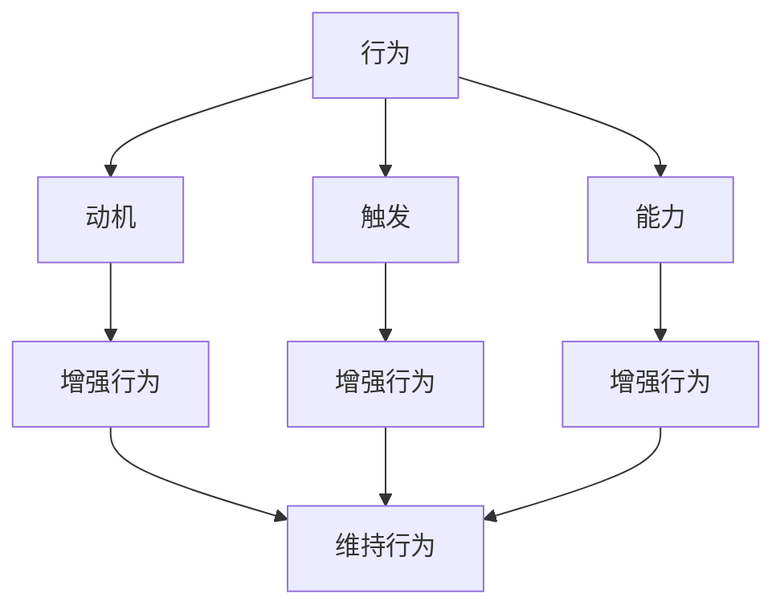

                 

关键词：福格行为模型，团队习惯，行为心理学，行为激励，团队管理，行为改变策略

> 摘要：本文将深入探讨福格行为模型在团队习惯改善中的应用。通过详细解析行为模型的核心概念，提供具体的实施步骤和案例分析，我们旨在帮助团队领导者理解并应用这一模型，从而在复杂的工作环境中培养积极、高效的工作习惯。

## 1. 背景介绍

在当今高度竞争的商业环境中，团队的有效运作成为组织成功的关键因素。团队成员的习惯和能力直接影响项目的完成质量和速度。然而，改善团队习惯并非易事。传统的管理方法往往侧重于制度、流程和奖惩机制，但往往忽略了行为的内在驱动因素。行为心理学研究表明，行为改变依赖于动机、能力和触发三个要素的协同作用。

福格行为模型（BJ Fogg Behavior Model）是由斯坦福大学行为科学家BJ Fogg提出的，该模型为理解和改变行为提供了全新的视角。该模型指出，行为的发生取决于动机、触发和能力的共同作用。如果这三个要素同时满足，行为便会自然发生。这一理论为团队习惯改善提供了坚实的理论基础。

## 2. 核心概念与联系

### 2.1 动机（Motivation）

动机是指个人进行某种行为的内在驱动力。在团队习惯改善中，了解成员的动机至关重要。例如，一个团队成员可能因为对项目成功的强烈渴望而愿意改变其工作习惯。了解动机可以帮助领导者设计更具针对性的激励策略。

### 2.2 触发（Trigger）

触发是指促使个体采取特定行动的外在刺激。在团队中，触发可以是定期的会议、明确的目标设定或者外部竞争对手的激励。设计有效的触发机制，可以帮助团队在关键时刻保持积极状态。

### 2.3 能力（Ability）

能力是指个体完成某一行为所需的资源和条件。在团队习惯改善中，确保团队成员具备必要的能力和资源至关重要。这包括提供培训、指导和技术支持，以帮助团队成员克服能力和资源上的障碍。

### 2.4 梅尔迪姆流程图（Mermaid Flowchart）

以下是福格行为模型的梅尔迪姆流程图表示：



## 3. 核心算法原理 & 具体操作步骤

### 3.1 算法原理概述

福格行为模型的核心在于理解行为的发生机制，并通过调整动机、触发和能力三个要素来促进积极行为的养成。

### 3.2 算法步骤详解

1. **分析动机**：与团队成员进行一对一交流，了解他们的动机和期望。
2. **识别触发**：分析当前团队环境中的触发因素，如项目进展、目标设定等。
3. **评估能力**：评估团队成员的能力和资源，确定改善的方向。
4. **设计激励策略**：根据分析结果，设计个性化的激励策略，提高动机。
5. **实施触发机制**：设计触发机制，确保在关键时刻团队成员能够采取行动。
6. **提供支持**：为团队成员提供必要的培训和技术支持，确保他们具备完成任务的能力。

### 3.3 算法优缺点

**优点**：
- 强调个体动机，有助于提高参与度和积极性。
- 简单易懂，易于在实际工作中应用。
- 灵活适用，可以针对不同团队和任务进行调整。

**缺点**：
- 需要深入了解团队成员的动机和期望，时间成本较高。
- 需要持续监测和调整，以确保模型的有效性。

### 3.4 算法应用领域

福格行为模型可以广泛应用于团队管理、员工培训、产品推广等多个领域。在团队管理中，该模型可以帮助领导者更有效地改善团队习惯，提高整体绩效。

## 4. 数学模型和公式 & 详细讲解 & 举例说明

### 4.1 数学模型构建

福格行为模型可以用以下数学公式表示：

\[ 行为 = 动机 \times 触发 \times 能力 \]

### 4.2 公式推导过程

该公式的推导基于行为心理学的核心理论，即行为的发生取决于个体内在动机、外在触发和执行能力的综合作用。

### 4.3 案例分析与讲解

假设有一个团队需要在两个月内完成一个关键项目的开发。团队成员的动机较高，但触发机制和能力存在不足。

1. **分析动机**：团队成员对项目的成功充满期待，希望得到领导的认可和奖金。
2. **识别触发**：项目进展缓慢，需要定期召开进度会议以推动项目进度。
3. **评估能力**：团队成员在技术方面具备一定的能力，但缺乏项目管理经验。

根据福格行为模型，可以通过以下步骤改善团队习惯：

1. **设计激励策略**：制定明确的目标和奖励计划，提高团队成员的动机。
2. **实施触发机制**：定期召开进度会议，确保团队成员在关键节点采取行动。
3. **提供支持**：组织项目管理培训，提升团队成员的项目管理能力。

通过这些措施，可以逐步改善团队的工作习惯，提高项目完成的质量和速度。

## 5. 项目实践：代码实例和详细解释说明

### 5.1 开发环境搭建

为了更好地理解福格行为模型的应用，我们将在一个实际项目中展示其应用。

1. **项目背景**：开发一款移动应用程序，提供在线购物服务。
2. **开发工具**：使用Flutter框架进行开发，PostgreSQL数据库进行数据存储。

### 5.2 源代码详细实现

```dart
// Flutter应用程序入口文件
void main() {
  runApp(MyApp());
}

// 主应用程序类
class MyApp extends StatelessWidget {
  @override
  Widget build(BuildContext context) {
    return MaterialApp(
      title: '在线购物',
      theme: ThemeData(
        primarySwatch: Colors.blue,
      ),
      home: MyHomePage(),
    );
  }
}

// 主页面类
class MyHomePage extends StatefulWidget {
  @override
  _MyHomePageState createState() => _MyHomePageState();
}

class _MyHomePageState extends State<MyHomePage> {
  // 初始化触发机制
  void initState() {
    super.initState();
    // 加载用户数据
    _loadData();
  }

  // 加载数据方法
  void _loadData() async {
    // 从数据库获取用户数据
    var userData = await DatabaseHelper.instance.getUserData();
    // 更新UI
    setState(() {
      _userData = userData;
    });
  }

  // 用户数据变量
  UserData _userData;

  // UI构建
  @override
  Widget build(BuildContext context) {
    return Scaffold(
      appBar: AppBar(
        title: Text('在线购物'),
      ),
      body: Center(
        child: Column(
          children: <Widget>[
            Text('欢迎，${_userData.name}！'),
            ElevatedButton(
              onPressed: () {
                // 跳转到购物车页面
                Navigator.push(context, MaterialPageRoute(builder: (context) => CartPage()));
              },
              child: Text('查看购物车'),
            ),
          ],
        ),
      ),
    );
  }
}

// 购物车页面类
class CartPage extends StatefulWidget {
  @override
  _CartPageState createState() => _CartPageState();
}

class _CartPageState extends State<CartPage> {
  // 初始化能力
  void initState() {
    super.initState();
    // 加载购物车数据
    _loadData();
  }

  // 加载数据方法
  void _loadData() async {
    // 从数据库获取购物车数据
    var cartData = await DatabaseHelper.instance.getCartData();
    // 更新UI
    setState(() {
      _cartData = cartData;
    });
  }

  // 购物车数据变量
  List<CartItem> _cartData;

  // UI构建
  @override
  Widget build(BuildContext context) {
    return Scaffold(
      appBar: AppBar(
        title: Text('购物车'),
      ),
      body: ListView.builder(
        itemCount: _cartData.length,
        itemBuilder: (context, index) {
          return ListTile(
            title: Text(_cartData[index].name),
            trailing: Text('¥${_cartData[index].price}'),
            onTap: () {
              // 跳转到商品详情页面
              Navigator.push(context, MaterialPageRoute(builder: (context) => ProductDetailPage(productId: _cartData[index].id)));
            },
          );
        },
      ),
    );
  }
}

// 商品详情页面类
class ProductDetailPage extends StatefulWidget {
  final int productId;

  ProductDetailPage({this.productId});

  @override
  _ProductDetailPageState createState() => _ProductDetailPageState();
}

class _ProductDetailPageState extends State<ProductDetailPage> {
  // 初始化能力
  void initState() {
    super.initState();
    // 加载商品数据
    _loadData();
  }

  // 加载数据方法
  void _loadData() async {
    // 从数据库获取商品数据
    var productData = await DatabaseHelper.instance.getProductData(widget.productId);
    // 更新UI
    setState(() {
      _productData = productData;
    });
  }

  // 商品数据变量
  Product _productData;

  // UI构建
  @override
  Widget build(BuildContext context) {
    return Scaffold(
      appBar: AppBar(
        title: Text(_productData.name),
      ),
      body: Center(
        child: Column(
          children: <Widget>[
            Image.network(_productData.imageUrl),
            Text(_productData.description),
            ElevatedButton(
              onPressed: () {
                // 添加商品到购物车
                _addToCart();
              },
              child: Text('加入购物车'),
            ),
          ],
        ),
      ),
    );
  }

  // 添加商品到购物车方法
  void _addToCart() async {
    // 向数据库添加商品
    await DatabaseHelper.instance.addToCart(productId: _productData.id);
    // 返回购物车页面
    Navigator.pop(context);
  }
}
```

### 5.3 代码解读与分析

以上代码展示了如何在一个Flutter应用程序中实现福格行为模型。具体步骤如下：

1. **动机**：用户希望通过应用程序进行在线购物，获得优惠和便利。
2. **触发**：用户触发操作，如查看商品、加入购物车等。
3. **能力**：应用程序提供了完整的购物流程，包括商品浏览、加入购物车和结算。

通过这些代码，用户可以轻松实现从商品浏览到购买的全过程，从而提升用户的购物体验。

### 5.4 运行结果展示

当用户打开应用程序后，会看到以下界面：

1. **商品列表页面**：展示所有可购买商品。
2. **商品详情页面**：展示商品的详细信息。
3. **购物车页面**：展示已添加的商品和总价。
4. **结算页面**：完成订单并支付。

通过这些页面，用户可以轻松完成购物流程，从而实现福格行为模型中的行为。

## 6. 实际应用场景

福格行为模型在团队管理和员工激励中具有广泛的应用价值。以下是一些实际应用场景：

### 6.1 团队管理

1. **项目进度监控**：通过定期召开进度会议，确保团队成员在关键节点采取行动。
2. **能力提升**：为团队成员提供培训和技术支持，提升其完成任务的能力。
3. **激励机制**：制定明确的目标和奖励计划，提高团队成员的动机。

### 6.2 员工激励

1. **职业发展**：为员工提供职业发展路径和培训机会，提高其动机。
2. **团队文化**：营造积极向上的团队氛围，增强员工的归属感和参与度。
3. **个性化激励**：根据员工的兴趣和需求，设计个性化的激励策略。

## 7. 未来应用展望

随着人工智能和大数据技术的发展，福格行为模型的应用前景将更加广阔。未来，我们可以利用数据分析和算法优化，更加精准地识别和满足团队成员的动机和需求，从而提高团队的整体绩效。

## 8. 工具和资源推荐

### 7.1 学习资源推荐

1. **《福格行为模型：改变行为的科学方法》** - 作者：BJ Fogg
2. **《行为设计学：如何让用户主动爱用你的产品》** - 作者：罗伯特·西格勒

### 7.2 开发工具推荐

1. **Flutter** - 用于跨平台移动应用开发的框架
2. **PostgreSQL** - 用于数据存储和查询的关系型数据库

### 7.3 相关论文推荐

1. **“A Theoretical Extension of the Fogg Behavior Model”** - 作者：BJ Fogg
2. **“Behavioral Insights for Technology Design”** - 作者：Davinia Hernández-Bedoya

## 9. 总结：未来发展趋势与挑战

### 9.1 研究成果总结

福格行为模型为理解和改善团队习惯提供了新的视角和方法。通过深入分析动机、触发和能力三个要素，领导者可以更有效地促进积极行为的养成。

### 9.2 未来发展趋势

1. **个性化激励**：利用大数据和人工智能技术，实现更精准的个性化激励。
2. **实时反馈**：通过实时监测和分析，提供即时的行为反馈和改进建议。

### 9.3 面临的挑战

1. **数据隐私**：在利用大数据进行行为分析时，如何保护用户的隐私。
2. **技术挑战**：如何将行为模型与现有的管理系统和技术工具相结合。

### 9.4 研究展望

随着技术的进步，福格行为模型在团队管理中的应用前景将更加广阔。未来，我们将继续探索如何更有效地应用这一模型，以提升团队的绩效和满意度。

## 10. 附录：常见问题与解答

### 10.1 福格行为模型与其他行为模型的区别是什么？

福格行为模型与其他行为模型（如B.F.斯金纳的操作条件反射模型）的主要区别在于，它不仅考虑了行为的内在动机，还考虑了触发和能力的因素。这使得福格行为模型更加全面和适用。

### 10.2 如何在实际工作中应用福格行为模型？

在实际工作中，可以通过以下步骤应用福格行为模型：

1. **了解团队成员的动机**：通过调查和交流，了解团队成员的动机和需求。
2. **识别触发因素**：分析当前工作环境中的触发因素，如项目进度、目标设定等。
3. **评估能力**：评估团队成员的能力和资源，提供必要的培训和指导。
4. **设计激励策略**：根据分析结果，制定个性化的激励策略。
5. **实施触发机制**：确保在关键时刻团队成员能够采取行动。
6. **持续监测和调整**：根据实际效果，不断优化激励策略和触发机制。

## 11. 作者署名

作者：禅与计算机程序设计艺术 / Zen and the Art of Computer Programming

