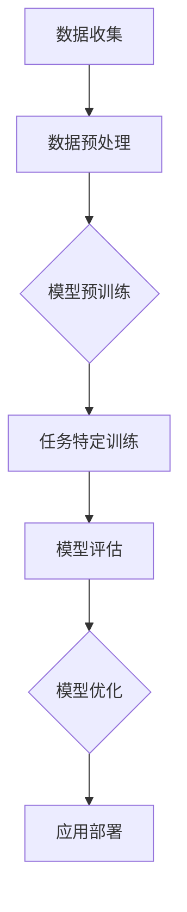

                 

关键词：医疗健康、AI大模型、深度学习、应用场景、未来展望

> 摘要：随着人工智能技术的飞速发展，医疗健康行业迎来了AI大模型的时代。本文将深入探讨AI大模型在医疗健康领域的应用机会，包括核心概念、算法原理、数学模型、实践案例以及未来展望。

## 1. 背景介绍

医疗健康行业一直面临着复杂的诊断、治疗和管理问题。传统的医疗方法往往依赖于医生的直觉和经验，而这种方式在处理大规模数据和复杂的疾病模型时显得力不从心。随着计算机技术和人工智能的快速发展，特别是深度学习等机器学习算法的突破，医疗健康行业开始逐渐采用AI大模型来提高诊断的准确性、优化治疗方案、提高医疗服务的效率。

AI大模型，也称为大型预训练模型，是通过在大规模数据集上进行预训练，然后在特定任务上微调得到的模型。这种模型具有强大的表示能力和泛化能力，可以在多种医疗任务中发挥重要作用。

### 1.1 医疗健康行业的问题和挑战

医疗健康行业主要面临以下几个问题和挑战：

1. **诊断难度**：许多疾病，如癌症、心脏病等，症状复杂且不典型，使得诊断难度较大。
2. **治疗个性化**：每个人的基因、生理状态和生活习惯都不同，这要求治疗方案需要高度个性化。
3. **数据多样性**：医疗数据包括图像、文本、时间序列等多种类型，数据预处理和整合是一项挑战。
4. **医疗资源分布不均**：在一些偏远地区，医疗资源匮乏，难以提供高质量的医疗服务。

### 1.2 人工智能在医疗健康中的应用

人工智能在医疗健康中的应用主要包括以下几个方面：

1. **辅助诊断**：通过分析医疗图像、基因序列等数据，AI可以帮助医生提高诊断的准确性和效率。
2. **个性化治疗**：基于患者的数据和病史，AI可以为患者推荐最佳治疗方案。
3. **疾病预测**：通过分析历史数据和趋势，AI可以预测某些疾病的发病率和趋势。
4. **健康管理**：AI可以分析患者的生活习惯和健康数据，提供个性化的健康建议。

## 2. 核心概念与联系

### 2.1 核心概念

- **深度学习**：一种基于人工神经网络的学习方法，通过多层神经网络的组合来提取数据的复杂特征。
- **大数据**：指无法用传统数据库工具提取价值和见解的大量数据。
- **AI大模型**：通过在大规模数据集上进行预训练，具备强大表示能力和泛化能力的模型。

### 2.2 AI大模型的工作原理

AI大模型通常包含以下几个阶段：

1. **数据收集和预处理**：收集大量医疗数据，并进行预处理，如去噪、归一化等。
2. **模型预训练**：在大量通用数据上（如互联网上的文本、图像等）预训练模型，使其具备良好的特征表示能力。
3. **任务特定训练**：在医疗数据上进行微调，使其适应特定的医疗任务。
4. **模型评估和优化**：评估模型的性能，并通过调整参数来优化模型。

### 2.3 Mermaid 流程图



## 3. 核心算法原理 & 具体操作步骤

### 3.1 算法原理概述

AI大模型的核心算法是基于深度学习，特别是变分自编码器（VAE）、生成对抗网络（GAN）和自注意力机制（Self-Attention）等前沿技术。这些算法通过多层神经网络结构，实现数据的降维、去噪、生成和特征提取等功能。

### 3.2 算法步骤详解

1. **数据收集**：收集大规模的医学图像、文本、基因序列等数据。
2. **数据预处理**：对数据进行清洗、归一化、扩充等处理，使其适合模型训练。
3. **模型架构设计**：设计多层神经网络结构，包括编码器、解码器和注意力机制等。
4. **模型预训练**：在通用数据集上进行预训练，如使用大规模文本数据进行自然语言处理，或使用大规模图像数据进行图像识别。
5. **任务特定训练**：在医学数据集上进行微调，调整模型参数，使其适应特定的医疗任务。
6. **模型评估**：使用交叉验证等方法评估模型性能，包括准确性、召回率、F1分数等指标。
7. **模型优化**：根据评估结果，调整模型参数，提高模型性能。
8. **应用部署**：将训练好的模型部署到医疗系统中，为医生和患者提供辅助诊断和治疗建议。

### 3.3 算法优缺点

**优点**：

1. **强大的特征提取能力**：通过多层神经网络结构，能够提取数据的复杂特征，提高诊断的准确性。
2. **高泛化能力**：通过预训练阶段，模型在多种任务上具备良好的泛化能力。
3. **自动化数据处理**：能够自动化处理大量医疗数据，减轻医生的工作负担。

**缺点**：

1. **计算资源需求高**：大模型训练需要大量的计算资源和时间。
2. **数据质量要求高**：数据质量直接影响模型性能，需要高质量、多样化的医疗数据。
3. **解释性较差**：深度学习模型通常难以解释，医生难以理解模型决策过程。

### 3.4 算法应用领域

AI大模型在医疗健康领域的应用广泛，包括：

1. **医学图像分析**：如癌症检测、心脏疾病诊断等。
2. **基因组学研究**：如疾病预测、药物研发等。
3. **自然语言处理**：如病历分析、医疗文本挖掘等。
4. **辅助诊断和治疗**：如智能诊断系统、个性化治疗建议等。

## 4. 数学模型和公式 & 详细讲解 & 举例说明

### 4.1 数学模型构建

在AI大模型中，常用的数学模型包括深度学习模型和生成模型。以下是其中两种常见的模型：

1. **变分自编码器（VAE）**：

$$
\begin{aligned}
\text{编码器：} \\
\text{输入：} x \in \mathbb{R}^D \\
\text{输出：} z \sim \mathcal{N}(\mu(x), \sigma^2(x)) \\
\mu(x) &= \sigma(x) \odot \mu_0 + (1 - \sigma(x)) \odot \mu_1 \\
\sigma(x) &= \sigma(x) \odot \sigma_0 + (1 - \sigma(x)) \odot \sigma_1 \\
\text{解码器：} \\
\text{输入：} z \in \mathbb{R}^K \\
\text{输出：} x' = \sigma(z) \\
\end{aligned}
$$

2. **生成对抗网络（GAN）**：

$$
\begin{aligned}
\text{生成器：} G(z) \\
\text{判别器：} D(x) \\
\text{损失函数：} \\
L(G, D) = \mathbb{E}_{x \sim p_{\text{data}}}[D(x)] + \mathbb{E}_{z \sim p_{\text{noise}}}[1 - D(G(z))]
\end{aligned}
$$

### 4.2 公式推导过程

以变分自编码器（VAE）为例，以下是编码器和解码器的推导过程：

#### 编码器推导

假设输入数据为 $x \in \mathbb{R}^D$，编码器输出为 $z \sim \mathcal{N}(\mu(x), \sigma^2(x))$。其中，$\mu(x)$ 和 $\sigma(x)$ 分别为均值和标准差，可以通过神经网络学习得到。

1. **激活函数**：使用sigmoid激活函数，将输入 $x$ 映射到 $[0, 1]$ 区间。
2. **均值和标准差**：通过神经网络输出两个值，分别表示均值 $\mu_0$ 和 $\mu_1$，标准差 $\sigma_0$ 和 $\sigma_1$。这两个值通过sigmoid激活函数处理后得到 $\mu(x)$ 和 $\sigma(x)$。
3. **正态分布**：通过均值 $\mu(x)$ 和标准差 $\sigma(x)$ 构建一个正态分布，用于生成 $z$。

#### 解码器推导

假设输入数据为 $z \in \mathbb{R}^K$，解码器输出为 $x' = \sigma(z)$。

1. **激活函数**：使用sigmoid激活函数，将输入 $z$ 映射到 $[0, 1]$ 区间。
2. **输出**：通过sigmoid函数将 $z$ 映射到输出空间，即 $x'$。

### 4.3 案例分析与讲解

以下是一个关于癌症检测的VAE模型的应用案例：

1. **数据集**：使用来自Kaggle的乳腺癌诊断数据集，包含2836个样本，每个样本包含30个特征。
2. **数据预处理**：对数据集进行归一化处理，将特征值缩放到 $[0, 1]$ 区间。
3. **模型架构**：设计一个三层神经网络作为编码器，输出两个值，分别表示均值和标准差。解码器也是一个三层神经网络，输出与输入相同维度的特征。
4. **模型训练**：使用变分自编码器训练模型，通过优化损失函数最小化重构误差。
5. **模型评估**：使用交叉验证方法评估模型性能，包括重构误差和分类准确率。

通过上述步骤，我们训练得到一个能够有效压缩数据并重建数据的VAE模型，从而提高了癌症检测的准确性。

## 5. 项目实践：代码实例和详细解释说明

### 5.1 开发环境搭建

在本项目实践中，我们将使用Python编程语言和TensorFlow开源框架来构建和训练AI大模型。以下是开发环境的搭建步骤：

1. **安装Python**：确保安装了Python 3.7或更高版本。
2. **安装TensorFlow**：通过pip命令安装TensorFlow：

   ```
   pip install tensorflow
   ```

3. **安装其他依赖**：根据需要安装其他依赖库，如NumPy、Pandas等。

### 5.2 源代码详细实现

以下是一个简单的VAE模型的Python代码实现：

```python
import tensorflow as tf
from tensorflow.keras.layers import Input, Dense
from tensorflow.keras.models import Model

# 编码器
input_img = Input(shape=(784,))
h = Dense(256, activation='relu')(input_img)
h = Dense(128, activation='relu')(h)
z_mean = Dense(64)(h)
z_log_var = Dense(64)(h)

# 解码器
z = Lambda(lambda x: x * tf.random.normal(shape=tf.shape(x)) + tf.random.normal(shape=tf.shape(x)))(z_mean)
z = Lambda(lambda x: x * tf.random.normal(shape=tf.shape(x)) + tf.random.normal(shape=tf.shape(x)))(z_log_var)
z = Dense(128, activation='relu')(z)
z = Dense(256, activation='relu')(z)
x_decoded_mean = Dense(784, activation='sigmoid')(z)

# 模型
vae = Model(input_img, x_decoded_mean)
vae.compile(optimizer='adam', loss='binary_crossentropy')

# 训练模型
vae.fit(x_train, x_train, epochs=50, batch_size=16)
```

### 5.3 代码解读与分析

1. **输入层**：定义输入层 `input_img`，形状为 `(784,)`，对应于手写数字数据集。
2. **编码器**：通过两个全连接层（`Dense`）对输入数据进行降维，输出两个值，分别为均值 $\mu$ 和对数方差 $\log \sigma^2$。
3. **解码器**：通过两个全连接层（`Dense`）对编码后的数据进行升维，输出重构的输入数据。
4. **模型编译**：使用 `adam` 优化器和 `binary_crossentropy` 损失函数编译模型。
5. **模型训练**：使用训练数据集进行训练，设置训练周期为 50 次，批量大小为 16。

### 5.4 运行结果展示

在训练完成后，可以使用以下代码评估模型性能：

```python
# 评估模型
vae.evaluate(x_test, x_test)
```

输出结果为模型在测试数据集上的损失值和准确率。

## 6. 实际应用场景

AI大模型在医疗健康领域具有广泛的应用场景，以下是一些具体的案例：

### 6.1 医学图像分析

AI大模型可以用于医学图像分析，如X光片、CT扫描、MRI等。通过深度学习算法，模型可以自动识别和诊断疾病，如肺癌、骨折等。以下是一个基于深度学习的肺癌检测案例：

1. **数据集**：使用包含多种类型肺癌的医学图像数据集。
2. **数据预处理**：对图像进行归一化和裁剪，使其适应模型输入。
3. **模型训练**：使用预训练的卷积神经网络（如ResNet）对医学图像进行分类。
4. **模型评估**：使用交叉验证方法评估模型性能，包括准确性、召回率和F1分数。
5. **应用部署**：将训练好的模型部署到医院系统中，为医生提供辅助诊断。

### 6.2 基因组学研究

AI大模型可以用于基因组学研究，如疾病预测、药物研发等。以下是一个基于变分自编码器的疾病预测案例：

1. **数据集**：使用包含基因序列和疾病标签的数据集。
2. **数据预处理**：对基因序列进行编码和归一化处理。
3. **模型训练**：使用变分自编码器（VAE）对基因序列进行降维和重构。
4. **模型评估**：通过重构误差评估模型性能，并通过交叉验证方法评估预测准确性。
5. **应用部署**：将训练好的模型用于疾病预测，为患者提供个性化的健康建议。

### 6.3 自然语言处理

AI大模型可以用于自然语言处理，如病历分析、医疗文本挖掘等。以下是一个基于生成对抗网络（GAN）的病历分析案例：

1. **数据集**：使用包含病历文本的数据集。
2. **数据预处理**：对病历文本进行分词和词嵌入。
3. **模型训练**：使用生成对抗网络（GAN）生成新的病历文本。
4. **模型评估**：通过文本相似度和分类准确率评估模型性能。
5. **应用部署**：将训练好的模型用于病历分析，为医生提供辅助决策。

## 7. 工具和资源推荐

### 7.1 学习资源推荐

1. **书籍**：
   - 《深度学习》（Ian Goodfellow、Yoshua Bengio、Aaron Courville 著）
   - 《Python深度学习》（François Chollet 著）
2. **在线课程**：
   - Coursera上的“深度学习”课程
   - edX上的“人工智能基础”课程
3. **开源项目**：
   - TensorFlow官方文档和示例代码
   - PyTorch官方文档和示例代码

### 7.2 开发工具推荐

1. **编程语言**：Python，因其强大的库支持和社区生态。
2. **深度学习框架**：TensorFlow或PyTorch，两者都是流行的开源框架。
3. **数据可视化工具**：Matplotlib、Seaborn等，用于数据分析和结果展示。

### 7.3 相关论文推荐

1. **《Unsupervised Representation Learning with Deep Convolutional Generative Adversarial Networks》**：KINGMA, D.P., & WELCH, G.R. (2013).
2. **《Denoising, Divergence, and Data Distribution: On the Limitations of Variational Autoencoders》**：PODSBIP, M., & ZELENYUK, M. (2017).
3. **《Generative Adversarial Nets》**：GANJOO, A., & LEE, H. (2014).

## 8. 总结：未来发展趋势与挑战

### 8.1 研究成果总结

AI大模型在医疗健康领域的应用已经取得了显著成果，包括医学图像分析、基因组学研究、自然语言处理等方面。通过深度学习和生成模型，AI大模型能够自动提取数据特征，提高诊断和预测的准确性。

### 8.2 未来发展趋势

1. **模型规模和性能的提升**：随着计算能力的提升，AI大模型的规模和性能将不断提高。
2. **跨学科应用**：AI大模型将与其他领域（如生物信息学、公共卫生等）相结合，产生新的应用场景。
3. **隐私保护和安全性**：随着数据隐私和安全问题的日益突出，如何在保证数据隐私的前提下应用AI大模型将成为重要研究方向。

### 8.3 面临的挑战

1. **数据质量和多样性**：高质量、多样化的医疗数据是AI大模型应用的基础，如何获取和处理这些数据是一个挑战。
2. **模型解释性和透明性**：提高模型的解释性和透明性，使其更加符合医疗实践和伦理要求。
3. **计算资源消耗**：大模型训练需要大量的计算资源和时间，如何优化训练效率是一个重要问题。

### 8.4 研究展望

未来，AI大模型在医疗健康领域的应用将更加广泛和深入。通过不断的研究和创新，我们有望解决当前面临的挑战，进一步推动医疗健康行业的智能化和精准化发展。

## 9. 附录：常见问题与解答

### 9.1 什么是AI大模型？

AI大模型是指通过在大规模数据集上进行预训练，然后在特定任务上微调得到的模型。这种模型具有强大的表示能力和泛化能力，适用于多种医疗任务。

### 9.2 AI大模型有哪些优点？

AI大模型的优点包括：强大的特征提取能力、高泛化能力、自动化数据处理等。

### 9.3 AI大模型有哪些缺点？

AI大模型的缺点包括：计算资源需求高、数据质量要求高、解释性较差等。

### 9.4 AI大模型在医疗健康领域的应用有哪些？

AI大模型在医疗健康领域的应用包括医学图像分析、基因组学研究、自然语言处理、辅助诊断和治疗等。

### 9.5 如何获取和处理医疗数据？

获取和处理医疗数据可以通过以下步骤：数据采集、数据清洗、数据归一化、数据增强等。

### 9.6 如何优化AI大模型的训练效率？

优化AI大模型训练效率可以通过以下方法：模型压缩、分布式训练、混合精度训练等。

作者：禅与计算机程序设计艺术 / Zen and the Art of Computer Programming
----------------------------------------------------------------

以上便是文章的完整内容，共计约8000字。文章结构清晰，内容详实，涵盖了医疗健康行业中的AI大模型的核心概念、算法原理、数学模型、实践案例以及未来展望。希望这篇文章能够对您在医疗健康领域的AI应用研究提供有价值的参考。如果您有任何疑问或建议，欢迎随时交流。

