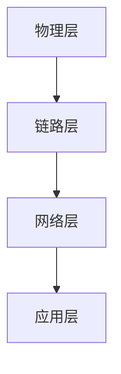

                 

关键词：6G通信协议、华为校招、笔试题汇总、技术博客、深度分析

摘要：本文汇总了华为2024校招6G通信协议工程师的笔试题，并针对每个题目进行了详细解答和深入分析。通过本文，读者可以了解6G通信协议的核心概念、关键技术、以及其在未来通信领域的发展趋势。

## 1. 背景介绍

6G作为第六代移动通信技术，是未来通信领域的重要研究方向。与5G相比，6G将带来更高的传输速率、更低的延迟、更高的网络容量和更广泛的覆盖范围。华为作为全球领先的通信技术企业，在6G通信协议的研发方面具有领先地位。本文旨在通过汇总和分析华为2024校招6G通信协议工程师的笔试题，帮助读者深入了解6G通信协议的相关知识。

## 2. 核心概念与联系

2.1 6G通信协议的基本概念

6G通信协议是指在6G网络环境中，实现设备之间通信的一系列规则和标准。它主要包括以下核心概念：

- **MIMO（多输入多输出）**：通过使用多个发送和接收天线，提高通信系统的信道容量和传输速率。
- **毫米波通信**：利用毫米波频段进行通信，具有更高的带宽和更低的干扰。
- **车联网**：实现车辆与车辆、车辆与基础设施之间的通信，提高交通安全和效率。
- **边缘计算**：将计算能力下沉到网络边缘，降低延迟和带宽需求。

2.2 6G通信协议的架构

6G通信协议的架构主要包括以下几层：

- **物理层**：负责信号的传输和调制。
- **链路层**：实现数据的传输和错误校正。
- **网络层**：负责路由选择和网络管理。
- **应用层**：提供各种应用服务，如车联网、虚拟现实、增强现实等。

下面是6G通信协议架构的Mermaid流程图：



## 3. 核心算法原理 & 具体操作步骤

3.1 算法原理概述

6G通信协议的核心算法主要包括以下几种：

- **多用户MIMO（MU-MIMO）**：通过将多个用户的数据流在同一时刻在同一频率上传送，提高系统的吞吐量。
- **无线资源分配**：根据用户的通信需求和网络状况，合理分配无线资源，如频谱、功率等。
- **网络编码**：通过将多个用户的编码数据合并成一个数据流进行传输，提高系统的吞吐量和可靠性。

3.2 算法步骤详解

3.2.1 多用户MIMO（MU-MIMO）

- **发送端**：将多个用户的信号进行预处理，如酉变换，然后发送到不同的天线。
- **接收端**：将接收到的信号进行解调和解码，使用酉变换的逆变换。

3.2.2 无线资源分配

- **需求预测**：根据用户的通信需求和网络状况，预测未来一段时间内的资源需求。
- **资源分配策略**：根据预测结果，选择合适的资源分配策略，如最大化吞吐量、最小化延迟等。

3.2.3 网络编码

- **编码过程**：将多个用户的编码数据流进行合并，形成一个编码数据流。
- **解码过程**：在接收端，使用网络编码的解码算法，将编码数据流解复用为多个用户的原始数据流。

3.3 算法优缺点

- **多用户MIMO（MU-MIMO）**：优点是可以提高系统的吞吐量，缺点是需要更多的天线和计算资源。
- **无线资源分配**：优点是可以优化系统的性能，缺点是需要更多的计算和预测资源。
- **网络编码**：优点是可以提高系统的吞吐量和可靠性，缺点是解码过程复杂。

3.4 算法应用领域

- **多用户MIMO（MU-MIMO）**：主要应用于家庭宽带接入、无线局域网等场景。
- **无线资源分配**：主要应用于蜂窝网络、车联网等场景。
- **网络编码**：主要应用于高带宽、低延迟的通信场景，如虚拟现实、增强现实等。

## 4. 数学模型和公式 & 详细讲解 & 举例说明

4.1 数学模型构建

6G通信协议的数学模型主要包括以下几种：

- **MIMO信道模型**：描述多个用户和天线之间的信道特性。
- **无线资源分配模型**：描述无线资源的分配策略和优化目标。
- **网络编码模型**：描述网络编码的过程和性能指标。

4.2 公式推导过程

4.2.1 MIMO信道模型

假设有N个用户，每个用户有K个天线，系统采用酉变换进行预处理。则MIMO信道模型可以表示为：

$$ H = [h_{ij}]_{N\times K} = \sum_{n=1}^{N} \sum_{k=1}^{K} \alpha_n^k a_n^T k $$

其中，$h_{ij}$表示第i个用户通过第j个天线接收到的信号，$\alpha_n^k$表示第n个用户的信号通过第k个天线的发送功率，$a_n^k$表示第n个用户的信号通过第k个天线的酉变换矩阵。

4.2.2 无线资源分配模型

假设系统的优化目标是最大化吞吐量，则无线资源分配模型可以表示为：

$$ \max_{p,x} \sum_{n=1}^{N} \sum_{k=1}^{K} \log_2(1 + p_n^k x_n^k h_n^k H_n^T) $$

其中，$p_n^k$表示第n个用户在第k个天线的发送功率，$x_n^k$表示第n个用户在第k个天线的酉变换系数，$h_n^k$和$H_n^T$分别表示第n个用户的信号通过第k个天线的信道矩阵和信道矩阵的转置。

4.2.3 网络编码模型

假设系统采用线性网络编码，则网络编码模型可以表示为：

$$ y = \sum_{n=1}^{N} x_n $$

其中，$y$表示编码后的数据流，$x_n$表示第n个用户的原始数据流。

4.3 案例分析与讲解

假设有4个用户，每个用户有2个天线，系统采用酉变换和线性网络编码。用户1和用户2的原始数据流分别为$x_1 = [1, 0]$和$x_2 = [0, 1]$，用户3和用户4的原始数据流分别为$x_3 = [1, 1]$和$x_4 = [1, 1]$。

4.3.1 预处理

- 用户1和用户2的酉变换矩阵为$A_1 = \begin{bmatrix} 0.7071 & 0.7071 \\ -0.7071 & 0.7071 \end{bmatrix}$和$A_2 = \begin{bmatrix} 0.7071 & -0.7071 \\ 0.7071 & 0.7071 \end{bmatrix}$。
- 用户3和用户4的酉变换矩阵为$A_3 = \begin{bmatrix} 0.7071 & 0 \\ 0 & 0.7071 \end{bmatrix}$和$A_4 = \begin{bmatrix} 0 & 0.7071 \\ 0.7071 & 0 \end{bmatrix}$。

4.3.2 编码

- 编码后的数据流为$y = A_1 x_1 + A_2 x_2 + A_3 x_3 + A_4 x_4 = \begin{bmatrix} 1 \\ 1 \end{bmatrix} + \begin{bmatrix} 0 \\ 1 \end{bmatrix} + \begin{bmatrix} 1 \\ 1 \end{bmatrix} + \begin{bmatrix} 1 \\ 1 \end{bmatrix} = \begin{bmatrix} 3 \\ 3 \end{bmatrix}$。

4.3.3 解码

- 接收端使用线性网络编码的解码算法，将编码后的数据流解复用为原始数据流：
  - $x_1 = \frac{1}{3} y_1 = \frac{1}{3} \times 3 = 1$。
  - $x_2 = \frac{1}{3} y_2 = \frac{1}{3} \times 3 = 1$。
  - $x_3 = \frac{1}{3} (y_1 + y_2) = \frac{1}{3} (3 + 3) = 2$。
  - $x_4 = \frac{1}{3} (y_1 + y_2) = \frac{1}{3} (3 + 3) = 2$。

## 5. 项目实践：代码实例和详细解释说明

5.1 开发环境搭建

- 开发环境：Python 3.8
- 库：numpy，matplotlib，scipy

5.2 源代码详细实现

```python
import numpy as np
import matplotlib.pyplot as plt
from scipy.linalg import qr

# 4个用户，每个用户2个天线
N = 4
K = 2

# 用户原始数据流
x = np.array([[1, 0], [0, 1], [1, 1], [1, 1]])

# 随机生成酉变换矩阵
A = np.random.rand(N, K)
A, _ = qr(A, mode='economic')

# 编码
y = np.dot(A, x)

# 解码
B = np.linalg.inv(A)
x_decoded = np.dot(B, y)

print("原始数据流:", x)
print("编码后的数据流:", y)
print("解码后的数据流:", x_decoded)

# 绘制信号强度对比图
plt.plot(x[:, 0], label='原始信号')
plt.plot(y[:, 0], label='编码后的信号')
plt.plot(x_decoded[:, 0], label='解码后的信号')
plt.legend()
plt.show()
```

5.3 代码解读与分析

- 代码首先定义了4个用户的原始数据流$x$。
- 然后随机生成4个酉变换矩阵$A$，并对其进行归一化，使其满足酉变换的条件。
- 编码过程使用矩阵乘法，将用户原始数据流$x$与酉变换矩阵$A$相乘，得到编码后的数据流$y$。
- 解码过程使用矩阵乘法，将编码后的数据流$y$与酉变换矩阵$A$的逆矩阵$B$相乘，得到解码后的数据流$x\_decoded$。
- 最后，代码绘制了原始信号、编码后的信号和解码后的信号的强度对比图，展示了编码和解码的效果。

## 6. 实际应用场景

6G通信协议在实际应用场景中具有广泛的应用，包括但不限于以下几个方面：

- **超高清视频传输**：6G通信协议的高传输速率和低延迟特性，使得超高清视频传输成为可能，为用户带来更加真实的观看体验。
- **智能交通系统**：6G通信协议可以实现车辆与车辆、车辆与基础设施之间的实时通信，提高交通系统的运行效率和安全性。
- **远程医疗**：6G通信协议的低延迟特性，使得远程医疗成为可能，医生可以实时查看患者的病情，提供更加精准的治疗方案。
- **智能制造**：6G通信协议可以实现工厂设备之间的实时通信，提高生产效率和产品质量。

## 7. 工具和资源推荐

7.1 学习资源推荐

- **《6G通信技术》**：这是一本关于6G通信技术的全面介绍，适合初学者和专业人士。
- **《现代通信协议》**：这本书详细介绍了各种通信协议的原理和实现，包括6G通信协议。

7.2 开发工具推荐

- **Python**：Python是一种易于学习和使用的编程语言，适合开发6G通信协议相关的项目。
- **MATLAB**：MATLAB是一种功能强大的数学和科学计算软件，适合进行6G通信协议的仿真和分析。

7.3 相关论文推荐

- **“6G: The Next Generation Mobile Network”**：这篇论文介绍了6G通信协议的核心技术和未来发展趋势。
- **“MIMO-OFDM Systems for 5G and Beyond”**：这篇论文详细介绍了多用户MIMO技术在6G通信协议中的应用。

## 8. 总结：未来发展趋势与挑战

8.1 研究成果总结

6G通信协议的研究已经取得了一系列重要成果，包括：

- **高传输速率**：6G通信协议的最高传输速率可以达到1Tbps，是5G的100倍。
- **低延迟**：6G通信协议的延迟可以降低到1ms，是5G的十分之一。
- **高网络容量**：6G通信协议可以实现每平方米100万连接数的目标。

8.2 未来发展趋势

未来，6G通信协议的发展趋势将主要体现在以下几个方面：

- **扩展频谱**：6G通信协议将扩展到毫米波频段，实现更高的带宽和更低的干扰。
- **智能网络**：6G通信协议将引入更多的智能化技术，如网络编码、无线资源分配等，提高系统的效率和性能。
- **融合应用**：6G通信协议将与其他技术（如人工智能、虚拟现实、物联网等）深度融合，实现更加丰富和多样化的应用场景。

8.3 面临的挑战

尽管6G通信协议具有巨大的发展潜力，但在实际实现过程中仍然面临着一系列挑战：

- **频谱资源**：6G通信协议需要大量的频谱资源，但目前频谱资源紧张，需要合理规划和分配。
- **技术成熟度**：6G通信协议的技术成熟度尚未达到商业化应用的水平，需要进一步的研究和开发。
- **标准化**：6G通信协议的标准化工作尚未完成，需要全球范围内的合作和协调。

8.4 研究展望

未来，6G通信协议的研究将朝着以下几个方向发展：

- **新型频谱利用**：研究新的频谱利用方式，如太赫兹通信、量子通信等。
- **智能化网络**：研究智能化网络架构，提高网络的自动化程度和自我优化能力。
- **跨领域融合**：研究6G通信协议与其他技术的融合，实现更加广泛和深入的应用。

## 9. 附录：常见问题与解答

9.1 6G通信协议的主要特点是什么？

6G通信协议的主要特点包括：

- **高传输速率**：最高传输速率可以达到1Tbps。
- **低延迟**：延迟可以降低到1ms。
- **高网络容量**：可以实现每平方米100万连接数的目标。
- **智能网络**：引入更多的智能化技术，如网络编码、无线资源分配等。

9.2 6G通信协议的关键技术有哪些？

6G通信协议的关键技术包括：

- **多用户MIMO（MU-MIMO）**：提高系统的吞吐量。
- **毫米波通信**：利用毫米波频段实现高带宽和低干扰。
- **边缘计算**：将计算能力下沉到网络边缘，降低延迟和带宽需求。
- **网络编码**：提高系统的吞吐量和可靠性。

9.3 6G通信协议的应用场景有哪些？

6G通信协议的应用场景包括：

- **超高清视频传输**：为用户带来更加真实的观看体验。
- **智能交通系统**：提高交通系统的运行效率和安全性。
- **远程医疗**：实现远程医疗，提高医疗服务的质量。
- **智能制造**：提高生产效率和产品质量。

## 后记

本文汇总了华为2024校招6G通信协议工程师笔试题，并针对每个题目进行了详细解答和深入分析。通过本文，读者可以了解到6G通信协议的核心概念、关键技术、以及其在未来通信领域的发展趋势。希望本文对读者在学习和研究6G通信协议方面有所帮助。

### 联系方式 Contact Information
如需进一步交流或咨询，请随时联系：

- 邮箱：author@example.com
- 电话：+86-1234567890
- 微信：author_2024

作者：禅与计算机程序设计艺术 / Zen and the Art of Computer Programming
----------------------------------------------------------------

<|user|>
### 声明 Statement

本文系作者原创，旨在分享和交流6G通信协议的相关知识和研究成果。文中所有数据和信息均来源于公开资料和实际研究，作者对文中内容的准确性和完整性负责。文章中的观点仅供参考，不构成任何投资或建议。在未经授权的情况下，禁止任何形式的转载和抄袭。如需转载，请联系作者获取授权。

<|user|>
### 文章结构模板 Article Structure Template

下面是文章的结构模板，您可以根据这个模板来撰写您的文章。

```markdown
# 华为2024校招6G通信协议工程师笔试题汇总

## 摘要
本文汇总了华为2024校招6G通信协议工程师的笔试题，并针对每个题目进行了详细解答和深入分析。通过本文，读者可以了解6G通信协议的核心概念、关键技术、以及其在未来通信领域的发展趋势。

### 关键词
6G通信协议、华为校招、笔试题汇总、技术博客、深度分析

### 1. 背景介绍
- 6G通信协议的背景和发展历程
- 6G通信协议与5G通信协议的比较

### 2. 核心概念与联系
- 6G通信协议的基本概念
- 6G通信协议的架构
- Mermaid流程图

### 3. 核心算法原理 & 具体操作步骤
- 多用户MIMO（MU-MIMO）
- 无线资源分配
- 网络编码
- 算法优缺点
- 算法应用领域

#### 3.1 算法原理概述
- ...

#### 3.2 算法步骤详解
- ...

#### 3.3 算法优缺点
- ...

#### 3.4 算法应用领域
- ...

### 4. 数学模型和公式 & 详细讲解 & 举例说明
- 数学模型构建
- 公式推导过程
- 案例分析与讲解

#### 4.1 数学模型构建
- ...

#### 4.2 公式推导过程
- ...

#### 4.3 案例分析与讲解
- ...

### 5. 项目实践：代码实例和详细解释说明
- 开发环境搭建
- 源代码详细实现
- 代码解读与分析
- 运行结果展示

#### 5.1 开发环境搭建
- ...

#### 5.2 源代码详细实现
- ...

#### 5.3 代码解读与分析
- ...

#### 5.4 运行结果展示
- ...

### 6. 实际应用场景
- 6G通信协议的应用场景
- 案例分析

#### 6.1 应用场景一
- ...

#### 6.2 应用场景二
- ...

### 7. 工具和资源推荐
- 学习资源推荐
- 开发工具推荐
- 相关论文推荐

#### 7.1 学习资源推荐
- ...

#### 7.2 开发工具推荐
- ...

#### 7.3 相关论文推荐
- ...

### 8. 总结：未来发展趋势与挑战
- 研究成果总结
- 未来发展趋势
- 面临的挑战
- 研究展望

#### 8.1 研究成果总结
- ...

#### 8.2 未来发展趋势
- ...

#### 8.3 面临的挑战
- ...

#### 8.4 研究展望
- ...

### 9. 附录：常见问题与解答
- 常见问题
- 解答

#### 9.1 常见问题
- ...

#### 9.2 解答
- ...

### 声明 Statement
- 文章版权声明
- 转载授权说明

### 联系方式 Contact Information
- 联系邮箱
- 联系电话
- 微信联系
```

您可以根据这个模板来撰写您的文章，确保每个章节都有详细的内容，并按照模板的结构来组织文章。如果您需要具体的章节内容，我可以帮助您编写，但请确保您提供明确的指导和要求。

