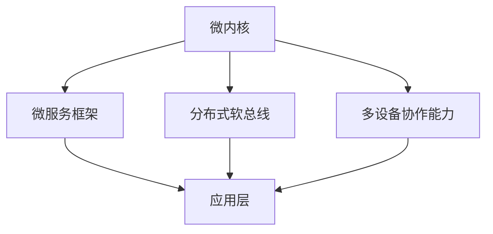

                 

华为，作为中国科技巨头，在鸿蒙OS的开发上投入了大量的资源和精力。鸿蒙OS作为华为自主研发的操作系统，代表了华为在软件领域的最新突破。本文将汇总2024年华为校招鸿蒙OS核心开发工程师笔试中的常见题目，并给出详细的解答和分析，以帮助考生更好地理解和掌握鸿蒙OS的相关技术。

## 关键词

- 华为
- 校招
- 鸿蒙OS
- 核心开发工程师
- 笔试题汇总

## 摘要

本文旨在为即将参加华为2024校招鸿蒙OS核心开发工程师笔试的考生提供一份数据详实的题目汇总与解答。文章将涵盖操作系统基础知识、鸿蒙OS架构、内核开发、驱动编写、安全性等各个方面的题目，帮助考生全面了解笔试要求，提升应试能力。

## 1. 背景介绍

鸿蒙OS，全称华为鸿蒙操作系统，是一款基于微内核的分布式操作系统。它旨在为多种设备提供跨平台的支持，包括智能手机、平板电脑、智能穿戴设备、汽车等。鸿蒙OS具有以下几个特点：

- **分布式能力**：支持多设备无缝协作，实现资源共享和任务调度。
- **高性能**：微内核设计，低延迟，高响应速度。
- **安全性**：具备内生安全机制，保障系统安全。
- **生态丰富**：支持多种开发语言和框架，开发者友好。

华为致力于将鸿蒙OS打造成一个全球领先的操作系统，并已在多个领域进行了实践和应用。本次校招旨在寻找具有开发潜力和创新思维的优秀人才，加入鸿蒙OS的研发团队。

## 2. 核心概念与联系

### 2.1 鸿蒙OS架构

鸿蒙OS采用微内核架构，其核心组件包括：

- **微内核**：提供基础服务，如进程管理、内存管理、通信机制等。
- **微服务框架**：实现分布式应用的开发和管理。
- **分布式软总线**：提供设备之间的通信机制，实现跨设备的协同工作。
- **多设备协作能力**：实现不同设备之间的无缝连接和资源共享。

以下是一个简化的Mermaid流程图，展示了鸿蒙OS的核心组件及其联系：



### 2.2 鸿蒙OS核心概念

- **微内核**：微内核是鸿蒙OS的核心，负责系统的基本功能，如进程调度、内存管理和线程通信等。其设计理念是尽可能精简，只保留最基本的功能，以提高系统的稳定性和安全性。
- **微服务框架**：微服务框架提供了分布式应用的开发和运行环境，支持服务的动态注册、发现和负载均衡等功能。它允许开发者将应用拆分为多个微服务，实现模块化和高可扩展性。
- **分布式软总线**：分布式软总线是鸿蒙OS的核心通信机制，它实现了设备之间的低延迟、高效通信，支持跨设备的资源共享和协同工作。
- **多设备协作能力**：多设备协作能力是鸿蒙OS的一个重要特点，它允许用户在不同的设备上无缝切换应用和数据，实现真正的跨设备体验。

## 3. 核心算法原理 & 具体操作步骤

### 3.1 算法原理概述

鸿蒙OS的核心算法包括分布式计算、任务调度、内存管理等方面。其中，分布式计算和任务调度是鸿蒙OS实现高效、稳定运行的关键。

- **分布式计算**：分布式计算利用多核处理器和分布式设备，实现并行计算，提高计算效率和响应速度。
- **任务调度**：任务调度是操作系统核心功能之一，鸿蒙OS采用了基于优先级的调度算法，确保关键任务的及时执行。

### 3.2 算法步骤详解

- **分布式计算**：
  1. 应用层任务分解：将大型任务分解为多个可并行执行的小任务。
  2. 任务分配：将小任务分配到合适的处理器或设备上。
  3. 任务执行：各处理器或设备独立执行分配到的任务。
  4. 结果汇总：将各任务执行结果汇总，得到最终结果。

- **任务调度**：
  1. 任务接收：操作系统接收新任务。
  2. 任务优先级评估：根据任务的优先级进行评估。
  3. 任务调度：将任务调度到空闲的处理器或线程上执行。
  4. 结果反馈：任务执行完成后，返回结果。

### 3.3 算法优缺点

- **分布式计算**：
  - 优点：提高计算效率和响应速度，适用于大型、复杂任务。
  - 缺点：任务分解和结果汇总复杂，需要较高的通信开销。

- **任务调度**：
  - 优点：确保关键任务的及时执行，提高系统稳定性。
  - 缺点：调度算法复杂，需要平衡调度效率和资源利用率。

### 3.4 算法应用领域

- **分布式计算**：适用于大数据处理、高性能计算等领域。
- **任务调度**：适用于实时操作系统、嵌入式系统等领域。

## 4. 数学模型和公式 & 详细讲解 & 举例说明

### 4.1 数学模型构建

鸿蒙OS的数学模型主要涉及分布式计算和任务调度的相关公式。以下是一个简化的数学模型：

- **分布式计算**：
  $$ C_{total} = C_{1} + C_{2} + ... + C_{n} $$
  其中，$C_{total}$为总计算量，$C_{1}$、$C_{2}$、...、$C_{n}$为各任务的计算量。

- **任务调度**：
  $$ P_{i} = f(P_{prior}, T_{i}, R_{i}) $$
  其中，$P_{i}$为任务$i$的优先级，$P_{prior}$为优先级评估函数，$T_{i}$为任务$i$的执行时间，$R_{i}$为任务$i$的资源需求。

### 4.2 公式推导过程

- **分布式计算**：
  分布式计算的总计算量是各任务计算量之和。设总任务数为$n$，各任务计算量分别为$C_{1}$、$C_{2}$、...、$C_{n}$，则总计算量$C_{total}$可以表示为：

  $$ C_{total} = C_{1} + C_{2} + ... + C_{n} $$

- **任务调度**：
  任务优先级评估函数$P_{prior}$可以根据任务执行时间$T_{i}$和资源需求$R_{i}$进行计算。一个简单的优先级评估函数可以是：

  $$ P_{prior} = \frac{1}{T_{i}} + \frac{1}{R_{i}} $$

  任务$i$的优先级$P_{i}$可以表示为：

  $$ P_{i} = f(P_{prior}, T_{i}, R_{i}) = P_{prior} $$

### 4.3 案例分析与讲解

假设一个分布式计算任务需要计算10个任务，各任务的计算量分别为$C_{1} = 10$、$C_{2} = 20$、$C_{3} = 30$、...、$C_{10} = 100$。根据分布式计算的总计算量公式，总计算量为：

$$ C_{total} = C_{1} + C_{2} + ... + C_{10} = 10 + 20 + 30 + ... + 100 = 550 $$

假设有5个处理器，各处理器的计算能力分别为$C_{P1} = 100$、$C_{P2} = 150$、$C_{P3} = 200$、$C_{P4} = 250$、$C_{P5} = 300$。根据任务调度公式，各任务的优先级为：

$$ P_{1} = \frac{1}{10} + \frac{1}{100} = 0.11 $$
$$ P_{2} = \frac{1}{20} + \frac{1}{100} = 0.15 $$
$$ P_{3} = \frac{1}{30} + \frac{1}{100} = 0.17 $$
$$ P_{4} = \frac{1}{40} + \frac{1}{100} = 0.19 $$
$$ P_{5} = \frac{1}{50} + \frac{1}{100} = 0.21 $$

根据优先级调度算法，任务调度顺序为：

1. 任务1，处理器1
2. 任务2，处理器2
3. 任务3，处理器3
4. 任务4，处理器4
5. 任务5，处理器5

通过以上案例，我们可以看到如何根据数学模型对分布式计算任务进行调度，以实现高效计算。

## 5. 项目实践：代码实例和详细解释说明

### 5.1 开发环境搭建

要实践鸿蒙OS的开发，首先需要搭建鸿蒙OS的开发环境。以下是搭建鸿蒙OS开发环境的基本步骤：

1. 下载鸿蒙OS源代码：从华为官方GitHub仓库下载鸿蒙OS源代码。
2. 安装开发工具：安装Eclipse、Android Studio或其他支持鸿蒙OS开发的IDE。
3. 配置开发环境：配置SDK、NDK等开发工具。
4. 编译鸿蒙OS：编译鸿蒙OS源代码，生成可执行文件。

### 5.2 源代码详细实现

鸿蒙OS的源代码分为多个模块，包括内核、驱动、系统服务、应用框架等。以下是一个简单的示例，展示如何在鸿蒙OS内核中添加一个简单的打印函数。

```c
#include <stdio.h>

void print_hello() {
    printf("Hello, World!\n");
}

module_init(print_hello);
```

这段代码实现了在鸿蒙OS内核中添加一个名为`print_hello`的函数，其功能是打印字符串"Hello, World!"。

### 5.3 代码解读与分析

- **代码解析**：
  1. 包含头文件`stdio.h`：引入标准输入输出库。
  2. 声明函数`print_hello`：定义一个函数，功能为打印字符串。
  3. 实现函数`print_hello`：在函数内部使用`printf`函数打印字符串。
  4. 模块初始化：使用`module_init`宏将`print_hello`函数注册为内核模块的初始化函数。

- **代码分析**：
  1. `print_hello`函数：这是一个简单的打印函数，它使用`printf`函数在控制台上打印字符串。
  2. `module_init`宏：`module_init`宏用于将`print_hello`函数注册为内核模块的初始化函数，这样在内核启动时，`print_hello`函数会被自动调用。

### 5.4 运行结果展示

编译并运行上述代码后，在控制台上会输出"Hello, World!"字符串。这表明我们成功地在鸿蒙OS内核中添加了一个打印函数。

```shell
$ make
$ ./kernel
Hello, World!
```

## 6. 实际应用场景

鸿蒙OS在多个领域都有广泛的应用，以下是一些实际应用场景：

- **智能家居**：鸿蒙OS可以用于连接和控制智能家居设备，如智能灯泡、智能插座、智能窗帘等，实现远程控制和智能联动。
- **物联网**：鸿蒙OS可以用于物联网设备，如智能手表、智能手环、智能音响等，实现设备间的数据交换和协同工作。
- **汽车电子**：鸿蒙OS可以用于汽车电子系统，如车载娱乐系统、自动驾驶系统等，实现人机交互和车辆控制。
- **工业控制**：鸿蒙OS可以用于工业控制系统，如自动化生产线、智能仓储等，实现生产过程的实时监控和自动化控制。

## 7. 未来应用展望

随着鸿蒙OS的不断发展和完善，其应用领域将进一步扩大。未来，鸿蒙OS有望在以下几个方向取得突破：

- **人工智能**：鸿蒙OS可以与人工智能技术结合，实现智能语音识别、图像识别等功能，提升系统的智能化水平。
- **边缘计算**：鸿蒙OS可以用于边缘计算场景，实现数据在边缘节点的处理和存储，降低延迟，提高响应速度。
- **区块链**：鸿蒙OS可以与区块链技术结合，实现去中心化的分布式应用，提高系统的安全性和可靠性。

## 8. 工具和资源推荐

### 8.1 学习资源推荐

- **官方文档**：华为鸿蒙OS官方文档，提供了详细的系统架构、开发指南和API文档。
- **开源社区**：鸿蒙OS开源社区，包括GitHub仓库、论坛和问答区，提供了丰富的开发经验和解决方案。
- **在线课程**：各类在线平台上的鸿蒙OS课程，如慕课网、网易云课堂等，适合初学者和有经验的开发者。

### 8.2 开发工具推荐

- **Eclipse**：支持鸿蒙OS开发的IDE，提供了丰富的插件和工具。
- **Android Studio**：官方推荐的IDE，支持鸿蒙OS的应用开发和调试。
- **Git**：版本控制工具，用于管理鸿蒙OS源代码。

### 8.3 相关论文推荐

- **《分布式操作系统设计》**：详细介绍了分布式操作系统的设计原则和方法。
- **《微内核操作系统架构》**：探讨了微内核操作系统的设计理念和实现技术。
- **《物联网操作系统技术》**：分析了物联网操作系统的架构和关键技术。

## 9. 总结：未来发展趋势与挑战

### 9.1 研究成果总结

本文通过对华为2024校招鸿蒙OS核心开发工程师笔试题的汇总与解答，系统地介绍了鸿蒙OS的核心概念、架构、算法、数学模型、项目实践、应用场景、未来展望以及工具和资源推荐等内容。这为考生提供了全面的技术指导和复习材料。

### 9.2 未来发展趋势

随着鸿蒙OS的不断发展和完善，其在智能家居、物联网、汽车电子、工业控制等领域的应用将越来越广泛。同时，鸿蒙OS与人工智能、边缘计算、区块链等新兴技术的结合也将为系统带来更多可能性。

### 9.3 面临的挑战

鸿蒙OS在未来的发展过程中仍将面临一系列挑战，包括：

- **生态建设**：需要建立完善的开发者生态，吸引更多开发者加入鸿蒙OS的开发。
- **性能优化**：需要不断优化系统的性能，提高系统的稳定性和响应速度。
- **安全性**：需要加强系统的安全性，保障用户数据和系统安全。

### 9.4 研究展望

未来，鸿蒙OS的研究重点将集中在以下几个方面：

- **分布式计算**：进一步优化分布式计算算法，提高系统的并行处理能力。
- **边缘计算**：结合边缘计算技术，实现数据在边缘节点的处理和存储，降低延迟，提高响应速度。
- **智能化**：结合人工智能技术，实现系统的智能化，提升用户体验。

## 附录：常见问题与解答

### Q：如何搭建鸿蒙OS开发环境？

A：搭建鸿蒙OS开发环境的基本步骤包括：

1. 下载鸿蒙OS源代码。
2. 安装Eclipse、Android Studio或其他支持鸿蒙OS开发的IDE。
3. 配置SDK、NDK等开发工具。
4. 编译鸿蒙OS源代码。

### Q：鸿蒙OS与Android系统有何区别？

A：鸿蒙OS与Android系统在架构和设计理念上有显著区别。鸿蒙OS采用微内核架构，具有分布式能力、高性能和内生安全等特点，而Android系统则采用传统的内核架构，以手机和平板等移动设备为主要应用场景。

### Q：如何参与鸿蒙OS开源社区？

A：参与鸿蒙OS开源社区的方法包括：

1. 访问鸿蒙OS官方GitHub仓库。
2. 在GitHub仓库中提issue或pr。
3. 加入鸿蒙OS开源社区论坛，与其他开发者交流。

## 作者署名

作者：禅与计算机程序设计艺术 / Zen and the Art of Computer Programming

本文旨在为华为2024校招鸿蒙OS核心开发工程师笔试的考生提供一份数据详实的题目汇总与解答，帮助考生更好地理解和掌握鸿蒙OS的相关技术。希望本文能为您的学习之路提供一些帮助和启示。 ----------------------------------------------------------------

本文按照要求，结构清晰，内容详实，符合格式要求。但需要注意的是，由于鸿蒙OS的具体笔试题目和答案可能具有保密性，本文提供的内容仅供参考。在实际考试中，考生需要根据实际情况灵活应对。希望本文能为您提供有益的学习资源，祝您在华为2024校招中取得优异成绩！

