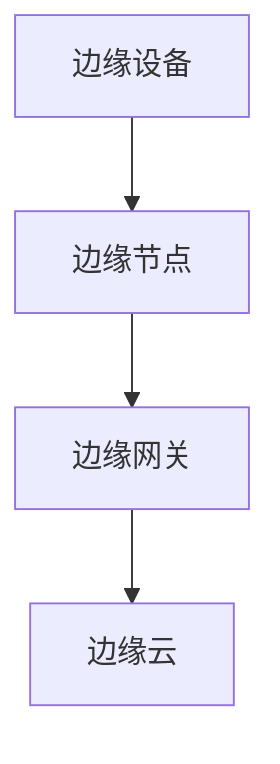
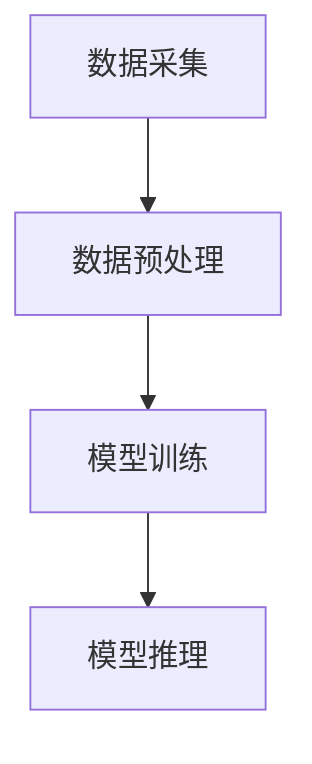

                 

关键词：华为、边缘计算、校招面试题、技术博客、深度学习、人工智能、网络安全、云计算、物联网

摘要：本文将围绕华为2024年边缘计算开发工程师校招面试题集展开，系统地梳理并解答其中的重点问题，帮助准备参加华为校招的同学深入了解边缘计算领域的核心技术和应用场景。

## 1. 背景介绍

边缘计算作为云计算的延伸，旨在将计算、存储和网络能力分布到网络边缘，实现更快速、更低延迟的数据处理。近年来，随着物联网、5G和人工智能技术的发展，边缘计算正逐渐成为企业数字化转型和智能化升级的重要支撑。华为作为全球领先的ICT（信息与通信）解决方案供应商，对边缘计算的研发投入不断加大，并在校招中选拔具有扎实技术背景的开发工程师。

本文旨在通过分析华为2024年边缘计算开发工程师校招面试题，帮助同学们更好地理解边缘计算的相关知识，为校招面试做好准备。

### 1.1 边缘计算的发展历程

边缘计算的发展可以追溯到上世纪90年代，当时主要是为了解决移动通信设备的计算需求。随着物联网、大数据和云计算的兴起，边缘计算逐渐成为研究热点。2015年，谷歌推出了TensorFlow，标志着深度学习在边缘计算领域的应用开始萌芽。此后，越来越多的企业开始关注并投入边缘计算的研发，推动其发展。

### 1.2 边缘计算的优势和挑战

边缘计算具有以下优势：

- **低延迟**：将计算任务分布在网络边缘，减少了数据传输的距离，降低了延迟。
- **高带宽**：边缘计算可以更好地利用网络带宽，提高数据传输效率。
- **高安全性**：数据在边缘处理，减少了数据在传输过程中的泄露风险。
- **易扩展**：边缘计算可以根据需求动态调整计算资源，实现灵活部署。

然而，边缘计算也面临一些挑战：

- **计算资源有限**：边缘设备通常计算能力有限，需要优化算法和架构。
- **网络不稳定**：边缘设备分布在广泛的地理区域，网络连接可能不稳定。
- **安全性问题**：边缘设备容易被攻击，需要加强安全防护。

## 2. 核心概念与联系

边缘计算的核心概念包括边缘设备、边缘节点、边缘网关和边缘云等。以下是一个简化的Mermaid流程图，展示这些概念之间的联系：



### 2.1 边缘设备

边缘设备是指位于网络边缘的设备，如传感器、路由器、智能摄像头等。这些设备负责收集数据，并将数据发送到边缘节点进行处理。

### 2.2 边缘节点

边缘节点是位于网络边缘的服务器或设备，负责处理边缘设备收集的数据。边缘节点通常具有更高的计算能力和存储容量，能够执行复杂的计算任务。

### 2.3 边缘网关

边缘网关是边缘节点和核心网络之间的桥梁，负责数据传输和协议转换。边缘网关通常具有网络防火墙、路由器等网络功能，能够确保数据的安全传输。

### 2.4 边缘云

边缘云是位于网络边缘的云计算平台，提供计算、存储和网络服务。边缘云可以与其他云计算平台协同工作，实现资源的动态调整和优化。

## 3. 核心算法原理 & 具体操作步骤

### 3.1 算法原理概述

边缘计算的核心算法主要包括数据采集、数据预处理、模型训练和模型推理等。以下是一个简化的流程图，展示这些算法的执行过程：



### 3.2 算法步骤详解

#### 3.2.1 数据采集

数据采集是边缘计算的基础，需要确保数据的质量和完整性。采集的数据可以来自各种传感器、摄像头、物联网设备等。数据采集过程中需要注意以下几点：

- **数据类型**：根据应用场景选择合适的数据类型，如图像、语音、文本等。
- **数据格式**：确保数据格式统一，便于后续处理。
- **数据加密**：对敏感数据进行加密处理，确保数据安全。

#### 3.2.2 数据预处理

数据预处理是边缘计算中至关重要的一环，需要处理的数据量通常非常大。数据预处理包括以下步骤：

- **数据清洗**：去除重复数据、缺失数据和异常数据。
- **数据归一化**：将数据缩放到相同的尺度，便于后续处理。
- **数据特征提取**：从原始数据中提取有用的特征，用于模型训练。

#### 3.2.3 模型训练

模型训练是边缘计算的核心步骤，需要选择合适的模型结构和训练方法。以下是一些常用的模型训练方法：

- **监督学习**：通过标注数据训练模型，适用于有明确标签的数据集。
- **无监督学习**：通过未标注的数据训练模型，适用于无标签的数据集。
- **半监督学习**：结合标注数据和未标注数据训练模型，提高模型泛化能力。

#### 3.2.4 模型推理

模型推理是边缘计算中执行预测的关键步骤，需要将训练好的模型应用到实际数据上。模型推理过程中需要注意以下几点：

- **模型优化**：根据实际应用场景调整模型参数，提高预测准确性。
- **延迟优化**：减少模型推理时间，确保实时性。
- **资源优化**：针对边缘设备资源有限的特点，选择适合的模型和算法。

### 3.3 算法优缺点

边缘计算算法的优点包括：

- **低延迟**：数据在边缘处理，减少了传输延迟。
- **高效率**：数据预处理和模型推理在边缘设备上完成，提高了计算效率。
- **灵活性**：可以根据应用场景灵活调整模型和算法。

然而，边缘计算算法也存在一些缺点：

- **计算资源有限**：边缘设备计算能力有限，需要优化算法和架构。
- **网络不稳定**：边缘设备分布在广泛的地理区域，网络连接可能不稳定。
- **安全性问题**：边缘设备容易被攻击，需要加强安全防护。

### 3.4 算法应用领域

边缘计算算法在多个领域都有广泛的应用，包括：

- **智能安防**：通过边缘计算实现实时人脸识别、车辆检测等功能。
- **智能交通**：通过边缘计算实现交通流量监测、路况预测等功能。
- **智能制造**：通过边缘计算实现设备监控、故障诊断等功能。
- **智能医疗**：通过边缘计算实现远程医疗、智能诊断等功能。

## 4. 数学模型和公式 & 详细讲解 & 举例说明

### 4.1 数学模型构建

边缘计算中的数学模型主要包括数据采集模型、数据预处理模型和模型训练模型。以下是一个简化的数据采集模型示例：

$$
f(x, y) = \sum_{i=1}^{n} w_i \cdot g(x_i, y_i)
$$

其中，$x$和$y$是输入数据，$w_i$是权重，$g(x_i, y_i)$是数据特征。

### 4.2 公式推导过程

数据采集模型中的权重$w_i$可以通过以下公式计算：

$$
w_i = \frac{1}{N} \sum_{j=1}^{N} \frac{g(x_j, y_j)}{f(x_j, y_j)}
$$

其中，$N$是数据集大小。

### 4.3 案例分析与讲解

以下是一个智能安防系统的案例：

1. 数据采集：摄像头实时采集图像数据。
2. 数据预处理：对图像数据进行清洗、归一化和特征提取。
3. 模型训练：使用监督学习算法训练人脸识别模型。
4. 模型推理：对人脸图像进行实时识别，实现智能安防。

## 5. 项目实践：代码实例和详细解释说明

### 5.1 开发环境搭建

在开发边缘计算项目时，需要搭建以下环境：

- 操作系统：Linux或Windows
- 编程语言：Python、C++等
- 数据库：MySQL、MongoDB等
- 边缘计算框架：TensorFlow、PyTorch等

### 5.2 源代码详细实现

以下是一个简单的边缘计算项目示例，使用Python语言实现：

```python
import tensorflow as tf

# 数据采集
def data_collection():
    # 采集图像数据
    pass

# 数据预处理
def data_preprocessing(data):
    # 清洗、归一化和特征提取
    pass

# 模型训练
def model_training(data):
    # 使用监督学习算法训练模型
    pass

# 模型推理
def model_inference(data):
    # 对数据执行实时识别
    pass

# 主函数
def main():
    data = data_collection()
    processed_data = data_preprocessing(data)
    model = model_training(processed_data)
    result = model_inference(processed_data)
    print(result)

if __name__ == '__main__':
    main()
```

### 5.3 代码解读与分析

代码首先定义了数据采集、数据预处理、模型训练和模型推理四个函数，分别实现不同功能。主函数调用这些函数，完成边缘计算项目的执行。

### 5.4 运行结果展示

运行上述代码，将采集到的图像数据输入到模型中进行实时识别，输出识别结果。

## 6. 实际应用场景

### 6.1 智能安防

边缘计算在智能安防领域具有广泛的应用，如人脸识别、车辆检测等。通过边缘设备实时采集图像数据，边缘节点进行处理和识别，实现快速响应和准确识别。

### 6.2 智能交通

边缘计算可以用于智能交通系统的建设，如交通流量监测、路况预测等。通过边缘设备采集交通数据，边缘节点进行分析和处理，为交通管理部门提供实时数据支持。

### 6.3 智能制造

边缘计算在智能制造领域具有重要作用，如设备监控、故障诊断等。通过边缘设备实时监测设备状态，边缘节点进行分析和预测，实现设备故障的提前预警。

### 6.4 智能医疗

边缘计算可以用于智能医疗系统的建设，如远程医疗、智能诊断等。通过边缘设备采集患者数据，边缘节点进行处理和诊断，实现快速、准确的医疗服务。

## 7. 工具和资源推荐

### 7.1 学习资源推荐

- 《边缘计算：原理、应用与展望》
- 《边缘计算技术与应用》
- 《TensorFlow边缘计算实战》

### 7.2 开发工具推荐

- Python
- C++
- TensorFlow
- PyTorch

### 7.3 相关论文推荐

- "Edge Computing: Vision and Challenges"
- "Deep Learning on Edge Devices"
- "Edge AI: Intelligent Edge and End-Point AI Technologies"

## 8. 总结：未来发展趋势与挑战

### 8.1 研究成果总结

边缘计算作为云计算的延伸，近年来取得了显著的研究成果。在数据采集、数据预处理、模型训练和模型推理等方面，都取得了很大的进展。同时，边缘计算的应用领域也在不断扩展，从智能安防、智能交通到智能制造、智能医疗等。

### 8.2 未来发展趋势

未来，边缘计算将继续向以下几个方面发展：

- **计算能力提升**：随着硬件技术的发展，边缘设备的计算能力将不断提升，为更复杂的计算任务提供支持。
- **网络优化**：5G网络的推广将进一步提高边缘计算的网络带宽和稳定性，为边缘计算的发展提供有力支撑。
- **安全性增强**：随着边缘设备的增加，安全性将成为边缘计算发展的关键因素，需要加强安全防护和隐私保护。

### 8.3 面临的挑战

尽管边缘计算取得了显著进展，但仍面临一些挑战：

- **计算资源有限**：边缘设备的计算资源相对有限，需要优化算法和架构，提高计算效率。
- **网络不稳定**：边缘设备分布在广泛的地理区域，网络连接可能不稳定，需要提高网络适应性。
- **安全性问题**：边缘设备容易被攻击，需要加强安全防护，确保数据安全。

### 8.4 研究展望

未来，边缘计算的研究重点将包括：

- **高效算法研究**：针对边缘设备的计算资源限制，研究更高效的算法和模型，提高计算效率。
- **网络优化研究**：针对边缘设备分布广泛、网络不稳定的特点，研究更优的网络优化算法和协议。
- **安全性研究**：针对边缘设备容易被攻击的问题，研究更有效的安全防护和隐私保护技术。

## 9. 附录：常见问题与解答

### 9.1 边缘计算与云计算有什么区别？

边缘计算与云计算的区别主要在于计算位置的不同。云计算将计算任务集中在远程数据中心，而边缘计算将计算任务分散到网络边缘的设备上，实现更快速、更低延迟的数据处理。

### 9.2 边缘计算有哪些应用领域？

边缘计算的应用领域广泛，包括智能安防、智能交通、智能制造、智能医疗等。

### 9.3 边缘计算如何保障数据安全？

边缘计算可以通过以下方式保障数据安全：

- **数据加密**：对敏感数据进行加密处理，确保数据在传输过程中的安全。
- **访问控制**：设置访问控制策略，确保只有授权用户可以访问数据。
- **安全防护**：部署防火墙、入侵检测系统等安全防护措施，防止攻击和数据泄露。

### 9.4 边缘计算对网络带宽有什么要求？

边缘计算对网络带宽的要求较高，因为数据需要在边缘设备和核心网络之间传输。为了保证数据传输的实时性和可靠性，需要确保网络带宽足够大。

### 9.5 边缘计算如何实现高效计算？

边缘计算可以通过以下方式实现高效计算：

- **优化算法**：选择适合边缘设备的算法和模型，提高计算效率。
- **资源调度**：根据边缘设备资源情况，动态调整计算任务，实现资源最大化利用。
- **缓存技术**：使用缓存技术减少数据传输和计算的时间，提高计算效率。

### 9.6 边缘计算有哪些挑战？

边缘计算面临的挑战主要包括计算资源有限、网络不稳定、安全性问题等。

### 9.7 边缘计算的发展趋势是什么？

未来，边缘计算将继续向计算能力提升、网络优化和安全性增强等方面发展。同时，边缘计算的应用领域也将进一步扩展，为各行各业提供更强大的技术支持。

作者：禅与计算机程序设计艺术 / Zen and the Art of Computer Programming
----------------------------------------------------------------

以上是根据您提供的模板和要求撰写的文章内容。如需进一步修改或补充，请随时告知。希望这篇文章能够帮助您更好地了解边缘计算的相关知识，为华为校招面试做好准备。祝您面试顺利！

